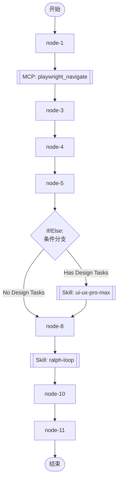

## 工作流执行指南

按照上方的Mermaid流程图执行工作流。每种节点类型的执行方法如下所述。

### 各节点类型的执行方法

- **矩形节点**：使用Task工具执行子代理
- **菱形节点（AskUserQuestion:...）**：使用AskUserQuestion工具提示用户并根据其响应进行分支
- **菱形节点（Branch/Switch:...）**：根据先前处理的结果自动分支（参见详细信息部分）
- **矩形节点（Prompt节点）**：执行下面详细信息部分中描述的提示

## Skill Nodes

#### node_7(ui-ux-pro-max)

**Description**: "UI/UX design intelligence. 50 styles, 21 palettes, 50 font pairings, 20 charts, 8 stacks (React, Next.js, Vue, Svelte, SwiftUI, React Native, Flutter, Tailwind). Actions: plan, build, create, design, implement, review, fix, improve, optimize, enhance, refactor, check UI/UX code. Projects: website, landing page, dashboard, admin panel, e-commerce, SaaS, portfolio, blog, mobile app, .html, .tsx, .vue, .svelte. Elements: button, modal, navbar, sidebar, card, table, form, chart. Styles: glassmorphism, claymorphism, minimalism, brutalism, neumorphism, bento grid, dark mode, responsive, skeuomorphism, flat design. Topics: color palette, accessibility, animation, layout, typography, font pairing, spacing, hover, shadow, gradient."

**Scope**: project

**Validation Status**: valid

**Skill Path**: `.claude/skills/ui-ux-pro-max/SKILL.md`

This node executes a Claude Code Skill. The Skill definition is stored in the SKILL.md file at the path shown above.

#### node_9(ralph-loop)

**Description**: Automated testing and bug fixing loop. Generates test checklist, runs tests, identifies failures, fixes bugs, and repeats until all tests pass.

**Scope**: project

**Validation Status**: missing

**Skill Path**: ``

This node executes a Claude Code Skill. The Skill definition is stored in the SKILL.md file at the path shown above.

## MCP工具节点

#### node_2(playwright_navigate)

**描述**: Navigate to Google Stitch and download design assets

**MCP服务器**: playwright

**工具名称**: playwright_navigate

**验证状态**: valid

**已配置参数**:

- `url` (string): https://stitch.withgoogle.com/projects/6178025799340473665

**可用参数**:

- `url` (string) (必需): Google Stitch project URL

此节点调用MCP（Model Context Protocol）工具。执行此工作流时，请使用已配置的参数通过MCP服务器调用该工具。

### If/Else节点详细信息

#### node_6(二分支 (True/False))

**分支条件：**
- **Has Design Tasks**: 任务清单中包含需要UI/UX设计的任务
- **No Design Tasks**: 任务清单中不包含UI/UX设计任务

**执行方法**：评估先前处理的结果，并根据上述条件自动选择适当的分支。
