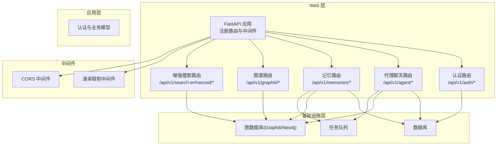
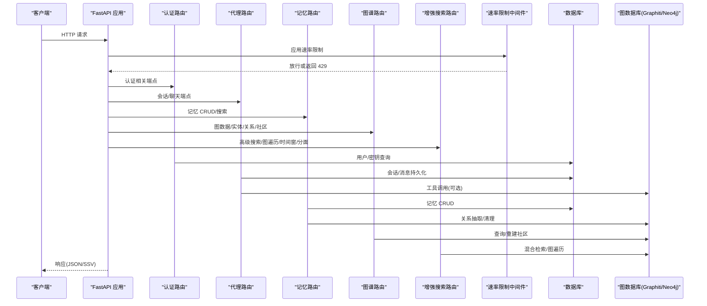
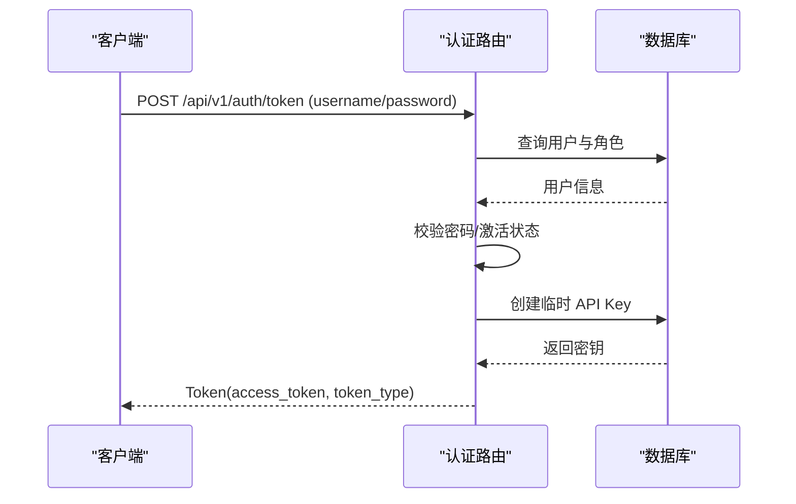
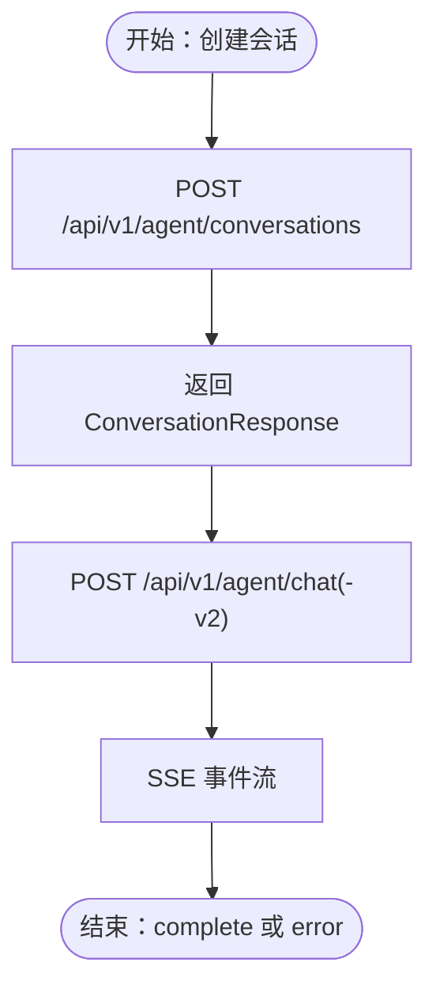
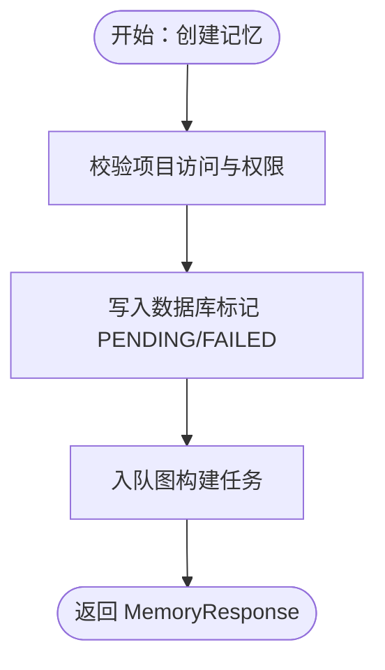
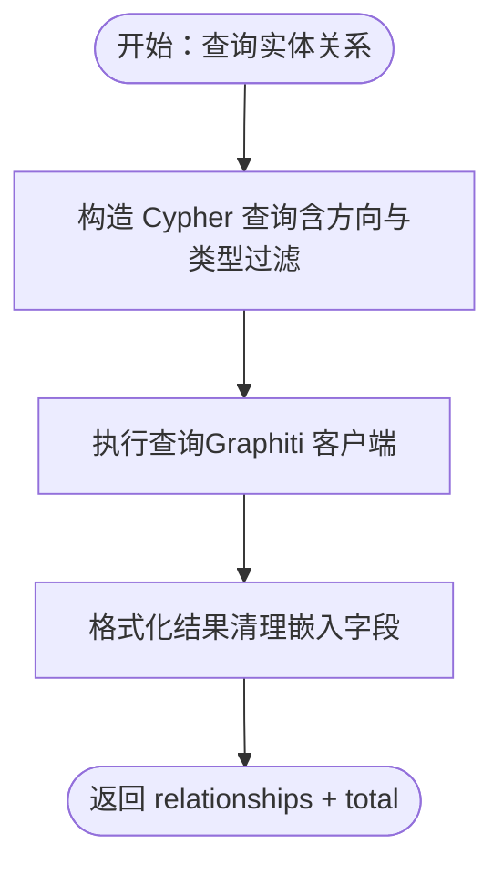
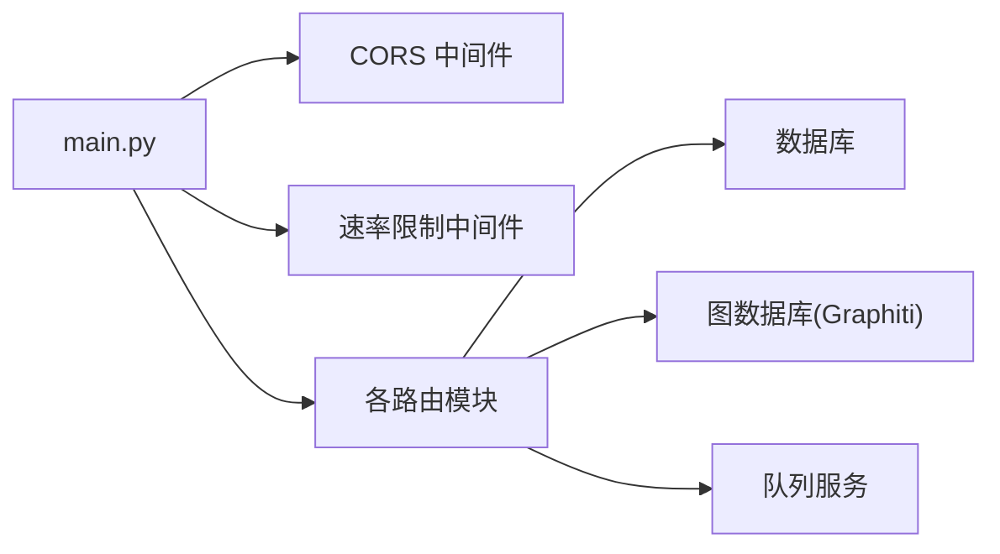

# API 接口参考

<cite>
**本文引用的文件**
- [src/infrastructure/adapters/primary/web/main.py](file://src/infrastructure/adapters/primary/web/main.py)
- [src/infrastructure/adapters/primary/web/routers/auth.py](file://src/infrastructure/adapters/primary/web/routers/auth.py)
- [src/infrastructure/adapters/primary/web/routers/agent.py](file://src/infrastructure/adapters/primary/web/routers/agent.py)
- [src/infrastructure/adapters/primary/web/routers/memories.py](file://src/infrastructure/adapters/primary/web/routers/memories.py)
- [src/infrastructure/adapters/primary/web/routers/graphiti.py](file://src/infrastructure/adapters/primary/web/routers/graphiti.py)
- [src/infrastructure/adapters/primary/web/routers/enhanced_search.py](file://src/infrastructure/adapters/primary/web/routers/enhanced_search.py)
- [src/application/schemas/auth.py](file://src/application/schemas/auth.py)
- [src/infrastructure/middleware/rate_limit.py](file://src/infrastructure/middleware/rate_limit.py)
- [examples/basic_usage.py](file://examples/basic_usage.py)
- [examples/sdk_usage.py](file://examples/sdk_usage.py)
- [sdk/python/README.md](file://sdk/python/README.md)
</cite>

## 目录
1. [简介](#简介)
2. [项目结构](#项目结构)
3. [核心组件](#核心组件)
4. [架构总览](#架构总览)
5. [详细组件分析](#详细组件分析)
6. [依赖分析](#依赖分析)
7. [性能考虑](#性能考虑)
8. [故障排除指南](#故障排除指南)
9. [结论](#结论)
10. [附录](#附录)

## 简介
本文件为 MemStack 的完整 API 接口参考文档，覆盖认证与授权、代理聊天、记忆管理、知识图谱等核心功能模块。文档基于后端 FastAPI 路由实现，提供端点清单、参数说明、请求/响应模式、HTTP 状态码与错误处理策略，并包含认证方法、速率限制、安全注意事项及版本信息。同时提供 Python SDK 使用示例与客户端实现建议。

## 项目结构
后端采用分层与六边形架构，Web 层通过 FastAPI 路由暴露 REST API；中间件负责速率限制与 CORS；应用层定义领域模型与用例；基础设施层对接数据库、图数据库与队列服务。

图表来源
- [src/infrastructure/adapters/primary/web/main.py](file://src/infrastructure/adapters/primary/web/main.py#L244-L276)
- [src/infrastructure/adapters/primary/web/routers/auth.py](file://src/infrastructure/adapters/primary/web/routers/auth.py#L35-L35)
- [src/infrastructure/adapters/primary/web/routers/agent.py](file://src/infrastructure/adapters/primary/web/routers/agent.py#L36-L36)
- [src/infrastructure/adapters/primary/web/routers/memories.py](file://src/infrastructure/adapters/primary/web/routers/memories.py#L32-L32)
- [src/infrastructure/adapters/primary/web/routers/graphiti.py](file://src/infrastructure/adapters/primary/web/routers/graphiti.py#L23-L23)
- [src/infrastructure/adapters/primary/web/routers/enhanced_search.py](file://src/infrastructure/adapters/primary/web/routers/enhanced_search.py#L19-L25)

章节来源
- [src/infrastructure/adapters/primary/web/main.py](file://src/infrastructure/adapters/primary/web/main.py#L135-L276)

## 核心组件
- 认证与授权
  - API 密钥管理：创建、列出、撤销
  - 用户认证：用户名/密码登录换取临时 API Key
  - 当前用户信息：读取与更新
- 代理聊天
  - 会话管理：创建、列出、获取、删除、重命名
  - 聊天流：SSE 实时事件流（think/act/observe/step/complete/error）
  - 工具列表：可用工具枚举
- 记忆管理
  - 记忆 CRUD：创建、查询、更新、删除、重新处理
  - 分享机制：按用户或项目分享，支持过期时间
  - 搜索与过滤：语义/混合检索、时间窗口、实体类型过滤
- 知识图谱
  - 图数据：全局与子图查询
  - 实体与关系：实体列表、详情、关系查询
  - 社区：社区列表、详情、成员、重建

章节来源
- [src/infrastructure/adapters/primary/web/routers/auth.py](file://src/infrastructure/adapters/primary/web/routers/auth.py#L38-L210)
- [src/infrastructure/adapters/primary/web/routers/agent.py](file://src/infrastructure/adapters/primary/web/routers/agent.py#L125-L800)
- [src/infrastructure/adapters/primary/web/routers/memories.py](file://src/infrastructure/adapters/primary/web/routers/memories.py#L183-L800)
- [src/infrastructure/adapters/primary/web/routers/graphiti.py](file://src/infrastructure/adapters/primary/web/routers/graphiti.py#L65-L758)
- [src/infrastructure/adapters/primary/web/routers/enhanced_search.py](file://src/infrastructure/adapters/primary/web/routers/enhanced_search.py#L31-L800)

## 架构总览
下图展示 API 请求从客户端到各路由、中间件与下游服务的交互路径。

图表来源
- [src/infrastructure/adapters/primary/web/main.py](file://src/infrastructure/adapters/primary/web/main.py#L244-L276)
- [src/infrastructure/adapters/primary/web/routers/auth.py](file://src/infrastructure/adapters/primary/web/routers/auth.py#L38-L210)
- [src/infrastructure/adapters/primary/web/routers/agent.py](file://src/infrastructure/adapters/primary/web/routers/agent.py#L125-L800)
- [src/infrastructure/adapters/primary/web/routers/memories.py](file://src/infrastructure/adapters/primary/web/routers/memories.py#L183-L800)
- [src/infrastructure/adapters/primary/web/routers/graphiti.py](file://src/infrastructure/adapters/primary/web/routers/graphiti.py#L65-L758)
- [src/infrastructure/adapters/primary/web/routers/enhanced_search.py](file://src/infrastructure/adapters/primary/web/routers/enhanced_search.py#L31-L800)

## 详细组件分析

### 认证与授权接口
- 终端路径与方法
  - POST /api/v1/auth/token → 获取访问令牌（临时 API Key）
  - POST /api/v1/auth/keys → 创建 API Key
  - GET /api/v1/auth/keys → 列出 API Keys
  - DELETE /api/v1/auth/keys/{key_id} → 撤销 API Key
  - GET /api/v1/users/me 或 /api/v1/auth/me → 获取当前用户信息
  - PUT /api/v1/users/me → 更新当前用户信息
- 认证方式
  - 所有端点需携带 API Key：Authorization: Bearer ms_sk_...
  - 登录端点使用用户名/密码换取临时 API Key
- 参数与响应
  - 登录：表单字段 username/password → Token(access_token, token_type)
  - 创建 API Key：APIKeyCreate(name, permissions, expires_in_days) → APIKeyResponse
  - 列表/撤销：无请求体
  - 用户信息：UserResponse
- 状态码与错误
  - 200/201/204 成功
  - 400：输入校验失败
  - 401：未认证/密码错误/账户非激活
  - 403：权限不足
  - 404：资源不存在
  - 500：服务器内部错误
- 安全与权限
  - API Key 仅在创建时返回一次，后续以掩码形式显示
  - 管理员角色自动获得额外权限
  - 当前用户上下文用于鉴权与授权

图表来源
- [src/infrastructure/adapters/primary/web/routers/auth.py](file://src/infrastructure/adapters/primary/web/routers/auth.py#L38-L95)
- [src/application/schemas/auth.py](file://src/application/schemas/auth.py#L118-L121)

章节来源
- [src/infrastructure/adapters/primary/web/routers/auth.py](file://src/infrastructure/adapters/primary/web/routers/auth.py#L38-L210)
- [src/application/schemas/auth.py](file://src/application/schemas/auth.py#L12-L121)

### 代理聊天接口
- 终端路径与方法
  - POST /api/v1/agent/conversations → 创建会话
  - GET /api/v1/agent/conversations → 列出会话（支持按状态与数量限制）
  - GET /api/v1/agent/conversations/{conversation_id} → 获取会话详情
  - DELETE /api/v1/agent/conversations/{conversation_id} → 删除会话
  - PATCH /api/v1/agent/conversations/{conversation_id}/title → 更新标题
  - POST /api/v1/agent/conversations/{conversation_id}/generate-title → 自动生成标题
  - POST /api/v1/agent/chat → SSE 聊天流（旧版）
  - POST /api/v1/agent/chat-v2 → SSE 聊天流（新版 ReAct 实现）
  - GET /api/v1/agent/tools → 可用工具列表
- SSE 事件类型
  - message、thought、act、observe、step_start、step_end、complete、error
  - 客户端应优雅处理断开与重连
- 参数与响应
  - 创建/获取/删除/重命名会话：ConversationResponse
  - 聊天流：EventSourceResponse，事件体为 JSON 对象
  - 工具列表：ToolsListResponse
- 状态码与错误
  - 200/201/204 成功
  - 400/404：会话不存在/参数错误
  - 403：无权限访问会话
  - 500：服务器内部错误
- 会话管理流程

图表来源
- [src/infrastructure/adapters/primary/web/routers/agent.py](file://src/infrastructure/adapters/primary/web/routers/agent.py#L125-L800)

章节来源
- [src/infrastructure/adapters/primary/web/routers/agent.py](file://src/infrastructure/adapters/primary/web/routers/agent.py#L125-L800)

### 记忆管理接口
- 终端路径与方法
  - POST /api/v1/memories/extract-entities → 规则提取实体
  - POST /api/v1/memories/extract-relationships → 规则提取关系
  - POST /api/v1/memories → 创建记忆（异步入队图构建）
  - GET /api/v1/memories → 列出记忆（支持搜索与分页）
  - GET /api/v1/memories/{memory_id} → 获取记忆
  - PATCH /api/v1/memories/{memory_id} → 更新记忆（乐观锁）
  - DELETE /api/v1/memories/{memory_id} → 删除记忆（图清理+数据库删除）
  - POST /api/v1/memories/{memory_id}/reprocess → 重新处理
  - POST /api/v1/memories/{memory_id}/shares → 分享记忆
  - DELETE /api/v1/memories/{memory_id}/shares/{share_id} → 取消分享
- 参数与响应
  - 创建：MemoryCreate（project_id/title/content/...）→ MemoryResponse
  - 列表：MemoryListResponse（memories,total,page,page_size）
  - 更新：MemoryUpdate（version 必填）→ MemoryResponse
  - 分享：MemoryShareCreate → MemoryShareResponse
- 状态码与错误
  - 200/201/204 成功
  - 400：参数/格式错误
  - 403：无权限
  - 404：资源不存在
  - 409：版本冲突/已在处理中
  - 207：部分成功（图清理失败但数据库已删）
  - 500：服务器内部错误
- 处理流程（创建/更新/删除）

图表来源
- [src/infrastructure/adapters/primary/web/routers/memories.py](file://src/infrastructure/adapters/primary/web/routers/memories.py#L183-L335)

章节来源
- [src/infrastructure/adapters/primary/web/routers/memories.py](file://src/infrastructure/adapters/primary/web/routers/memories.py#L133-L800)

### 知识图谱接口
- 终端路径与方法
  - GET /api/v1/communities → 列出社区（支持最小成员数与分页）
  - GET /api/v1/communities/{community_id} → 社区详情
  - GET /api/v1/communities/{community_id}/members → 社区成员
  - POST /api/v1/communities/rebuild → 重建社区（支持同步/异步）
  - GET /api/v1/entities → 实体列表（支持类型过滤与分页）
  - GET /api/v1/entities/types → 实体类型统计
  - GET /api/v1/entities/{entity_id} → 实体详情
  - GET /api/v1/entities/{entity_id}/relationships → 实体关系
  - GET /api/v1/memory/graph → 全局图数据
  - POST /api/v1/memory/graph/subgraph → 子图查询
- 参数与响应
  - 列表/详情：对应实体/社区模型
  - 子图：SubgraphRequest（node_uuids/include_neighbors/limit/...）
  - 关系：包含方向、分数、目标实体等
- 状态码与错误
  - 200 成功
  - 404：资源不存在
  - 500：服务器内部错误
- 查询流程（实体关系）

图表来源
- [src/infrastructure/adapters/primary/web/routers/graphiti.py](file://src/infrastructure/adapters/primary/web/routers/graphiti.py#L327-L414)

章节来源
- [src/infrastructure/adapters/primary/web/routers/graphiti.py](file://src/infrastructure/adapters/primary/web/routers/graphiti.py#L65-L758)

### 搜索接口
- 终端路径与方法
  - POST /api/v1/search-enhanced/advanced → 高级搜索（策略配方、焦点节点、重排器）
  - POST /api/v1/search-enhanced/graph-traversal → 图遍历搜索
  - POST /api/v1/search-enhanced/community → 社区内搜索
  - POST /api/v1/search-enhanced/temporal → 时间窗搜索
  - POST /api/v1/search-enhanced/faceted → 分面搜索
  - GET /api/v1/search-enhanced/capabilities → 搜索能力说明
  - POST /api/v1/memory/search → 记忆搜索（兼容迁移）
- 参数与响应
  - 高级搜索：strategy、focal_node_uuid、reranker、limit、filters
  - 图遍历：start_entity_uuid、max_depth、relationship_types、limit
  - 时间窗：since/until、limit、tenant_id
  - 分面：entity_types/tags/since/limit/offset、tenant_id
  - 记忆搜索：query、limit、project_id/tenant_id
- 状态码与错误
  - 200 成功
  - 400：日期格式/必需参数错误
  - 500：服务器内部错误

章节来源
- [src/infrastructure/adapters/primary/web/routers/enhanced_search.py](file://src/infrastructure/adapters/primary/web/routers/enhanced_search.py#L31-L800)

## 依赖分析
- 路由注册与中间件
  - 主应用在启动阶段注册全部路由并启用 CORS 与速率限制
  - 速率限制按端点类型差异化配置
- 依赖注入容器
  - 通过 DIContainer 注入数据库会话、图服务、Redis 客户端等
- 下游服务
  - 认证/代理/记忆/图谱/搜索均依赖数据库与图数据库
  - 记忆处理通过队列服务异步执行

图表来源
- [src/infrastructure/adapters/primary/web/main.py](file://src/infrastructure/adapters/primary/web/main.py#L228-L276)
- [src/infrastructure/middleware/rate_limit.py](file://src/infrastructure/middleware/rate_limit.py#L43-L85)

章节来源
- [src/infrastructure/adapters/primary/web/main.py](file://src/infrastructure/adapters/primary/web/main.py#L228-L276)
- [src/infrastructure/middleware/rate_limit.py](file://src/infrastructure/middleware/rate_limit.py#L23-L96)

## 性能考虑
- 速率限制
  - 默认 200/分钟；代理聊天更严格；搜索与图谱次之
  - 建议客户端实现指数退避与重试
- 异步处理
  - 记忆创建与更新可能触发图构建任务，建议使用 SSE 或轮询任务状态
- 图查询优化
  - 使用焦点节点与关系类型过滤减少结果集
  - 控制 limit 与分页 offset
- 缓存与重用
  - 对热点查询结果进行缓存（客户端侧）
  - 复用 API Key 与会话上下文

## 故障排除指南
- 常见错误与排查
  - 401 未认证：检查 Authorization 头是否正确携带 API Key
  - 403 权限不足：确认用户角色与项目/记忆权限
  - 404 资源不存在：核对 ID 是否正确
  - 409 版本冲突：更新前先拉取最新版本号
  - 429 速率限制：降低请求频率或升级配额
  - 5xx 服务器错误：查看日志并重试，必要时联系支持
- SSE 连接问题
  - 客户端需实现断线重连与事件去重
  - 注意服务端在序列化异常时会发送 error 事件

章节来源
- [src/infrastructure/adapters/primary/web/routers/agent.py](file://src/infrastructure/adapters/primary/web/routers/agent.py#L325-L443)
- [src/infrastructure/middleware/rate_limit.py](file://src/infrastructure/middleware/rate_limit.py#L76-L83)

## 结论
本文档提供了 MemStack 的完整 API 参考，涵盖认证、代理聊天、记忆管理与知识图谱四大模块。建议在生产环境中结合速率限制、SSE 断线重连与缓存策略，确保稳定与高性能的服务体验。

## 附录

### 认证与速率限制
- 认证
  - 方式：Bearer API Key（ms_sk_...）
  - 获取：POST /api/v1/auth/token（用户名/密码）
  - 管理：创建/列出/撤销 API Key
- 速率限制
  - 默认 200/分钟；代理聊天 30/分钟；搜索 100/分钟
  - 超限时返回 429 并附带 Retry-After

章节来源
- [src/infrastructure/adapters/primary/web/main.py](file://src/infrastructure/adapters/primary/web/main.py#L151-L182)
- [src/infrastructure/middleware/rate_limit.py](file://src/infrastructure/middleware/rate_limit.py#L56-L83)

### 使用示例与客户端实现
- 基础 HTTP 客户端示例
  - 参考：examples/basic_usage.py
- Python SDK 使用
  - 参考：examples/sdk_usage.py 与 sdk/python/README.md
  - 提供同步与异步客户端、错误处理与重试逻辑

章节来源
- [examples/basic_usage.py](file://examples/basic_usage.py#L8-L107)
- [examples/sdk_usage.py](file://examples/sdk_usage.py#L17-L98)
- [sdk/python/README.md](file://sdk/python/README.md#L18-L246)