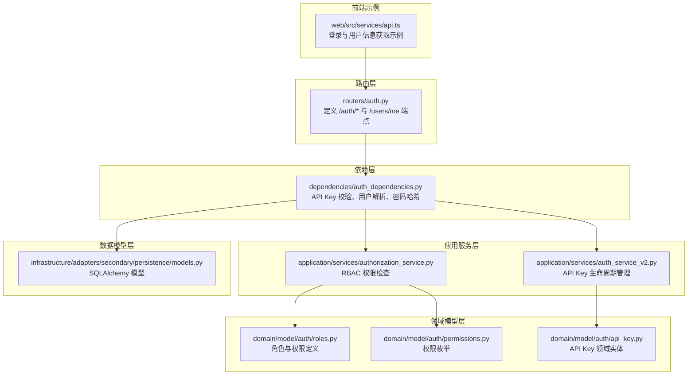
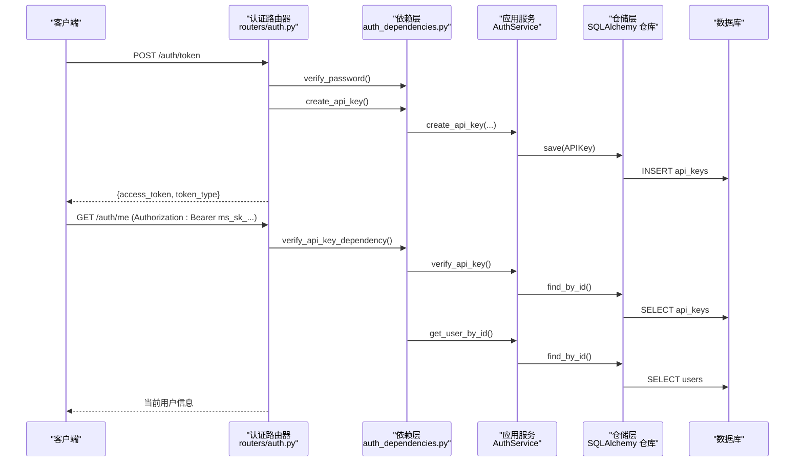
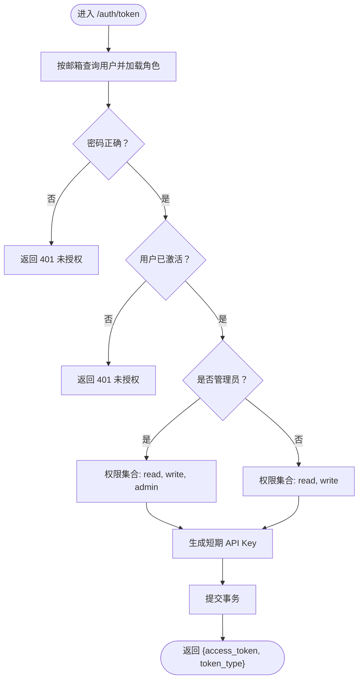
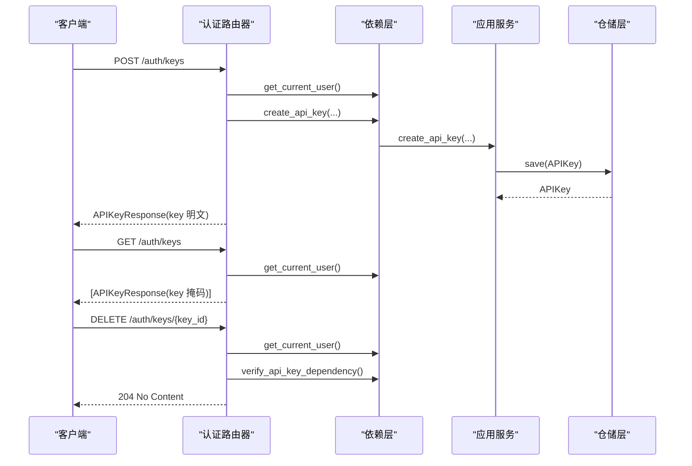
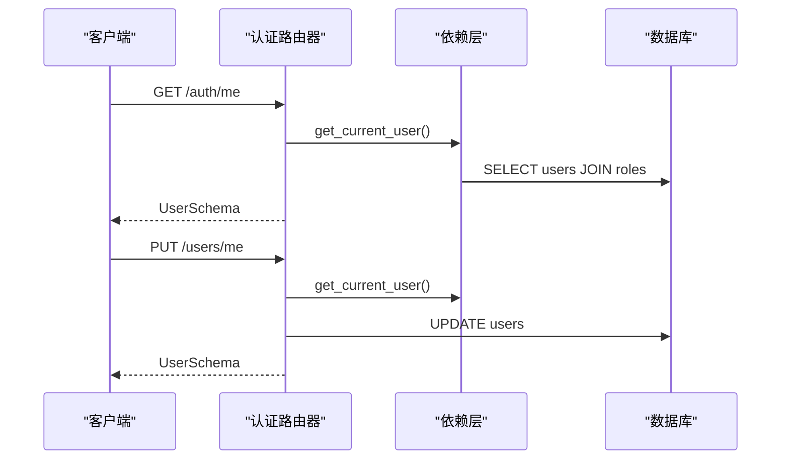
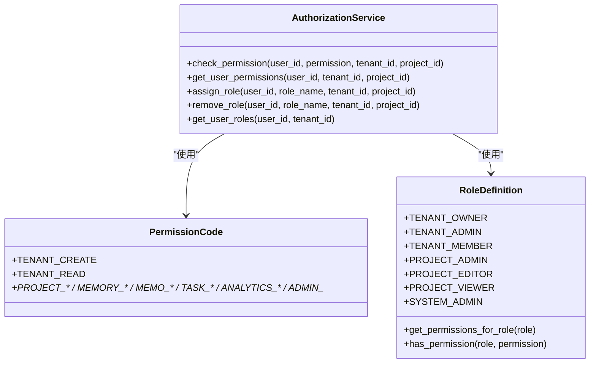
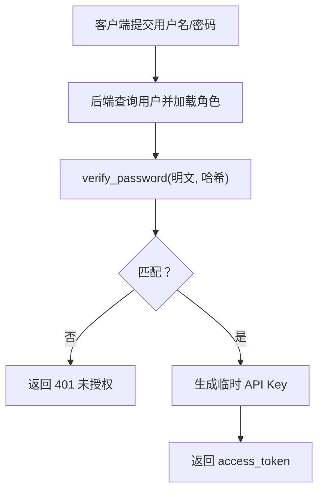
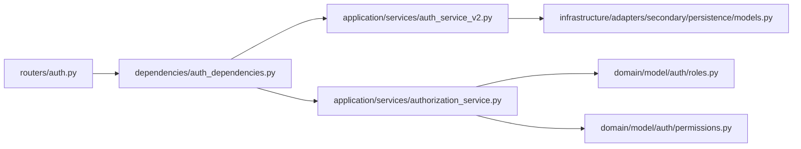

# 认证与授权接口

<cite>
**本文档引用的文件**
- [src/infrastructure/adapters/primary/web/routers/auth.py](file://src/infrastructure/adapters/primary/web/routers/auth.py)
- [src/application/schemas/auth.py](file://src/application/schemas/auth.py)
- [src/infrastructure/adapters/primary/web/dependencies/auth_dependencies.py](file://src/infrastructure/adapters/primary/web/dependencies/auth_dependencies.py)
- [src/domain/model/auth/roles.py](file://src/domain/model/auth/roles.py)
- [src/domain/model/auth/permissions.py](file://src/domain/model/auth/permissions.py)
- [src/application/services/authorization_service.py](file://src/application/services/authorization_service.py)
- [src/domain/model/auth/api_key.py](file://src/domain/model/auth/api_key.py)
- [src/infrastructure/adapters/secondary/persistence/models.py](file://src/infrastructure/adapters/secondary/persistence/models.py)
- [web/src/services/api.ts](file://web/src/services/api.ts)
- [src/tests/integration/security/test_auth.py](file://src/tests/integration/security/test_auth.py)
- [src/tests/unit/use_cases/test_auth_use_cases.py](file://src/tests/unit/use_cases/test_auth_use_cases.py)
</cite>

## 目录
1. [简介](#简介)
2. [项目结构](#项目结构)
3. [核心组件](#核心组件)
4. [架构总览](#架构总览)
5. [详细组件分析](#详细组件分析)
6. [依赖关系分析](#依赖关系分析)
7. [性能考虑](#性能考虑)
8. [故障排除指南](#故障排除指南)
9. [结论](#结论)
10. [附录](#附录)

## 简介
本文件面向开发者与集成方，提供 MemStack 平台认证与授权接口的权威文档。内容覆盖：
- 用户登录认证（/auth/token）
- API 密钥管理（/auth/keys：创建、查询、撤销）
- 用户信息管理（/users/me、/auth/me）
- API Key 认证方式与权限级别（read/write/admin）
- 密码验证流程与用户角色系统
- 登录流程示例、API Key 创建与撤销操作、用户信息更新的调用路径
- 错误处理指南与安全最佳实践

## 项目结构
认证与授权相关代码主要分布在以下层次：
- 路由层：定义 REST 接口与端点
- 依赖层：封装 FastAPI 依赖注入、API Key 提取与校验、用户解析
- 应用服务层：业务逻辑（如 API Key 创建、用户解析、权限检查）
- 领域模型层：权限与角色定义
- 数据模型层：数据库映射（用户、API Key、角色、权限等）

图表来源
- [src/infrastructure/adapters/primary/web/routers/auth.py](file://src/infrastructure/adapters/primary/web/routers/auth.py#L1-L210)
- [src/infrastructure/adapters/primary/web/dependencies/auth_dependencies.py](file://src/infrastructure/adapters/primary/web/dependencies/auth_dependencies.py#L1-L606)
- [src/application/services/auth_service_v2.py](file://src/application/services/auth_service_v2.py#L129-L177)
- [src/application/services/authorization_service.py](file://src/application/services/authorization_service.py#L1-L343)
- [src/domain/model/auth/roles.py](file://src/domain/model/auth/roles.py#L1-L229)
- [src/domain/model/auth/permissions.py](file://src/domain/model/auth/permissions.py#L1-L91)
- [src/domain/model/auth/api_key.py](file://src/domain/model/auth/api_key.py#L1-L20)
- [src/infrastructure/adapters/secondary/persistence/models.py](file://src/infrastructure/adapters/secondary/persistence/models.py#L130-L144)
- [web/src/services/api.ts](file://web/src/services/api.ts#L46-L74)

章节来源
- [src/infrastructure/adapters/primary/web/routers/auth.py](file://src/infrastructure/adapters/primary/web/routers/auth.py#L1-L210)
- [src/infrastructure/adapters/primary/web/dependencies/auth_dependencies.py](file://src/infrastructure/adapters/primary/web/dependencies/auth_dependencies.py#L1-L606)

## 核心组件
- 认证路由器：提供登录、API Key 管理、用户信息读取与更新端点
- API Key 依赖：从请求头提取并校验 API Key，解析当前用户
- 应用服务：负责 API Key 的生成、存储、删除与用户解析
- RBAC 服务：基于角色与权限进行访问控制
- 权限与角色：统一的权限枚举与角色定义
- 数据模型：用户、API Key、角色、权限的数据库映射

章节来源
- [src/infrastructure/adapters/primary/web/routers/auth.py](file://src/infrastructure/adapters/primary/web/routers/auth.py#L38-L210)
- [src/infrastructure/adapters/primary/web/dependencies/auth_dependencies.py](file://src/infrastructure/adapters/primary/web/dependencies/auth_dependencies.py#L80-L189)
- [src/application/services/authorization_service.py](file://src/application/services/authorization_service.py#L27-L343)
- [src/domain/model/auth/roles.py](file://src/domain/model/auth/roles.py#L13-L229)
- [src/domain/model/auth/permissions.py](file://src/domain/model/auth/permissions.py#L11-L91)
- [src/domain/model/auth/api_key.py](file://src/domain/model/auth/api_key.py#L8-L20)
- [src/infrastructure/adapters/secondary/persistence/models.py](file://src/infrastructure/adapters/secondary/persistence/models.py#L130-L144)

## 架构总览
下图展示认证与授权的关键交互流程：客户端通过 /auth/token 获取临时 API Key，随后使用该 API Key 访问受保护资源；API Key 依赖负责校验并解析当前用户。

图表来源
- [src/infrastructure/adapters/primary/web/routers/auth.py](file://src/infrastructure/adapters/primary/web/routers/auth.py#L38-L94)
- [src/infrastructure/adapters/primary/web/dependencies/auth_dependencies.py](file://src/infrastructure/adapters/primary/web/dependencies/auth_dependencies.py#L80-L189)
- [src/application/services/auth_service_v2.py](file://src/application/services/auth_service_v2.py#L129-L177)
- [src/infrastructure/adapters/secondary/persistence/models.py](file://src/infrastructure/adapters/secondary/persistence/models.py#L130-L144)

## 详细组件分析

### 用户登录认证（/auth/token）
- 方法与路径：POST /auth/token
- 请求体：OAuth2PasswordRequestForm（username、password）
- 响应体：Token（access_token、token_type）
- 行为说明：
  - 根据用户名查询用户并加载角色
  - 校验密码哈希
  - 检查用户是否激活
  - 判断是否管理员，决定权限集合（read、write、admin）
  - 生成短期有效的临时 API Key（默认有效期 1 天）
  - 返回 access_token（即 API Key 明文，仅在创建时返回一次）

图表来源
- [src/infrastructure/adapters/primary/web/routers/auth.py](file://src/infrastructure/adapters/primary/web/routers/auth.py#L38-L94)

章节来源
- [src/infrastructure/adapters/primary/web/routers/auth.py](file://src/infrastructure/adapters/primary/web/routers/auth.py#L38-L94)
- [src/infrastructure/adapters/primary/web/dependencies/auth_dependencies.py](file://src/infrastructure/adapters/primary/web/dependencies/auth_dependencies.py#L65-L72)

### API 密钥管理（/auth/keys）
- 创建 API Key（POST /auth/keys）
  - 请求体：APIKeyCreate（name、permissions、expires_in_days）
  - 响应体：APIKeyResponse（key_id、key、name、created_at、expires_at、permissions）
  - 行为：使用当前用户上下文创建 API Key，并仅在创建时返回明文 key
- 查询 API Key（GET /auth/keys）
  - 响应体：APIKeyResponse 数组（key 字段掩码显示）
- 撤销 API Key（DELETE /auth/keys/{key_id}）
  - 行为：校验 key_id 属于当前用户后删除

图表来源
- [src/infrastructure/adapters/primary/web/routers/auth.py](file://src/infrastructure/adapters/primary/web/routers/auth.py#L97-L160)
- [src/infrastructure/adapters/primary/web/dependencies/auth_dependencies.py](file://src/infrastructure/adapters/primary/web/dependencies/auth_dependencies.py#L220-L251)
- [src/application/services/auth_service_v2.py](file://src/application/services/auth_service_v2.py#L129-L177)

章节来源
- [src/infrastructure/adapters/primary/web/routers/auth.py](file://src/infrastructure/adapters/primary/web/routers/auth.py#L97-L160)
- [src/application/schemas/auth.py](file://src/application/schemas/auth.py#L62-L121)
- [src/infrastructure/adapters/primary/web/dependencies/auth_dependencies.py](file://src/infrastructure/adapters/primary/web/dependencies/auth_dependencies.py#L220-L251)

### 用户信息管理（/users/me 与 /auth/me）
- 读取当前用户（GET /users/me 或 /auth/me）
  - 响应体：UserSchema（user_id、email、name、roles、is_active、created_at、profile）
- 更新当前用户（PUT /users/me）
  - 请求体：UserUpdate（name、profile）
  - 行为：更新用户名称；profile 字段当前不持久化至数据库

图表来源
- [src/infrastructure/adapters/primary/web/routers/auth.py](file://src/infrastructure/adapters/primary/web/routers/auth.py#L162-L210)
- [src/application/schemas/auth.py](file://src/application/schemas/auth.py#L38-L112)

章节来源
- [src/infrastructure/adapters/primary/web/routers/auth.py](file://src/infrastructure/adapters/primary/web/routers/auth.py#L162-L210)
- [src/application/schemas/auth.py](file://src/application/schemas/auth.py#L38-L112)

### API Key 认证方式与权限级别
- 认证方式：Authorization 头支持 Bearer 或 Token 前缀，API Key 必须以 ms_sk_ 开头
- 权限级别：
  - read：只读权限
  - write：写入权限
  - admin：管理权限（仅管理员或特定场景具备）
- 角色系统：
  - 系统管理员（SYSTEM_ADMIN）拥有所有权限
  - 其他角色通过 RoleDefinition 与 PermissionCode 组合授予相应权限

图表来源
- [src/domain/model/auth/permissions.py](file://src/domain/model/auth/permissions.py#L11-L91)
- [src/domain/model/auth/roles.py](file://src/domain/model/auth/roles.py#L13-L229)
- [src/application/services/authorization_service.py](file://src/application/services/authorization_service.py#L27-L343)

章节来源
- [src/infrastructure/adapters/primary/web/dependencies/auth_dependencies.py](file://src/infrastructure/adapters/primary/web/dependencies/auth_dependencies.py#L80-L104)
- [src/domain/model/auth/roles.py](file://src/domain/model/auth/roles.py#L13-L229)
- [src/domain/model/auth/permissions.py](file://src/domain/model/auth/permissions.py#L11-L91)
- [src/application/services/authorization_service.py](file://src/application/services/authorization_service.py#L33-L116)

### 密码验证流程
- 登录时使用 verify_password 对比明文密码与用户存储的哈希值
- 密码哈希采用安全算法生成并存储
- 前端示例中通过表单数据提交用户名与密码，随后携带 Bearer Token 调用 /auth/me 获取用户信息

图表来源
- [src/infrastructure/adapters/primary/web/routers/auth.py](file://src/infrastructure/adapters/primary/web/routers/auth.py#L48-L94)
- [src/infrastructure/adapters/primary/web/dependencies/auth_dependencies.py](file://src/infrastructure/adapters/primary/web/dependencies/auth_dependencies.py#L65-L72)
- [web/src/services/api.ts](file://web/src/services/api.ts#L46-L65)

章节来源
- [src/infrastructure/adapters/primary/web/routers/auth.py](file://src/infrastructure/adapters/primary/web/routers/auth.py#L48-L94)
- [src/infrastructure/adapters/primary/web/dependencies/auth_dependencies.py](file://src/infrastructure/adapters/primary/web/dependencies/auth_dependencies.py#L65-L72)
- [web/src/services/api.ts](file://web/src/services/api.ts#L46-L65)

## 依赖关系分析
- 路由器依赖依赖层完成 API Key 校验与用户解析
- 依赖层委托应用服务执行业务逻辑
- 应用服务与仓储层交互，最终落库
- RBAC 服务基于权限与角色定义进行访问决策

图表来源
- [src/infrastructure/adapters/primary/web/routers/auth.py](file://src/infrastructure/adapters/primary/web/routers/auth.py#L1-L35)
- [src/infrastructure/adapters/primary/web/dependencies/auth_dependencies.py](file://src/infrastructure/adapters/primary/web/dependencies/auth_dependencies.py#L1-L606)
- [src/application/services/auth_service_v2.py](file://src/application/services/auth_service_v2.py#L129-L177)
- [src/application/services/authorization_service.py](file://src/application/services/authorization_service.py#L27-L343)
- [src/domain/model/auth/roles.py](file://src/domain/model/auth/roles.py#L13-L229)
- [src/domain/model/auth/permissions.py](file://src/domain/model/auth/permissions.py#L11-L91)
- [src/infrastructure/adapters/secondary/persistence/models.py](file://src/infrastructure/adapters/secondary/persistence/models.py#L130-L144)

章节来源
- [src/infrastructure/adapters/primary/web/routers/auth.py](file://src/infrastructure/adapters/primary/web/routers/auth.py#L1-L35)
- [src/infrastructure/adapters/primary/web/dependencies/auth_dependencies.py](file://src/infrastructure/adapters/primary/web/dependencies/auth_dependencies.py#L1-L606)

## 性能考虑
- API Key 校验：依赖层对 API Key 进行哈希比对与过期检查，建议在网关层或中间件缓存近期活跃 Key 的校验结果以降低数据库压力
- 用户角色加载：用户信息读取时会联结加载角色，建议在高频读取场景下对用户角色做轻量缓存
- 密码哈希：使用安全算法，避免在热点路径重复计算
- 分页与限制：API Key 列表默认分页（limit=50），避免一次性返回过多数据

## 故障排除指南
- 401 未授权
  - 可能原因：用户名/密码错误、用户未激活、API Key 格式不正确或无效
  - 处理建议：确认凭据与 API Key 前缀；检查用户状态；核对 API Key 是否过期
- 403 禁止访问
  - 可能原因：用户无对应权限
  - 处理建议：检查用户角色与权限映射；确认租户/项目上下文
- 404 未找到
  - 可能原因：API Key 不存在或不属于当前用户
  - 处理建议：重新创建 API Key；确保使用正确的用户上下文
- 422 参数校验失败
  - 可能原因：请求体字段缺失或类型不符
  - 处理建议：对照 API Schema 校验请求体

章节来源
- [src/infrastructure/adapters/primary/web/routers/auth.py](file://src/infrastructure/adapters/primary/web/routers/auth.py#L63-L74)
- [src/infrastructure/adapters/primary/web/dependencies/auth_dependencies.py](file://src/infrastructure/adapters/primary/web/dependencies/auth_dependencies.py#L84-L104)
- [src/application/services/authorization_service.py](file://src/application/services/authorization_service.py#L33-L66)

## 结论
本认证与授权体系以 API Key 为核心凭证，结合 RBAC 实现细粒度权限控制。登录流程简洁高效，API Key 生命周期管理完善，用户信息与角色权限清晰分离。建议在生产环境中启用 HTTPS、定期轮换 API Key、限制访问频率并监控异常行为。

## 附录

### API 端点一览与规范

- POST /auth/token
  - 请求体：OAuth2PasswordRequestForm（username、password）
  - 成功响应：Token（access_token、token_type）
  - 失败响应：401 未授权（用户名/密码错误或用户未激活）
- POST /auth/keys
  - 请求体：APIKeyCreate（name、permissions、expires_in_days）
  - 成功响应：APIKeyResponse（包含明文 key，仅创建时可见）
  - 失败响应：400/422（参数错误）
- GET /auth/keys
  - 成功响应：APIKeyResponse 数组（key 字段掩码显示）
- DELETE /auth/keys/{key_id}
  - 成功响应：204 No Content
  - 失败响应：404（未找到）
- GET /users/me 或 /auth/me
  - 成功响应：UserSchema
- PUT /users/me
  - 请求体：UserUpdate（name、profile）
  - 成功响应：UserSchema

章节来源
- [src/infrastructure/adapters/primary/web/routers/auth.py](file://src/infrastructure/adapters/primary/web/routers/auth.py#L38-L210)
- [src/application/schemas/auth.py](file://src/application/schemas/auth.py#L62-L121)

### 安全最佳实践
- 使用 HTTPS 传输，避免明文泄露
- API Key 前缀必须为 ms_sk_，严格校验
- 合理设置过期时间，定期轮换
- 最小权限原则：仅授予必要权限
- 记录审计日志，监控异常访问

### 测试参考
- 单元测试覆盖 API Key 生成、哈希、过期逻辑与用户创建
- 集成测试覆盖 API Key 创建与用户生命周期

章节来源
- [src/tests/unit/use_cases/test_auth_use_cases.py](file://src/tests/unit/use_cases/test_auth_use_cases.py#L16-L291)
- [src/tests/integration/security/test_auth.py](file://src/tests/integration/security/test_auth.py#L19-L107)