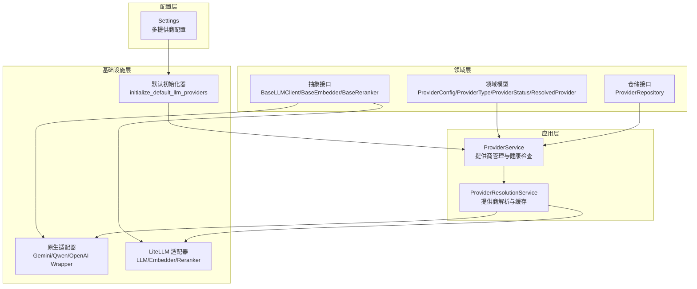
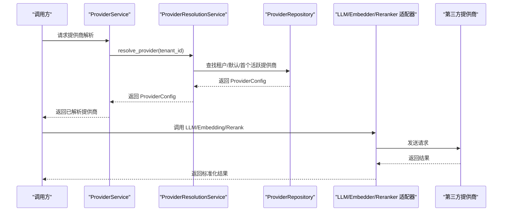
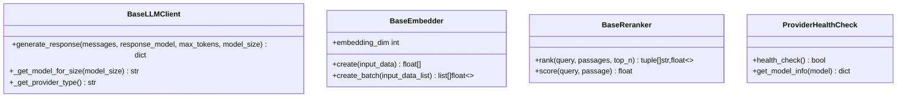
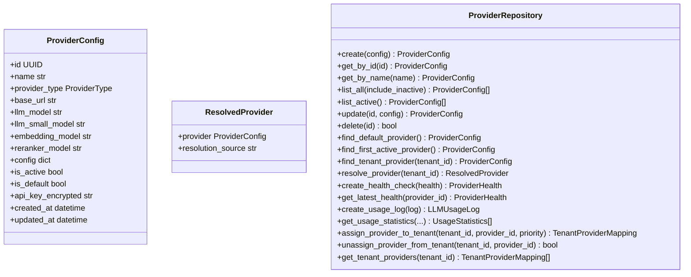
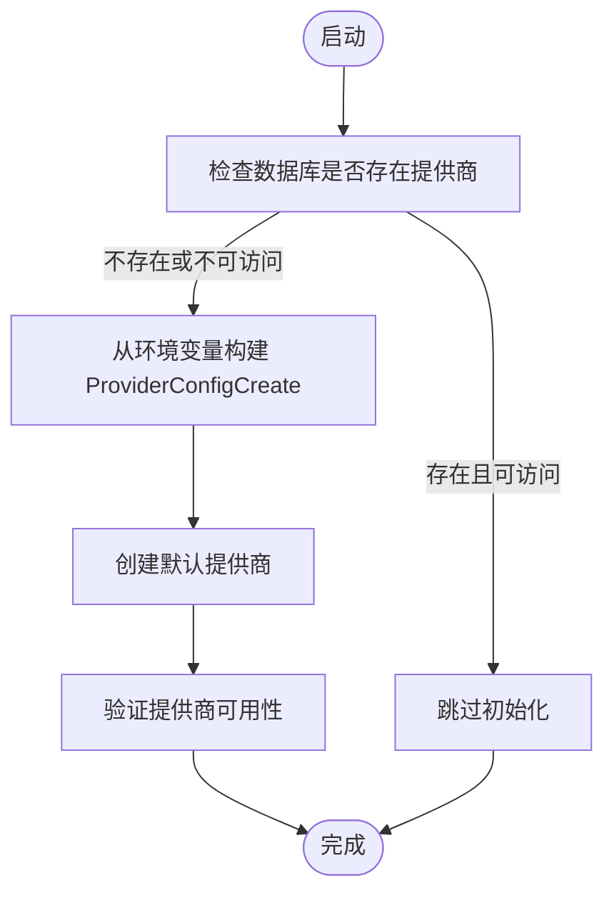
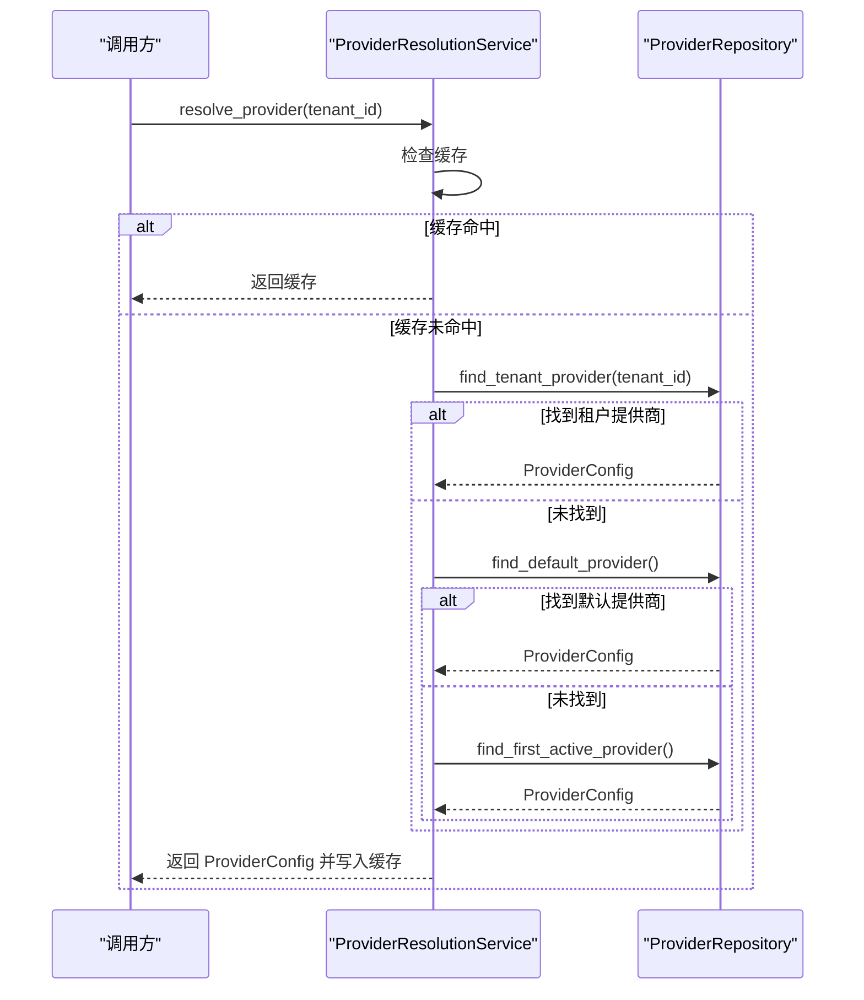
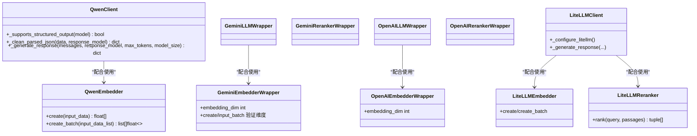
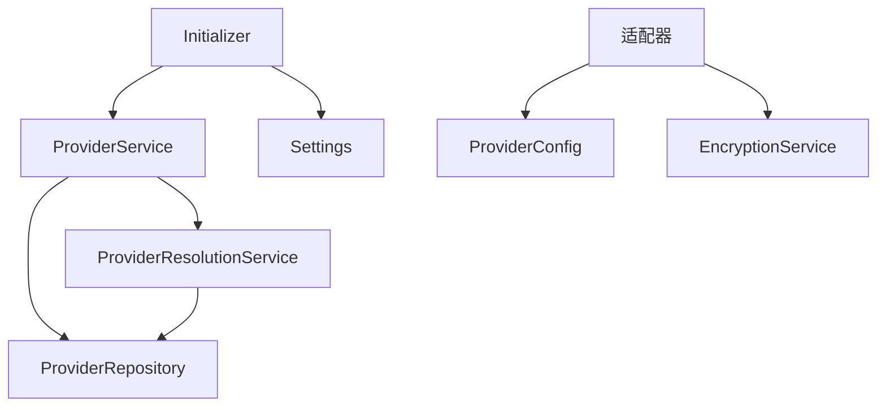

# LLM 提供商集成

<cite>
**本文引用的文件**
- [src/domain/llm_providers/base.py](file://src/domain/llm_providers/base.py)
- [src/domain/llm_providers/models.py](file://src/domain/llm_providers/models.py)
- [src/domain/llm_providers/repositories.py](file://src/domain/llm_providers/repositories.py)
- [src/infrastructure/llm/initializer.py](file://src/infrastructure/llm/initializer.py)
- [src/configuration/config.py](file://src/configuration/config.py)
- [src/infrastructure/llm/gemini/gemini_wrapper.py](file://src/infrastructure/llm/gemini/gemini_wrapper.py)
- [src/infrastructure/llm/qwen/qwen_client.py](file://src/infrastructure/llm/qwen/qwen_client.py)
- [src/infrastructure/llm/openai/openai_wrapper.py](file://src/infrastructure/llm/openai/openai_wrapper.py)
- [src/infrastructure/llm/litellm/litellm_client.py](file://src/infrastructure/llm/litellm/litellm_client.py)
- [src/application/services/provider_service.py](file://src/application/services/provider_service.py)
- [src/application/services/provider_resolution_service.py](file://src/application/services/provider_resolution_service.py)
- [src/infrastructure/llm/qwen/qwen_embedder.py](file://src/infrastructure/llm/qwen/qwen_embedder.py)
- [src/infrastructure/llm/litellm/litellm_embedder.py](file://src/infrastructure/llm/litellm/litellm_embedder.py)
- [src/infrastructure/llm/litellm/litellm_reranker.py](file://src/infrastructure/llm/litellm/litellm_reranker.py)
- [examples/basic_usage.py](file://examples/basic_usage.py)
</cite>

## 目录
1. [简介](#简介)
2. [项目结构](#项目结构)
3. [核心组件](#核心组件)
4. [架构总览](#架构总览)
5. [详细组件分析](#详细组件分析)
6. [依赖关系分析](#依赖关系分析)
7. [性能考量](#性能考量)
8. [故障排查指南](#故障排查指南)
9. [结论](#结论)
10. [附录](#附录)

## 简介
本文件面向 MemStack 的 LLM 提供商集成，系统性阐述多提供商架构的设计与实现，覆盖抽象层设计、配置管理、错误处理、嵌入与重排序系统、提供商切换与缓存、以及配置示例与最佳实践。重点包括：
- 抽象层：统一 LLM、Embedder、Reranker 的接口契约，保证不同提供商的一致行为。
- 配置管理：ProviderConfig 的域模型、数据库持久化与默认初始化流程。
- 错误处理：速率限制、解密失败、健康检查、降级与回退策略。
- 嵌入与重排序：Qwen、Gemini、OpenAI 的原生适配器与 LiteLLM 统一适配器。
- 提供商解析：租户优先、默认提供商、首个活跃提供商的三层回退与缓存。
- 性能优化：缓存、批处理、维度校验、超时与重试。

## 项目结构
MemStack 的 LLM 提供商集成采用分层架构：
- 领域层(domain)：定义抽象接口与领域模型（ProviderConfig、ProviderType、ProviderStatus、ResolvedProvider 等）。
- 应用层(application)：业务服务（ProviderService、ProviderResolutionService）协调领域与基础设施。
- 基础设施层(infrastructure)：各提供商的原生适配器（Gemini、Qwen、OpenAI）与 LiteLLM 统一适配器；默认初始化器负责从环境变量创建默认提供商。
- 配置层(configuration)：Settings 提供统一配置入口，支持多提供商参数。
- 示例层(examples)：基础使用示例展示 API 调用流程。

图示来源
- [src/domain/llm_providers/base.py](file://src/domain/llm_providers/base.py#L16-L212)
- [src/domain/llm_providers/models.py](file://src/domain/llm_providers/models.py#L16-L258)
- [src/domain/llm_providers/repositories.py](file://src/domain/llm_providers/repositories.py#L25-L143)
- [src/application/services/provider_service.py](file://src/application/services/provider_service.py#L38-L433)
- [src/application/services/provider_resolution_service.py](file://src/application/services/provider_resolution_service.py#L24-L162)
- [src/infrastructure/llm/gemini/gemini_wrapper.py](file://src/infrastructure/llm/gemini/gemini_wrapper.py#L35-L257)
- [src/infrastructure/llm/qwen/qwen_client.py](file://src/infrastructure/llm/qwen/qwen_client.py#L42-L518)
- [src/infrastructure/llm/openai/openai_wrapper.py](file://src/infrastructure/llm/openai/openai_wrapper.py#L39-L270)
- [src/infrastructure/llm/litellm/litellm_client.py](file://src/infrastructure/llm/litellm/litellm_client.py#L24-L336)
- [src/infrastructure/llm/initializer.py](file://src/infrastructure/llm/initializer.py#L29-L207)
- [src/configuration/config.py](file://src/configuration/config.py#L10-L231)

章节来源
- [src/domain/llm_providers/base.py](file://src/domain/llm_providers/base.py#L16-L212)
- [src/domain/llm_providers/models.py](file://src/domain/llm_providers/models.py#L16-L258)
- [src/domain/llm_providers/repositories.py](file://src/domain/llm_providers/repositories.py#L25-L143)
- [src/application/services/provider_service.py](file://src/application/services/provider_service.py#L38-L433)
- [src/application/services/provider_resolution_service.py](file://src/application/services/provider_resolution_service.py#L24-L162)
- [src/infrastructure/llm/gemini/gemini_wrapper.py](file://src/infrastructure/llm/gemini/gemini_wrapper.py#L35-L257)
- [src/infrastructure/llm/qwen/qwen_client.py](file://src/infrastructure/llm/qwen/qwen_client.py#L42-L518)
- [src/infrastructure/llm/openai/openai_wrapper.py](file://src/infrastructure/llm/openai/openai_wrapper.py#L39-L270)
- [src/infrastructure/llm/litellm/litellm_client.py](file://src/infrastructure/llm/litellm/litellm_client.py#L24-L336)
- [src/infrastructure/llm/initializer.py](file://src/infrastructure/llm/initializer.py#L29-L207)
- [src/configuration/config.py](file://src/configuration/config.py#L10-L231)

## 核心组件
- 抽象层接口
  - BaseLLMClient：统一生成响应、模型选择、提供商类型标识。
  - BaseEmbedder：统一 embedding 维度、单条与批量创建。
  - BaseReranker：统一重排序接口与单条打分。
  - ProviderHealthCheck：健康检查与模型信息查询。
- 领域模型
  - ProviderType：支持 openai、qwen、gemini、anthropic、groq、azure_openai、cohere、mistral、bedrock、vertex、deepseek、zai。
  - ProviderStatus：healthy/degraded/unhealthy。
  - ProviderConfig/ProviderConfigCreate/ProviderConfigUpdate：提供商配置的增删改查与加密存储。
  - ResolvedProvider：解析结果与来源标记。
- 仓储接口 ProviderRepository：提供者 CRUD、默认/租户映射、健康与用量统计。
- 应用服务
  - ProviderService：创建/更新/删除提供商、健康检查、租户映射、用量统计、默认清除。
  - ProviderResolutionService：租户优先、默认、首个活跃的三层解析与缓存。
- 默认初始化器
  - initialize_default_llm_providers：从环境变量自动创建默认提供商，支持强制重建与访问性验证。
- 配置
  - Settings：集中管理 LLM 提供商相关参数，含多提供商默认模型、小模型、嵌入与重排模型、基础 URL、超时与缓存开关等。

章节来源
- [src/domain/llm_providers/base.py](file://src/domain/llm_providers/base.py#L16-L212)
- [src/domain/llm_providers/models.py](file://src/domain/llm_providers/models.py#L16-L258)
- [src/domain/llm_providers/repositories.py](file://src/domain/llm_providers/repositories.py#L25-L143)
- [src/application/services/provider_service.py](file://src/application/services/provider_service.py#L38-L433)
- [src/application/services/provider_resolution_service.py](file://src/application/services/provider_resolution_service.py#L24-L162)
- [src/infrastructure/llm/initializer.py](file://src/infrastructure/llm/initializer.py#L29-L207)
- [src/configuration/config.py](file://src/configuration/config.py#L10-L231)

## 架构总览
MemStack 的 LLM 提供商集成采用“抽象契约 + 多适配器 + 统一解析”的架构：
- 抽象契约：通过 BaseLLMClient/BaseEmbedder/BaseReranker 约束行为，屏蔽提供商差异。
- 适配器层：为每个提供商提供原生 SDK 适配器（Gemini/Qwen/OpenAI）与 LiteLLM 统一适配器，满足不同场景需求。
- 解析与缓存：ProviderResolutionService 实现租户优先、默认提供商、首个活跃提供商的三层回退，并带缓存提升性能。
- 配置与初始化：Settings 提供统一配置，Initializer 在无数据库配置时自动从环境变量创建默认提供商。

图示来源
- [src/application/services/provider_service.py](file://src/application/services/provider_service.py#L313-L332)
- [src/application/services/provider_resolution_service.py](file://src/application/services/provider_resolution_service.py#L53-L86)
- [src/domain/llm_providers/repositories.py](file://src/domain/llm_providers/repositories.py#L86-L98)
- [src/infrastructure/llm/gemini/gemini_wrapper.py](file://src/infrastructure/llm/gemini/gemini_wrapper.py#L35-L75)
- [src/infrastructure/llm/qwen/qwen_client.py](file://src/infrastructure/llm/qwen/qwen_client.py#L42-L107)
- [src/infrastructure/llm/openai/openai_wrapper.py](file://src/infrastructure/llm/openai/openai_wrapper.py#L39-L96)

## 详细组件分析

### 抽象层与接口契约
- BaseLLMClient：统一 generate_response、_get_model_for_size、_get_provider_type，确保不同提供商在调用方式上一致。
- BaseEmbedder：统一 embedding_dim、create、create_batch，保证向量化输出维度一致。
- BaseReranker：统一 rank、score，返回归一化的相关性分数。
- ProviderHealthCheck：统一 health_check、get_model_info，便于监控与自动回退。

图示来源
- [src/domain/llm_providers/base.py](file://src/domain/llm_providers/base.py#L16-L212)

章节来源
- [src/domain/llm_providers/base.py](file://src/domain/llm_providers/base.py#L16-L212)

### 领域模型与仓储
- ProviderType：枚举支持多家提供商，便于扩展。
- ProviderConfig/ProviderConfigCreate/ProviderConfigUpdate：包含提供商名称、类型、模型、基础 URL、配置字典、启用状态与默认标志等。
- ResolvedProvider：解析结果与来源（租户、默认、回退）。
- ProviderRepository：提供者 CRUD、默认/租户映射、健康与用量统计查询。

图示来源
- [src/domain/llm_providers/models.py](file://src/domain/llm_providers/models.py#L54-L131)
- [src/domain/llm_providers/models.py](file://src/domain/llm_providers/models.py#L243-L250)
- [src/domain/llm_providers/repositories.py](file://src/domain/llm_providers/repositories.py#L25-L143)

章节来源
- [src/domain/llm_providers/models.py](file://src/domain/llm_providers/models.py#L16-L258)
- [src/domain/llm_providers/repositories.py](file://src/domain/llm_providers/repositories.py#L25-L143)

### 配置管理与默认初始化
- Settings：集中管理 LLM 提供商相关配置，如 LLM_PROVIDER、各提供商的 API Key、模型、嵌入与重排模型、基础 URL、超时与缓存开关等。
- initialize_default_llm_providers：若数据库无提供商或现有提供商不可访问（加密变更），则从环境变量创建默认提供商，支持强制重建与访问性验证。

图示来源
- [src/infrastructure/llm/initializer.py](file://src/infrastructure/llm/initializer.py#L29-L125)
- [src/configuration/config.py](file://src/configuration/config.py#L46-L128)

章节来源
- [src/infrastructure/llm/initializer.py](file://src/infrastructure/llm/initializer.py#L29-L207)
- [src/configuration/config.py](file://src/configuration/config.py#L10-L231)

### 提供商解析与缓存
- ProviderResolutionService：按租户特定提供商 → 默认提供商 → 首个活跃提供商的顺序解析，并缓存解析结果（内存缓存，生产建议 Redis）。
- ProviderService：封装健康检查、租户映射、用量统计与默认提供商清理逻辑。

图示来源
- [src/application/services/provider_resolution_service.py](file://src/application/services/provider_resolution_service.py#L53-L86)
- [src/domain/llm_providers/repositories.py](file://src/domain/llm_providers/repositories.py#L86-L98)

章节来源
- [src/application/services/provider_resolution_service.py](file://src/application/services/provider_resolution_service.py#L24-L162)
- [src/application/services/provider_service.py](file://src/application/services/provider_service.py#L176-L277)

### 嵌入与重排序系统
- Qwen 原生适配器
  - QwenClient：支持结构化输出模型与非结构化模型，具备 JSON 模式解析与清洗逻辑，自动切换支持结构化输出的模型。
  - QwenEmbedder：基于 DashScope TextEmbedding，支持批处理与维度截断/填充。
- Gemini 原生适配器
  - GeminiLLMWrapper/GeminiEmbedderWrapper/GeminiRerankerWrapper：统一 ProviderConfig，严格校验 embedding 维度，避免下游不一致。
- OpenAI 原生适配器
  - OpenAILLMWrapper/OpenAIEmbedderWrapper/OpenAIRerankerWrapper：支持自定义 base_url，统一 embedding 维度。
- LiteLLM 统一适配器
  - LiteLLMClient/LiteLLMEmbedder/LiteLLMReranker：通过环境变量配置提供商凭据，统一对接 100+ 提供商，支持结构化输出提示与响应格式。

图示来源
- [src/infrastructure/llm/qwen/qwen_client.py](file://src/infrastructure/llm/qwen/qwen_client.py#L42-L518)
- [src/infrastructure/llm/qwen/qwen_embedder.py](file://src/infrastructure/llm/qwen/qwen_embedder.py#L34-L230)
- [src/infrastructure/llm/gemini/gemini_wrapper.py](file://src/infrastructure/llm/gemini/gemini_wrapper.py#L35-L257)
- [src/infrastructure/llm/openai/openai_wrapper.py](file://src/infrastructure/llm/openai/openai_wrapper.py#L39-L270)
- [src/infrastructure/llm/litellm/litellm_client.py](file://src/infrastructure/llm/litellm/litellm_client.py#L24-L336)
- [src/infrastructure/llm/litellm/litellm_embedder.py](file://src/infrastructure/llm/litellm/litellm_embedder.py#L19-L206)
- [src/infrastructure/llm/litellm/litellm_reranker.py](file://src/infrastructure/llm/litellm/litellm_reranker.py#L20-L292)

章节来源
- [src/infrastructure/llm/qwen/qwen_client.py](file://src/infrastructure/llm/qwen/qwen_client.py#L42-L518)
- [src/infrastructure/llm/qwen/qwen_embedder.py](file://src/infrastructure/llm/qwen/qwen_embedder.py#L34-L230)
- [src/infrastructure/llm/gemini/gemini_wrapper.py](file://src/infrastructure/llm/gemini/gemini_wrapper.py#L35-L257)
- [src/infrastructure/llm/openai/openai_wrapper.py](file://src/infrastructure/llm/openai/openai_wrapper.py#L39-L270)
- [src/infrastructure/llm/litellm/litellm_client.py](file://src/infrastructure/llm/litellm/litellm_client.py#L24-L336)
- [src/infrastructure/llm/litellm/litellm_embedder.py](file://src/infrastructure/llm/litellm/litellm_embedder.py#L19-L206)
- [src/infrastructure/llm/litellm/litellm_reranker.py](file://src/infrastructure/llm/litellm/litellm_reranker.py#L20-L292)

### 具体提供商集成实现

#### Gemini 集成
- LLM：GeminiLLMWrapper，支持思考模型与小模型切换，提供提供商类型标识。
- Embedding：GeminiEmbedderWrapper，严格校验 embedding 维度（如 text-embedding-004 的 768 维），防止下游不一致。
- Rerank：GeminiRerankerWrapper，直接评分并归一化到 [0,1]。

章节来源
- [src/infrastructure/llm/gemini/gemini_wrapper.py](file://src/infrastructure/llm/gemini/gemini_wrapper.py#L35-L257)

#### Qwen 集成
- LLM：QwenClient，支持结构化输出模型与非结构化模型，具备 JSON 模式解析、Schema 提取与清洗逻辑，必要时自动切换到支持结构化输出的模型。
- Embedding：QwenEmbedder，基于 DashScope TextEmbedding，支持批处理（默认每批 10），并进行维度截断/填充。
- Rerank：通过 LiteLLM 适配器使用 LLM 进行重排（也可使用 Qwen 自带 rerank 模型，需特殊权限）。

章节来源
- [src/infrastructure/llm/qwen/qwen_client.py](file://src/infrastructure/llm/qwen/qwen_client.py#L42-L518)
- [src/infrastructure/llm/qwen/qwen_embedder.py](file://src/infrastructure/llm/qwen/qwen_embedder.py#L34-L230)
- [src/infrastructure/llm/litellm/litellm_reranker.py](file://src/infrastructure/llm/litellm/litellm_reranker.py#L20-L292)

#### OpenAI 集成
- LLM：OpenAILLMWrapper，支持自定义 base_url，模型大小切换。
- Embedding：OpenAIEmbedderWrapper，严格校验 embedding 维度（如 text-embedding-3-small 的 1536 维）。
- Rerank：OpenAIRerankerWrapper，基于 LLM 的对数概率分类进行相关性评分。

章节来源
- [src/infrastructure/llm/openai/openai_wrapper.py](file://src/infrastructure/llm/openai/openai_wrapper.py#L39-L270)

#### LiteLLM 统一适配器
- LLM：LiteLLMClient，通过环境变量配置提供商凭据，自动添加提供商前缀（如 anthropic/、gemini/、dashscope/ 等），支持结构化输出提示与响应格式。
- Embedding：LiteLLMEmbedder，统一对接各提供商的 embedding 模型。
- Rerank：LiteLLMReranker，使用 LLM 对传入片段进行相关性评分，返回归一化分数。

章节来源
- [src/infrastructure/llm/litellm/litellm_client.py](file://src/infrastructure/llm/litellm/litellm_client.py#L24-L336)
- [src/infrastructure/llm/litellm/litellm_embedder.py](file://src/infrastructure/llm/litellm/litellm_embedder.py#L19-L206)
- [src/infrastructure/llm/litellm/litellm_reranker.py](file://src/infrastructure/llm/litellm/litellm_reranker.py#L20-L292)

### 错误处理与健康检查
- 速率限制：各适配器捕获速率限制错误并抛出 RateLimitError，便于上层重试或降级。
- 解密失败：ProviderService 在健康检查与掩码 API Key 时处理解密异常，避免泄露敏感信息。
- 健康检查：ProviderService.check_provider_health 对不同提供商发起轻量级测试请求，记录状态、耗时与错误信息。
- 回退策略：ProviderResolutionService 的三层解析与缓存，确保在部分提供商不可用时仍可继续工作。

章节来源
- [src/infrastructure/llm/qwen/qwen_client.py](file://src/infrastructure/llm/qwen/qwen_client.py#L498-L513)
- [src/infrastructure/llm/litellm/litellm_client.py](file://src/infrastructure/llm/litellm/litellm_client.py#L211-L227)
- [src/application/services/provider_service.py](file://src/application/services/provider_service.py#L176-L277)
- [src/application/services/provider_resolution_service.py](file://src/application/services/provider_resolution_service.py#L53-L86)

## 依赖关系分析
- ProviderService 依赖 ProviderRepository 与 ProviderResolutionService，负责业务编排与健康检查。
- ProviderResolutionService 依赖 ProviderRepository，实现三层解析与缓存。
- 各适配器依赖 ProviderConfig 与加密服务，确保凭据安全与模型配置一致。
- 初始化器依赖 Settings 与 ProviderService，实现默认提供商创建与验证。

图示来源
- [src/application/services/provider_service.py](file://src/application/services/provider_service.py#L38-L56)
- [src/application/services/provider_resolution_service.py](file://src/application/services/provider_resolution_service.py#L36-L52)
- [src/infrastructure/llm/initializer.py](file://src/infrastructure/llm/initializer.py#L29-L51)
- [src/configuration/config.py](file://src/configuration/config.py#L10-L231)

章节来源
- [src/application/services/provider_service.py](file://src/application/services/provider_service.py#L38-L56)
- [src/application/services/provider_resolution_service.py](file://src/application/services/provider_resolution_service.py#L36-L52)
- [src/infrastructure/llm/initializer.py](file://src/infrastructure/llm/initializer.py#L29-L51)
- [src/configuration/config.py](file://src/configuration/config.py#L10-L231)

## 性能考量
- 缓存：ProviderResolutionService 使用内存缓存（生产建议 Redis），减少重复解析开销。
- 批处理：QwenEmbedder 默认批处理大小为 10，降低 API 调用次数。
- 维度校验：Gemini/OpenAI EmbedderWrapper 在创建 embedding 后进行维度校验与截断/填充，避免下游不一致导致的性能与稳定性问题。
- 超时与重试：Settings 提供 llm_timeout、llm_cache_enabled、llm_cache_ttl 等配置，结合适配器内部的重试逻辑提升鲁棒性。
- 结构化输出：QwenClient 在模型不支持结构化输出时自动切换到支持的模型，减少失败重试成本。

章节来源
- [src/application/services/provider_resolution_service.py](file://src/application/services/provider_resolution_service.py#L36-L52)
- [src/infrastructure/llm/qwen/qwen_embedder.py](file://src/infrastructure/llm/qwen/qwen_embedder.py#L23-L24)
- [src/infrastructure/llm/gemini/gemini_wrapper.py](file://src/infrastructure/llm/gemini/gemini_wrapper.py#L134-L151)
- [src/infrastructure/llm/openai/openai_wrapper.py](file://src/infrastructure/llm/openai/openai_wrapper.py#L168-L171)
- [src/configuration/config.py](file://src/configuration/config.py#L171-L175)
- [src/infrastructure/llm/qwen/qwen_client.py](file://src/infrastructure/llm/qwen/qwen_client.py#L358-L365)

## 故障排查指南
- 速率限制：检查 RateLimitError，确认提供商限额与重试策略；适当降低并发或增加冷却时间。
- 解密失败：ProviderService 在掩码 API Key 时会记录解密异常，确认加密服务可用与密钥格式正确。
- 健康检查失败：ProviderService.check_provider_health 记录状态、耗时与错误信息，针对不同提供商检查基础 URL、API Key 与网络连通性。
- 维度不匹配：Gemini/OpenAI EmbedderWrapper 会在创建 embedding 后进行维度校验，若不一致会警告并截断/填充，需核对 embedding_model 的实际维度。
- 解析失败：ProviderResolutionService 在三层解析均失败时抛出 NoActiveProviderError，需检查数据库中至少配置一个活跃提供商。

章节来源
- [src/infrastructure/llm/qwen/qwen_client.py](file://src/infrastructure/llm/qwen/qwen_client.py#L498-L513)
- [src/application/services/provider_service.py](file://src/application/services/provider_service.py#L383-L403)
- [src/application/services/provider_service.py](file://src/application/services/provider_service.py#L176-L277)
- [src/infrastructure/llm/gemini/gemini_wrapper.py](file://src/infrastructure/llm/gemini/gemini_wrapper.py#L134-L151)
- [src/application/services/provider_resolution_service.py](file://src/application/services/provider_resolution_service.py#L125-L128)

## 结论
MemStack 的 LLM 提供商集成通过清晰的抽象层、完善的领域模型与仓储接口、灵活的原生与统一适配器、以及智能的解析与缓存机制，实现了跨多家提供商的稳定与高性能服务。默认初始化器简化了部署流程，健康检查与错误处理增强了系统韧性。开发者可根据业务需求选择合适的提供商与适配器，并通过配置与缓存策略获得更优的性能表现。

## 附录

### 配置示例与使用指南
- 环境变量配置（示例）
  - LLM_PROVIDER：选择默认提供商（如 qwen、openai、gemini、deepseek、zai）。
  - 各提供商的 API Key、模型、嵌入与重排模型、基础 URL、超时与缓存开关。
- 默认初始化
  - 若数据库无提供商或现有提供商不可访问，将自动从环境变量创建默认提供商。
- 基础使用示例
  - 参考 examples/basic_usage.py 展示如何创建 Episode 并进行搜索。

章节来源
- [src/configuration/config.py](file://src/configuration/config.py#L46-L128)
- [src/infrastructure/llm/initializer.py](file://src/infrastructure/llm/initializer.py#L29-L125)
- [examples/basic_usage.py](file://examples/basic_usage.py#L8-L107)