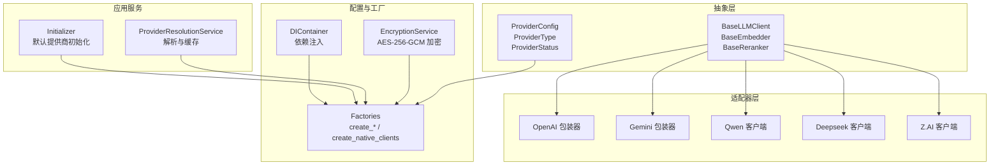
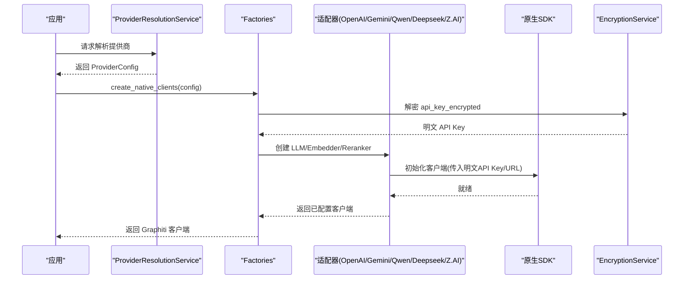
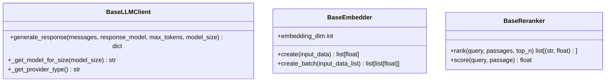
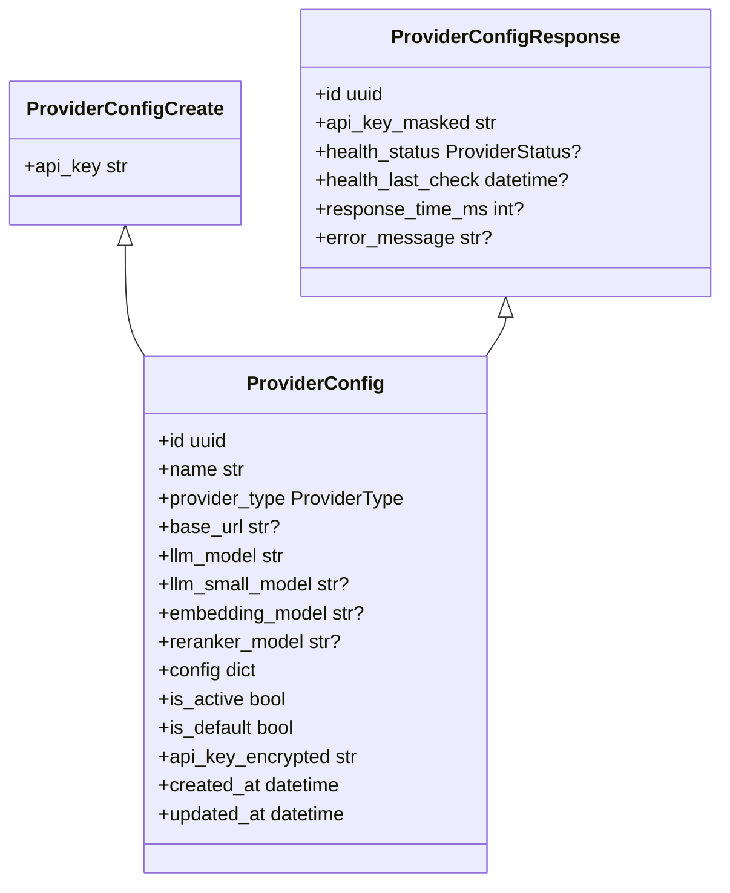
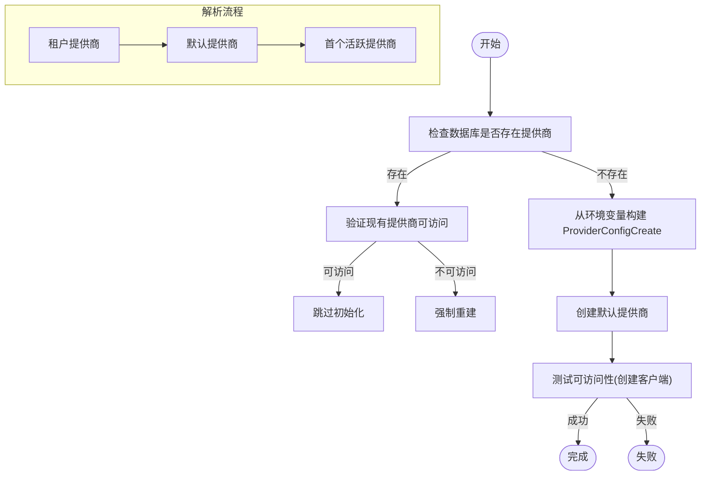
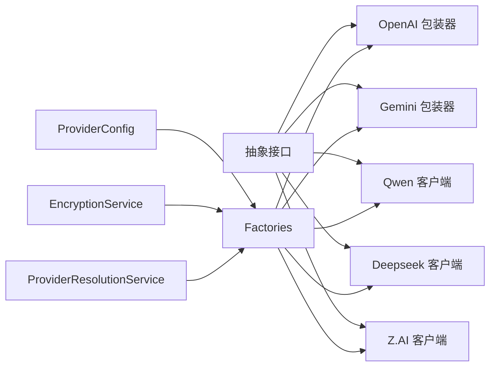

# 多提供商架构设计

<cite>
**本文引用的文件**
- [src/domain/llm_providers/base.py](file://src/domain/llm_providers/base.py)
- [src/domain/llm_providers/models.py](file://src/domain/llm_providers/models.py)
- [src/configuration/di_container.py](file://src/configuration/di_container.py)
- [src/configuration/factories.py](file://src/configuration/factories.py)
- [src/infrastructure/security/encryption_service.py](file://src/infrastructure/security/encryption_service.py)
- [src/application/services/provider_resolution_service.py](file://src/application/services/provider_resolution_service.py)
- [src/infrastructure/llm/initializer.py](file://src/infrastructure/llm/initializer.py)
- [src/infrastructure/llm/openai/openai_wrapper.py](file://src/infrastructure/llm/openai/openai_wrapper.py)
- [src/infrastructure/llm/gemini/gemini_wrapper.py](file://src/infrastructure/llm/gemini/gemini_wrapper.py)
- [src/infrastructure/llm/qwen/qwen_client.py](file://src/infrastructure/llm/qwen/qwen_client.py)
- [src/infrastructure/llm/deepseek/deepseek_client.py](file://src/infrastructure/llm/deepseek/deepseek_client.py)
- [src/infrastructure/llm/zai/zai_client.py](file://src/infrastructure/llm/zai/zai_client.py)
</cite>

## 目录
1. [引言](#引言)
2. [项目结构](#项目结构)
3. [核心组件](#核心组件)
4. [架构总览](#架构总览)
5. [详细组件分析](#详细组件分析)
6. [依赖关系分析](#依赖关系分析)
7. [性能考量](#性能考量)
8. [故障排查指南](#故障排查指南)
9. [结论](#结论)
10. [附录：接口实现示例与最佳实践](#附录接口实现示例与最佳实践)

## 引言
本文件系统性阐述 MemStack 的多提供商架构设计，重点解释如何通过统一抽象层 BaseLLMClient、BaseEmbedder、BaseReranker 三个核心接口，结合 ProviderConfig 配置模型与工厂/依赖注入机制，实现对多家 LLM 提供商（如 OpenAI、Gemini、Qwen、Deepseek、Z.AI 等）的一致接入与动态切换。文档同时覆盖提供商初始化流程、依赖注入与动态加载策略、以及加密服务在 API 密钥管理中的关键作用，并给出新提供商适配的最佳实践。

## 项目结构
MemStack 的多提供商架构主要分布在以下层次：
- 抽象层：定义统一接口与领域模型
- 配置与工厂层：负责提供商配置、加密与客户端创建
- 适配器层：各提供商的原生 SDK 包装
- 应用服务层：提供解析与回退逻辑
- 依赖注入容器：集中装配与解耦

图表来源
- [src/domain/llm_providers/base.py](file://src/domain/llm_providers/base.py#L16-L212)
- [src/domain/llm_providers/models.py](file://src/domain/llm_providers/models.py#L16-L258)
- [src/configuration/di_container.py](file://src/configuration/di_container.py#L108-L391)
- [src/configuration/factories.py](file://src/configuration/factories.py#L1-L749)
- [src/infrastructure/security/encryption_service.py](file://src/infrastructure/security/encryption_service.py#L16-L179)
- [src/application/services/provider_resolution_service.py](file://src/application/services/provider_resolution_service.py#L24-L162)
- [src/infrastructure/llm/initializer.py](file://src/infrastructure/llm/initializer.py#L29-L207)

章节来源
- [src/domain/llm_providers/base.py](file://src/domain/llm_providers/base.py#L1-L212)
- [src/domain/llm_providers/models.py](file://src/domain/llm_providers/models.py#L1-L258)
- [src/configuration/di_container.py](file://src/configuration/di_container.py#L1-L391)
- [src/configuration/factories.py](file://src/configuration/factories.py#L1-L749)
- [src/infrastructure/security/encryption_service.py](file://src/infrastructure/security/encryption_service.py#L1-L179)
- [src/application/services/provider_resolution_service.py](file://src/application/services/provider_resolution_service.py#L1-L162)
- [src/infrastructure/llm/initializer.py](file://src/infrastructure/llm/initializer.py#L1-L207)

## 核心组件
- 统一抽象接口
  - BaseLLMClient：统一的 LLM 客户端接口，定义 generate_response、模型选择与提供商标识等能力
  - BaseEmbedder：统一的向量嵌入接口，定义单条与批量嵌入能力及维度属性
  - BaseReranker：统一的重排序接口，定义 rank 与 score 能力
- 配置模型
  - ProviderConfig：持久化存储的提供商配置，包含名称、提供商类型、模型、密钥（加密）、启用状态、默认状态等
  - ProviderType/ProviderStatus：枚举类型，约束提供商类型与健康状态
  - 其他相关模型：映射、健康状态、用量统计、解析结果等
- 工厂与依赖注入
  - Factories：根据配置创建原生 SDK 客户端（LLM、Embedder、Reranker），并进行维度校验与包装
  - DIContainer：集中装配应用服务与仓库，支持按需注入
- 加密服务
  - EncryptionService：提供 AES-256-GCM 加密/解密，用于 API 密钥的持久化与运行时解密
- 解析与回退
  - ProviderResolutionService：按租户优先、默认提供商、首个可用提供商的顺序解析，并带缓存
  - Initializer：从环境变量自动创建默认提供商配置

章节来源
- [src/domain/llm_providers/base.py](file://src/domain/llm_providers/base.py#L16-L212)
- [src/domain/llm_providers/models.py](file://src/domain/llm_providers/models.py#L16-L258)
- [src/configuration/factories.py](file://src/configuration/factories.py#L132-L451)
- [src/configuration/di_container.py](file://src/configuration/di_container.py#L108-L391)
- [src/infrastructure/security/encryption_service.py](file://src/infrastructure/security/encryption_service.py#L16-L179)
- [src/application/services/provider_resolution_service.py](file://src/application/services/provider_resolution_service.py#L24-L162)
- [src/infrastructure/llm/initializer.py](file://src/infrastructure/llm/initializer.py#L29-L207)

## 架构总览
MemStack 的多提供商架构采用“抽象 + 工厂 + 适配器 + 配置 + 加密”的分层设计：
- 抽象层定义统一接口，屏蔽不同提供商差异
- 配置层以 ProviderConfig 为中心，承载提供商信息与密钥（加密）
- 工厂层负责创建原生 SDK 客户端，并进行维度校验与包装
- 适配器层将原生 SDK 与抽象接口对接，注入 ProviderConfig
- 解析与回退层负责多租户场景下的提供商选择与容错
- 加密服务贯穿配置创建与运行时解密，确保密钥安全

图表来源
- [src/application/services/provider_resolution_service.py](file://src/application/services/provider_resolution_service.py#L53-L133)
- [src/configuration/factories.py](file://src/configuration/factories.py#L369-L451)
- [src/infrastructure/security/encryption_service.py](file://src/infrastructure/security/encryption_service.py#L115-L137)
- [src/infrastructure/llm/openai/openai_wrapper.py](file://src/infrastructure/llm/openai/openai_wrapper.py#L39-L96)
- [src/infrastructure/llm/gemini/gemini_wrapper.py](file://src/infrastructure/llm/gemini/gemini_wrapper.py#L35-L74)
- [src/infrastructure/llm/qwen/qwen_client.py](file://src/infrastructure/llm/qwen/qwen_client.py#L42-L106)
- [src/infrastructure/llm/deepseek/deepseek_client.py](file://src/infrastructure/llm/deepseek/deepseek_client.py#L38-L94)
- [src/infrastructure/llm/zai/zai_client.py](file://src/infrastructure/llm/zai/zai_client.py#L122-L198)

## 详细组件分析

### 统一抽象接口设计
- BaseLLMClient
  - 关键方法：generate_response、_get_model_for_size、_get_provider_type
  - 设计要点：统一消息格式、模型尺寸选择、可观测性标识
- BaseEmbedder
  - 关键属性：embedding_dim
  - 关键方法：create、create_batch
  - 设计要点：保证返回向量维度一致，支持批量处理
- BaseReranker
  - 关键方法：rank、score
  - 设计要点：返回标准化的 0~1 分数，支持 top_n 限制

图表来源
- [src/domain/llm_providers/base.py](file://src/domain/llm_providers/base.py#L16-L212)

章节来源
- [src/domain/llm_providers/base.py](file://src/domain/llm_providers/base.py#L16-L212)

### ProviderConfig 配置模型
- 字段说明
  - name/provider_type/base_url：提供商显示名、类型、可选自定义基础 URL
  - llm_model/llm_small_model/embedding_model/reranker_model：主/小模型、嵌入模型、重排模型
  - config：额外提供商特定配置
  - is_active/is_default：启用状态与默认状态
  - api_key_encrypted：加密后的 API Key
  - created_at/updated_at：时间戳
- 相关模型
  - ProviderConfigCreate/ProviderConfigUpdate：创建与更新模型
  - ProviderConfigResponse：对外响应（掩码 API Key）
  - 租户映射、健康状态、用量统计、解析结果等

图表来源
- [src/domain/llm_providers/models.py](file://src/domain/llm_providers/models.py#L54-L131)

章节来源
- [src/domain/llm_providers/models.py](file://src/domain/llm_providers/models.py#L16-L258)

### 提供商初始化流程与动态加载
- 环境变量驱动的默认提供商创建
  - Initializer 读取环境变量，构建 ProviderConfigCreate 并调用 ProviderService 创建
  - 若现有提供商可访问（能创建客户端），则跳过初始化；否则强制重建
- 数据库驱动的提供商解析
  - ProviderResolutionService 按租户优先、默认、首个可用的顺序解析
  - 支持缓存与失效控制，提升性能
- 工厂动态创建
  - Factories.create_native_clients 根据 ProviderType 创建对应适配器
  - 所有 Embedder 在创建后被 ValidatedEmbedder 包装，确保维度一致性
  - 对于不提供嵌入/重排的提供商（如 Deepseek），提供回退策略

图表来源
- [src/infrastructure/llm/initializer.py](file://src/infrastructure/llm/initializer.py#L29-L124)
- [src/application/services/provider_resolution_service.py](file://src/application/services/provider_resolution_service.py#L53-L133)
- [src/configuration/factories.py](file://src/configuration/factories.py#L369-L451)

章节来源
- [src/infrastructure/llm/initializer.py](file://src/infrastructure/llm/initializer.py#L29-L207)
- [src/application/services/provider_resolution_service.py](file://src/application/services/provider_resolution_service.py#L24-L162)
- [src/configuration/factories.py](file://src/configuration/factories.py#L369-L451)

### 依赖注入机制
- DIContainer 负责集中装配应用服务与仓库，支持按需注入
- AgentService、MemoryService、SearchService 等均通过容器获取依赖
- 该机制使上层业务与具体提供商实现解耦

章节来源
- [src/configuration/di_container.py](file://src/configuration/di_container.py#L108-L391)

### 加密服务在 API 密钥管理中的作用
- ProviderConfig 在创建时使用 EncryptionService.encrypt 存储加密后的 API Key
- 运行时通过 get_encryption_service 获取实例，decrypt 解密后传递给适配器
- 未设置或无效的 LLM_ENCRYPTION_KEY 将发出警告并使用开发密钥（仅开发用途）

章节来源
- [src/configuration/factories.py](file://src/configuration/factories.py#L132-L172)
- [src/infrastructure/security/encryption_service.py](file://src/infrastructure/security/encryption_service.py#L16-L179)

### 各提供商适配器实现要点
- OpenAI
  - LLM：继承 Graphiti OpenAIClient，注入 ProviderConfig，支持结构化输出
  - Embedder：固定维度（1536），封装 AsyncOpenAI
  - Reranker：基于 LLM 的评分
- Gemini
  - LLM/Embedder/Reranker：均基于 Graphiti 原生实现，封装 AsyncOpenAI 或 SDK
  - Embedder：固定维度（768），并做维度校验与修正
- Qwen
  - LLM：基于 DashScope SDK，支持结构化输出与 JSON 模式
  - Embedder/Reranker：基于官方 SDK
- Deepseek
  - LLM：OpenAI 兼容 API，封装 AsyncOpenAI
  - Embedder：无原生嵌入 API，使用 Qwen 作为回退
  - Reranker：基于 LLM 的评分
- Z.AI
  - LLM/Embedder/Reranker：基于官方 zai-sdk，支持线程池异步执行
  - Embedder：根据模型确定维度（embedding-3/3-pro 为 4096）

章节来源
- [src/infrastructure/llm/openai/openai_wrapper.py](file://src/infrastructure/llm/openai/openai_wrapper.py#L39-L270)
- [src/infrastructure/llm/gemini/gemini_wrapper.py](file://src/infrastructure/llm/gemini/gemini_wrapper.py#L35-L257)
- [src/infrastructure/llm/qwen/qwen_client.py](file://src/infrastructure/llm/qwen/qwen_client.py#L42-L518)
- [src/infrastructure/llm/deepseek/deepseek_client.py](file://src/infrastructure/llm/deepseek/deepseek_client.py#L38-L458)
- [src/infrastructure/llm/zai/zai_client.py](file://src/infrastructure/llm/zai/zai_client.py#L122-L702)

## 依赖关系分析
- 抽象接口与适配器
  - 适配器均实现 BaseLLMClient/BaseEmbedder/BaseReranker，并注入 ProviderConfig
- 工厂与适配器
  - Factories.create_native_clients 根据 ProviderType 选择适配器
  - 所有 Embedder 被 ValidatedEmbedder 包装，确保维度一致
- 解析与回退
  - ProviderResolutionService 与 Initializer 协同，保障在数据库不可用或密钥变更时的容错
- 加密服务
  - 在 ProviderConfig 创建与运行时解密环节贯穿始终

图表来源
- [src/domain/llm_providers/base.py](file://src/domain/llm_providers/base.py#L16-L212)
- [src/configuration/factories.py](file://src/configuration/factories.py#L369-L451)
- [src/infrastructure/security/encryption_service.py](file://src/infrastructure/security/encryption_service.py#L16-L179)
- [src/application/services/provider_resolution_service.py](file://src/application/services/provider_resolution_service.py#L24-L162)

章节来源
- [src/domain/llm_providers/base.py](file://src/domain/llm_providers/base.py#L16-L212)
- [src/configuration/factories.py](file://src/configuration/factories.py#L369-L451)
- [src/infrastructure/security/encryption_service.py](file://src/infrastructure/security/encryption_service.py#L16-L179)
- [src/application/services/provider_resolution_service.py](file://src/application/services/provider_resolution_service.py#L24-L162)

## 性能考量
- 缓存与回退
  - ProviderResolutionService 内置缓存，减少重复查询
  - Initializer 在密钥变更时自动重建，避免因密钥不匹配导致的失败
- 维度校验与包装
  - 所有 Embedder 在创建后被 ValidatedEmbedder 包装，防止维度不一致引发下游错误
- 异步与线程池
  - Z.AI 适配器使用线程池执行同步 SDK 调用，避免事件循环阻塞
- Neo4j 超时保护
  - 工厂模块对 Graphiti 的 Neo4jDriver 进行超时补丁，避免连接/索引构建超时

章节来源
- [src/application/services/provider_resolution_service.py](file://src/application/services/provider_resolution_service.py#L36-L150)
- [src/configuration/factories.py](file://src/configuration/factories.py#L49-L120)
- [src/infrastructure/llm/zai/zai_client.py](file://src/infrastructure/llm/zai/zai_client.py#L176-L188)

## 故障排查指南
- 无法创建提供商客户端
  - 检查 LLM_ENCRYPTION_KEY 是否正确设置，若密钥变更会导致解密失败
  - 观察工厂日志，确认是否触发了“重新创建默认提供商”的回退逻辑
- 嵌入维度不匹配
  - 工厂在创建 Graphiti 客户端时会检查现有嵌入维度，不一致会清空旧嵌入并提示
  - 建议在更换 Embedder 模型时注意维度变化
- 速率限制
  - 适配器在捕获速率限制错误时抛出 RateLimitError，建议在上层增加重试与降级策略
- Z.AI SDK 缺失
  - 使用 Z.AI 时需安装 zai-sdk，否则会抛出 ImportError

章节来源
- [src/configuration/factories.py](file://src/configuration/factories.py#L295-L315)
- [src/configuration/factories.py](file://src/configuration/factories.py#L335-L364)
- [src/infrastructure/llm/zai/zai_client.py](file://src/infrastructure/llm/zai/zai_client.py#L167-L170)

## 结论
MemStack 通过统一抽象接口、严谨的配置模型、工厂与适配器模式、以及完善的加密与解析回退机制，实现了对多家 LLM 提供商的无缝集成。该架构具备良好的扩展性与稳定性，便于新增提供商与在多租户场景下灵活切换与回退。

## 附录：接口实现示例与最佳实践

### 实现新提供商适配器的步骤
- 定义适配器类
  - 继承 BaseLLMClient/BaseEmbedder/BaseReranker 中的相应接口
  - 在构造函数中注入 ProviderConfig，并通过 EncryptionService 解密 API Key
- 实现关键方法
  - LLM：实现 generate_response，支持结构化输出（如需）
  - Embedder：实现 create/create_batch，暴露 embedding_dim 属性
  - Reranker：实现 rank/score，返回 0~1 的标准化分数
- 注册到工厂
  - 在 Factories.create_native_clients 中添加 ProviderType 分支，返回新适配器实例
  - 确保 Embedder 被 ValidatedEmbedder 包装，保证维度一致
- 配置与回退
  - 若提供商不提供某类能力（如嵌入/重排），提供合理的回退策略（如使用其他提供商）
- 测试与验证
  - 在本地/测试环境配置 ProviderConfigCreate，验证 create_native_clients 能正常创建客户端
  - 关注维度校验与异常处理，确保与现有系统兼容

章节来源
- [src/domain/llm_providers/base.py](file://src/domain/llm_providers/base.py#L16-L212)
- [src/configuration/factories.py](file://src/configuration/factories.py#L369-L451)
- [src/infrastructure/security/encryption_service.py](file://src/infrastructure/security/encryption_service.py#L16-L179)