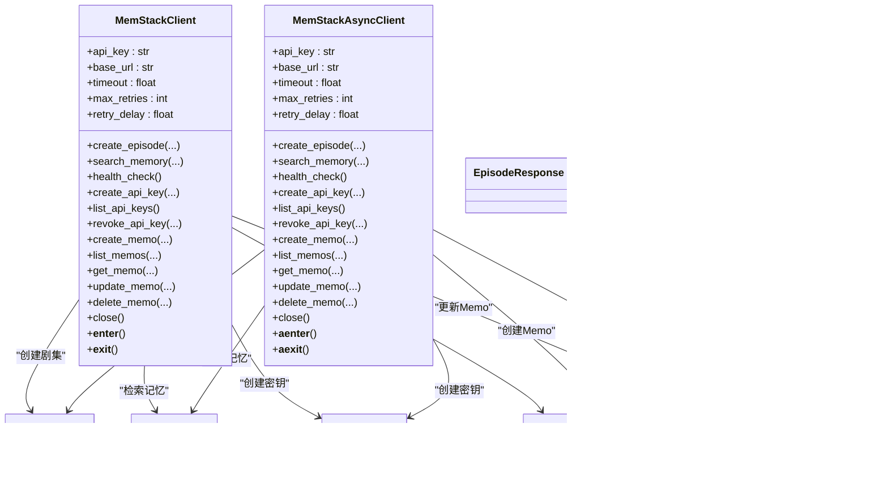
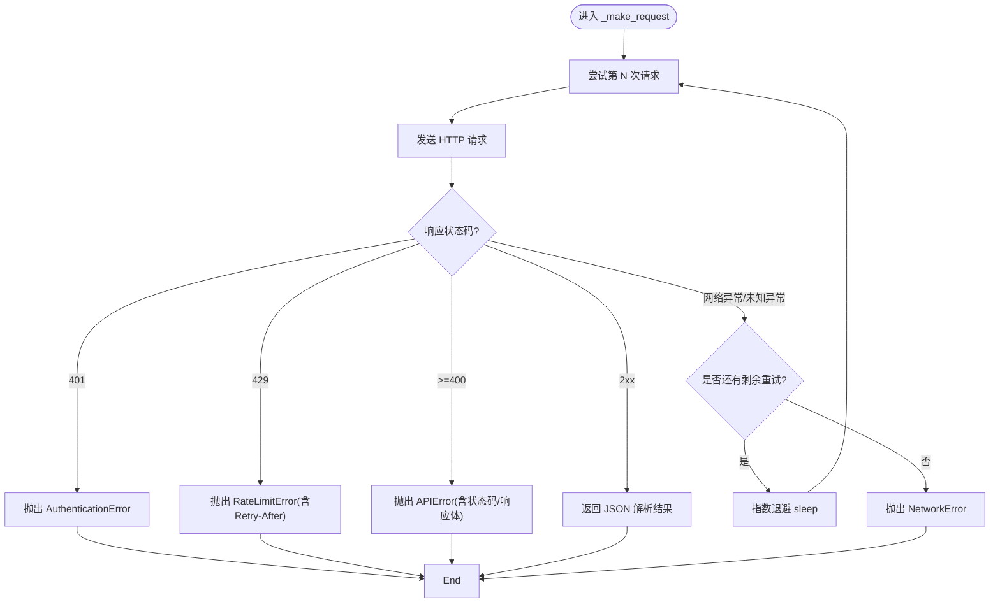

# Python SDK 开发

<cite>
**本文引用的文件**
- [sdk/python/memstack/__init__.py](file://sdk/python/memstack/__init__.py)
- [sdk/python/memstack/client.py](file://sdk/python/memstack/client.py)
- [sdk/python/memstack/async_client.py](file://sdk/python/memstack/async_client.py)
- [sdk/python/memstack/models.py](file://sdk/python/memstack/models.py)
- [sdk/python/memstack/exceptions.py](file://sdk/python/memstack/exceptions.py)
- [sdk/python/pyproject.toml](file://sdk/python/pyproject.toml)
- [sdk/python/README.md](file://sdk/python/README.md)
- [examples/basic_usage.py](file://examples/basic_usage.py)
- [examples/sdk_usage.py](file://examples/sdk_usage.py)
</cite>

## 目录
1. [简介](#简介)
2. [项目结构](#项目结构)
3. [核心组件](#核心组件)
4. [架构总览](#架构总览)
5. [详细组件分析](#详细组件分析)
6. [依赖关系分析](#依赖关系分析)
7. [性能考虑](#性能考虑)
8. [故障排查指南](#故障排查指南)
9. [结论](#结论)
10. [附录](#附录)

## 简介
本文件面向开发者，系统化梳理 MemStack Python SDK 的架构设计与实现细节，重点覆盖以下方面：
- 同步客户端与异步客户端的设计差异与适用场景
- API 封装实现（记忆操作、代理调用、配置管理等）
- 错误处理机制、重试策略与超时配置
- 安装与配置、依赖管理与版本兼容性
- 使用示例（基础用法、高级用法与最佳实践）

MemStack SDK 提供两类客户端：同步与异步，均基于统一的请求封装与模型校验，支持健康检查、记忆检索、剧集创建、Memo 管理以及 API Key 管理等核心能力。

## 项目结构
SDK 位于 sdk/python 目录，核心模块如下：
- memstack/__init__.py：导出公开 API（客户端、异常、模型）
- memstack/client.py：同步客户端实现
- memstack/async_client.py：异步客户端实现
- memstack/models.py：Pydantic 数据模型
- memstack/exceptions.py：异常体系
- pyproject.toml：包元数据、依赖与开发工具配置
- README.md：快速开始、API 参考与开发指南
- examples/：使用示例脚本

图表来源
- [sdk/python/memstack/__init__.py](file://sdk/python/memstack/__init__.py#L1-L29)
- [sdk/python/memstack/client.py](file://sdk/python/memstack/client.py#L1-L313)
- [sdk/python/memstack/async_client.py](file://sdk/python/memstack/async_client.py#L1-L313)
- [sdk/python/memstack/models.py](file://sdk/python/memstack/models.py#L1-L136)
- [sdk/python/memstack/exceptions.py](file://sdk/python/memstack/exceptions.py#L1-L47)
- [sdk/python/pyproject.toml](file://sdk/python/pyproject.toml#L1-L87)
- [sdk/python/README.md](file://sdk/python/README.md#L1-L246)
- [examples/basic_usage.py](file://examples/basic_usage.py#L1-L107)
- [examples/sdk_usage.py](file://examples/sdk_usage.py#L1-L98)

章节来源
- [sdk/python/memstack/__init__.py](file://sdk/python/memstack/__init__.py#L1-L29)
- [sdk/python/pyproject.toml](file://sdk/python/pyproject.toml#L1-L87)
- [sdk/python/README.md](file://sdk/python/README.md#L1-L246)

## 核心组件
- 同步客户端 MemStackClient：基于 httpx.Client，提供阻塞式 API 调用，支持上下文管理器自动关闭连接。
- 异步客户端 MemStackAsyncClient：基于 httpx.AsyncClient，提供非阻塞式 API 调用，支持异步上下文管理器。
- 数据模型：Episode、EpisodeCreate、EpisodeResponse、MemoryQuery、MemoryResponse、APIKey、APIKeyCreate、Memo、MemoCreate、MemoUpdate 等，全部由 Pydantic 校验。
- 异常体系：MemStackError 为基类，派生出 AuthenticationError、APIError、RateLimitError、ValidationError、NetworkError。
- 公开导出：通过 __init__.py 导出客户端、异常与模型，便于直接 from memstack import 使用。

章节来源
- [sdk/python/memstack/client.py](file://sdk/python/memstack/client.py#L25-L313)
- [sdk/python/memstack/async_client.py](file://sdk/python/memstack/async_client.py#L25-L313)
- [sdk/python/memstack/models.py](file://sdk/python/memstack/models.py#L1-L136)
- [sdk/python/memstack/exceptions.py](file://sdk/python/memstack/exceptions.py#L6-L47)
- [sdk/python/memstack/__init__.py](file://sdk/python/memstack/__init__.py#L6-L28)

## 架构总览
SDK 采用“客户端 + 模型 + 异常”的分层设计：
- 客户端层：负责 HTTP 请求、重试与错误映射
- 模型层：Pydantic 校验与序列化
- 异常层：统一错误分类与信息承载
- 导出层：集中暴露公共 API

图表来源
- [sdk/python/memstack/client.py](file://sdk/python/memstack/client.py#L25-L313)
- [sdk/python/memstack/async_client.py](file://sdk/python/memstack/async_client.py#L25-L313)
- [sdk/python/memstack/models.py](file://sdk/python/memstack/models.py#L11-L136)

## 详细组件分析

### 同步客户端 MemStackClient
- 初始化参数：api_key、base_url、timeout、max_retries、retry_delay；校验 API Key 格式。
- 请求封装：_make_request 方法统一处理 HTTP 请求、状态码映射、重试与异常抛出。
- 重试策略：指数退避，最大重试次数可配置；网络异常与未知异常会按指数延迟重试。
- 方法覆盖：
  - create_episode：创建剧集
  - search_memory：知识图谱检索
  - health_check：健康检查
  - API Key 管理：create_api_key、list_api_keys、revoke_api_key
  - Memo 管理：create_memo、list_memos、get_memo、update_memo、delete_memo
- 资源管理：支持 with 上下文管理器，自动关闭底层 httpx.Client。

图表来源
- [sdk/python/memstack/client.py](file://sdk/python/memstack/client.py#L78-L153)
- [sdk/python/memstack/client.py](file://sdk/python/memstack/client.py#L155-L194)

章节来源
- [sdk/python/memstack/client.py](file://sdk/python/memstack/client.py#L38-L68)
- [sdk/python/memstack/client.py](file://sdk/python/memstack/client.py#L78-L153)
- [sdk/python/memstack/client.py](file://sdk/python/memstack/client.py#L155-L304)

### 异步客户端 MemStackAsyncClient
- 初始化参数与同步客户端一致，但使用 httpx.AsyncClient。
- 异步请求封装：_make_request 以 await 方式发起请求，异常与重试策略同同步版本。
- 方法覆盖：与同步客户端一一对应，返回类型相同。
- 资源管理：支持 async with 上下文管理器，自动关闭 httpx.AsyncClient。

图表来源
- [sdk/python/memstack/async_client.py](file://sdk/python/memstack/async_client.py#L78-L153)
- [sdk/python/memstack/async_client.py](file://sdk/python/memstack/async_client.py#L155-L194)

章节来源
- [sdk/python/memstack/async_client.py](file://sdk/python/memstack/async_client.py#L38-L68)
- [sdk/python/memstack/async_client.py](file://sdk/python/memstack/async_client.py#L78-L153)
- [sdk/python/memstack/async_client.py](file://sdk/python/memstack/async_client.py#L155-L312)

### API 封装与数据模型
- EpisodeCreate/EpisodeResponse：剧集创建与响应模型，支持名称、内容、来源类型、描述、分组 ID、元数据等字段。
- MemoryQuery/MemoryResponse：检索查询与结果模型，支持查询文本、限制数量、租户 ID、过滤器等。
- APIKey/APIKeyCreate：API Key 创建与响应模型。
- Memo/MemoCreate/MemoUpdate：Memo 的增删改查与更新模型。
- 所有模型使用 Pydantic 进行输入校验与序列化，确保与后端接口契约一致。

图表来源
- [sdk/python/memstack/models.py](file://sdk/python/memstack/models.py#L11-L136)

章节来源
- [sdk/python/memstack/models.py](file://sdk/python/memstack/models.py#L11-L136)

### 错误处理机制与重试策略
- 异常体系：
  - MemStackError：基类
  - AuthenticationError：认证失败
  - APIError：API 请求错误，携带状态码与响应体
  - RateLimitError：限流错误，携带 Retry-After
  - ValidationError：输入校验错误
  - NetworkError：网络请求失败
- 重试策略：
  - _make_request 中内置 max_retries 次重试，指数退避（2^attempt），网络异常与未知异常会按延迟 sleep 后重试
  - 401 映射为 AuthenticationError，429 映射为 RateLimitError 并读取 Retry-After
  - 其他 4xx/5xx 映射为 APIError，并携带状态码与响应体
- 超时配置：
  - 客户端构造函数接收 timeout 参数，传递给 httpx.Client/AsyncClient

图表来源
- [sdk/python/memstack/client.py](file://sdk/python/memstack/client.py#L78-L153)
- [sdk/python/memstack/async_client.py](file://sdk/python/memstack/async_client.py#L78-L153)

章节来源
- [sdk/python/memstack/exceptions.py](file://sdk/python/memstack/exceptions.py#L6-L47)
- [sdk/python/memstack/client.py](file://sdk/python/memstack/client.py#L78-L153)
- [sdk/python/memstack/async_client.py](file://sdk/python/memstack/async_client.py#L78-L153)

### 使用示例与最佳实践
- 快速开始与基本用法：参见 README 的同步与异步示例，展示初始化、创建剧集、检索记忆与健康检查。
- 示例脚本：
  - examples/basic_usage.py：使用 httpx.AsyncClient 的原生示例，演示健康检查、创建多个 Episode、等待处理与检索。
  - examples/sdk_usage.py：使用 MemStackAsyncClient 的示例，展示异步上下文管理器、批量检索与结果打印。
- 最佳实践建议：
  - 在生产中使用异步客户端以提升并发吞吐
  - 合理设置 timeout、max_retries 与 retry_delay
  - 使用 with 或 async with 自动释放资源
  - 捕获 RateLimitError 并根据 Retry-After 控制重试节奏

章节来源
- [sdk/python/README.md](file://sdk/python/README.md#L18-L79)
- [examples/basic_usage.py](file://examples/basic_usage.py#L1-L107)
- [examples/sdk_usage.py](file://examples/sdk_usage.py#L1-L98)

## 依赖关系分析
- 依赖项：
  - httpx>=0.25.0：HTTP 客户端（同步与异步）
  - pydantic>=2.5.0：数据模型校验与序列化
- 可选开发依赖：pytest、pytest-asyncio、black、ruff、mypy 等，用于测试、格式化与类型检查
- Python 版本要求：>=3.10

图表来源
- [sdk/python/pyproject.toml](file://sdk/python/pyproject.toml#L22-L38)

章节来源
- [sdk/python/pyproject.toml](file://sdk/python/pyproject.toml#L1-L87)

## 性能考虑
- 异步优先：在高并发场景优先使用 MemStackAsyncClient，避免阻塞导致的线程资源浪费。
- 合理超时：根据后端响应特征设置 timeout，避免长时间挂起。
- 重试策略：适度增加 max_retries 与 retry_delay，平衡可靠性与延迟。
- 连接复用：客户端内部复用 httpx.Client/AsyncClient，减少连接建立开销。
- 检索限制：search_memory 的 limit 建议控制在合理范围（1-100），避免过大数据量传输。

## 故障排查指南
- 认证失败：确认 API Key 格式与权限，确保以 ms_sk_ 开头。
- 速率限制：捕获 RateLimitError，读取 retry_after 并延时重试。
- 网络异常：捕获 NetworkError，检查网络连通性与代理配置。
- API 错误：捕获 APIError，记录状态码与响应体以便定位问题。
- 资源泄漏：务必使用上下文管理器（with/async with）确保连接关闭。

章节来源
- [sdk/python/memstack/exceptions.py](file://sdk/python/memstack/exceptions.py#L14-L46)
- [sdk/python/memstack/client.py](file://sdk/python/memstack/client.py#L115-L153)
- [sdk/python/memstack/async_client.py](file://sdk/python/memstack/async_client.py#L115-L153)

## 结论
MemStack Python SDK 通过清晰的分层设计与完善的异常与重试机制，为开发者提供了稳定可靠的同步与异步访问能力。结合 Pydantic 模型与上下文管理器，SDK 在易用性与健壮性之间取得良好平衡。建议在生产环境中优先采用异步客户端，并根据实际负载调整超时与重试参数。

## 附录

### 安装与配置
- 安装：pip install memstack-sdk
- 从源码安装：cd sdk/python && pip install -e .
- 配置：
  - 通过环境变量或构造函数传入 api_key 与 base_url
  - 可调整 timeout、max_retries、retry_delay 以适配不同网络与负载

章节来源
- [sdk/python/README.md](file://sdk/python/README.md#L5-L16)
- [sdk/python/README.md](file://sdk/python/README.md#L180-L190)

### API 参考
- 客户端构造参数：api_key、base_url、timeout、max_retries、retry_delay
- 主要方法：
  - create_episode、search_memory、health_check
  - API Key：create_api_key、list_api_keys、revoke_api_key
  - Memo：create_memo、list_memos、get_memo、update_memo、delete_memo

章节来源
- [sdk/python/README.md](file://sdk/python/README.md#L94-L142)
- [sdk/python/memstack/client.py](file://sdk/python/memstack/client.py#L155-L304)
- [sdk/python/memstack/async_client.py](file://sdk/python/memstack/async_client.py#L155-L312)