# SDK 架构设计

<cite>
**本文档引用的文件**
- [sdk/python/memstack/__init__.py](file://sdk/python/memstack/__init__.py)
- [sdk/python/memstack/client.py](file://sdk/python/memstack/client.py)
- [sdk/python/memstack/async_client.py](file://sdk/python/memstack/async_client.py)
- [sdk/python/memstack/models.py](file://sdk/python/memstack/models.py)
- [sdk/python/memstack/exceptions.py](file://sdk/python/memstack/exceptions.py)
- [sdk/python/README.md](file://sdk/python/README.md)
- [sdk/python/pyproject.toml](file://sdk/python/pyproject.toml)
- [examples/sdk_usage.py](file://examples/sdk_usage.py)
- [examples/basic_usage.py](file://examples/basic_usage.py)
- [src/configuration/di_container.py](file://src/configuration/di_container.py)
- [src/configuration/config.py](file://src/configuration/config.py)
- [src/configuration/factories.py](file://src/configuration/factories.py)
- [src/infrastructure/agent/retry/policy.py](file://src/infrastructure/agent/retry/policy.py)
</cite>

## 目录
1. [简介](#简介)
2. [项目结构](#项目结构)
3. [核心组件](#核心组件)
4. [架构总览](#架构总览)
5. [详细组件分析](#详细组件分析)
6. [依赖分析](#依赖分析)
7. [性能考虑](#性能考虑)
8. [故障排除指南](#故障排除指南)
9. [结论](#结论)
10. [附录](#附录)

## 简介
本文件面向 MemStack Python SDK 的架构设计，系统性阐述 SDK 的整体架构模式、同步与异步客户端的设计差异与适用场景、客户端类的设计原理（HTTP 客户端封装、请求头管理、URL 构建）、依赖注入与配置管理（API 密钥验证、超时配置、重试策略）以及模块化设计（客户端、模型、异常处理等组件的职责分工）。同时提供架构图表与设计决策的技术背景，帮助开发者理解 SDK 的设计理念与扩展点。

## 项目结构
MemStack Python SDK 位于 `sdk/python/memstack` 目录下，采用清晰的模块化组织：
- 客户端模块：同步与异步客户端分别封装 HTTP 请求与重试逻辑
- 模型模块：基于 Pydantic 的数据模型，用于请求与响应的序列化/反序列化
- 异常模块：统一的异常层次，便于上层捕获与处理
- 入口模块：导出公开 API，统一对外暴露

**图表来源**
- [sdk/python/memstack/__init__.py](file://sdk/python/memstack/__init__.py#L1-L29)
- [sdk/python/memstack/client.py](file://sdk/python/memstack/client.py#L1-L313)
- [sdk/python/memstack/async_client.py](file://sdk/python/memstack/async_client.py#L1-L313)
- [sdk/python/memstack/models.py](file://sdk/python/memstack/models.py#L1-L136)
- [sdk/python/memstack/exceptions.py](file://sdk/python/memstack/exceptions.py#L1-L47)

**章节来源**
- [sdk/python/memstack/__init__.py](file://sdk/python/memstack/__init__.py#L1-L29)
- [sdk/python/README.md](file://sdk/python/README.md#L1-L246)

## 核心组件
- 同步客户端 MemStackClient：基于 httpx.Client 封装，提供阻塞式 HTTP 调用与指数退避重试
- 异步客户端 MemStackAsyncClient：基于 httpx.AsyncClient 封装，提供非阻塞式 HTTP 调用与指数退避重试
- Pydantic 模型：EpisodeCreate、Episode、EpisodeResponse、MemoryQuery、MemoryResponse、APIKey、APIKeyCreate、Memo、MemoCreate、MemoUpdate 等
- 异常体系：MemStackError、AuthenticationError、APIError、RateLimitError、ValidationError、NetworkError
- 配置与工厂：SDK 依赖 httpx 与 pydantic；后端服务侧有完整的 DI 容器与配置工厂

**章节来源**
- [sdk/python/memstack/client.py](file://sdk/python/memstack/client.py#L25-L313)
- [sdk/python/memstack/async_client.py](file://sdk/python/memstack/async_client.py#L25-L313)
- [sdk/python/memstack/models.py](file://sdk/python/memstack/models.py#L11-L136)
- [sdk/python/memstack/exceptions.py](file://sdk/python/memstack/exceptions.py#L6-L47)
- [sdk/python/pyproject.toml](file://sdk/python/pyproject.toml#L22-L25)

## 架构总览
SDK 采用“薄客户端”模式，核心职责包括：
- HTTP 客户端封装与请求头管理（Authorization、Content-Type、User-Agent）
- URL 构建与端点路由
- 统一的重试策略（指数退避、网络异常与特定状态码处理）
- 输入/输出模型校验与序列化
- 异常分层与错误传播

**图表来源**
- [sdk/python/memstack/__init__.py](file://sdk/python/memstack/__init__.py#L6-L28)
- [sdk/python/memstack/client.py](file://sdk/python/memstack/client.py#L65-L68)
- [sdk/python/memstack/async_client.py](file://sdk/python/memstack/async_client.py#L65-L68)
- [sdk/python/memstack/models.py](file://sdk/python/memstack/models.py#L11-L136)
- [sdk/python/memstack/exceptions.py](file://sdk/python/memstack/exceptions.py#L6-L47)

## 详细组件分析

### 同步客户端 MemStackClient
- 初始化与配置
  - API 密钥格式校验（以 ms_sk_ 开头）
  - 基础 URL 清理（去除尾部斜杠）
  - 超时、最大重试次数、初始重试延迟参数
  - httpx.Client 初始化并注入请求头
- 请求与重试
  - URL 拼接（urljoin）
  - 统一的 _make_request 实现，处理 401、429、4xx 等状态码
  - 指数退避重试（time.sleep），网络异常与未知异常分别处理
- 方法族
  - create_episode、search_memory、health_check
  - API Key 管理：create_api_key、list_api_keys、revoke_api_key
  - Memo 管理：create_memo、list_memos、get_memo、update_memo、delete_memo
- 资源管理
  - close() 与上下文管理器支持

**图表来源**
- [sdk/python/memstack/client.py](file://sdk/python/memstack/client.py#L25-L313)

**章节来源**
- [sdk/python/memstack/client.py](file://sdk/python/memstack/client.py#L38-L68)
- [sdk/python/memstack/client.py](file://sdk/python/memstack/client.py#L78-L153)
- [sdk/python/memstack/client.py](file://sdk/python/memstack/client.py#L155-L304)

### 异步客户端 MemStackAsyncClient
- 初始化与配置
  - 与同步客户端一致的参数与校验
  - httpx.AsyncClient 初始化并注入请求头
- 请求与重试
  - 异步 _make_request，使用 asyncio.sleep 进行指数退避
  - 统一的状态码与异常处理
- 方法族
  - create_episode、search_memory、health_check
  - API Key 与 Memo 管理的异步版本
- 资源管理
  - close() 与异步上下文管理器支持

**图表来源**
- [sdk/python/memstack/async_client.py](file://sdk/python/memstack/async_client.py#L25-L313)

**章节来源**
- [sdk/python/memstack/async_client.py](file://sdk/python/memstack/async_client.py#L38-L68)
- [sdk/python/memstack/async_client.py](file://sdk/python/memstack/async_client.py#L78-L153)
- [sdk/python/memstack/async_client.py](file://sdk/python/memstack/async_client.py#L155-L304)

### 请求流程与重试策略
- 同步与异步客户端共享相同的重试策略：指数退避、网络异常捕获、特定状态码处理（401、429 等）
- 异步版本使用 asyncio.sleep，同步版本使用 time.sleep
- 最大重试次数与初始延迟可通过构造函数参数配置

**图表来源**
- [sdk/python/memstack/client.py](file://sdk/python/memstack/client.py#L78-L153)
- [sdk/python/memstack/async_client.py](file://sdk/python/memstack/async_client.py#L78-L153)

**章节来源**
- [sdk/python/memstack/client.py](file://sdk/python/memstack/client.py#L106-L153)
- [sdk/python/memstack/async_client.py](file://sdk/python/memstack/async_client.py#L106-L153)

### 数据模型与序列化
- EpisodeCreate/Episode/EpisodeResponse：用于创建与响应 Episode
- MemoryQuery/MemoryResponse/MemoryResult：用于搜索记忆
- APIKey/APIKeyCreate：用于 API Key 的创建与列表
- Memo/MemoCreate/MemoUpdate：用于便签的增删改查
- 所有模型基于 Pydantic，提供字段校验与 JSON 序列化

```mermaid
classDiagram
class EpisodeCreate {
+name : str
+content : str
+source_type : str
+source_description : Optional[str]
+group_id : Optional[str]
+metadata : Optional[Dict]
}
class Episode {
+id : str
+name : str
+content : str
+source_type : str
+source_description : Optional[str]
+group_id : Optional[str]
+metadata : Optional[Dict]
+created_at : datetime
+status : str
}
class EpisodeResponse {
+id : str
+status : str
+message : str
+created_at : datetime
}
class MemoryQuery {
+query : str
+limit : int
+tenant_id : Optional[str]
+filters : Optional[Dict]
}
class MemoryResponse {
+results : MemoryResult[]
+total : int
+query : str
}
class MemoryResult {
+id : str
+content : str
+score : float
+type : str
+metadata : Optional[Dict]
}
class APIKey {
+key_id : str
+key : str
+name : str
+created_at : datetime
+expires_at : Optional[datetime]
+permissions : str[]
}
class APIKeyCreate {
+name : str
+permissions : str[]
+expires_in_days : Optional[int]
}
class Memo {
+id : str
+content : str
+visibility : str
+created_at : datetime
+updated_at : Optional[datetime]
+tags : str[]
+user_id : str
}
class MemoCreate {
+content : str
+visibility : str
+tags : str[]
}
class MemoUpdate {
+content : Optional[str]
+visibility : Optional[str]
+tags : Optional[str[]]
}
```

**图表来源**
- [sdk/python/memstack/models.py](file://sdk/python/memstack/models.py#L11-L136)

**章节来源**
- [sdk/python/memstack/models.py](file://sdk/python/memstack/models.py#L11-L136)

### 异常体系
- MemStackError：基础异常
- AuthenticationError：认证失败
- APIError：API 返回错误（携带状态码与响应体）
- RateLimitError：超出速率限制（携带 Retry-After）
- ValidationError：输入校验失败
- NetworkError：网络请求失败

**图表来源**
- [sdk/python/memstack/exceptions.py](file://sdk/python/memstack/exceptions.py#L6-L47)

**章节来源**
- [sdk/python/memstack/exceptions.py](file://sdk/python/memstack/exceptions.py#L6-L47)

### 同步 vs 异步客户端：设计差异与适用场景
- 设计差异
  - 底层 HTTP 客户端：同步使用 httpx.Client，异步使用 httpx.AsyncClient
  - 重试等待：同步使用 time.sleep，异步使用 asyncio.sleep
  - 上下文管理：同步使用 __enter__/__exit__，异步使用 __aenter__/__aexit__
- 适用场景
  - 同步客户端：传统阻塞式应用、脚本、CLI 工具
  - 异步客户端：高并发 Web 应用、异步任务队列、事件循环驱动的服务

**章节来源**
- [sdk/python/memstack/client.py](file://sdk/python/memstack/client.py#L65-L68)
- [sdk/python/memstack/async_client.py](file://sdk/python/memstack/async_client.py#L65-L68)
- [sdk/python/README.md](file://sdk/python/README.md#L53-L79)

### 依赖注入与配置管理（SDK 侧）
- SDK 依赖
  - httpx>=0.25.0：HTTP 客户端
  - pydantic>=2.5.0：数据模型与校验
- 配置参数
  - api_key：必填，格式校验
  - base_url：默认本地地址，末尾斜杠清理
  - timeout：请求超时（秒）
  - max_retries：最大重试次数
  - retry_delay：初始重试延迟（秒）
- 重试策略
  - 指数退避：delay = retry_delay * 2^(attempt-1)
  - 网络异常与未知异常分别处理
  - 401：AuthenticationError
  - 429：RateLimitError（携带 Retry-After）
  - 4xx/5xx：APIError（携带状态码与响应体）

**章节来源**
- [sdk/python/pyproject.toml](file://sdk/python/pyproject.toml#L22-L25)
- [sdk/python/memstack/client.py](file://sdk/python/memstack/client.py#L38-L68)
- [sdk/python/memstack/async_client.py](file://sdk/python/memstack/async_client.py#L38-L68)
- [sdk/python/memstack/client.py](file://sdk/python/memstack/client.py#L106-L153)
- [sdk/python/memstack/async_client.py](file://sdk/python/memstack/async_client.py#L106-L153)

### 后端服务侧的依赖注入与配置（参考）
- DIContainer：集中管理仓储、服务、用例与适配器的依赖注入
- Settings：集中管理数据库、Redis、LLM 提供商、安全、日志、指标等配置
- 工厂函数：根据设置创建 Graphiti 客户端与 LLM/嵌入/Rerank 客户端

**图表来源**
- [src/configuration/config.py](file://src/configuration/config.py#L10-L231)
- [src/configuration/factories.py](file://src/configuration/factories.py#L199-L654)
- [src/configuration/di_container.py](file://src/configuration/di_container.py#L108-L391)

**章节来源**
- [src/configuration/config.py](file://src/configuration/config.py#L10-L231)
- [src/configuration/factories.py](file://src/configuration/factories.py#L199-L654)
- [src/configuration/di_container.py](file://src/configuration/di_container.py#L108-L391)

## 依赖分析
- SDK 内部耦合
  - 同步与异步客户端共享模型与异常定义，降低重复
  - _make_request 作为核心重试与错误处理入口，保持一致性
- 外部依赖
  - httpx：提供同步与异步 HTTP 客户端
  - pydantic：提供数据模型与校验
- 与后端服务的关系
  - SDK 通过统一的请求头（Authorization、Content-Type、User-Agent）与端点进行通信
  - 后端服务侧通过 DI 容器与配置工厂管理依赖与提供商解析

**图表来源**
- [sdk/python/pyproject.toml](file://sdk/python/pyproject.toml#L22-L25)
- [sdk/python/memstack/client.py](file://sdk/python/memstack/client.py#L9-L22)
- [sdk/python/memstack/async_client.py](file://sdk/python/memstack/async_client.py#L9-L22)

**章节来源**
- [sdk/python/pyproject.toml](file://sdk/python/pyproject.toml#L22-L25)
- [sdk/python/memstack/client.py](file://sdk/python/memstack/client.py#L9-L22)
- [sdk/python/memstack/async_client.py](file://sdk/python/memstack/async_client.py#L9-L22)

## 性能考虑
- 指数退避重试：在不稳定网络或服务端限流时，避免频繁重试造成雪崩
- 超时配置：通过 timeout 参数控制请求等待时间，防止长时间阻塞
- 异步并发：异步客户端适合高并发场景，减少线程阻塞带来的资源消耗
- 模型校验：Pydantic 在序列化/反序列化时提供类型检查，减少运行时错误

[本节为通用性能讨论，不涉及具体文件分析]

## 故障排除指南
- 认证失败（401）
  - 检查 API Key 格式与有效期
  - 确认 Authorization 头正确注入
- 速率限制（429）
  - 使用 RateLimitError.retry_after 进行等待
  - 调整 max_retries 与 retry_delay 以适应服务端策略
- 网络错误
  - 检查 base_url 与网络连通性
  - 增加 timeout 与 max_retries
- API 错误（4xx/5xx）
  - 捕获 APIError 并读取状态码与响应体
- 输入校验错误
  - 捕获 ValidationError 并修正输入

**章节来源**
- [sdk/python/memstack/client.py](file://sdk/python/memstack/client.py#L115-L129)
- [sdk/python/memstack/async_client.py](file://sdk/python/memstack/async_client.py#L115-L129)
- [sdk/python/memstack/exceptions.py](file://sdk/python/memstack/exceptions.py#L14-L46)

## 结论
MemStack Python SDK 采用简洁而稳健的“薄客户端”架构：以同步与异步两种形态覆盖不同应用场景，统一的重试策略与异常体系保证了鲁棒性，Pydantic 模型确保了数据的一致性与可维护性。通过清晰的模块划分与参数化配置，SDK 易于扩展与集成，既满足快速开发需求，也为后续演进预留了空间。

## 附录
- 使用示例
  - 同步客户端示例：[examples/sdk_usage.py](file://examples/sdk_usage.py#L17-L98)
  - 基础 HTTP 使用示例：[examples/basic_usage.py](file://examples/basic_usage.py#L8-L107)
- SDK 文档与安装：[sdk/python/README.md](file://sdk/python/README.md#L1-L246)

**章节来源**
- [examples/sdk_usage.py](file://examples/sdk_usage.py#L17-L98)
- [examples/basic_usage.py](file://examples/basic_usage.py#L8-L107)
- [sdk/python/README.md](file://sdk/python/README.md#L1-L246)