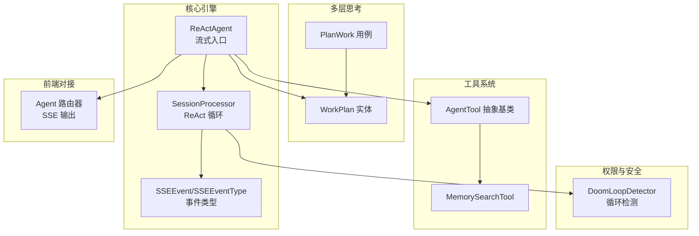
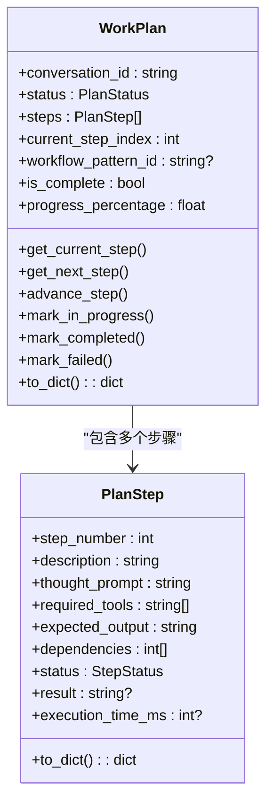
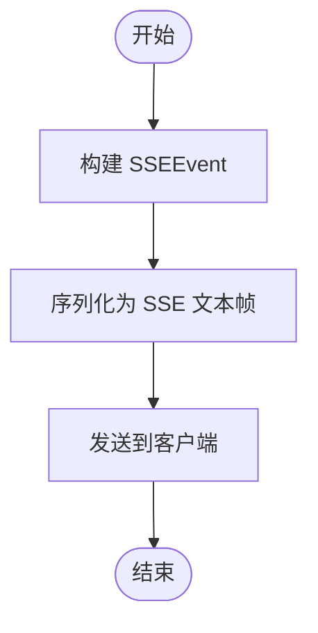
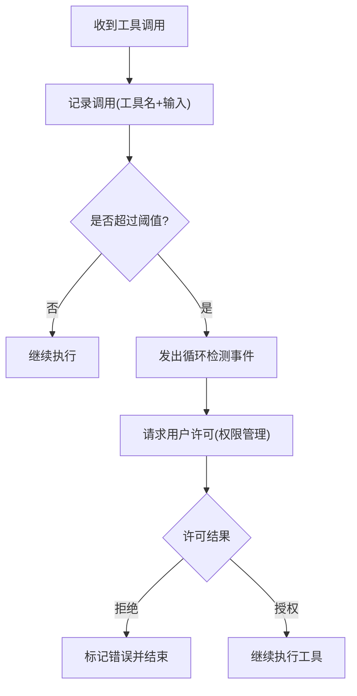
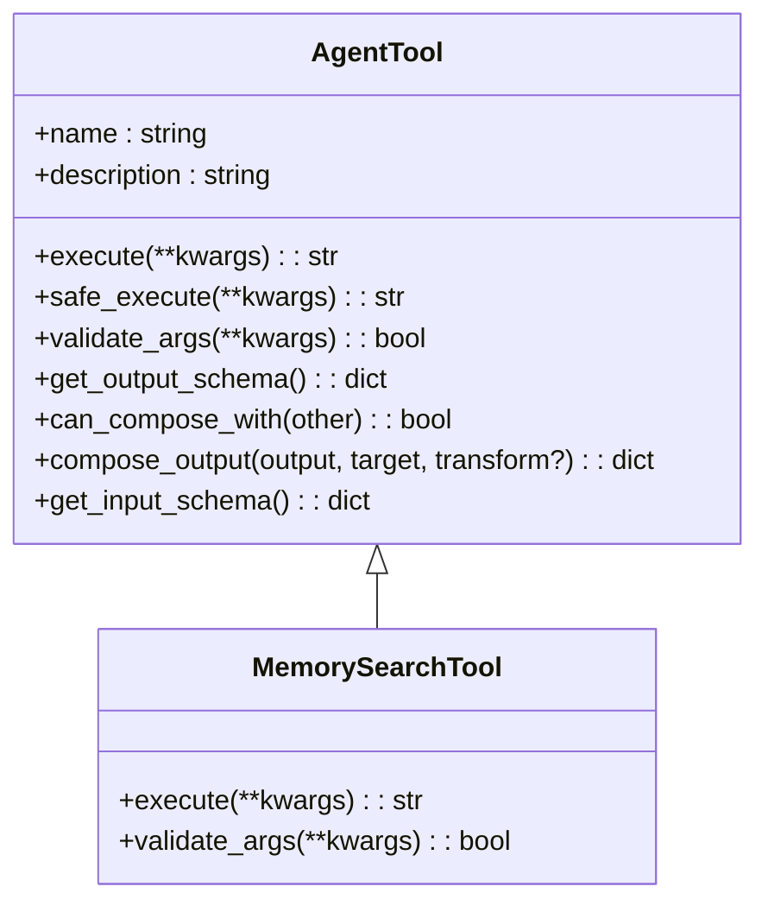
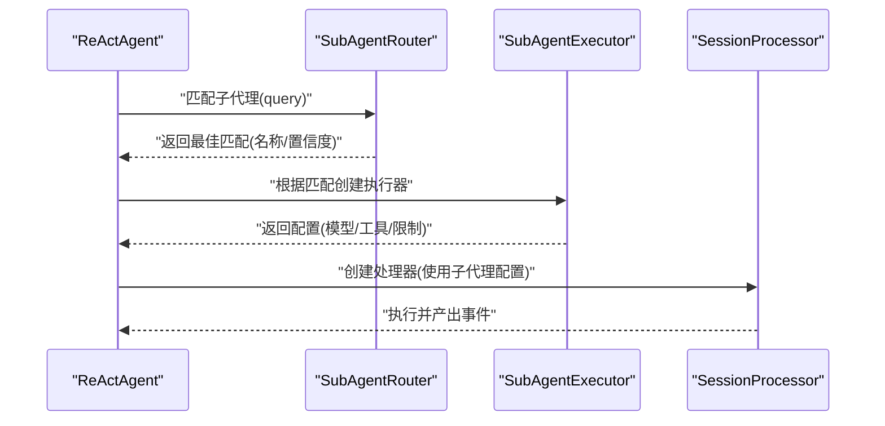
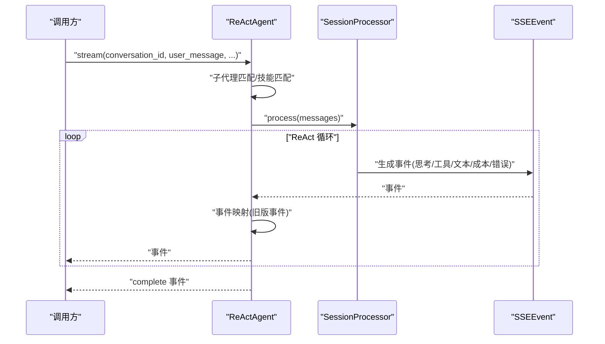
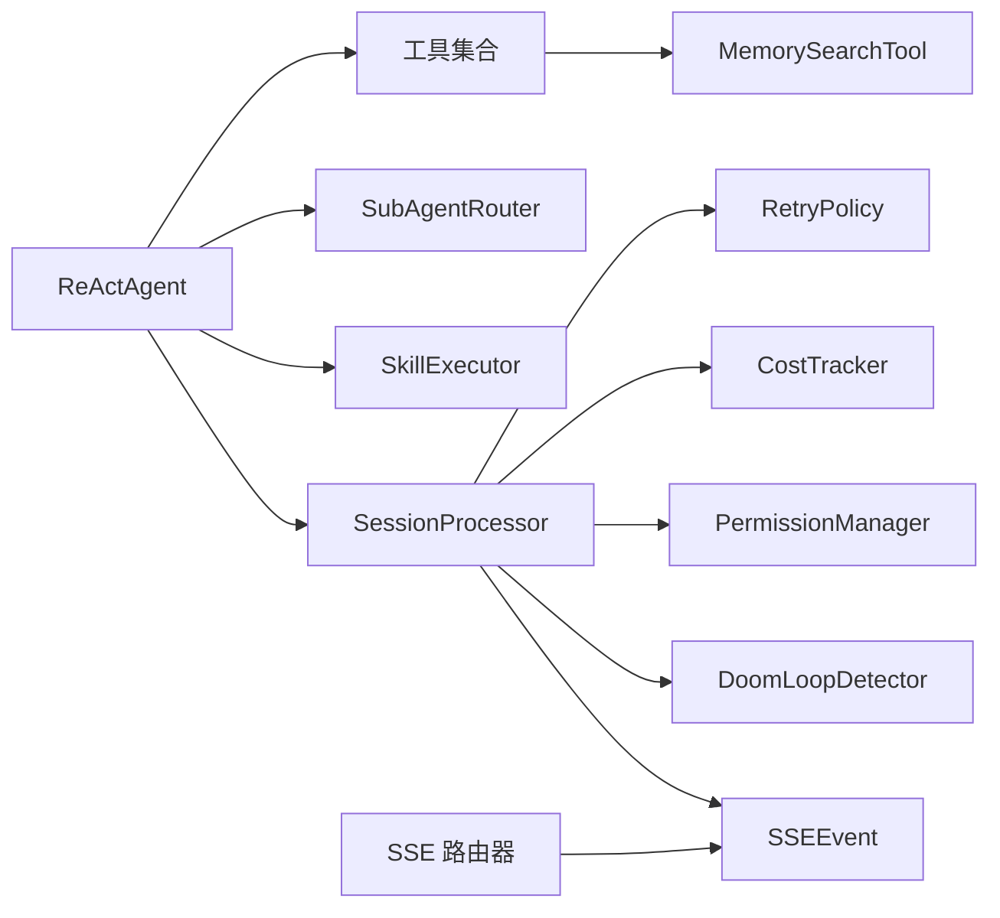

# 代理系统

<cite>
**本文引用的文件**
- [react_agent.py](file://src/infrastructure/agent/core/react_agent.py)
- [processor.py](file://src/infrastructure/agent/core/processor.py)
- [events.py](file://src/infrastructure/agent/core/events.py)
- [skill_executor.py](file://src/infrastructure/agent/core/skill_executor.py)
- [subagent_router.py](file://src/infrastructure/agent/core/subagent_router.py)
- [base.py](file://src/infrastructure/agent/tools/base.py)
- [memory_search.py](file://src/infrastructure/agent/tools/memory_search.py)
- [__init__.py](file://src/infrastructure/agent/tools/__init__.py)
- [work_plan.py](file://src/domain/model/agent/work_plan.py)
- [plan_work.py](file://src/application/use_cases/agent/plan_work.py)
- [detector.py](file://src/infrastructure/agent/doom_loop/detector.py)
- [agent.py](file://src/infrastructure/adapters/primary/web/routers/agent.py)
- [ARCHITECTURE.md](file://docs/architecture/ARCHITECTURE.md)
- [complete-react-agent-implementation-plan.md](file://docs/specs/complete-react-agent-implementation-plan.md)
</cite>

## 目录
1. [引言](#引言)
2. [项目结构](#项目结构)
3. [核心组件](#核心组件)
4. [架构总览](#架构总览)
5. [详细组件分析](#详细组件分析)
6. [依赖分析](#依赖分析)
7. [性能考量](#性能考量)
8. [故障排查指南](#故障排查指南)
9. [结论](#结论)
10. [附录](#附录)

## 引言
本文件面向 MemStack 代理系统，聚焦自研 ReAct 代理引擎的实现与扩展，系统性阐述多层思考架构（工作计划层 Work Plan、步骤层 Plan Step、任务层 Task）的设计与交互；详解事件流式传输（SSE）的实现原理与前端对接；深入解析循环检测机制如何防止代理陷入无限循环；全面介绍工具系统（接口、内置工具、权限控制）与技能系统、子代理系统的架构设计（专业化路由、并行/串行执行模式）。文末提供可操作的使用模式与扩展建议，帮助开发者快速理解并二次开发。

## 项目结构
代理系统位于后端基础设施层，采用“核心引擎 + 多层能力 + SSE 事件 + 工具与权限”的分层组织方式。关键目录与职责如下：
- 核心引擎：ReActAgent、SessionProcessor、SSE 事件定义
- 多层思考：WorkPlan 实体、PlanWork 用例
- 工具系统：AgentTool 抽象基类与具体工具实现
- 权限与安全：PermissionManager、DoomLoopDetector
- 前端对接：SSE 路由器与前端订阅 Hook



图示来源
- [react_agent.py](file://src/infrastructure/agent/core/react_agent.py#L37-L775)
- [processor.py](file://src/infrastructure/agent/core/processor.py#L122-L720)
- [events.py](file://src/infrastructure/agent/core/events.py#L10-L319)
- [work_plan.py](file://src/domain/model/agent/work_plan.py#L12-L88)
- [plan_work.py](file://src/application/use_cases/agent/plan_work.py#L24-L50)
- [base.py](file://src/infrastructure/agent/tools/base.py#L16-L289)
- [memory_search.py](file://src/infrastructure/agent/tools/memory_search.py#L16-L120)
- [detector.py](file://src/infrastructure/agent/doom_loop/detector.py#L24-L49)
- [agent.py](file://src/infrastructure/adapters/primary/web/routers/agent.py#L386-L415)

章节来源
- [react_agent.py](file://src/infrastructure/agent/core/react_agent.py#L37-L775)
- [processor.py](file://src/infrastructure/agent/core/processor.py#L122-L720)
- [events.py](file://src/infrastructure/agent/core/events.py#L10-L319)
- [work_plan.py](file://src/domain/model/agent/work_plan.py#L12-L88)
- [plan_work.py](file://src/application/use_cases/agent/plan_work.py#L24-L50)
- [base.py](file://src/infrastructure/agent/tools/base.py#L16-L289)
- [memory_search.py](file://src/infrastructure/agent/tools/memory_search.py#L16-L120)
- [detector.py](file://src/infrastructure/agent/doom_loop/detector.py#L24-L49)
- [agent.py](file://src/infrastructure/adapters/primary/web/routers/agent.py#L386-L415)

## 核心组件
- ReActAgent：自研 ReAct 引擎入口，负责多层思考（Work Plan/Steps/Task）、SSE 事件转换、技能匹配与子代理路由、工具集合转换与权限控制。
- SessionProcessor：ReAct 循环核心，驱动 LLMStream、工具执行、权限请求、循环检测、重试策略与成本追踪，并以 SSE 事件实时输出。
- SSEEvent/SSEEventType：统一的事件模型与事件类型枚举，覆盖思考、工具、文本、权限、错误、成本、重试、上下文压缩等。
- SkillExecutor：将技能（Skill）作为工具组合序列执行，支持串行顺序执行与结果累积。
- SubAgentRouter/SubAgentExecutor：子代理路由与执行器，按关键词/描述匹配最佳子代理，隔离模型与工具集，支持配置继承与权限过滤。
- AgentTool：工具抽象基类，提供统一的执行接口、参数校验、安全执行包装与工具组合能力（输出模式、兼容性检查、输出转换）。
- DoomLoopDetector：循环检测器，记录最近若干次工具调用，当同一工具+输入在时间窗内重复达到阈值时触发干预。
- 前端 SSE 路由器：将事件流转换为标准 SSE 格式，确保前端可实时消费。

章节来源
- [react_agent.py](file://src/infrastructure/agent/core/react_agent.py#L37-L775)
- [processor.py](file://src/infrastructure/agent/core/processor.py#L122-L720)
- [events.py](file://src/infrastructure/agent/core/events.py#L10-L319)
- [skill_executor.py](file://src/infrastructure/agent/core/skill_executor.py#L33-L224)
- [subagent_router.py](file://src/infrastructure/agent/core/subagent_router.py#L26-L257)
- [base.py](file://src/infrastructure/agent/tools/base.py#L16-L289)
- [detector.py](file://src/infrastructure/agent/doom_loop/detector.py#L24-L49)
- [agent.py](file://src/infrastructure/adapters/primary/web/routers/agent.py#L386-L415)

## 架构总览
下图展示 ReActAgent 如何协调多层思考、工具系统、权限与循环检测，并通过 SSE 将执行过程实时反馈给前端。

```mermaid
sequenceDiagram
participant Client as "客户端"
participant Router as "Agent 路由器"
participant Agent as "ReActAgent"
participant Proc as "SessionProcessor"
participant LLM as "LLMStream"
participant Tools as "工具集合"
participant Perm as "权限管理"
participant Loop as "循环检测"
Client->>Router : "建立 SSE 连接"
Router->>Agent : "stream(...)"
Agent->>Agent : "子代理匹配/技能匹配"
Agent->>Proc : "创建处理器(含工具/权限/循环检测)"
Proc->>LLM : "生成推理与行动"
LLM-->>Proc : "文本/推理/工具调用事件"
Proc->>Tools : "执行工具(带权限/循环检测)"
Tools-->>Proc : "观察结果/错误"
Proc->>Perm : "必要时请求权限"
Proc->>Loop : "记录/检测循环"
Proc-->>Agent : "SSE 事件"
Agent-->>Router : "SSE 事件"
Router-->>Client : "SSE 事件流"
```

图示来源
- [react_agent.py](file://src/infrastructure/agent/core/react_agent.py#L332-L532)
- [processor.py](file://src/infrastructure/agent/core/processor.py#L178-L498)
- [events.py](file://src/infrastructure/agent/core/events.py#L86-L106)
- [agent.py](file://src/infrastructure/adapters/primary/web/routers/agent.py#L386-L415)

## 详细组件分析

### 多层思考架构：工作计划层、步骤层、任务层
- 工作计划层（WorkPlan）：高层规划实体，包含状态、步骤列表、当前步骤索引、工作流模式关联等。提供推进步骤、计算进度、序列化等方法。
- 步骤层（PlanStep）：步骤值对象，描述单步的编号、描述、思考提示、所需工具、预期输出、依赖关系、状态与结果等。
- 任务层（Task）：在 ReAct 执行中体现为每一步的“思考—行动—观察”循环，SessionProcessor 在每步中产出思考、工具调用、观察结果与成本更新事件。



图示来源
- [work_plan.py](file://src/domain/model/agent/work_plan.py#L12-L88)
- [ARCHITECTURE.md](file://docs/architecture/ARCHITECTURE.md#L350-L402)

章节来源
- [work_plan.py](file://src/domain/model/agent/work_plan.py#L12-L88)
- [plan_work.py](file://src/application/use_cases/agent/plan_work.py#L24-L50)
- [ARCHITECTURE.md](file://docs/architecture/ARCHITECTURE.md#L350-L402)

### SSE 事件流式传输（SSE）
- 事件模型：SSEEvent 提供统一事件封装，SSEEventType 定义了思考、工作计划、工具、文本、权限、错误、成本、重试、上下文压缩等事件类型。
- 后端路由器：将内部 SSEEvent 转换为标准 SSE 文本帧，确保前端 EventSource 可正确解析。
- 事件转换：ReActAgent 将内部 SSEEvent 映射为旧版事件类型，保证前端兼容。



图示来源
- [events.py](file://src/infrastructure/agent/core/events.py#L86-L106)
- [agent.py](file://src/infrastructure/adapters/primary/web/routers/agent.py#L386-L415)
- [react_agent.py](file://src/infrastructure/agent/core/react_agent.py#L533-L702)

章节来源
- [events.py](file://src/infrastructure/agent/core/events.py#L10-L319)
- [agent.py](file://src/infrastructure/adapters/primary/web/routers/agent.py#L386-L415)
- [react_agent.py](file://src/infrastructure/agent/core/react_agent.py#L533-L702)

### 循环检测机制（DoomLoopDetector）
- 检测原理：记录最近若干次（默认窗口大小 10）工具调用（工具名 + 输入哈希），在时间窗（默认 60 秒）内若出现重复调用达到阈值（默认 3 次），则判定存在死循环风险。
- 干预流程：触发“循环检测”事件，进入等待权限状态，向权限管理器请求用户许可，超时或拒绝则终止该工具调用并发出观察事件。



图示来源
- [detector.py](file://src/infrastructure/agent/doom_loop/detector.py#L24-L49)
- [processor.py](file://src/infrastructure/agent/core/processor.py#L539-L582)
- [ARCHITECTURE.md](file://docs/architecture/ARCHITECTURE.md#L826-L889)

章节来源
- [detector.py](file://src/infrastructure/agent/doom_loop/detector.py#L24-L49)
- [processor.py](file://src/infrastructure/agent/core/processor.py#L539-L582)
- [ARCHITECTURE.md](file://docs/architecture/ARCHITECTURE.md#L826-L889)

### 工具系统：接口、内置工具与权限控制
- 工具接口：AgentTool 抽象基类定义 execute/safe_execute/参数校验/工具组合（输出模式、兼容性、输出转换）等能力。
- 内置工具：tools 包含多种工具导出，如 MemorySearchTool、WebSearchTool、GraphQueryTool 等，均实现统一接口。
- 权限控制：SessionProcessor 在执行工具前进行权限评估与请求，支持“ASK/DENY/ALLOW”三种动作；DoomLoopDetector 与权限结合防止危险循环。



图示来源
- [base.py](file://src/infrastructure/agent/tools/base.py#L16-L289)
- [memory_search.py](file://src/infrastructure/agent/tools/memory_search.py#L16-L120)
- [__init__.py](file://src/infrastructure/agent/tools/__init__.py#L7-L31)

章节来源
- [base.py](file://src/infrastructure/agent/tools/base.py#L16-L289)
- [memory_search.py](file://src/infrastructure/agent/tools/memory_search.py#L16-L120)
- [__init__.py](file://src/infrastructure/agent/tools/__init__.py#L7-L31)
- [processor.py](file://src/infrastructure/agent/core/processor.py#L586-L646)

### 技能系统与子代理系统
- 技能系统（L2）：SkillExecutor 将技能（工具序列）按顺序执行，串行累积上下文，产出每个工具的结果与最终汇总事件。
- 子代理系统（L3）：SubAgentRouter 基于关键词与描述匹配最佳子代理；SubAgentExecutor 提供隔离执行环境（模型、温度、最大迭代、允许工具集等）。



图示来源
- [react_agent.py](file://src/infrastructure/agent/core/react_agent.py#L375-L464)
- [subagent_router.py](file://src/infrastructure/agent/core/subagent_router.py#L60-L136)
- [subagent_router.py](file://src/infrastructure/agent/core/subagent_router.py#L194-L257)

章节来源
- [skill_executor.py](file://src/infrastructure/agent/core/skill_executor.py#L53-L204)
- [subagent_router.py](file://src/infrastructure/agent/core/subagent_router.py#L26-L257)
- [react_agent.py](file://src/infrastructure/agent/core/react_agent.py#L375-L464)

### ReActAgent 主流程与事件映射
- 入口：ReActAgent.stream 接收会话信息与上下文，先进行子代理与技能匹配，再构建系统提示与消息，创建 SessionProcessor 并逐事件转换为旧版事件格式返回。
- 事件映射：将 SSEEventType 映射为前端兼容的事件类型（如 thought/text_delta/act/observe/complete/error 等）。



图示来源
- [react_agent.py](file://src/infrastructure/agent/core/react_agent.py#L332-L532)
- [processor.py](file://src/infrastructure/agent/core/processor.py#L178-L280)
- [events.py](file://src/infrastructure/agent/core/events.py#L108-L145)

章节来源
- [react_agent.py](file://src/infrastructure/agent/core/react_agent.py#L332-L532)
- [processor.py](file://src/infrastructure/agent/core/processor.py#L178-L280)
- [events.py](file://src/infrastructure/agent/core/events.py#L108-L145)

## 依赖分析
- ReActAgent 依赖 SessionProcessor、SSE 事件、技能执行器、子代理路由、权限管理器与工具定义。
- SessionProcessor 依赖 LLMStream、DoomLoopDetector、RetryPolicy、CostTracker、PermissionManager 与 SSE 事件。
- 工具系统通过 AgentTool 抽象统一，具体工具实现依赖服务端接口（如 GraphServicePort）。
- 前端通过 SSE 路由器消费事件，事件格式与前端兼容层保持一致。



图示来源
- [react_agent.py](file://src/infrastructure/agent/core/react_agent.py#L71-L141)
- [processor.py](file://src/infrastructure/agent/core/processor.py#L140-L172)
- [memory_search.py](file://src/infrastructure/agent/tools/memory_search.py#L24-L41)
- [agent.py](file://src/infrastructure/adapters/primary/web/routers/agent.py#L386-L415)

章节来源
- [react_agent.py](file://src/infrastructure/agent/core/react_agent.py#L71-L141)
- [processor.py](file://src/infrastructure/agent/core/processor.py#L140-L172)
- [memory_search.py](file://src/infrastructure/agent/tools/memory_search.py#L24-L41)
- [agent.py](file://src/infrastructure/adapters/primary/web/routers/agent.py#L386-L415)

## 性能考量
- 最大步数与工具调用限制：SessionProcessor 配置包含最大步数、每步最大工具调用数，避免长尾执行。
- 成本追踪与上下文压缩：CostTracker 在用量达到阈值时触发“上下文压缩”信号，降低后续成本。
- 重试策略：RetryPolicy 基于指数回退延迟，减少瞬时错误对整体性能的影响。
- 循环检测：DoomLoopDetector 通过时间窗与阈值快速识别并干预潜在死循环，避免资源浪费。

章节来源
- [processor.py](file://src/infrastructure/agent/core/processor.py#L72-L98)
- [processor.py](file://src/infrastructure/agent/core/processor.py#L445-L448)
- [detector.py](file://src/infrastructure/agent/doom_loop/detector.py#L47-L49)

## 故障排查指南
- SSE 序列化失败：后端路由器在序列化事件数据失败时会记录错误并返回通用错误消息，前端应捕获并提示用户重试。
- 客户端断开连接：路由层对取消异常进行特殊处理，不发送错误事件，避免无意义的错误风暴。
- 权限请求超时：工具执行或循环干预时，若权限请求超时，会标记错误并结束该工具调用，前端应显示超时提示。
- 工具不可用：未知工具名或权限被拒时，会发出观察事件并记录错误原因，前端可据此提示用户调整权限或更换工具。
- 向量化维度不匹配：内存搜索工具在检测到嵌入维度不一致时，返回明确提示并引导用户稍后再试。

章节来源
- [agent.py](file://src/infrastructure/adapters/primary/web/routers/agent.py#L390-L401)
- [agent.py](file://src/infrastructure/adapters/primary/web/routers/agent.py#L410-L415)
- [processor.py](file://src/infrastructure/agent/core/processor.py#L547-L581)
- [memory_search.py](file://src/infrastructure/agent/tools/memory_search.py#L102-L119)

## 结论
MemStack 的自研 ReAct 代理引擎以清晰的多层思考架构为基础，结合 SSE 实时事件流、完善的工具与权限体系、以及循环检测与成本控制，形成了稳定、可观测且可扩展的智能体执行框架。通过技能系统与子代理系统，代理能够在不同任务域内实现专业化与规模化协同。建议在扩展新工具与技能时遵循 AgentTool 接口规范与组合能力，确保事件一致性与安全性。

## 附录
- 开发者使用模式与扩展建议可参考以下文档与计划：
  - ReAct Agent 系统完整实施开发计划：涵盖 L2/L3 能力扩展与 MCP 集成等优先事项。
  - 架构文档：包含 WorkPlan/PlanStep 等领域模型与 SSE 事件定义。

章节来源
- [complete-react-agent-implementation-plan.md](file://docs/specs/complete-react-agent-implementation-plan.md#L1-L44)
- [ARCHITECTURE.md](file://docs/architecture/ARCHITECTURE.md#L349-L402)
- [ARCHITECTURE.md](file://docs/architecture/ARCHITECTURE.md#L796-L889)