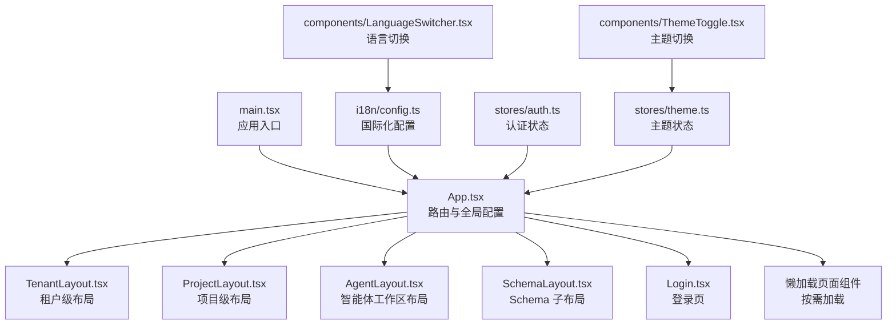
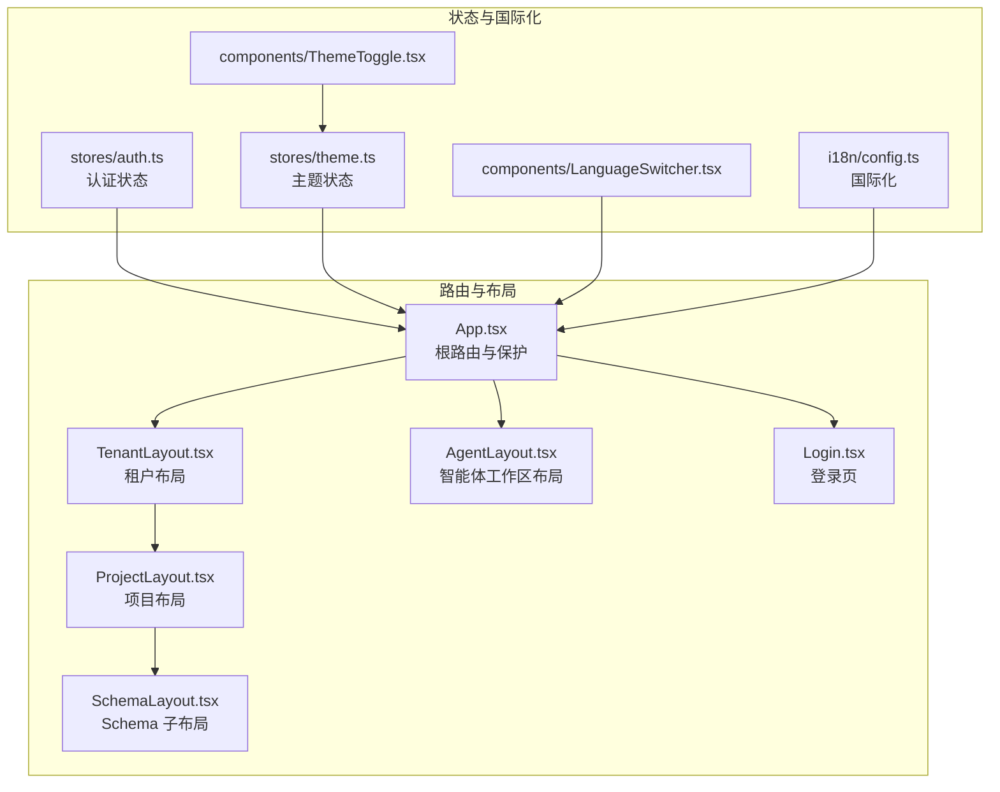
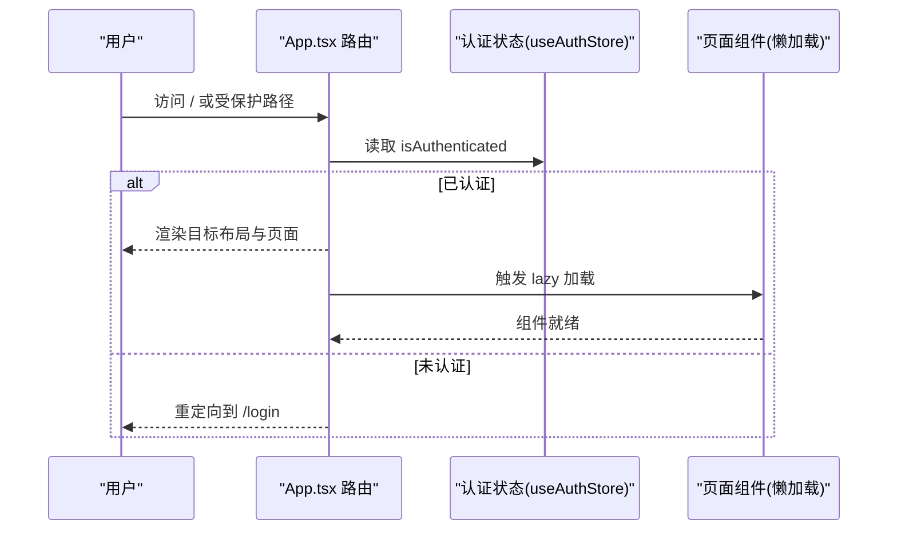
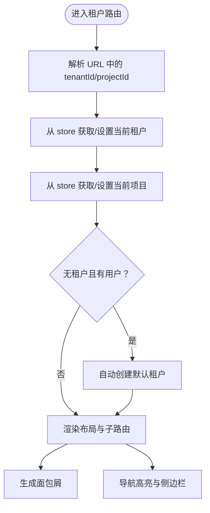
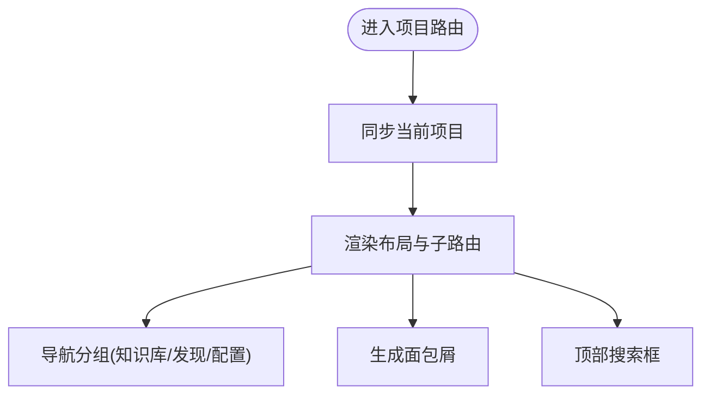
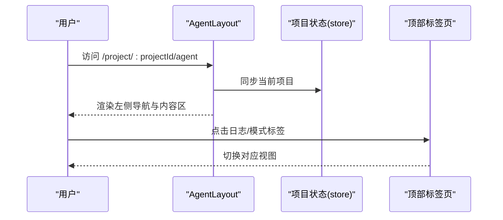
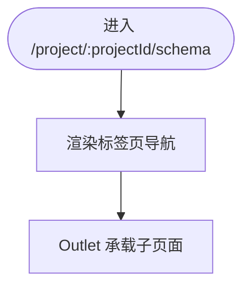
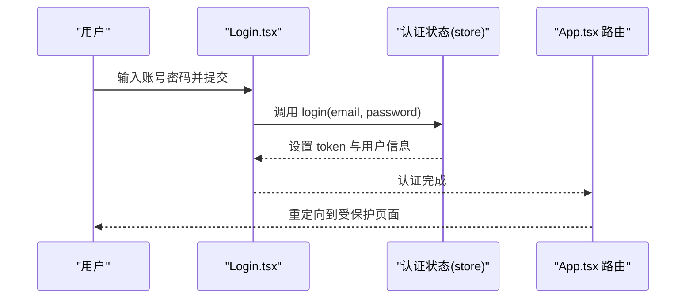
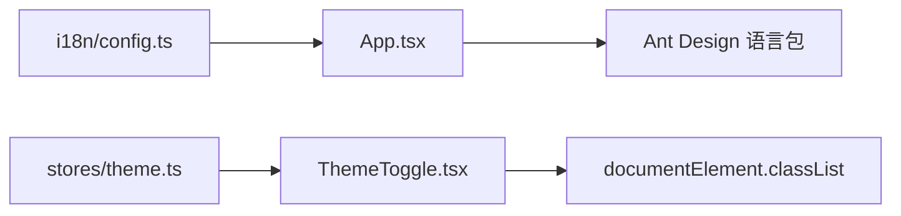
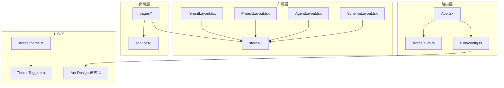

# React 应用结构

<cite>
**本文档引用的文件**
- [App.tsx](file://web/src/App.tsx)
- [main.tsx](file://web/src/main.tsx)
- [TenantLayout.tsx](file://web/src/layouts/TenantLayout.tsx)
- [ProjectLayout.tsx](file://web/src/layouts/ProjectLayout.tsx)
- [AgentLayout.tsx](file://web/src/layouts/AgentLayout.tsx)
- [SchemaLayout.tsx](file://web/src/layouts/SchemaLayout.tsx)
- [config.ts](file://web/src/i18n/config.ts)
- [auth.ts](file://web/src/stores/auth.ts)
- [theme.ts](file://web/src/stores/theme.ts)
- [ThemeToggle.tsx](file://web/src/components/ThemeToggle.tsx)
- [LanguageSwitcher.tsx](file://web/src/components/LanguageSwitcher.tsx)
- [Login.tsx](file://web/src/pages/Login.tsx)
- [vite.config.ts](file://web/vite.config.ts)
</cite>

## 目录
1. [简介](#简介)
2. [项目结构](#项目结构)
3. [核心组件](#核心组件)
4. [架构总览](#架构总览)
5. [详细组件分析](#详细组件分析)
6. [依赖关系分析](#依赖关系分析)
7. [性能考虑](#性能考虑)
8. [故障排除指南](#故障排除指南)
9. [结论](#结论)
10. [附录](#附录)

## 简介
本文件面向 MemStack 前端 React 应用，系统性梳理基于 React Router 的路由体系与布局组件设计，重点覆盖以下方面：
- 路由系统与代码分割策略（Code Splitting）
- 路由保护机制（认证状态检查与重定向）
- 国际化配置与 Ant Design 主题切换
- 布局组件 TenantLayout、ProjectLayout、AgentLayout、SchemaLayout 的设计原理与使用场景
- 最佳实践与扩展指南

## 项目结构
前端采用 Vite 构建，入口为 main.tsx，根组件 App.tsx 定义全站路由；布局组件位于 layouts 目录，页面组件位于 pages 目录，国际化与主题状态通过 stores 管理。

图表来源
- [main.tsx](file://web/src/main.tsx#L1-L14)
- [App.tsx](file://web/src/App.tsx#L1-L177)
- [TenantLayout.tsx](file://web/src/layouts/TenantLayout.tsx#L1-L490)
- [ProjectLayout.tsx](file://web/src/layouts/ProjectLayout.tsx#L1-L348)
- [AgentLayout.tsx](file://web/src/layouts/AgentLayout.tsx#L1-L290)
- [SchemaLayout.tsx](file://web/src/layouts/SchemaLayout.tsx#L1-L49)
- [config.ts](file://web/src/i18n/config.ts#L1-L33)
- [auth.ts](file://web/src/stores/auth.ts#L1-L111)
- [theme.ts](file://web/src/stores/theme.ts#L1-L57)
- [ThemeToggle.tsx](file://web/src/components/ThemeToggle.tsx#L1-L46)
- [LanguageSwitcher.tsx](file://web/src/components/LanguageSwitcher.tsx#L1-L27)
- [Login.tsx](file://web/src/pages/Login.tsx#L1-L252)

章节来源
- [main.tsx](file://web/src/main.tsx#L1-L14)
- [App.tsx](file://web/src/App.tsx#L1-L177)

## 核心组件
- 路由与代码分割：App.tsx 使用 React.lazy 与 Suspense 对页面组件进行懒加载，减少首屏体积，提升加载性能。
- 路由保护：通过 useAuthStore 的认证状态在路由层进行保护，未登录用户被重定向至登录页。
- 国际化：i18n/config.ts 配置多语言资源与检测策略，App.tsx 动态根据语言设置 Ant Design 语言包。
- 主题切换：stores/theme.ts 管理主题状态，ThemeToggle 组件提供切换入口，LanguageSwitcher 提供语言切换入口。

章节来源
- [App.tsx](file://web/src/App.tsx#L16-L81)
- [config.ts](file://web/src/i18n/config.ts#L17-L30)
- [auth.ts](file://web/src/stores/auth.ts#L19-L24)
- [theme.ts](file://web/src/stores/theme.ts#L12-L31)
- [ThemeToggle.tsx](file://web/src/components/ThemeToggle.tsx#L1-L46)
- [LanguageSwitcher.tsx](file://web/src/components/LanguageSwitcher.tsx#L1-L27)

## 架构总览
整体采用“布局嵌套 + 子路由”的结构：TenantLayout 为租户级主框架，内部嵌套 ProjectLayout；ProjectLayout 内部再嵌套 SchemaLayout；AgentLayout 作为独立全屏工作区布局。路由在 App.tsx 中集中声明，配合懒加载与保护逻辑形成清晰的层级与职责划分。

图表来源
- [App.tsx](file://web/src/App.tsx#L84-L173)
- [TenantLayout.tsx](file://web/src/layouts/TenantLayout.tsx#L200-L488)
- [ProjectLayout.tsx](file://web/src/layouts/ProjectLayout.tsx#L136-L346)
- [SchemaLayout.tsx](file://web/src/layouts/SchemaLayout.tsx#L5-L48)
- [AgentLayout.tsx](file://web/src/layouts/AgentLayout.tsx#L107-L286)
- [Login.tsx](file://web/src/pages/Login.tsx#L7-L252)
- [auth.ts](file://web/src/stores/auth.ts#L19-L24)
- [theme.ts](file://web/src/stores/theme.ts#L12-L31)
- [ThemeToggle.tsx](file://web/src/components/ThemeToggle.tsx#L5-L44)
- [LanguageSwitcher.tsx](file://web/src/components/LanguageSwitcher.tsx#L6-L25)
- [config.ts](file://web/src/i18n/config.ts#L17-L30)

## 详细组件分析

### 路由与代码分割（App.tsx）
- 代码分割策略：所有页面组件均通过 React.lazy 按需加载，配合 Suspense 提供加载占位，避免初始包过大。
- 路由保护：通过 useAuthStore.isAuthenticated 控制路由可见性，未登录用户无法进入受保护路由，自动跳转登录页。
- 国际化与 Ant Design：根据 i18n.language 动态选择 Ant Design 语言包，确保 UI 文案与组件本地化一致。
- 重定向逻辑：根路径根据认证状态重定向至租户概览或登录页；通配符路由统一回到首页，保证健壮性。

图表来源
- [App.tsx](file://web/src/App.tsx#L74-L97)
- [auth.ts](file://web/src/stores/auth.ts#L19-L24)

章节来源
- [App.tsx](file://web/src/App.tsx#L16-L81)
- [App.tsx](file://web/src/App.tsx#L84-L173)
- [auth.ts](file://web/src/stores/auth.ts#L19-L24)

### 布局组件：TenantLayout（租户级主框架）
- 设计定位：租户级主布局，负责租户上下文同步、侧边导航、面包屑、顶部工具栏与主题/语言切换。
- 关键能力：
  - 租户与项目状态同步：监听 URL 参数，从 store 获取并设置当前租户/项目。
  - 自动创建工作空间：当无租户且用户存在时，尝试自动创建默认租户。
  - 面包屑与导航：根据路径生成面包屑，导航项根据当前路径高亮。
  - 侧边栏折叠与响应式：支持折叠/展开，适配不同屏幕尺寸。
- 使用场景：租户概览、用户管理、供应商管理、分析与账单等平台级功能。

图表来源
- [TenantLayout.tsx](file://web/src/layouts/TenantLayout.tsx#L40-L100)
- [TenantLayout.tsx](file://web/src/layouts/TenantLayout.tsx#L141-L181)
- [TenantLayout.tsx](file://web/src/layouts/TenantLayout.tsx#L183-L198)

章节来源
- [TenantLayout.tsx](file://web/src/layouts/TenantLayout.tsx#L1-L490)

### 布局组件：ProjectLayout（项目级主框架）
- 设计定位：项目级主布局，提供项目上下文、知识库/发现/配置三大导航分组、顶部搜索与快捷操作。
- 关键能力：
  - 项目上下文同步：监听 projectId，从 store 获取并设置当前项目。
  - 导航分组与展开：支持知识库、发现、配置三组折叠/展开。
  - 面包屑与搜索：顶部面包屑与搜索框，支持快速跳转与搜索。
  - 侧边栏折叠与响应式：支持折叠/展开，适配不同屏幕尺寸。
- 使用场景：记忆列表、实体/社区浏览、知识图谱、深度搜索、Schema 管理、维护与团队设置等。

图表来源
- [ProjectLayout.tsx](file://web/src/layouts/ProjectLayout.tsx#L83-L110)
- [ProjectLayout.tsx](file://web/src/layouts/ProjectLayout.tsx#L112-L134)
- [ProjectLayout.tsx](file://web/src/layouts/ProjectLayout.tsx#L169-L226)

章节来源
- [ProjectLayout.tsx](file://web/src/layouts/ProjectLayout.tsx#L1-L348)

### 布局组件：AgentLayout（智能体工作区布局）
- 设计定位：全屏智能体工作区布局，左侧全局导航，顶部标签页（仪表盘/日志/模式），右侧内容区。
- 关键能力：
  - 项目上下文：根据 projectId 同步当前项目。
  - 左侧导航与底部导航：提供返回项目、项目列表、工作区概览、内存浏览、实体、分析、设置、支持等入口。
  - 顶部标签页：支持仪表盘、日志、模式三个视图切换。
  - 侧边栏折叠与响应式：支持折叠/展开，适配不同屏幕尺寸。
- 使用场景：智能体聊天界面、执行日志查看、工作流模式管理等。

图表来源
- [AgentLayout.tsx](file://web/src/layouts/AgentLayout.tsx#L55-L106)
- [AgentLayout.tsx](file://web/src/layouts/AgentLayout.tsx#L107-L286)

章节来源
- [AgentLayout.tsx](file://web/src/layouts/AgentLayout.tsx#L1-L290)

### 布局组件：SchemaLayout（Schema 子布局）
- 设计定位：Schema 管理的子布局，提供 Overview、Entity Types、Edge Types、Mapping 四个标签页。
- 关键能力：
  - 标签页导航：根据当前路径高亮对应标签。
  - 内容区：Outlet 承载各子页面。
- 使用场景：Schema 概览、实体类型管理、边类型管理、映射关系管理。

图表来源
- [SchemaLayout.tsx](file://web/src/layouts/SchemaLayout.tsx#L5-L48)

章节来源
- [SchemaLayout.tsx](file://web/src/layouts/SchemaLayout.tsx#L1-L49)

### 登录页与路由保护（Login.tsx + App.tsx）
- 登录流程：Login.tsx 提供表单与演示账户填充，调用 useAuthStore.login 完成认证；认证成功后由路由守卫自动重定向。
- 路由保护：App.tsx 在根路由与各受保护路由上检查 isAuthenticated，未登录则重定向到 /login。

图表来源
- [Login.tsx](file://web/src/pages/Login.tsx#L16-L28)
- [auth.ts](file://web/src/stores/auth.ts#L26-L55)
- [App.tsx](file://web/src/App.tsx#L87-L90)

章节来源
- [Login.tsx](file://web/src/pages/Login.tsx#L1-L252)
- [auth.ts](file://web/src/stores/auth.ts#L19-L73)
- [App.tsx](file://web/src/App.tsx#L84-L97)

### 国际化与 Ant Design 主题切换
- 国际化：i18n/config.ts 初始化多语言资源与检测策略，App.tsx 根据当前语言动态设置 Ant Design 语言包。
- 主题切换：stores/theme.ts 管理主题状态（light/dark/system），ThemeToggle 提供切换入口；LanguageSwitcher 提供语言切换入口。

图表来源
- [config.ts](file://web/src/i18n/config.ts#L17-L30)
- [App.tsx](file://web/src/App.tsx#L78-L84)
- [theme.ts](file://web/src/stores/theme.ts#L33-L46)
- [ThemeToggle.tsx](file://web/src/components/ThemeToggle.tsx#L5-L44)
- [LanguageSwitcher.tsx](file://web/src/components/LanguageSwitcher.tsx#L6-L25)

章节来源
- [config.ts](file://web/src/i18n/config.ts#L1-L33)
- [theme.ts](file://web/src/stores/theme.ts#L1-L57)
- [ThemeToggle.tsx](file://web/src/components/ThemeToggle.tsx#L1-L46)
- [LanguageSwitcher.tsx](file://web/src/components/LanguageSwitcher.tsx#L1-L27)

## 依赖关系分析
- 路由层依赖认证状态与国际化配置，布局层依赖项目/租户状态与用户信息，页面层依赖服务层与状态层。
- 代码分割通过 React.lazy 与 Suspense 解耦页面组件，降低初始包体积。
- Ant Design ConfigProvider 与 i18n 动态语言包确保 UI 与文案一致性。

图表来源
- [App.tsx](file://web/src/App.tsx#L1-L14)
- [auth.ts](file://web/src/stores/auth.ts#L1-L111)
- [config.ts](file://web/src/i18n/config.ts#L1-L33)
- [theme.ts](file://web/src/stores/theme.ts#L1-L57)
- [TenantLayout.tsx](file://web/src/layouts/TenantLayout.tsx#L1-L490)
- [ProjectLayout.tsx](file://web/src/layouts/ProjectLayout.tsx#L1-L348)
- [AgentLayout.tsx](file://web/src/layouts/AgentLayout.tsx#L1-L290)
- [SchemaLayout.tsx](file://web/src/layouts/SchemaLayout.tsx#L1-L49)

章节来源
- [App.tsx](file://web/src/App.tsx#L1-L177)
- [auth.ts](file://web/src/stores/auth.ts#L1-L111)
- [config.ts](file://web/src/i18n/config.ts#L1-L33)
- [theme.ts](file://web/src/stores/theme.ts#L1-L57)

## 性能考虑
- 代码分割：所有页面组件均懒加载，显著降低首屏 JS 体积，提升首次加载速度。
- Suspense 占位：统一的加载骨架（Spin）提升用户体验，避免白屏。
- 构建配置：Vite 默认开启代理与源码映射，便于开发调试与生产性能追踪。
- 状态持久化：主题状态通过 persist 存储在本地，避免每次刷新重算。

章节来源
- [App.tsx](file://web/src/App.tsx#L16-L81)
- [App.tsx](file://web/src/App.tsx#L67-L72)
- [vite.config.ts](file://web/vite.config.ts#L1-L31)
- [theme.ts](file://web/src/stores/theme.ts#L12-L31)

## 故障排除指南
- 登录失败：检查 useAuthStore.login 的错误处理与提示，确认网络代理与 API 地址配置。
- 路由跳转异常：确认 isAuthenticated 状态与路由守卫逻辑，检查本地存储 token 是否有效。
- 国际化不生效：确认 i18n.init 配置与 LanguageSwitcher 的切换逻辑，检查 Ant Design 语言包设置。
- 主题切换无效：确认 theme.ts 的持久化与 documentElement.classList 更新逻辑，检查系统深色模式监听。

章节来源
- [auth.ts](file://web/src/stores/auth.ts#L43-L54)
- [App.tsx](file://web/src/App.tsx#L87-L90)
- [config.ts](file://web/src/i18n/config.ts#L17-L30)
- [theme.ts](file://web/src/stores/theme.ts#L33-L56)

## 结论
MemStack 的前端路由与布局体系以 React Router 为核心，结合代码分割、路由保护、国际化与主题切换，形成了清晰、可扩展且高性能的前端架构。TenantLayout、ProjectLayout、AgentLayout、SchemaLayout 各司其职，既满足多层级业务场景，又保持了良好的可维护性与扩展性。

## 附录
- 最佳实践
  - 新增页面：使用 React.lazy 按需加载，避免阻塞首屏。
  - 路由保护：在 App.tsx 集中处理认证守卫，避免在页面内重复判断。
  - 布局嵌套：遵循租户 -> 项目 -> 子功能的层级，保持路由与状态的一致性。
  - 国际化：统一在 i18n/config.ts 管理资源，页面中使用 useTranslation 获取文案。
  - 主题：通过 stores/theme.ts 管理主题状态，组件中使用 ThemeToggle 切换。
- 扩展指南
  - 新增布局：参考现有布局组件的结构与状态同步方式，确保与 store 的交互一致。
  - 新增页面：在 App.tsx 中新增路由条目，使用 Suspense 包裹懒加载组件。
  - 新增语言：在 locales 下新增语言包，更新 i18n/config.ts 的 resources 与 detection 配置。