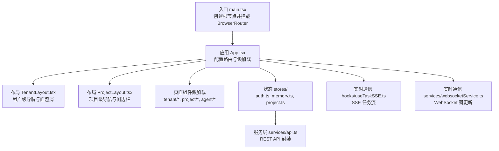
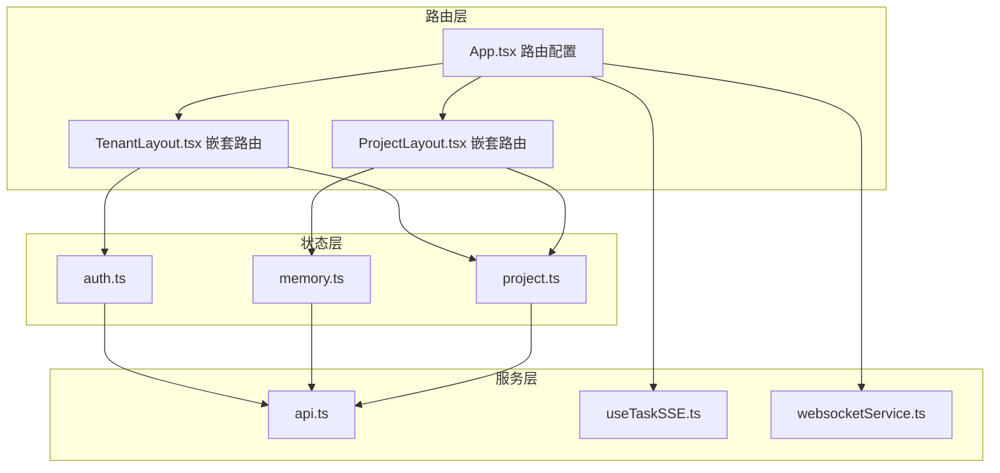
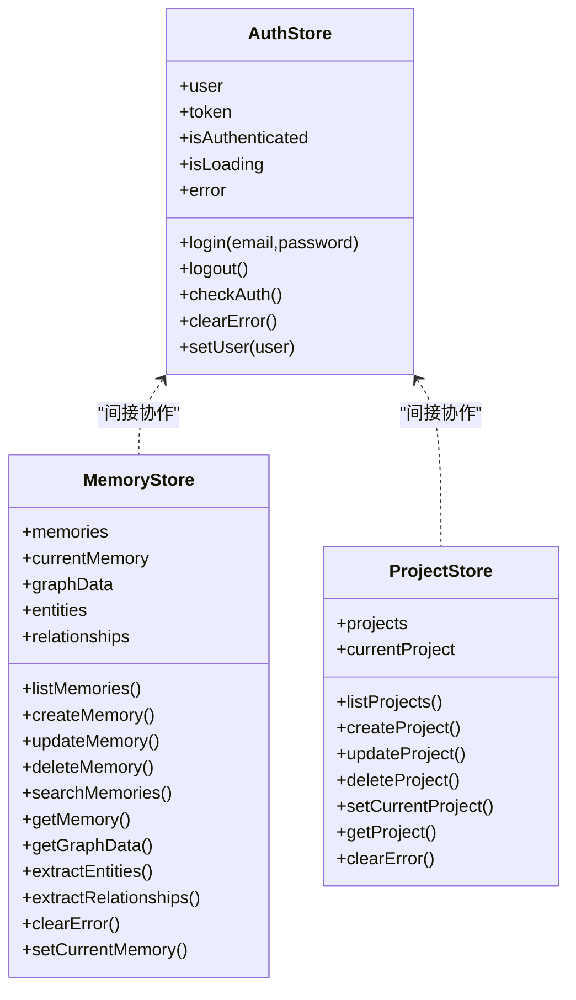
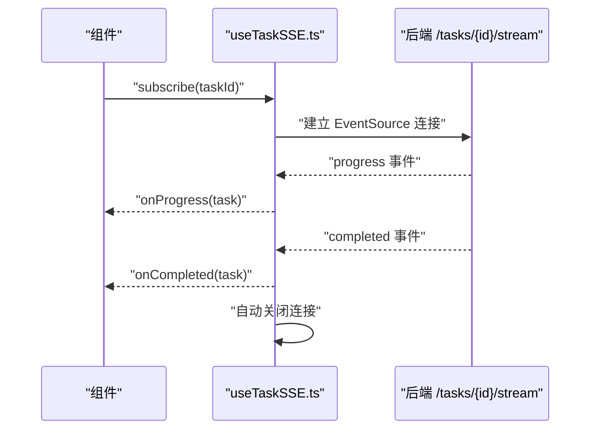
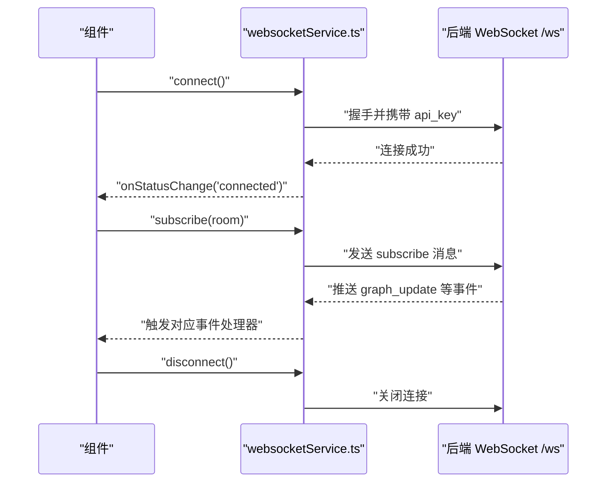
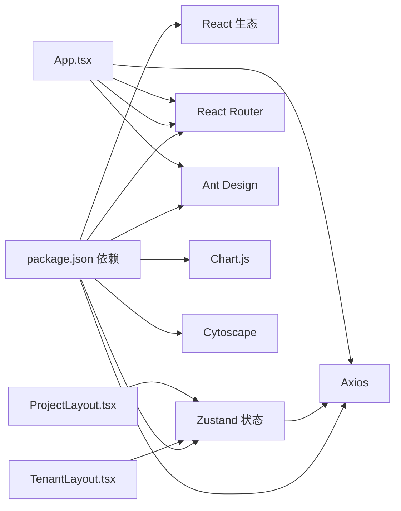

# 前端系统

<cite>
**本文引用的文件**
- [web/src/main.tsx](file://web/src/main.tsx)
- [web/src/App.tsx](file://web/src/App.tsx)
- [web/package.json](file://web/package.json)
- [web/vite.config.ts](file://web/vite.config.ts)
- [web/tsconfig.json](file://web/tsconfig.json)
- [web/src/stores/auth.ts](file://web/src/stores/auth.ts)
- [web/src/stores/memory.ts](file://web/src/stores/memory.ts)
- [web/src/stores/project.ts](file://web/src/stores/project.ts)
- [web/src/layouts/TenantLayout.tsx](file://web/src/layouts/TenantLayout.tsx)
- [web/src/layouts/ProjectLayout.tsx](file://web/src/layouts/ProjectLayout.tsx)
- [web/src/components/common/index.ts](file://web/src/components/common/index.ts)
- [web/src/components/agent/index.ts](file://web/src/components/agent/index.ts)
- [web/src/services/api.ts](file://web/src/services/api.ts)
- [web/src/hooks/useTaskSSE.ts](file://web/src/hooks/useTaskSSE.ts)
- [web/src/services/websocketService.ts](file://web/src/services/websocketService.ts)
</cite>

## 目录
1. [简介](#简介)
2. [项目结构](#项目结构)
3. [核心组件](#核心组件)
4. [架构总览](#架构总览)
5. [详细组件分析](#详细组件分析)
6. [依赖关系分析](#依赖关系分析)
7. [性能考量](#性能考量)
8. [故障排查指南](#故障排查指南)
9. [结论](#结论)
10. [附录](#附录)

## 简介
本文件面向 MemStack 前端系统，围绕基于 React + TypeScript 的单页应用（SPA）进行系统化文档化说明。重点覆盖以下方面：
- 路由系统与布局组件：以租户（Tenant）与项目（Project）为主线的两级布局体系，以及代理工作区（Agent Workspace）的全屏布局。
- 状态管理：Zustand 的使用方式、代理状态与记忆状态的组织策略、项目状态管理与选择器（selector）优化。
- UI 组件库：通用组件、代理专用组件、表单与可视化组件的分类与职责边界。
- 实时通信：Server-Sent Events（SSE）任务状态流与 WebSocket 图更新订阅。
- 最佳实践：组件开发、样式定制与主题支持、国际化与本地化。
- 使用示例与集成指南：如何在现有架构上扩展新页面、组件与状态模块。

## 项目结构
前端位于 web 子目录，采用 Vite 构建工具链，TypeScript 类型约束，TailwindCSS 样式框架，Ant Design 作为部分基础 UI 组件库，Zustand 提供轻量状态管理，Axios 封装 REST API，React Router v7 实现路由与懒加载。

图表来源
- [web/src/main.tsx](file://web/src/main.tsx#L1-L14)
- [web/src/App.tsx](file://web/src/App.tsx#L1-L177)
- [web/src/layouts/TenantLayout.tsx](file://web/src/layouts/TenantLayout.tsx#L1-L490)
- [web/src/layouts/ProjectLayout.tsx](file://web/src/layouts/ProjectLayout.tsx#L1-L348)
- [web/src/stores/auth.ts](file://web/src/stores/auth.ts#L1-L111)
- [web/src/stores/memory.ts](file://web/src/stores/memory.ts#L1-L257)
- [web/src/stores/project.ts](file://web/src/stores/project.ts#L1-L181)
- [web/src/services/api.ts](file://web/src/services/api.ts#L1-L318)
- [web/src/hooks/useTaskSSE.ts](file://web/src/hooks/useTaskSSE.ts#L1-L248)
- [web/src/services/websocketService.ts](file://web/src/services/websocketService.ts#L1-L323)

章节来源
- [web/src/main.tsx](file://web/src/main.tsx#L1-L14)
- [web/src/App.tsx](file://web/src/App.tsx#L1-L177)
- [web/package.json](file://web/package.json#L1-L72)
- [web/vite.config.ts](file://web/vite.config.ts#L1-L31)
- [web/tsconfig.json](file://web/tsconfig.json#L1-L40)

## 核心组件
- 应用入口与路由
  - 入口文件负责创建根节点并包裹浏览器路由容器，确保 SPA 路由生效。
  - App 组件集中定义所有页面路由，采用按需懒加载与 Suspense 占位，提升首屏性能。
- 布局组件
  - 租户布局（TenantLayout）：提供租户级导航、面包屑、全局搜索、主题切换、语言切换、工作空间切换等。
  - 项目布局（ProjectLayout）：提供项目级导航、分组折叠菜单、顶部操作区、支持与设置等。
- 状态管理（Zustand）
  - 认证状态（auth.ts）：登录、登出、令牌校验、错误清理、用户信息持久化。
  - 记忆状态（memory.ts）：记忆列表、创建、更新、删除、搜索、图数据、实体/关系抽取、分页与加载状态。
  - 项目状态（project.ts）：项目列表、创建、更新、删除、当前项目、分页与加载状态。
- 服务层（API）
  - axios 封装统一请求与响应拦截，自动注入认证头；401 自动跳转登录。
  - 按领域拆分 API 模块：认证、租户、项目、记忆、模式、任务、提供商等。
- 实时通信
  - SSE（useTaskSSE.ts）：订阅任务进度、完成、失败事件，标准化状态映射与 JSON 安全解析。
  - WebSocket（websocketService.ts）：连接管理、重连机制、房间订阅、事件分发、状态监听钩子。

章节来源
- [web/src/App.tsx](file://web/src/App.tsx#L1-L177)
- [web/src/layouts/TenantLayout.tsx](file://web/src/layouts/TenantLayout.tsx#L1-L490)
- [web/src/layouts/ProjectLayout.tsx](file://web/src/layouts/ProjectLayout.tsx#L1-L348)
- [web/src/stores/auth.ts](file://web/src/stores/auth.ts#L1-L111)
- [web/src/stores/memory.ts](file://web/src/stores/memory.ts#L1-L257)
- [web/src/stores/project.ts](file://web/src/stores/project.ts#L1-L181)
- [web/src/services/api.ts](file://web/src/services/api.ts#L1-L318)
- [web/src/hooks/useTaskSSE.ts](file://web/src/hooks/useTaskSSE.ts#L1-L248)
- [web/src/services/websocketService.ts](file://web/src/services/websocketService.ts#L1-L323)

## 架构总览
前端采用“路由 + 布局 + 状态 + 服务 + 实时”的分层架构：
- 路由层：React Router v7 管理页面与嵌套路由，结合懒加载与代码分割。
- 布局层：TenantLayout 与 ProjectLayout 提供上下文感知的导航与内容区域。
- 状态层：Zustand store 管理认证、记忆、项目等业务状态，提供 selector 优化订阅粒度。
- 服务层：API 封装统一调用，拦截器处理认证与错误。
- 实时层：SSE 用于任务状态流，WebSocket 用于知识图谱等实时更新。

图表来源
- [web/src/App.tsx](file://web/src/App.tsx#L1-L177)
- [web/src/layouts/TenantLayout.tsx](file://web/src/layouts/TenantLayout.tsx#L1-L490)
- [web/src/layouts/ProjectLayout.tsx](file://web/src/layouts/ProjectLayout.tsx#L1-L348)
- [web/src/stores/auth.ts](file://web/src/stores/auth.ts#L1-L111)
- [web/src/stores/memory.ts](file://web/src/stores/memory.ts#L1-L257)
- [web/src/stores/project.ts](file://web/src/stores/project.ts#L1-L181)
- [web/src/services/api.ts](file://web/src/services/api.ts#L1-L318)
- [web/src/hooks/useTaskSSE.ts](file://web/src/hooks/useTaskSSE.ts#L1-L248)
- [web/src/services/websocketService.ts](file://web/src/services/websocketService.ts#L1-L323)

## 详细组件分析

### 路由系统与懒加载
- 路由组织
  - 登录页受保护路由控制，未登录访问重定向至登录。
  - 根路径重定向到租户概览或登录。
  - 租户控制台与项目工作台分别以 /tenant 与 /project/:projectId 为前缀，内部嵌套多级子路由。
  - 代理工作区以 /project/:projectId/agent 为前缀，提供全屏聊天界面与日志、模式等子页面。
- 懒加载与骨架屏
  - 所有页面组件通过动态导入与 Suspense 占位，减少初始包体，改善首屏体验。
  - 国际化与 Ant Design 本地化按语言切换。

章节来源
- [web/src/App.tsx](file://web/src/App.tsx#L22-L170)

### 布局组件：TenantLayout 与 ProjectLayout
- TenantLayout
  - 同步 URL 中的租户与项目参数到状态，必要时自动创建默认租户。
  - 面包屑根据路径层级生成，支持项目上下文下的三级导航。
  - 侧边栏可折叠，提供平台与管理两类导航项，顶部展示品牌与用户信息。
  - 集成主题切换、语言切换、工作空间切换与登出。
- ProjectLayout
  - 侧边栏分组折叠（知识库、发现、配置），支持快速展开/收起。
  - 顶部包含面包屑、搜索框、通知、主题切换、语言切换、新建记忆按钮与工作空间切换。
  - 根据当前路由高亮活动项，并在特定页面（如图谱、高级搜索、代理）禁用滚动条，适配全屏视图。

章节来源
- [web/src/layouts/TenantLayout.tsx](file://web/src/layouts/TenantLayout.tsx#L1-L490)
- [web/src/layouts/ProjectLayout.tsx](file://web/src/layouts/ProjectLayout.tsx#L1-L348)

### 状态管理系统：Zustand 与选择器
- 认证状态（useAuthStore）
  - 管理用户、令牌、认证状态、加载与错误。
  - 登录写入本地存储并同步到状态；登出清理本地存储并重置租户状态。
  - 校验令牌时若失效自动清理并保持安全状态。
- 记忆状态（useMemoryStore）
  - 列表、分页、查询、增删改查、图数据、实体/关系抽取。
  - 提供细粒度 selector：useMemories、useCurrentMemory、useGraphData 等，降低订阅范围。
- 项目状态（useProjectStore）
  - 列表、分页、增删改查、当前项目。
  - 提供 useProjects、useCurrentProject、useProjectActions 等 selector。

图表来源
- [web/src/stores/auth.ts](file://web/src/stores/auth.ts#L1-L111)
- [web/src/stores/memory.ts](file://web/src/stores/memory.ts#L1-L257)
- [web/src/stores/project.ts](file://web/src/stores/project.ts#L1-L181)

章节来源
- [web/src/stores/auth.ts](file://web/src/stores/auth.ts#L1-L111)
- [web/src/stores/memory.ts](file://web/src/stores/memory.ts#L223-L257)
- [web/src/stores/project.ts](file://web/src/stores/project.ts#L156-L181)

### UI 组件库设计
- 通用组件（web/src/components/common）
  - 错误边界、骨架屏、空状态，提供一致的容错与占位体验。
- 代理相关组件（web/src/components/agent）
  - 聊天界面、消息列表/气泡、输入框、会话侧边栏、项目选择器。
  - 新版 Tailwind 组件：工作区侧边栏、顶部导航、聊天历史侧边栏、执行进度、工具执行、推理日志、最终报告、模式统计与列表等。
  - 导出类型定义，便于上层页面与组件复用。

章节来源
- [web/src/components/common/index.ts](file://web/src/components/common/index.ts#L1-L6)
- [web/src/components/agent/index.ts](file://web/src/components/agent/index.ts#L1-L33)

### 实时通信：SSE 与 WebSocket
- SSE（任务状态）
  - 订阅 /tasks/{taskId}/stream，监听 progress/completed/failed 三类事件。
  - 标准化后端状态值，安全解析 JSON，回调函数通过 ref 缓存避免重复渲染导致的无限循环。
  - 提供 subscribe/unsubscribe 与状态查询方法，支持手动清理与自动关闭。
- WebSocket（图更新）
  - 自动重连（指数退避）、最大重试次数、手动断开标志。
  - 支持房间订阅（subscribe/unsubscribe），事件类型枚举化，消息处理器注册与移除。
  - 提供 React Hook useWebSocket，简化在组件中对连接状态与事件的订阅。

图表来源
- [web/src/hooks/useTaskSSE.ts](file://web/src/hooks/useTaskSSE.ts#L84-L138)

图表来源
- [web/src/services/websocketService.ts](file://web/src/services/websocketService.ts#L90-L143)
- [web/src/services/websocketService.ts](file://web/src/services/websocketService.ts#L167-L190)
- [web/src/services/websocketService.ts](file://web/src/services/websocketService.ts#L245-L256)

章节来源
- [web/src/hooks/useTaskSSE.ts](file://web/src/hooks/useTaskSSE.ts#L1-L248)
- [web/src/services/websocketService.ts](file://web/src/services/websocketService.ts#L1-L323)

### 服务层：API 封装与拦截器
- axios 实例
  - 基础 URL 来自环境变量，统一请求头。
  - 请求拦截：从本地存储读取令牌并注入 Authorization。
  - 响应拦截：401 清理本地存储并跳转登录。
- 领域 API
  - 认证、租户、项目、记忆、模式、任务、提供商等模块化封装，统一返回数据结构。

章节来源
- [web/src/services/api.ts](file://web/src/services/api.ts#L15-L44)
- [web/src/services/api.ts](file://web/src/services/api.ts#L46-L315)

## 依赖关系分析
- 构建与运行时
  - Vite 提供开发服务器与构建打包，配置代理到后端 API。
  - TypeScript 严格模式，路径别名 @/* 指向 src。
- 依赖生态
  - React 19、React Router DOM v7、Ant Design 6、Zustand 5、Axios、Chart.js + react-chartjs-2、Cytoscape、i18next、lucide-react 等。
- 关键耦合点
  - 路由与布局：App.tsx 决定页面与布局组合；TenantLayout/ProjectLayout 依赖状态 store 与服务层。
  - 状态与服务：store 通过 api.ts 发起网络请求，处理错误与加载状态。
  - 实时通信：SSE 与 WebSocket 分别服务于任务与图更新，二者均通过 hooks/service 与组件解耦。

图表来源
- [web/package.json](file://web/package.json#L48-L70)
- [web/src/App.tsx](file://web/src/App.tsx#L1-L177)
- [web/src/layouts/TenantLayout.tsx](file://web/src/layouts/TenantLayout.tsx#L1-L490)
- [web/src/layouts/ProjectLayout.tsx](file://web/src/layouts/ProjectLayout.tsx#L1-L348)

章节来源
- [web/package.json](file://web/package.json#L1-L72)
- [web/vite.config.ts](file://web/vite.config.ts#L16-L25)
- [web/tsconfig.json](file://web/tsconfig.json#L24-L30)

## 性能考量
- 代码分割与懒加载
  - 页面组件按需加载，配合 Suspense 占位，显著降低首屏体积。
- Zustand 选择器优化
  - 使用细粒度 selector（如 useMemories、useCurrentMemory）减少不必要的重渲染。
- 图表与虚拟列表
  - 使用 @tanstack/react-virtual 与 react-window 优化长列表性能。
- 构建与缓存
  - 开启 Source Map 便于调试；生产构建启用 sourcemap 以平衡体积与可观测性。

章节来源
- [web/src/App.tsx](file://web/src/App.tsx#L67-L72)
- [web/src/stores/memory.ts](file://web/src/stores/memory.ts#L227-L257)
- [web/vite.config.ts](file://web/vite.config.ts#L26-L29)
- [web/package.json](file://web/package.json#L48-L70)

## 故障排查指南
- 登录与认证
  - 若 401 频繁出现，检查本地存储中的令牌是否过期或被清理；确认 axios 拦截器已注入 Authorization。
- 路由与布局
  - 租户/项目参数不生效：确认 TenantLayout/ProjectLayout 中的 URL 参数同步逻辑是否触发；必要时手动调用 store 的 getProject/getTenant。
- SSE 任务流
  - 无法接收事件：检查后端 /tasks/{id}/stream 是否可用；确认浏览器 EventSource 支持与跨域；查看控制台日志与 readyState。
- WebSocket 图更新
  - 连接失败或频繁断开：检查协议（wss/ws）、主机地址、API Key；观察指数退避重连日志；确认房间订阅消息是否正确发送。
- 状态异常
  - 记忆/项目列表为空：确认分页参数与过滤条件；检查 store 的 listXxx 方法是否抛错；使用 clearError 清理错误状态后重试。

章节来源
- [web/src/services/api.ts](file://web/src/services/api.ts#L30-L44)
- [web/src/hooks/useTaskSSE.ts](file://web/src/hooks/useTaskSSE.ts#L159-L166)
- [web/src/services/websocketService.ts](file://web/src/services/websocketService.ts#L125-L142)

## 结论
MemStack 前端系统以清晰的路由与布局分层为基础，结合 Zustand 的轻量状态管理、Axios 的统一服务封装以及 SSE/WS 的实时能力，形成了可扩展且高性能的单页应用。通过细粒度选择器与懒加载策略，系统在复杂业务场景下仍能保持良好的用户体验与开发效率。建议后续持续完善组件类型定义、测试覆盖率与主题系统扩展，以进一步提升可维护性与一致性。

## 附录
- 使用示例与集成指南
  - 新增页面：在 App.tsx 中添加路由与懒加载导入，确保 Suspense 占位与错误回退。
  - 新增 store：在 stores 下新增模块，定义状态与动作，导出 selector；在组件中通过 useXxxStore 订阅。
  - 新增 API：在 services/api.ts 中新增模块方法，遵循现有命名与参数风格；在 store 动作中调用。
  - 实时订阅：SSE 使用 useTaskSSE，传入回调；WebSocket 使用 websocketService 或 useWebSocket，按房间订阅事件。
  - 主题与国际化：Ant Design ConfigProvider 与 i18n 已内置；主题切换与语言切换组件可直接复用。

章节来源
- [web/src/App.tsx](file://web/src/App.tsx#L22-L170)
- [web/src/stores/memory.ts](file://web/src/stores/memory.ts#L45-L221)
- [web/src/services/api.ts](file://web/src/services/api.ts#L142-L196)
- [web/src/hooks/useTaskSSE.ts](file://web/src/hooks/useTaskSSE.ts#L62-L181)
- [web/src/services/websocketService.ts](file://web/src/services/websocketService.ts#L299-L320)