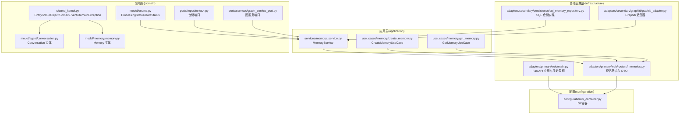
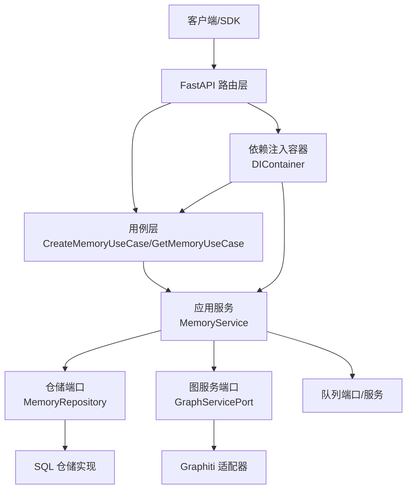
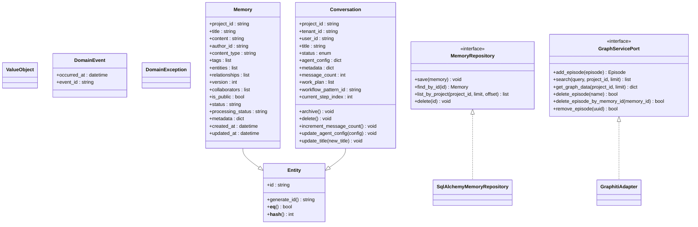
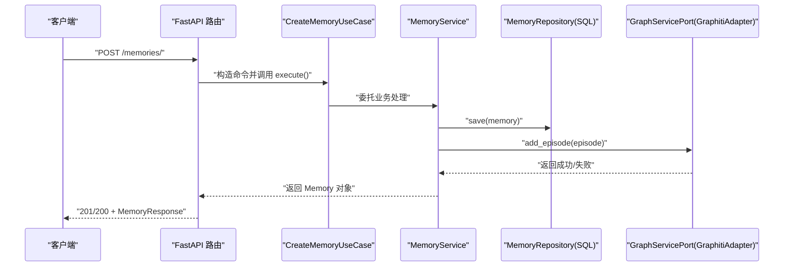
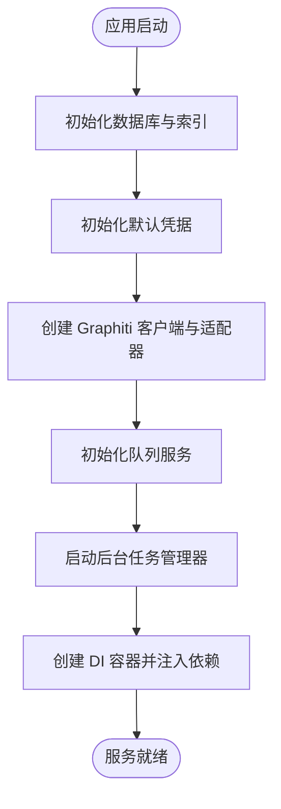
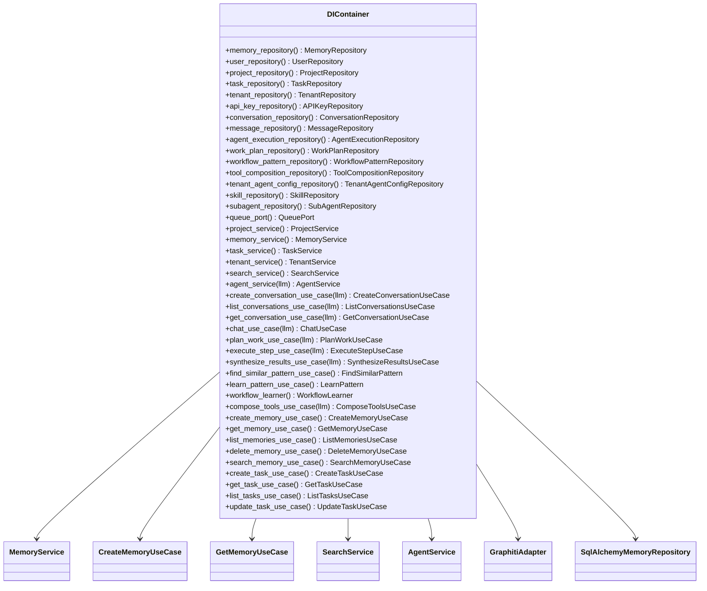
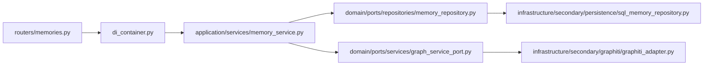

# 后端系统

<cite>
**本文引用的文件**
- [src/domain/shared_kernel.py](file://src/domain/shared_kernel.py)
- [src/domain/model/enums.py](file://src/domain/model/enums.py)
- [src/domain/model/memory/memory.py](file://src/domain/model/memory/memory.py)
- [src/domain/model/agent/conversation.py](file://src/domain/model/agent/conversation.py)
- [src/domain/ports/repositories/memory_repository.py](file://src/domain/ports/repositories/memory_repository.py)
- [src/domain/ports/services/graph_service_port.py](file://src/domain/ports/services/graph_service_port.py)
- [src/application/services/memory_service.py](file://src/application/services/memory_service.py)
- [src/application/use_cases/memory/create_memory.py](file://src/application/use_cases/memory/create_memory.py)
- [src/application/use_cases/memory/get_memory.py](file://src/application/use_cases/memory/get_memory.py)
- [src/configuration/di_container.py](file://src/configuration/di_container.py)
- [src/infrastructure/adapters/primary/web/main.py](file://src/infrastructure/adapters/primary/web/main.py)
- [src/infrastructure/adapters/primary/web/routers/memories.py](file://src/infrastructure/adapters/primary/web/routers/memories.py)
- [src/infrastructure/adapters/secondary/persistence/sql_memory_repository.py](file://src/infrastructure/adapters/secondary/persistence/sql_memory_repository.py)
- [src/infrastructure/adapters/secondary/graphiti/graphiti_adapter.py](file://src/infrastructure/adapters/secondary/graphiti/graphiti_adapter.py)
</cite>

## 目录
1. [简介](#简介)
2. [项目结构](#项目结构)
3. [核心组件](#核心组件)
4. [架构总览](#架构总览)
5. [详细组件分析](#详细组件分析)
6. [依赖关系分析](#依赖关系分析)
7. [性能考量](#性能考量)
8. [故障排查指南](#故障排查指南)
9. [结论](#结论)
10. [附录](#附录)

## 简介
本文件面向 MemStack 后端系统，围绕“六边形架构（Hexagonal Architecture）”进行系统化梳理，重点覆盖以下方面：
- 领域层：代理、记忆、用户、项目、租户等核心实体与业务规则
- 应用层：用例层与数据传输对象（DTO）的使用方式
- 基础设施层：主适配器（Web API）与次适配器（数据库/图数据库/队列）
- 松耦合设计：通过端口接口与依赖注入容器实现依赖倒置
- 最佳实践：错误处理、幂等性、一致性与可扩展性建议

## 项目结构
后端采用按层次与职责划分的目录组织方式：
- domain：领域模型与共享内核（实体、值对象、事件、异常、枚举）
- application：应用服务、用例、任务与模式学习
- infrastructure：主适配器（FastAPI 路由）与次适配器（数据库、图数据库、队列、LLM 适配器等）
- configuration：依赖注入容器与工厂
- tests：单元/集成/性能测试

图表来源
- [src/domain/shared_kernel.py](file://src/domain/shared_kernel.py#L10-L31)
- [src/domain/model/enums.py](file://src/domain/model/enums.py#L6-L20)
- [src/domain/model/memory/memory.py](file://src/domain/model/memory/memory.py#L8-L31)
- [src/domain/model/agent/conversation.py](file://src/domain/model/agent/conversation.py#L19-L79)
- [src/domain/ports/repositories/memory_repository.py](file://src/domain/ports/repositories/memory_repository.py#L7-L25)
- [src/domain/ports/services/graph_service_port.py](file://src/domain/ports/services/graph_service_port.py#L7-L44)
- [src/application/services/memory_service.py](file://src/application/services/memory_service.py#L35-L44)
- [src/application/use_cases/memory/create_memory.py](file://src/application/use_cases/memory/create_memory.py#L26-L31)
- [src/application/use_cases/memory/get_memory.py](file://src/application/use_cases/memory/get_memory.py#L15-L21)
- [src/infrastructure/adapters/primary/web/main.py](file://src/infrastructure/adapters/primary/web/main.py#L53-L133)
- [src/infrastructure/adapters/primary/web/routers/memories.py](file://src/infrastructure/adapters/primary/web/routers/memories.py#L183-L335)
- [src/infrastructure/adapters/secondary/persistence/sql_memory_repository.py](file://src/infrastructure/adapters/secondary/persistence/sql_memory_repository.py#L18-L23)
- [src/infrastructure/adapters/secondary/graphiti/graphiti_adapter.py](file://src/infrastructure/adapters/secondary/graphiti/graphiti_adapter.py#L25-L37)
- [src/configuration/di_container.py](file://src/configuration/di_container.py#L108-L136)

章节来源
- [src/infrastructure/adapters/primary/web/main.py](file://src/infrastructure/adapters/primary/web/main.py#L135-L280)
- [src/configuration/di_container.py](file://src/configuration/di_container.py#L108-L391)

## 核心组件
本节聚焦于六边形架构中各层的关键构件及其职责。

- 领域层
  - 共享内核：统一的实体基类、值对象、领域事件与异常类型，确保跨模块一致的建模风格。
  - 枚举：处理状态与数据状态，用于内存处理流程与数据可用性控制。
  - 实体：记忆（Memory）、会话（Conversation）等，承载业务不变量与行为。
  - 端口：仓储端口（Repository Port）与图服务端口（GraphServicePort），定义对外部依赖的抽象契约。

- 应用层
  - 应用服务：如 MemoryService，封装业务用例所需的核心流程，协调仓储与外部服务，并管理后台任务。
  - 用例：如 CreateMemoryUseCase、GetMemoryUseCase，以命令/查询对象表达业务意图，解耦调用方与实现细节。

- 基础设施层
  - 主适配器：FastAPI 应用与路由，负责请求解析、鉴权、参数校验与响应序列化（含 Pydantic DTO）。
  - 次适配器：SQL 仓储实现、Graphiti 图数据库适配器、队列适配器等，具体对接外部系统。

章节来源
- [src/domain/shared_kernel.py](file://src/domain/shared_kernel.py#L10-L61)
- [src/domain/model/enums.py](file://src/domain/model/enums.py#L6-L20)
- [src/domain/model/memory/memory.py](file://src/domain/model/memory/memory.py#L8-L31)
- [src/domain/model/agent/conversation.py](file://src/domain/model/agent/conversation.py#L19-L79)
- [src/domain/ports/repositories/memory_repository.py](file://src/domain/ports/repositories/memory_repository.py#L7-L25)
- [src/domain/ports/services/graph_service_port.py](file://src/domain/ports/services/graph_service_port.py#L7-L44)
- [src/application/services/memory_service.py](file://src/application/services/memory_service.py#L35-L44)
- [src/application/use_cases/memory/create_memory.py](file://src/application/use_cases/memory/create_memory.py#L26-L31)
- [src/application/use_cases/memory/get_memory.py](file://src/application/use_cases/memory/get_memory.py#L15-L21)
- [src/infrastructure/adapters/primary/web/routers/memories.py](file://src/infrastructure/adapters/primary/web/routers/memories.py#L50-L85)
- [src/infrastructure/adapters/secondary/persistence/sql_memory_repository.py](file://src/infrastructure/adapters/secondary/persistence/sql_memory_repository.py#L18-L23)
- [src/infrastructure/adapters/secondary/graphiti/graphiti_adapter.py](file://src/infrastructure/adapters/secondary/graphiti/graphiti_adapter.py#L25-L37)

## 架构总览
MemStack 的系统边界清晰：应用层位于中心，领域模型定义业务不变量，基础设施层通过端口接口与应用层解耦。主适配器（Web API）与次适配器（数据库/图数据库/队列）分别承担外部交互与持久化/外部服务集成职责。

图表来源
- [src/infrastructure/adapters/primary/web/main.py](file://src/infrastructure/adapters/primary/web/main.py#L116-L126)
- [src/configuration/di_container.py](file://src/configuration/di_container.py#L207-L258)
- [src/application/services/memory_service.py](file://src/application/services/memory_service.py#L35-L44)
- [src/application/use_cases/memory/create_memory.py](file://src/application/use_cases/memory/create_memory.py#L26-L31)
- [src/domain/ports/repositories/memory_repository.py](file://src/domain/ports/repositories/memory_repository.py#L7-L25)
- [src/domain/ports/services/graph_service_port.py](file://src/domain/ports/services/graph_service_port.py#L7-L44)
- [src/infrastructure/adapters/secondary/persistence/sql_memory_repository.py](file://src/infrastructure/adapters/secondary/persistence/sql_memory_repository.py#L18-L23)
- [src/infrastructure/adapters/secondary/graphiti/graphiti_adapter.py](file://src/infrastructure/adapters/secondary/graphiti/graphiti_adapter.py#L25-L37)

## 详细组件分析

### 领域层：实体与业务规则
- 实体与相等性
  - Entity 提供统一的唯一标识与基于标识的相等性判断；ValueObject 为不可变值对象。
  - DomainEvent 与 DomainException 统一事件与异常建模。
- 记忆实体（Memory）
  - 包含标题、内容、标签、实体/关系列表、协作人、公开性、元数据、版本号与处理状态等字段。
  - 处理状态由枚举控制，贯穿创建、更新与删除流程。
- 会话实体（Conversation）
  - 支持多租户隔离、消息计数、工作计划与流程模式引用等多级思维能力相关属性。
  - 提供归档、删除、增量更新等行为方法。
- 端口契约
  - MemoryRepository：保存、查找、分页列出、删除。
  - GraphServicePort：添加剧集（Episode）、语义搜索、获取图数据、删除剧集等。

图表来源
- [src/domain/shared_kernel.py](file://src/domain/shared_kernel.py#L10-L61)
- [src/domain/model/memory/memory.py](file://src/domain/model/memory/memory.py#L8-L31)
- [src/domain/model/agent/conversation.py](file://src/domain/model/agent/conversation.py#L19-L79)
- [src/domain/ports/repositories/memory_repository.py](file://src/domain/ports/repositories/memory_repository.py#L7-L25)
- [src/domain/ports/services/graph_service_port.py](file://src/domain/ports/services/graph_service_port.py#L7-L44)
- [src/infrastructure/adapters/secondary/persistence/sql_memory_repository.py](file://src/infrastructure/adapters/secondary/persistence/sql_memory_repository.py#L18-L23)
- [src/infrastructure/adapters/secondary/graphiti/graphiti_adapter.py](file://src/infrastructure/adapters/secondary/graphiti/graphiti_adapter.py#L25-L37)

章节来源
- [src/domain/shared_kernel.py](file://src/domain/shared_kernel.py#L10-L61)
- [src/domain/model/memory/memory.py](file://src/domain/model/memory/memory.py#L8-L31)
- [src/domain/model/agent/conversation.py](file://src/domain/model/agent/conversation.py#L19-L79)
- [src/domain/ports/repositories/memory_repository.py](file://src/domain/ports/repositories/memory_repository.py#L7-L25)
- [src/domain/ports/services/graph_service_port.py](file://src/domain/ports/services/graph_service_port.py#L7-L44)

### 应用层：用例与服务
- 用例层
  - CreateMemoryUseCase：接收命令对象，创建领域实体并同步到图数据库。
  - GetMemoryUseCase：查询单条记忆。
- 应用服务层
  - MemoryService：封装记忆的完整业务流程，包括与图服务集成、后台任务调度、搜索与处理状态管理。
  - 服务内部协调仓储与图服务，保证一致性与可观测性。

图表来源
- [src/application/use_cases/memory/create_memory.py](file://src/application/use_cases/memory/create_memory.py#L31-L76)
- [src/application/services/memory_service.py](file://src/application/services/memory_service.py#L45-L130)
- [src/infrastructure/adapters/primary/web/routers/memories.py](file://src/infrastructure/adapters/primary/web/routers/memories.py#L183-L335)
- [src/infrastructure/adapters/secondary/graphiti/graphiti_adapter.py](file://src/infrastructure/adapters/secondary/graphiti/graphiti_adapter.py#L120-L188)

章节来源
- [src/application/use_cases/memory/create_memory.py](file://src/application/use_cases/memory/create_memory.py#L26-L76)
- [src/application/use_cases/memory/get_memory.py](file://src/application/use_cases/memory/get_memory.py#L15-L32)
- [src/application/services/memory_service.py](file://src/application/services/memory_service.py#L35-L389)

### 基础设施层：主适配器与次适配器
- 主适配器（Web API）
  - FastAPI 应用在启动阶段初始化数据库、默认凭据、图数据库索引、队列与后台任务管理器，并注入 DI 容器。
  - 路由模块集中注册各类资源端点，使用 Pydantic 数据模型作为请求/响应 DTO。
- 次适配器
  - SQL 仓储：将领域模型映射到数据库表，支持保存、查询、分页与删除。
  - Graphiti 适配器：实现图服务端口，负责嵌入维度检查、剧集写入、异步处理触发、搜索与清理。
  - 队列适配器：与 Redis 队列交互，用于知识图谱构建与实体抽取等后台任务编排。

图表来源
- [src/infrastructure/adapters/primary/web/main.py](file://src/infrastructure/adapters/primary/web/main.py#L53-L133)
- [src/configuration/di_container.py](file://src/configuration/di_container.py#L116-L126)

章节来源
- [src/infrastructure/adapters/primary/web/main.py](file://src/infrastructure/adapters/primary/web/main.py#L135-L280)
- [src/infrastructure/adapters/primary/web/routers/memories.py](file://src/infrastructure/adapters/primary/web/routers/memories.py#L50-L85)
- [src/infrastructure/adapters/secondary/persistence/sql_memory_repository.py](file://src/infrastructure/adapters/secondary/persistence/sql_memory_repository.py#L18-L114)
- [src/infrastructure/adapters/secondary/graphiti/graphiti_adapter.py](file://src/infrastructure/adapters/secondary/graphiti/graphiti_adapter.py#L120-L489)

### 依赖注入容器与端口接口
- DIContainer
  - 将应用服务、用例与仓储实现解耦，通过构造函数注入依赖，避免路由直接依赖具体实现。
  - 提供统一工厂方法，按需创建服务与用例实例，确保依赖复用与生命周期管理。
- 端口接口
  - 仓储端口与图服务端口作为抽象契约，允许替换不同实现（如不同的数据库或图数据库供应商）而不影响上层业务逻辑。

图表来源
- [src/configuration/di_container.py](file://src/configuration/di_container.py#L108-L391)

章节来源
- [src/configuration/di_container.py](file://src/configuration/di_container.py#L108-L391)

## 依赖关系分析
- 耦合与内聚
  - 应用层通过端口接口与基础设施解耦，内聚于业务用例与服务。
  - 路由层仅负责输入输出与依赖注入，不包含业务逻辑，内聚高且低耦合。
- 外部依赖
  - 数据库：SQLAlchemy 异步会话与模型映射。
  - 图数据库：Graphiti 客户端与自定义适配器，提供嵌入维度检查与清理能力。
  - 队列：Redis 队列用于异步处理（实体抽取、知识图谱构建）。
- 循环依赖
  - 通过端口接口与 DI 容器避免循环导入；仓储与服务之间通过抽象契约连接。

图表来源
- [src/infrastructure/adapters/primary/web/routers/memories.py](file://src/infrastructure/adapters/primary/web/routers/memories.py#L183-L335)
- [src/configuration/di_container.py](file://src/configuration/di_container.py#L207-L258)
- [src/application/services/memory_service.py](file://src/application/services/memory_service.py#L35-L44)
- [src/domain/ports/repositories/memory_repository.py](file://src/domain/ports/repositories/memory_repository.py#L7-L25)
- [src/infrastructure/adapters/secondary/persistence/sql_memory_repository.py](file://src/infrastructure/adapters/secondary/persistence/sql_memory_repository.py#L18-L23)
- [src/domain/ports/services/graph_service_port.py](file://src/domain/ports/services/graph_service_port.py#L7-L44)
- [src/infrastructure/adapters/secondary/graphiti/graphiti_adapter.py](file://src/infrastructure/adapters/secondary/graphiti/graphiti_adapter.py#L25-L37)

章节来源
- [src/infrastructure/adapters/primary/web/routers/memories.py](file://src/infrastructure/adapters/primary/web/routers/memories.py#L183-L335)
- [src/configuration/di_container.py](file://src/configuration/di_container.py#L207-L258)

## 性能考量
- 嵌入维度检查缓存
  - Graphiti 适配器对嵌入维度检查结果进行短期缓存，减少对图数据库的查询压力。
- 批量与分页
  - 列表查询支持分页参数，避免一次性加载过多数据。
- 异步处理
  - 创建/更新记忆时，先入库再异步触发图谱构建与实体抽取，提升响应速度。
- 连接与超时
  - 图数据库索引构建设置超时保护，确保系统在外部依赖不可用时快速失败并记录日志。

章节来源
- [src/infrastructure/adapters/secondary/graphiti/graphiti_adapter.py](file://src/infrastructure/adapters/secondary/graphiti/graphiti_adapter.py#L38-L119)
- [src/infrastructure/adapters/primary/web/main.py](file://src/infrastructure/adapters/primary/web/main.py#L82-L97)
- [src/infrastructure/adapters/primary/web/routers/memories.py](file://src/infrastructure/adapters/primary/web/routers/memories.py#L337-L395)

## 故障排查指南
- 图数据库连接失败
  - 启动阶段若无法建立图数据库索引或连接，系统会记录错误并终止启动，提示检查图数据库运行状态。
- 嵌入维度不匹配
  - 当嵌入维度与现有数据不一致时，适配器可选择自动清理旧嵌入或发出警告，避免后续检索异常。
- 删除清理不彻底
  - 删除记忆时优先使用图数据库提供的清理方法，若失败则回退到 Cypher 清理策略，但可能遗留孤儿节点/边，需人工干预或重试。
- 队列入队失败
  - 写入数据库成功但入队失败时，记忆状态标记为失败，前端可通过处理状态查询定位问题。

章节来源
- [src/infrastructure/adapters/primary/web/main.py](file://src/infrastructure/adapters/primary/web/main.py#L82-L97)
- [src/infrastructure/adapters/secondary/graphiti/graphiti_adapter.py](file://src/infrastructure/adapters/secondary/graphiti/graphiti_adapter.py#L340-L413)
- [src/infrastructure/adapters/primary/web/routers/memories.py](file://src/infrastructure/adapters/primary/web/routers/memories.py#L305-L322)

## 结论
MemStack 后端以六边形架构为核心，通过端口接口与依赖注入容器实现了清晰的分层与松耦合设计。领域模型强调不变量与行为，应用层聚焦业务流程编排，基础设施层通过适配器屏蔽外部差异。该设计既便于扩展新功能（如新增用例、更换图数据库供应商），也利于维护与测试。

## 附录
- 最佳实践建议
  - 使用命令/查询对象表达业务意图，保持用例职责单一。
  - 在应用服务中统一处理幂等性与一致性，必要时引入补偿事务或事件总线。
  - 对外部依赖（图数据库、队列）增加健康检查与降级策略。
  - 为关键路径增加可观测性（指标、追踪、日志），便于问题定位与性能优化。