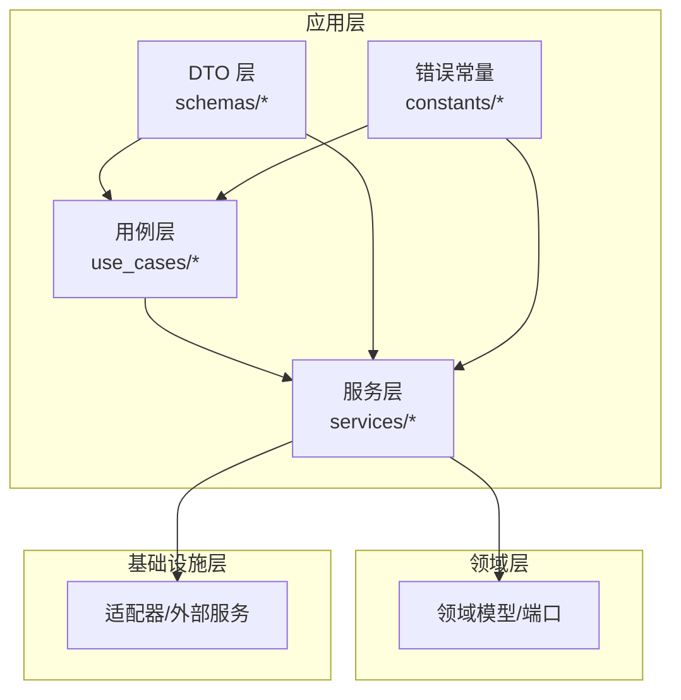
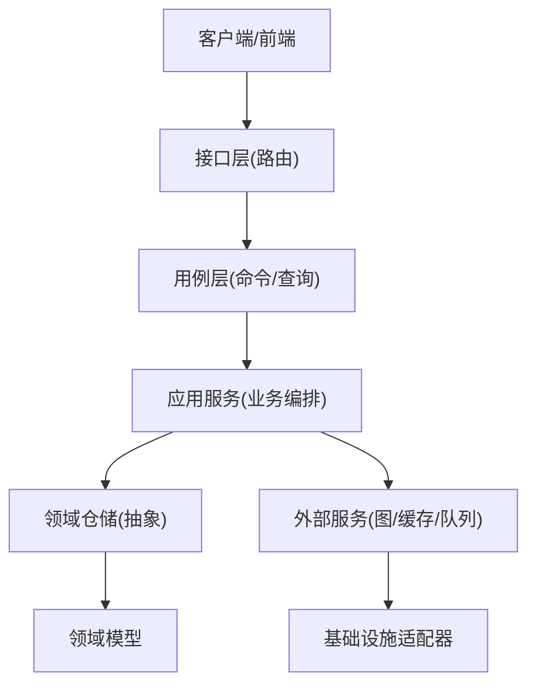
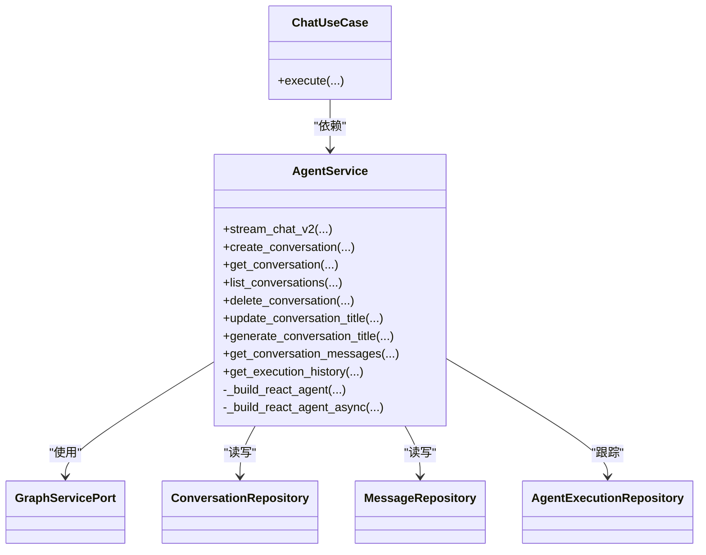
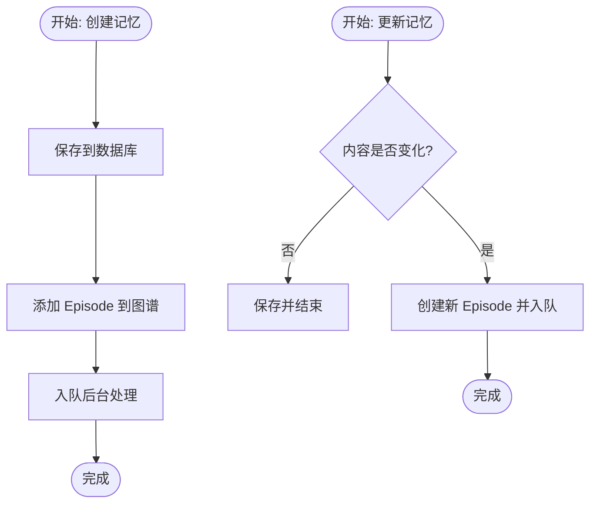
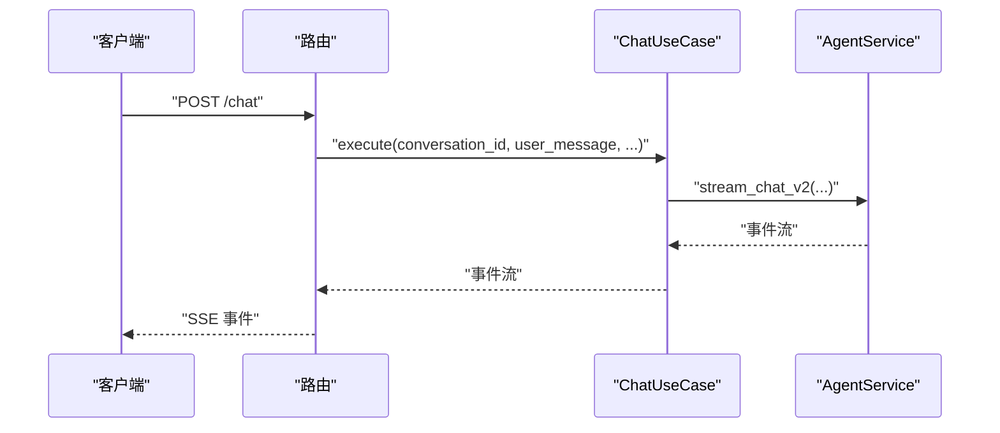
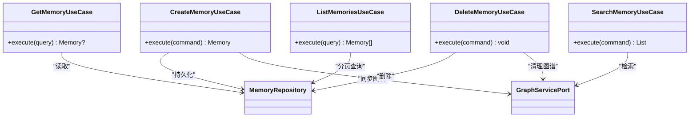
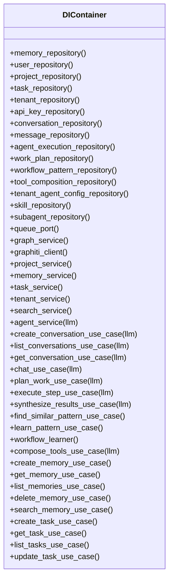
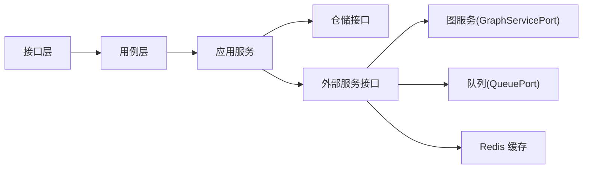

# 应用层设计

<cite>
**本文引用的文件**
- [src/application/services/agent_service.py](file://src/application/services/agent_service.py)
- [src/application/services/memory_service.py](file://src/application/services/memory_service.py)
- [src/application/services/project_service.py](file://src/application/services/project_service.py)
- [src/application/use_cases/agent/chat.py](file://src/application/use_cases/agent/chat.py)
- [src/application/use_cases/memory/create_memory.py](file://src/application/use_cases/memory/create_memory.py)
- [src/application/use_cases/memory/search_memory.py](file://src/application/use_cases/memory/search_memory.py)
- [src/application/use_cases/memory/get_memory.py](file://src/application/use_cases/memory/get_memory.py)
- [src/application/use_cases/memory/list_memories.py](file://src/application/use_cases/memory/list_memories.py)
- [src/application/use_cases/memory/delete_memory.py](file://src/application/use_cases/memory/delete_memory.py)
- [src/application/use_cases/task/create_task.py](file://src/application/use_cases/task/create_task.py)
- [src/application/use_cases/task/get_task.py](file://src/application/use_cases/task/get_task.py)
- [src/application/use_cases/task/list_tasks.py](file://src/application/use_cases/task/list_tasks.py)
- [src/application/schemas/auth.py](file://src/application/schemas/auth.py)
- [src/application/schemas/project.py](file://src/application/schemas/project.py)
- [src/application/schemas/schema.py](file://src/application/schemas/schema.py)
- [src/configuration/di_container.py](file://src/configuration/di_container.py)
- [src/application/constants/error_ids.py](file://src/application/constants/error_ids.py)
</cite>

## 目录
1. [引言](#引言)
2. [项目结构](#项目结构)
3. [核心组件](#核心组件)
4. [架构总览](#架构总览)
5. [详细组件分析](#详细组件分析)
6. [依赖关系分析](#依赖关系分析)
7. [性能考量](#性能考量)
8. [故障排查指南](#故障排查指南)
9. [结论](#结论)
10. [附录](#附录)

## 引言
本文件系统性梳理 MemStack 的应用层设计，聚焦其在六边形架构中的角色：作为协调器，连接领域层与基础设施层，封装业务用例，并通过依赖注入实现松耦合。应用层包含三类关键构件：
- 服务层：面向业务能力的服务（如 AgentService、MemoryService、ProjectService），负责跨仓库与外部服务的编排。
- 用例层：以命令/查询对象表达业务场景，封装流程与边界校验，解耦接口层与领域模型。
- DTO 层：基于 Pydantic 的输入输出模型，统一数据契约、参数校验与序列化。

## 项目结构
应用层位于 src/application 下，按关注点分层组织：
- services：应用服务，承载业务编排与跨域交互。
- use_cases：用例实现，以命令/查询对象表达业务流程。
- schemas：输入输出 DTO，定义请求/响应结构与校验规则。
- constants：错误码常量，统一错误标识以便监控与追踪。

## 核心组件
- 应用服务（AgentService、MemoryService、ProjectService）
  - 职责：封装业务流程，协调仓储与外部服务；提供幂等与可观测的业务操作。
  - 特点：构造函数注入仓储与外部服务；方法内完成授权、校验、事件流与状态更新。
- 用例（Agent/Task/Memory 等）
  - 职责：以命令/查询对象表达业务场景，集中校验与流程编排。
  - 特点：轻量、可组合；通过 DI 容器按需装配。
- DTO（Pydantic 模型）
  - 职责：统一输入输出契约，自动校验与序列化；为路由层提供强类型接口。
  - 特点：覆盖认证、项目、模式等多模块；支持示例与别名映射。

章节来源
- file://src/application/services/agent_service.py#L58-L121
- file://src/application/services/memory_service.py#L35-L44
- file://src/application/services/project_service.py#L19-L25
- file://src/application/use_cases/agent/chat.py#L15-L26
- file://src/application/use_cases/memory/create_memory.py#L26-L30
- file://src/application/schemas/auth.py#L12-L121
- file://src/application/schemas/project.py#L36-L203
- file://src/application/schemas/schema.py#L9-L84

## 架构总览
应用层在六边形架构中承担“协调者”角色：
- 外部接口（路由器/前端）仅依赖抽象（用例接口、服务接口）。
- 用例通过应用服务调用领域模型与仓储。
- 应用服务再与图数据库、缓存、队列等基础设施交互。

图表来源
- [src/configuration/di_container.py](file://src/configuration/di_container.py#L108-L391)
- [src/application/use_cases/agent/chat.py](file://src/application/use_cases/agent/chat.py#L15-L26)
- [src/application/services/agent_service.py](file://src/application/services/agent_service.py#L58-L121)

## 详细组件分析

### 服务层：AgentService（对话与推理编排）
- 职责
  - 对话生命周期管理：创建/读取/列出/删除会话，消息读写。
  - 推理执行：构建自研 ReAct Agent，驱动工具链（检索、实体查询、网页搜索等），流式返回事件。
  - 多级思维：工作计划、任务步骤、结果合成的跨层协作。
- 关键实现要点
  - 工具装配：根据配置选择不同 LLM 提供商，动态加载技能与子代理。
  - 流式事件：统一事件类型（message/thought/act/observe/complete/error），便于前端实时渲染。
  - 授权与安全：对会话访问进行项目/用户双因子校验，拒绝越权访问。
  - 执行跟踪：记录 AgentExecution 状态、思考内容与工具调用元数据。
- 依赖注入
  - 通过 DIContainer 统一装配仓储、图服务、LLM、Redis、技能/子代理仓库等。

图表来源
- [src/application/services/agent_service.py](file://src/application/services/agent_service.py#L58-L121)
- [src/application/use_cases/agent/chat.py](file://src/application/use_cases/agent/chat.py#L15-L26)

章节来源
- file://src/application/services/agent_service.py#L122-L305
- file://src/application/services/agent_service.py#L307-L455
- file://src/application/services/agent_service.py#L456-L627
- file://src/application/services/agent_service.py#L628-L678
- file://src/application/services/agent_service.py#L679-L717
- file://src/application/services/agent_service.py#L718-L800

### 服务层：MemoryService（知识记忆编排）
- 职责
  - 记忆 CRUD：创建/读取/更新/删除；更新时触发重处理。
  - 图集成：新增/删除/重处理均同步至图数据库，保证一致性。
  - 搜索：语义检索返回记忆与实体两类结果。
  - 共享：支持协作者列表维护。
- 关键实现要点
  - 创建流程：持久化 → 图谱新增 Episode → 队列异步处理。
  - 删除流程：优先图谱清理（移除节点/边），再删除数据库记录。
  - 更新策略：内容变更触发重新处理，保留租户/项目/用户上下文。
- 依赖注入
  - 通过 DIContainer 注入内存仓储、图服务与队列端口。

图表来源
- [src/application/services/memory_service.py](file://src/application/services/memory_service.py#L45-L130)
- [src/application/services/memory_service.py](file://src/application/services/memory_service.py#L214-L302)

章节来源
- file://src/application/services/memory_service.py#L35-L44
- file://src/application/services/memory_service.py#L45-L130
- file://src/application/services/memory_service.py#L131-L158
- file://src/application/services/memory_service.py#L159-L213
- file://src/application/services/memory_service.py#L214-L302
- file://src/application/services/memory_service.py#L303-L341
- file://src/application/services/memory_service.py#L342-L369
- file://src/application/services/memory_service.py#L371-L389

### 服务层：ProjectService（项目与成员管理）
- 职责
  - 项目 CRUD：创建/读取/更新/删除。
  - 成员管理：添加/移除成员，禁止移除所有者。
- 关键实现要点
  - 创建前校验所有者存在；所有者自动加入成员列表。
  - 列表支持按租户与所有者过滤。
  - 移除成员时保护所有权。

章节来源
- file://src/application/services/project_service.py#L19-L25
- file://src/application/services/project_service.py#L26-L69
- file://src/application/services/project_service.py#L71-L81
- file://src/application/services/project_service.py#L83-L107
- file://src/application/services/project_service.py#L108-L154
- file://src/application/services/project_service.py#L156-L172
- file://src/application/services/project_service.py#L173-L201
- file://src/application/services/project_service.py#L202-L229
- file://src/application/services/project_service.py#L231-L249

### 用例层：Agent 用例（对话编排）
- ChatUseCase
  - 输入：会话ID、用户消息、项目ID、用户ID、租户ID。
  - 行为：参数校验后委托 AgentService.stream_chat_v2，逐事件转发。
  - 输出：事件流（message/thought/act/observe/complete/error）。

图表来源
- [src/application/use_cases/agent/chat.py](file://src/application/use_cases/agent/chat.py#L27-L85)
- [src/application/services/agent_service.py](file://src/application/services/agent_service.py#L307-L455)

章节来源
- file://src/application/use_cases/agent/chat.py#L15-L26
- file://src/application/use_cases/agent/chat.py#L27-L85

### 用例层：Memory 用例（知识记忆编排）
- CreateMemoryUseCase
  - 命令：CreateMemoryCommand（标题、内容、作者、租户、标签、公开性、元数据等）。
  - 行为：创建 Memory 实体 → 写入数据库 → 同步到图谱（文本类型）。
- SearchMemoryUseCase
  - 命令：SearchMemoryCommand（查询、项目ID、限制、租户ID、用户ID）。
  - 行为：委托图服务执行语义搜索。
- GetMemoryUseCase/ListMemoriesUseCase/DeleteMemoryUseCase
  - 分别对应读取单条、分页列表、删除（含图谱清理）。

图表来源
- [src/application/use_cases/memory/create_memory.py](file://src/application/use_cases/memory/create_memory.py#L26-L76)
- [src/application/use_cases/memory/search_memory.py](file://src/application/use_cases/memory/search_memory.py#L16-L24)
- [src/application/use_cases/memory/get_memory.py](file://src/application/use_cases/memory/get_memory.py#L15-L32)
- [src/application/use_cases/memory/list_memories.py](file://src/application/use_cases/memory/list_memories.py#L18-L39)
- [src/application/use_cases/memory/delete_memory.py](file://src/application/use_cases/memory/delete_memory.py#L14-L35)

章节来源
- file://src/application/use_cases/memory/create_memory.py#L10-L24
- file://src/application/use_cases/memory/create_memory.py#L26-L76
- file://src/application/use_cases/memory/search_memory.py#L7-L14
- file://src/application/use_cases/memory/search_memory.py#L16-L24
- file://src/application/use_cases/memory/get_memory.py#L8-L16
- file://src/application/use_cases/memory/get_memory.py#L21-L32
- file://src/application/use_cases/memory/list_memories.py#L8-L17
- file://src/application/use_cases/memory/list_memories.py#L24-L39
- file://src/application/use_cases/memory/delete_memory.py#L8-L12
- file://src/application/use_cases/memory/delete_memory.py#L19-L35

### 用例层：Task 用例（任务日志编排）
- CreateTaskUseCase
  - 命令：CreateTaskCommand（分组ID、任务类型、载荷、实体ID/类型、父任务ID）。
  - 行为：创建 TaskLog 实体并持久化。
- GetTaskUseCase/ListTasksUseCase
  - 查询：GetTaskQuery（任务ID）、ListTasksQuery（分组/状态/分页）。
  - 行为：按条件检索任务日志。

章节来源
- file://src/application/use_cases/task/create_task.py#L12-L26
- file://src/application/use_cases/task/create_task.py#L28-L56
- file://src/application/use_cases/task/get_task.py#L12-L18
- file://src/application/use_cases/task/get_task.py#L25-L36
- file://src/application/use_cases/task/list_tasks.py#L12-L21
- file://src/application/use_cases/task/list_tasks.py#L28-L48

### DTO 层：认证、项目与模式
- 认证 DTO（APIKey、User、Token 等）
  - 覆盖 API Key 创建/响应、用户创建/更新/响应、个人资料等。
  - 支持示例配置与字段别名映射。
- 项目 DTO（ProjectCreate/Update/Response、统计与配置）
  - 包含内存规则、图谱配置、成员管理、系统状态与统计数据。
- 模式 DTO（实体/边类型与映射）
  - 定义实体/边类型的基础、创建、更新与响应模型。

章节来源
- file://src/application/schemas/auth.py#L12-L121
- file://src/application/schemas/project.py#L9-L18
- file://src/application/schemas/project.py#L20-L34
- file://src/application/schemas/project.py#L36-L73
- file://src/application/schemas/project.py#L76-L109
- file://src/application/schemas/project.py#L112-L123
- file://src/application/schemas/project.py#L125-L154
- file://src/application/schemas/project.py#L156-L203
- file://src/application/schemas/project.py#L206-L236
- file://src/application/schemas/schema.py#L9-L35
- file://src/application/schemas/schema.py#L37-L63
- file://src/application/schemas/schema.py#L65-L84

### 依赖注入与装配
- DIContainer
  - 统一创建与装配：仓储、图服务、队列、应用服务、用例。
  - 通过属性方法延迟初始化，避免循环导入与重复检查。
  - 为 AgentService 注入对话/消息/执行仓储、图服务、LLM、技能/子代理仓库、Redis 等。

图表来源
- [src/configuration/di_container.py](file://src/configuration/di_container.py#L108-L391)

章节来源
- file://src/configuration/di_container.py#L116-L136
- file://src/configuration/di_container.py#L153-L201
- file://src/configuration/di_container.py#L204-L206
- file://src/configuration/di_container.py#L209-L221
- file://src/configuration/di_container.py#L223-L228
- file://src/configuration/di_container.py#L229-L231
- file://src/configuration/di_container.py#L232-L238
- file://src/configuration/di_container.py#L239-L258
- file://src/configuration/di_container.py#L262-L277
- file://src/configuration/di_container.py#L280-L320
- file://src/configuration/di_container.py#L329-L345
- file://src/configuration/di_container.py#L348-L373
- file://src/configuration/di_container.py#L376-L391

## 依赖关系分析
- 松耦合设计
  - 接口层仅依赖抽象（用例接口、服务接口、仓储接口）。
  - 通过 DIContainer 统一装配，避免硬编码依赖。
- 循环依赖规避
  - 使用 TYPE_CHECKING 导入避免运行时循环。
  - 将工具装配延迟到用例内部，减少全局耦合。
- 外部依赖
  - 图服务（GraphServicePort）：统一图谱操作入口。
  - 队列端口（QueuePort）：后台任务编排。
  - Redis：缓存与工具加速。

图表来源
- [src/configuration/di_container.py](file://src/configuration/di_container.py#L108-L391)
- [src/application/services/agent_service.py](file://src/application/services/agent_service.py#L58-L121)
- [src/application/services/memory_service.py](file://src/application/services/memory_service.py#L35-L44)

章节来源
- file://src/configuration/di_container.py#L108-L136
- file://src/application/services/agent_service.py#L122-L140
- file://src/application/services/memory_service.py#L35-L44

## 性能考量
- 流式事件与 SSE
  - AgentService 使用异步生成器逐事件推送，前端可即时渲染，降低等待时间。
- 工具链优化
  - Redis 缓存用于网络搜索等工具，减少重复请求。
- 异步与并发
  - 仓储与外部服务广泛采用异步接口，提升吞吐。
- 后台处理
  - 记忆更新与创建通过队列异步处理，避免阻塞主流程。

## 故障排查指南
- 错误码体系
  - 统一错误 ID，便于日志聚合与问题定位。
  - 覆盖代理会话、LLM 执行、工具调用、仓储与 API 等场景。
- 常见问题
  - 会话未找到或越权：检查项目ID/用户ID与会话归属。
  - 图谱清理失败：删除数据库记录但图谱残留，需手动巡检或重试。
  - LLM 调用异常：检查提供商配置、速率限制与超时设置。
- 建议
  - 在用例与服务中捕获并映射到稳定错误 ID。
  - 对关键路径增加重试与降级策略。

章节来源
- file://src/application/constants/error_ids.py#L12-L68
- file://src/application/services/agent_service.py#L330-L353
- file://src/application/services/memory_service.py#L323-L341

## 结论
MemStack 的应用层以“用例+服务+DTO”的清晰分层实现了六边形架构的核心目标：隔离业务逻辑、解耦接口与实现、并通过依赖注入实现松耦合与高可测试性。AgentService、MemoryService、ProjectService 三大服务分别覆盖对话推理、知识记忆与项目管理的关键业务，配合标准化的命令/查询对象与 Pydantic DTO，形成一致、可演进的业务编排框架。

## 附录
- 最佳实践
  - 用例只做参数校验与流程编排，不直接操作仓储。
  - 服务层负责跨域协调与可观测性，保持幂等与可恢复。
  - DTO 严格约束输入输出，结合 Pydantic 的别名与示例提升兼容性。
  - 通过 DIContainer 集中式装配，避免分散依赖与循环导入。
- 常见使用模式
  - 路由层接收请求 → 构造命令/查询对象 → 用例执行 → 返回事件/结果。
  - 服务层在用例驱动下完成仓储与外部服务交互，确保状态一致。