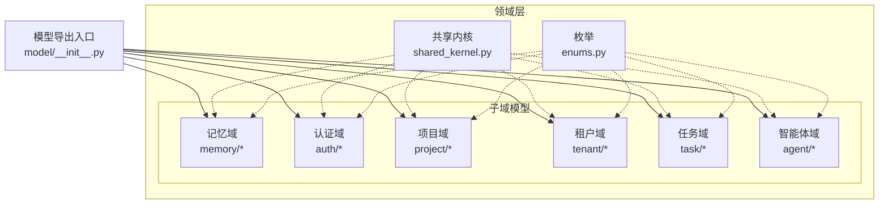
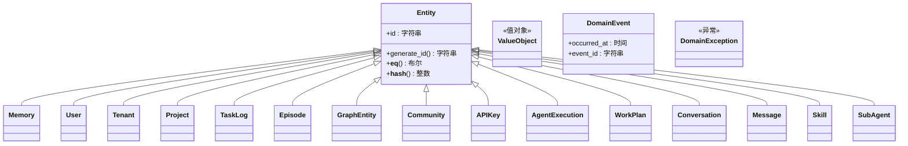
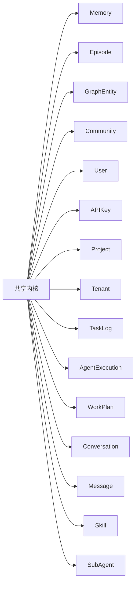
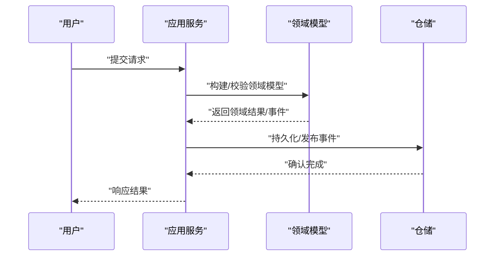
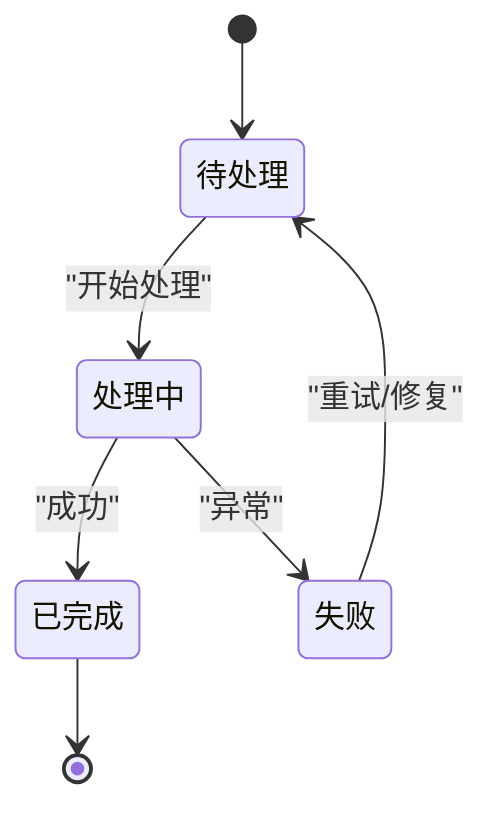

# 领域层设计

<cite>
**本文引用的文件**
- [src/domain/shared_kernel.py](file://src/domain/shared_kernel.py)
- [src/domain/model/__init__.py](file://src/domain/model/__init__.py)
- [src/domain/model/enums.py](file://src/domain/model/enums.py)
- [src/domain/model/memory/memory.py](file://src/domain/model/memory/memory.py)
- [src/domain/model/memory/entity.py](file://src/domain/model/memory/entity.py)
- [src/domain/model/memory/episode.py](file://src/domain/model/memory/episode.py)
- [src/domain/model/memory/community.py](file://src/domain/model/memory/community.py)
- [src/domain/model/auth/user.py](file://src/domain/model/auth/user.py)
- [src/domain/model/auth/api_key.py](file://src/domain/model/auth/api_key.py)
- [src/domain/model/project/project.py](file://src/domain/model/project/project.py)
- [src/domain/model/tenant/tenant.py](file://src/domain/model/tenant/tenant.py)
- [src/domain/model/task/task_log.py](file://src/domain/model/task/task_log.py)
- [src/domain/model/agent/agent_execution.py](file://src/domain/model/agent/agent_execution.py)
- [src/domain/model/agent/work_plan.py](file://src/domain/model/agent/work_plan.py)
- [src/domain/model/agent/conversation.py](file://src/domain/model/agent/conversation.py)
- [src/domain/model/agent/message.py](file://src/domain/model/agent/message.py)
- [src/domain/model/agent/skill.py](file://src/domain/model/agent/skill.py)
- [src/domain/model/agent/subagent.py](file://src/domain/model/agent/subagent.py)
</cite>

## 目录
1. [引言](#引言)
2. [项目结构](#项目结构)
3. [核心组件](#核心组件)
4. [架构总览](#架构总览)
5. [详细组件分析](#详细组件分析)
6. [依赖分析](#依赖分析)
7. [性能考虑](#性能考虑)
8. [故障排查指南](#故障排查指南)
9. [结论](#结论)
10. [附录](#附录)

## 引言
本文件系统化梳理 MemStack 的领域层设计，围绕领域驱动设计（DDD）的核心概念展开，重点阐释实体（Entity）、值对象（Value Object）、领域事件（Domain Event）与异常（Domain Exception）在共享内核中的抽象与实现；并结合各核心领域模型（代理执行、记忆、用户、租户、项目、任务、对话、消息、工作计划、技能、子代理等），说明其数据结构、业务语义、状态变迁与约束关系。同时给出共享内核的设计理念与落地方式，并提供可操作的使用指引与最佳实践，帮助开发者正确封装与复用业务逻辑。

## 项目结构
领域层位于 src/domain 下，采用按“子域+模型”组织的方式：
- 共享内核：统一的实体基类、值对象、领域事件与异常定义
- 子域模型：memory、auth、project、tenant、task、agent 等
- 枚举：统一的状态枚举（如处理状态、数据状态）

图表来源
- [src/domain/model/__init__.py](file://src/domain/model/__init__.py#L1-L38)
- [src/domain/shared_kernel.py](file://src/domain/shared_kernel.py#L1-L61)
- [src/domain/model/enums.py](file://src/domain/model/enums.py#L1-L20)

章节来源
- [src/domain/model/__init__.py](file://src/domain/model/__init__.py#L1-L38)
- [src/domain/shared_kernel.py](file://src/domain/shared_kernel.py#L1-L61)
- [src/domain/model/enums.py](file://src/domain/model/enums.py#L1-L20)

## 核心组件
- 实体基类（Entity）：统一标识、相等性与哈希策略，支持唯一 ID 生成
- 值对象（ValueObject）：不可变、以属性集合定义相等性
- 领域事件（DomainEvent）：不可变事件载体，包含发生时间与事件 ID
- 领域异常（DomainException）：统一的领域错误基类
- 枚举：ProcessingStatus、DataStatus 等跨子域通用状态

这些抽象为所有领域模型提供一致的建模语言与契约，确保业务规则在模型层面得到表达与约束。

章节来源
- [src/domain/shared_kernel.py](file://src/domain/shared_kernel.py#L10-L61)

## 架构总览
领域层通过共享内核统一实体与值对象的建模范式，子域模型在各自命名空间下定义实体与值对象，形成清晰的边界与职责划分。各子域之间通过实体 ID 与外键字段建立关联，遵循 DDD 的聚合与限界上下文思想。

图表来源
- [src/domain/shared_kernel.py](file://src/domain/shared_kernel.py#L10-L61)
- [src/domain/model/memory/memory.py](file://src/domain/model/memory/memory.py#L8-L31)
- [src/domain/model/auth/user.py](file://src/domain/model/auth/user.py#L8-L18)
- [src/domain/model/tenant/tenant.py](file://src/domain/model/tenant/tenant.py#L8-L21)
- [src/domain/model/project/project.py](file://src/domain/model/project/project.py#L8-L22)
- [src/domain/model/task/task_log.py](file://src/domain/model/task/task_log.py#L8-L26)
- [src/domain/model/memory/episode.py](file://src/domain/model/memory/episode.py#L17-L29)
- [src/domain/model/memory/entity.py](file://src/domain/model/memory/entity.py#L8-L20)
- [src/domain/model/memory/community.py](file://src/domain/model/memory/community.py#L8-L17)
- [src/domain/model/auth/api_key.py](file://src/domain/model/auth/api_key.py#L8-L20)
- [src/domain/model/agent/agent_execution.py](file://src/domain/model/agent/agent_execution.py#L26-L128)
- [src/domain/model/agent/work_plan.py](file://src/domain/model/agent/work_plan.py#L12-L88)
- [src/domain/model/agent/conversation.py](file://src/domain/model/agent/conversation.py#L19-L79)
- [src/domain/model/agent/message.py](file://src/domain/model/agent/message.py#L36-L112)
- [src/domain/model/agent/skill.py](file://src/domain/model/agent/skill.py#L83-L336)
- [src/domain/model/agent/subagent.py](file://src/domain/model/agent/subagent.py#L83-L468)

## 详细组件分析

### 共享内核（Shared Kernel）
- 设计理念
  - 统一实体标识与相等性：基于 ID 的身份标识，保证实体生命周期内的唯一性与一致性
  - 值对象不可变性：通过 frozen 数据类确保值对象的不可变性与可缓存性
  - 领域事件不可变：事件作为历史事实记录，携带发生时间与事件 ID
  - 领域异常：集中化的异常类型，便于上层捕获与处理
- 实现要点
  - Entity：默认构造时生成唯一 ID；相等比较基于 ID；哈希基于 ID
  - ValueObject：冻结实例，相等比较基于全部属性
  - DomainEvent：默认构造时生成事件 ID 与发生时间
  - DomainException：作为领域错误的统一基类

章节来源
- [src/domain/shared_kernel.py](file://src/domain/shared_kernel.py#L10-L61)

### 认证域（Auth）
- 用户（User）
  - 职责：代表系统用户，包含邮箱、姓名、密码哈希、激活状态与个人资料
  - 关键点：继承自 Entity，具备唯一 ID；提供创建时间字段
- API 密钥（APIKey）
  - 职责：用于 API 调用的身份凭证，包含用户 ID、密钥哈希、名称、权限列表、有效期与最后使用时间
  - 关键点：继承自 Entity；可启用/禁用；支持过期时间

章节来源
- [src/domain/model/auth/user.py](file://src/domain/model/auth/user.py#L8-L18)
- [src/domain/model/auth/api_key.py](file://src/domain/model/auth/api_key.py#L8-L20)

### 租户域（Tenant）
- 租户（Tenant）
  - 职责：多租户支持的基础实体，包含名称、所有者 ID、描述、套餐与配额（最大项目数、最大用户数、最大存储）
  - 关键点：继承自 Entity；提供创建与更新时间；默认套餐与配额

章节来源
- [src/domain/model/tenant/tenant.py](file://src/domain/model/tenant/tenant.py#L8-L21)

### 项目域（Project）
- 项目（Project）
  - 职责：组织记忆的容器，关联租户与成员，包含项目配置、图谱配置与公开性
  - 关键点：继承自 Entity；成员 ID 列表用于访问控制；提供创建与更新时间

章节来源
- [src/domain/model/project/project.py](file://src/domain/model/project/project.py#L8-L22)

### 记忆域（Memory）
- 记忆（Memory）
  - 职责：承载内容、标题、作者、标签、实体与关系、版本、协作人、可见性、状态与处理状态、元数据等
  - 关键点：继承自 Entity；内容类型默认文本；处理状态与数据状态由枚举统一管理
- 实体（GraphEntity）
  - 职责：知识图谱中的实体，包含名称、类型、摘要、所属租户与项目、属性等
  - 关键点：继承自 Entity；提供摘要更新方法
- 剧集（Episode）
  - 职责：来源类型（文本、JSON、文档、API、会话）的记忆片段，包含有效时间与状态
  - 关键点：继承自 Entity；Source 类型枚举
- 社区（Community）
  - 职责：实体社区，包含名称、摘要、成员数量、形成时间与归属
  - 关键点：继承自 Entity；提供形成时间与创建时间

章节来源
- [src/domain/model/memory/memory.py](file://src/domain/model/memory/memory.py#L8-L31)
- [src/domain/model/memory/entity.py](file://src/domain/model/memory/entity.py#L8-L20)
- [src/domain/model/memory/episode.py](file://src/domain/model/memory/episode.py#L17-L29)
- [src/domain/model/memory/community.py](file://src/domain/model/memory/community.py#L8-L17)

### 智能体域（Agent）
- 代理执行（AgentExecution）
  - 职责：跟踪一次 ReAct 循环（思考-行动-观察）的完整过程，包含阶段状态、工具调用与输出、元数据与时间戳
  - 关键点：继承自 Entity；提供完成/失败标记、阶段设置与持续时间计算
- 工作计划（WorkPlan）
  - 职责：高层工作计划，包含步骤序列、当前步骤索引、工作流模式引用与进度统计
  - 关键点：继承自 Entity；提供推进步骤、状态变更与进度百分比计算
- 对话（Conversation）
  - 职责：多轮对话，包含项目/租户作用域、用户 ID、标题、状态、消息计数与代理配置
  - 关键点：继承自 Entity；提供归档、删除、消息计数递增与配置更新
- 消息（Message）
  - 职责：对话中的单条消息，支持角色（用户/助手/系统）与多种消息类型（文本、思考、工具调用、工具结果、错误、工作计划、步骤开始/结束、模式匹配）
  - 关键点：继承自 Entity；提供工具调用/结果的添加与查询
- 技能（Skill）
  - 职责：声明式能力单元，包含触发类型（关键词/语义/混合）、触发模式、可用工具、提示模板、成功率统计与状态
  - 关键点：继承自 Entity；提供匹配查询、使用记录与序列化
- 子代理（SubAgent）
  - 职责：专用子代理，具备受限工具访问、独立模型配置、触发条件与性能统计
  - 关键点：继承自 Entity；提供工具/技能/MCP 访问控制与执行记录

章节来源
- [src/domain/model/agent/agent_execution.py](file://src/domain/model/agent/agent_execution.py#L26-L128)
- [src/domain/model/agent/work_plan.py](file://src/domain/model/agent/work_plan.py#L12-L88)
- [src/domain/model/agent/conversation.py](file://src/domain/model/agent/conversation.py#L19-L79)
- [src/domain/model/agent/message.py](file://src/domain/model/agent/message.py#L36-L112)
- [src/domain/model/agent/skill.py](file://src/domain/model/agent/skill.py#L83-L336)
- [src/domain/model/agent/subagent.py](file://src/domain/model/agent/subagent.py#L83-L468)

### 任务域（Task）
- 任务日志（TaskLog）
  - 职责：后台任务追踪，包含分组 ID、任务类型、状态、载荷、实体引用、重试次数、错误信息与时间戳
  - 关键点：继承自 Entity；提供开始/完成/停止时间与状态流转

章节来源
- [src/domain/model/task/task_log.py](file://src/domain/model/task/task_log.py#L8-L26)

### 枚举与状态
- 处理状态（ProcessingStatus）：PENDING、PROCESSING、COMPLETED、FAILED
- 数据状态（DataStatus）：ENABLED、DISABLED

章节来源
- [src/domain/model/enums.py](file://src/domain/model/enums.py#L6-L20)

## 依赖分析
- 组件耦合
  - 所有实体均依赖共享内核的 Entity 基类，确保一致的身份与相等性语义
  - 记忆域内部通过 project_id、tenant_id 等外键字段与项目/租户建立关联
  - 智能体域内部通过 conversation_id、message_id 等外键与对话/消息建立关联
  - 认证域通过 user_id 与用户建立关联
- 可能的循环依赖
  - 当前模型导出入口仅聚合实体类，未直接导入仓库或应用层接口，避免了领域层对应用层的反向依赖
- 外部依赖与集成点
  - 枚举被基础设施层与应用层广泛使用，作为跨层契约的一部分

图表来源
- [src/domain/shared_kernel.py](file://src/domain/shared_kernel.py#L10-L61)
- [src/domain/model/__init__.py](file://src/domain/model/__init__.py#L1-L38)

章节来源
- [src/domain/model/__init__.py](file://src/domain/model/__init__.py#L1-L38)

## 性能考虑
- 值对象不可变性：通过冻结数据类减少运行时修改开销，提升并发安全性
- 实体相等性：基于 ID 的相等性比较避免深度属性比较带来的成本
- 事件不可变性：事件作为只读快照，便于事件溯源与审计
- 序列化与传输：建议在实体中提供 to_dict/from_dict 方法，统一序列化格式，降低跨层转换成本

## 故障排查指南
- 领域异常（DomainException）
  - 使用场景：当业务规则被违反或外部条件不满足时抛出
  - 排查要点：定位抛出位置，检查前置条件与输入参数是否符合模型约束
- 实体相等问题
  - 现象：同一实体实例在集合中重复出现
  - 排查要点：确认实体是否正确继承 Entity 并使用唯一 ID；避免浅拷贝导致的 ID 不一致
- 状态不一致
  - 现象：处理状态与数据状态不一致
  - 排查要点：检查状态枚举与业务流程映射；确保状态转换在模型方法内完成

章节来源
- [src/domain/shared_kernel.py](file://src/domain/shared_kernel.py#L57-L61)

## 结论
MemStack 的领域层通过共享内核实现了统一的实体与值对象建模，配合子域模型清晰地表达了业务语义与约束。借助枚举与领域事件，系统在跨层传递中保持一致的契约与可观测性。建议在后续演进中继续强化以下方面：
- 在模型内部补充更丰富的业务断言与不变式
- 将常用业务规则提炼为领域服务或模型方法，增强复用性
- 明确聚合边界与仓储契约，确保领域模型与基础设施解耦

## 附录

### 使用示例与最佳实践（路径指引）
- 创建一个新记忆
  - 步骤：构造 Memory 实例（继承自 Entity），填充必要字段后持久化
  - 参考路径：[src/domain/model/memory/memory.py](file://src/domain/model/memory/memory.py#L8-L31)
- 更新用户资料
  - 步骤：获取 User 实例，修改属性后保存
  - 参考路径：[src/domain/model/auth/user.py](file://src/domain/model/auth/user.py#L8-L18)
- 标记代理执行完成
  - 步骤：调用 AgentExecution 的完成/失败标记方法，设置元数据
  - 参考路径：[src/domain/model/agent/agent_execution.py](file://src/domain/model/agent/agent_execution.py#L65-L80)
- 记录技能使用情况
  - 步骤：调用 Skill.record_usage 返回新的不可变实例
  - 参考路径：[src/domain/model/agent/skill.py](file://src/domain/model/agent/skill.py#L215-L242)
- 生成实体 ID
  - 步骤：调用 Entity.generate_id 或模型别名方法
  - 参考路径：[src/domain/shared_kernel.py](file://src/domain/shared_kernel.py#L20-L23), [src/domain/model/memory/memory.py](file://src/domain/model/memory/memory.py#L27-L30)

### 业务流程时序示意（概念性）

### 状态机示意（概念性）
