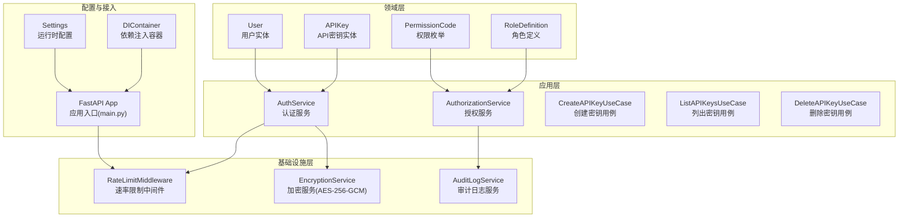
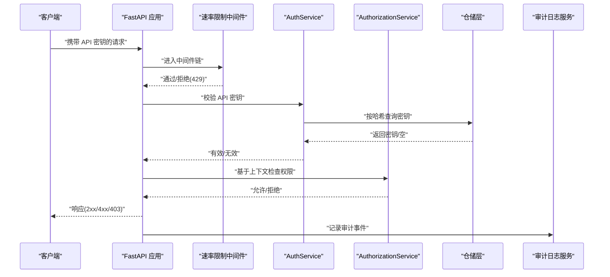
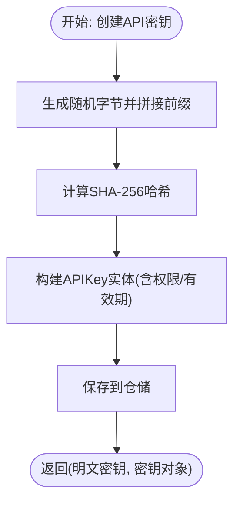
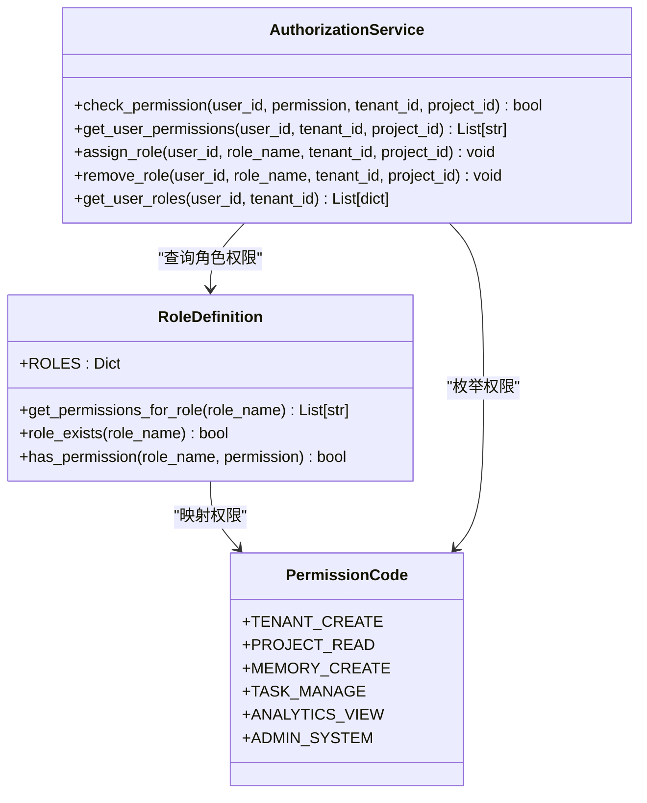
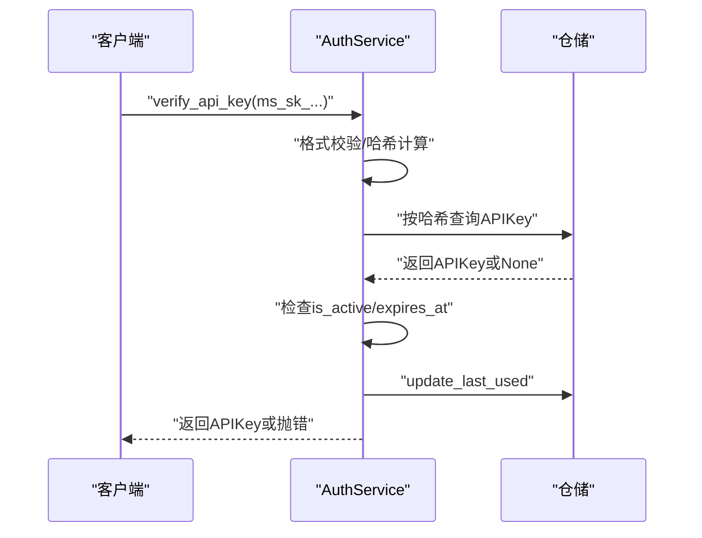
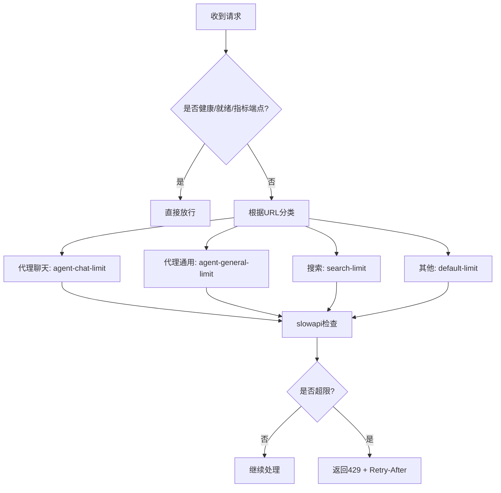
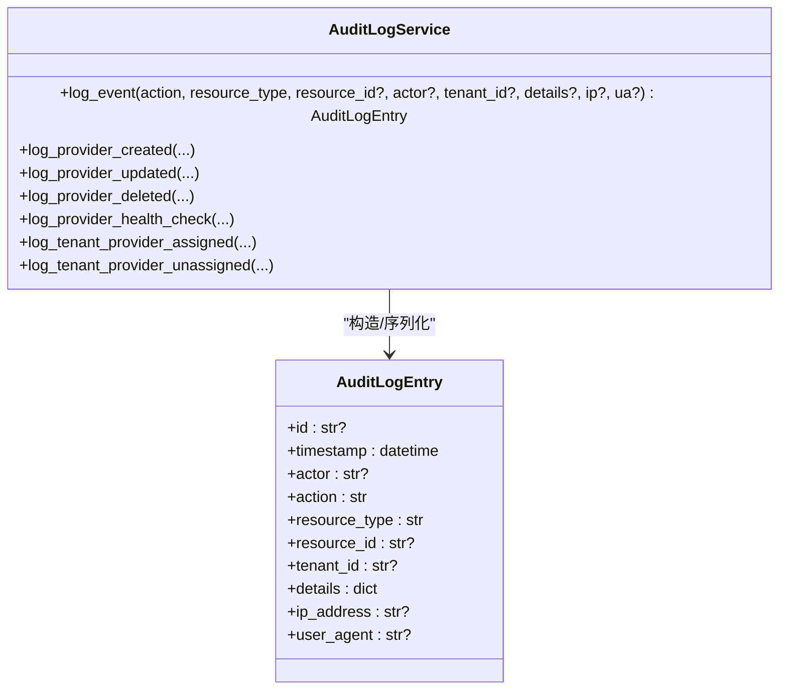
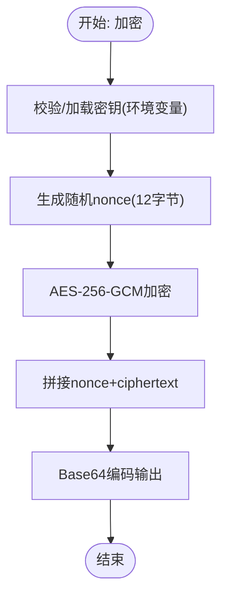
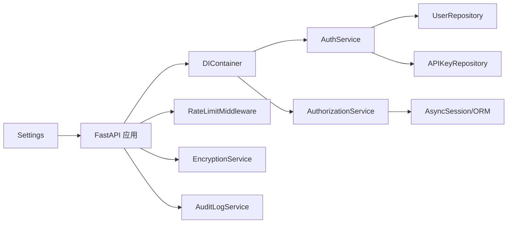

# 安全与权限

<cite>
**本文引用的文件**
- [src/domain/model/auth/api_key.py](file://src/domain/model/auth/api_key.py)
- [src/domain/model/auth/permissions.py](file://src/domain/model/auth/permissions.py)
- [src/domain/model/auth/roles.py](file://src/domain/model/auth/roles.py)
- [src/domain/model/auth/user.py](file://src/domain/model/auth/user.py)
- [src/application/services/auth_service_v2.py](file://src/application/services/auth_service_v2.py)
- [src/application/services/authorization_service.py](file://src/application/services/authorization_service.py)
- [src/application/use_cases/auth/create_api_key.py](file://src/application/use_cases/auth/create_api_key.py)
- [src/application/use_cases/auth/delete_api_key.py](file://src/application/use_cases/auth/delete_api_key.py)
- [src/application/use_cases/auth/list_api_keys.py](file://src/application/use_cases/auth/list_api_keys.py)
- [src/infrastructure/middleware/rate_limit.py](file://src/infrastructure/middleware/rate_limit.py)
- [src/infrastructure/security/encryption_service.py](file://src/infrastructure/security/encryption_service.py)
- [src/infrastructure/audit/audit_log_service.py](file://src/infrastructure/audit/audit_log_service.py)
- [src/configuration/config.py](file://src/configuration/config.py)
- [src/configuration/di_container.py](file://src/configuration/di_container.py)
- [src/infrastructure/adapters/primary/web/main.py](file://src/infrastructure/adapters/primary/web/main.py)
</cite>

## 目录
1. [简介](#简介)
2. [项目结构](#项目结构)
3. [核心组件](#核心组件)
4. [架构总览](#架构总览)
5. [详细组件分析](#详细组件分析)
6. [依赖关系分析](#依赖关系分析)
7. [性能考量](#性能考量)
8. [故障排查指南](#故障排查指南)
9. [结论](#结论)
10. [附录：配置与最佳实践](#附录配置与最佳实践)

## 简介
本文件系统性梳理 MemStack 的安全与权限体系，覆盖认证与授权设计、API 密钥生成与校验、密码哈希策略、令牌验证流程、RBAC 角色权限模型、租户隔离、安全中间件（速率限制、请求验证、审计日志）以及多租户下的数据隔离策略。同时提供配置示例、集成指南与最佳实践，帮助开发者正确实现与部署。

## 项目结构
安全与权限相关代码主要分布在以下层次：
- 领域层：用户、API 密钥、权限与角色定义
- 应用层：认证服务、授权服务、用例
- 基础设施层：速率限制中间件、加密服务、审计日志服务
- 配置层：运行时配置与依赖注入容器
- 接入层：FastAPI 应用注册中间件与路由

**图表来源**
- [src/domain/model/auth/user.py](file://src/domain/model/auth/user.py#L1-L18)
- [src/domain/model/auth/api_key.py](file://src/domain/model/auth/api_key.py#L1-L20)
- [src/domain/model/auth/permissions.py](file://src/domain/model/auth/permissions.py#L1-L91)
- [src/domain/model/auth/roles.py](file://src/domain/model/auth/roles.py#L1-L229)
- [src/application/services/auth_service_v2.py](file://src/application/services/auth_service_v2.py#L1-L222)
- [src/application/services/authorization_service.py](file://src/application/services/authorization_service.py#L1-L343)
- [src/infrastructure/middleware/rate_limit.py](file://src/infrastructure/middleware/rate_limit.py#L1-L96)
- [src/infrastructure/security/encryption_service.py](file://src/infrastructure/security/encryption_service.py#L1-L179)
- [src/infrastructure/audit/audit_log_service.py](file://src/infrastructure/audit/audit_log_service.py#L1-L278)
- [src/configuration/config.py](file://src/configuration/config.py#L1-L231)
- [src/configuration/di_container.py](file://src/configuration/di_container.py#L1-L391)
- [src/infrastructure/adapters/primary/web/main.py](file://src/infrastructure/adapters/primary/web/main.py#L1-L280)

**章节来源**
- [src/configuration/config.py](file://src/configuration/config.py#L147-L155)
- [src/infrastructure/adapters/primary/web/main.py](file://src/infrastructure/adapters/primary/web/main.py#L228-L239)

## 核心组件
- 认证服务（AuthService）
  - 负责 API 密钥生成、哈希、校验、过期检查与最后使用时间更新；支持基于 API 密钥获取用户信息与密码哈希策略。
- 授权服务（AuthorizationService）
  - 实现 RBAC 权限检查、角色分配/移除、系统管理员豁免、上下文（租户）过滤。
- 权限与角色模型
  - 权限采用“资源:动作”命名规范；角色按租户/项目/系统层级划分，提供权限集合映射。
- API 密钥实体
  - 包含用户标识、哈希值、名称、状态、权限列表、有效期、最后使用时间等字段。
- 速率限制中间件
  - 基于 Redis 的分布式限流，针对不同端点设置差异化配额，健康检查除外。
- 加密服务
  - 使用 AES-256-GCM 对敏感数据（如 LLM 提供商密钥）进行加解密，支持从环境变量加载密钥。
- 审计日志服务
  - 统一记录敏感操作事件，支持数据库/文件/控制台后端，便于合规与追踪。
- 运行时配置
  - 汇总 API、数据库、Redis、LLM 提供商、安全参数等配置项。
- 依赖注入容器
  - 将领域端口与基础设施适配器解耦，统一装配认证/授权相关依赖。

**章节来源**
- [src/application/services/auth_service_v2.py](file://src/application/services/auth_service_v2.py#L25-L222)
- [src/application/services/authorization_service.py](file://src/application/services/authorization_service.py#L27-L343)
- [src/domain/model/auth/permissions.py](file://src/domain/model/auth/permissions.py#L11-L91)
- [src/domain/model/auth/roles.py](file://src/domain/model/auth/roles.py#L13-L229)
- [src/domain/model/auth/api_key.py](file://src/domain/model/auth/api_key.py#L8-L20)
- [src/infrastructure/middleware/rate_limit.py](file://src/infrastructure/middleware/rate_limit.py#L23-L96)
- [src/infrastructure/security/encryption_service.py](file://src/infrastructure/security/encryption_service.py#L16-L179)
- [src/infrastructure/audit/audit_log_service.py](file://src/infrastructure/audit/audit_log_service.py#L36-L278)
- [src/configuration/config.py](file://src/configuration/config.py#L10-L231)
- [src/configuration/di_container.py](file://src/configuration/di_container.py#L108-L391)

## 架构总览
下图展示认证与授权在系统中的交互路径：客户端通过 API 密钥访问受保护端点，中间件进行速率限制，应用层服务完成鉴权与授权决策，必要时调用加密与审计能力。

**图表来源**
- [src/infrastructure/adapters/primary/web/main.py](file://src/infrastructure/adapters/primary/web/main.py#L236-L239)
- [src/infrastructure/middleware/rate_limit.py](file://src/infrastructure/middleware/rate_limit.py#L43-L85)
- [src/application/services/auth_service_v2.py](file://src/application/services/auth_service_v2.py#L74-L106)
- [src/application/services/authorization_service.py](file://src/application/services/authorization_service.py#L33-L67)
- [src/infrastructure/audit/audit_log_service.py](file://src/infrastructure/audit/audit_log_service.py#L61-L108)

## 详细组件分析

### 认证与 API 密钥
- API 密钥生成
  - 使用安全随机数生成密钥材料，前缀固定为“ms_sk_”，便于识别与快速校验。
- 密钥存储与校验
  - 存储采用 SHA-256 哈希；校验时对明文再次哈希比对；支持启用/停用、过期时间、最后使用时间更新。
- 用户与密码
  - 用户实体包含邮箱、姓名、密码哈希、激活状态与创建时间；密码采用 bcrypt 哈希，具备抗彩虹表与侧信道攻击特性。
- API 密钥用例
  - 创建、列出、删除密钥的用例封装了仓储接口，确保业务规则与授权约束在用例层执行。

**图表来源**
- [src/application/services/auth_service_v2.py](file://src/application/services/auth_service_v2.py#L41-L56)
- [src/application/services/auth_service_v2.py](file://src/application/services/auth_service_v2.py#L107-L146)

**章节来源**
- [src/application/services/auth_service_v2.py](file://src/application/services/auth_service_v2.py#L41-L146)
- [src/domain/model/auth/api_key.py](file://src/domain/model/auth/api_key.py#L8-L20)
- [src/domain/model/auth/user.py](file://src/domain/model/auth/user.py#L8-L18)
- [src/application/use_cases/auth/create_api_key.py](file://src/application/use_cases/auth/create_api_key.py#L18-L40)
- [src/application/use_cases/auth/list_api_keys.py](file://src/application/use_cases/auth/list_api_keys.py#L1-L24)
- [src/application/use_cases/auth/delete_api_key.py](file://src/application/use_cases/auth/delete_api_key.py#L21-L32)

### 授权与 RBAC
- 权限模型
  - 权限以枚举形式集中管理，遵循“资源:动作”命名；支持按资源筛选权限集合。
- 角色模型
  - 角色分为租户级、项目级与系统级三类，每类角色映射一组权限；提供角色存在性检查、权限查询与角色间继承关系的便捷方法。
- 授权决策
  - 系统管理员拥有全局豁免权；在指定上下文中（租户/项目）聚合用户所有角色对应的权限集合，进行精确匹配。
- 角色分配与移除
  - 支持在系统或租户维度分配/移除角色，自动处理重复与不存在的情况。

**图表来源**
- [src/domain/model/auth/permissions.py](file://src/domain/model/auth/permissions.py#L11-L91)
- [src/domain/model/auth/roles.py](file://src/domain/model/auth/roles.py#L13-L229)
- [src/application/services/authorization_service.py](file://src/application/services/authorization_service.py#L27-L343)

**章节来源**
- [src/domain/model/auth/permissions.py](file://src/domain/model/auth/permissions.py#L65-L91)
- [src/domain/model/auth/roles.py](file://src/domain/model/auth/roles.py#L150-L229)
- [src/application/services/authorization_service.py](file://src/application/services/authorization_service.py#L33-L225)

### 令牌验证流程
- API 密钥验证步骤
  - 格式校验（前缀）、哈希查找、状态与有效期检查、最后使用时间更新。
- 用户获取流程
  - 通过 API 密钥解析出用户 ID，查询用户实体并校验账户状态。

**图表来源**
- [src/application/services/auth_service_v2.py](file://src/application/services/auth_service_v2.py#L74-L106)

**章节来源**
- [src/application/services/auth_service_v2.py](file://src/application/services/auth_service_v2.py#L74-L106)

### 速率限制中间件
- 限流策略
  - 默认每分钟 200 次；代理聊天端点更严格；搜索端点中等；其他端点默认；健康检查与指标端点高并发放行。
- 后端与键函数
  - 使用 Redis 作为存储后端，键函数按客户端地址生成；异常统一转换为 429 响应。
- 集成方式
  - 在应用启动时注册中间件与异常处理器，并在路由层按需装饰。

**图表来源**
- [src/infrastructure/middleware/rate_limit.py](file://src/infrastructure/middleware/rate_limit.py#L43-L85)

**章节来源**
- [src/infrastructure/middleware/rate_limit.py](file://src/infrastructure/middleware/rate_limit.py#L23-L96)
- [src/infrastructure/adapters/primary/web/main.py](file://src/infrastructure/adapters/primary/web/main.py#L236-L239)

### 审计日志
- 日志条目
  - 包含时间戳、操作者、动作、资源类型/ID、租户 ID、详情、IP 与 UA 等字段。
- 后端选择
  - 支持数据库、文件与控制台三种后端；失败时回退至控制台输出。
- 常见事件
  - 提供提供商创建/更新/删除、健康检查、租户-提供商映射变更等便捷方法。

**图表来源**
- [src/infrastructure/audit/audit_log_service.py](file://src/infrastructure/audit/audit_log_service.py#L18-L108)
- [src/infrastructure/audit/audit_log_service.py](file://src/infrastructure/audit/audit_log_service.py#L155-L264)

**章节来源**
- [src/infrastructure/audit/audit_log_service.py](file://src/infrastructure/audit/audit_log_service.py#L36-L278)

### 加密服务（敏感数据保护）
- 加密算法
  - 使用 AES-256-GCM，随机 nonce，返回 base64 编码的密文。
- 密钥管理
  - 优先从环境变量读取；若未设置或非法则发出警告并使用开发密钥（仅用于开发，严禁生产）。
- 典型用途
  - 用于 LLM 提供商 API Key 等敏感配置的本地持久化加密。

**图表来源**
- [src/infrastructure/security/encryption_service.py](file://src/infrastructure/security/encryption_service.py#L92-L114)
- [src/infrastructure/security/encryption_service.py](file://src/infrastructure/security/encryption_service.py#L35-L91)

**章节来源**
- [src/infrastructure/security/encryption_service.py](file://src/infrastructure/security/encryption_service.py#L16-L179)

### 多租户与数据隔离
- 租户维度的角色与权限
  - 授权查询会根据租户 ID 过滤用户角色，确保跨租户数据隔离；系统管理员可绕过上下文限制。
- 仓储与查询
  - 授权服务在查询用户权限时，结合租户上下文构建 SQL 查询，避免越权访问。
- 最佳实践
  - 所有写操作均需携带租户上下文；对跨租户共享资源进行显式白名单控制；定期审计角色与权限变更。

**章节来源**
- [src/application/services/authorization_service.py](file://src/application/services/authorization_service.py#L57-L116)

## 依赖关系分析
- 依赖倒置
  - 应用服务依赖领域端口（仓储接口），而非具体实现，便于替换与测试。
- 中介层解耦
  - FastAPI 应用通过 DI 容器装配服务与仓储，中间件独立于业务逻辑。
- 配置驱动
  - 运行时配置集中管理，包括 API 密钥头名、是否强制 API 密钥、Redis 连接等。

**图表来源**
- [src/configuration/di_container.py](file://src/configuration/di_container.py#L108-L391)
- [src/infrastructure/adapters/primary/web/main.py](file://src/infrastructure/adapters/primary/web/main.py#L116-L125)
- [src/configuration/config.py](file://src/configuration/config.py#L227-L231)

**章节来源**
- [src/configuration/di_container.py](file://src/configuration/di_container.py#L108-L391)
- [src/infrastructure/adapters/primary/web/main.py](file://src/infrastructure/adapters/primary/web/main.py#L116-L125)
- [src/configuration/config.py](file://src/configuration/config.py#L147-L155)

## 性能考量
- 速率限制
  - 通过 Redis 分布式限流降低热点端点压力；建议按租户/计划等级差异化配额。
- 密钥校验
  - 哈希索引命中与仓储缓存可减少数据库压力；避免在高频路径重复计算哈希。
- 授权查询
  - 使用 JOIN 聚合用户角色与权限，尽量减少 N+1 查询；对常用权限集合进行缓存。
- 加密与审计
  - 加密为同步开销，建议批量处理与异步落盘；审计日志建议异步写入或缓冲队列。

## 故障排查指南
- API 密钥无效/过期
  - 检查密钥前缀、哈希是否一致、是否被停用、是否已过期；确认仓储中是否存在对应记录。
- 密码校验失败
  - 确认 bcrypt 版本兼容与输入编码；查看日志中调试信息。
- 权限不足
  - 确认用户在目标租户上下文的角色与权限映射；检查系统管理员豁免逻辑。
- 速率限制触发
  - 查看中间件日志与 429 响应头 Retry-After；调整端点配额或客户端退避重试。
- 审计日志缺失
  - 检查后端配置与文件路径；确认异常回退逻辑是否生效。
- 加密密钥问题
  - 确认 LLM_ENCRYPTION_KEY 是否为 64 位十六进制字符串；生产环境禁止使用开发密钥。

**章节来源**
- [src/application/services/auth_service_v2.py](file://src/application/services/auth_service_v2.py#L58-L66)
- [src/infrastructure/middleware/rate_limit.py](file://src/infrastructure/middleware/rate_limit.py#L76-L83)
- [src/infrastructure/audit/audit_log_service.py](file://src/infrastructure/audit/audit_log_service.py#L109-L153)
- [src/infrastructure/security/encryption_service.py](file://src/infrastructure/security/encryption_service.py#L84-L90)

## 结论
MemStack 的安全与权限体系以领域驱动设计为核心，通过清晰的职责分离与依赖倒置实现了可维护与可扩展的安全子系统。认证采用强健的 API 密钥与 bcrypt 密码策略，授权基于 RBAC 并支持租户隔离，配合速率限制、审计与加密服务形成完整的安全闭环。建议在生产环境中严格配置密钥与后端，持续监控与审计关键操作，并定期审查角色与权限映射。

## 附录：配置与最佳实践

### 关键配置项
- 安全相关
  - SECRET_KEY：用于签名与加密（JWT/会话等，如使用）
  - ALGORITHM：签名算法（如 HS256）
  - ACCESS_TOKEN_EXPIRE_MINUTES：访问令牌有效期
  - REQUIRE_API_KEY：是否强制要求 API 密钥
  - API_KEY_HEADER_NAME：API 密钥请求头名称（默认 Authorization）

- 速率限制
  - Redis 连接：REDIS_HOST/PORT/PASSWORD
  - 限流策略：可在中间件中调整默认配额与端点分类

- 审计与加密
  - LLM_ENCRYPTION_KEY：AES-256-GCM 密钥（32 字节十六进制）
  - 审计后端：可通过审计服务初始化参数切换

**章节来源**
- [src/configuration/config.py](file://src/configuration/config.py#L147-L155)
- [src/infrastructure/middleware/rate_limit.py](file://src/infrastructure/middleware/rate_limit.py#L33-L38)
- [src/infrastructure/security/encryption_service.py](file://src/infrastructure/security/encryption_service.py#L24-L34)
- [src/infrastructure/audit/audit_log_service.py](file://src/infrastructure/audit/audit_log_service.py#L46-L60)

### API 密钥生成与使用
- 生成流程
  - 调用认证服务生成新密钥，返回明文密钥与持久化后的密钥对象；明文密钥仅在首次返回时可见，请妥善保存。
- 使用方式
  - 在请求头中以“Bearer ms_sk_...”格式携带 API 密钥；服务端将对其进行格式、有效性、状态与有效期校验。

**章节来源**
- [src/application/services/auth_service_v2.py](file://src/application/services/auth_service_v2.py#L107-L146)
- [src/infrastructure/adapters/primary/web/main.py](file://src/infrastructure/adapters/primary/web/main.py#L153-L158)

### 权限与角色管理
- 角色与权限
  - 使用角色定义查询某角色的全部权限；通过授权服务在指定租户上下文内检查用户权限。
- 系统管理员
  - 拥有全局权限豁免，适用于运维与紧急场景；应谨慎授予并严格审计。

**章节来源**
- [src/domain/model/auth/roles.py](file://src/domain/model/auth/roles.py#L150-L168)
- [src/application/services/authorization_service.py](file://src/application/services/authorization_service.py#L33-L67)

### 速率限制集成
- 中间件注册
  - 应用启动时注册限流中间件与异常处理器；对健康检查端点放行。
- 自定义配额
  - 可在中间件中按端点路径模式调整配额；建议结合租户/计划等级差异化配置。

**章节来源**
- [src/infrastructure/adapters/primary/web/main.py](file://src/infrastructure/adapters/primary/web/main.py#L236-L239)
- [src/infrastructure/middleware/rate_limit.py](file://src/infrastructure/middleware/rate_limit.py#L43-L85)

### 审计日志集成
- 事件记录
  - 在关键业务操作前后调用审计服务记录事件；可选数据库/文件/控制台后端。
- 合规建议
  - 保留长期审计日志；对敏感字段进行脱敏；建立告警与检索机制。

**章节来源**
- [src/infrastructure/audit/audit_log_service.py](file://src/infrastructure/audit/audit_log_service.py#L61-L108)

### 加密服务集成
- 密钥管理
  - 生产环境务必设置 LLM_ENCRYPTION_KEY；禁止使用开发密钥。
- 使用建议
  - 对外部密钥（如 LLM 提供商 API Key）进行本地加密存储；传输与日志中避免泄露。

**章节来源**
- [src/infrastructure/security/encryption_service.py](file://src/infrastructure/security/encryption_service.py#L24-L34)
- [src/infrastructure/security/encryption_service.py](file://src/infrastructure/security/encryption_service.py#L84-L90)