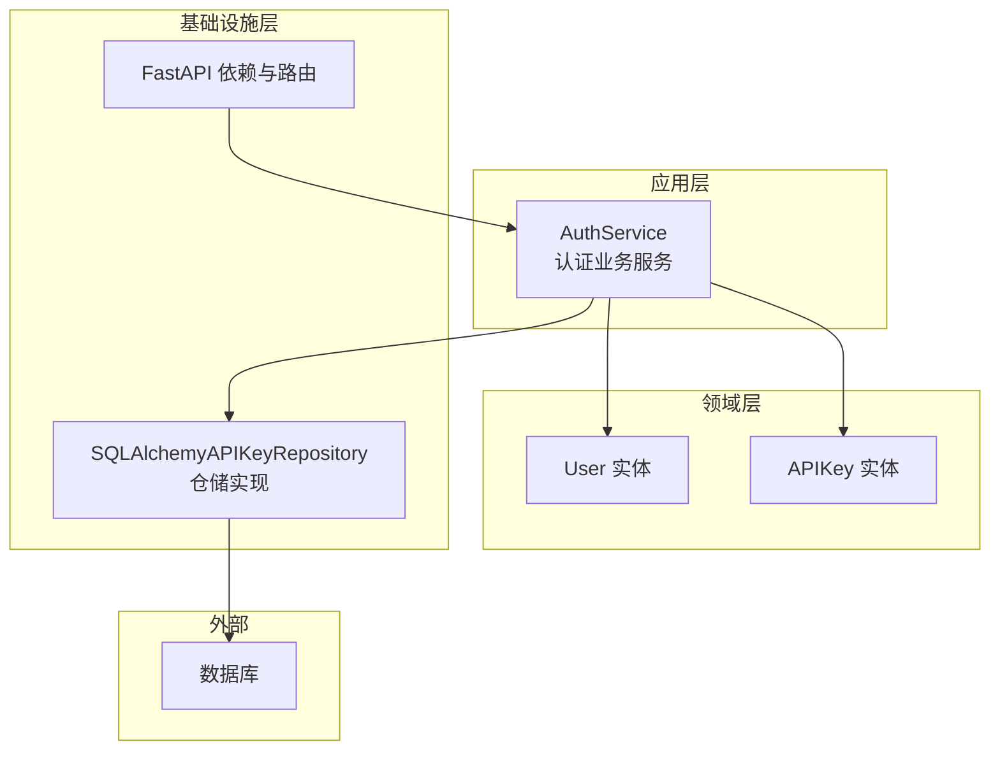
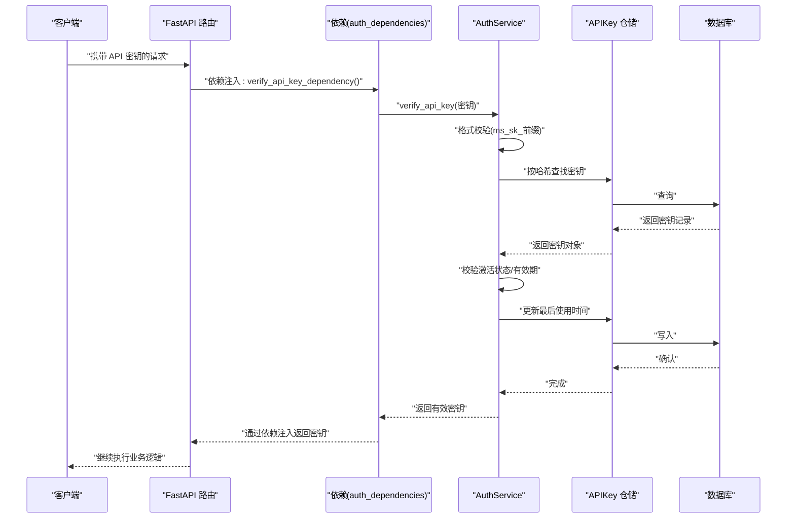
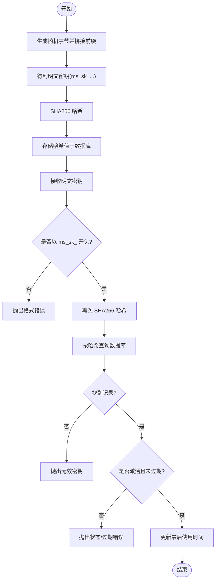
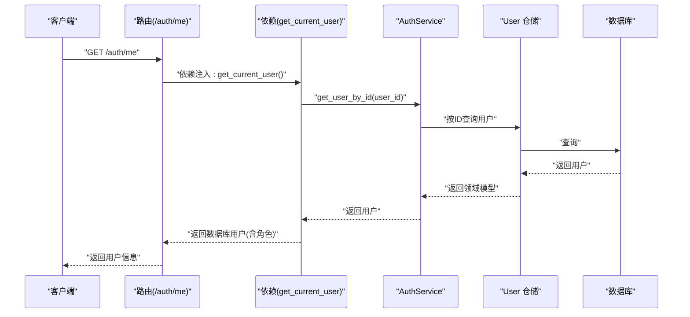
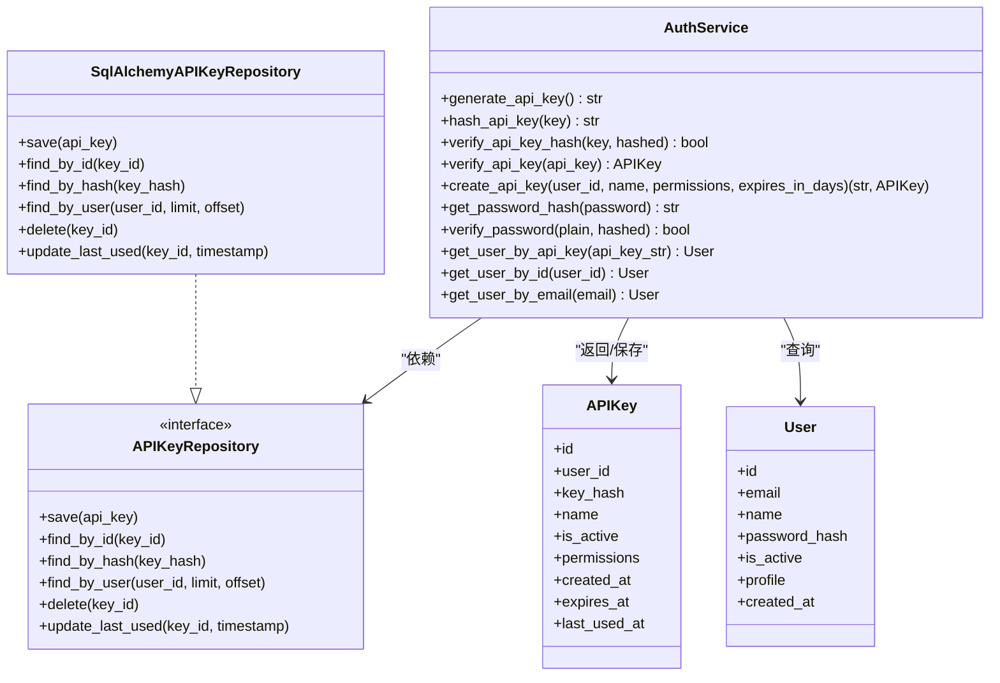

# 认证系统

<cite>
**本文引用的文件**
- [src/application/services/auth_service_v2.py](file://src/application/services/auth_service_v2.py)
- [src/domain/model/auth/api_key.py](file://src/domain/model/auth/api_key.py)
- [src/domain/model/auth/user.py](file://src/domain/model/auth/user.py)
- [src/infrastructure/adapters/primary/web/dependencies/auth_dependencies.py](file://src/infrastructure/adapters/primary/web/dependencies/auth_dependencies.py)
- [src/infrastructure/adapters/primary/web/routers/auth.py](file://src/infrastructure/adapters/primary/web/routers/auth.py)
- [src/application/schemas/auth.py](file://src/application/schemas/auth.py)
- [src/infrastructure/adapters/secondary/persistence/sql_api_key_repository.py](file://src/infrastructure/adapters/secondary/persistence/sql_api_key_repository.py)
- [src/tests/integration/security/test_auth.py](file://src/tests/integration/security/test_auth.py)
</cite>

## 目录
1. [简介](#简介)
2. [项目结构](#项目结构)
3. [核心组件](#核心组件)
4. [架构总览](#架构总览)
5. [详细组件分析](#详细组件分析)
6. [依赖关系分析](#依赖关系分析)
7. [性能考虑](#性能考虑)
8. [故障排查指南](#故障排查指南)
9. [结论](#结论)
10. [附录](#附录)

## 简介
本文件面向 MemStack 的认证系统，聚焦以下目标：
- 深入解析 API 密钥生成机制：前缀规范、随机字节生成与 SHA256 存储策略
- 详述密码哈希实现：bcrypt 的选择原因与安全优势
- 阐明用户认证流程：从 API 密钥验证到用户信息获取的完整链路
- 解析认证服务核心方法：generate_api_key、verify_api_key、create_api_key、hash_api_key 等的实现与使用场景
- 提供认证配置最佳实践：密钥有效期管理、安全存储策略与错误处理
- 给出可直接落地的集成指南与参考路径

## 项目结构
认证系统采用分层架构，遵循依赖倒置原则：
- 应用层：业务服务类负责认证逻辑与领域模型交互
- 领域层：定义用户与 APIKey 的实体模型
- 基础设施层：适配器将应用服务接入 FastAPI，并通过仓储访问数据库
- 路由层：对外暴露认证相关接口
- 测试层：覆盖密钥生成、哈希、验证与过期等关键行为

图表来源
- [src/application/services/auth_service_v2.py](file://src/application/services/auth_service_v2.py#L25-L222)
- [src/domain/model/auth/user.py](file://src/domain/model/auth/user.py#L8-L18)
- [src/domain/model/auth/api_key.py](file://src/domain/model/auth/api_key.py#L8-L20)
- [src/infrastructure/adapters/primary/web/dependencies/auth_dependencies.py](file://src/infrastructure/adapters/primary/web/dependencies/auth_dependencies.py#L1-L606)
- [src/infrastructure/adapters/secondary/persistence/sql_api_key_repository.py](file://src/infrastructure/adapters/secondary/persistence/sql_api_key_repository.py#L19-L106)

章节来源
- [src/application/services/auth_service_v2.py](file://src/application/services/auth_service_v2.py#L1-L222)
- [src/infrastructure/adapters/primary/web/dependencies/auth_dependencies.py](file://src/infrastructure/adapters/primary/web/dependencies/auth_dependencies.py#L1-L606)

## 核心组件
- 认证服务（AuthService）：封装密钥生成、哈希、校验、用户与密钥查询等核心能力
- 用户实体（User）：承载邮箱、姓名、密码哈希、状态等用户信息
- APIKey 实体（APIKey）：承载密钥哈希、名称、权限、有效期、最后使用时间等
- FastAPI 依赖与路由：提供密钥提取、校验、登录签发临时密钥、密钥列表与撤销等接口
- 仓储实现（SqlAlchemyAPIKeyRepository）：基于 SQLAlchemy 的持久化操作

章节来源
- [src/application/services/auth_service_v2.py](file://src/application/services/auth_service_v2.py#L25-L222)
- [src/domain/model/auth/user.py](file://src/domain/model/auth/user.py#L8-L18)
- [src/domain/model/auth/api_key.py](file://src/domain/model/auth/api_key.py#L8-L20)
- [src/infrastructure/adapters/primary/web/routers/auth.py](file://src/infrastructure/adapters/primary/web/routers/auth.py#L1-L210)
- [src/infrastructure/adapters/secondary/persistence/sql_api_key_repository.py](file://src/infrastructure/adapters/secondary/persistence/sql_api_key_repository.py#L19-L106)

## 架构总览
认证系统的关键调用链如下：
- 客户端携带 API 密钥请求受保护资源
- FastAPI 依赖从请求头提取密钥并调用认证服务进行校验
- 认证服务对密钥进行格式校验、哈希查找、状态与有效期检查，并更新“最后使用时间”
- 成功后可继续调用用户查询或授权相关流程

图表来源
- [src/infrastructure/adapters/primary/web/dependencies/auth_dependencies.py](file://src/infrastructure/adapters/primary/web/dependencies/auth_dependencies.py#L107-L142)
- [src/application/services/auth_service_v2.py](file://src/application/services/auth_service_v2.py#L74-L105)
- [src/infrastructure/adapters/secondary/persistence/sql_api_key_repository.py](file://src/infrastructure/adapters/secondary/persistence/sql_api_key_repository.py#L63-L91)

## 详细组件分析

### API 密钥生成与存储策略
- 生成规则
  - 使用安全随机源生成 32 字节随机数
  - 以固定前缀拼接十六进制字符串作为密钥
  - 参考路径：[生成方法](file://src/application/services/auth_service_v2.py#L41-L46)
- 存储策略
  - 明文密钥仅在创建时返回一次
  - 数据库存储的是 SHA256 哈希值，确保泄露风险可控
  - 参考路径：[哈希方法](file://src/application/services/auth_service_v2.py#L48-L51)、[创建密钥保存](file://src/application/services/auth_service_v2.py#L107-L145)、[仓储按哈希查询](file://src/infrastructure/adapters/secondary/persistence/sql_api_key_repository.py#L63-L67)
- 校验流程
  - 从请求中提取密钥，先做格式校验，再计算哈希并查询
  - 参考路径：[校验入口](file://src/application/services/auth_service_v2.py#L74-L105)、[依赖层校验](file://src/infrastructure/adapters/primary/web/dependencies/auth_dependencies.py#L80-L104)

图表来源
- [src/application/services/auth_service_v2.py](file://src/application/services/auth_service_v2.py#L41-L105)
- [src/infrastructure/adapters/secondary/persistence/sql_api_key_repository.py](file://src/infrastructure/adapters/secondary/persistence/sql_api_key_repository.py#L63-L91)

章节来源
- [src/application/services/auth_service_v2.py](file://src/application/services/auth_service_v2.py#L41-L105)
- [src/infrastructure/adapters/secondary/persistence/sql_api_key_repository.py](file://src/infrastructure/adapters/secondary/persistence/sql_api_key_repository.py#L63-L91)

### 密码哈希与安全优势
- bcrypt 选择
  - 面向密码的自适应散列函数，具备可调成本因子，能抵御暴力破解
  - 在认证服务中用于生成与校验密码哈希
  - 参考路径：[生成哈希](file://src/application/services/auth_service_v2.py#L67-L70)、[校验哈希](file://src/application/services/auth_service_v2.py#L58-L65)
- 登录流程
  - 路由层根据用户名查询用户，使用 bcrypt 校验密码
  - 成功后签发短期 API 密钥作为“令牌”
  - 参考路径：[登录签发](file://src/infrastructure/adapters/primary/web/routers/auth.py#L38-L94)

章节来源
- [src/application/services/auth_service_v2.py](file://src/application/services/auth_service_v2.py#L58-L70)
- [src/infrastructure/adapters/primary/web/routers/auth.py](file://src/infrastructure/adapters/primary/web/routers/auth.py#L38-L94)

### 用户认证流程：从 API 密钥到用户信息
- API 密钥验证
  - 依赖层从 Authorization 头提取密钥，调用认证服务进行格式、存在性、激活状态与有效期检查
  - 通过后返回数据库模型以便后续使用
  - 参考路径：[依赖层验证](file://src/infrastructure/adapters/primary/web/dependencies/auth_dependencies.py#L107-L142)
- 获取当前用户
  - 基于已验证的 API 密钥，查询用户并加载角色信息
  - 参考路径：[获取当前用户](file://src/infrastructure/adapters/primary/web/dependencies/auth_dependencies.py#L144-L188)
- 用户信息接口
  - 提供“获取当前用户”和“更新当前用户”的接口
  - 参考路径：[用户信息路由](file://src/infrastructure/adapters/primary/web/routers/auth.py#L162-L209)

图表来源
- [src/infrastructure/adapters/primary/web/dependencies/auth_dependencies.py](file://src/infrastructure/adapters/primary/web/dependencies/auth_dependencies.py#L144-L188)
- [src/infrastructure/adapters/primary/web/routers/auth.py](file://src/infrastructure/adapters/primary/web/routers/auth.py#L162-L175)

章节来源
- [src/infrastructure/adapters/primary/web/dependencies/auth_dependencies.py](file://src/infrastructure/adapters/primary/web/dependencies/auth_dependencies.py#L144-L188)
- [src/infrastructure/adapters/primary/web/routers/auth.py](file://src/infrastructure/adapters/primary/web/routers/auth.py#L162-L175)

### 认证服务核心方法详解
- generate_api_key
  - 用途：生成新的 API 密钥（带 ms_sk_ 前缀）
  - 场景：创建密钥、测试工具
  - 参考路径：[实现](file://src/application/services/auth_service_v2.py#L41-L46)
- hash_api_key / verify_api_key_hash
  - 用途：对明文密钥进行 SHA256 哈希；对比明文与存储哈希
  - 场景：存储密钥、校验输入
  - 参考路径：[实现](file://src/application/services/auth_service_v2.py#L48-L56)
- verify_api_key
  - 用途：综合校验密钥格式、是否存在、激活状态、有效期，并更新最后使用时间
  - 场景：所有受保护接口前置校验
  - 参考路径：[实现](file://src/application/services/auth_service_v2.py#L74-L105)
- create_api_key
  - 用途：为指定用户创建 API 密钥，支持设置名称、权限与有效期
  - 场景：用户在控制台或后台创建新密钥
  - 参考路径：[实现](file://src/application/services/auth_service_v2.py#L107-L145)
- get_password_hash / verify_password
  - 用途：bcrypt 生成与校验密码哈希
  - 场景：登录、注册、密码变更
  - 参考路径：[实现](file://src/application/services/auth_service_v2.py#L58-L70)
- get_user_by_api_key / get_user_by_id / get_user_by_email
  - 用途：通过 API 密钥或用户标识获取用户信息
  - 场景：鉴权后业务逻辑读取用户上下文
  - 参考路径：[实现](file://src/application/services/auth_service_v2.py#L159-L221)

章节来源
- [src/application/services/auth_service_v2.py](file://src/application/services/auth_service_v2.py#L41-L221)

### API 密钥生命周期与管理
- 创建
  - 调用 create_api_key，返回明文密钥与持久化后的密钥对象
  - 参考路径：[创建接口](file://src/infrastructure/adapters/primary/web/routers/auth.py#L97-L119)、[依赖层封装](file://src/infrastructure/adapters/primary/web/dependencies/auth_dependencies.py#L220-L251)
- 列表
  - 返回用户所有密钥，敏感字段掩码显示
  - 参考路径：[列表接口](file://src/infrastructure/adapters/primary/web/routers/auth.py#L122-L140)
- 撤销
  - 删除指定密钥
  - 参考路径：[撤销接口](file://src/infrastructure/adapters/primary/web/routers/auth.py#L143-L160)

章节来源
- [src/infrastructure/adapters/primary/web/routers/auth.py](file://src/infrastructure/adapters/primary/web/routers/auth.py#L97-L160)
- [src/infrastructure/adapters/primary/web/dependencies/auth_dependencies.py](file://src/infrastructure/adapters/primary/web/dependencies/auth_dependencies.py#L220-L251)

## 依赖关系分析
- 应用服务依赖领域接口（仓储），不直接依赖具体实现，便于替换与测试
- FastAPI 依赖层仅承担适配职责，业务逻辑委托给应用服务
- 仓储实现基于 SQLAlchemy，提供保存、查询、删除与时间戳更新等操作

图表来源
- [src/application/services/auth_service_v2.py](file://src/application/services/auth_service_v2.py#L25-L221)
- [src/infrastructure/adapters/secondary/persistence/sql_api_key_repository.py](file://src/infrastructure/adapters/secondary/persistence/sql_api_key_repository.py#L19-L106)
- [src/domain/model/auth/api_key.py](file://src/domain/model/auth/api_key.py#L8-L20)
- [src/domain/model/auth/user.py](file://src/domain/model/auth/user.py#L8-L18)

章节来源
- [src/application/services/auth_service_v2.py](file://src/application/services/auth_service_v2.py#L25-L221)
- [src/infrastructure/adapters/secondary/persistence/sql_api_key_repository.py](file://src/infrastructure/adapters/secondary/persistence/sql_api_key_repository.py#L19-L106)

## 性能考虑
- 密钥哈希成本
  - SHA256 为常量时间复杂度，开销极低
  - bcrypt 用于密码哈希，成本因子可调，建议在生产环境适当提高成本以增强抗攻击性
- 查询优化
  - APIKey 仓储按哈希查询，需确保 key_hash 字段建立索引
  - 最后使用时间更新为单行写入，避免频繁 I/O
- 并发与事务
  - FastAPI 路由层使用异步会话，注意在高并发下合理提交事务，避免长事务阻塞

## 故障排查指南
- 常见错误与定位
  - 无效密钥格式：未以 ms_sk_ 开头
    - 参考路径：[格式校验](file://src/application/services/auth_service_v2.py#L87-L88)、[依赖层校验](file://src/infrastructure/adapters/primary/web/dependencies/auth_dependencies.py#L98-L102)
  - 无效密钥：哈希未匹配任何记录
    - 参考路径：[无效密钥异常](file://src/application/services/auth_service_v2.py#L93-L94)
  - 密钥未激活或已过期
    - 参考路径：[状态与有效期检查](file://src/application/services/auth_service_v2.py#L96-L100)
  - 用户不存在或账户未激活
    - 参考路径：[用户查询与状态检查](file://src/application/services/auth_service_v2.py#L169-L177)
  - 登录失败
    - 参考路径：[登录校验](file://src/infrastructure/adapters/primary/web/routers/auth.py#L63-L74)
- 单元与集成测试参考
  - 密钥生成、哈希与验证
    - 参考路径：[测试用例](file://src/tests/integration/security/test_auth.py#L19-L43)
  - 密钥创建与过期
    - 参考路径：[测试用例](file://src/tests/integration/security/test_auth.py#L62-L106)

章节来源
- [src/application/services/auth_service_v2.py](file://src/application/services/auth_service_v2.py#L74-L105)
- [src/infrastructure/adapters/primary/web/routers/auth.py](file://src/infrastructure/adapters/primary/web/routers/auth.py#L63-L74)
- [src/tests/integration/security/test_auth.py](file://src/tests/integration/security/test_auth.py#L19-L106)

## 结论
MemStack 的认证系统以领域驱动设计为核心，将业务逻辑集中在应用服务层，通过仓储接口解耦基础设施。API 密钥采用强前缀与 SHA256 哈希策略，结合 bcrypt 密码哈希，形成完整的认证闭环。配合 FastAPI 依赖注入与路由层，实现了清晰、可测试、可扩展的认证能力。

## 附录

### 认证配置最佳实践
- 密钥有效期管理
  - 创建时可设置过期天数；登录签发短期密钥（如 1 天）降低长期暴露风险
  - 参考路径：[创建密钥有效期](file://src/application/services/auth_service_v2.py#L129-L131)、[登录短期密钥](file://src/infrastructure/adapters/primary/web/routers/auth.py#L83-L89)
- 安全存储策略
  - 永远不要在数据库中存储明文 API 密钥；仅存储 SHA256 哈希
  - 对密码使用 bcrypt 并保持成本因子合理
  - 参考路径：[哈希存储](file://src/application/services/auth_service_v2.py#L126-L127)、[bcrypt 哈希](file://src/application/services/auth_service_v2.py#L67-L70)
- 错误处理机制
  - 对格式、存在性、激活状态、有效期与用户状态进行分层校验
  - 将异常转换为明确的 HTTP 状态与消息
  - 参考路径：[校验与异常](file://src/application/services/auth_service_v2.py#L87-L100)、[依赖层异常](file://src/infrastructure/adapters/primary/web/dependencies/auth_dependencies.py#L137-L141)

### 集成指南（参考路径）
- 生成与校验 API 密钥
  - 生成：[AuthService.generate_api_key](file://src/application/services/auth_service_v2.py#L41-L46)
  - 校验：[AuthService.verify_api_key](file://src/application/services/auth_service_v2.py#L74-L105)
  - 仓储查询：[SqlAlchemyAPIKeyRepository.find_by_hash](file://src/infrastructure/adapters/secondary/persistence/sql_api_key_repository.py#L63-L67)
- 登录与签发临时密钥
  - 路由：[login_for_access_token](file://src/infrastructure/adapters/primary/web/routers/auth.py#L38-L94)
  - 依赖：[create_api_key 依赖封装](file://src/infrastructure/adapters/primary/web/dependencies/auth_dependencies.py#L220-L251)
- 获取当前用户
  - 依赖：[get_current_user](file://src/infrastructure/adapters/primary/web/dependencies/auth_dependencies.py#L144-L188)
  - 路由：[read_users_me](file://src/infrastructure/adapters/primary/web/routers/auth.py#L162-L175)
- 密钥管理
  - 创建：[create_new_api_key](file://src/infrastructure/adapters/primary/web/routers/auth.py#L97-L119)
  - 列表：[list_api_keys](file://src/infrastructure/adapters/primary/web/routers/auth.py#L122-L140)
  - 撤销：[revoke_api_key](file://src/infrastructure/adapters/primary/web/routers/auth.py#L143-L160)