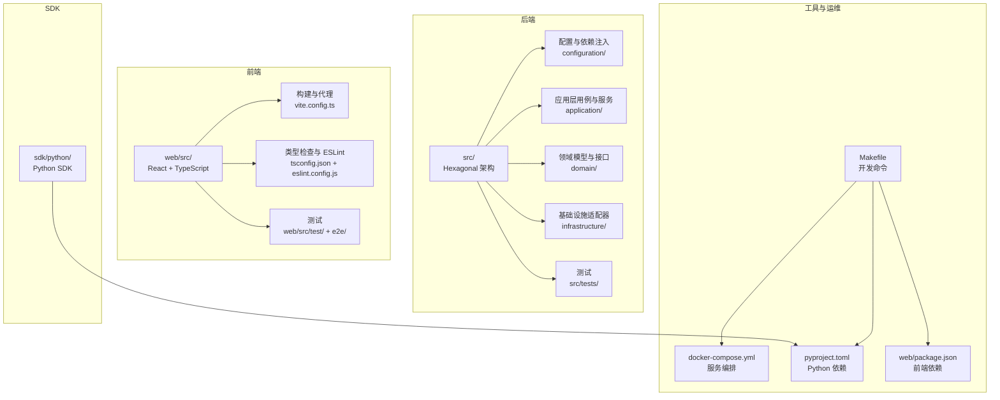
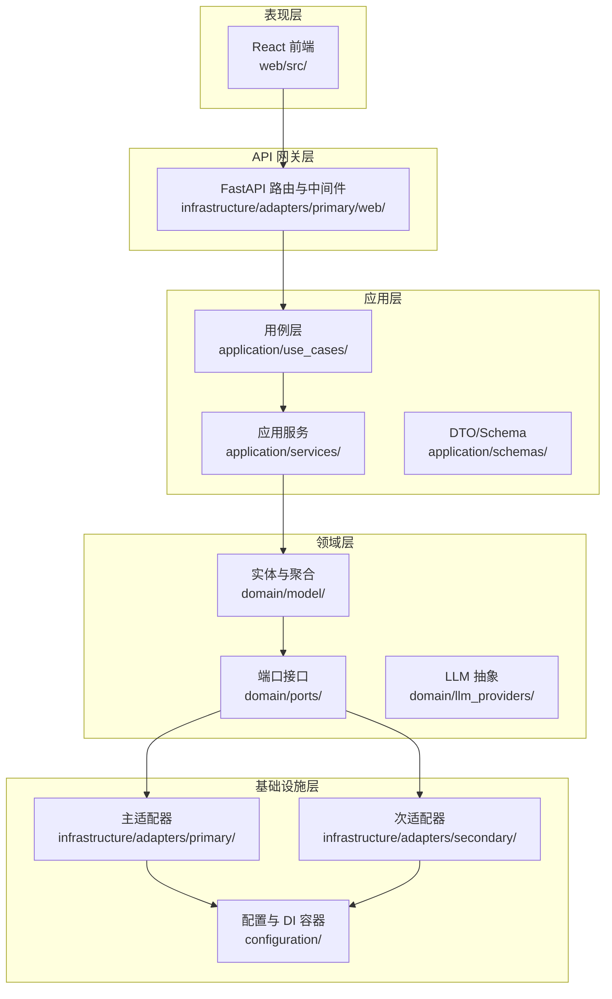
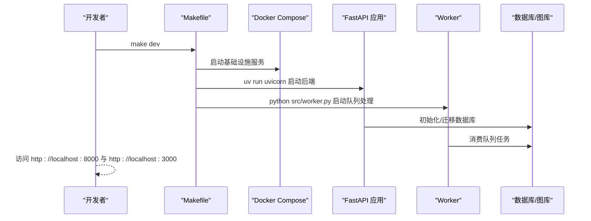
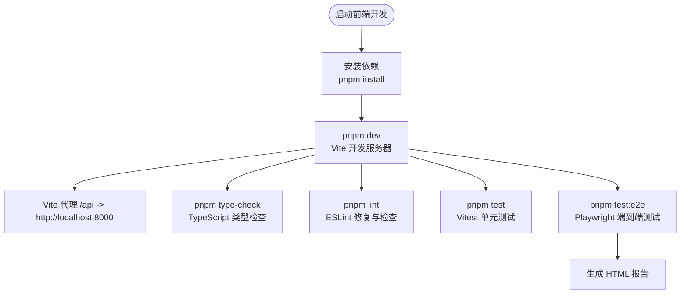
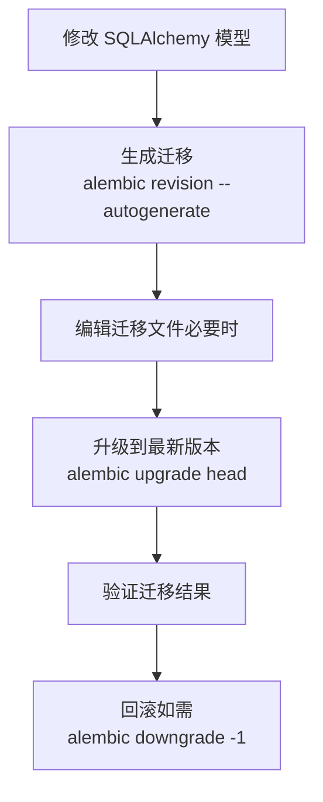
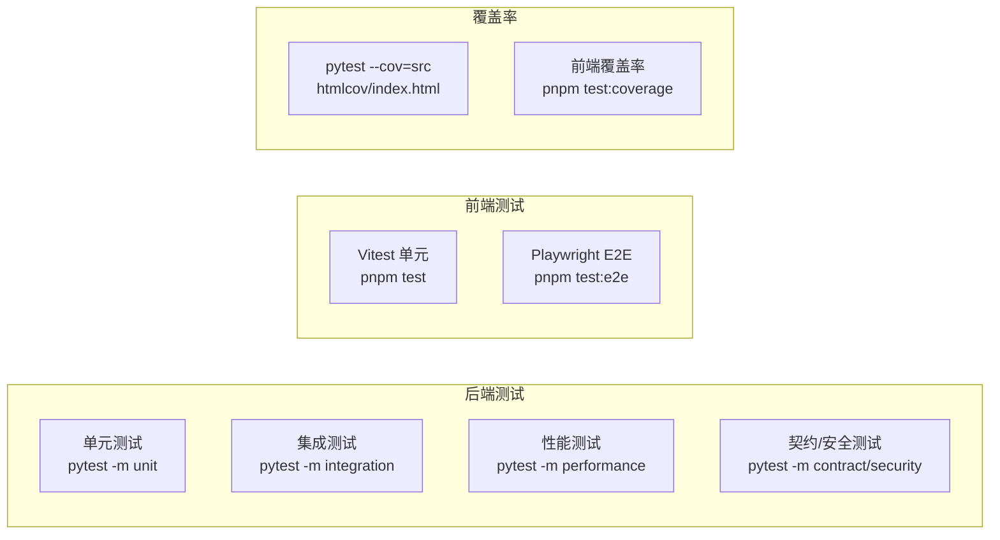
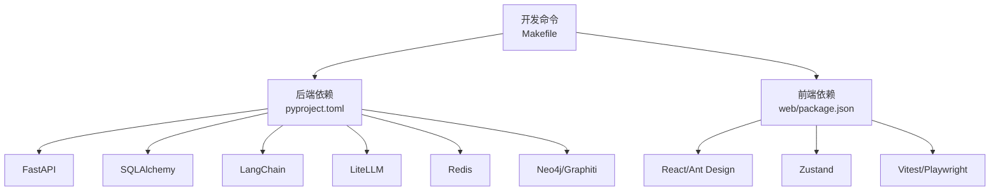

# 开发者指南

<cite>
**本文档引用的文件**
- [README.md](file://README.md)
- [CLAUDE.md](file://CLAUDE.md)
- [Makefile](file://Makefile)
- [pyproject.toml](file://pyproject.toml)
- [.env.example](file://.env.example)
- [docker-compose.yml](file://docker-compose.yml)
- [sdk/python/pyproject.toml](file://sdk/python/pyproject.toml)
- [web/package.json](file://web/package.json)
- [web/vite.config.ts](file://web/vite.config.ts)
- [web/eslint.config.js](file://web/eslint.config.js)
- [web/tsconfig.json](file://web/tsconfig.json)
- [web/playwright.config.ts](file://web/playwright.config.ts)
- [pytest.ini](file://pytest.ini)
- [src/tests/conftest.py](file://src/tests/conftest.py)
- [examples/README.md](file://examples/README.md)
- [examples/basic_usage.py](file://examples/basic_usage.py)
- [examples/sdk_usage.py](file://examples/sdk_usage.py)
</cite>

## 目录
1. [简介](#简介)
2. [项目结构](#项目结构)
3. [核心组件](#核心组件)
4. [架构总览](#架构总览)
5. [详细组件分析](#详细组件分析)
6. [依赖关系分析](#依赖关系分析)
7. [性能考虑](#性能考虑)
8. [故障排除指南](#故障排除指南)
9. [结论](#结论)
10. [附录](#附录)

## 简介
本指南面向希望参与 MemStack 项目的开发者，目标是帮助新贡献者快速上手本地开发与协作。内容涵盖：
- 开发环境搭建与 IDE 配置
- 代码规范（Python、TypeScript、文档）
- 贡献流程（提交规范、代码审查、版本发布）
- 开发工作流最佳实践（分支管理、冲突解决、测试要求）
- 开发命令与工具使用（格式化、lint、测试、数据库）
- 常见问题与调试技巧

## 项目结构
MemStack 采用前后端分离的双栈架构，后端基于 Python/FastAPI，前端基于 React/TypeScript，配合多数据库与 LLM 提供商集成。

图表来源
- [Makefile](file://Makefile#L1-L498)
- [docker-compose.yml](file://docker-compose.yml#L1-L109)
- [pyproject.toml](file://pyproject.toml#L1-L131)
- [web/package.json](file://web/package.json#L1-L72)

章节来源
- [README.md](file://README.md#L487-L526)
- [Makefile](file://Makefile#L1-L498)

## 核心组件
- 后端（Python/FastAPI）：实现多层能力模型（工具→技能→子代理→代理），支持多 LLM 提供商、知识图谱与缓存。
- 前端（React/TypeScript）：基于 Ant Design 与 Zustand，提供代理聊天、知识图谱可视化、项目与租户管理等页面。
- SDK（Python）：提供同步与异步客户端，简化外部系统集成。
- 测试体系：后端 pytest、前端 Vitest/Playwright，覆盖单元、集成、性能与端到端测试。
- 开发工具链：Ruff（格式化/检查）、MyPy（类型检查）、Alembic（数据库迁移）。

章节来源
- [README.md](file://README.md#L91-L124)
- [CLAUDE.md](file://CLAUDE.md#L112-L182)
- [pyproject.toml](file://pyproject.toml#L10-L48)
- [web/package.json](file://web/package.json#L48-L70)

## 架构总览
MemStack 采用领域驱动设计（DDD）与六边形架构（端口与适配器），严格分层并依赖倒置，保证业务逻辑与框架/数据库解耦。

图表来源
- [CLAUDE.md](file://CLAUDE.md#L112-L182)
- [README.md](file://README.md#L38-L80)

章节来源
- [CLAUDE.md](file://CLAUDE.md#L112-L182)

## 详细组件分析

### 后端开发环境与启动
- 依赖安装：推荐使用 uv，一键安装后端与前端依赖。
- 本地启动：通过 Makefile 提供统一入口，支持启动 API、Worker、前端与基础设施服务。
- Docker 编排：使用 docker-compose 启动 Neo4j、PostgreSQL、Redis、Prometheus、Grafana。

图表来源
- [Makefile](file://Makefile#L121-L172)
- [docker-compose.yml](file://docker-compose.yml#L1-L109)

章节来源
- [README.md](file://README.md#L125-L200)
- [Makefile](file://Makefile#L121-L172)
- [docker-compose.yml](file://docker-compose.yml#L1-L109)

### 前端开发环境与调试
- 开发服务器：Vite 提供热重载与代理，将 /api 请求转发至后端。
- 类型检查与 ESLint：TS 配置启用严格模式；ESLint 规则限制未使用变量等。
- E2E 测试：Playwright 配置自动启动前端并在失败时生成报告。

图表来源
- [web/package.json](file://web/package.json#L6-L16)
- [web/vite.config.ts](file://web/vite.config.ts#L16-L25)
- [web/eslint.config.js](file://web/eslint.config.js#L20-L35)
- [web/tsconfig.json](file://web/tsconfig.json#L20-L24)
- [web/playwright.config.ts](file://web/playwright.config.ts#L42-L48)

章节来源
- [web/package.json](file://web/package.json#L6-L16)
- [web/vite.config.ts](file://web/vite.config.ts#L16-L25)
- [web/eslint.config.js](file://web/eslint.config.js#L20-L35)
- [web/tsconfig.json](file://web/tsconfig.json#L20-L24)
- [web/playwright.config.ts](file://web/playwright.config.ts#L42-L48)

### 数据库与迁移
- 初始化：创建数据库、执行模式初始化、可选初始化默认数据。
- 迁移：使用 Alembic 自动生成与升级，遵循“从模型到迁移”的流程。
- 命令：提供 db-init、db-migrate、db-reset、db-shell 等常用命令。

图表来源
- [CLAUDE.md](file://CLAUDE.md#L540-L595)
- [Makefile](file://Makefile#L271-L318)

章节来源
- [CLAUDE.md](file://CLAUDE.md#L540-L595)
- [Makefile](file://Makefile#L271-L318)

### 测试策略与覆盖率
- 后端：pytest 标记（unit/integration/performance/contract/security），默认排除 performance。
- 前端：Vitest 单测 + Playwright E2E，支持覆盖率。
- 覆盖率目标：整体 80%+。

图表来源
- [pytest.ini](file://pytest.ini#L8-L21)
- [web/package.json](file://web/package.json#L12-L15)
- [Makefile](file://Makefile#L204-L207)

章节来源
- [pytest.ini](file://pytest.ini#L8-L21)
- [web/package.json](file://web/package.json#L12-L15)
- [Makefile](file://Makefile#L204-L207)

### SDK 使用示例
- Python SDK：提供同步与异步客户端，支持健康检查、创建 Episode、搜索记忆等。
- 示例脚本：examples/ 下包含基础用法与 SDK 使用示例。

章节来源
- [examples/README.md](file://examples/README.md#L1-L63)
- [examples/basic_usage.py](file://examples/basic_usage.py#L1-L107)
- [examples/sdk_usage.py](file://examples/sdk_usage.py#L1-L98)
- [sdk/python/pyproject.toml](file://sdk/python/pyproject.toml#L22-L25)

## 依赖关系分析
- Python 依赖：后端核心库、数据库 ORM、LLM 客户端、监控与队列等。
- 前端依赖：React 生态、Ant Design、Zustand、图表与国际化等。
- 开发工具：Ruff、MyPy、Alembic、Vite、ESLint、Playwright 等。

图表来源
- [pyproject.toml](file://pyproject.toml#L10-L48)
- [web/package.json](file://web/package.json#L48-L70)
- [Makefile](file://Makefile#L101-L115)

章节来源
- [pyproject.toml](file://pyproject.toml#L10-L48)
- [web/package.json](file://web/package.json#L48-L70)
- [Makefile](file://Makefile#L101-L115)

## 性能考虑
- 并发与连接池：PostgreSQL 连接池参数（大小、溢出、回收）与 Redis 内存策略。
- LLM 缓存与超时：可配置 LLM 缓存 TTL 与请求超时。
- 图查询优化：Neo4j 堆与页缓存配置，Graphiti 并发限制。
- 监控与可观测性：Prometheus/Grafana、OpenTelemetry。

章节来源
- [.env.example](file://.env.example#L39-L43)
- [.env.example](file://.env.example#L128-L132)
- [.env.example](file://.env.example#L122-L126)
- [.env.example](file://.env.example#L133-L141)

## 故障排除指南
- 服务启动失败
  - 检查 Docker 服务是否正常，端口占用情况。
  - 查看日志：make dev-logs 或 docker-compose logs -f。
- 数据库迁移异常
  - 确认 Alembic 版本表存在；必要时手动 stamp 或删除重建。
  - 使用测试数据库验证迁移升级/降级。
- 前端代理无效
  - 确认 Vite 代理配置与环境变量 VITE_API_URL。
  - 清理 node_modules 缓存后重新安装依赖。
- 测试失败
  - 后端：使用 pytest -v --tb=short 定位；关注标记选择与忽略项。
  - 前端：Playwright 超时可适当增大 actionTimeout；CI 环境禁用并行。

章节来源
- [Makefile](file://Makefile#L149-L151)
- [CLAUDE.md](file://CLAUDE.md#L735-L756)
- [web/vite.config.ts](file://web/vite.config.ts#L19-L24)
- [pytest.ini](file://pytest.ini#L15-L21)
- [web/playwright.config.ts](file://web/playwright.config.ts#L12-L28)

## 结论
本指南提供了 MemStack 从环境搭建到日常开发、测试与运维的完整路径。建议新贡献者先完成环境准备与基础命令熟悉，再逐步深入架构与核心模块，最后结合测试与工具链形成稳定的工作流。

## 附录

### 开发环境搭建步骤
- 克隆仓库并安装依赖
  - 后端：uv sync --extra dev --extra neo4j --extra evaluation
  - 前端：cd web && pnpm install
- 配置环境变量：cp .env.example .env，并按需填写数据库、Redis、LLM 提供商密钥。
- 启动基础设施与服务：make dev-infra 与 make dev。
- 访问 API 文档与前端界面：http://localhost:8000/docs 与 http://localhost:3000。

章节来源
- [README.md](file://README.md#L135-L200)
- [.env.example](file://.env.example#L1-L158)
- [Makefile](file://Makefile#L165-L172)

### 代码规范与质量工具
- Python
  - 格式化：ruff --fix + ruff format
  - 检查：ruff check + mypy（忽略缺失导入）
  - 依赖：pyproject.toml 中 black、ruff、mypy 配置
- TypeScript
  - 格式化/检查：pnpm lint（含 --fix）
  - 类型检查：pnpm type-check
  - 依赖：web/package.json 中 ESLint、TS 配置
- 文档与示例
  - examples/ 提供 API 与 SDK 使用示例，便于快速验证。

章节来源
- [pyproject.toml](file://pyproject.toml#L82-L106)
- [web/package.json](file://web/package.json#L21-L47)
- [web/eslint.config.js](file://web/eslint.config.js#L20-L35)
- [web/tsconfig.json](file://web/tsconfig.json#L20-L24)
- [examples/README.md](file://examples/README.md#L1-L63)

### 贡献流程与最佳实践
- 分支管理
  - 建议基于 main 新建特性分支，命名如 feature/amazing-feature。
  - 提交前执行 make check（格式化 + lint + 测试）。
- 代码审查
  - 保持小步提交，清晰的提交信息与变更说明。
  - 关注测试覆盖率与性能标记测试。
- 版本发布
  - 变更记录与版本号更新遵循项目约定（如 CLAUDE.md 中的 OpenSpec 工作流）。

章节来源
- [README.md](file://README.md#L528-L547)
- [CLAUDE.md](file://CLAUDE.md#L757-L768)

### 开发命令速查
- 安装与更新：make install / make update
- 启动服务：make dev / make dev-backend / make dev-web / make dev-worker / make dev-infra
- 测试：make test / make test-unit / make test-integration / make test-coverage / make test-e2e
- 代码质量：make format / make lint / make type-check
- 数据库：make db-init / make db-migrate / make db-reset / make db-shell
- Docker：make docker-up / make docker-down / make docker-logs
- SDK：make sdk-install / make sdk-test / make sdk-build

章节来源
- [README.md](file://README.md#L318-L358)
- [Makefile](file://Makefile#L20-L91)