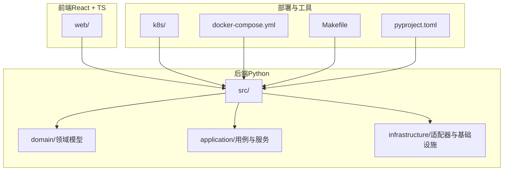
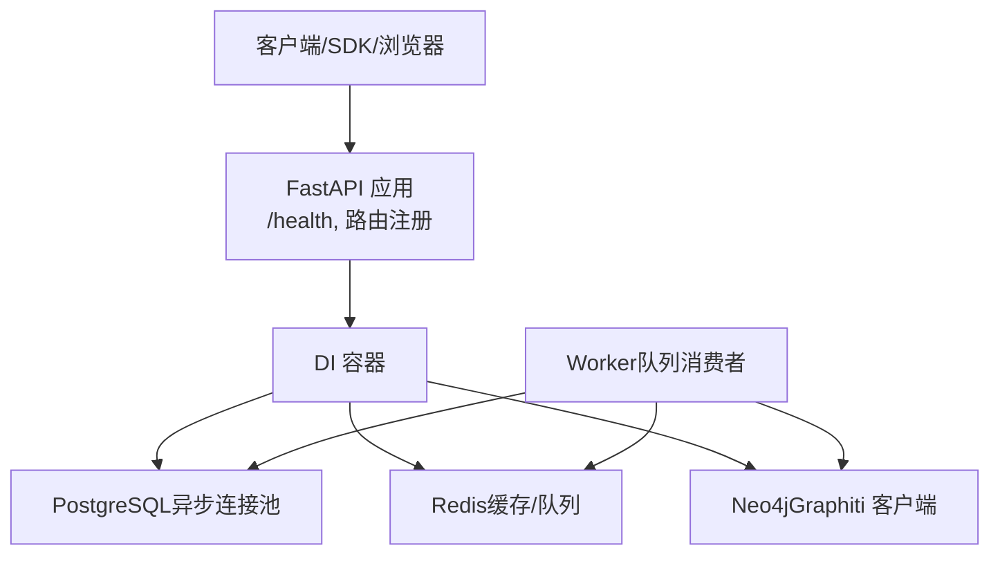
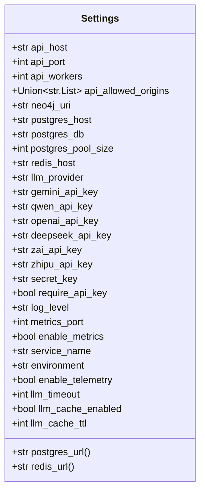
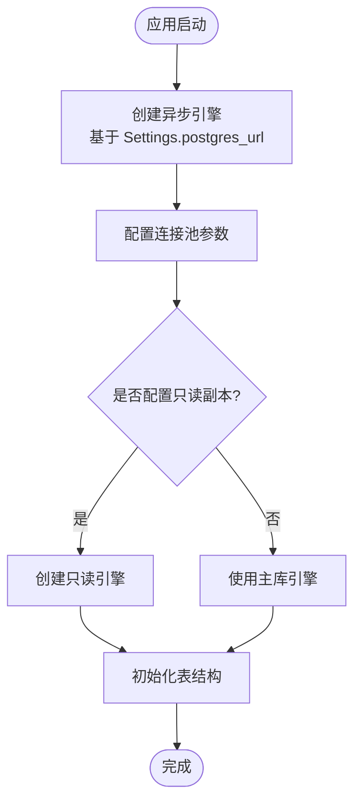
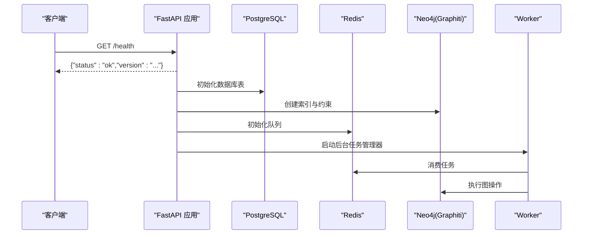
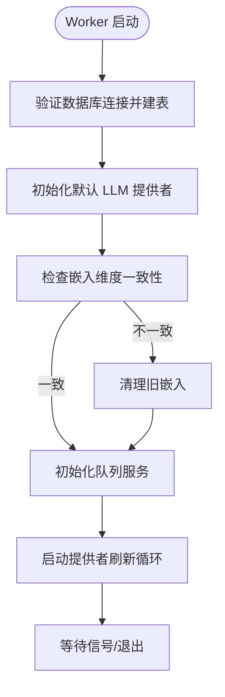
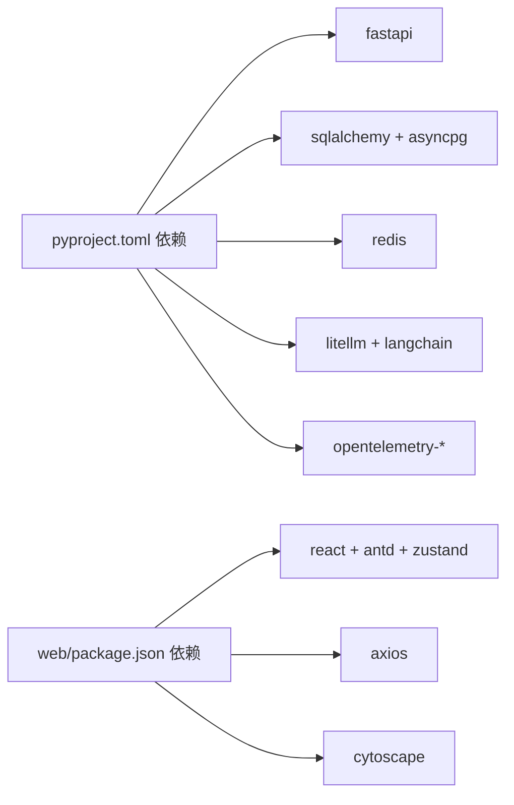
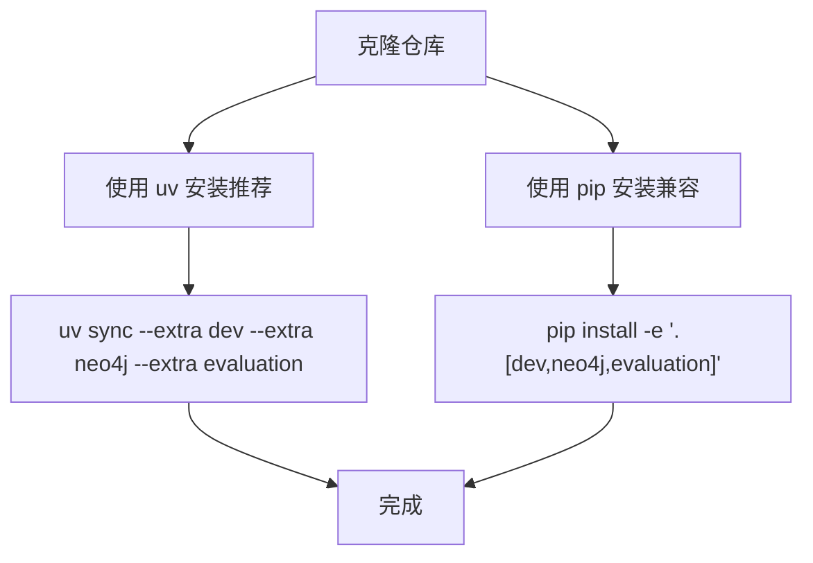
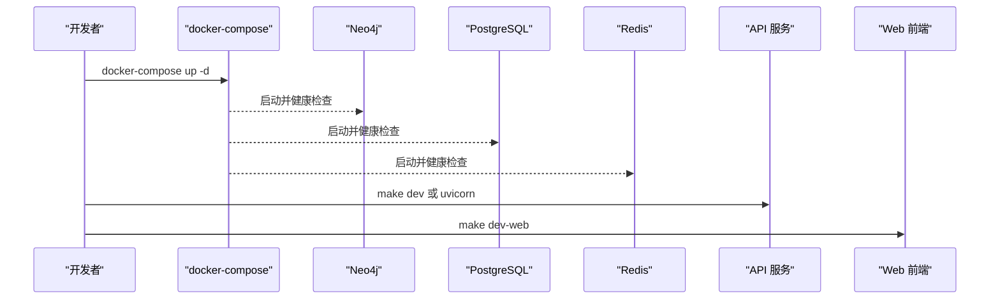
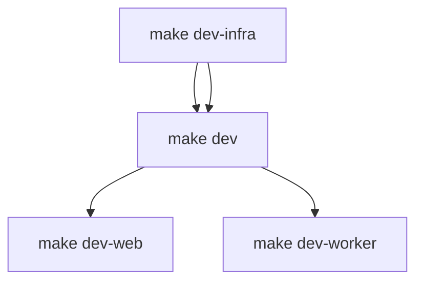

# 快速开始

<cite>
**本文引用的文件**
- [README.md](file://README.md)
- [docker-compose.yml](file://docker-compose.yml)
- [.env.example](file://.env.example)
- [pyproject.toml](file://pyproject.toml)
- [Makefile](file://Makefile)
- [src/configuration/config.py](file://src/configuration/config.py)
- [src/infrastructure/adapters/primary/web/main.py](file://src/infrastructure/adapters/primary/web/main.py)
- [src/infrastructure/adapters/secondary/persistence/database.py](file://src/infrastructure/adapters/secondary/persistence/database.py)
- [src/worker.py](file://src/worker.py)
- [k8s/api-deployment.yaml](file://k8s/api-deployment.yaml)
- [web/package.json](file://web/package.json)
</cite>

## 目录
1. [简介](#简介)
2. [系统要求](#系统要求)
3. [项目结构](#项目结构)
4. [核心组件](#核心组件)
5. [架构总览](#架构总览)
6. [详细组件解析](#详细组件解析)
7. [依赖关系分析](#依赖关系分析)
8. [性能与并发](#性能与并发)
9. [安装与启动](#安装与启动)
10. [环境变量配置](#环境变量配置)
11. [健康检查与基础验证](#健康检查与基础验证)
12. [故障排除](#故障排除)
13. [结论](#结论)

## 简介
MemStack 是一个面向企业的人工智能代理平台，采用渐进式能力组合架构，支持从工具层到代理层的多层级协作。本“快速开始”旨在帮助你在最短时间内完成安装、配置与启动，涵盖依赖安装、环境变量、两种启动方式（Docker Compose 与本地开发）、健康检查与常见问题排查。

## 系统要求
- Python：3.10 及以上
- Node.js：18 及以上（用于前端开发）
- Neo4j：5.26 及以上（知识图谱）
- PostgreSQL：16 及以上（元数据存储）
- Redis：7 及以上（缓存）
- LLM 提供商：Google Gemini、阿里 Qwen、Deepseek、智谱 ZhipuAI、OpenAI 等之一或多个

章节来源
- file://README.md#L127-L134

## 项目结构
仓库采用分层架构（领域驱动设计 + 六边形架构）：
- 后端（Python）：src/ 下按领域层、应用层、基础设施层组织
- 前端（React + TypeScript）：web/ 下的页面、组件、状态与服务
- 部署与运维：k8s/、Makefile、docker-compose.yml、pyproject.toml 等

图表来源
- [README.md](file://README.md#L487-L526)

章节来源
- file://README.md#L487-L526

## 核心组件
- 配置管理：通过 Pydantic Settings 从 .env 读取并校验环境变量，统一暴露给各模块
- 数据库：PostgreSQL 异步连接池，支持只读副本
- 缓存：Redis 连接与队列（用于任务处理）
- 图数据库：Neo4j（Graphiti 客户端封装）
- API 服务：FastAPI 应用，包含健康检查、CORS、限流等中间件
- 工作进程：独立的队列消费者，负责后台任务与 LLM 提供者刷新

章节来源
- file://src/configuration/config.py#L10-L231
- file://src/infrastructure/adapters/secondary/persistence/database.py#L10-L48
- file://src/infrastructure/adapters/primary/web/main.py#L240-L243
- file://src/worker.py#L146-L249

## 架构总览
MemStack 采用分层架构，前后端分离，后端以 FastAPI 为入口，通过依赖注入容器装配各适配器；工作进程独立运行，负责后台任务与图数据库交互。

图表来源
- [src/infrastructure/adapters/primary/web/main.py](file://src/infrastructure/adapters/primary/web/main.py#L135-L276)
- [src/worker.py](file://src/worker.py#L146-L249)

章节来源
- file://src/infrastructure/adapters/primary/web/main.py#L135-L276
- file://src/worker.py#L146-L249

## 详细组件解析

### 配置加载与校验（Settings）
- 支持从 .env 读取键值，自动映射到字段别名（如 NEO4J_URI → neo4j_uri）
- 提供 PostgreSQL、Redis、LLM 提供商、日志、指标、限流等配置项
- 自动选择默认 LLM 提供商（若未显式指定且存在可用密钥）

图表来源
- [src/configuration/config.py](file://src/configuration/config.py#L10-L231)

章节来源
- file://src/configuration/config.py#L10-L231

### 数据库初始化与连接池
- 使用 SQLAlchemy 异步引擎与连接池参数（pool_size、max_overflow、pool_recycle、pool_pre_ping）
- 支持可选只读副本（read replica）
- 在应用启动时创建表结构

图表来源
- [src/infrastructure/adapters/secondary/persistence/database.py](file://src/infrastructure/adapters/secondary/persistence/database.py#L10-L98)

章节来源
- file://src/infrastructure/adapters/secondary/persistence/database.py#L10-L98

### API 服务与健康检查
- FastAPI 应用在 lifespan 中完成数据库初始化、默认凭据初始化、Graphiti 客户端构建索引、队列与后台任务初始化
- 暴露 /health 健康检查端点
- 注册各类业务路由（认证、租户、项目、记忆、检索、任务、工具、技能、子代理等）

图表来源
- [src/infrastructure/adapters/primary/web/main.py](file://src/infrastructure/adapters/primary/web/main.py#L53-L133)
- [src/infrastructure/adapters/primary/web/main.py](file://src/infrastructure/adapters/primary/web/main.py#L240-L243)

章节来源
- file://src/infrastructure/adapters/primary/web/main.py#L53-L133
- file://src/infrastructure/adapters/primary/web/main.py#L240-L243

### 工作进程（Worker）
- 独立进程，负责后台任务、队列消费、LLM 提供者配置刷新
- 启动时进行嵌入维度一致性检查，必要时清理旧嵌入
- 支持信号优雅关闭与任务取消

图表来源
- [src/worker.py](file://src/worker.py#L146-L249)

章节来源
- file://src/worker.py#L146-L249

## 依赖关系分析
- 后端依赖：FastAPI、SQLAlchemy、Redis、Neo4j、LiteLLM、LangChain、OpenTelemetry、Playwright、Tavily 等
- 前端依赖：React、Ant Design、Zustand、Axios、Chart.js、Cytoscape 等
- 开发工具：uv（推荐）、pytest、ruff、mypy、vite、playwright 等

图表来源
- [pyproject.toml](file://pyproject.toml#L10-L48)
- [web/package.json](file://web/package.json#L48-L70)

章节来源
- file://pyproject.toml#L10-L48
- file://web/package.json#L48-L70

## 性能与并发
- PostgreSQL 连接池：高并发场景下建议调优 pool_size、max_overflow、pool_recycle、pool_pre_ping
- Neo4j：Graphiti 客户端内置超时保护，构建索引/约束时有总超时控制
- Worker 并发：通过 MAX_ASYNC_WORKERS 控制异步并发度
- LLM 缓存：可启用 LLM_CACHE_ENABLED 与 TTL，降低重复请求成本

章节来源
- file://src/infrastructure/adapters/secondary/persistence/database.py#L10-L24
- file://src/infrastructure/adapters/primary/web/main.py#L82-L97
- file://src/configuration/config.py#L160-L175

## 安装与启动

### 依赖安装
- 推荐使用 uv（更快的包管理器）
- 或使用 pip 安装开发与可选依赖（dev、neo4j、evaluation）

图表来源
- [README.md](file://README.md#L135-L147)
- [Makefile](file://Makefile#L101-L115)

章节来源
- file://README.md#L135-L147
- file://Makefile#L101-L115

### 启动方式一：Docker Compose（推荐）
- 一键启动：Neo4j、PostgreSQL、Redis、Prometheus、Grafana
- 后端与前端分别通过 Makefile 或直接运行

图表来源
- [docker-compose.yml](file://docker-compose.yml#L1-L109)
- [Makefile](file://Makefile#L121-L172)

章节来源
- file://docker-compose.yml#L1-L109
- file://Makefile#L121-L172

### 启动方式二：本地开发
- 使用 Makefile 管理开发流程：启动基础设施、API、Worker、Web
- 也可单独启动 API/Worker/Web

图表来源
- [Makefile](file://Makefile#L165-L172)
- [Makefile](file://Makefile#L121-L172)

章节来源
- file://Makefile#L165-L172
- file://Makefile#L121-L172

## 环境变量配置
复制示例环境文件并编辑以下关键项：
- Neo4j：NEO4J_URI、NEO4J_USER、NEO4J_PASSWORD
- PostgreSQL：POSTGRES_HOST、POSTGRES_PORT、POSTGRES_DB、POSTGRES_USER、POSTGRES_PASSWORD
- Redis：REDIS_HOST、REDIS_PORT（可选 REDIS_PASSWORD）
- LLM 提供商：LLM_PROVIDER 与对应 API Key（如 GEMINI_API_KEY、DASHSCOPE_API_KEY、OPENAI_API_KEY、DEEPSEEK_API_KEY、ZAI_API_KEY）
- 其他：CORS 允许域、安全密钥、日志级别、指标开关、缓存 TTL、Web 搜索与抓取参数等

章节来源
- file://.env.example#L1-L158
- file://src/configuration/config.py#L10-L231

## 健康检查与基础验证
- 健康检查：访问 http://localhost:8000/health
- 文档：访问 http://localhost:8000/docs 查看 API 文档
- 开发模式默认 API Key：服务启动日志中会打印默认 API Key（格式 ms_sk_ 前缀 + 64 十六进制字符）

章节来源
- file://src/infrastructure/adapters/primary/web/main.py#L240-L243
- file://README.md#L187-L200

## 故障排除
- Docker 服务未就绪：查看 docker-compose 日志，确认 Neo4j、PostgreSQL、Redis 健康检查通过
- API 启动失败：检查 .env 配置与数据库连接字符串；查看 API 日志定位异常
- Worker 初始化错误：关注嵌入维度不一致导致的清理逻辑；确认 LLM 提供商密钥有效
- 前端无法连接后端：确认 VITE_API_URL 指向正确地址（默认 http://localhost:8000/api/v1）
- Kubernetes 部署：使用 k8s/api-deployment.yaml，注意 /health 与 /ready 探针配置

章节来源
- file://docker-compose.yml#L20-L82
- file://src/worker.py#L178-L218
- file://k8s/api-deployment.yaml#L85-L100

## 结论
通过本快速开始指南，你可以在本地或容器环境中快速拉起 MemStack 的后端 API、工作进程与前端界面，并完成健康检查与基础验证。建议在生产环境中完善密钥管理、只读副本、监控告警与资源配额策略。