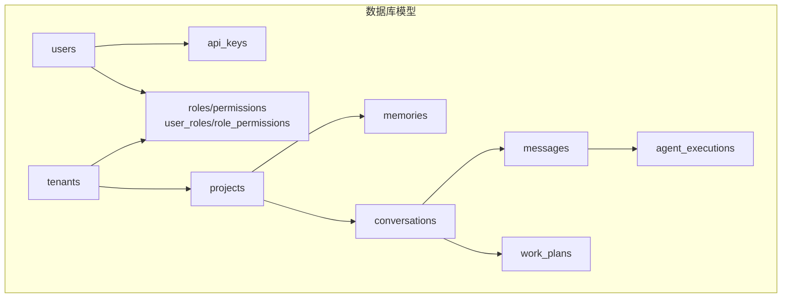
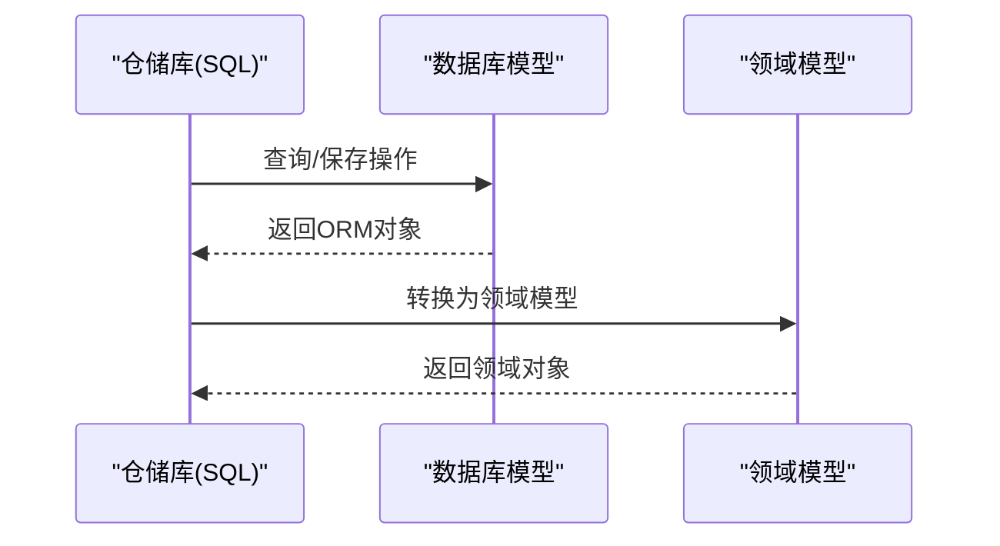
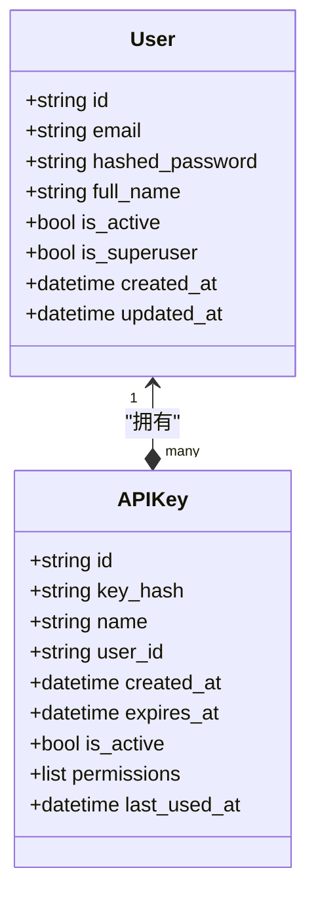
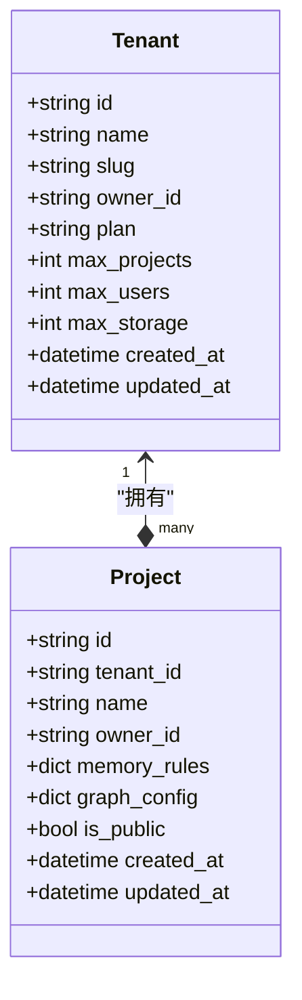
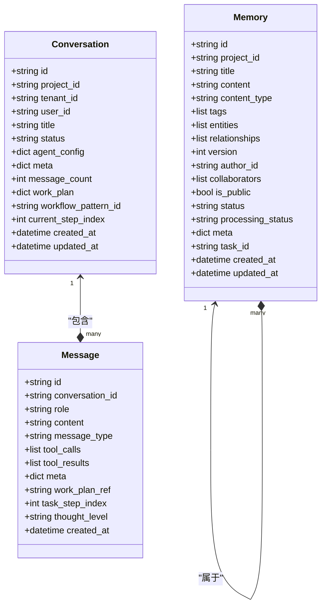
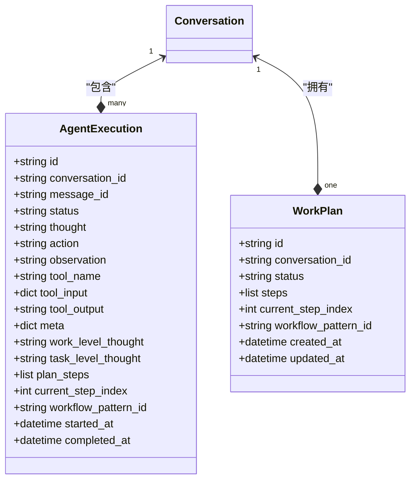
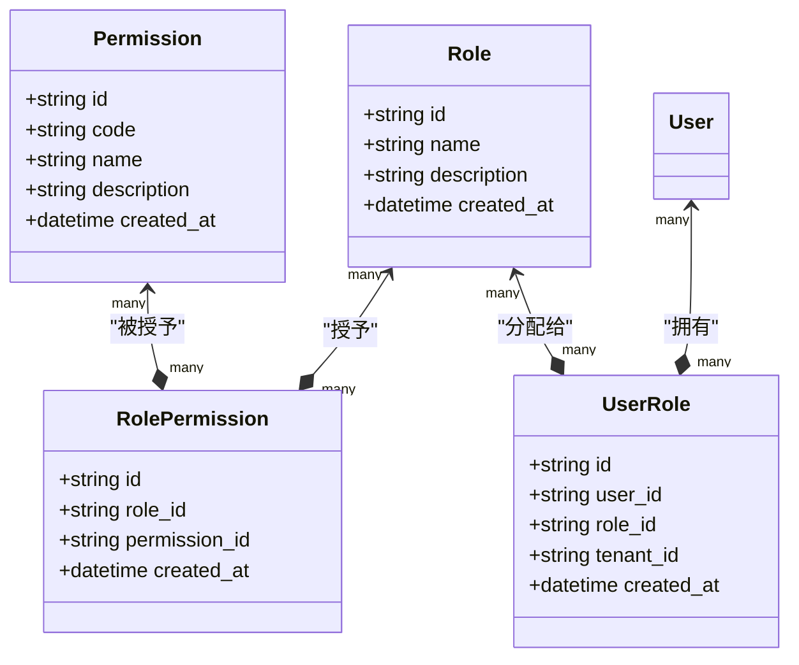
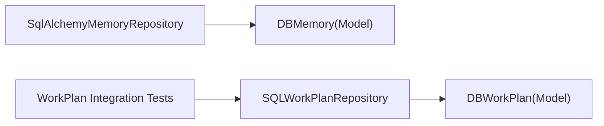

# PostgreSQL 关系型数据库设计

<cite>
**本文档引用的文件**
- [models.py](file://src/infrastructure/adapters/secondary/persistence/models.py)
- [sql_memory_repository.py](file://src/infrastructure/adapters/secondary/persistence/sql_memory_repository.py)
- [sql_work_plan_repository.py](file://src/infrastructure/adapters/secondary/persistence/sql_work_plan_repository.py)
- [test_work_plan_integration.py](file://src/tests/integration/infrastructure/adapters/test_work_plan_integration.py)
- [AGENTS.md](file://AGENTS.md)
- [qwen_client.py](file://src/infrastructure/llm/qwen/qwen_client.py)
</cite>

## 目录
1. [简介](#简介)
2. [项目结构](#项目结构)
3. [核心组件](#核心组件)
4. [架构总览](#架构总览)
5. [详细组件分析](#详细组件分析)
6. [依赖分析](#依赖分析)
7. [性能考虑](#性能考虑)
8. [故障排除指南](#故障排除指南)
9. [结论](#结论)

## 简介
本文件面向 MemStack 的 PostgreSQL 关系型数据库设计，系统性梳理并解释核心数据模型与实现细节。重点覆盖以下关键表结构：用户与认证（users、api_keys）、项目与租户（projects、tenants）、记忆与对话（memories、conversations、messages）、代理执行记录（agent_executions、work_plans）以及权限与角色相关表（roles、permissions、user_roles、role_permissions）。文档同时阐述表间关系、JSON 字段使用模式、索引策略与性能优化建议，并提供可视化图表帮助理解。

## 项目结构
MemStack 的数据库层采用 SQLAlchemy ORM 映射，模型集中定义在持久化适配器中，配合仓储库进行数据访问。核心目录与文件如下：
- 模型定义：`src/infrastructure/adapters/secondary/persistence/models.py`
- 记忆仓储实现：`src/infrastructure/adapters/secondary/persistence/sql_memory_repository.py`
- 工作计划仓储实现：`src/infrastructure/adapters/secondary/persistence/sql_work_plan_repository.py`
- 数据库模式说明：`AGENTS.md`
- JSON 序列化与清洗示例：`src/infrastructure/llm/qwen/qwen_client.py`

**图表来源**
- [models.py](file://src/infrastructure/adapters/secondary/persistence/models.py#L36-L71)
- [models.py](file://src/infrastructure/adapters/secondary/persistence/models.py#L130-L144)
- [models.py](file://src/infrastructure/adapters/secondary/persistence/models.py#L146-L228)
- [models.py](file://src/infrastructure/adapters/secondary/persistence/models.py#L177-L214)
- [models.py](file://src/infrastructure/adapters/secondary/persistence/models.py#L244-L272)
- [models.py](file://src/infrastructure/adapters/secondary/persistence/models.py#L449-L510)
- [models.py](file://src/infrastructure/adapters/secondary/persistence/models.py#L512-L542)
- [models.py](file://src/infrastructure/adapters/secondary/persistence/models.py#L544-L564)

**章节来源**
- [models.py](file://src/infrastructure/adapters/secondary/persistence/models.py#L36-L71)
- [models.py](file://src/infrastructure/adapters/secondary/persistence/models.py#L130-L144)
- [models.py](file://src/infrastructure/adapters/secondary/persistence/models.py#L146-L228)
- [models.py](file://src/infrastructure/adapters/secondary/persistence/models.py#L177-L214)
- [models.py](file://src/infrastructure/adapters/secondary/persistence/models.py#L244-L272)
- [models.py](file://src/infrastructure/adapters/secondary/persistence/models.py#L449-L510)
- [models.py](file://src/infrastructure/adapters/secondary/persistence/models.py#L512-L542)
- [models.py](file://src/infrastructure/adapters/secondary/persistence/models.py#L544-L564)

## 核心组件
本节从领域驱动设计角度，分层解析核心实体及其职责：
- 用户与认证：管理用户身份、API 密钥与权限角色
- 租户与项目：实现多租户隔离与项目级资源管理
- 记忆与知识：存储文本内容、实体关系与元数据
- 对话与代理：记录多轮对话、消息与代理执行轨迹
- 工作计划与模式：支持多层级思维与工作流模式复用

**章节来源**
- [models.py](file://src/infrastructure/adapters/secondary/persistence/models.py#L36-L71)
- [models.py](file://src/infrastructure/adapters/secondary/persistence/models.py#L130-L144)
- [models.py](file://src/infrastructure/adapters/secondary/persistence/models.py#L146-L228)
- [models.py](file://src/infrastructure/adapters/secondary/persistence/models.py#L177-L214)
- [models.py](file://src/infrastructure/adapters/secondary/persistence/models.py#L244-L272)
- [models.py](file://src/infrastructure/adapters/secondary/persistence/models.py#L449-L510)
- [models.py](file://src/infrastructure/adapters/secondary/persistence/models.py#L512-L542)
- [models.py](file://src/infrastructure/adapters/secondary/persistence/models.py#L544-L564)

## 架构总览
下图展示数据库层与应用层的交互关系，强调仓储库对模型的封装与查询组织。

**图表来源**
- [sql_memory_repository.py](file://src/infrastructure/adapters/secondary/persistence/sql_memory_repository.py#L18-L114)
- [models.py](file://src/infrastructure/adapters/secondary/persistence/models.py#L244-L272)

**章节来源**
- [sql_memory_repository.py](file://src/infrastructure/adapters/secondary/persistence/sql_memory_repository.py#L18-L114)
- [models.py](file://src/infrastructure/adapters/secondary/persistence/models.py#L244-L272)

## 详细组件分析

### 用户与认证表（users、api_keys）
- users 表
  - 主键：id（字符串）
  - 关键字段：email（唯一且带索引）、hashed_password、full_name、is_active、is_superuser、created_at、updated_at
  - 关系：与 api_keys、tenants、projects、memories、owned_tenants、owned_projects、roles 多对多/一对多关联
- api_keys 表
  - 主键：id（字符串）
  - 关键字段：key_hash（索引）、name、user_id（外键）、expires_at、is_active、permissions（JSON 数组）、last_used_at
  - 关系：与 users 反向关联

**图表来源**
- [models.py](file://src/infrastructure/adapters/secondary/persistence/models.py#L36-L71)
- [models.py](file://src/infrastructure/adapters/secondary/persistence/models.py#L130-L144)

**章节来源**
- [models.py](file://src/infrastructure/adapters/secondary/persistence/models.py#L36-L71)
- [models.py](file://src/infrastructure/adapters/secondary/persistence/models.py#L130-L144)

### 项目与租户表（projects、tenants）
- tenants 表
  - 主键：id（字符串）
  - 关键字段：name、slug（唯一且带索引）、description、owner_id（外键）、plan、max_projects、max_users、max_storage、created_at、updated_at
  - 关系：与 users（owned_tenants）、projects（projects）一对多
- projects 表
  - 主键：id（字符串）
  - 关键字段：tenant_id（外键）、name、description、owner_id（外键）、memory_rules/ graph_config（JSON）、is_public、created_at、updated_at
  - 关系：与 tenants（tenant）、users（owner）、memories、entity_types、edge_types、edge_maps 多对多/一对多

**图表来源**
- [models.py](file://src/infrastructure/adapters/secondary/persistence/models.py#L146-L175)
- [models.py](file://src/infrastructure/adapters/secondary/persistence/models.py#L177-L214)

**章节来源**
- [models.py](file://src/infrastructure/adapters/secondary/persistence/models.py#L146-L175)
- [models.py](file://src/infrastructure/adapters/secondary/persistence/models.py#L177-L214)

### 记忆与对话表（memories、conversations、messages）
- memories 表
  - 主键：id（字符串）
  - 关键字段：project_id（外键）、title、content（Text）、content_type、tags（JSON 数组）、entities/relationships/collaborators/meta（JSON 数组/对象）、version、author_id（外键）、is_public、status、processing_status、task_id、created_at、updated_at
  - 关系：与 projects、users 多对一
- conversations 表
  - 主键：id（字符串）
  - 关键字段：project_id、tenant_id、user_id（外键）、title、status、agent_config/meta/work_plan（JSON 对象）、message_count、workflow_pattern_id、current_step_index、created_at、updated_at
  - 关系：与 projects、tenants、users 多对一；与 messages、active_work_plan 一对多
- messages 表
  - 主键：id（字符串）
  - 关键字段：conversation_id（外键）、role、content（Text）、message_type、tool_calls/tool_results/meta（JSON 数组/对象）、created_at；多级思维扩展字段 work_plan_ref、task_step_index、thought_level
  - 关系：与 conversations、agent_executions 多对一/一对多

**图表来源**
- [models.py](file://src/infrastructure/adapters/secondary/persistence/models.py#L244-L272)
- [models.py](file://src/infrastructure/adapters/secondary/persistence/models.py#L449-L510)
- [models.py](file://src/infrastructure/adapters/secondary/persistence/models.py#L484-L510)

**章节来源**
- [models.py](file://src/infrastructure/adapters/secondary/persistence/models.py#L244-L272)
- [models.py](file://src/infrastructure/adapters/secondary/persistence/models.py#L449-L510)
- [models.py](file://src/infrastructure/adapters/secondary/persistence/models.py#L484-L510)

### 代理执行记录与工作计划（agent_executions、work_plans）
- agent_executions 表
  - 主键：id（字符串）
  - 关键字段：conversation_id、message_id（外键）、status、thought/action/observation/tool_name/tool_input/tool_output/meta（JSON 对象）、started_at、completed_at；多级思维扩展字段 work_level_thought、task_level_thought、plan_steps（JSON 数组）、current_step_index、workflow_pattern_id
  - 关系：与 conversations、messages 多对一
- work_plans 表
  - 主键：id（字符串）
  - 关键字段：conversation_id（外键）、status、steps（JSON 数组）、current_step_index、workflow_pattern_id、created_at、updated_at
  - 关系：与 conversations 一对多

**图表来源**
- [models.py](file://src/infrastructure/adapters/secondary/persistence/models.py#L512-L542)
- [models.py](file://src/infrastructure/adapters/secondary/persistence/models.py#L544-L564)

**章节来源**
- [models.py](file://src/infrastructure/adapters/secondary/persistence/models.py#L512-L542)
- [models.py](file://src/infrastructure/adapters/secondary/persistence/models.py#L544-L564)

### 权限与角色（roles、permissions、user_roles、role_permissions）
- roles 表：角色定义，含唯一 name 与索引
- permissions 表：权限代码（唯一且索引），用于细粒度授权
- user_roles 表：用户-角色映射，可按租户限定作用域
- role_permissions 表：角色-权限映射

**图表来源**
- [models.py](file://src/infrastructure/adapters/secondary/persistence/models.py#L73-L86)
- [models.py](file://src/infrastructure/adapters/secondary/persistence/models.py#L89-L101)
- [models.py](file://src/infrastructure/adapters/secondary/persistence/models.py#L115-L128)
- [models.py](file://src/infrastructure/adapters/secondary/persistence/models.py#L103-L113)

**章节来源**
- [models.py](file://src/infrastructure/adapters/secondary/persistence/models.py#L73-L86)
- [models.py](file://src/infrastructure/adapters/secondary/persistence/models.py#L89-L101)
- [models.py](file://src/infrastructure/adapters/secondary/persistence/models.py#L115-L128)
- [models.py](file://src/infrastructure/adapters/secondary/persistence/models.py#L103-L113)

### JSON 字段使用模式与序列化策略
- JSON 字段广泛用于配置、元数据与结构化数据存储，如：
  - conversations.agent_config、meta、work_plan
  - messages.tool_calls、tool_results、meta
  - memories.entities、relationships、meta、collaborators
  - projects.memory_rules、graph_config
  - api_keys.permissions
  - 各类工具组合、技能触发模式、MCP 服务器传输配置等
- 序列化策略
  - 使用 SQLAlchemy JSON 类型存储 Python 字典/列表
  - 在上游服务（如 LLM 客户端）对 JSON 进行清洗与类型转换，确保字段一致性与兼容性

**章节来源**
- [models.py](file://src/infrastructure/adapters/secondary/persistence/models.py#L449-L510)
- [models.py](file://src/infrastructure/adapters/secondary/persistence/models.py#L484-L510)
- [models.py](file://src/infrastructure/adapters/secondary/persistence/models.py#L244-L272)
- [models.py](file://src/infrastructure/adapters/secondary/persistence/models.py#L177-L214)
- [models.py](file://src/infrastructure/adapters/secondary/persistence/models.py#L130-L144)
- [qwen_client.py](file://src/infrastructure/llm/qwen/qwen_client.py#L193-L261)

### 表关系设计与索引策略
- 一对多关系
  - users → api_keys、owned_tenants、owned_projects、memories
  - tenants → projects、users
  - projects → memories、entity_types、edge_types、edge_maps
  - conversations → messages、active_work_plan
  - messages → agent_executions
- 多对多关系（通过中间表）
  - users ↔ tenants：user_tenants
  - users ↔ projects：user_projects
  - roles ↔ permissions：role_permissions
- 索引策略
  - 唯一索引：users.email、tenants.slug、entity_types/edge_types 唯一约束（项目+名称）
  - 普通索引：api_keys.key_hash、tasks.group_id、tasks.status、tasks.entity_id、tasks.parent_task_id
  - JSON 字段不直接建索引，可通过 GIN/按需函数索引优化查询（建议）

**章节来源**
- [models.py](file://src/infrastructure/adapters/secondary/persistence/models.py#L36-L71)
- [models.py](file://src/infrastructure/adapters/secondary/persistence/models.py#L130-L144)
- [models.py](file://src/infrastructure/adapters/secondary/persistence/models.py#L146-L228)
- [models.py](file://src/infrastructure/adapters/secondary/persistence/models.py#L177-L214)
- [models.py](file://src/infrastructure/adapters/secondary/persistence/models.py#L244-L272)
- [models.py](file://src/infrastructure/adapters/secondary/persistence/models.py#L449-L510)
- [models.py](file://src/infrastructure/adapters/secondary/persistence/models.py#L512-L542)
- [models.py](file://src/infrastructure/adapters/secondary/persistence/models.py#L332-L357)

## 依赖分析
- 仓储库依赖模型定义，负责数据持久化与查询封装
- 工作计划集成测试验证了模型与仓储的协同行为

**图表来源**
- [sql_memory_repository.py](file://src/infrastructure/adapters/secondary/persistence/sql_memory_repository.py#L18-L114)
- [sql_work_plan_repository.py](file://src/infrastructure/adapters/secondary/persistence/sql_work_plan_repository.py#L80-L102)
- [test_work_plan_integration.py](file://src/tests/integration/infrastructure/adapters/test_work_plan_integration.py#L1-L148)

**章节来源**
- [sql_memory_repository.py](file://src/infrastructure/adapters/secondary/persistence/sql_memory_repository.py#L18-L114)
- [sql_work_plan_repository.py](file://src/infrastructure/adapters/secondary/persistence/sql_work_plan_repository.py#L80-L102)
- [test_work_plan_integration.py](file://src/tests/integration/infrastructure/adapters/test_work_plan_integration.py#L1-L148)

## 性能考虑
- 索引设计原则
  - 对频繁过滤/连接的字段建立索引（如外键、状态、时间戳）
  - 对 JSON 字段的查询建议使用 GIN 或函数索引，避免全表扫描
- 查询优化技巧
  - 使用 select 加载必要字段，避免 N+1 查询
  - 对大字段（如 Text）仅在需要时加载
  - 分页查询时基于索引列排序
- 数据访问模式最佳实践
  - 仓储库统一处理读写分离与事务边界
  - 多租户场景始终按 tenant_id/project_id 限定范围
  - 对 JSON 字段的更新采用增量合并策略，减少锁竞争

[本节为通用指导，无需特定文件引用]

## 故障排除指南
- JSON 字段异常
  - 现象：上游服务返回空值或类型不一致
  - 处理：在序列化前进行清洗与类型转换，确保字段为期望类型
- 工作计划状态不一致
  - 现象：状态推进后未持久化
  - 处理：检查仓储保存逻辑与事务提交流程
- 多租户隔离问题
  - 现象：查询跨租户数据
  - 处理：确认查询条件包含 tenant_id/project_id 并启用相应索引

**章节来源**
- [qwen_client.py](file://src/infrastructure/llm/qwen/qwen_client.py#L193-L261)
- [sql_work_plan_repository.py](file://src/infrastructure/adapters/secondary/persistence/sql_work_plan_repository.py#L80-L102)
- [AGENTS.md](file://AGENTS.md#L305-L316)

## 结论
MemStack 的 PostgreSQL 数据模型围绕“多租户 + 项目 + 记忆 + 对话 + 代理”的核心业务域构建，采用 JSON 字段承载灵活配置与元数据，结合索引与查询优化策略保障性能。通过清晰的表关系与仓储封装，系统实现了高内聚、低耦合的数据层设计，为上层功能提供了稳定可靠的基础。