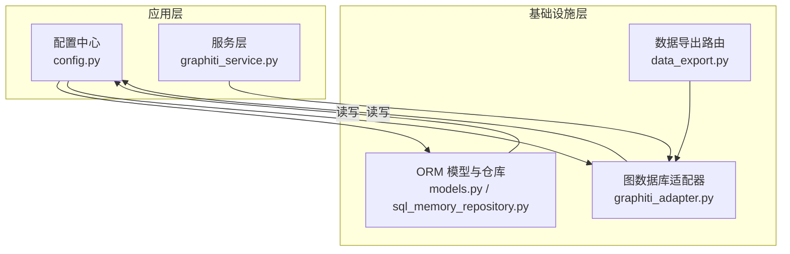
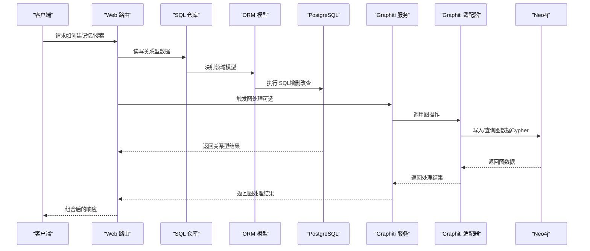
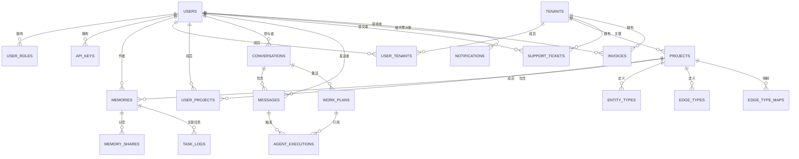
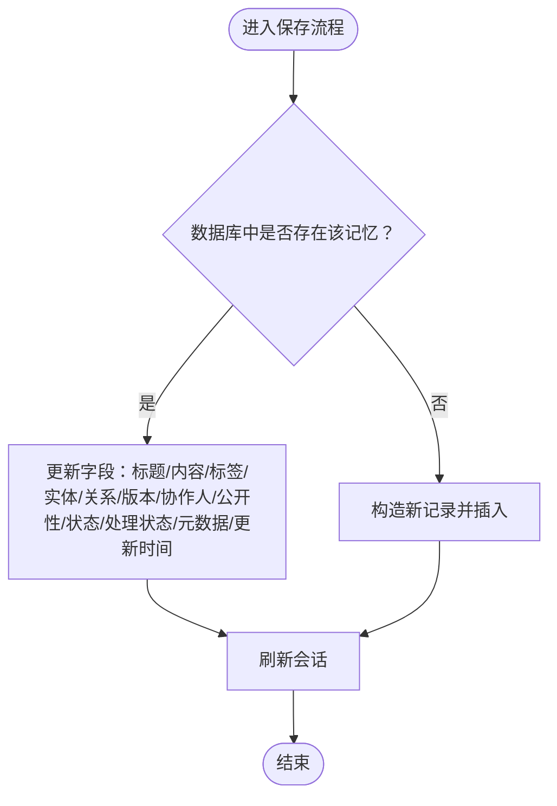
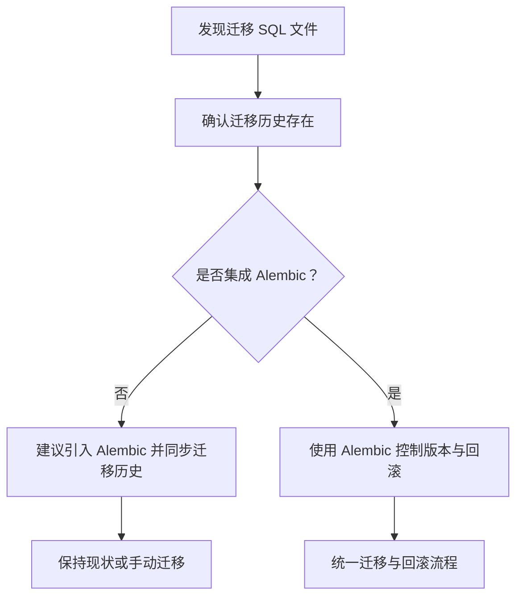
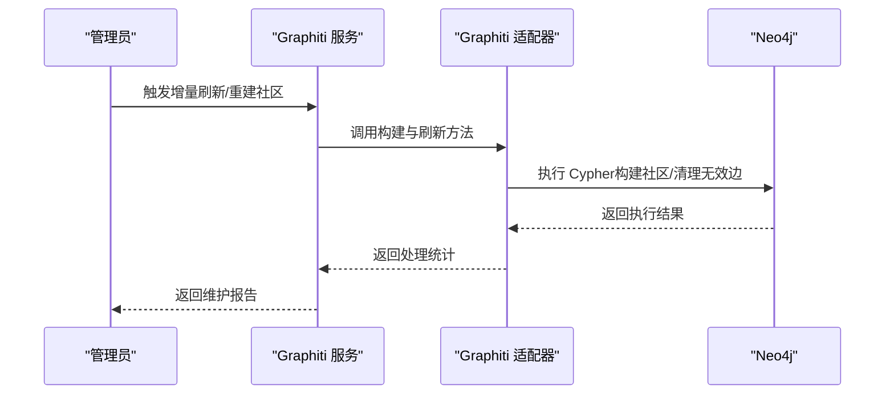
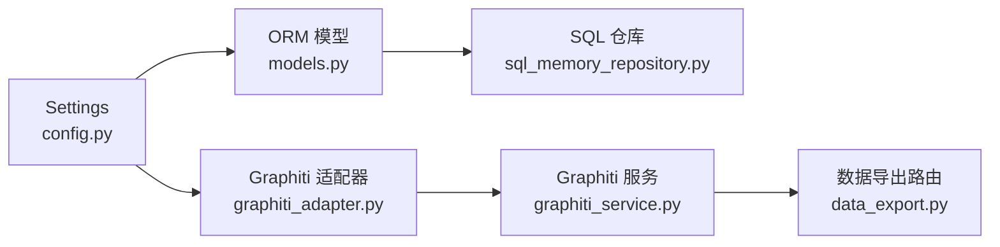

# 数据库设计

<cite>
**本文引用的文件**
- [src/infrastructure/adapters/secondary/persistence/models.py](file://src/infrastructure/adapters/secondary/persistence/models.py)
- [src/infrastructure/adapters/secondary/persistence/sql_memory_repository.py](file://src/infrastructure/adapters/secondary/persistence/sql_memory_repository.py)
- [src/configuration/config.py](file://src/configuration/config.py)
- [src/infrastructure/adapters/secondary/graphiti/graphiti_adapter.py](file://src/infrastructure/adapters/secondary/graphiti/graphiti_adapter.py)
- [src/server/services/graphiti_service.py](file://src/server/services/graphiti_service.py)
- [src/infrastructure/adapters/primary/web/routers/data_export.py](file://src/infrastructure/adapters/primary/web/routers/data_export.py)
</cite>

## 目录
1. [简介](#简介)
2. [项目结构](#项目结构)
3. [核心组件](#核心组件)
4. [架构总览](#架构总览)
5. [详细组件分析](#详细组件分析)
6. [依赖分析](#依赖分析)
7. [性能考虑](#性能考虑)
8. [故障排查指南](#故障排查指南)
9. [结论](#结论)
10. [附录](#附录)

## 简介
本文件系统化梳理 MemStack 的数据库设计，覆盖关系型数据库（PostgreSQL）与图数据库（Neo4j）两部分。重点包括：
- PostgreSQL 关系型数据模型：用户与认证、项目与租户、记忆与对话、代理执行记录等关键表结构及其关系、主外键约束与索引策略。
- Neo4j 图数据模型：节点类型、关系类型及属性、索引与约束。
- Alembic 迁移与版本控制最佳实践（基于现有代码的迁移配置与使用方式）。
- 数据迁移流程与回滚策略：模式变更、数据转换与回退。
- 性能优化与查询优化技巧。

## 项目结构
MemStack 的数据库相关实现主要分布在以下模块：
- 关系型数据库 ORM 模型与仓库：位于持久层适配器中，统一管理实体映射与 CRUD。
- 配置中心：集中管理数据库连接参数与连接池设置。
- 图数据库适配器：封装 Graphiti 客户端，提供图数据写入、检索与清理能力。
- 导出服务：从 Neo4j 中抽取实体与关系，用于数据导出或迁移。



图表来源
- [src/configuration/config.py](file://src/configuration/config.py#L212-L224)
- [src/infrastructure/adapters/secondary/persistence/models.py](file://src/infrastructure/adapters/secondary/persistence/models.py#L23-L780)
- [src/infrastructure/adapters/secondary/persistence/sql_memory_repository.py](file://src/infrastructure/adapters/secondary/persistence/sql_memory_repository.py#L18-L114)
- [src/infrastructure/adapters/secondary/graphiti/graphiti_adapter.py](file://src/infrastructure/adapters/secondary/graphiti/graphiti_adapter.py#L25-L489)
- [src/server/services/graphiti_service.py](file://src/server/services/graphiti_service.py#L27-L188)
- [src/infrastructure/adapters/primary/web/routers/data_export.py](file://src/infrastructure/adapters/primary/web/routers/data_export.py#L93-L128)

章节来源
- [src/configuration/config.py](file://src/configuration/config.py#L19-L39)
- [src/infrastructure/adapters/secondary/persistence/models.py](file://src/infrastructure/adapters/secondary/persistence/models.py#L23-L780)
- [src/infrastructure/adapters/secondary/persistence/sql_memory_repository.py](file://src/infrastructure/adapters/secondary/persistence/sql_memory_repository.py#L18-L114)
- [src/infrastructure/adapters/secondary/graphiti/graphiti_adapter.py](file://src/infrastructure/adapters/secondary/graphiti/graphiti_adapter.py#L25-L489)
- [src/server/services/graphiti_service.py](file://src/server/services/graphiti_service.py#L27-L188)
- [src/infrastructure/adapters/primary/web/routers/data_export.py](file://src/infrastructure/adapters/primary/web/routers/data_export.py#L93-L128)

## 核心组件
- 关系型数据库（PostgreSQL）
  - ORM 基类与混入：统一基类与通用 ID 生成逻辑。
  - 用户与认证：用户、角色、权限、用户角色、API Key。
  - 租户与项目：租户、项目、成员关系（用户-租户、用户-项目）。
  - 记忆与对话：记忆、实体类型、边类型、边映射、分享、通知、发票、支持工单。
  - 代理与工作流：会话、消息、代理执行、工作计划、工作流模式、工具组合、技能、子代理、MCP 服务器。
  - 任务日志：任务执行状态、进度、结果与错误信息。
- 图数据库（Neo4j）
  - 节点类型：Episodic（事件）、Entity（实体）、Community（社区）等。
  - 关系类型：MENTIONS、RELATES_TO 等。
  - 属性与索引：通过嵌入维度检查与清理机制保障一致性；查询路径体现节点与关系的属性访问。
- 配置与连接
  - PostgreSQL 连接 URL、连接池大小、溢出、回收与预热。
  - Neo4j 连接参数（URI、用户名、密码）。
- 服务与适配器
  - Graphiti 服务：初始化、搜索、增量刷新、去重、维护状态查询。
  - Graphiti 适配器：嵌入维度检查、添加事件、搜索、获取图数据、删除与清理。

章节来源
- [src/infrastructure/adapters/secondary/persistence/models.py](file://src/infrastructure/adapters/secondary/persistence/models.py#L23-L780)
- [src/configuration/config.py](file://src/configuration/config.py#L19-L39)
- [src/server/services/graphiti_service.py](file://src/server/services/graphiti_service.py#L27-L188)
- [src/infrastructure/adapters/secondary/graphiti/graphiti_adapter.py](file://src/infrastructure/adapters/secondary/graphiti/graphiti_adapter.py#L25-L489)

## 架构总览
下图展示数据库相关组件在运行时的交互关系与数据流向。



图表来源
- [src/infrastructure/adapters/secondary/persistence/sql_memory_repository.py](file://src/infrastructure/adapters/secondary/persistence/sql_memory_repository.py#L18-L114)
- [src/infrastructure/adapters/secondary/persistence/models.py](file://src/infrastructure/adapters/secondary/persistence/models.py#L23-L780)
- [src/server/services/graphiti_service.py](file://src/server/services/graphiti_service.py#L27-L188)
- [src/infrastructure/adapters/secondary/graphiti/graphiti_adapter.py](file://src/infrastructure/adapters/secondary/graphiti/graphiti_adapter.py#L25-L489)

## 详细组件分析

### PostgreSQL 关系型数据模型

#### 实体与关系总览
- 用户与认证
  - 用户表：唯一邮箱、活跃状态、超级用户标记、时间戳。
  - 角色与权限：角色-权限多对多，用户-角色多对多（可带租户作用域）。
  - API Key：按用户关联，带过期与权限字段。
- 租户与项目
  - 租户：拥有者、限额配置（计划、最大项目数、用户数、存储）。
  - 项目：所属租户与所有者，公开性、内存规则与图配置。
  - 成员关系：用户-租户、用户-项目，支持角色与权限。
- 记忆与对话
  - 记忆：标题、内容、类型、标签、实体与关系列表、版本、作者、协作人、公开性、状态、处理状态、元数据、任务 ID。
  - 实体类型、边类型、边映射：项目级唯一约束，保证命名唯一性。
  - 分享、通知、发票、支持工单：围绕用户与租户的扩展实体。
- 代理与工作流
  - 会话、消息、代理执行、工作计划、工作流模式、工具组合、技能、子代理、MCP 服务器。
  - 多层级思考支持：消息与执行记录包含工作计划引用与层级思考字段。
- 任务日志
  - 任务组、类型、状态、开始/完成时间、错误信息、重试次数、负载、进度、结果与消息。
  - 支持父子任务与实体关联。



图表来源
- [src/infrastructure/adapters/secondary/persistence/models.py](file://src/infrastructure/adapters/secondary/persistence/models.py#L36-L780)

章节来源
- [src/infrastructure/adapters/secondary/persistence/models.py](file://src/infrastructure/adapters/secondary/persistence/models.py#L36-L780)

#### 主外键约束与索引策略
- 主键
  - 所有实体主键均为字符串类型（UUID），避免热点与跨分片冲突。
- 外键
  - 用户、租户、项目、记忆、会话、消息、代理执行、工作计划、工作流模式、工具组合、技能、子代理、MCP 服务器均通过外键建立层级关系。
- 唯一性与复合唯一
  - 实体类型、边类型在项目维度唯一（名称唯一）。
  - 边映射在项目维度（源类型、目标类型、边类型）唯一。
  - API Key 的 key_hash 建有索引以加速鉴权查找。
- 索引
  - 用户邮箱、API Key key_hash、任务日志 group_id、status、entity_id、parent_task_id 等常见查询字段建有索引。
  - 时间戳字段（created_at、updated_at、expires_at、started_at、completed_at）可用于范围查询与排序。
- 约束
  - 数据状态与处理状态枚举值通过字符串常量约束，确保一致性。

章节来源
- [src/infrastructure/adapters/secondary/persistence/models.py](file://src/infrastructure/adapters/secondary/persistence/models.py#L36-L780)

#### 关系型数据访问模式
- 仓库模式：SQLAlchemyMemoryRepository 封装了保存、查询、分页列出与删除逻辑，统一映射领域模型与数据库模型。
- 查询示例
  - 按项目分页列出记忆。
  - 按 ID 查询记忆。
  - 保存或更新记忆（存在则更新，否则新建）。



图表来源
- [src/infrastructure/adapters/secondary/persistence/sql_memory_repository.py](file://src/infrastructure/adapters/secondary/persistence/sql_memory_repository.py#L24-L67)

章节来源
- [src/infrastructure/adapters/secondary/persistence/sql_memory_repository.py](file://src/infrastructure/adapters/secondary/persistence/sql_memory_repository.py#L18-L114)

### Neo4j 图数据模型

#### 节点类型与关系类型
- 节点类型
  - Episodic：事件节点，承载记忆片段（内容、来源、时间窗口、租户/项目/用户/记忆关联）。
  - Entity：实体节点，可具备名称与创建时间的嵌入向量。
  - Community：社区节点，用于社区构建与聚合。
- 关系类型
  - MENTIONS：Episodic 与 Entity 的提及关系。
  - RELATES_TO：Entity 之间的关系边，携带边标识与事件来源集合。
- 属性
  - 节点与关系包含丰富的属性（如 uuid、name、content、source、created_at、valid_at、group_id、tenant_id、project_id、user_id、memory_id、status、summary 等）。

```mermaid
classDiagram
class Episodic {
+uuid
+name
+content
+source_description
+source
+created_at
+valid_at
+group_id
+tenant_id
+project_id
+user_id
+memory_id
+status
}
class Entity {
+uuid
+name
+summary
+name_embedding
+created_at_embedding
}
class Community {
+uuid
+name
+members
}
class RELATES_TO {
+uuid
+episodes
}
class MENTIONS
Episodic --> Entity : "MENTIONS"
Entity --||-- Entity : "RELATES_TO"
Community --> Entity : "包含"
```

图表来源
- [src/infrastructure/adapters/secondary/graphiti/graphiti_adapter.py](file://src/infrastructure/adapters/secondary/graphiti/graphiti_adapter.py#L120-L322)

章节来源
- [src/infrastructure/adapters/secondary/graphiti/graphiti_adapter.py](file://src/infrastructure/adapters/secondary/graphiti/graphiti_adapter.py#L25-L489)

#### 索引与约束
- 嵌入维度一致性
  - 通过嵌入维度检查与自动清理机制，避免不同 LLM 提供商导致的嵌入维度不一致问题。
- 查询路径
  - 搜索采用混合检索配方（RRF），返回实体与事件节点。
  - 获取图数据时，先匹配事件节点，再可选地匹配相关实体节点与关系边。
- 删除与清理
  - 支持按事件名或按记忆 ID 删除事件，并进行孤儿边与孤儿实体的清理。
  - 清理过程中可移除实体的嵌入向量，防止维度不兼容。

章节来源
- [src/infrastructure/adapters/secondary/graphiti/graphiti_adapter.py](file://src/infrastructure/adapters/secondary/graphiti/graphiti_adapter.py#L38-L119)
- [src/infrastructure/adapters/secondary/graphiti/graphiti_adapter.py](file://src/infrastructure/adapters/secondary/graphiti/graphiti_adapter.py#L224-L296)
- [src/infrastructure/adapters/secondary/graphiti/graphiti_adapter.py](file://src/infrastructure/adapters/secondary/graphiti/graphiti_adapter.py#L298-L489)

### Alembic 迁移与版本控制

#### 当前状态与使用方式
- 代码中未直接出现 Alembic 配置文件（如 alembic.ini、env.py）。
- 项目内存在大量迁移 SQL 文件（例如 vendor/opencode/packages/console/core/migrations/*），表明迁移历史已存在但未在当前仓库中直接集成 Alembic。
- 代码通过 Graphiti 适配器与服务层调用图数据库，关系型数据通过 SQLAlchemy ORM 管理。



图表来源
- [src/infrastructure/adapters/secondary/graphiti/graphiti_adapter.py](file://src/infrastructure/adapters/secondary/graphiti/graphiti_adapter.py#L38-L119)

章节来源
- [src/infrastructure/adapters/secondary/graphiti/graphiti_adapter.py](file://src/infrastructure/adapters/secondary/graphiti/graphiti_adapter.py#L38-L119)

### 数据迁移流程与回滚策略

#### 关系型数据迁移
- 模式变更
  - 使用 Alembic 生成迁移脚本，描述新增/修改列、索引、约束等。
  - 在迁移脚本中包含数据转换逻辑（如默认值填充、枚举映射、JSON 字段规范化）。
- 回滚策略
  - 生成降级迁移脚本，恢复到上一个版本。
  - 对于不可逆变更（如删除列），需准备数据备份与重建方案。
- 发布流程
  - 在灰度环境中先执行迁移，观察指标与日志。
  - 全量发布后，执行一致性校验（抽样比对）。

#### 图数据迁移
- 嵌入维度切换
  - 通过嵌入维度检查与自动清理机制，检测并清理旧维度的嵌入向量。
  - 清理完成后，重新生成新维度的嵌入，确保后续检索与聚类稳定。
- 数据导出与导入
  - 使用导出路由将实体与关系导出为结构化数据，便于离线处理与验证。
  - 导入时遵循节点与关系的属性映射，确保 UUID 与关系完整性。



图表来源
- [src/server/services/graphiti_service.py](file://src/server/services/graphiti_service.py#L116-L144)
- [src/infrastructure/adapters/secondary/graphiti/graphiti_adapter.py](file://src/infrastructure/adapters/secondary/graphiti/graphiti_adapter.py#L340-L413)

章节来源
- [src/server/services/graphiti_service.py](file://src/server/services/graphiti_service.py#L116-L188)
- [src/infrastructure/adapters/secondary/graphiti/graphiti_adapter.py](file://src/infrastructure/adapters/secondary/graphiti/graphiti_adapter.py#L38-L119)
- [src/infrastructure/adapters/primary/web/routers/data_export.py](file://src/infrastructure/adapters/primary/web/routers/data_export.py#L93-L128)

## 依赖分析
- 配置中心
  - 提供 PostgreSQL 与 Neo4j 的连接参数与连接池配置，统一由 Settings 类加载环境变量。
- ORM 与仓库
  - 通过 DeclarativeBase 定义模型，SQLAlchemyMemoryRepository 提供统一的数据访问接口。
- 图数据库适配器
  - GraphitiAdapter 封装嵌入维度检查、事件添加、搜索、图数据获取与清理。
- 服务层
  - GraphitiService 作为对外服务入口，负责初始化、搜索、维护与健康检查。



图表来源
- [src/configuration/config.py](file://src/configuration/config.py#L212-L224)
- [src/infrastructure/adapters/secondary/persistence/models.py](file://src/infrastructure/adapters/secondary/persistence/models.py#L23-L780)
- [src/infrastructure/adapters/secondary/persistence/sql_memory_repository.py](file://src/infrastructure/adapters/secondary/persistence/sql_memory_repository.py#L18-L114)
- [src/infrastructure/adapters/secondary/graphiti/graphiti_adapter.py](file://src/infrastructure/adapters/secondary/graphiti/graphiti_adapter.py#L25-L489)
- [src/server/services/graphiti_service.py](file://src/server/services/graphiti_service.py#L27-L188)
- [src/infrastructure/adapters/primary/web/routers/data_export.py](file://src/infrastructure/adapters/primary/web/routers/data_export.py#L93-L128)

章节来源
- [src/configuration/config.py](file://src/configuration/config.py#L19-L39)
- [src/infrastructure/adapters/secondary/persistence/models.py](file://src/infrastructure/adapters/secondary/persistence/models.py#L23-L780)
- [src/infrastructure/adapters/secondary/persistence/sql_memory_repository.py](file://src/infrastructure/adapters/secondary/persistence/sql_memory_repository.py#L18-L114)
- [src/infrastructure/adapters/secondary/graphiti/graphiti_adapter.py](file://src/infrastructure/adapters/secondary/graphiti/graphiti_adapter.py#L25-L489)
- [src/server/services/graphiti_service.py](file://src/server/services/graphiti_service.py#L27-L188)
- [src/infrastructure/adapters/primary/web/routers/data_export.py](file://src/infrastructure/adapters/primary/web/routers/data_export.py#L93-L128)

## 性能考虑
- PostgreSQL
  - 连接池：合理设置 pool_size、max_overflow、pool_recycle 与 pool_pre_ping，提升高并发下的稳定性。
  - 索引：对高频过滤与排序字段（如 group_id、status、entity_id、parent_task_id、created_at）建立索引。
  - 分页：列表查询使用 offset/limit，避免一次性返回大量数据。
  - JSON 字段：对常用 JSON 键进行物化列或二级索引（视查询需求而定）。
- Neo4j
  - 嵌入维度一致性：通过嵌入维度检查与自动清理，避免重复计算与检索失败。
  - 查询配方：使用混合检索配方（RRF）平衡召回与精度。
  - 清理策略：定期清理孤儿边与孤儿实体，减少图膨胀。
  - 事务与批处理：批量写入时使用事务，降低锁竞争与写放大。

## 故障排查指南
- 嵌入维度不一致
  - 现象：检索结果异常或报错。
  - 排查：检查嵌入维度检查日志，确认当前提供商与已有嵌入维度是否一致。
  - 处理：启用自动清理或手动清理指定维度的嵌入向量。
- 图数据清理失败
  - 现象：删除事件后仍有孤立节点或边残留。
  - 排查：查看清理查询执行结果与警告日志。
  - 处理：确认事件 UUID 与记忆 ID 是否正确，必要时手动执行清理 Cypher。
- 连接池耗尽
  - 现象：请求超时或连接拒绝。
  - 排查：监控连接池使用率与回收周期。
  - 处理：调整 pool_size、max_overflow 或优化查询性能。

章节来源
- [src/infrastructure/adapters/secondary/graphiti/graphiti_adapter.py](file://src/infrastructure/adapters/secondary/graphiti/graphiti_adapter.py#L38-L119)
- [src/infrastructure/adapters/secondary/graphiti/graphiti_adapter.py](file://src/infrastructure/adapters/secondary/graphiti/graphiti_adapter.py#L340-L413)
- [src/configuration/config.py](file://src/configuration/config.py#L30-L34)

## 结论
MemStack 的数据库设计采用“关系型 + 图”的双引擎架构：PostgreSQL 负责结构化业务数据与强一致场景，Neo4j 负责复杂关系检索与智能体推理。通过统一的配置中心、ORM 与图适配器，系统实现了清晰的职责分离与良好的扩展性。建议尽快引入 Alembic 以统一迁移与回滚流程，并持续优化索引与查询配方，确保在高并发与大规模数据场景下的稳定性与性能。

## 附录
- 关系型数据模型清单
  - 用户与认证：users、roles、permissions、user_roles、api_keys
  - 租户与项目：tenants、projects、user_tenants、user_projects
  - 记忆与对话：memories、entity_types、edge_types、edge_type_maps、memory_shares、conversations、messages、agent_executions、work_plans、workflow_patterns、tool_compositions、skills、subagents、mcp_servers、task_logs、notifications、invoices、support_tickets
- Neo4j 节点与关系清单
  - 节点：Episodic、Entity、Community
  - 关系：MENTIONS、RELATES_TO
- 配置项要点
  - PostgreSQL：连接 URL、连接池参数、只读副本参数
  - Neo4j：URI、用户名、密码