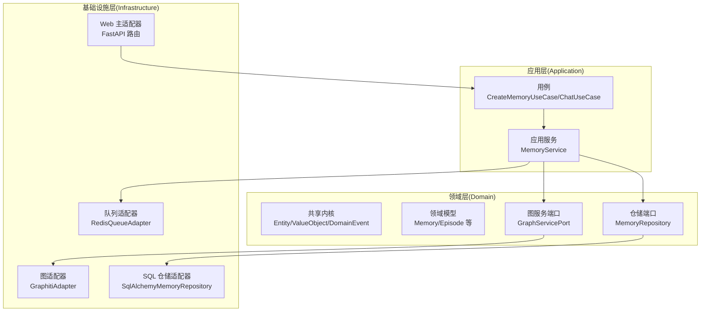
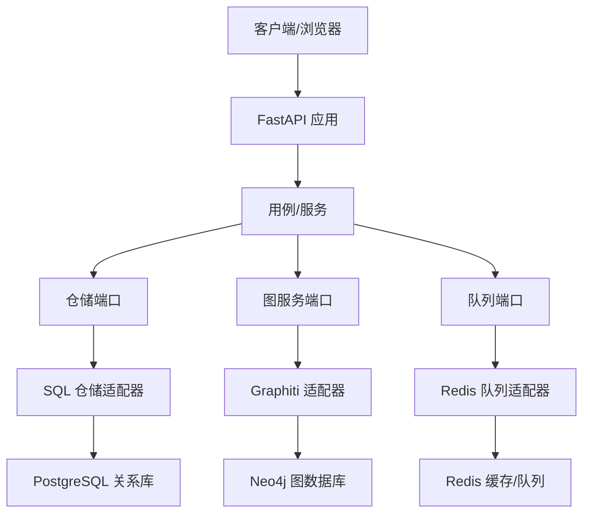
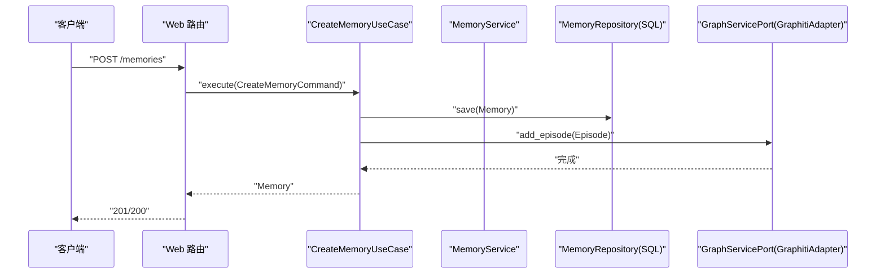
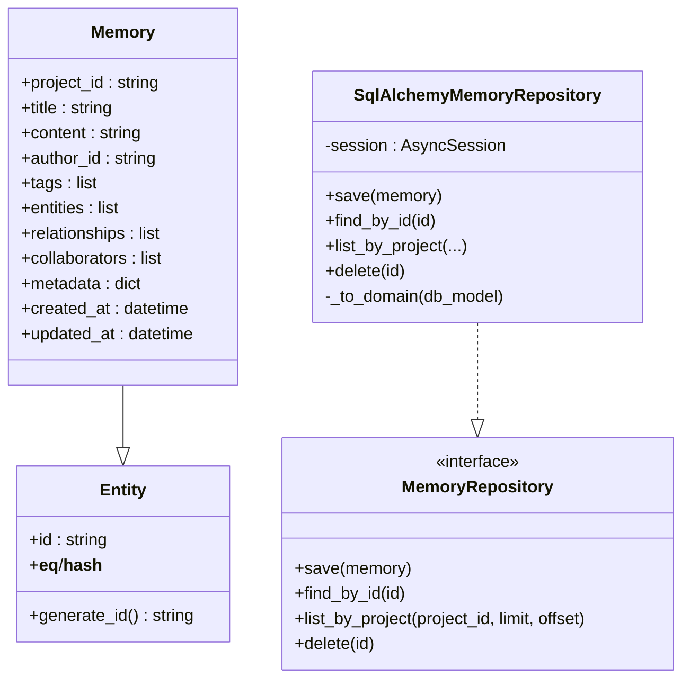
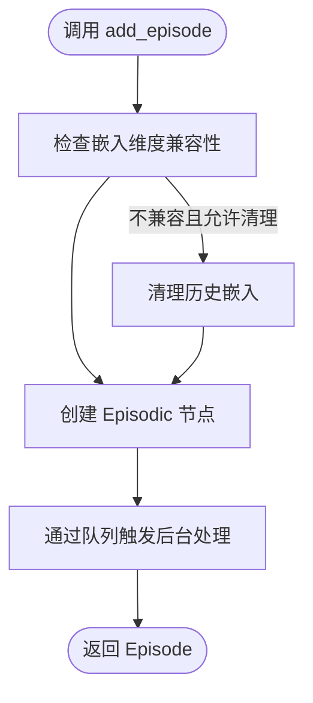
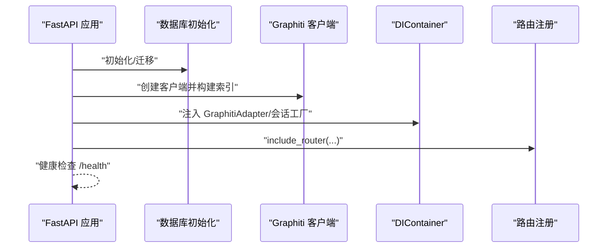
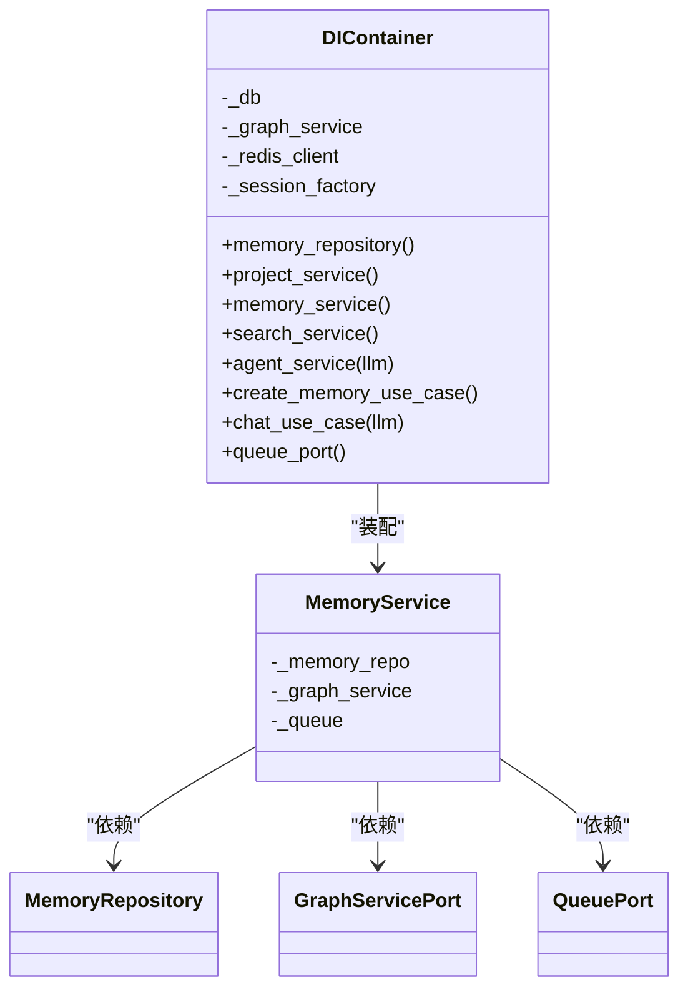
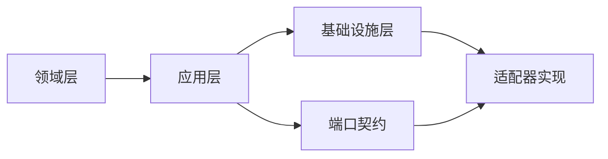
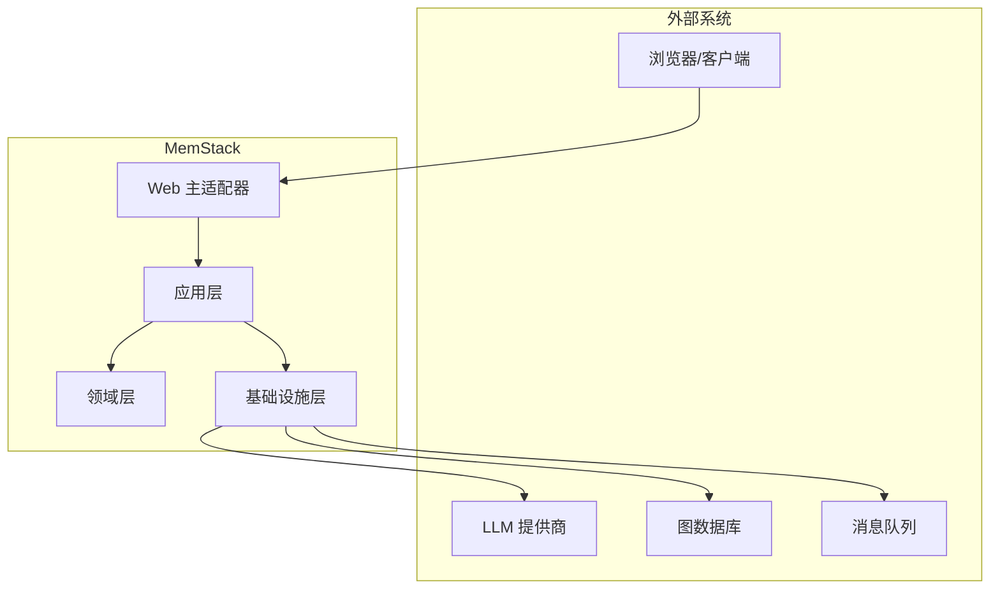

# 架构设计

<cite>
**本文档引用的文件**
- [架构总览](file://docs/architecture/ARCHITECTURE.md)
- [依赖注入容器](file://src/configuration/di_container.py)
- [配置管理](file://src/configuration/config.py)
- [共享内核（实体/值对象/领域事件）](file://src/domain/shared_kernel.py)
- [内存领域模型](file://src/domain/model/memory/memory.py)
- [内存仓储接口](file://src/domain/ports/repositories/memory_repository.py)
- [SQL 内存仓储实现](file://src/infrastructure/adapters/secondary/persistence/sql_memory_repository.py)
- [图服务端口](file://src/domain/ports/services/graph_service_port.py)
- [Graphiti 适配器](file://src/infrastructure/adapters/secondary/graphiti/graphiti_adapter.py)
- [内存服务](file://src/application/services/memory_service.py)
- [创建记忆用例](file://src/application/use_cases/memory/create_memory.py)
- [聊天用例](file://src/application/use_cases/agent/chat.py)
- [Web 入口（FastAPI 应用）](file://src/infrastructure/adapters/primary/web/main.py)
- [六边形架构与 DDD 规则](file://domain_driven_design_hexagonal_arhictecture_python_rules.md)
</cite>

## 目录
1. [引言](#引言)
2. [项目结构](#项目结构)
3. [核心组件](#核心组件)
4. [架构总览](#架构总览)
5. [详细组件分析](#详细组件分析)
6. [依赖分析](#依赖分析)
7. [性能考虑](#性能考虑)
8. [故障排查指南](#故障排查指南)
9. [结论](#结论)
10. [附录](#附录)

## 引言
本文件面向 MemStack 的架构设计，系统性阐述其采用的六边形架构（Hexagonal Architecture）与领域驱动设计（DDD）落地方式，重点说明分层架构（领域层、应用层、基础设施层）的职责划分、端口与适配器模式的实现、依赖注入容器的装配策略，以及系统边界、组件交互与数据流向。同时给出架构决策的技术考量、权衡与约束，并提供系统上下文图与组件分解图，帮助开发者快速理解整体结构。

## 项目结构
MemStack 严格遵循六边形架构的“关注点分离”原则，围绕“端口（Port）—适配器（Adapter）—用例（Use Case）—服务（Service）—实体（Entity）”展开组织：
- 领域层（Domain Layer）：定义实体、值对象、领域事件与仓储/服务端口，保持纯业务逻辑与技术无关。
- 应用层（Application Layer）：定义用例与应用服务，编排业务流程，依赖领域端口与基础设施端口。
- 基础设施层（Infrastructure Layer）：实现端口的具体适配器，对接数据库、消息队列、外部 LLM/GNN 等。

图表来源
- [依赖注入容器](file://src/configuration/di_container.py#L108-L391)
- [Web 入口（FastAPI 应用）](file://src/infrastructure/adapters/primary/web/main.py#L135-L280)
- [内存服务](file://src/application/services/memory_service.py#L35-L389)
- [创建记忆用例](file://src/application/use_cases/memory/create_memory.py#L26-L76)
- [图服务端口](file://src/domain/ports/services/graph_service_port.py#L7-L44)
- [Graphiti 适配器](file://src/infrastructure/adapters/secondary/graphiti/graphiti_adapter.py#L25-L489)
- [内存仓储接口](file://src/domain/ports/repositories/memory_repository.py#L7-L25)
- [SQL 内存仓储实现](file://src/infrastructure/adapters/secondary/persistence/sql_memory_repository.py#L18-L114)

章节来源
- [架构总览](file://docs/architecture/ARCHITECTURE.md#L128-L250)
- [Web 入口（FastAPI 应用）](file://src/infrastructure/adapters/primary/web/main.py#L135-L280)

## 核心组件
- 依赖注入容器（DIContainer）：集中装配用例、服务、仓储与适配器，确保应用层只依赖抽象端口。
- 配置管理（Settings）：统一管理数据库、缓存、LLM 提供商、指标与遥测等运行参数。
- 领域共享内核：Entity/ValueObject/DomainEvent 作为领域不变的基础构件。
- 图服务端口与适配器：抽象图数据库访问，屏蔽底层实现细节。
- 内存服务与用例：封装记忆的创建、检索、更新、删除与搜索等业务流程。
- Web 主适配器：FastAPI 应用生命周期初始化、路由注册与中间件配置。

章节来源
- [依赖注入容器](file://src/configuration/di_container.py#L108-L391)
- [配置管理](file://src/configuration/config.py#L10-L231)
- [共享内核（实体/值对象/领域事件）](file://src/domain/shared_kernel.py#L10-L61)
- [图服务端口](file://src/domain/ports/services/graph_service_port.py#L7-L44)
- [Graphiti 适配器](file://src/infrastructure/adapters/secondary/graphiti/graphiti_adapter.py#L25-L489)
- [内存服务](file://src/application/services/memory_service.py#L35-L389)
- [Web 入口（FastAPI 应用）](file://src/infrastructure/adapters/primary/web/main.py#L135-L280)

## 架构总览
MemStack 的系统边界清晰：外部系统（浏览器/客户端、第三方 LLM/GNN、消息队列）通过基础设施层适配器进入应用；应用层用例与服务编排业务；领域层保持纯业务不变；端口定义贯穿三层，实现依赖倒置。

图表来源
- [Web 入口（FastAPI 应用）](file://src/infrastructure/adapters/primary/web/main.py#L135-L280)
- [依赖注入容器](file://src/configuration/di_container.py#L108-L391)
- [图服务端口](file://src/domain/ports/services/graph_service_port.py#L7-L44)
- [Graphiti 适配器](file://src/infrastructure/adapters/secondary/graphiti/graphiti_adapter.py#L25-L489)
- [内存仓储接口](file://src/domain/ports/repositories/memory_repository.py#L7-L25)
- [SQL 内存仓储实现](file://src/infrastructure/adapters/secondary/persistence/sql_memory_repository.py#L18-L114)

## 详细组件分析

### 用例与服务：记忆管理
- 用例（CreateMemoryUseCase）：接收命令对象，创建领域实体，保存到仓储，并同步到图服务。
- 应用服务（MemoryService）：封装更复杂的业务流程，如搜索、更新、删除、分享、处理状态跟踪等；与图服务和队列端口协作。

图表来源
- [创建记忆用例](file://src/application/use_cases/memory/create_memory.py#L26-L76)
- [内存服务](file://src/application/services/memory_service.py#L35-L389)
- [内存仓储接口](file://src/domain/ports/repositories/memory_repository.py#L7-L25)
- [SQL 内存仓储实现](file://src/infrastructure/adapters/secondary/persistence/sql_memory_repository.py#L18-L114)
- [图服务端口](file://src/domain/ports/services/graph_service_port.py#L7-L44)
- [Graphiti 适配器](file://src/infrastructure/adapters/secondary/graphiti/graphiti_adapter.py#L25-L489)

章节来源
- [创建记忆用例](file://src/application/use_cases/memory/create_memory.py#L26-L76)
- [内存服务](file://src/application/services/memory_service.py#L35-L389)

### 领域模型与仓储端口
- 领域模型（Memory）：继承自 Entity，携带项目/作者/标签/关系/协作人/元数据等属性。
- 仓储接口（MemoryRepository）：定义保存、查询、分页、删除等抽象方法。
- 适配器实现（SqlAlchemyMemoryRepository）：将领域模型映射到数据库表，负责读写与转换。

图表来源
- [共享内核（实体/值对象/领域事件）](file://src/domain/shared_kernel.py#L10-L61)
- [内存领域模型](file://src/domain/model/memory/memory.py#L8-L31)
- [内存仓储接口](file://src/domain/ports/repositories/memory_repository.py#L7-L25)
- [SQL 内存仓储实现](file://src/infrastructure/adapters/secondary/persistence/sql_memory_repository.py#L18-L114)

章节来源
- [共享内核（实体/值对象/领域事件）](file://src/domain/shared_kernel.py#L10-L61)
- [内存领域模型](file://src/domain/model/memory/memory.py#L8-L31)
- [内存仓储接口](file://src/domain/ports/repositories/memory_repository.py#L7-L25)
- [SQL 内存仓储实现](file://src/infrastructure/adapters/secondary/persistence/sql_memory_repository.py#L18-L114)

### 图服务端口与适配器
- 端口（GraphServicePort）：定义添加剧集、搜索、获取图数据、删除剧集等抽象方法。
- 适配器（GraphitiAdapter）：实现与图数据库的交互，包含嵌入维度检查、异步队列触发、清理与回退策略等。

图表来源
- [图服务端口](file://src/domain/ports/services/graph_service_port.py#L7-L44)
- [Graphiti 适配器](file://src/infrastructure/adapters/secondary/graphiti/graphiti_adapter.py#L120-L188)

章节来源
- [图服务端口](file://src/domain/ports/services/graph_service_port.py#L7-L44)
- [Graphiti 适配器](file://src/infrastructure/adapters/secondary/graphiti/graphiti_adapter.py#L25-L489)

### Web 入口与生命周期
- FastAPI 应用在启动阶段完成数据库初始化、默认凭据初始化、图数据库索引构建、队列与后台任务初始化，并将 DIContainer 注入到 app.state。
- 路由注册覆盖认证、租户、项目、智能体、记忆、图、搜索、导出、维护、任务、工具有限集合。

图表来源
- [Web 入口（FastAPI 应用）](file://src/infrastructure/adapters/primary/web/main.py#L53-L134)
- [依赖注入容器](file://src/configuration/di_container.py#L108-L122)

章节来源
- [Web 入口（FastAPI 应用）](file://src/infrastructure/adapters/primary/web/main.py#L53-L134)

### 依赖注入与装配策略
- DIContainer 在构造函数中接收数据库会话工厂、Graphiti 客户端或适配器、Redis 客户端等，随后按需延迟创建仓储、服务、用例与工具集合。
- 用例通过服务进行装配，服务再依赖仓储与端口，形成清晰的依赖链。

图表来源
- [依赖注入容器](file://src/configuration/di_container.py#L108-L391)
- [内存服务](file://src/application/services/memory_service.py#L35-L44)

章节来源
- [依赖注入容器](file://src/configuration/di_container.py#L108-L391)
- [内存服务](file://src/application/services/memory_service.py#L35-L44)

## 依赖分析
- 耦合与内聚：领域层仅依赖自身端口；应用层通过端口解耦外部；基础设施层实现所有外部依赖，避免反向渗透。
- 直接与间接依赖：用例依赖服务；服务依赖仓储与图/队列端口；仓储与图服务端口分别被 SQL 与 Graphiti 适配器实现。
- 外部依赖与集成点：PostgreSQL、Neo4j、Redis、LLM 提供商；通过适配器屏蔽差异。
- 端口契约：端口定义在领域/应用层，适配器在基础设施层实现，确保依赖倒置。

图表来源
- [六边形架构与 DDD 规则](file://domain_driven_design_hexagonal_arhictecture_python_rules.md#L201-L249)
- [依赖注入容器](file://src/configuration/di_container.py#L108-L391)

章节来源
- [六边形架构与 DDD 规则](file://domain_driven_design_hexagonal_arhictecture_python_rules.md#L201-L249)
- [依赖注入容器](file://src/configuration/di_container.py#L108-L391)

## 性能考虑
- 连接池与并发：PostgreSQL 连接池参数可调，支持高并发读写；Redis 用于缓存与队列，降低数据库压力。
- 搜索与图处理：Graphiti 采用混合检索与批量处理，结合队列异步化，避免阻塞请求路径。
- 嵌入维度一致性：适配器内置嵌入维度检查与自动清理策略，减少跨提供商切换带来的不一致开销。
- 指标与可观测性：启用指标与遥测，便于定位热点与瓶颈。

## 故障排查指南
- 启动失败（Neo4j 不可用）：应用在启动阶段会尝试构建索引，若超时或连接失败，会记录错误并终止，提示需确保图数据库可用。
- 图清理失败：删除剧集时优先使用 graphiti-core 清理，失败后回退到 Cypher 清理，若仍失败，记录警告但继续后续流程。
- 嵌入维度不匹配：检测到历史嵌入维度与当前提供商标注不一致时，可选择自动清理或手动处理，避免检索异常。
- 队列未配置：若未注入队列端口，异步处理将不会触发，需检查 DIContainer 与应用初始化。

章节来源
- [Web 入口（FastAPI 应用）](file://src/infrastructure/adapters/primary/web/main.py#L78-L108)
- [Graphiti 适配器](file://src/infrastructure/adapters/secondary/graphiti/graphiti_adapter.py#L340-L414)
- [依赖注入容器](file://src/configuration/di_container.py#L204-L206)

## 结论
MemStack 以六边形架构与 DDD 为核心，通过端口与适配器实现关注点分离，借助依赖注入容器在应用启动阶段完成装配，使系统具备良好的可扩展性、可维护性与可测试性。图服务与队列的异步化设计提升了性能与用户体验；配置中心统一管理运行参数，便于在不同环境间迁移与治理。

## 附录
- 系统上下文图（概念示意）
