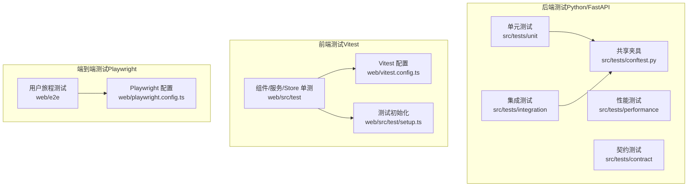
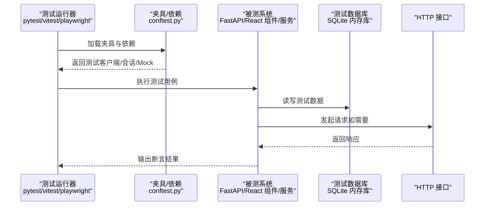
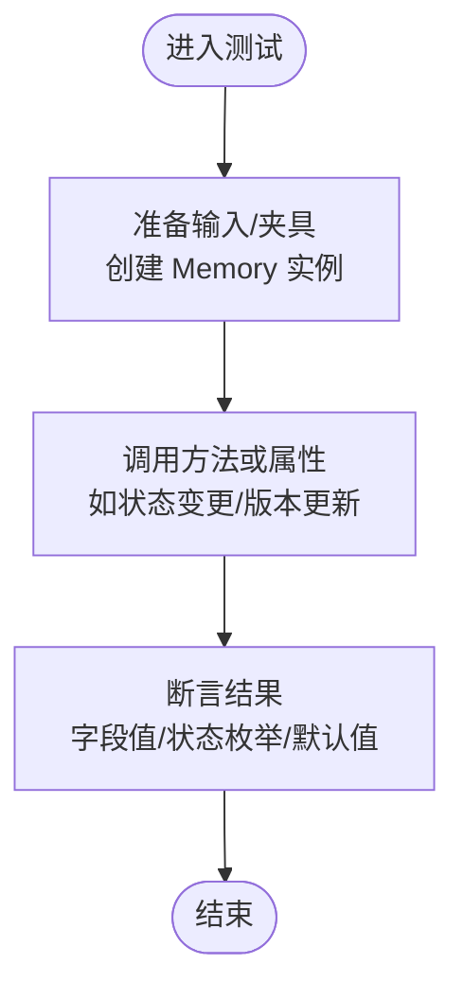
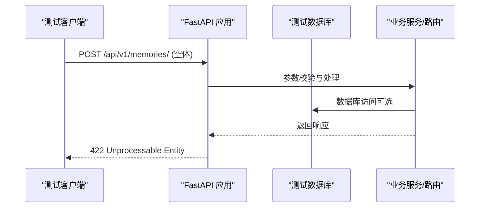
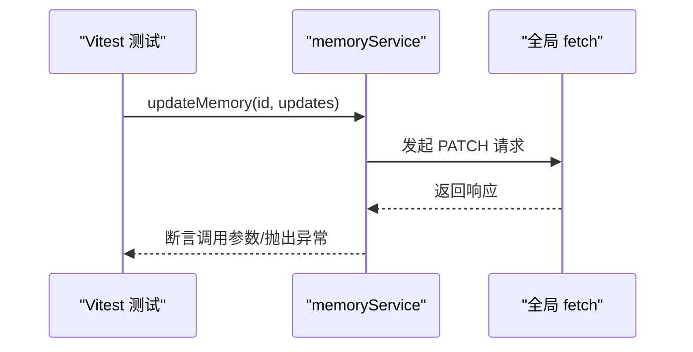
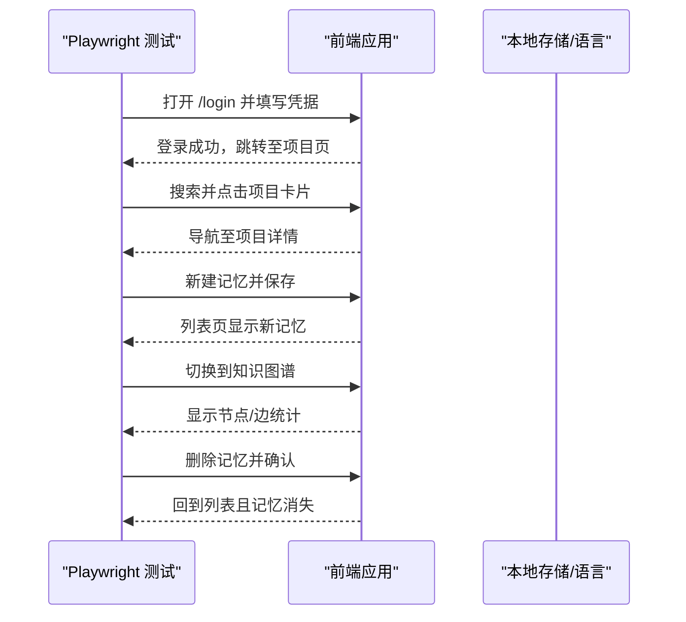
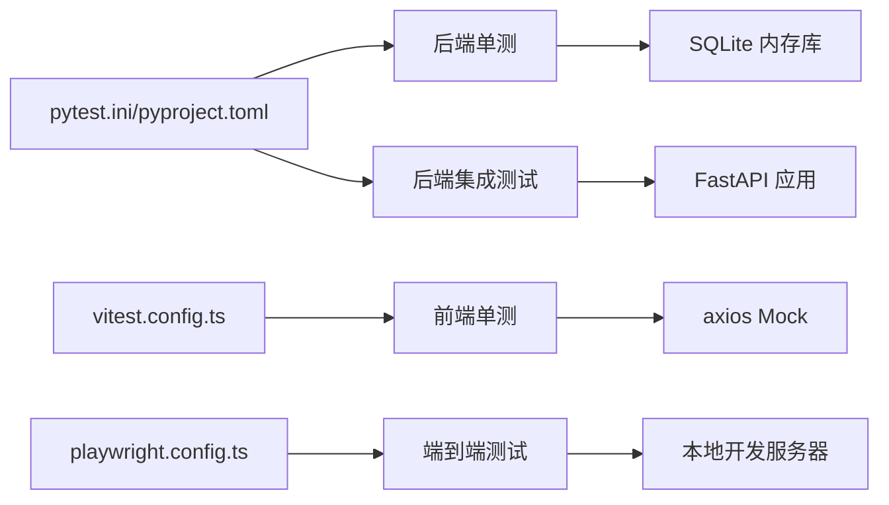

# 测试策略

<cite>
**本文引用的文件**
- [pytest.ini](file://pytest.ini)
- [pyproject.toml](file://pyproject.toml)
- [src/tests/README.md](file://src/tests/README.md)
- [src/tests/conftest.py](file://src/tests/conftest.py)
- [src/tests/unit/domain/test_memory.py](file://src/tests/unit/domain/test_memory.py)
- [src/tests/integration/api/test_memories.py](file://src/tests/integration/api/test_memories.py)
- [web/playwright.config.ts](file://web/playwright.config.ts)
- [web/vitest.config.ts](file://web/vitest.config.ts)
- [web/package.json](file://web/package.json)
- [web/src/test/setup.ts](file://web/src/test/setup.ts)
- [web/src/test/services/memoryService.test.ts](file://web/src/test/services/memoryService.test.ts)
- [web/e2e/memory.spec.ts](file://web/e2e/memory.spec.ts)
</cite>

## 目录
1. [引言](#引言)
2. [项目结构](#项目结构)
3. [核心组件](#核心组件)
4. [架构总览](#架构总览)
5. [详细组件分析](#详细组件分析)
6. [依赖分析](#依赖分析)
7. [性能考虑](#性能考虑)
8. [故障排查指南](#故障排查指南)
9. [结论](#结论)
10. [附录](#附录)

## 引言
本测试策略文档面向 MemStack 项目的后端（Python/FastAPI）、前端（React/Vite）与端到端（E2E）测试，系统化阐述测试组织结构、测试层次设计、工具配置与最佳实践。文档覆盖单元测试、集成测试、端到端测试与性能测试，并提供测试数据管理、Mock/Stub 使用、覆盖率要求、测试用例设计指南、自动化流程与调试技巧，帮助开发者编写高质量、可维护的测试代码。

## 项目结构
MemStack 的测试体系分为三层：
- 后端测试（src/tests）：按类型分层（unit、integration、performance、contract），并按领域层（domain、application、infrastructure）进一步细分。
- 前端测试（web/src/test）：组件、页面、布局、服务与 store 的单元测试；配合 Vitest 运行。
- 端到端测试（web/e2e）：基于 Playwright 的用户旅程测试，自动启动本地开发服务器进行验证。

图表来源
- [src/tests/README.md](file://src/tests/README.md#L35-L180)
- [web/vitest.config.ts](file://web/vitest.config.ts#L1-L32)
- [web/playwright.config.ts](file://web/playwright.config.ts#L1-L49)

章节来源
- [src/tests/README.md](file://src/tests/README.md#L35-L180)

## 核心组件
- 测试标记与运行控制：通过 pytest.ini 定义测试路径、命名规则、异步模式与默认标记，支持按类型选择性执行。
- 共享夹具与依赖注入：后端通过 conftest.py 提供数据库、用户、仓库、DI 容器、Graphiti 客户端等通用夹具，确保测试隔离与可重复性。
- 前端测试环境：Vitest 配置使用 happy-dom 环境、setupFiles 初始化国际化、窗口对象与拦截器，统一 Mock 行为。
- E2E 自动化：Playwright 在本地启动 Vite 开发服务器，按项目配置并发与重试策略，收集 HTML 报告。

章节来源
- [pytest.ini](file://pytest.ini#L1-L21)
- [src/tests/conftest.py](file://src/tests/conftest.py#L1-L803)
- [web/vitest.config.ts](file://web/vitest.config.ts#L1-L32)
- [web/src/test/setup.ts](file://web/src/test/setup.ts#L1-L169)
- [web/playwright.config.ts](file://web/playwright.config.ts#L1-L49)

## 架构总览
下图展示测试运行时的典型交互：测试通过夹具准备依赖，调用被测模块，断言结果；E2E 通过浏览器驱动访问应用，模拟真实用户操作。

图表来源
- [src/tests/conftest.py](file://src/tests/conftest.py#L54-L63)
- [src/tests/conftest.py](file://src/tests/conftest.py#L605-L639)
- [web/src/test/setup.ts](file://web/src/test/setup.ts#L1-L169)

## 详细组件分析

### 后端测试组织与规范
- 分层与类型分离：按 unit/integration/performance/contract 四类组织，便于快速筛选与并行执行。
- 文件命名与导入规范：遵循 snake_case 与清晰描述性命名；导入顺序标准化，避免循环依赖。
- 夹具标准：集中于 conftest.py，按作用域（session/function/module/class）合理划分；每个夹具必须有文档字符串说明用途与行为。
- 覆盖率目标：领域层 90%，应用层 80%，基础设施层 60%；排除外部依赖与异常类等。
- 质量标准：独立性、确定性、清晰性与可维护性；支持随机顺序与多次执行以验证稳定性。

章节来源
- [src/tests/README.md](file://src/tests/README.md#L13-L34)
- [src/tests/README.md](file://src/tests/README.md#L184-L228)
- [src/tests/README.md](file://src/tests/README.md#L350-L396)
- [src/tests/README.md](file://src/tests/README.md#L443-L500)
- [src/tests/README.md](file://src/tests/README.md#L502-L550)

### 单元测试（后端）
- 设计要点：针对领域模型、应用服务、使用用例与基础设施组件中的纯逻辑部分；使用 Mock/AsyncMock 模拟外部依赖。
- 示例参考：内存领域模型的构造、状态转换与默认值断言，体现“Arrange-Act-Assert”结构与可读性强的测试命名。

图表来源
- [src/tests/unit/domain/test_memory.py](file://src/tests/unit/domain/test_memory.py#L12-L205)

章节来源
- [src/tests/unit/domain/test_memory.py](file://src/tests/unit/domain/test_memory.py#L1-L205)

### 集成测试（后端）
- 设计要点：验证真实依赖链路，如数据库、路由、服务与外部适配器（Graphiti）。使用 TestClient 或 AsyncClient 发起 HTTP 请求，断言状态码与响应结构。
- 示例参考：认证客户端对无效数据的接口行为，断言 422 错误，验证路由与校验层工作正常。

图表来源
- [src/tests/integration/api/test_memories.py](file://src/tests/integration/api/test_memories.py#L5-L12)
- [src/tests/conftest.py](file://src/tests/conftest.py#L605-L639)

章节来源
- [src/tests/integration/api/test_memories.py](file://src/tests/integration/api/test_memories.py#L1-L12)
- [src/tests/conftest.py](file://src/tests/conftest.py#L542-L639)

### 前端单元测试（Vitest）
- 设计要点：组件渲染、用户交互、服务调用与状态管理；通过 setup.ts 统一 Mock 窗口对象、i18n、Chart.js Canvas、axios 等。
- 示例参考：memoryService 的更新、分享与删除接口调用断言，覆盖成功与错误场景（含 409 冲突）。

图表来源
- [web/src/test/services/memoryService.test.ts](file://web/src/test/services/memoryService.test.ts#L20-L72)
- [web/src/test/setup.ts](file://web/src/test/setup.ts#L148-L169)

章节来源
- [web/src/test/services/memoryService.test.ts](file://web/src/test/services/memoryService.test.ts#L1-L190)
- [web/src/test/setup.ts](file://web/src/test/setup.ts#L1-L169)

### 端到端测试（Playwright）
- 设计要点：以用户旅程为中心，覆盖登录、项目创建、记忆创建、知识图谱可视化与删除等完整流程；通过 setup 与 base 文件复用登录与导航逻辑。
- 示例参考：在本地开发服务器上完成从项目搜索、创建到记忆列表与图谱视图的验证，并断言关键元素可见性与 URL 变化。

图表来源
- [web/e2e/memory.spec.ts](file://web/e2e/memory.spec.ts#L6-L104)
- [web/playwright.config.ts](file://web/playwright.config.ts#L42-L48)

章节来源
- [web/e2e/memory.spec.ts](file://web/e2e/memory.spec.ts#L1-L104)
- [web/playwright.config.ts](file://web/playwright.config.ts#L1-L49)

### 测试工具配置与使用

#### Pytest（后端）
- 配置要点
  - 测试路径与命名：testpaths、python_files、python_classes、python_functions
  - 异步支持：asyncio_mode、默认 fixture 循环范围
  - 标记：unit、integration、slow、performance、contract、security
  - 默认选项：详细输出、严格标记、短回溯、禁用警告、默认排除性能测试
- 运行建议
  - 仅运行单元测试：pytest -m unit
  - 排除慢测试：pytest -m "not slow"
  - 组合条件：pytest -m "integration and security"

章节来源
- [pytest.ini](file://pytest.ini#L1-L21)
- [pyproject.toml](file://pyproject.toml#L107-L117)

#### Vitest（前端）
- 配置要点
  - 环境：happy-dom
  - 全局：启用 globals
  - 覆盖率：v8 提供商，阈值 50%（行/函数/分支/语句）
  - 排除：node_modules、测试目录、配置文件、类型声明、dist
  - 包含：src/test 下所有测试文件
- 命令：test、test:watch、test:coverage

章节来源
- [web/vitest.config.ts](file://web/vitest.config.ts#L1-L32)
- [web/package.json](file://web/package.json#L6-L16)

#### Playwright（E2E）
- 配置要点
  - 测试目录：./e2e
  - 并行：fullyParallel
  - CI：forbidOnly、重试次数、工作进程数
  - 报告：HTML 与 list
  - 基础 URL：http://localhost:3000
  - 超时：全局 60s，动作 10s
  - 项目：chromium
  - 本地服务器：pnpm dev，超时 120s
- 命令：test:e2e

章节来源
- [web/playwright.config.ts](file://web/playwright.config.ts#L1-L49)
- [web/package.json](file://web/package.json#L6-L16)

### 测试数据管理与 Mock/Stub 最佳实践
- 测试数据
  - 后端：通过 conftest.py 提供测试数据库引擎、会话与实体夹具（用户、租户、项目、记忆），确保事务回滚与隔离。
  - 前端：setup.ts 中统一 Mock i18n、窗口对象、Chart.js、localStorage/sessionStorage、navigator.clipboard、fetch 等。
- Mock/Stub
  - 后端：使用 unittest.mock.AsyncMock/Mock 模拟 Graphiti 客户端、嵌入服务、队列服务、数据库会话等。
  - 前端：通过 vi.mock 与 vi.fn 替换第三方依赖，保证测试可重复与无副作用。
- 夹具文档化
  - 每个夹具需包含用途、行为与返回值说明，便于维护与审查。

章节来源
- [src/tests/conftest.py](file://src/tests/conftest.py#L52-L84)
- [src/tests/conftest.py](file://src/tests/conftest.py#L373-L453)
- [web/src/test/setup.ts](file://web/src/test/setup.ts#L6-L169)

### 测试覆盖率与质量标准
- 目标覆盖率
  - 领域层：90%
  - 应用层：80%
  - 基础设施层：60%
- 排除项
  - 外部依赖、测试文件、生成代码、LLM 客户端、简单异常类、调试工具
- 报告生成
  - 后端：pytest --cov=src --cov-report=html --cov-report=term
  - 前端：vite test --coverage

章节来源
- [src/tests/README.md](file://src/tests/README.md#L443-L500)
- [web/vitest.config.ts](file://web/vitest.config.ts#L12-L29)

### 测试用例设计指南
- 结构化命名：test_<动作>_<条件>_<期望>，例如 test_create_memory_with_valid_data_succeeds
- 模式化步骤：Arrange（准备）、Act（执行）、Assert（断言）
- 边界与异常：覆盖空输入、非法格式、并发冲突（如 409）、网络失败等
- 可读性：测试名称与注释清晰表达意图，避免魔法数字与隐式假设

章节来源
- [src/tests/README.md](file://src/tests/README.md#L231-L276)
- [src/tests/README.md](file://src/tests/README.md#L531-L550)

### 测试自动化流程
- 本地开发
  - 后端：pytest（按类型与标记筛选）
  - 前端：vite test（单测）、vite test --coverage（覆盖率）
  - E2E：pnpm test:e2e（自动启动本地服务）
- CI/CD 建议
  - 并行执行：单元与集成测试并行，E2E 串行或限制并发
  - 缓存：缓存依赖安装与测试产物
  - 报告：上传覆盖率与 Playwright HTML 报告

章节来源
- [web/package.json](file://web/package.json#L6-L16)
- [web/playwright.config.ts](file://web/playwright.config.ts#L8-L16)

## 依赖分析
- 后端测试依赖
  - Pytest、pytest-asyncio、pytest-cov、pytest-mock、responses
  - FastAPI TestClient、httpx AsyncClient、SQLAlchemy 异步引擎
- 前端测试依赖
  - Vitest、@testing-library/react、happy-dom、axios Mock
- E2E 依赖
  - Playwright、Chromium 设备集、本地开发服务器

图表来源
- [pytest.ini](file://pytest.ini#L1-L21)
- [pyproject.toml](file://pyproject.toml#L50-L61)
- [web/vitest.config.ts](file://web/vitest.config.ts#L1-L32)
- [web/playwright.config.ts](file://web/playwright.config.ts#L1-L49)

章节来源
- [pyproject.toml](file://pyproject.toml#L50-L61)
- [web/package.json](file://web/package.json#L21-L46)

## 性能考虑
- 单元测试优先：保持 <2 秒，避免真实 I/O
- 集成测试限频：仅在必要时连接真实数据库或外部服务
- E2E 降噪：减少等待时间、使用稳定的元素选择器、避免不必要的刷新
- 覆盖率与性能平衡：设定合理阈值，避免过度 Mock 导致覆盖率失真

## 故障排查指南
- 单测失败
  - 检查夹具是否正确注入与清理；确认事件循环与异步上下文
  - 使用 --tb=long 获取更详细回溯
- 集成测试失败
  - 校验 TestClient/AsyncClient 的依赖覆盖是否生效；检查路由与中间件
  - 对比响应体与状态码，定位校验层或业务逻辑问题
- 前端单测失败
  - 确认 setup.ts 中的 Mock 是否覆盖了被测模块依赖；清理 vi 清理与 DOM 清理
- E2E 失败
  - 查看 HTML 报告与 Trace；检查 baseURL 与 webServer 启动超时
  - 使用更健壮的选择器与显式等待，避免隐式等待导致的不稳定

章节来源
- [pytest.ini](file://pytest.ini#L15-L21)
- [web/playwright.config.ts](file://web/playwright.config.ts#L16-L31)
- [web/src/test/setup.ts](file://web/src/test/setup.ts#L130-L143)

## 结论
MemStack 的测试策略以“类型分离 + 架构对齐”的方式组织测试，结合 Pytest、Vitest 与 Playwright 的配置，形成从单元到端到端的完整测试金字塔。通过标准化的夹具、Mock/Stub 与覆盖率目标，确保测试的可维护性与可重复性。建议在 CI 中并行执行单元与集成测试，E2E 串行或受限并发，并持续优化测试用例设计与覆盖率阈值。

## 附录
- 快速命令
  - 后端：pytest -m unit；pytest -m "not slow"；pytest --cov=src --cov-report=html
  - 前端：pnpm test；pnpm test:coverage
  - E2E：pnpm test:e2e
- 参考文件
  - 后端测试组织与规范：[src/tests/README.md](file://src/tests/README.md#L1-L574)
  - 后端夹具与依赖：[src/tests/conftest.py](file://src/tests/conftest.py#L1-L803)
  - 前端测试初始化：[web/src/test/setup.ts](file://web/src/test/setup.ts#L1-L169)
  - 前端单测示例：[web/src/test/services/memoryService.test.ts](file://web/src/test/services/memoryService.test.ts#L1-L190)
  - E2E 示例：[web/e2e/memory.spec.ts](file://web/e2e/memory.spec.ts#L1-L104)