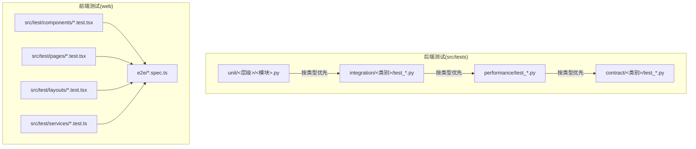
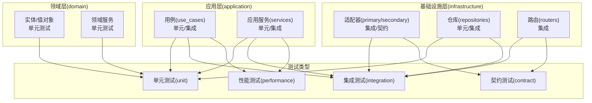
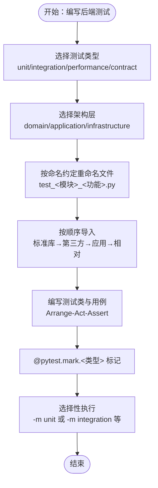
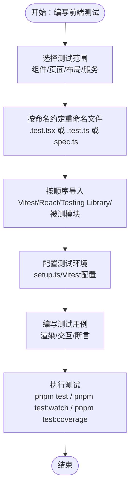
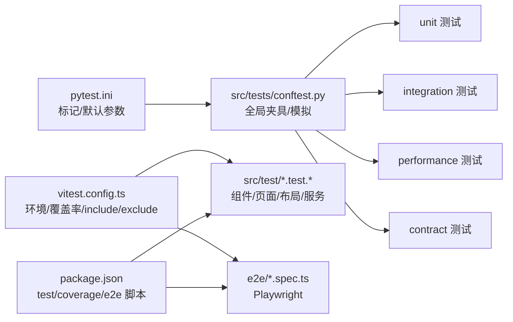

# 测试组织结构

<cite>
**本文引用的文件**
- [src/tests/README.md](file://src/tests/README.md)
- [src/tests/conftest.py](file://src/tests/conftest.py)
- [pytest.ini](file://pytest.ini)
- [src/tests/unit/domain/test_memory.py](file://src/tests/unit/domain/test_memory.py)
- [src/tests/integration/api/test_memories.py](file://src/tests/integration/api/test_memories.py)
- [src/tests/performance/test_agent_performance.py](file://src/tests/performance/test_agent_performance.py)
- [web/vitest.config.ts](file://web/vitest.config.ts)
- [web/package.json](file://web/package.json)
- [web/src/test/setup.ts](file://web/src/test/setup.ts)
- [web/playwright.config.ts](file://web/playwright.config.ts)
</cite>

## 目录
1. [引言](#引言)
2. [项目结构](#项目结构)
3. [核心组件](#核心组件)
4. [架构总览](#架构总览)
5. [详细组件分析](#详细组件分析)
6. [依赖分析](#依赖分析)
7. [性能考量](#性能考量)
8. [故障排查指南](#故障排查指南)
9. [结论](#结论)
10. [附录](#附录)

## 引言
本文件系统化阐述 MemStack 的测试组织结构与实施标准，聚焦以下目标：
- 六边形架构在测试中的体现：领域层、应用层、基础设施层的测试分离与职责边界。
- 测试类型分离：单元测试、集成测试、性能测试、契约测试的定义与执行策略。
- 命名约定与导入规范：后端与前端的文件命名、导入顺序与路径组织。
- 测试标记系统：@pytest.mark 的分类与选择性执行。
- 独立性与确定性保障：避免测试间耦合、确保可重复结果。
- 模板与最佳实践：提供测试文件结构模板与落地建议。

## 项目结构
MemStack 的测试体系分为后端与前端两部分，均遵循“按类型优先”的分层组织原则，并与六边形架构的三层一一对应。

- 后端测试（src/tests）
  - 类型分层：unit、integration、performance、contract
  - 层次映射：domain、application、infrastructure
  - 标准来源：[src/tests/README.md](file://src/tests/README.md#L35-L144)

- 前端测试（web/src/test 与 web/e2e）
  - 单元测试：组件、页面、布局、服务、store
  - 集成测试：Vitest 组件集成与服务集成
  - E2E 测试：Playwright 用户旅程测试
  - 标准来源：[src/tests/README.md](file://src/tests/README.md#L146-L180)

**图表来源**
- [src/tests/README.md](file://src/tests/README.md#L35-L180)

**章节来源**
- [src/tests/README.md](file://src/tests/README.md#L35-L180)

## 核心组件
- 测试类型与执行策略
  - 单元测试：快速、隔离、纯内存与模拟依赖，目标运行时间小于 2 秒。
  - 集成测试：真实依赖（数据库、外部服务），验证端到端流程。
  - 性能测试：基准与吞吐度评估，关注响应时间与并发能力。
  - 契约测试：接口与适配器契约验证，确保协议一致性。
  - 标准来源：[src/tests/README.md](file://src/tests/README.md#L15-L19)

- 六边形架构对齐
  - 领域层（domain）：实体、值对象、领域服务的单元测试。
  - 应用层（application）：用例、应用服务的单元与集成测试。
  - 基础设施层（infrastructure）：适配器、仓库、路由的集成与契约测试。
  - 标准来源：[src/tests/README.md](file://src/tests/README.md#L21-L25)

- 测试标记系统
  - 后端：unit、integration、slow、performance、contract、security
  - 执行示例：-m unit、-m "not slow"、-m "integration and security"
  - 标准来源：[src/tests/README.md](file://src/tests/README.md#L318-L346)，[pytest.ini](file://pytest.ini#L8-L20)

**章节来源**
- [src/tests/README.md](file://src/tests/README.md#L15-L346)
- [pytest.ini](file://pytest.ini#L8-L20)

## 架构总览
下图展示测试在六边形架构中的分布与交互关系，以及测试类型如何覆盖各层。

**图表来源**
- [src/tests/README.md](file://src/tests/README.md#L21-L25)
- [src/tests/README.md](file://src/tests/README.md#L35-L144)

## 详细组件分析

### 后端测试组织与模板
- 目录结构与分层
  - unit：domain、use_cases、services、repositories、routers、tasks、llm 等
  - integration：api、database、graphiti、security 等
  - performance：性能基准与吞吐度测试
  - contract：API 与适配器契约测试
  - 标准来源：[src/tests/README.md](file://src/tests/README.md#L35-L144)

- 文件命名约定（后端）
  - 规范：test_<模块>_<功能>.py
  - 示例：test_memory_service.py、test_create_memory_use_case.py、test_sql_memory_repository.py、test_memories_router.py
  - 规则：必须以 test_ 开头、snake_case、描述性强且与被测模块匹配
  - 标准来源：[src/tests/README.md](file://src/tests/README.md#L184-L201)

- 导入标准（后端）
  - 顺序：标准库 → 第三方 → 应用(src/) → 相对导入
  - 示例：标准库、pytest、FastAPI、HTTPX、src.application.services.*、src.domain.* 等
  - 标准来源：[src/tests/README.md](file://src/tests/README.md#L350-L374)

- 测试文件结构模板（后端）
  - 模板要点：模块文档、导入、类名、异步/同步方法、Arrange-Act-Assert、断言与注释
  - 参考模板位置：[src/tests/README.md](file://src/tests/README.md#L231-L275)

- 具体示例
  - 领域模型单元测试：[src/tests/unit/domain/test_memory.py](file://src/tests/unit/domain/test_memory.py#L1-L205)
  - 集成测试（API）：[src/tests/integration/api/test_memories.py](file://src/tests/integration/api/test_memories.py#L1-L12)
  - 性能测试（Agent）：[src/tests/performance/test_agent_performance.py](file://src/tests/performance/test_agent_performance.py#L1-L350)

**图表来源**
- [src/tests/README.md](file://src/tests/README.md#L184-L201)
- [src/tests/README.md](file://src/tests/README.md#L350-L374)
- [src/tests/README.md](file://src/tests/README.md#L318-L346)

**章节来源**
- [src/tests/README.md](file://src/tests/README.md#L184-L201)
- [src/tests/README.md](file://src/tests/README.md#L350-L374)
- [src/tests/README.md](file://src/tests/README.md#L318-L346)
- [src/tests/unit/domain/test_memory.py](file://src/tests/unit/domain/test_memory.py#L1-L205)
- [src/tests/integration/api/test_memories.py](file://src/tests/integration/api/test_memories.py#L1-L12)
- [src/tests/performance/test_agent_performance.py](file://src/tests/performance/test_agent_performance.py#L1-L350)

### 前端测试组织与模板
- 目录结构与分层
  - src/test/components：组件单元测试（.test.tsx）
  - src/test/pages：页面单元测试（.test.tsx）
  - src/test/layouts：布局单元测试（.test.tsx）
  - src/test/services：服务单元测试（.test.ts）
  - e2e：端到端用户旅程（.spec.ts）
  - 标准来源：[src/tests/README.md](file://src/tests/README.md#L146-L180)

- 文件命名约定（前端）
  - 组件：ComponentName.test.tsx（PascalCase）
  - 服务：serviceName.test.ts（camelCase）
  - E2E：feature-name.spec.ts（kebab-case）
  - 标准来源：[src/tests/README.md](file://src/tests/README.md#L202-L227)

- 导入标准（前端）
  - 顺序：Vitest → React → Testing Library → 被测组件/服务 → 其他组件
  - 标准来源：[src/tests/README.md](file://src/tests/README.md#L376-L395)

- 测试文件结构模板（前端）
  - 模板要点：describe/it、render、screen、userEvent、断言与交互
  - 参考模板位置：[src/tests/README.md](file://src/tests/README.md#L277-L314)

- 具体示例
  - Vitest 配置与覆盖率：[web/vitest.config.ts](file://web/vitest.config.ts#L1-L32)
  - 测试脚本与命令：[web/package.json](file://web/package.json#L6-L15)
  - 测试环境初始化（setup.ts）：[web/src/test/setup.ts](file://web/src/test/setup.ts#L1-L169)
  - Playwright 配置（E2E）：[web/playwright.config.ts](file://web/playwright.config.ts#L1-L49)

**图表来源**
- [src/tests/README.md](file://src/tests/README.md#L202-L227)
- [src/tests/README.md](file://src/tests/README.md#L376-L395)
- [web/vitest.config.ts](file://web/vitest.config.ts#L1-L32)
- [web/package.json](file://web/package.json#L6-L15)
- [web/src/test/setup.ts](file://web/src/test/setup.ts#L1-L169)
- [web/playwright.config.ts](file://web/playwright.config.ts#L1-L49)

**章节来源**
- [src/tests/README.md](file://src/tests/README.md#L146-L180)
- [src/tests/README.md](file://src/tests/README.md#L202-L227)
- [src/tests/README.md](file://src/tests/README.md#L376-L395)
- [web/vitest.config.ts](file://web/vitest.config.ts#L1-L32)
- [web/package.json](file://web/package.json#L6-L15)
- [web/src/test/setup.ts](file://web/src/test/setup.ts#L1-L169)
- [web/playwright.config.ts](file://web/playwright.config.ts#L1-L49)

### 测试标记系统与选择性执行
- 后端标记
  - @pytest.mark.unit、@pytest.mark.integration、@pytest.mark.slow、@pytest.mark.performance、@pytest.mark.contract、@pytest.mark.security
  - 标准来源：[src/tests/README.md](file://src/tests/README.md#L318-L329)，[pytest.ini](file://pytest.ini#L8-L14)

- 选择性执行
  - 示例：pytest -m unit、pytest -m "not slow"、pytest -m "integration and security"
  - 默认排除 performance 类型，避免在常规 CI 中运行耗时性能测试
  - 标准来源：[src/tests/README.md](file://src/tests/README.md#L341-L346)，[pytest.ini](file://pytest.ini#L20)

**章节来源**
- [src/tests/README.md](file://src/tests/README.md#L318-L346)
- [pytest.ini](file://pytest.ini#L8-L20)

### 测试独立性与确定性
- 独立性
  - 每个测试不依赖执行顺序或共享状态；每个测试自给自足地设置与清理数据
  - 验证方式：pytest --random-order、pytest --count=5
  - 标准来源：[src/tests/README.md](file://src/tests/README.md#L502-L520)

- 确定性
  - 断言中不使用随机数据；时间相关断言需打桩；避免使用 sleep，采用异步/等待
  - 标准来源：[src/tests/README.md](file://src/tests/README.md#L522-L529)

**章节来源**
- [src/tests/README.md](file://src/tests/README.md#L502-L529)

### 覆盖率与质量标准
- 覆盖率目标
  - 领域层：90%
  - 应用层：80%
  - 基础设施层：60%（主要为集成测试）
  - 标准来源：[src/tests/README.md](file://src/tests/README.md#L443-L452)

- 排除规则与报告
  - 排除：虚拟环境、测试文件、生成代码、LLM 客户端、异常类等
  - 报告：HTML 与终端报告，结合 Makefile 或 pytest --cov
  - 标准来源：[src/tests/README.md](file://src/tests/README.md#L453-L493)

**章节来源**
- [src/tests/README.md](file://src/tests/README.md#L443-L493)

## 依赖分析
- 后端测试依赖
  - Pytest 配置与标记：pytest.ini
  - 全局夹具与数据库/服务模拟：src/tests/conftest.py
  - 运行入口与类型筛选：pytest.ini 的 addopts 与 markers
  - 标准来源：[pytest.ini](file://pytest.ini#L1-L21)，[src/tests/conftest.py](file://src/tests/conftest.py#L1-L803)

- 前端测试依赖
  - Vitest 配置与覆盖率：web/vitest.config.ts
  - 测试脚本与命令：web/package.json
  - 测试环境初始化：web/src/test/setup.ts
  - E2E 配置：web/playwright.config.ts
  - 标准来源：[web/vitest.config.ts](file://web/vitest.config.ts#L1-L32)，[web/package.json](file://web/package.json#L6-L15)，[web/src/test/setup.ts](file://web/src/test/setup.ts#L1-L169)，[web/playwright.config.ts](file://web/playwright.config.ts#L1-L49)

**图表来源**
- [pytest.ini](file://pytest.ini#L1-L21)
- [src/tests/conftest.py](file://src/tests/conftest.py#L1-L803)
- [web/vitest.config.ts](file://web/vitest.config.ts#L1-L32)
- [web/package.json](file://web/package.json#L6-L15)
- [web/playwright.config.ts](file://web/playwright.config.ts#L1-L49)

**章节来源**
- [pytest.ini](file://pytest.ini#L1-L21)
- [src/tests/conftest.py](file://src/tests/conftest.py#L1-L803)
- [web/vitest.config.ts](file://web/vitest.config.ts#L1-L32)
- [web/package.json](file://web/package.json#L6-L15)
- [web/playwright.config.ts](file://web/playwright.config.ts#L1-L49)

## 性能考量
- 性能测试定位
  - 关注工作计划生成、工具执行、模式匹配、SSE 流、内存占用与并发处理
  - 标准来源：[src/tests/performance/test_agent_performance.py](file://src/tests/performance/test_agent_performance.py#L1-L10)

- 执行策略
  - 使用 @pytest.mark.performance 标记，配合 -m performance 选择性运行
  - 在 CI 中默认排除性能测试，本地或专用流水线单独触发
  - 标准来源：[src/tests/README.md](file://src/tests/README.md#L318-L346)，[pytest.ini](file://pytest.ini#L20)

**章节来源**
- [src/tests/performance/test_agent_performance.py](file://src/tests/performance/test_agent_performance.py#L1-L350)
- [src/tests/README.md](file://src/tests/README.md#L318-L346)
- [pytest.ini](file://pytest.ini#L20)

## 故障排查指南
- 常见问题与解决
  - 测试无法发现：检查 pytest.ini 的 python_* 配置与文件命名是否符合约定
  - 夹具未找到：确认 conftest.py 放置位置与作用域，或在更近的 conftest 中定义
  - 异步事件循环：确保使用 asyncio_mode = auto，必要时提供 event_loop 夹具
  - 前端测试 DOM/国际化：检查 setup.ts 是否正确初始化 i18n、DOM 环境与 Canvas/Mocks
  - E2E 无法启动：确认 Playwright 配置、本地服务端口与 webServer 设置
  - 标准来源：[pytest.ini](file://pytest.ini#L1-L21)，[src/tests/conftest.py](file://src/tests/conftest.py#L700-L711)，[web/src/test/setup.ts](file://web/src/test/setup.ts#L1-L169)，[web/playwright.config.ts](file://web/playwright.config.ts#L42-L47)

**章节来源**
- [pytest.ini](file://pytest.ini#L1-L21)
- [src/tests/conftest.py](file://src/tests/conftest.py#L700-L711)
- [web/src/test/setup.ts](file://web/src/test/setup.ts#L1-L169)
- [web/playwright.config.ts](file://web/playwright.config.ts#L42-L47)

## 结论
MemStack 的测试体系通过“类型优先、架构对齐”的组织方式，实现了清晰的职责划分与高效的执行策略。后端与前端分别建立了完善的命名约定、导入规范、夹具体系与执行配置，辅以标记系统与覆盖率目标，确保测试的独立性、确定性与可维护性。建议在新增功能时严格遵循本文件的模板与最佳实践，持续提升测试质量与交付效率。

## 附录
- 快速参考
  - 后端测试类型与标记：unit、integration、slow、performance、contract、security
  - 前端测试类型与命名：组件(.test.tsx)、页面(.test.tsx)、布局(.test.tsx)、服务(.test.ts)、E2E(.spec.ts)
  - 运行命令：pytest -m unit；pnpm test；pnpm test:coverage；pnpm test:e2e
  - 标准来源：[src/tests/README.md](file://src/tests/README.md#L318-L346)，[web/package.json](file://web/package.json#L6-L15)