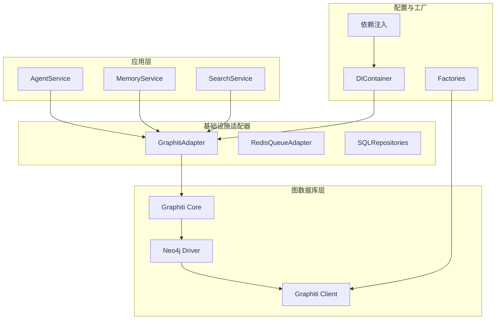
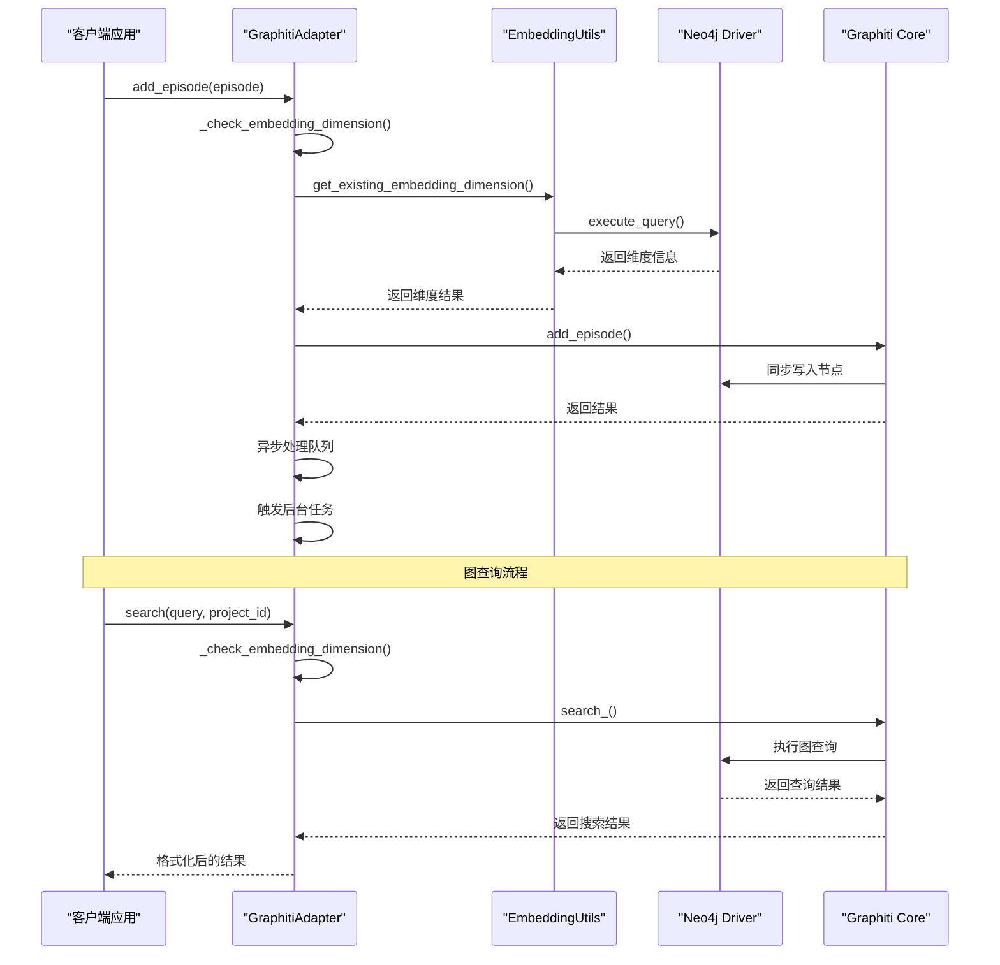
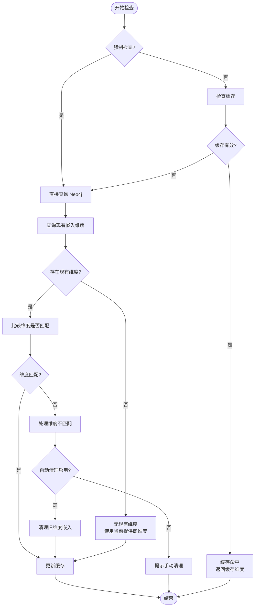
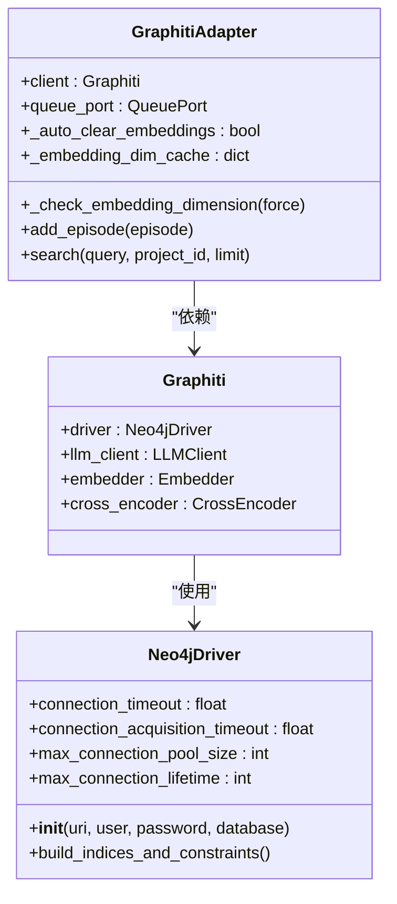
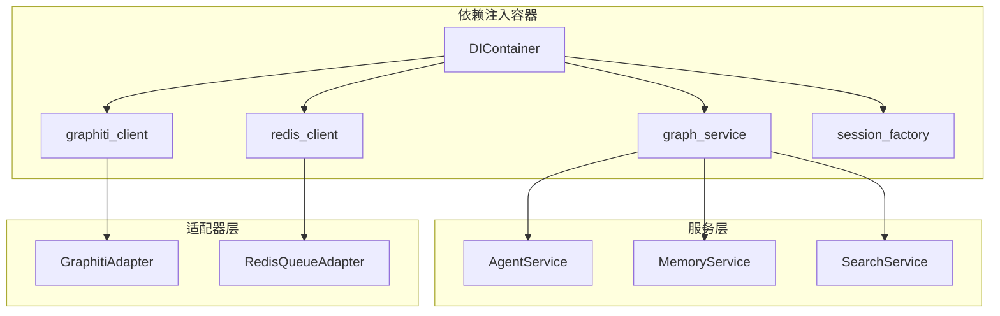

# Graphiti 图数据库集成

<cite>
**本文档引用的文件**
- [graphiti_adapter.py](file://src/infrastructure/adapters/secondary/graphiti/graphiti_adapter.py)
- [embedding_utils.py](file://src/infrastructure/adapters/secondary/graphiti/embedding_utils.py)
- [graph_service_port.py](file://src/domain/ports/services/graph_service_port.py)
- [graphiti.py](file://src/infrastructure/adapters/primary/web/routers/graphiti.py)
- [di_container.py](file://src/configuration/di_container.py)
- [factories.py](file://src/configuration/factories.py)
- [dependencies.py](file://src/infrastructure/adapters/primary/web/dependencies.py)
- [graphiti_service.py](file://src/server/services/graphiti_service.py)
- [test_graphiti_adapter_integration.py](file://src/tests/integration/test_graphiti_adapter_integration.py)
</cite>

## 目录
1. [简介](#简介)
2. [项目结构](#项目结构)
3. [核心组件](#核心组件)
4. [架构概览](#架构概览)
5. [详细组件分析](#详细组件分析)
6. [依赖关系分析](#依赖关系分析)
7. [性能考虑](#性能考虑)
8. [故障排除指南](#故障排除指南)
9. [结论](#结论)
10. [附录](#附录)

## 简介

Graphiti 是一个基于 Neo4j 的知识图谱引擎，为 memstack 提供强大的图数据库能力。本文档深入解析 GraphitiAdapter 类的设计架构和实现细节，涵盖图数据库连接配置、嵌入维度检查机制、缓存策略、初始化过程、连接池管理、错误处理机制、嵌入向量管理策略、图查询执行流程（同步和异步模式），以及具体的配置示例和最佳实践。

Graphiti 集成采用分层架构设计，通过适配器模式将底层图数据库操作抽象为统一的服务接口，支持多种 LLM 提供商的嵌入向量生成，并提供了完善的错误处理和性能优化机制。

## 项目结构

Graphiti 集成在项目中的组织结构如下：



**图表来源**
- [di_container.py](file://src/configuration/di_container.py#L108-L150)
- [factories.py](file://src/configuration/factories.py#L199-L222)

**章节来源**
- [di_container.py](file://src/configuration/di_container.py#L108-L150)
- [factories.py](file://src/configuration/factories.py#L199-L222)

## 核心组件

### GraphitiAdapter 类

GraphitiAdapter 是图数据库集成的核心适配器类，实现了 GraphServicePort 接口，提供统一的图数据库操作接口。

#### 主要特性

1. **嵌入维度检查机制**：通过缓存机制减少 Neo4j 查询次数
2. **异步处理支持**：支持同步和异步的图数据处理模式
3. **自动清理功能**：当检测到嵌入维度不匹配时自动清理过期数据
4. **错误处理**：完善的异常捕获和日志记录机制

#### 关键属性

- `client`: Graphiti 客户端实例
- `queue_port`: 队列服务端口，用于异步处理
- `_auto_clear_embeddings`: 自动清理嵌入向量的开关
- `_embedding_dim_cache`: 嵌入维度缓存，包含值和过期时间

**章节来源**
- [graphiti_adapter.py](file://src/infrastructure/adapters/secondary/graphiti/graphiti_adapter.py#L25-L37)

### 嵌入维度管理工具

embedding_utils 模块提供了完整的嵌入向量管理功能：

#### 核心功能

1. **维度检测**：检测 Neo4j 中现有嵌入向量的维度
2. **自动清理**：根据指定维度清理所有嵌入向量
3. **兼容性检查**：验证当前提供商与现有数据的兼容性
4. **批量重建**：为特定项目重建所有节点的嵌入向量

**章节来源**
- [embedding_utils.py](file://src/infrastructure/adapters/secondary/graphiti/embedding_utils.py#L32-L85)

## 架构概览

Graphiti 集成采用多层架构设计，确保了系统的可扩展性和可维护性：



**图表来源**
- [graphiti_adapter.py](file://src/infrastructure/adapters/secondary/graphiti/graphiti_adapter.py#L120-L187)
- [graphiti_adapter.py](file://src/infrastructure/adapters/secondary/graphiti/graphiti_adapter.py#L189-L222)

## 详细组件分析

### GraphitiAdapter 类详细分析

#### 初始化过程

GraphitiAdapter 的初始化过程包含以下关键步骤：

1. **参数验证**：接收 Graphiti 客户端实例、可选的队列端口和自动清理开关
2. **缓存初始化**：设置嵌入维度检查的缓存字典
3. **配置持久化**：保存客户端实例和队列端口引用

#### 嵌入维度检查机制



**图表来源**
- [graphiti_adapter.py](file://src/infrastructure/adapters/secondary/graphiti/graphiti_adapter.py#L38-L119)

#### 图查询执行流程

GraphitiAdapter 支持多种查询模式：

1. **同步查询**：直接调用 Graphiti 的搜索方法
2. **异步处理**：通过队列系统进行后台处理
3. **数据清理**：提供完整的图数据清理和重建功能

**章节来源**
- [graphiti_adapter.py](file://src/infrastructure/adapters/secondary/graphiti/graphiti_adapter.py#L189-L222)
- [graphiti_adapter.py](file://src/infrastructure/adapters/secondary/graphiti/graphiti_adapter.py#L224-L296)

### 嵌入向量管理策略

#### 维度兼容性检查

嵌入向量管理策略包含多层次的维度检查机制：

1. **启动时检查**：在 Graphiti 客户端创建时进行维度验证
2. **运行时检查**：每次图操作前检查嵌入维度兼容性
3. **缓存优化**：使用 10 秒 TTL 的缓存减少查询频率

#### 自动清理机制

当检测到嵌入维度不匹配时，系统会自动执行清理流程：

1. **维度检测**：确认现有嵌入的维度
2. **清理执行**：删除所有指定维度的嵌入向量
3. **缓存更新**：更新缓存以反映新的维度状态

**章节来源**
- [embedding_utils.py](file://src/infrastructure/adapters/secondary/graphiti/embedding_utils.py#L87-L142)
- [factories.py](file://src/configuration/factories.py#L327-L366)

### 连接池管理和超时配置

#### Neo4j 驱动器配置

Graphiti 集成通过工厂函数对 Neo4j 驱动器进行了增强配置：



**图表来源**
- [factories.py](file://src/configuration/factories.py#L66-L82)
- [graphiti_adapter.py](file://src/infrastructure/adapters/secondary/graphiti/graphiti_adapter.py#L25-L37)

#### 超时配置参数

- **连接超时**：10 秒
- **连接获取超时**：10 秒  
- **事务超时**：30 秒
- **最大连接池大小**：100
- **连接生命周期**：3600 秒

**章节来源**
- [factories.py](file://src/configuration/factories.py#L44-L48)
- [factories.py](file://src/configuration/factories.py#L66-L82)

## 依赖关系分析

### 依赖注入容器

DIContainer 提供了完整的依赖注入机制，确保各个组件之间的松耦合：



**图表来源**
- [di_container.py](file://src/configuration/di_container.py#L108-L150)

### 服务接口定义

GraphServicePort 定义了图数据库服务的标准接口：

| 方法 | 参数 | 返回值 | 描述 |
|------|------|--------|------|
| add_episode | Episode | Episode | 添加记忆片段到图数据库 |
| search | query: str, project_id: Optional[str], limit: int | List[Any] | 在图数据库中搜索相关内容 |
| get_graph_data | project_id: str, limit: int | Dict[str, Any] | 获取项目的图数据 |
| delete_episode | episode_name: str | bool | 删除指定名称的记忆片段 |
| delete_episode_by_memory_id | memory_id: str | bool | 根据记忆ID删除记忆片段 |
| remove_episode | episode_uuid: str | bool | 彻底移除记忆片段及其关联数据 |

**章节来源**
- [graph_service_port.py](file://src/domain/ports/services/graph_service_port.py#L7-L44)

## 性能考虑

### 缓存策略

GraphitiAdapter 实现了多层次的缓存机制来优化性能：

1. **嵌入维度缓存**：10 秒 TTL 的短期缓存
2. **查询结果缓存**：减少重复查询的开销
3. **连接池复用**：避免频繁创建和销毁数据库连接

### 异步处理模式

系统支持异步处理模式，通过队列服务实现后台任务处理：

- **异步添加**：记忆片段添加后立即返回，后台异步处理
- **后台索引构建**：在后台构建图数据库索引
- **批量数据处理**：支持批量数据的异步处理

### 连接池优化

通过合理的连接池配置，系统能够：

- **限制并发连接数**：防止数据库过载
- **重用连接**：减少连接建立的开销
- **自动清理**：定期清理空闲连接

## 故障排除指南

### 常见问题及解决方案

#### 嵌入维度不匹配

**问题描述**：切换 LLM 提供商后出现搜索失败

**解决方案**：
1. 检查嵌入维度配置是否正确
2. 使用自动清理功能清理旧维度数据
3. 验证新提供商的嵌入维度设置

#### 数据库连接问题

**问题描述**：无法连接到 Neo4j 数据库

**解决方案**：
1. 检查数据库连接参数配置
2. 验证网络连通性
3. 查看连接超时设置

#### 查询性能问题

**问题描述**：图查询响应缓慢

**解决方案**：
1. 检查数据库索引配置
2. 优化查询语句
3. 调整连接池大小

**章节来源**
- [graphiti_adapter.py](file://src/infrastructure/adapters/secondary/graphiti/graphiti_adapter.py#L117-L119)
- [factories.py](file://src/configuration/factories.py#L327-L366)

## 结论

Graphiti 图数据库集成为 memstack 提供了强大而灵活的知识图谱能力。通过精心设计的适配器架构、完善的嵌入向量管理机制、高效的缓存策略和健壮的错误处理，系统能够在保证性能的同时提供可靠的图数据库服务。

关键优势包括：
- **模块化设计**：清晰的分层架构便于维护和扩展
- **性能优化**：多层缓存和连接池优化提升系统性能
- **容错能力**：完善的错误处理和恢复机制
- **灵活性**：支持多种 LLM 提供商和配置选项

建议在生产环境中：
1. 正确配置嵌入维度和提供商设置
2. 监控缓存命中率和数据库性能
3. 定期备份图数据
4. 根据实际负载调整连接池参数

## 附录

### 配置示例

#### 基本配置

```python
# Graphiti 客户端配置
graphiti_config = {
    'neo4j_uri': 'bolt://localhost:7687',
    'neo4j_user': 'neo4j',
    'neo4j_password': 'password',
    'llm_provider': 'openai',
    'openai_api_key': 'your-api-key'
}

# 依赖注入配置
container = DIContainer(
    graph_service=GraphitiAdapter(client=graphiti_client),
    redis_client=redis_client,
    session_factory=session_factory
)
```

#### 最佳实践

1. **嵌入维度管理**：定期检查和验证嵌入维度一致性
2. **缓存策略**：根据使用模式调整缓存 TTL 和大小
3. **错误监控**：建立完善的日志和监控体系
4. **性能调优**：根据实际负载调整连接池和查询参数