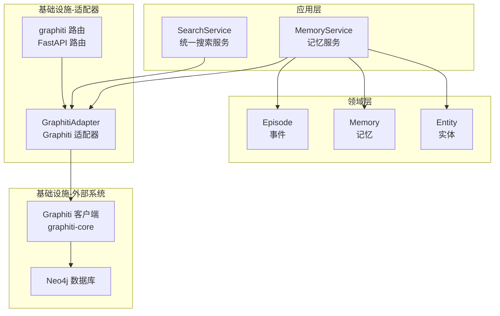
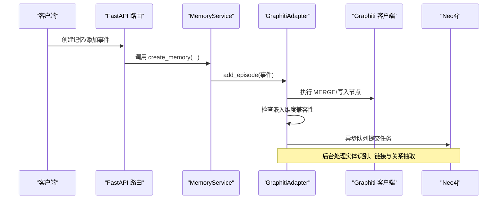
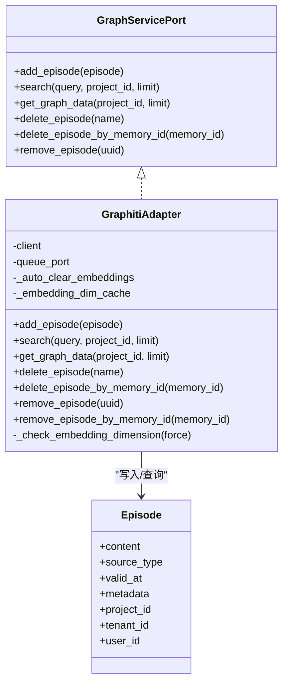
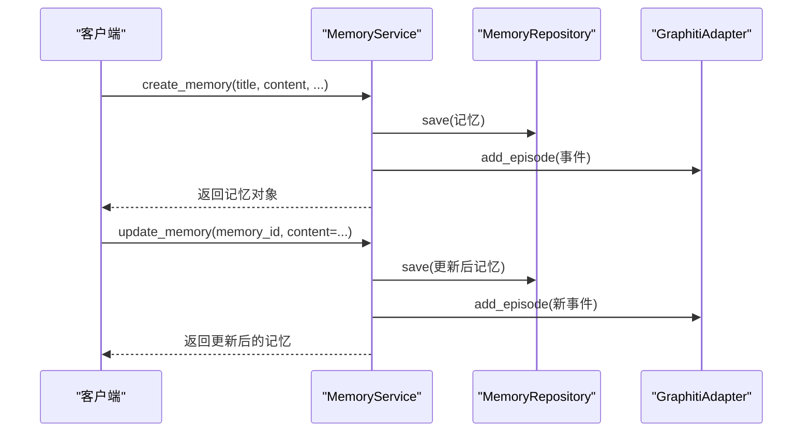
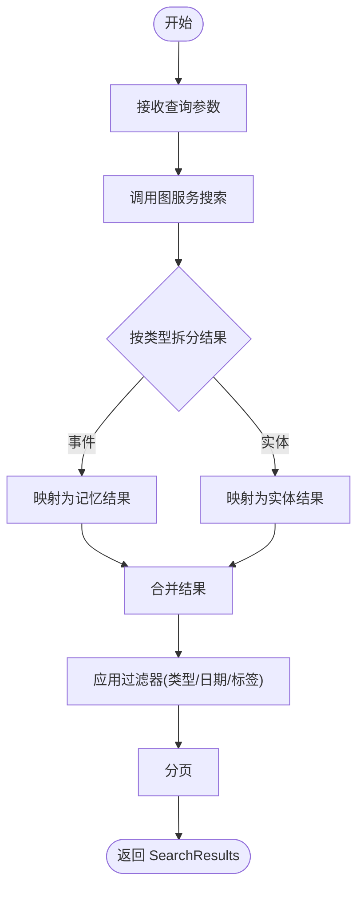
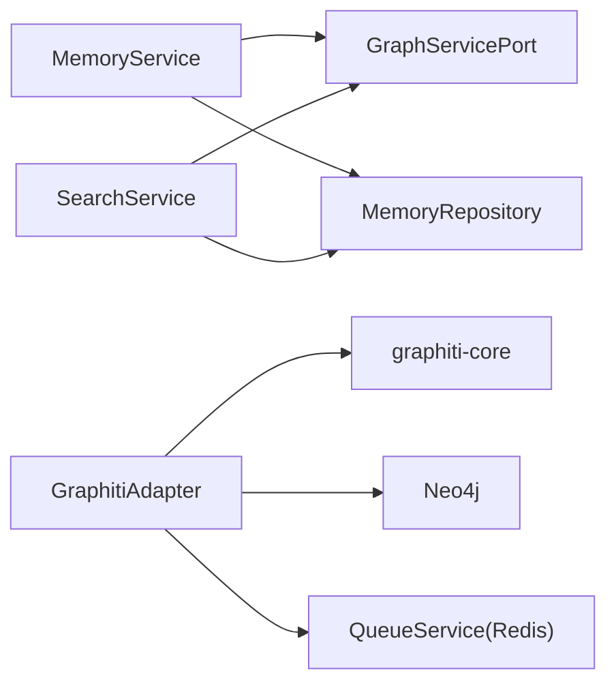

# 知识图谱系统

<cite>
**本文引用的文件**
- [src/server/services/graphiti_service.py](file://src/server/services/graphiti_service.py)
- [src/infrastructure/adapters/secondary/graphiti/graphiti_adapter.py](file://src/infrastructure/adapters/secondary/graphiti/graphiti_adapter.py)
- [src/domain/ports/services/graph_service_port.py](file://src/domain/ports/services/graph_service_port.py)
- [src/application/services/memory_service.py](file://src/application/services/memory_service.py)
- [src/application/services/search_service.py](file://src/application/services/search_service.py)
- [src/domain/model/memory/memory.py](file://src/domain/model/memory/memory.py)
- [src/domain/model/memory/episode.py](file://src/domain/model/memory/episode.py)
- [src/domain/model/memory/entity.py](file://src/domain/model/memory/entity.py)
- [src/infrastructure/adapters/primary/web/routers/graphiti.py](file://src/infrastructure/adapters/primary/web/routers/graphiti.py)
- [src/infrastructure/adapters/primary/web/main.py](file://src/infrastructure/adapters/primary/web/main.py)
- [src/configuration/config.py](file://src/configuration/config.py)
- [src/infrastructure/adapters/secondary/graphiti/embedding_utils.py](file://src/infrastructure/adapters/secondary/graphiti/embedding_utils.py)
</cite>

## 目录
1. [简介](#简介)
2. [项目结构](#项目结构)
3. [核心组件](#核心组件)
4. [架构总览](#架构总览)
5. [详细组件分析](#详细组件分析)
6. [依赖分析](#依赖分析)
7. [性能考虑](#性能考虑)
8. [故障排查指南](#故障排查指南)
9. [结论](#结论)
10. [附录：使用示例与接口说明](#附录使用示例与接口说明)

## 简介
本文件面向 MemStack 的知识图谱系统，聚焦 Graphiti 集成与知识图谱管理实现。内容涵盖：
- 图数据库连接配置与索引/约束管理策略
- 记忆管理系统（存储模型、实体识别与链接机制、关系抽取）
- 搜索系统（语义搜索、图查询优化、混合搜索策略）
- 知识图谱数据模型（节点类型、关系类型、索引策略）
- 图查询性能优化技巧与最佳实践
- 具体使用示例与 API 接口说明

## 项目结构
MemStack 采用分层与领域驱动设计（DDD）结合的六边形架构（Hexagonal），知识图谱能力通过 GraphitiAdapter 对接 graphiti-core，并在应用层提供统一的图服务接口。

图表来源
- [src/application/services/memory_service.py](file://src/application/services/memory_service.py#L35-L389)
- [src/application/services/search_service.py](file://src/application/services/search_service.py#L70-L375)
- [src/infrastructure/adapters/secondary/graphiti/graphiti_adapter.py](file://src/infrastructure/adapters/secondary/graphiti/graphiti_adapter.py#L25-L489)
- [src/infrastructure/adapters/primary/web/routers/graphiti.py](file://src/infrastructure/adapters/primary/web/routers/graphiti.py#L1-L758)

章节来源
- [src/infrastructure/adapters/primary/web/main.py](file://src/infrastructure/adapters/primary/web/main.py#L53-L133)
- [src/configuration/config.py](file://src/configuration/config.py#L10-L231)

## 核心组件
- GraphServicePort：定义图服务抽象接口（添加事件、搜索、图数据获取、删除事件等）。
- GraphitiAdapter：具体实现，封装 graphiti-core 客户端，负责嵌入维度检查、异步队列处理、Cypher 查询与清理逻辑。
- MemoryService：记忆管理业务服务，负责创建/更新/删除记忆，调用图服务添加事件并触发后台处理。
- SearchService：统一搜索服务，聚合图服务与内存仓库结果，支持过滤、分页与上下文图获取。
- 路由层 graphiti.py：提供社区、实体、图可视化等 API。
- 配置 config.py：提供 Neo4j 连接、LLM 提供商、并发与指标等配置项。

章节来源
- [src/domain/ports/services/graph_service_port.py](file://src/domain/ports/services/graph_service_port.py#L7-L44)
- [src/infrastructure/adapters/secondary/graphiti/graphiti_adapter.py](file://src/infrastructure/adapters/secondary/graphiti/graphiti_adapter.py#L25-L489)
- [src/application/services/memory_service.py](file://src/application/services/memory_service.py#L35-L389)
- [src/application/services/search_service.py](file://src/application/services/search_service.py#L70-L375)
- [src/infrastructure/adapters/primary/web/routers/graphiti.py](file://src/infrastructure/adapters/primary/web/routers/graphiti.py#L1-L758)
- [src/configuration/config.py](file://src/configuration/config.py#L10-L231)

## 架构总览
下图展示从应用到图数据库的关键交互路径，以及嵌入维度一致性保障与后台队列处理流程。

图表来源
- [src/application/services/memory_service.py](file://src/application/services/memory_service.py#L45-L129)
- [src/infrastructure/adapters/secondary/graphiti/graphiti_adapter.py](file://src/infrastructure/adapters/secondary/graphiti/graphiti_adapter.py#L120-L187)
- [src/infrastructure/adapters/primary/web/main.py](file://src/infrastructure/adapters/primary/web/main.py#L78-L102)

## 详细组件分析

### Graphiti 适配器（GraphitiAdapter）
- 职责
  - 将领域事件（Episode）写入图数据库，构建节点与初始关系。
  - 在首次使用时检查嵌入维度兼容性，必要时自动清理不匹配向量。
  - 支持搜索（混合检索）、图数据导出、事件删除与清理（含回退 Cypher 清理）。
- 关键流程
  - add_episode：MERGE 事件节点，设置属性与标签；若配置队列则投递异步任务。
  - search：使用混合检索配方（RRF）执行查询，返回事件与实体结果。
  - get_graph_data：按项目拉取节点与边，用于前端可视化。
  - remove_episode/remove_episode_by_memory_id：优先使用 graphiti-core 清理，失败时回退 Cypher 清理。
  - 嵌入维度检查：缓存最近维度检测结果，避免频繁查询；检测到不一致时可自动清理历史向量。

图表来源
- [src/domain/ports/services/graph_service_port.py](file://src/domain/ports/services/graph_service_port.py#L7-L44)
- [src/infrastructure/adapters/secondary/graphiti/graphiti_adapter.py](file://src/infrastructure/adapters/secondary/graphiti/graphiti_adapter.py#L25-L489)
- [src/domain/model/memory/episode.py](file://src/domain/model/memory/episode.py#L17-L29)

章节来源
- [src/infrastructure/adapters/secondary/graphiti/graphiti_adapter.py](file://src/infrastructure/adapters/secondary/graphiti/graphiti_adapter.py#L25-L489)
- [src/infrastructure/adapters/secondary/graphiti/embedding_utils.py](file://src/infrastructure/adapters/secondary/graphiti/embedding_utils.py#L32-L142)

### 记忆服务（MemoryService）
- 职责
  - 记忆的创建、读取、列表、更新、删除与共享。
  - 将记忆转换为 Episode 并交由图服务添加到图中，触发后台处理。
  - 更新内容时重新生成 Episode 并排队处理。
  - 删除记忆时调用图服务移除事件并清理图中孤儿节点与边。
- 关键流程
  - create_memory：持久化记忆 → 构造 Episode → add_episode → 记录日志。
  - search_memories：委托图服务进行语义搜索，拆分为记忆与实体两类结果。
  - update_memory：内容变更 → 更新状态 → 重新构造 Episode → add_episode。
  - delete_memory：remove_episode → 删除数据库记录 → 失败时告警但继续。

图表来源
- [src/application/services/memory_service.py](file://src/application/services/memory_service.py#L45-L129)
- [src/application/services/memory_service.py](file://src/application/services/memory_service.py#L214-L301)

章节来源
- [src/application/services/memory_service.py](file://src/application/services/memory_service.py#L35-L389)
- [src/domain/model/memory/memory.py](file://src/domain/model/memory/memory.py#L8-L31)
- [src/domain/model/memory/episode.py](file://src/domain/model/memory/episode.py#L17-L29)

### 统一搜索服务（SearchService）
- 职责
  - 聚合图服务与内存仓库结果，支持内容类型过滤、日期范围过滤、标签过滤、分页与图上下文获取。
- 关键流程
  - search：先图服务搜索（事件+实体），再按过滤器与分页组装结果。
  - get_graph_context：基于图数据生成实体邻域上下文。
  - get_recent_activity：统计近期记忆与图节点/边数量。

图表来源
- [src/application/services/search_service.py](file://src/application/services/search_service.py#L77-L161)
- [src/application/services/search_service.py](file://src/application/services/search_service.py#L254-L329)

章节来源
- [src/application/services/search_service.py](file://src/application/services/search_service.py#L70-L375)

### 路由层（graphiti.py）
- 职责
  - 提供社区、实体、图可视化与子图查询等 API。
  - 列表/详情/关系查询均基于 Cypher 查询图数据库。
- 关键端点
  - GET /api/v1/communities/：社区列表与计数。
  - GET /api/v1/entities/：实体列表与类型统计。
  - GET /api/v1/entities/{entity_id}/relationships：实体关系查询。
  - GET /api/v1/memory/graph：全图导出（可视化）。
  - POST /api/v1/memory/graph/subgraph：指定节点的子图导出。
  - POST /api/v1/communities/rebuild：社区重建（可后台执行）。

章节来源
- [src/infrastructure/adapters/primary/web/routers/graphiti.py](file://src/infrastructure/adapters/primary/web/routers/graphiti.py#L65-L758)

### 配置与启动（main.py、config.py）
- 启动阶段
  - 初始化数据库、默认凭据、默认 LLM 提供商。
  - 创建 Graphiti 客户端并构建索引与约束（超时保护）。
  - 创建 GraphitiAdapter 并注入容器，初始化队列服务与后台任务管理器。
- 关键配置
  - Neo4j 连接参数（URI、用户、密码）。
  - PostgreSQL 连接池与只读副本配置。
  - LLM 提供商选择与模型配置（Qwen、Gemini、OpenAI、DeepSeek、Z.AI）。
  - Graphiti 并发与队列批大小、嵌入自动清理开关。

章节来源
- [src/infrastructure/adapters/primary/web/main.py](file://src/infrastructure/adapters/primary/web/main.py#L53-L133)
- [src/configuration/config.py](file://src/configuration/config.py#L10-L231)

## 依赖分析
- 组件耦合
  - MemoryService 依赖 GraphServicePort 与 MemoryRepository，解耦了图服务与存储实现。
  - GraphitiAdapter 实现 GraphServicePort，向上提供统一接口，向下对接 graphiti-core 与 Neo4j。
  - SearchService 依赖 GraphServicePort 与 MemoryRepository，实现跨域聚合。
- 外部依赖
  - graphiti-core：图数据库操作与搜索。
  - Neo4j：图数据库。
  - Redis：队列服务（生产者模式）。
  - LLM 提供商 SDK：嵌入与重排序。

图表来源
- [src/application/services/memory_service.py](file://src/application/services/memory_service.py#L38-L43)
- [src/application/services/search_service.py](file://src/application/services/search_service.py#L73-L75)
- [src/infrastructure/adapters/secondary/graphiti/graphiti_adapter.py](file://src/infrastructure/adapters/secondary/graphiti/graphiti_adapter.py#L25-L36)

章节来源
- [src/domain/ports/services/graph_service_port.py](file://src/domain/ports/services/graph_service_port.py#L7-L44)
- [src/infrastructure/adapters/secondary/graphiti/graphiti_adapter.py](file://src/infrastructure/adapters/secondary/graphiti/graphiti_adapter.py#L25-L489)

## 性能考虑
- 嵌入维度一致性
  - 使用缓存减少重复检测开销；检测到不一致时自动清理历史向量，避免相似度计算失败。
  - 可配置自动清理开关，降低切换提供商带来的维护成本。
- 查询优化
  - 使用混合检索配方（RRF）提升召回与排序质量。
  - 图数据导出限制返回节点/边数量，避免大图一次性渲染导致性能问题。
  - 社区重建支持后台执行，避免阻塞请求。
- 并发与限流
  - Graphiti 并发信号量与最大异步工作线程限制，防止资源争用。
  - API 层启用速率限制中间件，按租户配置限流。
- 存储与索引
  - 启动阶段构建索引与约束，确保查询性能稳定。
  - PostgreSQL 连接池参数与只读副本配置，支撑高并发读取。

章节来源
- [src/infrastructure/adapters/secondary/graphiti/embedding_utils.py](file://src/infrastructure/adapters/secondary/graphiti/embedding_utils.py#L38-L119)
- [src/infrastructure/adapters/secondary/graphiti/graphiti_adapter.py](file://src/infrastructure/adapters/secondary/graphiti/graphiti_adapter.py#L189-L223)
- [src/infrastructure/adapters/primary/web/routers/graphiti.py](file://src/infrastructure/adapters/primary/web/routers/graphiti.py#L417-L501)
- [src/configuration/config.py](file://src/configuration/config.py#L160-L179)
- [src/infrastructure/adapters/primary/web/main.py](file://src/infrastructure/adapters/primary/web/main.py#L228-L238)

## 故障排查指南
- 图服务不可用
  - 启动阶段构建索引超时或连接失败：检查 Neo4j 是否运行、网络连通性与认证信息。
- 嵌入维度不一致
  - 报错提示维度不匹配：确认当前提供商与历史数据维度是否一致；开启自动清理开关以清除旧向量。
- 删除/清理异常
  - remove_episode 回退 Cypher 清理：注意潜在竞态条件；如需强一致，可在上层加事务控制。
- 搜索结果为空
  - 检查查询词是否过短、过滤条件是否过于严格；适当放宽 limit 或调整过滤器。
- 图数据过大
  - 导出接口默认限制数量；调大 limit 或分页获取。

章节来源
- [src/infrastructure/adapters/primary/web/main.py](file://src/infrastructure/adapters/primary/web/main.py#L82-L97)
- [src/infrastructure/adapters/secondary/graphiti/embedding_utils.py](file://src/infrastructure/adapters/secondary/graphiti/embedding_utils.py#L87-L142)
- [src/infrastructure/adapters/secondary/graphiti/graphiti_adapter.py](file://src/infrastructure/adapters/secondary/graphiti/graphiti_adapter.py#L340-L413)

## 结论
MemStack 的知识图谱系统通过 GraphitiAdapter 将领域事件无缝接入图数据库，配合统一的图服务接口与后台队列，实现了从“记忆”到“实体/关系”的自动化抽取与管理。系统在嵌入维度一致性、查询性能与可扩展性方面提供了完善的策略与工具，适合在多租户、高并发场景下稳定运行。

## 附录：使用示例与接口说明

### 图数据库连接与索引/约束
- 连接配置
  - Neo4j URI、用户、密码在配置中集中管理。
  - 启动时自动构建索引与约束，失败会快速报错并终止启动。
- 索引与约束
  - 通过 Graphiti 客户端在启动阶段完成，确保查询性能与数据完整性。

章节来源
- [src/configuration/config.py](file://src/configuration/config.py#L19-L34)
- [src/infrastructure/adapters/primary/web/main.py](file://src/infrastructure/adapters/primary/web/main.py#L82-L97)

### 记忆管理与实体识别/链接
- 创建记忆
  - 调用记忆服务创建记忆，内部生成 Episode 并写入图数据库，同时投递后台任务。
- 更新记忆
  - 内容变更将触发重新处理，生成新的 Episode。
- 删除记忆
  - 使用 remove_episode 清理事件及其关联的孤儿实体与边。

章节来源
- [src/application/services/memory_service.py](file://src/application/services/memory_service.py#L45-L129)
- [src/application/services/memory_service.py](file://src/application/services/memory_service.py#L214-L301)
- [src/infrastructure/adapters/secondary/graphiti/graphiti_adapter.py](file://src/infrastructure/adapters/secondary/graphiti/graphiti_adapter.py#L324-L413)

### 搜索系统与混合策略
- 语义搜索
  - 使用混合检索配方（RRF）整合多种信号，提高召回质量。
- 统一搜索
  - 聚合图服务与内存仓库结果，支持内容类型、日期范围、标签过滤与分页。
- 图上下文
  - 获取实体的邻域图，辅助理解上下文与关系。

章节来源
- [src/infrastructure/adapters/secondary/graphiti/graphiti_adapter.py](file://src/infrastructure/adapters/secondary/graphiti/graphiti_adapter.py#L189-L223)
- [src/application/services/search_service.py](file://src/application/services/search_service.py#L77-L161)
- [src/application/services/search_service.py](file://src/application/services/search_service.py#L254-L329)

### 知识图谱数据模型
- 节点类型
  - Episodic：事件/记忆节点，包含名称、内容、来源描述、时间戳、项目/租户/用户标识等。
  - Entity：实体节点，包含名称、类型、摘要、属性等。
  - Community：社区节点，包含成员计数、摘要等。
- 关系类型
  - MENTIONS：事件与实体之间的提及关系。
  - HAS_MEMBER：社区与成员实体的关系。
  - RELATES_TO：实体与实体之间的关系（用于实体间链接）。
- 索引策略
  - 启动阶段建立索引与约束，保证查询效率与数据一致性。

章节来源
- [src/domain/model/memory/episode.py](file://src/domain/model/memory/episode.py#L17-L29)
- [src/domain/model/memory/entity.py](file://src/domain/model/memory/entity.py#L8-L20)
- [src/infrastructure/adapters/primary/web/routers/graphiti.py](file://src/infrastructure/adapters/primary/web/routers/graphiti.py#L417-L501)

### API 接口速览
- 社区
  - GET /api/v1/communities/：社区列表（支持最小成员数与项目过滤）
  - GET /api/v1/communities/{community_id}：社区详情
  - GET /api/v1/communities/{community_id}/members：社区成员
  - POST /api/v1/communities/rebuild：重建社区（支持后台执行）
- 实体
  - GET /api/v1/entities/：实体列表（支持类型与项目过滤）
  - GET /api/v1/entities/types：实体类型统计
  - GET /api/v1/entities/{entity_id}：实体详情
  - GET /api/v1/entities/{entity_id}/relationships：实体关系
- 图数据
  - GET /api/v1/memory/graph：全图导出（可视化）
  - POST /api/v1/memory/graph/subgraph：子图导出

章节来源
- [src/infrastructure/adapters/primary/web/routers/graphiti.py](file://src/infrastructure/adapters/primary/web/routers/graphiti.py#L65-L758)