# Docker 部署

<cite>
**本文档引用的文件**
- [docker-compose.yml](file://docker-compose.yml)
- [.env.example](file://.env.example)
- [README.md](file://README.md)
- [Makefile](file://Makefile)
- [Dockerfile](file://Dockerfile)
- [src/configuration/config.py](file://src/configuration/config.py)
- [k8s/README.md](file://k8s/README.md)
- [k8s/configmap.yaml](file://k8s/configmap.yaml)
- [k8s/api-deployment.yaml](file://k8s/api-deployment.yaml)
- [k8s/worker-deployment.yaml](file://k8s/worker-deployment.yaml)
- [k8s/prometheus-service-monitor.yaml](file://k8s/prometheus-service-monitor.yaml)
</cite>

## 目录
1. [简介](#简介)
2. [项目结构概览](#项目结构概览)
3. [核心组件架构](#核心组件架构)
4. [Docker Compose 配置详解](#docker-compose-配置详解)
5. [环境变量配置](#环境变量配置)
6. [数据卷挂载与持久化](#数据卷挂载与持久化)
7. [健康检查机制](#健康检查机制)
8. [单机部署指南](#单机部署指南)
9. [开发环境配置](#开发环境配置)
10. [生产环境最佳实践](#生产环境最佳实践)
11. [性能优化建议](#性能优化建议)
12. [常见问题排查](#常见问题排查)
13. [故障排除指南](#故障排除指南)
14. [总结](#总结)

## 简介

MemStack 是一个企业级 AI 代理平台，采用渐进式能力组合架构设计。本项目提供了完整的 Docker 容器化部署方案，支持单机部署和生产环境部署，涵盖图数据库、元数据存储、缓存系统和监控体系的完整配置。

MemStack 的核心技术栈包括：
- **后端**: Python 3.10+, FastAPI 0.110+, 基于领域驱动设计的六边形架构
- **前端**: React 19.2+, TypeScript 5.9+, Vite 6.3+
- **数据库**: Neo4j 5.26+ (知识图谱), PostgreSQL 16+ (元数据存储)
- **缓存**: Redis 7+ (高性能缓存)
- **监控**: Prometheus + Grafana (指标收集与可视化)

## 项目结构概览

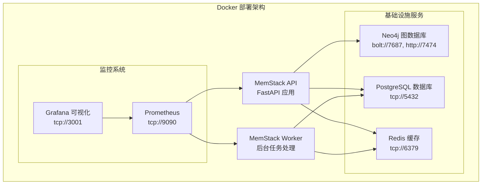
```mermaid
graph TB
subgraph "Docker 部署架构"
API[MemStack API<br/>FastAPI 应用]
WORKER[MemStack Worker<br/>后台任务处理]
subgraph "基础设施服务"
NEO4J[Neo4j 图数据库<br/>bolt://7687, http://7474]
POSTGRES[PostgreSQL 数据库<br/>tcp://5432]
REDIS[Redis 缓存<br/>tcp://6379]
end
subgraph "监控系统"
PROM[Prometheus<br/>tcp://9090]
GRAFANA[Grafana 可视化<br/>tcp://3001]
end
end
API --> NEO4J
API --> POSTGRES
API --> REDIS
WORKER --> REDIS
WORKER --> POSTGRES
PROM --> API
PROM --> WORKER
GRAFANA --> PROM
```

**图表来源**
- [docker-compose.yml](file://docker-compose.yml#L1-L109)

## 核心组件架构

### 服务组件关系

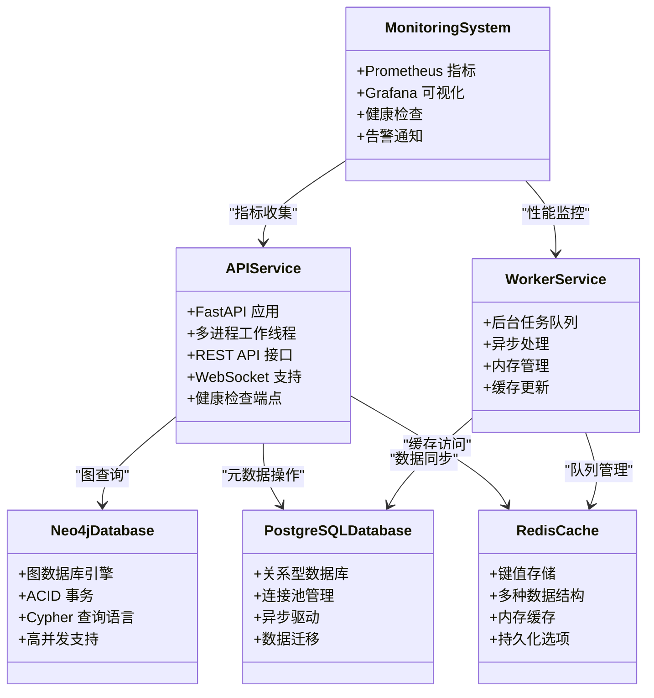
```mermaid
classDiagram
class APIService {
+FastAPI 应用
+多进程工作线程
+REST API 接口
+WebSocket 支持
+健康检查端点
}
class WorkerService {
+后台任务队列
+异步处理
+内存管理
+缓存更新
}
class Neo4jDatabase {
+图数据库引擎
+ACID 事务
+Cypher 查询语言
+高并发支持
}
class PostgreSQLDatabase {
+关系型数据库
+连接池管理
+异步驱动
+数据迁移
}
class RedisCache {
+键值存储
+多种数据结构
+内存缓存
+持久化选项
}
class MonitoringSystem {
+Prometheus 指标
+Grafana 可视化
+健康检查
+告警通知
}
APIService --> Neo4jDatabase : "图查询"
APIService --> PostgreSQLDatabase : "元数据操作"
APIService --> RedisCache : "缓存访问"
WorkerService --> RedisCache : "队列管理"
WorkerService --> PostgreSQLDatabase : "数据同步"
MonitoringSystem --> APIService : "指标收集"
MonitoringSystem --> WorkerService : "性能监控"
```

**图表来源**
- [docker-compose.yml](file://docker-compose.yml#L1-L109)
- [src/configuration/config.py](file://src/configuration/config.py#L10-L230)

## Docker Compose 配置详解

### Neo4j 图数据库配置

Neo4j 是 MemStack 的核心图数据库，用于存储知识图谱和实体关系。

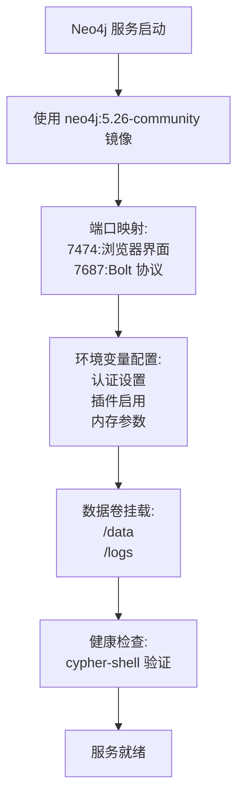
```mermaid
flowchart TD
START[Neo4j 服务启动] --> IMAGE[使用 neo4j:5.26-community 镜像]
IMAGE --> PORTS[端口映射:<br/>7474:浏览器界面<br/>7687:Bolt 协议]
PORTS --> ENV[环境变量配置:<br/>认证设置<br/>插件启用<br/>内存参数]
ENV --> VOLUMES[数据卷挂载:<br/>/data<br/>/logs]
VOLUMES --> HEALTH[健康检查:<br/>cypher-shell 验证]
HEALTH --> READY[服务就绪]
```

**图表来源**
- [docker-compose.yml](file://docker-compose.yml#L3-L28)

关键配置要点：
- **认证**: 默认用户名密码配置，生产环境必须修改
- **插件**: 启用 APOC 扩展用于高级图算法
- **内存**: 增加堆大小到 4GB，页面缓存 1GB
- **健康检查**: 使用 cypher-shell 进行数据库连通性验证

### PostgreSQL 元数据存储配置

PostgreSQL 负责存储所有结构化元数据和用户信息。

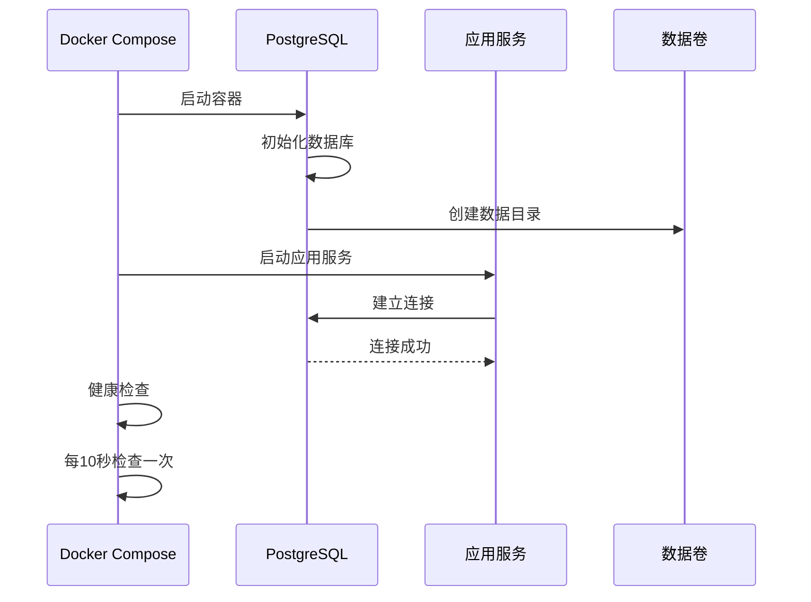
```mermaid
sequenceDiagram
participant DC as Docker Compose
participant PG as PostgreSQL
participant APP as 应用服务
participant VOL as 数据卷
DC->>PG : 启动容器
PG->>PG : 初始化数据库
PG->>VOL : 创建数据目录
DC->>APP : 启动应用服务
APP->>PG : 建立连接
PG-->>APP : 连接成功
DC->>DC : 健康检查
DC->>DC : 每10秒检查一次
```

**图表来源**
- [docker-compose.yml](file://docker-compose.yml#L30-L46)

配置特点：
- **版本**: 使用 alpine 版本减少镜像大小
- **连接池**: 生产环境推荐 20-40 的连接池配置
- **健康检查**: 使用 pg_isready 进行数据库可用性检测

### Redis 缓存系统配置

Redis 提供高性能的缓存和队列功能。

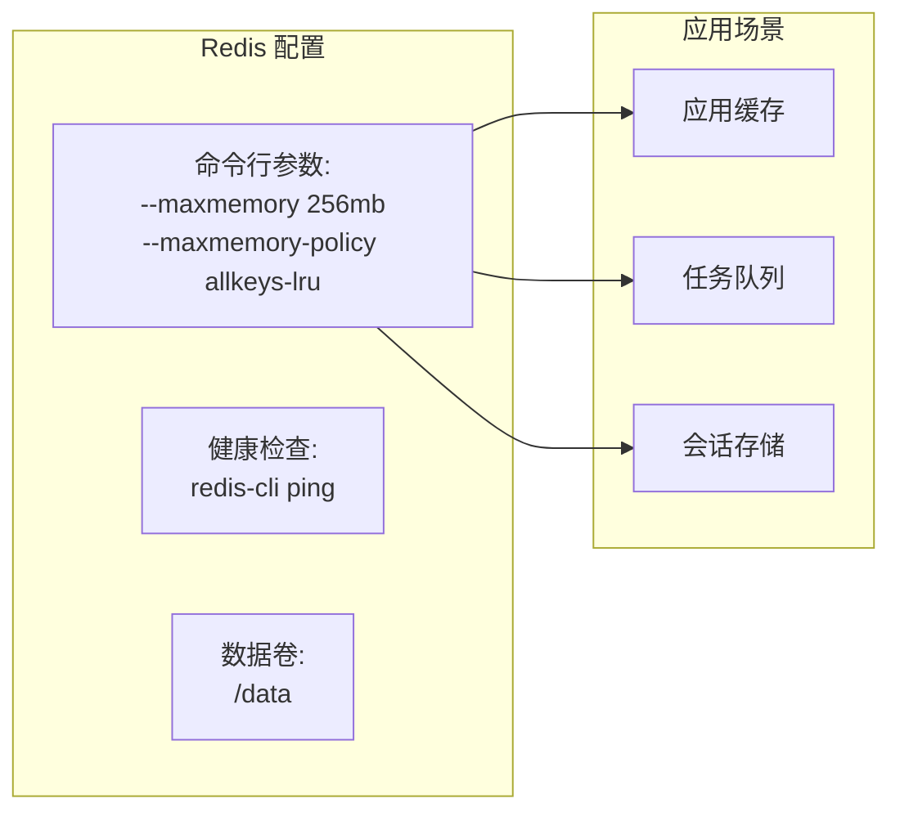
```mermaid
graph LR
subgraph "Redis 配置"
CMD[命令行参数:<br/>--maxmemory 256mb<br/>--maxmemory-policy allkeys-lru]
HC[健康检查:<br/>redis-cli ping]
VOL[数据卷:<br/>/data]
end
subgraph "应用场景"
CACHE[应用缓存]
QUEUE[任务队列]
SESSION[会话存储]
end
CMD --> CACHE
CMD --> QUEUE
CMD --> SESSION
```

**图表来源**
- [docker-compose.yml](file://docker-compose.yml#L48-L62)

### 监控系统配置

Prometheus 和 Grafana 提供完整的监控解决方案。

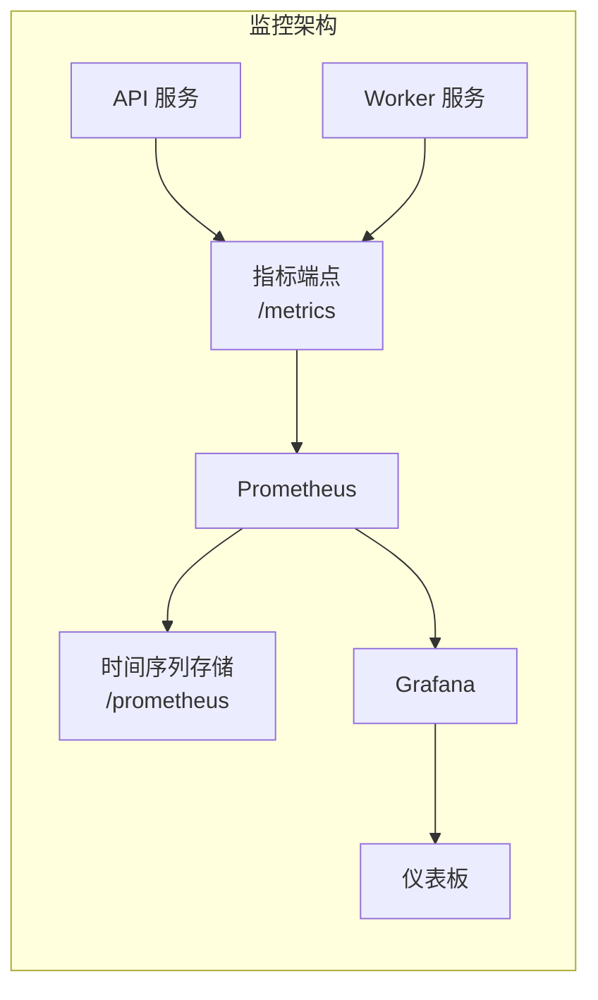
```mermaid
flowchart LR
subgraph "监控架构"
API[API 服务] --> METRICS[指标端点<br/>/metrics]
WORKER[Worker 服务] --> METRICS
METRICS --> PROM[Prometheus]
PROM --> STORE[时间序列存储<br/>/prometheus]
PROM --> GRAFANA[Grafana]
GRAFANA --> DASH[仪表板]
end
```

**图表来源**
- [docker-compose.yml](file://docker-compose.yml#L64-L100)

## 环境变量配置

### 后端服务配置

MemStack 使用 Pydantic 设置类管理所有环境变量配置。

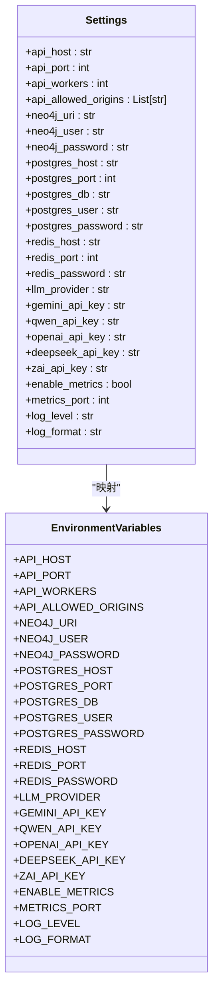
```mermaid
classDiagram
class Settings {
+api_host : str
+api_port : int
+api_workers : int
+api_allowed_origins : List[str]
+neo4j_uri : str
+neo4j_user : str
+neo4j_password : str
+postgres_host : str
+postgres_port : int
+postgres_db : str
+postgres_user : str
+postgres_password : str
+redis_host : str
+redis_port : int
+redis_password : str
+llm_provider : str
+gemini_api_key : str
+qwen_api_key : str
+openai_api_key : str
+deepseek_api_key : str
+zai_api_key : str
+enable_metrics : bool
+metrics_port : int
+log_level : str
+log_format : str
}
class EnvironmentVariables {
+API_HOST
+API_PORT
+API_WORKERS
+API_ALLOWED_ORIGINS
+NEO4J_URI
+NEO4J_USER
+NEO4J_PASSWORD
+POSTGRES_HOST
+POSTGRES_PORT
+POSTGRES_DB
+POSTGRES_USER
+POSTGRES_PASSWORD
+REDIS_HOST
+REDIS_PORT
+REDIS_PASSWORD
+LLM_PROVIDER
+GEMINI_API_KEY
+QWEN_API_KEY
+OPENAI_API_KEY
+DEEPSEEK_API_KEY
+ZAI_API_KEY
+ENABLE_METRICS
+METRICS_PORT
+LOG_LEVEL
+LOG_FORMAT
}
Settings --> EnvironmentVariables : "映射"
```

**图表来源**
- [src/configuration/config.py](file://src/configuration/config.py#L10-L230)
- [.env.example](file://.env.example#L1-L158)

### 关键配置项说明

#### API 服务器配置
- **API_HOST**: 0.0.0.0 (允许外部访问)
- **API_PORT**: 8000 (默认 API 端口)
- **API_WORKERS**: 4 (多进程工作线程数)
- **API_ALLOWED_ORIGINS**: "*" (跨域配置)

#### 数据库连接配置
- **NEO4J_URI**: bolt://localhost:7688 (图数据库连接)
- **POSTGRES_HOST**: localhost (PostgreSQL 主机)
- **REDIS_HOST**: localhost (Redis 主机)

#### LLM 提供商配置
支持多家 LLM 提供商，包括 Google Gemini、阿里云 Qwen、OpenAI、Deepseek 和 ZhipuAI。

#### 监控配置
- **ENABLE_METRICS**: true (启用指标收集)
- **METRICS_PORT**: 9090 (Prometheus 端口)
- **LOG_LEVEL**: INFO (日志级别)
- **LOG_FORMAT**: json (日志格式)

**章节来源**
- [src/configuration/config.py](file://src/configuration/config.py#L10-L230)
- [.env.example](file://.env.example#L1-L158)

## 数据卷挂载与持久化

### 数据卷设计原则

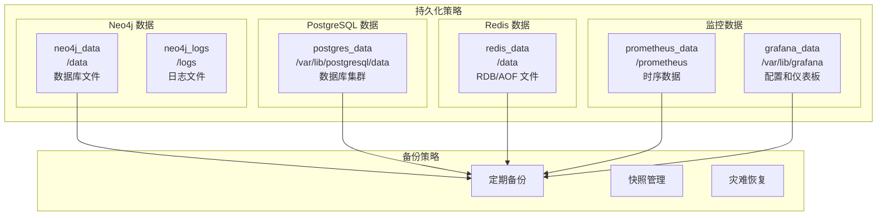
```mermaid
graph TB
subgraph "持久化策略"
subgraph "Neo4j 数据"
NDATA[neo4j_data<br/>/data<br/>数据库文件]
NLOGS[neo4j_logs<br/>/logs<br/>日志文件]
end
subgraph "PostgreSQL 数据"
PDATA[postgres_data<br/>/var/lib/postgresql/data<br/>数据库集群]
end
subgraph "Redis 数据"
RDATA[redis_data<br/>/data<br/>RDB/AOF 文件]
end
subgraph "监控数据"
PMETRICS[prometheus_data<br/>/prometheus<br/>时序数据]
GDATAS[grafana_data<br/>/var/lib/grafana<br/>配置和仪表板]
end
end
subgraph "备份策略"
BACKUP[定期备份]
SNAPSHOT[快照管理]
RECOVERY[灾难恢复]
end
NDATA --> BACKUP
PDATA --> BACKUP
RDATA --> BACKUP
PMETRICS --> BACKUP
GDATAS --> BACKUP
```

**图表来源**
- [docker-compose.yml](file://docker-compose.yml#L102-L109)

### 数据卷挂载配置

每个服务的数据卷配置都遵循以下原则：
- **独立命名空间**: 每个服务使用独立的数据卷
- **持久化存储**: 所有状态数据都映射到宿主机
- **权限控制**: 容器内用户具有适当的文件系统权限
- **备份友好**: 数据目录结构清晰，便于备份和恢复

**章节来源**
- [docker-compose.yml](file://docker-compose.yml#L17-L18)
- [docker-compose.yml](file://docker-compose.yml#L40-L41)
- [docker-compose.yml](file://docker-compose.yml#L56-L57)
- [docker-compose.yml](file://docker-compose.yml#L71-L72)
- [docker-compose.yml](file://docker-compose.yml#L94-L95)

## 健康检查机制

### 健康检查设计

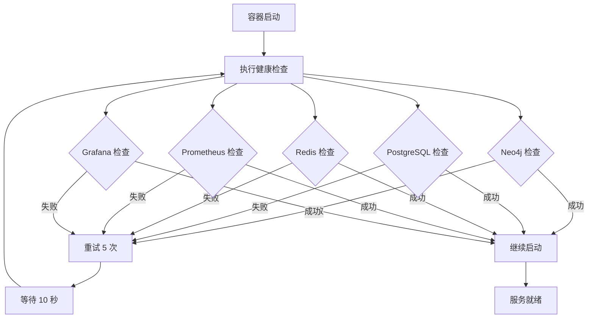
```mermaid
flowchart TD
START[容器启动] --> CHECK[执行健康检查]
CHECK --> NEOSVC{Neo4j 检查}
CHECK --> PGSCV{PostgreSQL 检查}
CHECK --> REDISC{Redis 检查}
CHECK --> PROMSC{Prometheus 检查}
CHECK --> GRAFSC{Grafana 检查}
NEOSVC --> |失败| RETRY[重试 5 次]
PGSCV --> |失败| RETRY
REDISC --> |失败| RETRY
PROMSC --> |失败| RETRY
GRAFSC --> |失败| RETRY
RETRY --> WAIT[等待 10 秒]
WAIT --> CHECK
NEOSVC --> |成功| NEXT[继续启动]
PGSCV --> |成功| NEXT
REDISC --> |成功| NEXT
PROMSC --> |成功| NEXT
GRAFSC --> |成功| NEXT
NEXT --> READY[服务就绪]
```

**图表来源**
- [docker-compose.yml](file://docker-compose.yml#L20-L28)
- [docker-compose.yml](file://docker-compose.yml#L42-L46)
- [docker-compose.yml](file://docker-compose.yml#L58-L62)
- [docker-compose.yml](file://docker-compose.yml#L78-L82)
- [docker-compose.yml](file://docker-compose.yml#L96-L100)

### 健康检查实现细节

#### Neo4j 健康检查
- **检查方式**: 使用 cypher-shell 执行 RETURN 1 查询
- **重试次数**: 5 次
- **间隔时间**: 10 秒
- **超时时间**: 5 秒

#### PostgreSQL 健康检查
- **检查方式**: 使用 pg_isready 工具
- **检查内容**: 数据库连接可用性
- **重试策略**: 与 Neo4j 相同

#### Redis 健康检查
- **检查方式**: redis-cli ping 命令
- **适用场景**: 缓存服务可用性检测

#### 监控系统健康检查
- **Prometheus**: 检查 /-/healthy 端点
- **Grafana**: 检查 /api/health 端点

**章节来源**
- [docker-compose.yml](file://docker-compose.yml#L20-L28)
- [docker-compose.yml](file://docker-compose.yml#L42-L46)
- [docker-compose.yml](file://docker-compose.yml#L58-L62)
- [docker-compose.yml](file://docker-compose.yml#L78-L82)
- [docker-compose.yml](file://docker-compose.yml#L96-L100)

## 单机部署指南

### 系统要求

在开始部署之前，请确保满足以下最低系统要求：

- **硬件**: 至少 8GB RAM，100GB 硬盘空间
- **操作系统**: Linux/macOS/Windows (WSL2)
- **Docker**: Docker Engine 20.10+，Docker Compose 2.0+
- **网络**: 开放必要的端口 (8000, 7474, 7687, 5432, 6379, 9090, 3001)

### 快速开始步骤

```bash
# 1. 克隆项目仓库
git clone https://github.com/s1366560/memstack.git
cd memstack

# 2. 复制环境配置模板
cp .env.example .env

# 3. 编辑 .env 文件，设置生产环境配置
nano .env

# 4. 启动所有服务
docker-compose up -d

# 5. 查看服务状态
docker-compose ps

# 6. 查看服务日志
docker-compose logs -f
```

### 端口映射说明

| 服务 | 容器端口 | 主机端口 | 用途 |
|------|----------|----------|------|
| API 服务 | 8000 | 8000 | REST API 和 WebSocket |
| Neo4j 浏览器 | 7474 | 7474 | 图数据库管理界面 |
| Neo4j Bolt | 7687 | 7688 | 图数据库连接协议 |
| PostgreSQL | 5432 | 5433 | 数据库连接 |
| Redis | 6379 | 6380 | 缓存和队列 |
| Prometheus | 9090 | 9090 | 指标收集 |
| Grafana | 3000 | 3001 | 监控可视化 |

### 初次运行配置

```bash
# 1. 访问 API 文档
open http://localhost:8000/docs

# 2. 获取默认 API 密钥
# 在服务器启动日志中查找
# "Generated default API key: ms_sk_..."

# 3. 首次数据库初始化
make db-init
make db-schema
make db-init-data
```

**章节来源**
- [README.md](file://README.md#L166-L185)
- [README.md](file://README.md#L187-L199)
- [Makefile](file://Makefile#L271-L285)

## 开发环境配置

### 开发工具链

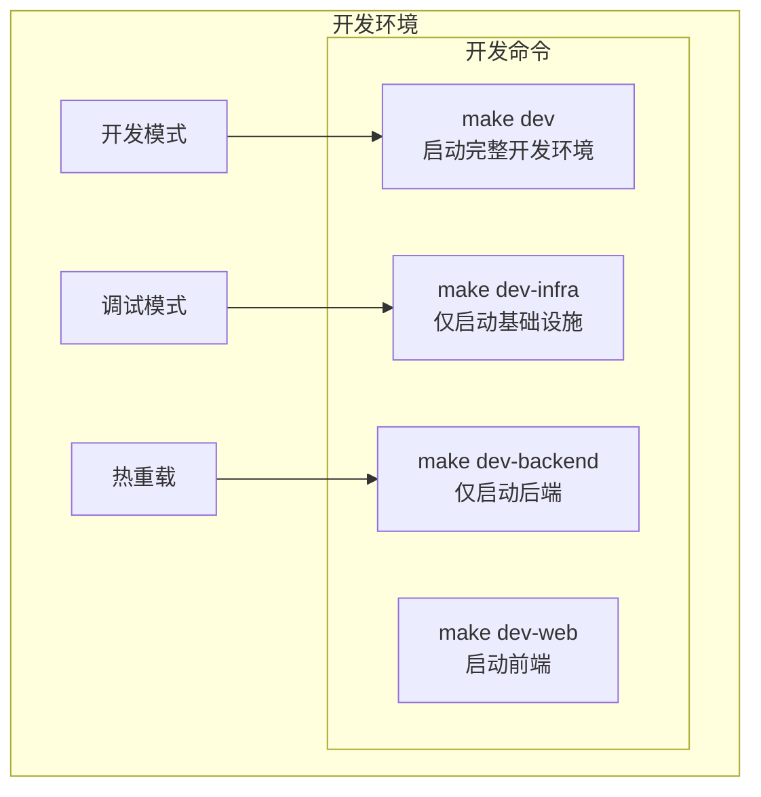
```mermaid
graph TB
subgraph "开发环境"
DEV[开发模式]
DEBUG[调试模式]
HOT[热重载]
subgraph "开发命令"
MAKEDEV[make dev<br/>启动完整开发环境]
MAKEINFRA[make dev-infra<br/>仅启动基础设施]
MAKEBACK[make dev-backend<br/>仅启动后端]
MAKEWEB[make dev-web<br/>启动前端]
end
DEV --> MAKEDEV
DEBUG --> MAKEINFRA
HOT --> MAKEBACK
end
```

**图表来源**
- [Makefile](file://Makefile#L121-L172)

### 开发环境启动流程

```bash
# 1. 启动基础设施服务
make dev-infra

# 2. 启动后端 API 服务
make dev-backend

# 3. 启动前端开发服务器
make dev-web

# 4. 查看日志
make dev-logs
```

### 开发环境特性

- **热重载**: 后端代码变更自动重启
- **实时日志**: 集中查看所有服务日志
- **快速迭代**: 分模块启动，提高开发效率
- **测试集成**: 内置测试命令和覆盖率报告

**章节来源**
- [Makefile](file://Makefile#L121-L172)
- [Makefile](file://Makefile#L153-L163)

## 生产环境最佳实践

### Kubernetes 部署架构

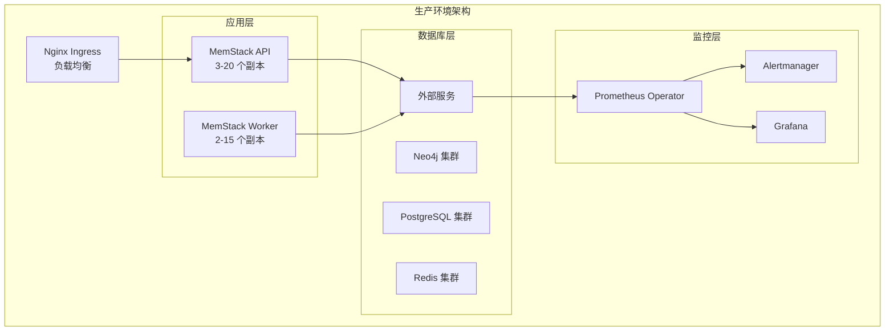
```mermaid
graph TB
subgraph "生产环境架构"
INGRESS[Nginx Ingress<br/>负载均衡]
subgraph "应用层"
APISVC[MemStack API<br/>3-20 个副本]
WORKERSVC[MemStack Worker<br/>2-15 个副本]
end
subgraph "数据库层"
EXTERNAL[外部服务]
NEO4J[Neo4j 集群]
POSTGRES[PostgreSQL 集群]
REDIS[Redis 集群]
end
subgraph "监控层"
PROMOP[Prometheus Operator]
ALERT[Alertmanager]
GRAFANA[Grafana]
end
end
INGRESS --> APISVC
APISVC --> EXTERNAL
WORKERSVC --> EXTERNAL
EXTERNAL --> PROMOP
PROMOP --> ALERT
PROMOP --> GRAFANA
```

**图表来源**
- [k8s/README.md](file://k8s/README.md#L67-L93)

### 资源配额配置

| 组件 | CPU 请求 | CPU 限制 | 内存请求 | 内存限制 |
|------|----------|----------|----------|----------|
| API 服务 | 500m | 2000m | 512Mi | 2Gi |
| Worker 服务 | 500m | 2000m | 512Mi | 2Gi |
| Neo4j | 2000m | 4000m | 4Gi | 8Gi |
| PostgreSQL | 1000m | 2000m | 2Gi | 4Gi |
| Redis | 250m | 500m | 512Mi | 1Gi |

### 自动扩缩容配置

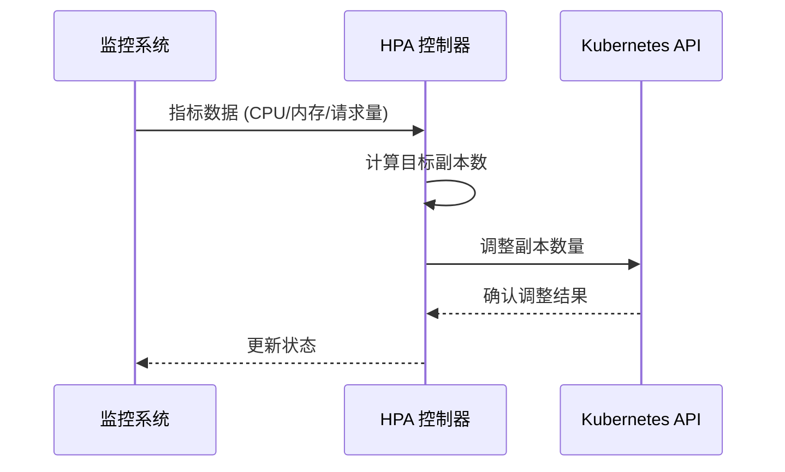
```mermaid
sequenceDiagram
participant MON as 监控系统
participant HPA as HPA 控制器
participant K8S as Kubernetes API
MON->>HPA : 指标数据 (CPU/内存/请求量)
HPA->>HPA : 计算目标副本数
HPA->>K8S : 调整副本数量
K8S-->>HPA : 确认调整结果
HPA-->>MON : 更新状态
```

**图表来源**
- [k8s/README.md](file://k8s/README.md#L95-L111)

### 高可用配置

- **Pod 中断预算**: 确保服务可用性
- **节点亲和性**: 优化资源分布
- **滚动更新**: 无停机升级
- **健康检查**: 自动故障转移

**章节来源**
- [k8s/README.md](file://k8s/README.md#L1-L159)
- [k8s/configmap.yaml](file://k8s/configmap.yaml#L1-L50)
- [k8s/api-deployment.yaml](file://k8s/api-deployment.yaml#L1-L59)
- [k8s/worker-deployment.yaml](file://k8s/worker-deployment.yaml#L1-L58)

## 性能优化建议

### 数据库性能调优

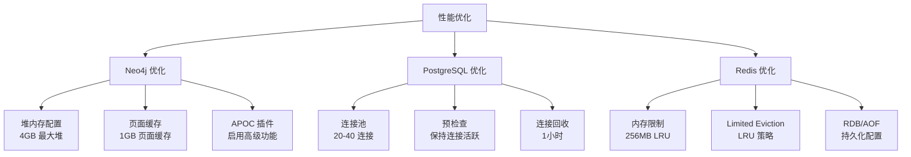
```mermaid
flowchart TD
START[性能优化] --> NEO4J[Neo4j 优化]
START --> POSTGRES[PostgreSQL 优化]
START --> REDIS[Redis 优化]
NEO4J --> HEAP[堆内存配置<br/>4GB 最大堆]
NEO4J --> PAGECACHE[页面缓存<br/>1GB 页面缓存]
NEO4J --> PLUGINS[APOC 插件<br/>启用高级功能]
POSTGRES --> POOL[连接池<br/>20-40 连接]
POSTGRES --> PREPING[预检查<br/>保持连接活跃]
POSTGRES --> RECYCLE[连接回收<br/>1小时]
REDIS --> MEMORY[内存限制<br/>256MB LRU]
REDIS --> POLICY[Limited Eviction<br/>LRU 策略]
REDIS --> SAVE[RDB/AOF<br/>持久化配置]
```

**图表来源**
- [docker-compose.yml](file://docker-compose.yml#L13-L16)
- [docker-compose.yml](file://docker-compose.yml#L54-L55)
- [.env.example](file://.env.example#L39-L43)

### 缓存策略优化

#### LLM 缓存配置
- **缓存启用**: LLM_CACHE_ENABLED=true
- **TTL 设置**: LLM_CACHE_TTL=3600 秒
- **超时配置**: LLM_TIMEOUT=60 秒

#### Web 搜索缓存
- **缓存 TTL**: WEB_SEARCH_CACHE_TTL=3600 秒
- **缓存键**: 基于查询内容的哈希值
- **缓存失效**: 自动过期和手动清理

### 监控指标优化

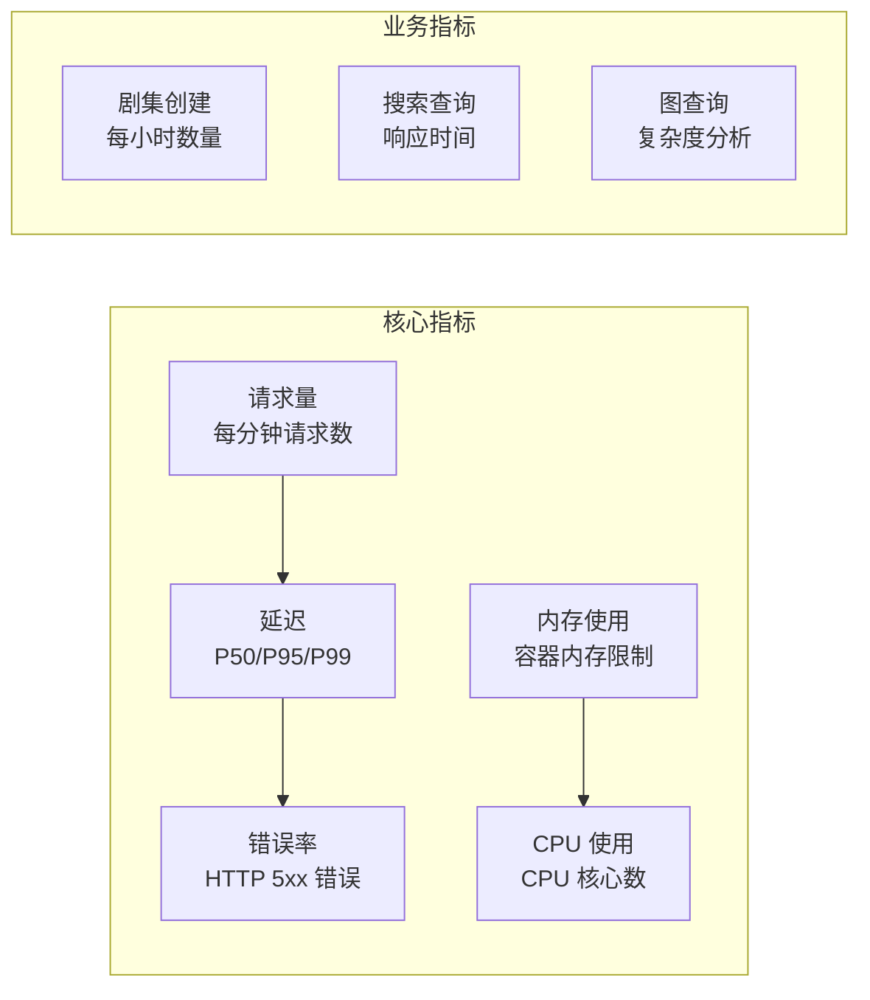
```mermaid
graph LR
subgraph "核心指标"
REQ[请求量<br/>每分钟请求数]
LAT[延迟<br/>P50/P95/P99]
ERR[错误率<br/>HTTP 5xx 错误]
MEM[内存使用<br/>容器内存限制]
CPU[CPU 使用<br/>CPU 核心数]
end
subgraph "业务指标"
EPISODE[剧集创建<br/>每小时数量]
SEARCH[搜索查询<br/>响应时间]
GRAPH[图查询<br/>复杂度分析]
end
REQ --> LAT
LAT --> ERR
MEM --> CPU
```

**图表来源**
- [k8s/prometheus-service-monitor.yaml](file://k8s/prometheus-service-monitor.yaml#L50-L115)

**章节来源**
- [.env.example](file://.env.example#L128-L131)
- [.env.example](file://.env.example#L119-L121)
- [k8s/prometheus-service-monitor.yaml](file://k8s/prometheus-service-monitor.yaml#L50-L115)

## 常见问题排查

### 启动问题诊断

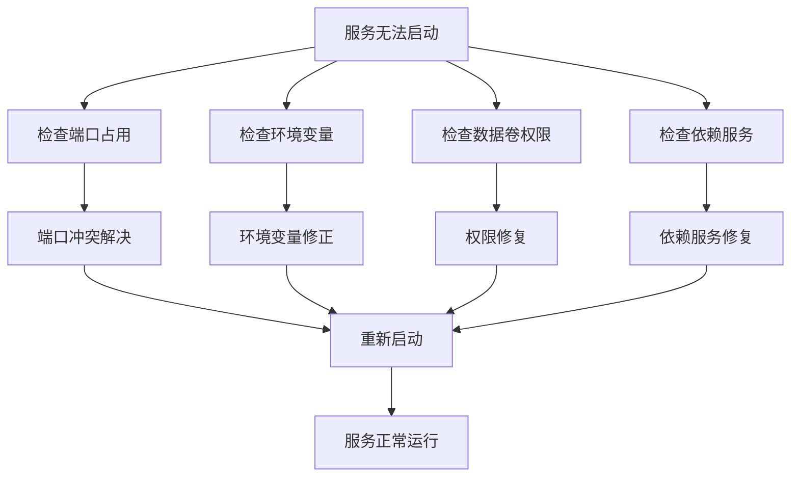
```mermaid
flowchart TD
PROBLEM[服务无法启动] --> CHECK1[检查端口占用]
PROBLEM --> CHECK2[检查环境变量]
PROBLEM --> CHECK3[检查数据卷权限]
PROBLEM --> CHECK4[检查依赖服务]
CHECK1 --> PORTFIX[端口冲突解决]
CHECK2 --> ENVFIX[环境变量修正]
CHECK3 --> VOLFIX[权限修复]
CHECK4 --> DEPFIX[依赖服务修复]
PORTFIX --> TRYAGAIN[重新启动]
ENVFIX --> TRYAGAIN
VOLFIX --> TRYAGAIN
DEPFIX --> TRYAGAIN
TRYAGAIN --> SUCCESS[服务正常运行]
```

### 端口冲突解决方案

当遇到端口冲突时：

```bash
# 1. 查找占用端口的进程
sudo lsof -i :8000
sudo lsof -i :7474
sudo lsof -i :7687
sudo lsof -i :5432
sudo lsof -i :6379
sudo lsof -i :9090
sudo lsof -i :3001

# 2. 修改 docker-compose.yml 中的端口映射
# 将冲突端口映射到其他端口

# 3. 重新启动服务
docker-compose down
docker-compose up -d
```

### 数据库连接问题

```bash
# 1. 检查数据库服务状态
docker-compose ps postgres

# 2. 进入数据库容器进行诊断
docker-compose exec postgres psql -U postgres

# 3. 检查数据库连接字符串
# 确保 POSTGRES_HOST 和 POSTGRES_PORT 正确
# 确保数据库名称和凭据正确

# 4. 测试连接
docker-compose exec api ping postgres
```

### Redis 连接问题

```bash
# 1. 检查 Redis 服务状态
docker-compose ps redis

# 2. 连接到 Redis 进行诊断
docker-compose exec redis redis-cli

# 3. 检查 Redis 配置
# 确认密码设置（如果启用）
# 确认内存限制设置

# 4. 清理 Redis 数据（谨慎操作）
# docker-compose exec redis redis-cli FLUSHALL
```

### Neo4j 连接问题

```bash
# 1. 检查 Neo4j 服务状态
docker-compose ps neo4j

# 2. 访问 Neo4j 浏览器界面
# http://localhost:7474

# 3. 检查 Bolt 连接
# 使用 Neo4j Desktop 或其他客户端工具

# 4. 重置 Neo4j 密码（如果忘记）
# docker-compose exec neo4j cypher-shell -u neo4j -p your_password_here
```

**章节来源**
- [docker-compose.yml](file://docker-compose.yml#L6-L8)
- [docker-compose.yml](file://docker-compose.yml#L34-L35)
- [docker-compose.yml](file://docker-compose.yml#L52-L53)
- [docker-compose.yml](file://docker-compose.yml#L68-L69)

## 故障排除指南

### 日志分析方法

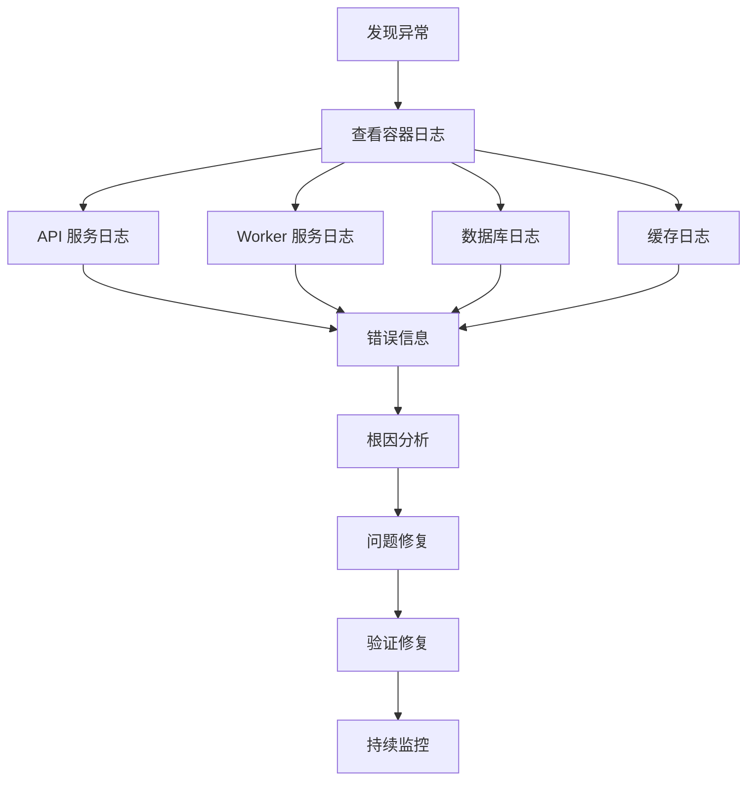
```mermaid
flowchart TD
ISSUE[发现异常] --> LOGS[查看容器日志]
LOGS --> APILOG[API 服务日志]
LOGS --> WORKERLOG[Worker 服务日志]
LOGS --> DBLOG[数据库日志]
LOGS --> CACHELOG[缓存日志]
APILOG --> ERROR[错误信息]
WORKERLOG --> ERROR
DBLOG --> ERROR
CACHELOG --> ERROR
ERROR --> ROOTCAUSE[根因分析]
ROOTCAUSE --> FIX[问题修复]
FIX --> VERIFY[验证修复]
VERIFY --> MONITOR[持续监控]
```

### 常见错误类型及解决方案

#### 内存不足错误
**症状**: 容器被 OOM Killer 终止
**解决方案**:
- 增加容器内存限制
- 优化应用内存使用
- 调整数据库连接池大小

#### 磁盘空间不足
**症状**: 数据库写入失败，服务异常退出
**解决方案**:
- 清理旧的日志文件
- 配置日志轮转
- 增加磁盘空间或清理不必要的数据

#### 网络连接超时
**症状**: API 调用超时，数据库连接失败
**解决方案**:
- 检查网络连通性
- 验证防火墙设置
- 调整超时参数

#### 权限错误
**症状**: 文件写入失败，数据卷挂载失败
**解决方案**:
- 检查数据卷权限
- 验证用户 ID 映射
- 重新创建数据卷

### 性能问题诊断

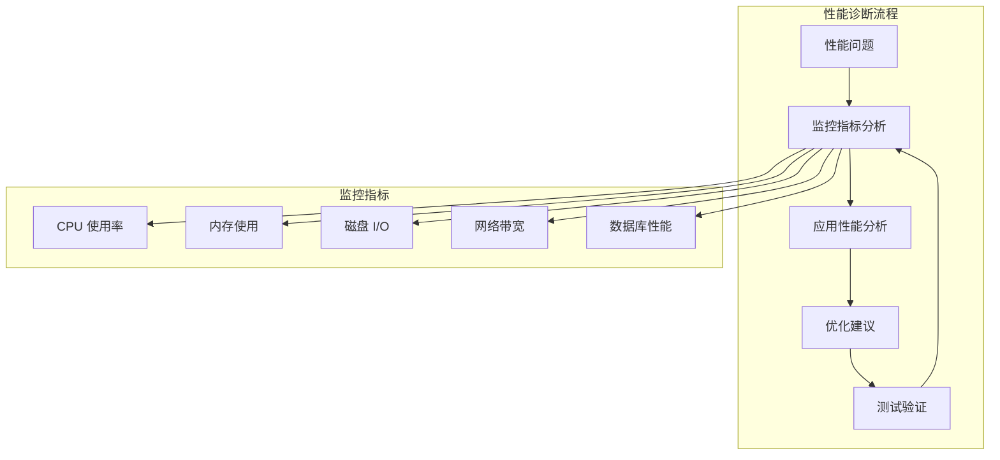
```mermaid
graph TB
subgraph "性能诊断流程"
START[性能问题] --> MONITOR[监控指标分析]
MONITOR --> PROFILE[应用性能分析]
PROFILE --> OPTIMIZE[优化建议]
OPTIMIZE --> TEST[测试验证]
TEST --> MONITOR
end
subgraph "监控指标"
CPU[CPU 使用率]
MEM[内存使用]
IO[磁盘 I/O]
NET[网络带宽]
DB[数据库性能]
end
MONITOR --> CPU
MONITOR --> MEM
MONITOR --> IO
MONITOR --> NET
MONITOR --> DB
```

### 备份和恢复策略

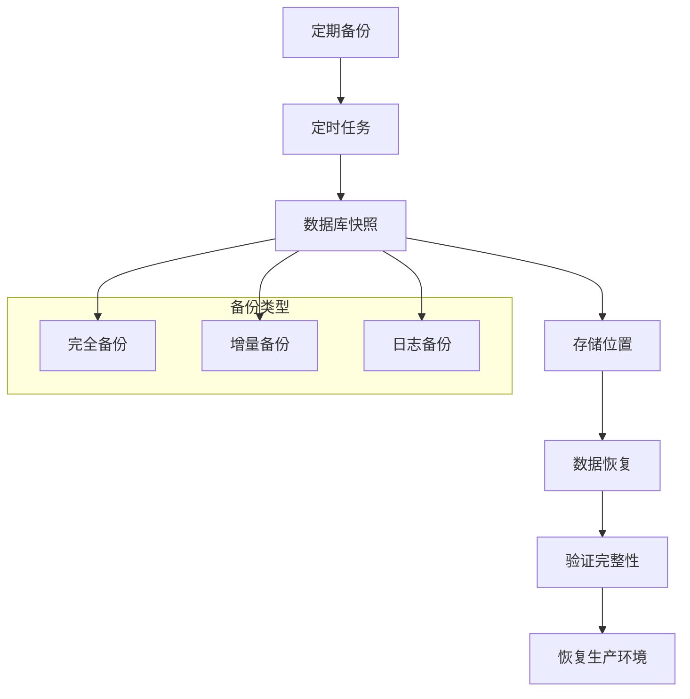
```mermaid
flowchart TD
BACKUP[定期备份] --> SCHEDULE[定时任务]
SCHEDULE --> SNAP[数据库快照]
SNAP --> STORAGE[存储位置]
STORAGE --> RESTORE[数据恢复]
RESTORE --> VALIDATE[验证完整性]
VALIDATE --> PRODUCTION[恢复生产环境]
subgraph "备份类型"
FULL[完全备份]
INCREMENTAL[增量备份]
LOG[日志备份]
end
SNAP --> FULL
SNAP --> INCREMENTAL
SNAP --> LOG
```

**章节来源**
- [Makefile](file://Makefile#L271-L307)
- [docker-compose.yml](file://docker-compose.yml#L102-L109)

## 总结

MemStack 的 Docker 部署提供了完整的容器化解决方案，涵盖了从开发环境到生产环境的所有需求。通过合理的架构设计和配置优化，可以确保系统在各种规模下的稳定运行。

### 关键优势

1. **完整的生态系统**: 包含图数据库、关系数据库、缓存和监控的完整配置
2. **灵活的部署模式**: 支持单机部署和 Kubernetes 生产部署
3. **完善的监控体系**: Prometheus + Grafana 提供全面的性能监控
4. **易于扩展**: 基于 Docker Compose 的模块化设计，便于功能扩展
5. **生产就绪**: 包含健康检查、资源限制和自动恢复机制

### 最佳实践建议

1. **生产环境配置**: 始终使用独立的生产环境配置文件，不要使用示例配置
2. **安全考虑**: 修改默认密码，启用 HTTPS，配置适当的访问控制
3. **监控告警**: 设置合适的监控阈值和告警规则
4. **备份策略**: 建立定期备份和灾难恢复计划
5. **性能优化**: 根据实际负载调整资源配置和连接池大小

通过遵循本文档的指导，您可以成功部署和维护 MemStack 系统，为您的企业级 AI 代理平台提供稳定可靠的技术基础。