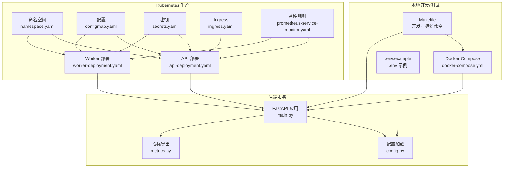
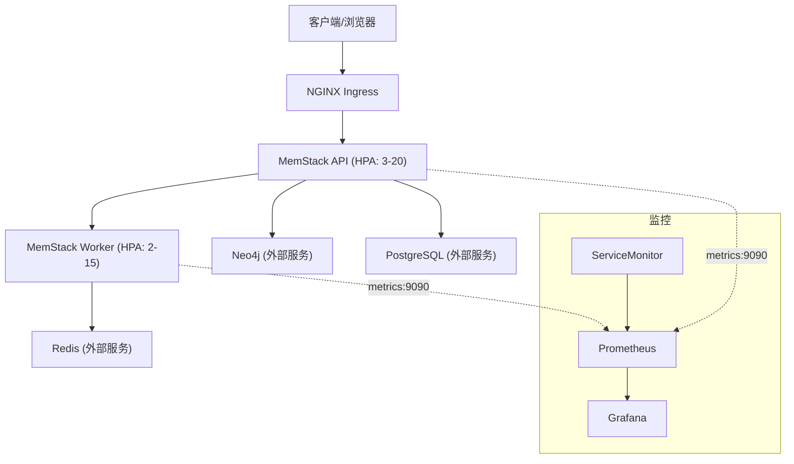
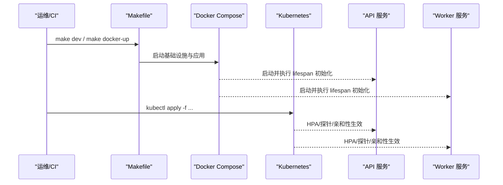
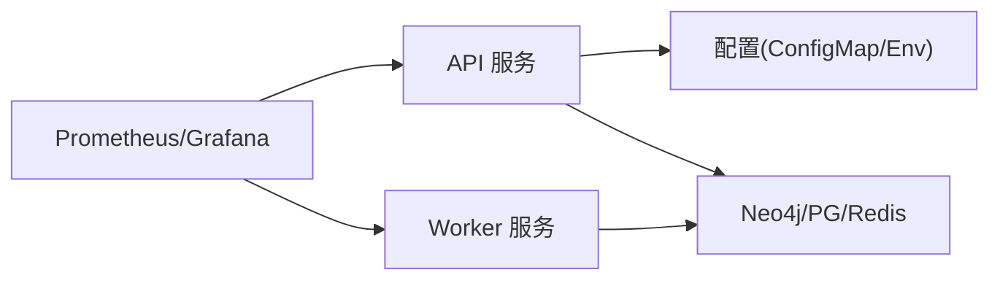

# 部署与运维

<cite>
**本文引用的文件**
- [docker-compose.yml](file://docker-compose.yml)
- [.env.example](file://.env.example)
- [Makefile](file://Makefile)
- [k8s/README.md](file://k8s/README.md)
- [k8s/namespace.yaml](file://k8s/namespace.yaml)
- [k8s/configmap.yaml](file://k8s/configmap.yaml)
- [k8s/secrets.yaml](file://k8s/secrets.yaml)
- [k8s/api-deployment.yaml](file://k8s/api-deployment.yaml)
- [k8s/worker-deployment.yaml](file://k8s/worker-deployment.yaml)
- [k8s/ingress.yaml](file://k8s/ingress.yaml)
- [k8s/prometheus-service-monitor.yaml](file://k8s/prometheus-service-monitor.yaml)
- [src/configuration/config.py](file://src/configuration/config.py)
- [src/infrastructure/adapters/primary/web/main.py](file://src/infrastructure/adapters/primary/web/main.py)
- [src/infrastructure/adapters/primary/web/metrics.py](file://src/infrastructure/adapters/primary/web/metrics.py)
- [scripts/worktree-init.sh](file://scripts/worktree-init.sh)
</cite>

## 目录
1. [简介](#简介)
2. [项目结构](#项目结构)
3. [核心组件](#核心组件)
4. [架构总览](#架构总览)
5. [详细组件分析](#详细组件分析)
6. [依赖关系分析](#依赖关系分析)
7. [性能考量](#性能考量)
8. [故障排除指南](#故障排除指南)
9. [结论](#结论)
10. [附录](#附录)

## 简介
本文件面向生产环境，系统性梳理 MemStack 的部署与运维实践，覆盖 Docker 单机部署、Kubernetes 云原生部署、监控与日志体系、高并发资源规划、故障排查与恢复策略，并提供自动化脚本与告警配置示例，帮助团队安全、稳定、可观测地交付与运营 MemStack。

## 项目结构
MemStack 采用前后端分离与多层架构设计，后端基于 FastAPI + Uvicorn，容器化与云原生编排由 Docker Compose 与 Kubernetes Manifests 提供；基础设施依赖 Neo4j、PostgreSQL、Redis；监控体系包含 Prometheus 与 Grafana；开发与运维通过 Makefile 与 Bash 脚本实现标准化流程。

图示来源
- [docker-compose.yml](file://docker-compose.yml#L1-L109)
- [k8s/namespace.yaml](file://k8s/namespace.yaml#L1-L9)
- [k8s/configmap.yaml](file://k8s/configmap.yaml#L1-L51)
- [k8s/secrets.yaml](file://k8s/secrets.yaml#L1-L33)
- [k8s/api-deployment.yaml](file://k8s/api-deployment.yaml#L1-L211)
- [k8s/worker-deployment.yaml](file://k8s/worker-deployment.yaml#L1-L157)
- [k8s/ingress.yaml](file://k8s/ingress.yaml#L1-L38)
- [k8s/prometheus-service-monitor.yaml](file://k8s/prometheus-service-monitor.yaml#L1-L115)
- [src/infrastructure/adapters/primary/web/main.py](file://src/infrastructure/adapters/primary/web/main.py#L1-L280)
- [src/configuration/config.py](file://src/configuration/config.py#L1-L231)
- [src/infrastructure/adapters/primary/web/metrics.py](file://src/infrastructure/adapters/primary/web/metrics.py#L1-L290)

章节来源
- [docker-compose.yml](file://docker-compose.yml#L1-L109)
- [k8s/README.md](file://k8s/README.md#L1-L207)
- [k8s/namespace.yaml](file://k8s/namespace.yaml#L1-L9)
- [k8s/configmap.yaml](file://k8s/configmap.yaml#L1-L51)
- [k8s/secrets.yaml](file://k8s/secrets.yaml#L1-L33)
- [k8s/api-deployment.yaml](file://k8s/api-deployment.yaml#L1-L211)
- [k8s/worker-deployment.yaml](file://k8s/worker-deployment.yaml#L1-L157)
- [k8s/ingress.yaml](file://k8s/ingress.yaml#L1-L38)
- [k8s/prometheus-service-monitor.yaml](file://k8s/prometheus-service-monitor.yaml#L1-L115)
- [src/infrastructure/adapters/primary/web/main.py](file://src/infrastructure/adapters/primary/web/main.py#L1-L280)
- [src/configuration/config.py](file://src/configuration/config.py#L1-L231)
- [src/infrastructure/adapters/primary/web/metrics.py](file://src/infrastructure/adapters/primary/web/metrics.py#L1-L290)

## 核心组件
- 应用服务
  - API 服务：基于 FastAPI，提供健康检查、CORS、限流、路由注册与生命周期管理。
  - Worker 服务：后台任务队列消费者，处理异步任务。
- 基础设施
  - Neo4j：图数据库，用于知识图谱存储与查询。
  - PostgreSQL：元数据与持久化存储。
  - Redis：缓存与队列。
- 监控与可视化
  - Prometheus：指标采集。
  - Grafana：仪表盘与告警。
- 配置与密钥
  - .env/.env.example：开发与示例配置。
  - Kubernetes ConfigMap/Secrets：生产环境配置与密钥注入。
- 自动化与运维
  - Makefile：统一构建、测试、开发、清理与部署命令。
  - worktree-init.sh：Git Worktree 环境初始化脚本。

章节来源
- [src/infrastructure/adapters/primary/web/main.py](file://src/infrastructure/adapters/primary/web/main.py#L135-L280)
- [src/configuration/config.py](file://src/configuration/config.py#L10-L231)
- [k8s/configmap.yaml](file://k8s/configmap.yaml#L1-L51)
- [k8s/secrets.yaml](file://k8s/secrets.yaml#L1-L33)
- [Makefile](file://Makefile#L67-L91)
- [scripts/worktree-init.sh](file://scripts/worktree-init.sh#L1-L523)

## 架构总览
下图展示生产级部署的端到端架构：Ingress 接入，API 与 Worker 通过 HPA 动态扩缩容，外部依赖为 Neo4j、PostgreSQL、Redis；Prometheus 通过 ServiceMonitor 抓取指标，Grafana 展示面板并联动告警。

图示来源
- [k8s/README.md](file://k8s/README.md#L67-L93)
- [k8s/ingress.yaml](file://k8s/ingress.yaml#L1-L38)
- [k8s/api-deployment.yaml](file://k8s/api-deployment.yaml#L155-L198)
- [k8s/worker-deployment.yaml](file://k8s/worker-deployment.yaml#L101-L143)
- [k8s/prometheus-service-monitor.yaml](file://k8s/prometheus-service-monitor.yaml#L1-L115)

## 详细组件分析

### Docker 部署（单机/开发）
- 服务编排
  - 使用 docker-compose 启动 Neo4j、PostgreSQL、Redis、Prometheus、Grafana。
  - Neo4j：启用 APOC 插件、设置堆内存与页面缓存，便于高并发图遍历。
  - PostgreSQL：初始化数据库与连接池参数，支持高并发读写。
  - Redis：限制内存与淘汰策略，保障缓存命中与稳定性。
  - Prometheus/Grafana：暴露管理端口，便于本地观测。
- 环境变量管理
  - 建议在宿主机维护 .env 或通过 Compose 的 env_file 注入，敏感信息使用密钥管理。
- 健康检查
  - 各服务均配置健康检查，确保容器状态可观测。

章节来源
- [docker-compose.yml](file://docker-compose.yml#L1-L109)
- [.env.example](file://.env.example#L1-L158)

### Kubernetes 部署（生产）
- 命名空间与资源配置
  - 命名空间：memstack。
  - ConfigMap：集中存放 API/DB/LLM/监控/日志等配置键值。
  - Secrets：存放数据库密码、加密密钥、LLM API Key 等敏感信息。
- 应用部署
  - API 部署：HPA 控制副本数 3-20，CPU/内存目标 70%/80%，滚动更新策略，探针健康就绪。
  - Worker 部署：HPA 控制副本数 2-15，CPU/内存目标 70%/80%，滚动更新策略。
  - PodDisruptionBudget：保证维护期间最小可用副本。
  - 亲和性：API Pod 跨节点反亲和，提升容错。
- Ingress 与服务发现
  - NGINX Ingress，开启 SSE 支持与超时控制，TLS 与代理缓冲配置。
- 监控与告警
  - ServiceMonitor：抓取 API/Worker 的 /metrics。
  - PrometheusRule：包含错误率、延迟、不可用、队列接近上限、资源使用率等告警规则。

章节来源
- [k8s/namespace.yaml](file://k8s/namespace.yaml#L1-L9)
- [k8s/configmap.yaml](file://k8s/configmap.yaml#L1-L51)
- [k8s/secrets.yaml](file://k8s/secrets.yaml#L1-L33)
- [k8s/api-deployment.yaml](file://k8s/api-deployment.yaml#L1-L211)
- [k8s/worker-deployment.yaml](file://k8s/worker-deployment.yaml#L1-L157)
- [k8s/ingress.yaml](file://k8s/ingress.yaml#L1-L38)
- [k8s/prometheus-service-monitor.yaml](file://k8s/prometheus-service-monitor.yaml#L1-L115)
- [k8s/README.md](file://k8s/README.md#L1-L207)

### 配置与密钥管理
- 配置来源
  - 本地：.env.example 提供默认键位，开发时复制为 .env 并按需修改。
  - Kubernetes：ConfigMap/Secrets 注入至 API/Worker 容器，键名与后端 Settings 字段一致。
- 关键配置项
  - API：监听地址、端口、工作进程数、CORS 允许来源。
  - 数据库：Neo4j/PostgreSQL/Redis 连接信息与连接池参数。
  - LLM：提供商选择与模型配置、缓存与超时。
  - 监控：指标开关、端口、服务名、环境、日志级别与格式。
- 安全
  - 密钥必须轮换，生产环境使用 Sealed Secrets/External Secrets Operator/Vault 等密管系统。

章节来源
- [.env.example](file://.env.example#L1-L158)
- [src/configuration/config.py](file://src/configuration/config.py#L10-L231)
- [k8s/configmap.yaml](file://k8s/configmap.yaml#L1-L51)
- [k8s/secrets.yaml](file://k8s/secrets.yaml#L1-L33)

### 监控与日志
- 指标端点
  - API/Worker 在 9090 端口暴露 /metrics，ServiceMonitor 以 30s 间隔抓取。
- 指标类型
  - 计数器、量表、直方图统计，涵盖执行耗时、成功率/失败率、SSE 连接与消息计数等。
- 告警规则
  - API 错误率、P99 延迟、不可用、Worker 不可用、队列接近上限、内存/CPU 使用率过高。
- 日志
  - 支持 JSON/文本格式，建议结合集中式日志平台（如 ELK/Fluentd）采集与检索。

章节来源
- [src/infrastructure/adapters/primary/web/metrics.py](file://src/infrastructure/adapters/primary/web/metrics.py#L1-L290)
- [k8s/prometheus-service-monitor.yaml](file://k8s/prometheus-service-monitor.yaml#L1-L115)
- [k8s/api-deployment.yaml](file://k8s/api-deployment.yaml#L26-L29)
- [k8s/worker-deployment.yaml](file://k8s/worker-deployment.yaml#L26-L29)

### 生命周期与启动流程
- 启停流程
  - Makefile 提供 dev/dev-stop/dev-logs 等命令，一键启动 API/Worker/基础设施。
  - worktree-init.sh 支持 Git Worktree 场景下的环境初始化与服务启动。
- 应用生命周期
  - FastAPI lifespan：启动阶段初始化数据库、默认凭据、LLM Provider、Graphiti 索引、队列与后台任务；关闭阶段释放资源。
  - 健康检查：/health 返回服务状态；/ready 用于就绪探测。

图示来源
- [Makefile](file://Makefile#L121-L172)
- [scripts/worktree-init.sh](file://scripts/worktree-init.sh#L417-L453)
- [src/infrastructure/adapters/primary/web/main.py](file://src/infrastructure/adapters/primary/web/main.py#L53-L133)
- [k8s/api-deployment.yaml](file://k8s/api-deployment.yaml#L107-L122)
- [k8s/worker-deployment.yaml](file://k8s/worker-deployment.yaml#L90-L92)

## 依赖关系分析
- 组件耦合
  - API 依赖 ConfigMap/Secrets 注入的配置，依赖 Neo4j/PG/Redis；Worker 依赖 Redis 作为队列。
  - 监控通过 ServiceMonitor 与 Prometheus 无侵入集成。
- 外部依赖
  - Neo4j：高并发推荐增大堆与页面缓存。
  - PostgreSQL：高并发连接池参数需合理配置。
  - Redis：内存限制与淘汰策略保障稳定性。
- 潜在风险
  - 配置不一致导致服务不可用；密钥泄露风险；监控缺失导致问题发现滞后。

图示来源
- [k8s/configmap.yaml](file://k8s/configmap.yaml#L1-L51)
- [k8s/secrets.yaml](file://k8s/secrets.yaml#L1-L33)
- [k8s/prometheus-service-monitor.yaml](file://k8s/prometheus-service-monitor.yaml#L1-L115)

章节来源
- [k8s/configmap.yaml](file://k8s/configmap.yaml#L1-L51)
- [k8s/secrets.yaml](file://k8s/secrets.yaml#L1-L33)
- [k8s/prometheus-service-monitor.yaml](file://k8s/prometheus-service-monitor.yaml#L1-L115)

## 性能考量
- 资源规划
  - API/Worker HPA：CPU 70%/内存 80% 目标，最大副本数满足峰值吞吐。
  - 容量规划：面向 1000+ 并发场景，建议评估 CPU/内存总容量与吞吐目标。
- 数据库调优
  - Neo4j：堆大小与页面缓存；PostgreSQL：连接池大小、溢出、回收与预检。
  - Redis：内存上限与淘汰策略，避免 OOM。
- LLM 与缓存
  - 启用 LLM 缓存与合理 TTL，降低外部调用成本与延迟。
- 网络与 Ingress
  - 启用 SSE 支持与合适的超时配置，保障长连接稳定性。

章节来源
- [k8s/README.md](file://k8s/README.md#L167-L178)
- [k8s/README.md](file://k8s/README.md#L142-L166)
- [k8s/configmap.yaml](file://k8s/configmap.yaml#L24-L46)
- [k8s/ingress.yaml](file://k8s/ingress.yaml#L15-L20)

## 故障排除指南
- 常见问题定位
  - HPA 状态：查看 API/Worker HPA 的目标利用率与扩缩策略。
  - 资源使用：使用 kubectl top 查看 CPU/内存占用。
  - 事件：查看集群事件，识别扩缩、驱逐、重启等事件。
  - 强制扩缩：临时调整副本数验证容量与瓶颈。
- 健康检查失败
  - API：检查 /health 与 /ready；确认数据库与 Graphiti 初始化是否成功。
  - Worker：确认队列可用与探针逻辑。
- 日志与追踪
  - 通过 kubectl logs 查看 Pod 日志；结合 Grafana 面板与 Prometheus 规则定位异常。
- 回滚与修复
  - 使用 kubectl rollout undo 快速回滚；核对最近一次变更的 ConfigMap/Secrets。

章节来源
- [k8s/README.md](file://k8s/README.md#L179-L200)
- [src/infrastructure/adapters/primary/web/main.py](file://src/infrastructure/adapters/primary/web/main.py#L240-L242)
- [k8s/api-deployment.yaml](file://k8s/api-deployment.yaml#L85-L100)
- [k8s/worker-deployment.yaml](file://k8s/worker-deployment.yaml#L77-L86)

## 结论
通过 Docker Compose 与 Kubernetes 双栈部署，结合完善的监控与告警体系，MemStack 可在开发、测试与生产环境中实现一致、可观测、可扩展的交付。建议在生产中强化密钥管理、完善容量规划与数据库调优，并持续迭代监控规则与告警阈值，以保障高并发场景下的稳定性与性能。

## 附录

### 不同部署场景配置指南
- 单机部署（Docker）
  - 使用 docker-compose 启动基础设施与应用；根据硬件调整 Neo4j/PG/Redis 内存与连接池。
  - 本地 Grafana/Prometheus 用于观测。
- 集群部署（Kubernetes）
  - 使用 namespace/configmap/secrets/ingress/deployments/HPA/PDB/ServiceMonitor。
  - 通过 Ingress 暴露服务，启用 TLS 与 SSE 支持。
- 云原生部署
  - 使用外部托管的 Neo4j/PostgreSQL/Redis，减少自运维负担。
  - 通过密管系统注入密钥，启用 Sealed Secrets/External Secrets Operator。

章节来源
- [docker-compose.yml](file://docker-compose.yml#L1-L109)
- [k8s/README.md](file://k8s/README.md#L1-L207)
- [k8s/namespace.yaml](file://k8s/namespace.yaml#L1-L9)
- [k8s/configmap.yaml](file://k8s/configmap.yaml#L1-L51)
- [k8s/secrets.yaml](file://k8s/secrets.yaml#L1-L33)
- [k8s/ingress.yaml](file://k8s/ingress.yaml#L1-L38)

### 运维自动化脚本与监控告警
- 自动化脚本
  - Makefile：统一命令入口，覆盖安装、测试、构建、清理、开发与数据库初始化。
  - worktree-init.sh：Git Worktree 环境初始化，自动复制/同步 .env，安装依赖并启动服务。
- 监控与告警
  - ServiceMonitor：抓取 API/Worker 指标。
  - PrometheusRule：错误率、延迟、不可用、队列、资源使用率等告警规则。
  - Grafana：仪表盘与告警联动。

章节来源
- [Makefile](file://Makefile#L1-L498)
- [scripts/worktree-init.sh](file://scripts/worktree-init.sh#L1-L523)
- [k8s/prometheus-service-monitor.yaml](file://k8s/prometheus-service-monitor.yaml#L1-L115)