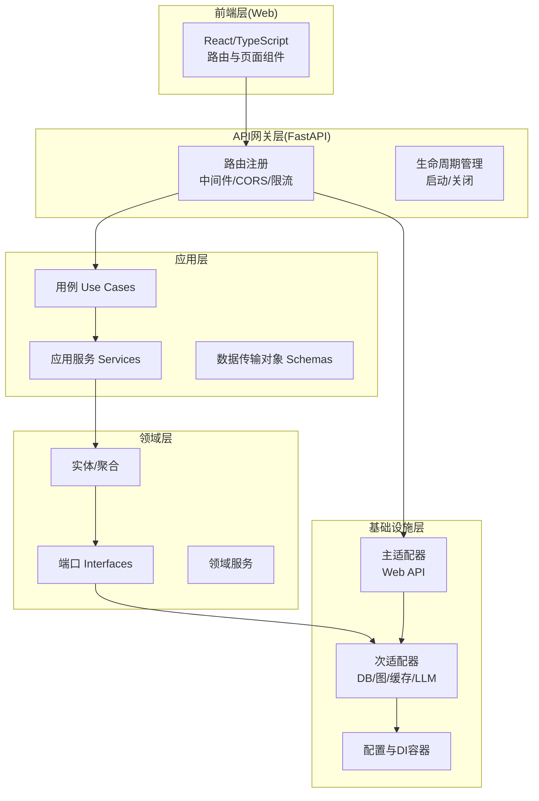
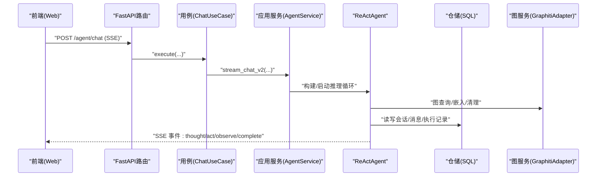
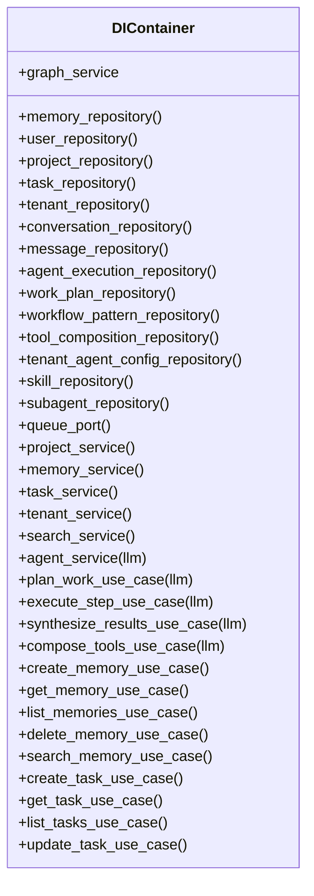
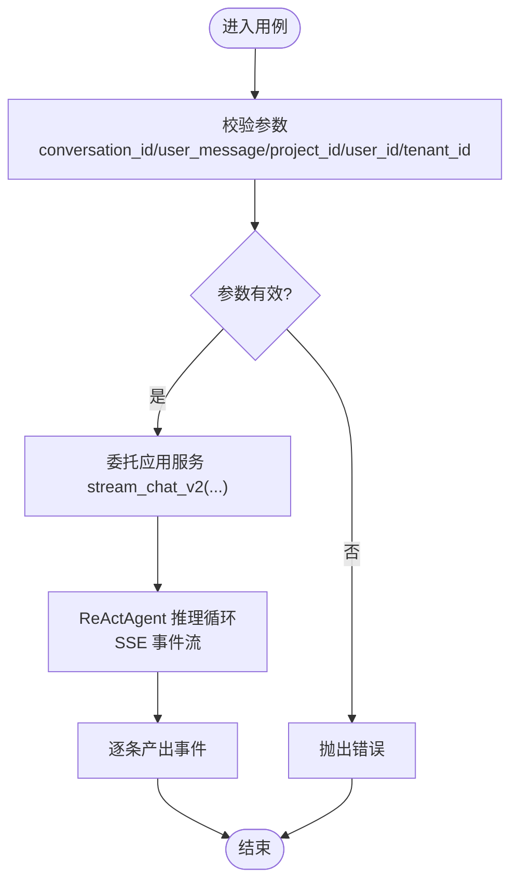
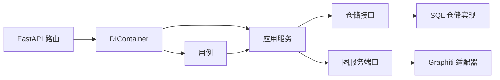

# 架构概览

<cite>
**本文档引用的文件**
- [README.md](file://README.md)
- [ARCHITECTURE.md](file://docs/architecture/ARCHITECTURE.md)
- [di_container.py](file://src/configuration/di_container.py)
- [config.py](file://src/configuration/config.py)
- [main.py](file://src/infrastructure/adapters/primary/web/main.py)
- [__init__.py](file://src/domain/model/__init__.py)
- [chat.py](file://src/application/use_cases/agent/chat.py)
- [sql_memory_repository.py](file://src/infrastructure/adapters/secondary/persistence/sql_memory_repository.py)
- [react_agent.py](file://src/infrastructure/agent/core/react_agent.py)
- [graphiti_adapter.py](file://src/infrastructure/adapters/secondary/graphiti/graphiti_adapter.py)
- [App.tsx](file://web/src/App.tsx)
</cite>

## 目录
1. [引言](#引言)
2. [项目结构](#项目结构)
3. [核心组件](#核心组件)
4. [架构总览](#架构总览)
5. [详细组件分析](#详细组件分析)
6. [依赖分析](#依赖分析)
7. [性能考虑](#性能考虑)
8. [故障排查指南](#故障排查指南)
9. [结论](#结论)
10. [附录](#附录)

## 引言
MemStack 是一个面向企业场景的智能体平台，采用领域驱动设计（DDD）与六边形架构（Ports & Adapters），以“工具 → 技能 → 子智能体 → 智能体”的渐进式能力组合为核心，构建可组合、可扩展、可观测的多层思考智能体系统。后端基于 Python/FastAPI，前端基于 React/TypeScript，数据层融合 PostgreSQL（元数据）、Neo4j（知识图谱）与 Redis（缓存/队列），并通过自研 ReAct 推理内核替代 LangGraph，实现高可控的多层思考与实时 SSE 事件流。

## 项目结构
MemStack 严格遵循分层架构与六边形架构原则：
- 表示层（Web 控制台）：React + TypeScript，按路由懒加载组织页面与组件。
- API 网关层（FastAPI）：统一路由注册、CORS、速率限制、健康检查与生命周期管理。
- 应用层（Use Cases + Services + Schemas）：编排业务用例与应用服务，解耦领域逻辑。
- 领域层（Entities/Aggregates/Domain Services/Ports）：核心业务模型与端口契约。
- 基础设施层（Primary/Secondary Adapters + Config + LLM/Caching/Queue）：对外部系统与驱动程序的适配与集成。

**图表来源**
- [main.py](file://src/infrastructure/adapters/primary/web/main.py#L135-L280)
- [di_container.py](file://src/configuration/di_container.py#L108-L391)
- [config.py](file://src/configuration/config.py#L1-L231)

**章节来源**
- [README.md](file://README.md#L38-L80)
- [ARCHITECTURE.md](file://docs/architecture/ARCHITECTURE.md#L128-L250)

## 核心组件
- 依赖注入容器（DIContainer）：集中管理仓储、应用服务、用例与基础设施组件的实例化与依赖装配，确保路由与服务层只依赖抽象。
- 配置管理（Settings）：统一读取环境变量，提供数据库、缓存、LLM 提供商、速率限制、指标监控等配置。
- FastAPI 应用（create_app/lifespan）：负责应用生命周期、中间件、路由注册与资源初始化。
- 领域模型与端口：定义实体、聚合与仓储/服务端口接口，保证业务不变性与可替换性。
- 基础设施适配器：SQLAlchemy 仓储、Graphiti 适配器、Redis 队列、LLM 客户端等。
- 自研 ReAct 智能体：替代 LangGraph 的推理内核，支持多层思考、权限控制、重试与 SSE 事件流。

**章节来源**
- [di_container.py](file://src/configuration/di_container.py#L108-L391)
- [config.py](file://src/configuration/config.py#L1-L231)
- [main.py](file://src/infrastructure/adapters/primary/web/main.py#L53-L134)
- [__init__.py](file://src/domain/model/__init__.py#L1-L38)

## 架构总览
MemStack 的整体数据流与组件交互如下：
- 前端通过 HTTP/SSE 与后端交互；后端经由 FastAPI 路由进入应用层用例。
- 用例调用应用服务，应用服务通过仓储与图服务端口访问底层数据与外部系统。
- 依赖注入容器在应用启动时完成装配，路由仅持有抽象接口，运行时由容器注入具体实现。
- 智能体服务根据租户/项目配置构建 ReActAgent，执行多层思考与工具调用，并通过 SSE 实时返回事件。

**图表来源**
- [chat.py](file://src/application/use_cases/agent/chat.py#L15-L85)
- [react_agent.py](file://src/infrastructure/agent/core/react_agent.py#L332-L520)
- [graphiti_adapter.py](file://src/infrastructure/adapters/secondary/graphiti/graphiti_adapter.py#L120-L223)
- [sql_memory_repository.py](file://src/infrastructure/adapters/secondary/persistence/sql_memory_repository.py#L18-L114)

**章节来源**
- [README.md](file://README.md#L38-L80)
- [ARCHITECTURE.md](file://docs/architecture/ARCHITECTURE.md#L518-L567)

## 详细组件分析

### 依赖注入容器（DIContainer）
- 职责：集中管理仓储、应用服务、用例与基础设施组件的创建与依赖装配，使路由与服务层只依赖抽象。
- 关键点：
  - 通过构造函数注入数据库会话工厂、Graphiti 客户端、Redis 客户端等。
  - 提供统一的工厂方法获取仓储与服务实例，避免循环依赖与重复初始化。
  - 将 GraphitiAdapter 作为图服务端口注入到应用服务与用例，确保领域层只依赖抽象端口。

**图表来源**
- [di_container.py](file://src/configuration/di_container.py#L108-L391)

**章节来源**
- [di_container.py](file://src/configuration/di_container.py#L108-L391)

### 配置管理（Settings）
- 职责：集中管理数据库连接、缓存、LLM 提供商、速率限制、指标监控、日志格式等配置项。
- 关键点：
  - 使用 Pydantic Settings 从 .env 加载配置，支持大小写不敏感与别名映射。
  - 提供 PostgreSQL 连接池参数、读副本、Redis 连接、LLM 提供商切换与默认模型选择逻辑。
  - 提供 LLM 缓存开关与 TTL、Web 搜索缓存 TTL、Playwright 参数等。

**章节来源**
- [config.py](file://src/configuration/config.py#L1-L231)

### FastAPI 应用与生命周期
- 职责：创建 FastAPI 应用、注册中间件与路由、管理生命周期（启动/关闭）。
- 关键点：
  - 启动阶段：初始化数据库、默认凭证、LLM 提供商、Graphiti 客户端、队列服务、后台任务管理器。
  - 生命周期：在 lifespan 中完成资源初始化与清理，确保应用稳定运行。
  - 路由注册：集中注册认证、租户、项目、智能体、记忆、图谱、搜索、任务等路由。

**章节来源**
- [main.py](file://src/infrastructure/adapters/primary/web/main.py#L53-L134)
- [main.py](file://src/infrastructure/adapters/primary/web/main.py#L135-L280)

### 领域模型与端口
- 职责：定义核心业务实体与聚合，以及仓储与服务端口接口，确保业务不变性与可替换性。
- 关键点：
  - 领域模型导出统一入口，便于上层按模块引用。
  - 仓储接口定义抽象方法，具体实现由 SQLAlchemy 适配器提供。
  - 图服务端口定义图谱操作契约，GraphitiAdapter 实现具体逻辑。

**章节来源**
- [__init__.py](file://src/domain/model/__init__.py#L1-L38)
- [sql_memory_repository.py](file://src/infrastructure/adapters/secondary/persistence/sql_memory_repository.py#L7-L25)
- [graphiti_adapter.py](file://src/infrastructure/adapters/secondary/graphiti/graphiti_adapter.py#L25-L37)

### 应用层用例与服务
- 用例（ChatUseCase）：封装智能体聊天的执行流程，校验参数并委托应用服务进行流式响应。
- 应用服务（AgentService）：协调会话管理、消息持久化、执行记录跟踪与 ReActAgent 推理循环，支持多层思考与 SSE 事件流。

**图表来源**
- [chat.py](file://src/application/use_cases/agent/chat.py#L27-L85)

**章节来源**
- [chat.py](file://src/application/use_cases/agent/chat.py#L15-L85)
- [react_agent.py](file://src/infrastructure/agent/core/react_agent.py#L332-L520)

### 基础设施适配器
- Graphiti 适配器：封装 Graphiti 客户端，提供嵌入维度一致性检查、异步队列触发、图数据检索与清理等能力。
- SQL 仓储：基于 SQLAlchemy 的异步仓储实现，负责内存实体的保存、查询、列表与删除。
- 队列适配器：基于 Redis 的队列服务，用于后台任务投递与处理。

**章节来源**
- [graphiti_adapter.py](file://src/infrastructure/adapters/secondary/graphiti/graphiti_adapter.py#L25-L489)
- [sql_memory_repository.py](file://src/infrastructure/adapters/secondary/persistence/sql_memory_repository.py#L18-L114)

### 前端架构
- 路由与布局：使用 React Router 管理路由，按租户/项目/智能体工作台组织页面与子路由。
- 代码分割：按需懒加载页面组件，减少首屏体积。
- 国际化与主题：集成 antd 多语言与主题切换。

**章节来源**
- [App.tsx](file://web/src/App.tsx#L1-L177)

## 依赖分析
- 路由依赖 DIContainer：FastAPI 在 lifespan 中创建 DIContainer 并注入 app.state，路由通过依赖注入获取用例与服务。
- 用例依赖应用服务：用例只依赖抽象接口，具体实现由 DIContainer 注入。
- 应用服务依赖端口：应用服务依赖仓储与图服务端口，具体实现由基础设施适配器提供。
- 领域层依赖端口：领域层通过端口与外部系统解耦，便于替换实现。

**图表来源**
- [main.py](file://src/infrastructure/adapters/primary/web/main.py#L116-L126)
- [di_container.py](file://src/configuration/di_container.py#L209-L258)
- [react_agent.py](file://src/infrastructure/agent/core/react_agent.py#L122-L305)

**章节来源**
- [main.py](file://src/infrastructure/adapters/primary/web/main.py#L116-L126)
- [di_container.py](file://src/configuration/di_container.py#L209-L258)

## 性能考虑
- 连接池与并发：PostgreSQL 提供连接池大小、溢出与回收参数，支持高并发场景。
- 缓存与索引：Redis 用于缓存与队列，Graphiti 适配器在首次使用时构建索引与约束，提升查询性能。
- LLM 缓存：配置 LLM 缓存开关与 TTL，降低重复请求成本。
- SSE 事件流：前端按事件增量渲染，减少一次性大响应开销。
- 代码分割：前端按需加载页面组件，缩短首屏时间。

**章节来源**
- [config.py](file://src/configuration/config.py#L30-L39)
- [config.py](file://src/configuration/config.py#L171-L175)
- [main.py](file://src/infrastructure/adapters/primary/web/main.py#L82-L97)
- [App.tsx](file://web/src/App.tsx#L67-L72)

## 故障排查指南
- 启动失败（Neo4j 不可用）：应用在启动阶段会尝试构建索引，若超时或连接失败则直接报错并退出，需检查 Neo4j 服务状态与连接参数。
- 嵌入维度不一致：当切换 LLM 提供商时，Graphiti 适配器会检测并自动清理旧维度嵌入，或提示手动清理。
- SSE 连接中断：前端应实现断线重连与事件去重，确保用户体验连续性。
- 速率限制：根据租户配置进行限流，超出限额时返回限流异常，需在前端或客户端侧进行退避重试。

**章节来源**
- [main.py](file://src/infrastructure/adapters/primary/web/main.py#L82-L97)
- [graphiti_adapter.py](file://src/infrastructure/adapters/secondary/graphiti/graphiti_adapter.py#L38-L119)

## 结论
MemStack 通过 DDD 与六边形架构实现了清晰的分层与强解耦，依赖注入容器确保了组件装配的可维护性与可测试性。前后端分离与 SSE 事件流提供了良好的交互体验，结合多 LLM 提供商与多数据库方案，满足企业级平台对可扩展性、可观测性与多租户隔离的需求。自研 ReAct 推理内核进一步提升了系统对复杂任务的处理能力与可控性。

## 附录
- 技术选型说明：
  - Python/FastAPI：高性能异步 Web 框架，适合高并发 API 场景。
  - React/TypeScript：现代前端开发栈，类型安全与组件化提升开发效率。
  - PostgreSQL/Neo4j/Redis：关系型存储（元数据）、图数据库（知识图谱）、缓存与队列，满足不同数据模型与性能需求。
  - 自研 ReAct 内核：替代 LangGraph，降低外部依赖，提升可控性与性能。

**章节来源**
- [README.md](file://README.md#L91-L124)
- [ARCHITECTURE.md](file://docs/architecture/ARCHITECTURE.md#L252-L285)