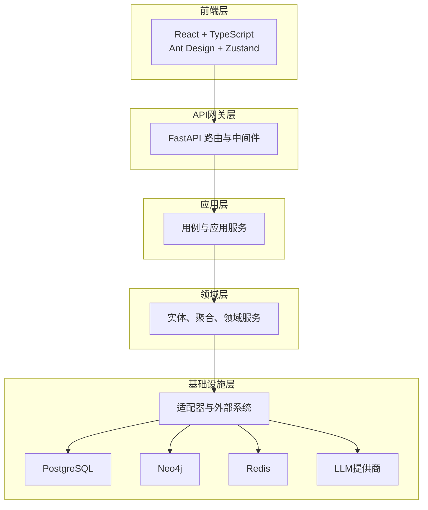
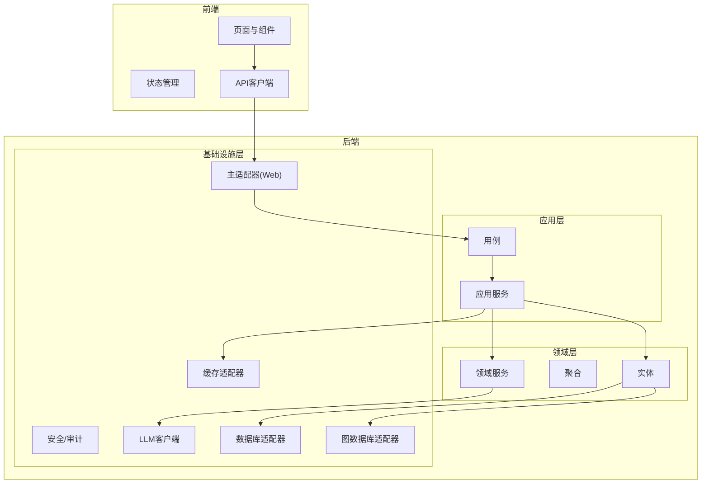
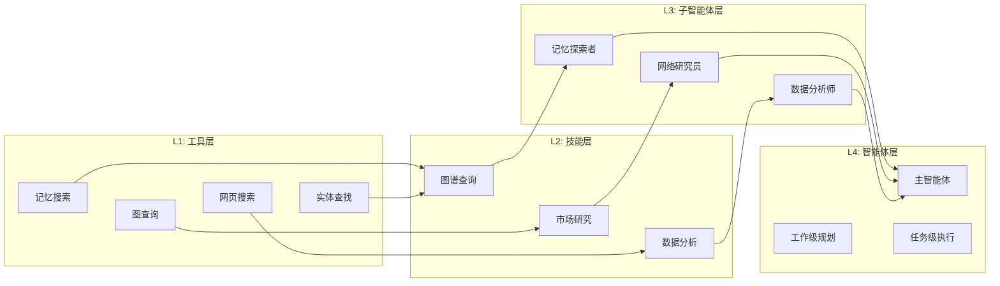
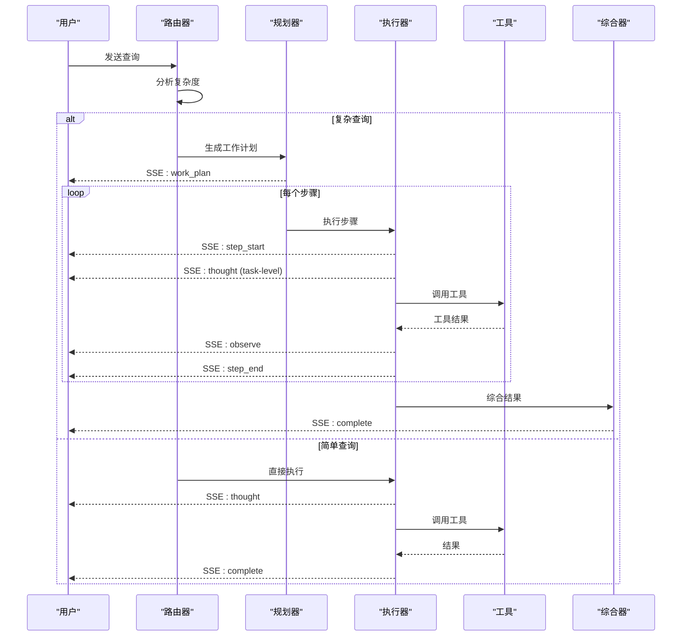
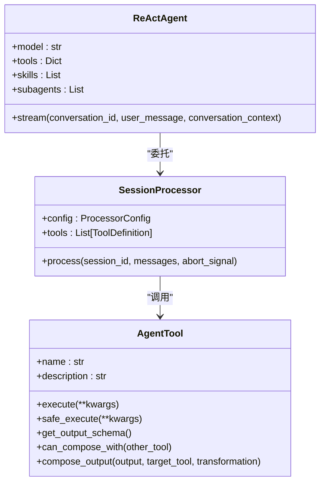
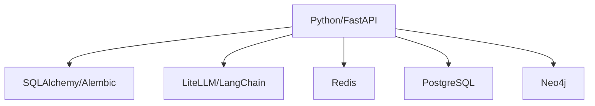

# 项目概述

<cite>
**本文档引用的文件**
- [README.md](file://README.md)
- [AGENTS.md](file://AGENTS.md)
- [CLAUDE.md](file://CLAUDE.md)
- [GEMINI.md](file://GEMINI.md)
- [ARCHITECTURE.md](file://docs/architecture/ARCHITECTURE.md)
- [DESIGN_GAP_ANALYSIS.md](file://docs/architecture/DESIGN_GAP_ANALYSIS.md)
- [domain_driven_design_hexagonal_arhictecture_python_rules.md](file://domain_driven_design_hexagonal_arhictecture_python_rules.md)
- [pyproject.toml](file://pyproject.toml)
- [web/package.json](file://web/package.json)
- [src/infrastructure/agent/core/react_agent.py](file://src/infrastructure/agent/core/react_agent.py)
- [src/infrastructure/agent/core/processor.py](file://src/infrastructure/agent/core/processor.py)
- [src/infrastructure/agent/tools/base.py](file://src/infrastructure/agent/tools/base.py)
- [src/configuration/config.py](file://src/configuration/config.py)
- [src/infrastructure/adapters/secondary/persistence/models.py](file://src/infrastructure/adapters/secondary/persistence/models.py)
</cite>

## 目录
1. [简介](#简介)
2. [项目结构](#项目结构)
3. [核心组件](#核心组件)
4. [架构总览](#架构总览)
5. [详细组件分析](#详细组件分析)
6. [依赖关系分析](#依赖关系分析)
7. [性能考量](#性能考量)
8. [故障排查指南](#故障排查指南)
9. [结论](#结论)
10. [附录](#附录)

## 简介
MemStack（内部代号 Vanus）是一个面向企业场景的 AI 代理平台，采用渐进式能力组合架构，通过“工具 → 技能 → 子智能体 → 智能体”的四层能力模型，使 AI 智能体成为企业团队的高效协作伙伴。平台遵循领域驱动设计（DDD）与六边形架构（端口与适配器），支持多租户隔离、多 LLM 提供商接入、实时交互体验与经验沉淀，覆盖从原子工具到完整智能体的全栈能力。

- 核心愿景：以“多层思考 + 人机协作 + 经验沉淀”为核心，构建可组合、可演化的智能体体系，支撑复杂任务的自动化与智能化。
- 四层能力模型：L1（工具层）→ L2（技能层）→ L3（子智能体层）→ L4（智能体层），逐层递进、可插拔、可编排。
- 多层思考机制：工作级规划（高层任务分解）与任务级执行（每步推理与工具调用）相结合，复杂查询自动触发工作级规划，简单查询直接执行。
- 人机协作：规划澄清、执行决策、权限控制、死循环检测与干预，确保安全可控与可解释。
- 知识与记忆：动态知识整合、时态感知、高性能混合检索（语义 + 关键词 + 图遍历），结合知识图谱与向量数据库。

**章节来源**
- [README.md](file://README.md#L8-L31)
- [ARCHITECTURE.md](file://docs/architecture/ARCHITECTURE.md#L33-L70)

## 项目结构
项目采用前后端分离的双栈架构，后端以 Python/FastAPI 为核心，前端以 React/TypeScript 为主，配合多数据库与 LLM 提供商集成，形成完整的“平台 + 智能体 + 知识图谱”的企业级解决方案。

- 后端（Python/FastAPI）：采用 DDD + 六边形架构，分层清晰、职责分离，便于扩展与维护。
- 前端（React/TypeScript）：采用现代前端工程化工具链，组件化与状态管理解耦，提供丰富的可视化与交互体验。
- 数据层：PostgreSQL（元数据）、Neo4j（知识图谱）、Redis（缓存与队列）协同，满足高并发与低延迟需求。
- LLM 支持：通过 LiteLLM 抽象多提供商（Google Gemini、阿里 Qwen、Deepseek、ZhipuAI、OpenAI），支持模型切换与统一接入。

**图表来源**
- [ARCHITECTURE.md](file://docs/architecture/ARCHITECTURE.md#L132-L163)

**章节来源**
- [README.md](file://README.md#L487-L526)
- [CLAUDE.md](file://CLAUDE.md#L112-L182)

## 核心组件
- ReAct 智能体核心：自研 ReAct 引擎替代 LangGraph，支持多层思考、SSE 实时流、权限控制、死循环检测、智能重试与成本追踪。
- 工具系统：抽象 AgentTool 基类，支持工具参数校验、安全执行、输出模式与工具组合（T109-T111）。
- 技能系统（L2）：声明式工具组合与触发，按需自动激活，支持版本管理与跨项目复用。
- 子智能体系统（L3）：专业化智能体路由与编排，支持并行/顺序执行与上下文传递。
- 多租户与权限：API Key 认证、角色与权限模型、租户隔离与项目维度的资源控制。
- 数据与知识：PostgreSQL 存储元数据与会话，Neo4j 存储知识图谱，Redis 缓存热点数据与队列。

**章节来源**
- [CLAUDE.md](file://CLAUDE.md#L230-L274)
- [src/infrastructure/agent/core/react_agent.py](file://src/infrastructure/agent/core/react_agent.py#L37-L69)
- [src/infrastructure/agent/core/processor.py](file://src/infrastructure/agent/core/processor.py#L122-L138)
- [src/infrastructure/agent/tools/base.py](file://src/infrastructure/agent/tools/base.py#L16-L64)

## 架构总览
MemStack 的整体架构严格遵循 DDD 与六边形架构原则，通过“端口与适配器”实现依赖倒置与横切关注点的解耦。后端以 domain（领域）为核心，application（应用）负责用例编排，infrastructure（基础设施）提供适配器实现；前端通过 API 与 SSE 与后端交互，形成清晰的分层与职责边界。

**图表来源**
- [CLAUDE.md](file://CLAUDE.md#L114-L182)

**章节来源**
- [domain_driven_design_hexagonal_arhictecture_python_rules.md](file://domain_driven_design_hexagonal_arhictecture_python_rules.md#L450-L541)

## 详细组件分析

### 四层能力模型与设计理念
- L1（工具层）：原子能力单元，如记忆搜索、图查询、网页搜索、实体查找、摘要生成、网页抓取、澄清与决策等，支持 MCP 扩展。
- L2（技能层）：声明式知识文档，封装工具使用模式与触发条件，支持 Markdown 格式与版本管理，按需自动激活。
- L3（子智能体层）：专业化智能体，具备特定领域能力，可配置工具/技能集合，支持并行/顺序编排。
- L4（智能体层）：完整 ReAct 智能体，具备多层思考与规划、交互经验沉淀、人机协作与自主决策能力。

**图表来源**
- [ARCHITECTURE.md](file://docs/architecture/ARCHITECTURE.md#L88-L118)

**章节来源**
- [ARCHITECTURE.md](file://docs/architecture/ARCHITECTURE.md#L45-L70)

### 多层思考机制与人机协作
- 查询复杂度分类：根据查询长度、关键词、跨时间范围与跨领域特征，自动判定 SIMPLE/MODERATE/COMPLEX，并据此决定是否生成工作级规划。
- 工作级规划：复杂查询触发工作级规划，生成多步骤计划；任务级执行：每一步进行详细推理与工具调用。
- 人机协作：规划阶段的澄清（Clarification）、执行阶段的决策（Decision）、权限控制（Allow/Deny/Ask）、死循环检测与干预（Doom Loop）。

**图表来源**
- [ARCHITECTURE.md](file://docs/architecture/ARCHITECTURE.md#L599-L634)

**章节来源**
- [ARCHITECTURE.md](file://docs/architecture/ARCHITECTURE.md#L570-L794)

### ReAct 智能体核心与执行流程
- ReActAgent：自研 ReAct 引擎，替代 LangGraph，负责多层思考、SSE 实时流、权限控制、死循环检测、智能重试与成本追踪。
- SessionProcessor：ReAct 推理循环核心，管理状态机（思考/行动/观察/等待权限/重试/完成/错误），与 LLMStream、PermissionManager、DoomLoopDetector、RetryPolicy、CostTracker 等组件协作。
- 工具系统：AgentTool 抽象基类，支持参数校验、安全执行、输出模式与工具组合（T109-T111）。

**图表来源**
- [src/infrastructure/agent/core/react_agent.py](file://src/infrastructure/agent/core/react_agent.py#L37-L141)
- [src/infrastructure/agent/core/processor.py](file://src/infrastructure/agent/core/processor.py#L122-L200)
- [src/infrastructure/agent/tools/base.py](file://src/infrastructure/agent/tools/base.py#L16-L200)

**章节来源**
- [src/infrastructure/agent/core/react_agent.py](file://src/infrastructure/agent/core/react_agent.py#L1-L200)
- [src/infrastructure/agent/core/processor.py](file://src/infrastructure/agent/core/processor.py#L1-L200)
- [src/infrastructure/agent/tools/base.py](file://src/infrastructure/agent/tools/base.py#L1-L200)

### 数据库与配置
- 配置管理：Settings 使用 Pydantic Settings，集中管理 API、数据库、Redis、LLM 提供商、安全、日志、指标与遥测等配置项，支持自动选择提供商与连接串生成。
- PostgreSQL 模型：用户、角色、权限、API Key、租户、项目、会话、消息、工作计划、计划步骤、交互模式、工具组合等核心实体与关系。
- 连接池与读写分离：PostgreSQL 支持连接池大小、溢出、回收与只读副本配置，满足高并发与读扩展需求。

**章节来源**
- [src/configuration/config.py](file://src/configuration/config.py#L10-L231)
- [src/infrastructure/adapters/secondary/persistence/models.py](file://src/infrastructure/adapters/secondary/persistence/models.py#L36-L200)

## 依赖关系分析
- 技术栈选择与优势：
  - 后端：Python/FastAPI 提供高性能 Web 框架与类型安全；SQLAlchemy/Alembic 提供 ORM 与迁移；LangChain/LiteLLM 提供 LLM 工具链与多提供商抽象；Redis 提供缓存与队列；OpenTelemetry 提供可观测性。
  - 前端：React/TypeScript + Vite + Ant Design + Zustand，组件化与状态管理解耦，支持国际化与图表可视化。
  - 数据库：PostgreSQL（元数据）、Neo4j（知识图谱）、Redis（缓存/队列）协同，满足高并发与低延迟需求。
- 依赖注入与适配器：通过 DI 容器与端口/适配器模式，实现技术细节与业务逻辑解耦，便于替换与扩展。

**图表来源**
- [pyproject.toml](file://pyproject.toml#L10-L48)
- [web/package.json](file://web/package.json#L48-L70)

**章节来源**
- [pyproject.toml](file://pyproject.toml#L10-L48)
- [web/package.json](file://web/package.json#L48-L70)

## 性能考量
- 并发与连接池：PostgreSQL 支持高并发连接池与只读副本，降低读压力；Redis 用于缓存热点数据与队列，减少数据库访问。
- 检索性能：混合检索（语义 + 关键词 + 图遍历）与时态感知，支持亚秒级响应；缓存与索引策略优化查询性能。
- 智能体执行：SessionProcessor 状态机与工具调用批量化，结合智能重试与成本追踪，平衡吞吐与稳定性。
- 可观测性：OpenTelemetry 与指标端口，支持链路追踪与性能监控。

[本节为通用性能讨论，不直接分析具体文件]

## 故障排查指南
- 健康检查与验证：通过健康端点与 API 文档验证服务可用性；查看默认 API Key 与认证方式。
- 数据库迁移：使用 Alembic 进行迁移，遵循“自动生成 + 审查 + 测试”的流程；若版本表异常，可通过启动时自动恢复或手动 stamp。
- LLM 提供商：检查环境变量与 API Key，确认提供商切换逻辑与回退策略；必要时启用 LiteLLM 或原生 SDK。
- 前端联调：SSE 流与 WebSocket 连接，注意断线重连与事件解析；组件与状态管理按约定更新。

**章节来源**
- [README.md](file://README.md#L187-L200)
- [CLAUDE.md](file://CLAUDE.md#L540-L595)

## 结论
MemStack 以“四层能力模型 + 多层思考 + 人机协作 + 经验沉淀”为核心，结合 DDD 与六边形架构，构建了可组合、可扩展、可演化的智能体平台。通过工具、技能、子智能体与智能体的渐进式组合，平台能够应对从简单问答到复杂任务的多样化场景；通过知识图谱与混合检索，实现动态知识整合与时态感知；通过权限控制与死循环检测，确保安全与可控。技术栈选择兼顾性能、可维护性与生态成熟度，适合企业级落地与长期演进。

[本节为总结性内容，不直接分析具体文件]

## 附录

### 快速开始指南
- 环境要求：Python 3.10+、Node.js 18+、Neo4j 5.26+、PostgreSQL 16+、Redis 7+、任一 LLM 提供商 API Key。
- 安装与配置：克隆仓库、安装依赖（uv/pip）、复制并编辑 .env 示例文件，设置数据库与 LLM 提供商参数。
- 启动服务：Docker Compose 或本地开发命令；查看健康状态与 API 文档；获取默认 API Key。
- 使用示例：Python SDK 与异步客户端、SSE 代理聊天、直接 API 调用。

**章节来源**
- [README.md](file://README.md#L125-L200)
- [CLAUDE.md](file://CLAUDE.md#L26-L111)

### 设计缺口与后续计划
- 当前实现状态：静态设计稿与代码实现存在较大差距，部分页面与功能尚未实现或仅部分实现。
- 优先级：建议优先补齐“智能体活动日志与可视化”“子智能体管理基础”“记忆图谱增强”等 MVP 功能，再逐步完善高级功能。
- 技术与 API 依赖：部分功能需要新增后端 API 与前端组件，建议按阶段拆解任务并制定开发计划。

**章节来源**
- [DESIGN_GAP_ANALYSIS.md](file://docs/architecture/DESIGN_GAP_ANALYSIS.md#L68-L329)