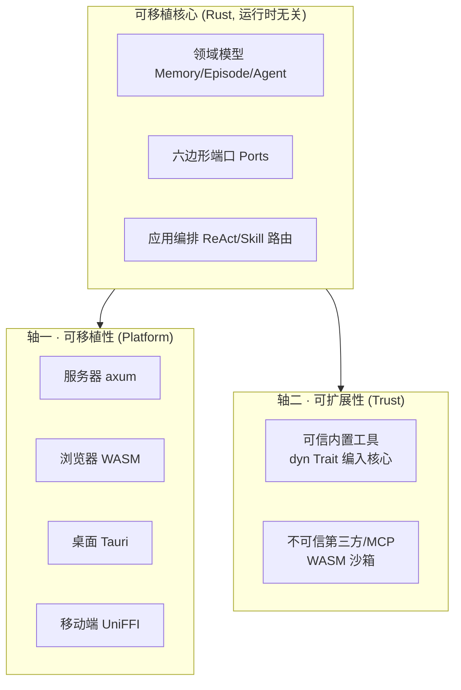

# agi-stack

> **新一代可移植智能体核心** —— 一份核心代码,编译/打包后同时跑在**云端服务器**与**端侧(浏览器 WASM / PC / 移动端)**,本地优先(local-first)、可离线;并以**信任 × 平台**两轴承载可扩展的工具/技能/子智能体/MCP 插件生态。

本目录是 **新架构的根**。架构文档在 [`docs/`](docs/);**Phase 1 生产级 Cargo workspace 已落地于此根下**([`crates/`](crates/) + [`apps/`](apps/),`cargo test` 424 测试绿、`agistack-server` 全端点 curl 验证 —— 见下方[「现状」](#现状)与[「构建与运行」](#构建与运行phase-1-工作区))。

---

## 这是什么

`agi-stack` 是 MemStack(企业级 AI 记忆/智能体云平台,现为 ~411K LOC Python/FastAPI + ~327K LOC React/TS)后端的**完全重写**目标架构。核心命题:

- **一次编写,四端复用**:`可移植核心 (Rust) + 按平台替换的适配器`,而非"把整个后端搬上手机"。
- **本地优先**:端上用嵌入式存储/推理(SQLite/libsql + sqlite-vec + Candle/llama.cpp)离线运行,云端保留重算力(Ray 分布式)与多租户数据。
- **可扩展即一等公民**:MemStack 本质是插件平台(L1 Tool / L2 Skill / L3 SubAgent / MCP 全是扩展点);架构按**信任 × 平台**两轴为每类扩展点选机制,并把"插件宿主"也抽象成一个六边形端口。

> 选型结论:**Rust 核心 + 平台外壳**(UniFFI→Swift/Kotlin、wasm-bindgen→Web、Tauri→桌面)。强力替补:Kotlin Multiplatform。完整论证见 [`docs/architecture/00-overview.md`](docs/architecture/00-overview.md)。

## 两条架构主轴



- **轴一 · 可移植性**:核心绝不绑定运行时(无 tokio、无 `std::time`),靠替换适配器适配四端。已 Spike 证伪通过。
- **轴二 · 可扩展性**:可信内置工具走 `dyn Trait`(原生速度);不可信第三方/MCP 工具**只走 WASM 沙箱**(铁律:绝不进 cdylib)。插件宿主本身是端口 `ToolHost`,按平台换运行时。已 Spike 证伪通过。

> 在两轴之上,核心引擎本身还需**运行时质量**:**健壮 · 可扩展 · 热插拔 · 可编排**。我们学习开源网关(ShenYu/Kong/Higress)、Flink、Argo 的**内部设计**(非集成),提炼出"轮次边界 = checkpoint = reconcile = 配置热应用"这一收敛原语。详见 [`docs/architecture/06-agent-core-design.md`](docs/architecture/06-agent-core-design.md)。在此之上,学习 OpenClaw(380K★ 多端 Agent 运行时)的**多层插件机制**,把扩展点统一为能力注册模型 + 插件形态分类 + 可插拔 Harness + 热插拔生命周期,详见 [`docs/architecture/07-plugin-runtime-architecture.md`](docs/architecture/07-plugin-runtime-architecture.md)。最后,学习 Kubernetes/Istio 的**控制面-数据面分离**,把"云端=控制面(SSOT)、端/边=数据面(本地自治)"确立为第三条系统轴(声明式 reconcile + xDS 风格版本化分发 + local-first 断连自治),详见 [`docs/architecture/08-control-data-plane-separation.md`](docs/architecture/08-control-data-plane-separation.md)。证据基见 [`docs/research/`](docs/research/README.md)。

## 文档导航

| 文档 | 内容 |
|---|---|
| [`docs/architecture/00-overview.md`](docs/architecture/00-overview.md) | 问题/目标、现状评估、语言选型对比与结论 |
| [`docs/architecture/01-portable-core.md`](docs/architecture/01-portable-core.md) | 可移植核心:运行时无关 async、六边形端口、能力分层 |
| [`docs/architecture/02-extensibility.md`](docs/architecture/02-extensibility.md) | 可扩展/插件架构:信任 × 平台两轴、`ToolHost`、MCP 分层沙箱、Skill+Rhai |
| [`docs/architecture/03-platform-adapters.md`](docs/architecture/03-platform-adapters.md) | 按平台适配器矩阵:存储 / LLM / 向量 / 插件宿主 |
| [`docs/architecture/04-spike-evidence.md`](docs/architecture/04-spike-evidence.md) | 决策 Spike 已验证的结论与实测指标 |
| [`docs/architecture/05-roadmap.md`](docs/architecture/05-roadmap.md) | 绞杀者式落地路径、风险、go/no-go |
| [`docs/architecture/06-agent-core-design.md`](docs/architecture/06-agent-core-design.md) | 第三条主轴:健壮 · 可扩展 · 热插拔 · 可编排的 Agent 核心 |
| [`docs/architecture/07-plugin-runtime-architecture.md`](docs/architecture/07-plugin-runtime-architecture.md) | 多层插件运行时:能力注册 · 插件形态 · 可插拔 Harness · 热插拔生命周期 |
| [`docs/architecture/08-control-data-plane-separation.md`](docs/architecture/08-control-data-plane-separation.md) | 控制流/数据流分离:控制面=SSOT · 声明式 reconcile · xDS 风格分发 · local-first 断连自治 |
| [`docs/architecture/09-shipping-matrix.md`](docs/architecture/09-shipping-matrix.md) | 逐平台出厂矩阵:一份核心 → server/web/桌面/Android/iOS 五端产物,`Makefile` 一键 target |
| [`docs/architecture/10-production-migration.md`](docs/architecture/10-production-migration.md) | 生产迁移:Python 后端绞杀替换为 Rust —— 共享 Postgres strangler、网关按能力分流、P1..P8 波次(P1 已落地) |
| [`docs/research/`](docs/research/README.md) | 证据基:网关 / Flink / Argo / OpenClaw / Istio·K8s 内部设计源码级调研 |
| [`docs/adr/`](docs/adr/) | 架构决策记录(ADR):语言选型、WASM-only、插件宿主端口化、Plan DAG、轮次 checkpoint、热插拔机制、能力注册、可插拔 Harness、控制面/数据面分离、xDS 风格分发、agent 监督裁决 |

## 现状

- **Phase 0(已完成)**:决策 Spike + 架构文档。可移植核心、插件宿主、跨层热插拔、控制面→数据面 reconcile 四条主轴均已用可运行、可测试的 Rust Spike **证伪通过**(见 `spikes/rust-portable-core/`,仓库根)。
- **Phase 1(进行中)**:已在本根下落地**生产级 Cargo workspace**,把 Spike 验证过的模式提升为一致、可测试、可运行的基座:
  - [`crates/core`](crates/core) —— 运行时无关的可移植核心:领域模型(`Memory`/`Episode`)、六边形端口(`MemoryRepository`/`LlmPort`/`VectorIndexPort`/`ToolHost`/`CheckpointStore`/`Clock` …)、`MemoryService` 编排、`ReActEngine`(轮次边界 checkpoint + 崩溃恢复)。零 tokio、零 `std::time`。
  - [`crates/plugin-host`](crates/plugin-host) —— 热插拔插件宿主:`ArcSwap<ToolRegistry>` 原子换表、`PluginHost` enable/disable 生命周期、`PluginShape` 分类、`ControlPlane` + `DataPlaneReconciler`(xDS 风格版本化 + 声明式 level-triggered reconcile + ACK/NACK + last-good)。
  - [`crates/adapters-mem`](crates/adapters-mem) —— 内存端适配器(含 `StubLlm`/`ScriptedLlm` 确定性替身),证崩溃恢复不重复已完成工具。
  - [`crates/adapters-device`](crates/adapters-device) —— 本地优先 SQLite 适配器(`rusqlite` bundled,跨编移动端):持久化 memory repo + checkpoint + 暴力余弦向量索引,证**端上耐久崩溃恢复**。
  - [`crates/bindings-uniffi`](crates/bindings-uniffi) —— UniFFI 移动端绑定:把同一核心(+SQLite 设备适配器)封为 `MobileCore`(`ingest`/`search`/`semantic_search`),`cdylib`→Android `.so`、`staticlib`→iOS `.a`,UniFFI 生成 Swift/Kotlin 原生包。
  - [`apps/server`](apps/server) —— 真实 axum 服务器,把上述端口装配为 DI 图,暴露 episodes/memory(关键词+语义)/agent run/plugins/control-plane 全端点。
- 验证:`cargo test --workspace` **457 测试绿**(覆盖 core / plugin-host / adapters-mem / adapters-device / adapters-wasmtime / adapters-http-llm / adapters-postgres / adapters-neo4j / adapters-cli-harness / parity / gateway / server 全 crate,含 Wave A–K 各风险点切片 + Wave L/M/N agent runtime 三轴(可编排 MiniOrchestrator / 可插拔 CLI-backend harness / 健壮 doom-loop+supervisor)+ P1 记忆/情节 + P2 登录/租户读写/项目读写/项目 stats/members/项目成员写/tenant member 写/tenant invitations/device-code/shares/trust 生产绞杀垂直 + P4 GraphStore/community/enhanced-search/rebuild REST foundation + F7 WS 事件桥地基与 gateway 精确翻转 + P5 sandbox HTTP service path/WS/preview-host HTTP/WS + desktop HTTP/WS(noVNC websockify) + terminal/ttyd WS envelope proxy + ttyd resize wire protocol + Docker image pull policy + durable terminal reconnect/session resume registry + MCP OAuth-like upstream token foundation + local/tunnel sandbox semantics + MCP browser WS proxy/query-cookie auth bridge + Redis-backed HTTP service/preview-session/terminal-session registry foundations + P5 sandbox HTTP 控制面 + path 数据面 proxy/WS + preview-host host-based gateway 精确翻转 + P5 skill store/versioning foundation + P6 workspace/tasks/topology/blackboard + blackboard-files + plan snapshot + outbox leasing/retry + outbox retry/delivery/node/recover-stale action foundation + outbox worker foundation + delivery loop safety gate + handoff/attempt_retry + worker_launch admission/conversation binding/Redis cooldown-running/heartbeat marker refresh/orphaned stream stop decision/idle progress watchdog/terminal report fallback/stream reducer foundation/terminal outcome persistence/stream event replay/stream idle progress/stream poll continuation/orphan stop persistence/worker-report supervisor retry admission/worker-report retry context propagation/retry state reset/retry exhaustion/accept-review attempt acceptance/worktree checkpoint/setup preflight + pipeline_run admission + supervisor retry admission + supervisor missing-attempt recovery + supervisor reported-attempt reconcile + supervisor terminal retry release + supervisor accepted terminal projection + accepted worktree skipped/already-merged/real merge/dirty-main integration + stale dirty-main reattempt + dirty-main repair dependency dispatch + supervisor failed worktree integration reopen + supervisor superseded accepted attempt projection + supervisor root-goal progress reconcile + pipeline_run success reflection + pipeline_run running recovery + pipeline_run stale running finish + pipeline_run durable run creation + pipeline stage-run persistence + sandbox-native no-service stage execution + Drone source_publish admission failure/git publish + remote branch merge/retry parity + provider-unavailable result + Drone HTTP trigger/poll + deploy params/trusted repo/docker deploy validation + .drone.yml preflight foundation + Drone CLI fallback + production-ready gate foundations + **F3 绞杀 parity 硬门禁**(`agistack-parity` 契约框架 15 自测 + 59 golden 应用 P1/P2/P5/P6 真实 wire 形状 + 负控);明细见 [04 证据表](docs/architecture/04-spike-evidence.md));`agistack-server` 启动后 curl 验证健康、记忆摄取与检索、ReAct 智能体回合、CP/DP 声明式 reconcile(含重复名 NACK 保留 last-good)、插件 enable/disable 全部通过;同一核心 `make wasm-core` 会幂等安装 `wasm32-unknown-unknown` target 后编译通过;`bindings-uniffi` 经 Android NDK 交叉编译产出**真实 `aarch64-linux-android` `.so`(release 1.5 MB,stripped,`file` 验为 ELF ARM aarch64)** 并由 UniFFI 生成 Kotlin 原生包;经 full Xcode 交叉编译 `aarch64-apple-ios`(+ `-sim`)产出静态库、组装 **XCFramework** 并生成 Swift 包,且在 **iPhone 17 模拟器上实跑冒烟**(摄取 + 关键词检索 + 语义检索全绿)。逐平台一键构建见 [`Makefile`](Makefile) / [09-shipping-matrix](docs/architecture/09-shipping-matrix.md)。生产绞杀迁移(Python→Rust 逐能力替换)见 [10-production-migration](docs/architecture/10-production-migration.md)。
- 最新 P6 增量:Rust accept-review attempt acceptance foundation 已落地:`/workspaces/{workspace_id}/plan/nodes/{node_id}/accept-review` 在人工接受 blocked/rework 节点时会同步把 linked attempt 收成 `accepted`,并把 `last_attempt_status`/`last_attempt_id`/`current_attempt_id` 投到 task/node metadata,避免 pending leader adjudication 在人工接受后残留,见 [04 #140](docs/architecture/04-spike-evidence.md)。此前 retry exhaustion 见 [04 #139](docs/architecture/04-spike-evidence.md),retry state reset 见 [04 #138](docs/architecture/04-spike-evidence.md),retry context propagation 见 [04 #137](docs/architecture/04-spike-evidence.md)。
- 后续 Phase 2+ 实现仍以 [`docs/`](docs/) 架构文档为权威依据。

## 构建与运行(Phase 1 工作区)

```bash
cd agi-stack

# —— 推荐:一键构建矩阵(`make help` 列出全部 target;详见 09-shipping-matrix)——
make ci          # 最小门禁:整工作区测试(449 绿)+ 核心 wasm32
make all         # 全部免额外 SDK 的产物:server + wasm-web + desktop + 评分卡
make android     # 移动:NDK 交叉编 .so + Kotlin(需 NDK,路径可 NDK= 覆盖)
make ios         # 移动:XCFramework + Swift + 模拟器实跑(需 full Xcode)

# —— 等价手动命令(逐条) ——

# 整工作区构建 + 测试(424 测试绿)
cargo test --workspace

# 同一核心编为浏览器 WASM(证运行时无关)
# 需使用 rustup cargo(~/.cargo/bin 优先于 Homebrew);target 安装是幂等操作。
rustup target add wasm32-unknown-unknown
cargo build -p agistack-core --target wasm32-unknown-unknown

# 交叉编译移动端设备产物(真实 aarch64 Android .so)
#   需 Android NDK(本机用 ~/Library/Android/sdk/ndk/30.x);生产建议 cargo-ndk。
rustup target add aarch64-linux-android
NDK="$HOME/Library/Android/sdk/ndk/30.0.14904198"
TC="$NDK/toolchains/llvm/prebuilt/darwin-x86_64/bin"
ANDROID_NDK_HOME="$NDK" ANDROID_NDK_ROOT="$NDK" \
CARGO_TARGET_AARCH64_LINUX_ANDROID_LINKER="$TC/aarch64-linux-android21-clang" \
CC_aarch64_linux_android="$TC/aarch64-linux-android21-clang" \
AR_aarch64_linux_android="$TC/llvm-ar" \
  cargo build -p agistack-bindings-uniffi --target aarch64-linux-android --release
file target/aarch64-linux-android/release/libagistack_mobile.so   # ELF ARM aarch64, ~1.5 MB
# 生成 Kotlin 原生包
cargo run -p agistack-bindings-uniffi --bin uniffi-bindgen -- generate \
  --library target/debug/libagistack_mobile.dylib --language kotlin --out-dir target/kotlin

# iOS 设备产物(需 full Xcode):交叉编 device + simulator 两 arm64 静态库、生成 Swift 绑定、
#   组装 XCFramework,并(若有已启动模拟器)把冒烟测试 spawn 到模拟器实跑。
rustup target add aarch64-apple-ios aarch64-apple-ios-sim
./scripts/build-ios.sh            # 产出 target/AgistackMobile.xcframework + 模拟器实跑 SMOKE_OK

# 启动服务器(默认 127.0.0.1:8088,可用 AGISTACK_ADDR 覆盖)
cargo run -p agistack-server

# 端点冒烟(另开终端)
curl -s localhost:8088/health
curl -s -X POST localhost:8088/v1/episodes -H 'content-type: application/json' \
  -d '{"project_id":"p1","author_id":"u1","content":"Vector databases enable semantic memory"}'
curl -s "localhost:8088/v1/memories/search?project_id=p1&q=semantic&semantic=true"
curl -s -X POST localhost:8088/v1/agent/run -H 'content-type: application/json' \
  -d '{"session_id":"s1","goal":"measure hello","project_id":"p1"}'
curl -s -X POST localhost:8088/v1/control-plane/publish -H 'content-type: application/json' \
  -d '{"tools":[{"name":"len","trust":"builtin"},{"name":"echo","trust":"builtin"}]}'
```


## 参考

- 决策 Spike 代码与实测:仓库根 `spikes/rust-portable-core/`(`README.md` 含 10 项验证结论表)。
