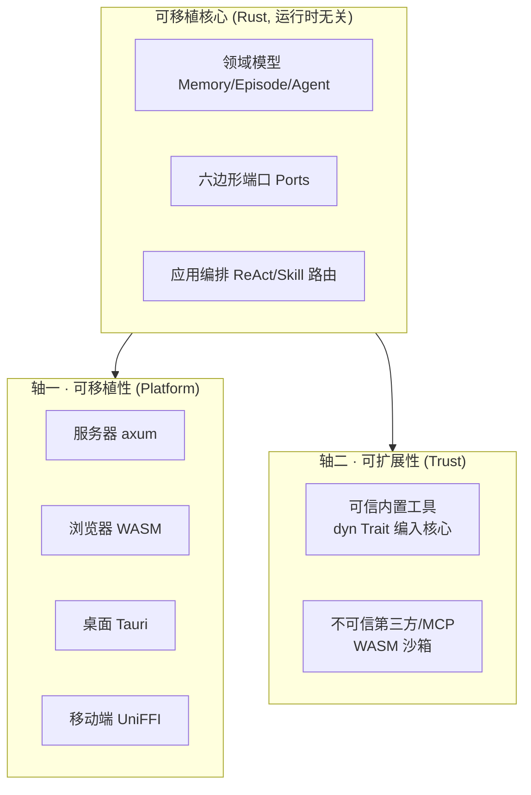

# agi-stack

> **新一代可移植智能体核心** —— 一份核心代码,编译/打包后同时跑在**云端服务器**与**端侧(浏览器 WASM / PC / 移动端)**,本地优先(local-first)、可离线;并以**信任 × 平台**两轴承载可扩展的工具/技能/子智能体/MCP 插件生态。

本目录是 **新架构的根**。当前阶段(Phase 0)只放**架构文档**;后续 Cargo workspace 代码将落在此根下。

---

## 这是什么

`agi-stack` 是 MemStack(企业级 AI 记忆/智能体云平台,现为 ~411K LOC Python/FastAPI + ~327K LOC React/TS)后端的**完全重写**目标架构。核心命题:

- **一次编写,四端复用**:`可移植核心 (Rust) + 按平台替换的适配器`,而非"把整个后端搬上手机"。
- **本地优先**:端上用嵌入式存储/推理(SQLite/libsql + sqlite-vec + Candle/llama.cpp)离线运行,云端保留重算力(Ray 分布式)与多租户数据。
- **可扩展即一等公民**:MemStack 本质是插件平台(L1 Tool / L2 Skill / L3 SubAgent / MCP 全是扩展点);架构按**信任 × 平台**两轴为每类扩展点选机制,并把"插件宿主"也抽象成一个六边形端口。

> 选型结论:**Rust 核心 + 平台外壳**(UniFFI→Swift/Kotlin、wasm-bindgen→Web、Tauri→桌面)。强力替补:Kotlin Multiplatform。完整论证见 [`docs/architecture/00-overview.md`](docs/architecture/00-overview.md)。

## 两条架构主轴

- **轴一 · 可移植性**:核心绝不绑定运行时(无 tokio、无 `std::time`),靠替换适配器适配四端。已 Spike 证伪通过。
- **轴二 · 可扩展性**:可信内置工具走 `dyn Trait`(原生速度);不可信第三方/MCP 工具**只走 WASM 沙箱**(铁律:绝不进 cdylib)。插件宿主本身是端口 `ToolHost`,按平台换运行时。已 Spike 证伪通过。

> 在两轴之上,核心引擎本身还需**运行时质量**:**健壮 · 可扩展 · 热插拔 · 可编排**。我们学习开源网关(ShenYu/Kong/Higress)、Flink、Argo 的**内部设计**(非集成),提炼出"轮次边界 = checkpoint = reconcile = 配置热应用"这一收敛原语。详见 [`docs/architecture/06-agent-core-design.md`](docs/architecture/06-agent-core-design.md)。在此之上,学习 OpenClaw(380K★ 多端 Agent 运行时)的**多层插件机制**,把扩展点统一为能力注册模型 + 插件形态分类 + 可插拔 Harness + 热插拔生命周期,详见 [`docs/architecture/07-plugin-runtime-architecture.md`](docs/architecture/07-plugin-runtime-architecture.md)。证据基见 [`docs/research/`](docs/research/README.md)。

## 文档导航

| 文档 | 内容 |
|---|---|
| [`docs/architecture/00-overview.md`](docs/architecture/00-overview.md) | 问题/目标、现状评估、语言选型对比与结论 |
| [`docs/architecture/01-portable-core.md`](docs/architecture/01-portable-core.md) | 可移植核心:运行时无关 async、六边形端口、能力分层 |
| [`docs/architecture/02-extensibility.md`](docs/architecture/02-extensibility.md) | 可扩展/插件架构:信任 × 平台两轴、`ToolHost`、MCP 分层沙箱、Skill+Rhai |
| [`docs/architecture/03-platform-adapters.md`](docs/architecture/03-platform-adapters.md) | 按平台适配器矩阵:存储 / LLM / 向量 / 插件宿主 |
| [`docs/architecture/04-spike-evidence.md`](docs/architecture/04-spike-evidence.md) | 决策 Spike 已验证的结论与实测指标 |
| [`docs/architecture/05-roadmap.md`](docs/architecture/05-roadmap.md) | 绞杀者式落地路径、风险、go/no-go |
| [`docs/architecture/06-agent-core-design.md`](docs/architecture/06-agent-core-design.md) | 第三条主轴:健壮 · 可扩展 · 热插拔 · 可编排的 Agent 核心 |
| [`docs/architecture/07-plugin-runtime-architecture.md`](docs/architecture/07-plugin-runtime-architecture.md) | 多层插件运行时:能力注册 · 插件形态 · 可插拔 Harness · 热插拔生命周期 |
| [`docs/research/`](docs/research/README.md) | 证据基:网关 / Flink / Argo / OpenClaw 内部设计源码级调研 |
| [`docs/adr/`](docs/adr/) | 架构决策记录(ADR):语言选型、WASM-only、插件宿主端口化、Plan DAG、轮次 checkpoint、热插拔机制、能力注册、可插拔 Harness |

## 现状

- **Phase 0(进行中)**:决策 Spike + 架构文档。可移植核心、插件宿主、跨层热插拔三条主轴均已用可运行、可测试的 Rust Spike **证伪通过**(见 `spikes/rust-portable-core/`,仓库根)。
- 本架构文档由会话规划稿 `plan.md` 与 `rust-spike-plan.md` 整理而来,是后续 Phase 1+ 实现的权威依据。

## 参考

- 决策 Spike 代码与实测:仓库根 `spikes/rust-portable-core/`(`README.md` 含 9 项验证结论表)。
