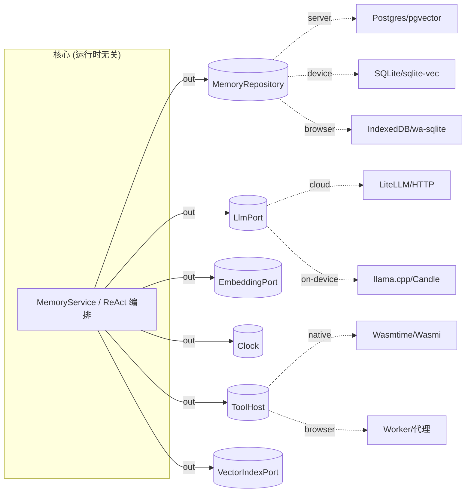

# 01 · 可移植核心(架构主脊)

整个可移植性命题只押在一件事上:**核心绝不假设运行时**。Python 的 `async` 绑定事件循环,朴素的 Rust 移植会顺手用 `tokio`,瞬间变得无法嵌入浏览器。本架构的核心因此遵守一组**移植纪律**,把它从平台细节里彻底解耦。

## 1. 核心设计纪律(决定成败)

1. **不绑定具体 async 运行时**:核心只用 `async-trait` + `futures`,**禁** `tokio`、**禁** `tokio::spawn`;executor 由宿主注入(native 用 tokio、wasm 用 `wasm-bindgen-futures`、FFI 用 `block_on`)。
2. **不碰 `std::time`**:时间经 `Clock` 端口注入(`std::time` 在裸 wasm 上需 JS、会 panic)。
3. **核心内不 spawn 任务**:并发编排留给宿主侧 runner。
4. **一切副作用表达为端口**:存储、LLM、embedding、时钟、插件宿主全是 trait;每个平台提供自己的 adapter。

> 这正是现有 Python 六边形边界(`domain/ports/`)用 Rust trait 的再表达。已在 Spike 中证伪通过(风险 #1),见 [04-spike-evidence](04-spike-evidence.md)。

## 2. 六边形端口(核心对外的全部契约)



| 端口 | 职责 | 详见 |
|---|---|---|
| `MemoryRepository` | Episode/Memory 的 save/find/list/search/delete | [03](03-platform-adapters.md) |
| `LlmPort` | 单次 LLM 调用(提取/推理) | [03](03-platform-adapters.md) |
| `EmbeddingPort` | 文本 → 向量 | [03](03-platform-adapters.md) |
| `VectorIndexPort` | 近邻检索(端上 sqlite-vec/hnsw) | [03](03-platform-adapters.md) |
| `Clock` | 注入时间,杜绝 `std::time` | 本文 §1 |
| `ToolHost` | **宿主沙箱化第三方工具**(可扩展性折叠进六边形) | [02](02-extensibility.md) |

设计要求:**端口支持回调接口** —— 宿主(Swift/Kotlin/JS)能实现某些端口(如存储)回注核心,验证 UniFFI/wasm-bindgen 双向调用。

## 3. 能力分层:什么上端,什么留服务器

并非所有能力都能上端。**可移植核心**承载与平台无关的智能,服务器保留重算力与多租户数据。

| 能力 | 归属 | 端上替代 |
|---|---|---|
| 智能体编排 / ReAct 状态机 / 记忆模型 / 技能-工具路由 / 同步 | **可移植核心**(四端) | —— |
| 重算力分布式(Ray Actor) | 服务器 | 端上单机执行,容量受限 |
| 多租户关系数据(Postgres) | 服务器 | SQLite/libsql |
| 知识图谱(Neo4j) | 服务器 | SQLite 关系表 / 内存 petgraph 近似 |
| 向量库(pgvector) | 服务器 | sqlite-vec / hnsw-rs |
| LLM 推理 | 云 API(默认) | llama.cpp / Candle / MLC-LLM |
| Docker sandbox(MCP) | 服务器 | WASM 沙箱(可上端,见 [02](02-extensibility.md)) |

## 4. Cargo workspace 结构(目标)

```
agi-stack/                         # 本根目录
├── crates/
│   ├── core/                      # 纯领域 + 应用:Memory/Episode/Agent、MemoryService、ReAct 编排
│   │                              #   仅 serde;运行时无关 async;禁 tokio / SystemTime 硬依赖
│   ├── ports/                     # (可并入 core) trait:MemoryRepository, LlmPort, EmbeddingPort,
│   │                              #   VectorIndexPort, Clock, ToolHost(async-trait)
│   ├── adapters-server/           # native-only:Postgres(sqlx)+pgvector;reqwest LLM
│   ├── adapters-device/           # native+mobile:SQLite(rusqlite/libsql)+sqlite-vec;reqwest LLM
│   ├── adapters-wasm/             # wasm-only:IndexedDB/wa-sqlite;gloo-net fetch LLM;内存 hnsw
│   ├── adapters-wasmi/            # 插件宿主:Wasmi 解释器宿主沙箱 wasm 工具(可编到任意目标含 wasm)
│   ├── adapters-wasmtime/         # 插件宿主(高性能):服务器/桌面 Wasmtime(待落地)
│   ├── bindings-uniffi/           # 移动端:uniffi 导出 Swift/Kotlin
│   └── bindings-wasm/             # web:wasm-bindgen/wasm-pack 导出 JS/TS
└── apps/
    ├── server/                    # axum 二进制(tokio 只在这里)
    ├── desktop/                   # Tauri
    ├── ios/                       # 最小 SwiftUI app 调 uniffi framework
    └── android/                   # 最小 Compose app 调 uniffi .so
```

**依赖方向严格单向**:`core` 不依赖任何平台相关物;其余 crate 依赖 `core`。`tokio` 只存在于 `apps/server`(及可选的服务器侧 Actor runner)。

> Spike 已用精简版(`core / adapters-mem / adapters-sqlite / adapters-wasmi / bindings-wasm / bindings-uffi / server`)验证该结构成立,见 `spikes/rust-portable-core/`。

## 5. 同步层(local-first 一等公民)

端上本地优先要求新增子系统(与语言无关):

- **CRDT / delta-sync**:端上离线编辑、回线后合并。
- **离线队列**:未联网时的写操作缓冲。
- **冲突解决**:最后写入 / 向量时钟 / 业务级合并策略。

这是 Phase 4 的独立工作项,核心需为其预留"变更日志"出口端口。
