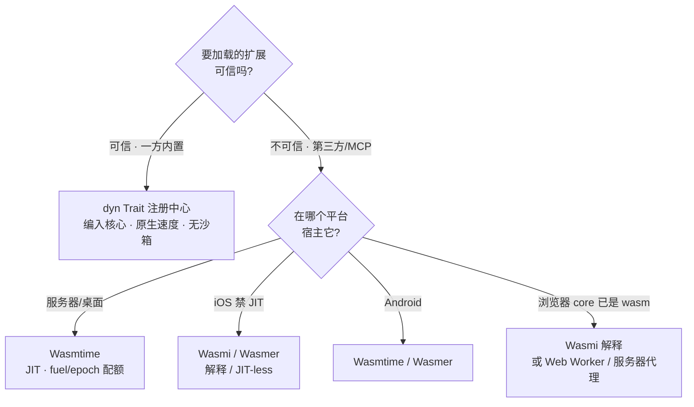
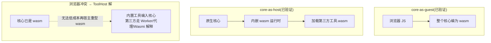

# 02 · 可扩展性 / 插件架构(第二条主轴)

> 背景:MemStack 本质是**智能体平台**,其 L1 Tool / L2 Skill / L3 SubAgent / MCP 全是**扩展点**。可移植核心([01](01-portable-core.md))只解决了"一份核心跑四端",缺了第二条轴:**可扩展性**。本架构依据《基于 Rust 的插件化与模块化架构》调研,按 **信任 × 平台** 两轴为每类扩展点选机制,并把"插件宿主"也做成一个六边形端口。

## 1. 两条选型轴(铁律)



- **信任轴**:可信(内置)→ `dyn Trait`,原生性能、无沙箱;不可信(第三方/MCP)→ **WASM 沙箱**。
  > **铁律**:绝不让不可信代码走 `cdylib` / 进程内动态库(无隔离、ABI 脆弱、一崩全崩)。MemStack 第三方工具一律 WASM。见 [ADR-0002](../adr/0002-untrusted-plugins-wasm-only.md)。
- **平台轴**:决定"谁宿主 WASM 插件"。**关键洞察:把"插件宿主"本身做成六边形端口 `ToolHost` / `PluginRuntime`,按平台换适配器** —— 与 storage/LLM 已有端口完全同构,可扩展性因此干净折叠进现有六边形模型。见 [ADR-0003](../adr/0003-plugin-host-as-hexagonal-port.md)。

## 2. 扩展点分类(MemStack 4 层 → Rust 机制)

| 层 | 扩展点 | 信任 | 频率 | Rust 机制 | 端上可行性 |
|---|---|---|---|---|---|
| L1 内置工具 | Terminal/Desktop/文件/代码智能/Plan/HITL | 一方·可信 | 中-高 | **dyn Trait 注册中心**(编入核心) | 全平台(原生编入) |
| L1 第三方/MCP 工具 | 市场工具、外部 MCP | **不可信** | 低-中 | **WASM 沙箱**(WASI/Component Model + WIT 契约) | 取决宿主运行时(§4) |
| L2 Skill | 声明式工具组合 + 触发器 | 配置·数据 | 低 | **数据(serde)** + 条件逻辑用 **Rhai**(纯 Rust、AST 可序列化、沙箱) | 全平台 |
| L3 SubAgent | 专家智能体(Wave5 已工具化) | 内置/第三方 | 低 | 同 L1(内置 dyn Trait / 第三方 WASM) | 同 L1 |
| L4 Agent | ReAct 环 / Processor / Doom / Cost | 核心引擎 | — | **核心本体**;原生侧可选 **Actor(Kameo)监督** | 核心全平台;Actor 仅原生 |

## 3. 插件宿主 = 新增端口 `ToolHost`

宿主运行时按平台替换,核心不感知:

```rust
// crates/core/src/ports.rs(已在 Spike 落地)
#[async_trait]
pub trait ToolHost: Send + Sync {
    fn list_tools(&self) -> Vec<String>;                       // 能力面
    async fn call(&self, tool: &str, input_json: &str)         // 调一个沙箱工具
        -> CoreResult<String>;
}
```

| 平台 | 核心形态 | WASM 宿主运行时 | 依据 |
|---|---|---|---|
| 服务器 / 桌面 | 原生二进制(core-as-host) | **Wasmtime**(Cranelift、pooling allocator、fuel/epoch 配额) | 冷启动微秒级、生产级隔离 |
| iOS | 原生静态库 | **Wasmer(V8 JIT-less)** 或 **Wasmi(纯解释器)** | iOS **禁 JIT**,Wasmtime 受限 |
| Android | 原生 .so | Wasmtime / Wasmer | NDK 内可 JIT |
| 浏览器 | 核心**自身**编为 WASM(core-as-guest) | 不能在 wasm 内再起重型 wasm 运行时 → 第三方工具走 **Web Worker / 服务器代理**,或 **Wasmi**(wasm 解释 wasm) | 见 §4 |

**统一可移植兜底**:`Wasmi`(纯 Rust 解释器)可编到**任意目标(含 wasm 自身)**,作"全平台一致宿主";`Wasmtime` 仅服务器/桌面作高性能升级。
→ **同一第三方工具 `.wasm`(WIT 契约)写一次,服务器 Wasmtime 跑、端上 Wasmi 跑。** 已 Spike 证伪通过(服务器 Wasmtime + fuel/epoch 配额见 [04 #18](04-spike-evidence.md),端上/浏览器 Wasmi 见 [04 #8](04-spike-evidence.md))。

### 3.1 热插拔生命周期(运行时换工具,不重启)

`ToolHost` 只解决"谁宿主";**怎么换、怎么下发**是热插拔生命周期。借鉴网关内部设计(详见 [research/gateways-internals](../research/gateways-internals.md)、[06 §2](06-agent-core-design.md)、[ADR-0006](../adr/0006-hot-plug-via-arcswap-and-proxy-wasm-abi.md)),三件事组成:

1. **注册中心原子换表**(ShenYu Copy-on-Write):`Arc<ArcSwap<ToolRegistry>>` 包裹已排序工具列表,变更 = clone→增删/重排→单次原子写,**读路径无锁**;新表在**轮次边界**生效([ADR-0005](../adr/0005-round-boundary-checkpoint.md)),不打断飞行轮次。
2. **跨宿主稳定 ABI**(proxy-wasm 三级上下文):`WasmRuntime→WasmToolModule→WasmToolInvocation`,Wasmtime 与 Wasmi 实现同一套 hostcall;异步工具用 `on_http_call_response` 回调(≈ `ActionPause`/resume)。
3. **CP/DP 配置推送**(Kong Hybrid Mode):云端控制面 → 端上数据面推 `ToolRegistrySnapshot{tools, version}`,DP 比对 `version`/hash **幂等 apply**,断线全量重传;服务器 gRPC/WS,端上 HTTP long-poll。**此 CP/DP 推送已升格为一等架构轴并形式化** —— 见 [08-control-data-plane-separation](08-control-data-plane-separation.md):控制面=SSOT、数据面**声明式 level-triggered reconcile**(自算 diff)、xDS 风格 version/nonce + **ACK/NACK + last-good**([ADR-0009](../adr/0009-control-data-plane-separation.md)/[0010](../adr/0010-xds-style-config-distribution.md))。

> **热插拔本质 = ABI 边界 + 原子替换**:`dyn Tool`/WASM 是边界,`ArcSwap` 是原子换,WASM 线性内存隔离保证新旧版本并存、旧实例 drain 后 RAII drop。

## 4. core-as-guest vs core-as-host(本质澄清,影响重大)



- **core-as-guest**:整个核心编为 wasm 跑浏览器。✅ 已验证。
- **core-as-host**:核心内嵌运行时加载工具插件。✅ 已验证(Wasmi)。
- 二者在浏览器冲突:核心已是 wasm,无法再低成本宿主重型 wasm。**解**:内置工具编入核心(含浏览器全平台可用);第三方工具在原生端进程内 Wasmtime/Wasmer/Wasmi 宿主,浏览器端走 Web Worker / 服务器代理 / Wasmi 解释。抽象出口即 `ToolHost` 端口(浏览器 proxy 适配器,原生 runtime 适配器)。

## 5. MCP 再定位(分层沙箱)

现状 `MCPSandboxAdapter`(云 Docker/WS)、`LocalSandboxAdapter`(本机/WS+隧道)→ Rust 化后形成**分层沙箱**:

| 沙箱档 | 形态 | 重量 | 可上端 | 选择依据 |
|---|---|---|---|---|
| **WASM-MCP** | WIT 契约的 WASM Component | 轻 | ✅(含移动端) | 信任低 / 性能预算紧 / 需离线 |
| **Subprocess/Docker-MCP** | 子进程 / 容器 | 重 | ❌(仅服务器) | 需完整 OS 能力 / 既有镜像 |

**Docker 上不了手机、WASM 能** —— 这是 local-first 端上工具的关键。选择由"信任 × 性能预算"定。

## 6. Skill = 数据 + Rhai;L4 监督 = 原生 Actor

- **Skill 声明式**:JSON/TOML 数据(serde)全平台可移植;触发/条件逻辑嵌 **Rhai**(纯 Rust、~3MB、AST 可序列化下发端上离线执行),避免为每个技能编译代码。✅ **已落地**:`crates/plugin-host/src/skill.rs`(`Skill`/`SkillContext`/`SkillEngine`)—— 沙箱化 Rhai 触发器(指令预算 `set_max_operations(50_000)` + 禁 `eval` + expr-depth/string/array/map 上限,**无墙钟/std::time**)+ 组合注册中心**已准入**工具,**信任轴守恒**(配置层无原生码、只能编排已准入工具,语义路由仍归 agent),样例 `skills/weather-skill.json` 经 `include_str!` 端到端测试,**9 测试绿、同编 `wasm32`**(`getrandom` `wasm_js` 后端),见 [04 #23](04-spike-evidence.md)。
- **L4 运行时监督**:`SessionProcessor / DoomLoopDetector / CostTracker / 重启退避` 契合 **Actor 监督树(Kameo)**。但 Actor 需 Tokio → **仅原生侧**作 "runner" 叠加在核心之上;**核心保持运行时无关**(wasm 侧用单线程协作执行器驱动同一逻辑),与 Spike "tokio 仅限 server" 一致。

## 7. 性能梯队(指导"哪类扩展走哪条路")

| 机制 | 相对原生 | 用途 |
|---|---|---|
| 原生 `dyn Trait` | ≈100% | 热路径内置工具 |
| `cdylib` / `abi_stable` | ≈95% | **仅可信 · 本架构不用**(铁律见 §1) |
| WASM(Wasmtime) | ≈60–80% | 不可信第三方/MCP 工具 |
| 跨进程 RPC | ≈30–60% | 重型 / 隔离要求高的 MCP |
| Rhai 解释 | ≈5–20% | 技能条件逻辑(调用稀疏,可容忍) |

→ 热路径内置工具用 `dyn Trait`;不可信工具容忍 WASM 60–80%;技能条件逻辑容忍 Rhai 低速。

## 8. 设计不变量(实现时必须守住)

1. 不可信代码**永不**进程内动态加载,只走 WASM 沙箱。
2. 插件宿主**永远**藏在 `ToolHost` 端口之后,核心不 import 任何具体运行时(Wasmtime/Wasmi)。
3. 内置工具与第三方工具对核心**呈现同一调用面**(`ToolHost::call` 或内置注册中心),路由由信任级别决定,核心逻辑不分叉。
4. 第三方工具契约用 **WIT**(Component Model),与宿主运行时解耦;PoC 期可用裸 wat 过渡。

---

> **延伸 · 多层插件运行时**:本篇定"扩展点该走哪种机制(信任 × 平台)"。当扩展点扩展到十几类(工具/技能/Provider/Channel/Hook/甚至替换整个 Agent 循环的 Harness)时,如何用**统一的能力注册模型 + 插件形态分类 + 可插拔 Harness + 热插拔生命周期**把它们组织起来,见 [07-plugin-runtime-architecture](07-plugin-runtime-architecture.md)(学习 OpenClaw 多端运行时后的综合,已由 [04 #9](04-spike-evidence.md) Spike 证伪)。
