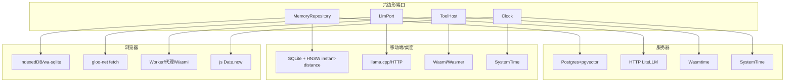

# 03 · 按平台适配器矩阵

每个六边形端口([01](01-portable-core.md))在不同平台有不同实现。这就是"一份核心 + 平台外壳"落到实处的地方:**端口不变,适配器按平台替换**。

## 1. 存储(`MemoryRepository` / `VectorIndexPort`)

| 平台 | 存储适配器 | 向量检索 | Spike 状态 |
|---|---|---|---|
| 服务器 | Postgres + pgvector + Neo4j + Redis | pgvector | `adapters-mem` 桩代替(prod 待接) |
| 桌面 / iOS / Android | 嵌入式 SQLite/libsql(`rusqlite` bundled) | **HNSW**(`instant-distance`,纯 Rust)/ SQLite 暴力兜底 | ✅ `adapters-device` 已实现:`HnswVectorIndex` ANN(N=10k P50 **2.43 ms**,见 [04 #19](04-spike-evidence.md))+ `SqliteVectorIndex` 暴力基线;**不选 `sqlite-vec` C 扩展**以保跨端可移植 |
| 浏览器 | IndexedDB / wa-sqlite | 内存 hnsw | ✅ 内存路径(`adapters-mem`);prod 待接 wa-sqlite |

> **重要发现(Spike 实测)**:`rusqlite { bundled }` 编译 SQLite C 源,**完美适配原生设备**(iOS/Android/桌面),但**无法**编到 `wasm32-unknown-unknown`(`stdio.h` 缺失,裸 wasm 无 libc)。这不是失败 —— 正是六边形边界在起作用:**同一 `MemoryRepository` 端口由不同适配器满足**。

## 2. LLM / Embedding(`LlmPort` / `EmbeddingPort`)

| 形态 | 适配器 | 说明 |
|---|---|---|
| 云端(默认) | HTTP 调 LiteLLM 兼容端点(`reqwest` / `gloo-net`)—— ✅ 已落地 `crates/adapters-http-llm`(`HttpLlm`/`HttpEmbedding`,OpenAI 兼容,见 [04 #20](04-spike-evidence.md)) | 复用现有多 provider(Gemini/Dashscope/Deepseek/OpenAI/Anthropic) |
| 端上(离线) | llama.cpp / Candle / ONNX Runtime(ort)/ MLC-LLM | 体积与可行性见 [05 风险](05-roadmap.md);端口与 DI 切换骨架已就位,本地大模型标注 future |

抽象为端口的收益:同一编排逻辑,云/端两套 adapter 切换,核心零改动。**已验证**:`apps/server` 经 `select_llm_and_embedding()` 按环境变量(`AGISTACK_LLM_BASE_URL`…)在缺省**离线 stub**(`StubLlm`+`HashEmbedding`,零网络零 key)与 **HTTP 适配器**间切换;`reqwest`/`tokio` 严格隔离在 adapter 与 server,绝不泄漏回核心 `wasm32` 构建。

## 3. 插件宿主(`ToolHost`)

详见 [02-extensibility §3](02-extensibility.md)。摘要:

| 平台 | 运行时适配器 | Spike 状态 |
|---|---|---|
| 服务器 / 桌面 | Wasmtime(JIT、fuel/epoch) | ✅ `adapters-wasmtime` 已验证(fuel+epoch 双配额 + WIT 契约 + 运行时字节加载;5 测试绿;server `/v1/tools/call` 端到端;见 [04 #18](04-spike-evidence.md)) |
| iOS | Wasmi / Wasmer(禁 JIT) | ✅ `adapters-wasmi` 已验证(通用兜底) |
| Android | Wasmtime / Wasmer | 🎯 待落地(可复用 `adapters-wasmtime`,NDK 内可 JIT) |
| 浏览器 | Web Worker / 服务器代理 / Wasmi 解释 | ✅ Wasmi 路径已验证(可编到 wasm) |

## 4. 时钟(`Clock`)

| 平台 | 适配器 |
|---|---|
| native | `std::time::SystemTime` 包装 |
| wasm | `js_sys::Date::now()` / `performance.now()`(✅ 生产 `WasmClock`,见 [04 #16](04-spike-evidence.md)) |
| 测试 | 固定/可控时钟(确定性测试) |

核心**永不**直接 `SystemTime`,一律经此端口 —— 否则 wasm 编译/运行即崩。

## 5. 平台外壳(apps)

| 平台 | 外壳 | 绑定方式 |
|---|---|---|
| 服务器 | axum 二进制 | 直接链核心 |
| 桌面 | Tauri | 直接链核心(Rust 后端 + Web 前端)(✅ `apps/desktop`,见 [04 #17](04-spike-evidence.md)) |
| iOS | SwiftUI app | UniFFI → 生成 Swift 绑定,链 `.a` |
| Android | Compose app | UniFFI → 生成 Kotlin 绑定,链 `.so` |
| Web | JS/TS 前端 | wasm-bindgen → wasm-pack 包(✅ `crates/bindings-wasm`,见 [04 #16](04-spike-evidence.md)) |

## 6. 端口 × 平台 总览

## 7. 适配器实现纪律

- 每个适配器**一个 crate / 一个文件**为度量目标(Spike 实测 server/wasm/sqlite/uffi 各 adapter ≈ 一个文件,核心跨目标零改动)。
- 适配器**可依赖平台库**(tokio、rusqlite、wasm-bindgen),但**绝不**把这些类型泄漏回核心端口签名。
- 端口签名只用核心类型(`Memory`、`Episode`、`CoreResult`、`String`/`serde_json`),保证可被 Swift/Kotlin/JS 宿主回调实现。
