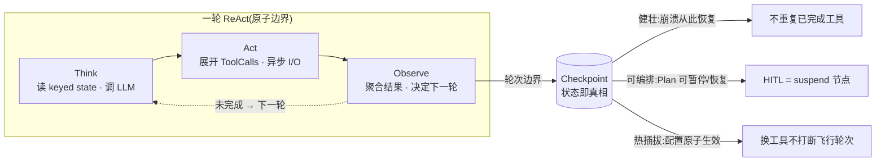
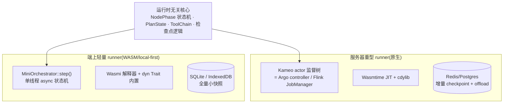

# 06 · Agent 核心设计:健壮 · 可扩展 · 热插拔 · 可编排

> 第三条主轴。[01](01-portable-core.md) 解决"一份核心跑四端",[02](02-extensibility.md) 解决"信任 × 平台两轴加载扩展",本篇解决**核心引擎本身的运行时质量**:在保持 Rust 运行时无关核心的前提下,如何让 ReAct Agent 做到 **健壮(robust)· 可扩展(extensible)· 热插拔(hot-pluggable)· 可编排(orchestratable)**。
>
> 方法论:**不集成**网关 / Flink / Argo,而是**学习其内部设计**。三个源码级调研(均带 `owner/repo:path:line` 引用,沉淀于 [`../research/`](../research/README.md))分别贡献:
> - **网关**(Apache ShenYu / Kong / Higress+Envoy proxy-wasm)→ 热插拔 · 可扩展
> - **Flink** → 健壮
> - **Argo Workflows** → 可编排 · 健壮

---

## 1. 核心洞察:三视角在 ReAct 环上收敛

同一个 `Think → Act → Observe` 循环,被三套成熟系统以不同语言描述,却**收敛到同一个原语**:

| 系统 | 它把一轮 ReAct 看成 | 在哪里"落盘/对齐" |
|---|---|---|
| **Flink** | 一个有状态 dataflow 的"微 epoch",按 `conversation_id` keyed | Observe 完成处插 **barrier**(Chandy-Lamport checkpoint) |
| **Argo** | 一次 **reconcile**,对 Plan 节点树做"状态即真相"的幂等推进 | `operate()` 末尾 `persistUpdates`(乐观锁) |
| **Higress** | 一段可在 WASM 内异步跑完的 in-proxy ReAct(`ActionPause`/resume) | 工具回调到达后 resume,轮次计数器存 per-request context |

> **收敛铁律:轮次 / 迭代边界 = checkpoint 点 = reconcile 持久化点 = 配置热应用点。**

这一个原语**同时**交付四个质量目标:



落到 MemStack:`SessionProcessor` 的 Think→Act→Observe 即三个串联"算子",`conversation_id` 是 key;`pending_events → yield` 的边界就是插 checkpoint 的位置。后续四节分别展开四个质量目标的机制来源与 Rust 落地。

---

## 2. 热插拔(来源:网关 — Registry 原子换表 + CP/DP 配置推送 + 稳定 ABI)

**热插拔的本质 = ABI 边界 + 原子替换。** ShenYu 用 ClassLoader 边界 + volatile list swap;proxy-wasm 用 WASM VM 线性内存边界 + xDS 触发 VM 重建。Rust 中:`dyn Tool` / WASM 是 ABI 边界,`ArcSwap` 是原子替换机制。

| 网关内部机制 | 来源 · 引用 | Rust Agent 核心落地 |
|---|---|---|
| Copy-on-Write volatile list swap | ShenYu `ShenyuWebHandler.onPluginEnabled/Removed` | `Arc<ArcSwap<ToolRegistry>>` 包裹**已排序**工具列表;注册 = clone→push→swap(单次原子写),读路径 `registry.load()` **无锁** |
| `PluginDataSubscriber` 观察者 | ShenYu `PluginDataSubscriber.java` | `trait ToolConfigSubscriber { on_enabled/on_disabled/on_updated(name, cfg) }`,由控制面驱动 `ToolHost` 更新 |
| 三级上下文 `VMContext→PluginContext→HttpContext` | proxy-wasm `tetratelabs/proxy-wasm-go-sdk` | **直接映射 `ToolHost`**:`WasmRuntime`(VM)→ `WasmToolModule`(含工具配置)→ `WasmToolInvocation`(单次调用) |
| proxy-wasm ABI 版本化(v0.1→v0.2.1) | `proxy-wasm/spec` | 定义**稳定的 Rust trait ABI**:`on_module_start(cfg)` / `on_invoke(req)->Status` / `on_tick()`;Wasmtime(服务器)与 Wasmi(端上)实现**同一套 hostcall** |
| `ActionContinue / ActionPause` + 异步 hostcall 回调 | Higress `ai-agent/main.go` | WASM 工具通过 hostcall 发起异步请求,host 持 `Waker`,结果到达后 resume —— in-proxy ReAct 已证此模式可行 |
| CP/DP 分离 + WebSocket 推送 + config hash | Kong `control_plane.lua` / `data_plane.lua` | 云端 `ToolConfig` 控制面 → 边缘/端上 `ToolHost` 数据面:推 `ToolRegistrySnapshot{tools, version}`,DP 比对 `version`/hash **幂等 apply**,断线重连全量重传 |

**热换工具流程(零重启,借鉴 Envoy ECDS + ShenYu swap)**:
```
收到 .wasm bytes / 配置 delta
  → Module::new() → Instance::new() → on_module_start(cfg)   // 新实例就绪
  → clone 当前 registry → 插入/替换该工具 → ArcSwap 原子写
  → 新一轮 ReAct 在轮次边界 load() 到新表(§1 原语)
  → 旧 Instance 待持有它的飞行调用完成后由 RAII 自动 drop
```
**端上可行性**:`ArcSwap`/原子换表在 iOS、浏览器(单线程 WASM)均可用;热换载体在端上走 **Wasmi**(解释器、iOS 无 JIT 合规),服务器可升级 **Wasmtime**(JIT)。

---

## 3. 可扩展(来源:网关 — 责任链 + 条件短路 + 两级匹配)

**责任链是迭代器模式,不是递归**:ShenYu 的 `DefaultShenyuPluginChain` 用 `index` 推进而非调用栈递归,Rust 可用 `index: usize` 精确复刻,无栈深问题。

| 网关内部机制 | 来源 · 引用 | Rust Agent 核心落地 |
|---|---|---|
| 责任链 + index 迭代器 | ShenYu `DefaultShenyuPluginChain.execute()` | `ToolChain` 持 `Vec<Arc<dyn Tool>>` + `index`;`chain.proceed()` 推进;返回 `Continue(out)` / `Halt(out)` / `Pause`(类 `ActionContinue/Pause`) |
| `skip(exchange)` 条件短路 | ShenYu `ShenyuPlugin.skip()` | `Tool::should_run(&AgentContext) -> bool`,基于环境/上下文跳过不适用工具(如 CLI env 下跳过 browser tool) |
| Selector / Rule 两级匹配 | ShenYu `AbstractShenyuPlugin.execute()` | L2 Skill 触发:粗 `selector`(agent 类型)+ 细 `rule`(intent 分类),先粗后细;复用既有 keyword/semantic/hybrid 触发 |
| 插件优先级整数排序(运行时可改) | ShenYu `sortPlugins()` | `tool_config.priority: u32` 来自控制面;`ToolChain` 按此排序,变更经 §2 ArcSwap 原子换有序表 |
| 组合 key 最精确匹配 | Kong `lookup_cfg()` 8 级优先级 | 工具适用范围 `(agent_type, skill_id, user_group)` 组合 key,最精确 wins,fallback 全局默认 |

> **Agent First 守则**:`should_run` 的"是否适用"、selector/rule 的"哪个 Skill 命中"属**语义判断**,按本仓库铁律应由 agent 工具调用决策;此处的链推进、优先级排序、组合 key 查找是**结构/算术**事实,保持确定性。两者边界与网关一致(网关的 `skip` 是结构判断,AI 的"是否适用"是语义判断)。

---

## 4. 健壮(来源:Flink — Keyed State · 轮次 Checkpoint · 反压 · 对齐 · 失败隔离)

| Flink 内部机制 | Rust 轻量实现方向 | 交付的健壮性 |
|---|---|---|
| **Keyed State**(按 `conversation_id`) | `HashMap<ConvId, SessionState>` + serde 序列化到 SQLite/Redis | 会话级隔离与可恢复 |
| **轮次 Checkpoint**(barrier 语义) | Observe 结束**原子写** snapshot;`AtomicU64` 记版本号(对应 `checkpointId`) | 崩溃从轮次边界恢复 |
| **增量 Checkpoint**(SST 共享) | 仅写本轮 delta(新增 messages append-only、更新 plan/pending_tools);每 N 轮写一次全量 | 低 I/O 持久化 |
| **Credit-Based 反压** | bounded `mpsc` / `tokio::Semaphore`;`pending_events` 上界 = credit,满则 `yield` 自然背压到 LLM 速率 | 防 `pending_events` 无限积压 OOM |
| **Watermark min-alignment** | `FuturesUnordered + timeout`:并行多工具回调,等"最慢一个或超时"才推进 Observe;超时 = `WatermarkStatus.IDLE`(放弃该路) | 乱序工具回调正确聚合 |
| **Region Failover**(区域重启) | Kameo actor-per-conversation + supervisor:一会话崩溃只重启该 actor,其余继续 | 会话级失败隔离 |
| **FailureRate 退避重启** | `tokio-retry` + `DoomLoopDetector` 计数 | 工具循环时指数退避,防 API 费用爆炸 |
| **At-Least-Once + 幂等** | Redis Streams `XACK` + 幂等 `event_id` | 事件"至少一次"投递 = 实际 exactly-once |

**不照搬的重型机制**(Agent 场景过重):分布式 barrier 对齐(单进程用 `Mutex<SessionState>` + 轮次原子写)、Netty credit RPC(Redis Streams 足够)、JobManager/TaskManager 分布式调度(Kameo 单进程监督足够)、RocksDB 后端(SQLite/`sled` 足够,WASM 用 IndexedDB)、窗口 Trigger/Evictor(只有"轮次边界"触发点)、算子并行度/重分区(单 Agent 顺序执行,多会话并行交给 actor pool)。

---

## 5. 可编排(来源:Argo — Reconcile · 动态 DAG · suspend=HITL · retry · memo)

Argo 的 5 条核心设计原则直接指导 Agent 编排:**①状态即真相 ②调和而非命令 ③层级节点树(BoundaryID)④惰性求值 ⑤机制与策略分离**。

| Argo 内部机制 | 来源 · 引用 | Rust Agent 核心落地 |
|---|---|---|
| reconcile loop + `wfOperationCtx` | `operator.go:operate()` | `PlanOperationCtx`(per-plan, per-reconcile):每轮从头遍历节点树、按当前状态决定下一步,**天然幂等** |
| `NodePhase` 状态机 | `workflow_types.go` | `ToolNode.phase`:Pending/Running/Succeeded/Failed/Error/Skipped/Omitted |
| **DAG + `depends` 表达式** | `dag.go:executeDAGTask` | **Plan = append-only DAG**:`Plan{Enter}` 生成初步 N 步,`Plan{Update}` 运行中**追加节点**(已执行节点不可改 → 幂等),`Plan{Exit}` 完成。详见 [ADR-0004](../adr/0004-plan-as-append-only-dag.md) |
| steps(顺序/并行组) | `steps.go` | L2 Skill 执行步骤 `[[a],[b,c],[d]]` 直接对应 |
| `withItems/withParam` fan-out | `dag.go` | 并行调多子 Agent / 工具,结果聚合为 JSON list |
| `when` 条件分支 | `dag.go` | LLM 分类结果驱动路由(语义判断 → agent 决策) |
| **suspend / resume** | `IsActiveSuspendNode` | **HITL 四类** = 挂起一个 Suspend 节点等外部输入;详见下表 |
| **retryStrategy**(指数退避) | `processNodeRetries` | `Backoff{duration, factor, cap}` + `OnError` → 完美映射 LLM 429 限流重试 |
| **memoization**(缓存命中跳过) | `cache/configmap_cache.go` | key = `hash(tool_name + canonical(inputs))`;命中直接 `markSucceeded + copy outputs`,对昂贵 LLM 推理尤其关键;存储可换(SQLite/Redis) |
| `parallelism` + `syncManager` | controller | 并发工具上限 = `Semaphore`;共享资源(DB 连接)并发控制 |
| 机制 / 策略分离 | 全局 | retry/memo/suspend 是引擎通用**机制**;具体策略(退避参数、cacheKey、重试条件)由**工具自声明** |

**HITL 四类 = Argo Suspend 节点的精确映射**:

| HITL 类型 | Suspend 节点携带 | Resume 触发 |
|---|---|---|
| `clarification` | 问题文本 | 用户回复 → patch `outputs.answer` |
| `decision` | 选项列表 | 用户选择 → patch `outputs.choice` |
| `env_var` | 变量名 | 用户填值 → patch `outputs.value`(沿用 `response_data_encrypted` 密封) |
| `permission` | 权限描述 | 批准/拒绝 → node phase = Succeeded/Failed |

> **动态 DAG 取舍**:Argo 假设 DAG 静态,Agent 是 LLM 边执行边规划的动态 DAG。选 **方案 B(Plan as append-only DAG)** 而非纯线性 ReAct(方案 A,无编排)或类 Argo 全动态 `withParam`(方案 C,过重)。理由见 [ADR-0004](../adr/0004-plan-as-append-only-dag.md)。

---

## 6. 重型(服务器)vs 轻量(端上)分叉 —— 三系统结论一致

三份调研对"重/轻"的切分高度一致,且都强化既有不变量:**核心运行时无关,Actor/tokio/Wasmtime/cdylib 仅原生侧**。



| 维度 | 服务器重型版 | 端上轻量版 |
|---|---|---|
| 编排/监督 | Kameo actor 监督 + reconcile controller | 无 Actor,`MiniOrchestrator::step()` 找 ready 节点 → 限并发派发 → apply → assess |
| 状态/检查点 | Redis/Postgres + 增量 checkpoint + hydrator offload | SQLite / IndexedDB(`gloo-storage`)+ 全量小快照(端上数据小) |
| 插件宿主 | Wasmtime(JIT)+ 可信 cdylib | Wasmi(解释,iOS 无 JIT 合规)+ 内置 `dyn Trait` |
| 反压/并发 | `tokio::Semaphore` + bounded channel | 单线程协作执行器,逻辑同构 |
| HITL 暂停 | `tokio::oneshot` / DB 轮询 | JS Promise + `wasm-bindgen-futures` 桥接 |
| retry 计时 | `tokio::time` | 宿主注入时间 + `wasm-bindgen` `setTimeout`(核心禁 `std::time`) |
| 配置推送 | gRPC streaming / WebSocket | WebSocket / HTTP long-poll(iOS 后台限制) |

---

## 7. 设计不变量(实现时必须守住)

1. **轮次边界是唯一 checkpoint 点**(§1)。Think→Act→Observe 是原子微 epoch;不在轮次中途持久化,避免"已执行工具但未记录 Observe"的不一致。
2. **状态即真相**(Argo 原则①)。会话/Plan 全状态可序列化、可从存储重建;崩溃恢复 = 重新 reconcile,不依赖内存态。
3. **核心运行时无关**(沿用 01/02)。无 tokio / `std::time` / 直接文件系统;时间、IO、宿主能力一律经端口注入。Kameo/Wasmtime/cdylib 仅原生侧 runner。
4. **热插拔 = ABI 边界 + ArcSwap 原子换表**(§2)。读路径无锁;变更在轮次边界生效,不打断飞行轮次;不可信工具一律 WASM(沿用 [ADR-0002](../adr/0002-untrusted-plugins-wasm-only.md))。
5. **机制与策略分离**(Argo 原则⑤)。retry/memo/suspend/反压是引擎机制;退避参数、cacheKey、重试条件、并发上限由工具/Skill 声明,LLM 不关心。
6. **语义判断归 agent,结构/算术归确定性**(本仓库 Agent First 铁律)。链推进、优先级排序、信号量计数、版本 hash 比对保持确定;"工具是否适用 / 走哪条分支 / 健康还是 doom-loop"由 agent 工具调用裁决。

---

## 关联文档

- 证据基(源码级引用):[`../research/gateways-internals.md`](../research/gateways-internals.md)、[`flink-internals`](../research/flink-internals.md)、[`argo-internals`](../research/argo-internals.md)
- 决策记录:[ADR-0004 Plan append-only DAG](../adr/0004-plan-as-append-only-dag.md)、[ADR-0005 轮次边界 checkpoint](../adr/0005-round-boundary-checkpoint.md)、[ADR-0006 ArcSwap + proxy-wasm 热插拔](../adr/0006-hot-plug-via-arcswap-and-proxy-wasm-abi.md)
- 上游主轴:[02-extensibility](02-extensibility.md)(信任 × 平台)、[05-roadmap](05-roadmap.md)(落地阶段与 go/no-go)
