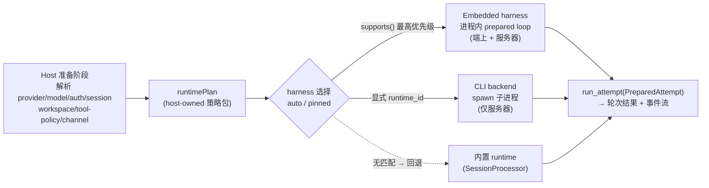

# 07 · 多层插件运行时:能力注册 · 插件形态 · 可插拔 Harness · 热插拔生命周期

> 第三主轴的延伸。[02](02-extensibility.md) 用"信任 × 平台"两轴解决**扩展点该走哪种机制**,[06](06-agent-core-design.md) 用"轮次边界"原语解决**核心引擎的运行时质量**。本篇回答最后一个工程问题:**当扩展点有十几种、插件横跨工具/技能/Provider/Channel/甚至替换整个 Agent 循环时,如何用一套统一、可观测、可热插拔的注册模型把它们组织起来?**
>
> 方法论延续:**不集成** OpenClaw,而是**学习其被 380K★ 验证过的多层运行时与插件机制**。源码级调研(带 `owner/repo:path:line` 引用)沉淀于 [`../research/openclaw-runtime-internals.md`](../research/openclaw-runtime-internals.md)。本篇产出已由可运行 Rust Spike 证伪通过(见 [04 §1 #9](04-spike-evidence.md))。

---

## 1. 核心洞察:运行时是一层,不是一个开关

agi-stack 既有模型把"重型服务器 runner"与"轻量端上 runner"看成同一核心的两种**部署形态**(见 [06 §6](06-agent-core-design.md))。OpenClaw 的工业实践揭示了一个更精细的分层:**Provider、Model、Agent Runtime、Channel 是四个正交的层**,而"换 runtime"是一等公民的扩展行为,不是 if/else 开关。

| 层 | 职责 | 谁拥有 | agi-stack 既有对应 |
|---|---|---|---|
| **Provider** | 认证、模型发现、model-ref 命名空间 | 插件 | LLM 端口的 cloud adapter |
| **Model** | 本轮选用模型(`provider/model` 复合 ref) | 配置 | 运行时参数(温度/max_tokens) |
| **Agent Runtime** | 执行**已准备好的一轮**的底层循环/后端 | 插件或内置 | `SessionProcessor`(唯一内置) |
| **Channel** | 消息进出的传输面 | 插件 | WebSocket / Feishu adapter |

> **收敛铁律(延续 06)**:[06](06-agent-core-design.md) 证明"轮次边界 = checkpoint = reconcile = 配置热应用点"。本篇补上**正交的第二刀**:**Agent Runtime 是可被插件替换的一层**,而替换/注册/卸载同样发生在轮次边界。两条铁律合起来 = "在轮次边界,既能原子换工具表,也能原子换整个执行循环"。

OpenClaw 的关键不变量(`openclaw/openclaw:docs/concepts/agent-runtimes.md`):**runtime 永远按 `(provider, model)` 解析,整会话/整 agent 的 runtime pin 一律忽略**。agi-stack 采纳为不变量 —— 这天然契合"轮次边界原子换",因为每轮都重新解析 runtime,不存在跨轮的隐式锁定。

---

## 2. 能力注册模型(来源:OpenClaw `api.register*` → Rust `CapabilityRegistry`)

OpenClaw 每个 native 插件通过约 **15 类 `api.register*`** 方法对**能力契约**注册,而非堆叠匿名 hook(`openclaw/openclaw:docs/plugins/architecture.md:36-53`)。这把"插件贡献了什么"变成 typed、可枚举、可卸载的事实。

| OpenClaw 能力注册 | 来源 · 引用 | Rust 落地 |
|---|---|---|
| `registerProvider` / `registerCliBackend` | `docs/plugins/sdk-overview.md:91-113` | `CapabilityImpl::TextProvider(Arc<dyn TextProvider>)` / `::CliBackend(...)` |
| `registerEmbeddingProvider` / `registerSpeechProvider` | 同上 | `::Embedding(...)` / `::Speech(...)` |
| `register{Image,Music,Video}GenerationProvider` | 同上 | `::MediaGen{kind, Arc<dyn ...>}` |
| `registerChannel` | 同上 | `::Channel(Arc<dyn Channel>)` |
| `registerAgentHarness`(实验,bundled-only) | `docs/plugins/sdk-agent-harness.md` | `::AgentHarness(Arc<dyn RuntimeHarness>)`(信任门控,见 §4/§7) |
| `registerHook`(基础设施) | `docs/plugins/sdk-overview.md:164` | `::Hook{phase, Arc<dyn Hook>}` |
| `registerTool` / `registerCommand` / `registerService` | 同上 | `::Tool(Arc<dyn Tool>)` / `::Command(...)` / `::Service(...)` |
| `registerHttpRoute` / `registerTrustedToolPolicy` | 同上 | `::HttpRoute(...)` / `::TrustedToolPolicy(...)`(信任门控) |

**Rust 形态(typed 注册中心,替代 ad-hoc hook 堆叠)**:
```rust
pub enum CapabilityKind { Tool, Skill, Provider, Channel, Harness, Hook, HttpRoute, /* ... */ }

pub enum CapabilityImpl {
    Tool(Arc<dyn Tool>),
    Provider(Arc<dyn TextProvider>),
    Channel(Arc<dyn Channel>),
    AgentHarness(Arc<dyn RuntimeHarness>),   // 仅 bundled/可信
    Hook { phase: HookPhase, hook: Arc<dyn Hook> },
    // ...
}

pub struct CapabilityRegistry {
    by_key: BTreeMap<(PluginId, CapabilityKind, CapId), CapabilityImpl>, // 确定性有序
}
```

> **核心原则(`openclaw/openclaw:docs/plugins/architecture.md:262`)**:**plugin = 所有权边界;capability = 多个插件可实现/消费的核心契约**。Rust 中 `PluginId` 标识所有权(用于 enable/disable/卸载的整批操作),`CapabilityKind` 标识契约类型(用于核心按类型查找实现)。二者解耦,使"一个插件贡献多种能力"与"多个插件实现同一能力"都自然成立。

**Spike 实证**(`crates/plugin-host/`):最小切片聚焦 `Tool` 能力 —— `ToolRegistry` 持 `Arc<dyn Tool>` 集合,`PluginManifest` 声明 tools/skills/providers,`shape()` 按能力种类计数分类。完整模型只需把单一 `Tool` 扩为上述 `CapabilityImpl` 枚举,注册/换表/分类逻辑不变。

---

## 3. 插件形态分类(来源:OpenClaw Plugin Shapes → Rust `PluginShape`)

OpenClaw 把每个已加载插件按 **`register(api)` 后的实际注册行为**(而非静态声明)分类(`openclaw/openclaw:docs/plugins/architecture.md:70-89`)。这让 `openclaw plugins inspect <id>` 能客观回答"这插件到底是什么"。

| Shape | 判定 | 例 | agi-stack 用途 |
|---|---|---|---|
| **`PlainCapability`** | 恰好 1 种能力类型 | `mistral`(仅文本) | 单一职责 Provider/工具插件 |
| **`HybridCapability`** | ≥2 种能力类型 | `openai`(文本+语音+图像+…) | 多能力套件插件 |
| **`HookOnly`** | 仅 hook,无能力/工具 | 合规日志、预算监控 | 横切关注点 |
| **`NonCapability`** | 注册工具/命令/服务/路由但无能力 | 纯工具插件、webhook | 基础设施扩展 |

**Rust 形态 + 判定逻辑**(Spike 已实现,`crates/plugin-host/src/manifest.rs`):
```rust
pub enum PluginShape { PlainCapability, HybridCapability, HookOnly, NonCapability }

fn shape(&self) -> PluginShape {
    let kinds = self.distinct_capability_kinds(); // Tool/Skill/Provider/Channel 计数
    match (kinds, self.has_hooks()) {
        (0, true)  => PluginShape::HookOnly,
        (0, false) => PluginShape::NonCapability,
        (1, _)     => PluginShape::PlainCapability,
        (_, _)     => PluginShape::HybridCapability,
    }
}
```

> **可观测性即设计目标 🎯**:shape 不是装饰,而是**运维与安全的抓手**。`inspect` 暴露 shape 后,可对"声称是工具插件却注册了 HttpRoute"的 `NonCapability` 插件做策略告警;对不可信 WASM 插件强制只能落 `PlainCapability(Tool)`(见 §7 信任门控)。Spike 的 `lifecycle.rs` 测试已断言 `scorer`(tool-only)= `PlainCapability`、`notes`(tools+providers)= `HybridCapability`。

---

## 4. Harness = 可插拔 Runtime(来源:OpenClaw embedded vs CLI-backend)

OpenClaw 把"执行一轮"的实现称为 **harness**,分两大家族(`openclaw/openclaw:docs/plugins/sdk-agent-harness.md`、`docs/plugins/cli-backend-plugins.md`):

- **Embedded harness**:进程内 prepared loop(内置 `openclaw`、插件 `codex`/`copilot`)。`api.registerAgentHarness(...)`。
- **CLI backend**:spawn 外部 CLI 子进程(`claude-cli`),保持 model-ref 规范。`api.registerCliBackend(...)`。

关键设计:**host 准备 / harness 执行 分离**。Host 解析 provider/auth/session/workspace/tool-policy/channel,打包成一个 host-owned 的 `runtimePlan`(`tools.normalize` / `transcript.resolvePolicy` / `outcome.classifyRunResult`);harness 只收到一个**完全准备好的 attempt** 去执行(`openclaw/openclaw:docs/plugins/sdk-agent-harness.md` "What core still owns")。



**`auto` 选择算法**(`openclaw/openclaw:docs/plugins/sdk-agent-harness.md` "Selection policy"):model-scoped > provider-scoped > `auto`(问所有 harness `supports(ctx)` 取最高 priority)> 回退内置。

| OpenClaw 机制 | 来源 · 引用 | Rust 落地 |
|---|---|---|
| `AgentHarness{id,supports,runAttempt}` | `docs/plugins/sdk-agent-harness.md` | `trait RuntimeHarness { fn runtime_id(&self)->&str; fn supports(&self,&HarnessCtx)->Option<u32>; async fn run_attempt(&self, PreparedAttempt)->CoreResult<TurnOutcome> }` |
| embedded vs CLI backend 二分 | `docs/plugins/cli-backend-plugins.md` | `EmbeddedHarness`(端上+服务器)vs `CliBackendHarness`(**仅服务器**,spawn 子进程,违 06 不变量者不上端) |
| `auto` 优先级 + 回退 | 同上 | `HarnessRegistry::select(ctx)`:遍历 `supports()` 取 max priority,无则回退内置 `SessionProcessor` |
| `runtimePlan` 策略包 | 同上 | `Arc<RuntimePlan>{ normalize_tools, classify_outcome, is_silent }`,host 解析后传入 |
| `ownsNativeCompaction` 标志 | 同上 | CLI backend 置位 → host compactor 跳过,避免双重压缩 |
| runtime 永远 `(provider,model)` scoped | `docs/concepts/agent-runtimes.md` | **采纳为不变量**:每轮重解析 runtime,无整会话 pin → 契合轮次边界换 |

> **与既有"重/轻分叉"的关系**:[06 §6](06-agent-core-design.md) 的"服务器重型 / 端上轻量"是**同一 runtime 的两种部署**;本节的 harness 是**不同 runtime 的可插拔实现**。二者正交:`SessionProcessor` 是端上+服务器都能跑的 embedded harness;`claude-cli` 这类 CLI backend 只能在服务器作为另一个可选 harness。端上**永远**用 embedded(无子进程、无 JIT 依赖)。

> **✅ 已落地(证据 [04 #27](04-spike-evidence.md))**:上表整节从"仅 `EmbeddedHarness` 一家"升为**两个真实 runtime 家族**。`HarnessRegistry::select` 在 embedded 进程内(`EmbeddedHarness` 包 `ReActEngine`)与 CLI 子进程([`crates/adapters-cli-harness`](../../crates/adapters-cli-harness) 的 `CliBackendHarness`,经 `std::process::Command` spawn、JSON stdin/stdout、置 `owns_native_compaction`,**server-only**)之间按 policy/auto 选择。`runtimePlan` 策略包(`Arc<RuntimePlan>{ normalize_tools, classify_outcome, is_silent }`)已落实为 **core 纯数据 + trait**(host prepares / harness executes),证明其不依赖任何具体 runtime。**不变量守恒**:子进程 spawn 严格隔离在 adapter crate,core 仍零子进程、同编 `wasm32`,端上永远 embedded。core 9 单测 + `adapters-mem` 2 + cli-harness 5 集成测试绿,决策见 [ADR-0008](../adr/0008-agent-runtime-as-pluggable-harness.md)。

---

## 5. 热插拔生命周期状态机(来源:OpenClaw registry lifecycle → ADR-0006 ArcSwap)

[ADR-0006](../adr/0006-hot-plug-via-arcswap-and-proxy-wasm-abi.md) 已定"热插拔 = ArcSwap 原子换表"。OpenClaw 的注册中心生命周期把这个**单点机制扩成完整状态机**(`openclaw/openclaw:src/plugins/runtime.ts:90-280`、`docs/plugins/manage-plugins.md`)。

### 5.1 OpenClaw 的注册中心机制(源码级)

- **注册中心 = 不可变快照**:`PluginRegistry` 是带扁平 typed 数组的纯对象,变更=**整体替换**,非原地改(`src/plugins/registry-types.ts`)。
- **原子指针换 + 单调版本**:`setActivePluginRegistry()` 做 `state.activeRegistry = registry; state.activeVersion += 1`(`runtime.ts:183-206`)。
- **Surface pinning = drain**:in-flight HTTP/channel/session-extension 各 pin 旧 registry,直到完成才释放,使旧表存活到在途工作排空(`runtime.ts:208-235`)。
- **退役 + 异步 cleanup**:`markPluginRegistryRetired`(`WeakSet`)+ 带 guard 的异步 cleanup,re-check 防回滚误清;cleanup 区分 `restart`(保留 session state)vs `disable`(清空)(`host-hook-cleanup.ts:319-341`)。

### 5.2 Rust 状态机(RAII 简化了 OpenClaw 的手动跟踪)

```mermaid
stateDiagram-v2
    [*] --> DISCOVERED: 读清单 + 安全门
    DISCOVERED --> TRUSTED: 信任校验(WASM 限能力)
    TRUSTED --> COMPILED: Module::new / dyn 加载
    COMPILED --> RESOLVED: 依赖解析 + 兼容门
    RESOLVED --> ACTIVE: ArcSwap::store(轮次边界)
    ACTIVE --> RETIRING: 新表换入(旧 Arc 被在途轮次持有)
    RETIRING --> CLEANEDUP: Arc refcount→0 / RAII Drop
    CLEANEDUP --> [*]
    DISCOVERED --> DISABLED: enable=false
    TRUSTED --> ERROR: 信任拒绝
    COMPILED --> ERROR: 编译/加载失败
    RESOLVED --> ERROR: 依赖/兼容失败
```

| OpenClaw 机制 | 来源 · 引用 | Rust 落地 |
|---|---|---|
| `PluginRegistry` 不可变快照 | `registry-types.ts` | `Arc<ToolRegistry>`,建新实例从不原地改 |
| `setActivePluginRegistry()` 指针换 + 版本递增 | `runtime.ts:183-206` | `ArcSwap::store(Arc::new(new))` / `rcu(...)` + `AtomicU64` 版本 |
| Surface pinning(drain) | `runtime.ts:208-235` | **持有 `Arc<ToolRegistry>` 快照** = 在途轮次 hold 旧 Arc,新表只对新轮次生效 |
| `markRetired`(`WeakSet`)+ 异步 cleanup | `registry-lifecycle.ts` | **Arc refcount 归零 → RAII `Drop`** 自动 cleanup,无需显式跟踪集 |
| cleanup 原因 `restart` vs `disable` | `host-hook-cleanup.ts:319` | `enum DisableReason { Reload, Uninstall }`:Reload 保 KV,Uninstall 清空 |
| 版本/hash 幂等 apply | `PluginLoaderCacheState` | key = `sha256(wasm_bytes ‖ manifest_json)`;相同则跳过换表 |
| `agent_end` 30s 超时 | `docs/plugins/hooks.md:373` | host hook runner 套 `timeout(...)`,卡死插件不挂起轮次 |

### 5.3 enable/disable = 集合运算(确定性,非语义判断)

Spike 的 `PluginHost`(`crates/plugin-host/src/host.rs`)实现:`enable(manifest)` 把清单声明的 tools 经 `ToolFactory` 实例化并注册进 `HotPlugRegistry`,记录 `plugin_id → [tool_names]`;`disable(plugin_id)` 按记录批量注销。这是纯**集合运算 + 注册表换表**,保持确定性 —— 符合 Agent First 铁律(§7):"这工具是否适用本轮"是语义判断归 agent,"enable 后注册表多了哪几个工具"是结构事实归确定性代码。

---

## 6. OpenClaw → agi-stack 多层映射(L1–L4 收口)

把 OpenClaw 的工业模式收口到 agi-stack 既有的 L1–L4 四层(见 [02](02-extensibility.md)):

| agi-stack 层 | 扩展点 | OpenClaw 对应机制 | 注入的增量 |
|---|---|---|---|
| **L1 Tool** | 内置 / 第三方·MCP 工具 | `registerTool` + plugin shapes | typed `CapabilityImpl::Tool`;不可信只落 `PlainCapability(Tool)` WASM |
| **L2 Skill** | 声明式工具组合 + 触发器 | 清单 `skills` 字段(纯数据) | `PluginManifest.skills`(serde 数据 + Rhai 触发,沿用 [02](02-extensibility.md)) |
| **L3 SubAgent** | 专家智能体(已工具化) | `registerAgentHarness`(实验) | SubAgent 作为 `CapabilityImpl::Tool`,或重型场景作 `RuntimeHarness` |
| **L4 Agent** | ReAct 环 / Processor | **embedded vs CLI-backend harness** | `RuntimeHarness` trait + 可选 `runtime_id` + `auto` 选择(§4) |
| **跨层** | Provider/Channel/Hook | `register{Provider,Channel,Hook}` | `CapabilityRegistry` typed 注册(§2) |
| **跨层** | 清单契约 | `package.json#openclaw` + `openclaw.plugin.json` | `PluginManifest`(JSON,镜像 `openclaw` 字段)(§2) |
| **跨层** | 形态可观测 | `plugins inspect` → shape | `PluginShape` 枚举 + `inspect`(§3) |
| **跨层** | 热插拔生命周期 | registry lifecycle + surface pinning | 状态机 + ArcSwap + RAII drop(§5) |

> **一核多端的互补**:OpenClaw 让端上(iOS/Android)作为 Gateway 的远程 `node`,**不在端上跑 runtime**(`openclaw/openclaw:apps/ios/README.md`)。agi-stack 走得更远 —— 让 **embedded harness 本身可移植到端上**(local-first 离线执行,见 [01](01-portable-core.md))。两者都把"重运行时(CLI backend / Wasmtime JIT / Kameo)"留在原生服务器侧,端上一律 embedded + Wasmi + `dyn Trait`。

---

## 7. 设计不变量(实现时必须守住)

1. **runtime 按 `(provider, model)` 解析,无整会话 pin**(§1/§4)。每轮重解析 runtime,契合轮次边界原子换;禁止"整会话锁定某 harness"的隐式状态。
2. **能力注册是 typed 的,不是匿名 hook 堆叠**(§2)。每个贡献落到 `CapabilityKind` + `CapabilityImpl`,可枚举、可按 `PluginId` 整批 enable/disable/卸载。
3. **plugin 是所有权边界,capability 是契约**(§2)。二者解耦:一插件多能力 ✔,多插件同能力 ✔。
4. **插件形态由实际注册行为计算,非静态声明**(§3)。`PluginShape` 是运维/安全抓手,`inspect` 必须暴露。
5. **信任门控落在能力类型上**(§3/§4,沿用 [ADR-0002](../adr/0002-untrusted-plugins-wasm-only.md))。不可信 WASM 插件**禁**注册 `AgentHarness` / `HttpRoute` / `TrustedToolPolicy`,只能 `PlainCapability(Tool)` + 受限 `Hook`;harness 是 bundled-only 最高信任。
6. **harness 二分:embedded 上端,CLI-backend 仅服务器**(§4)。端上永远 embedded(无子进程、无 JIT),沿用 [06](06-agent-core-design.md) 核心运行时无关不变量。
7. **热插拔状态机绑定轮次边界 + RAII drop**(§5)。`ArcSwap::store` 只在轮次边界发生;旧表由在途轮次持有的 `Arc` 快照保活,refcount 归零自动 cleanup;变更不打断飞行轮次。
8. **语义判断归 agent,集合/换表/分类归确定性**(Agent First 铁律)。"工具是否适用 / 选哪个 harness"由 agent 工具调用裁决;"enable 后注册表多了什么 / shape 是什么 / 版本 hash 是否相同"保持确定性。

---

## 关联文档

- 证据基(源码级引用):[`../research/openclaw-runtime-internals.md`](../research/openclaw-runtime-internals.md)
- 决策记录:[ADR-0007 能力注册与插件形态模型](../adr/0007-capability-registration-plugin-model.md)、[ADR-0008 Agent Runtime 即可插拔 Harness](../adr/0008-agent-runtime-as-pluggable-harness.md)、[ADR-0006 ArcSwap 热插拔](../adr/0006-hot-plug-via-arcswap-and-proxy-wasm-abi.md)、[ADR-0002 不可信插件只走 WASM](../adr/0002-untrusted-plugins-wasm-only.md)
- 上游主轴:[02-extensibility](02-extensibility.md)(信任 × 平台)、[06-agent-core-design](06-agent-core-design.md)(轮次边界原语)、[04-spike-evidence](04-spike-evidence.md)(热插拔 Spike 实证 #9)、[05-roadmap](05-roadmap.md)(落地阶段)
