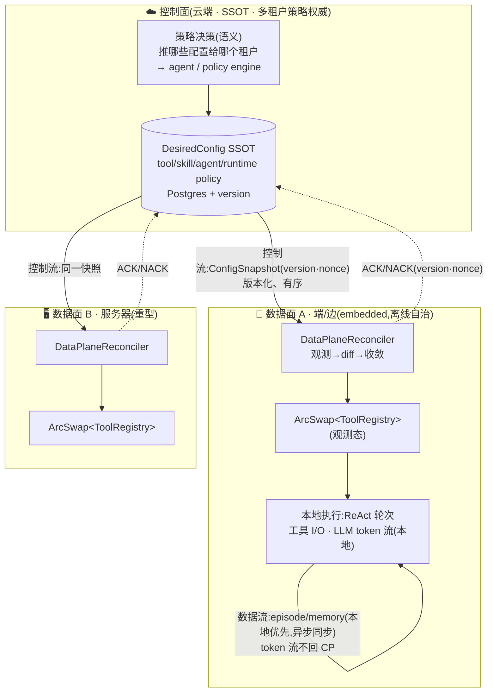
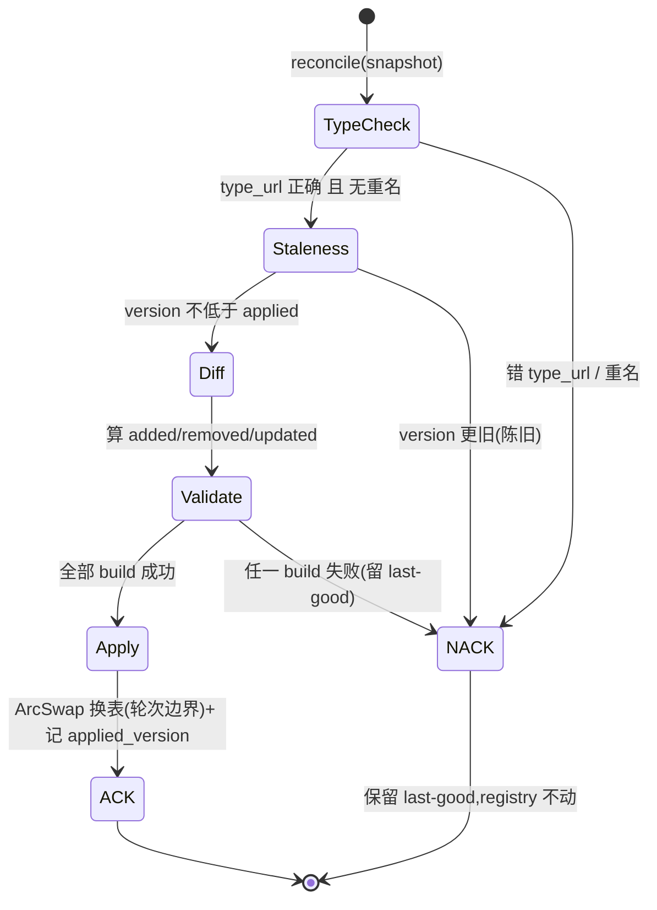
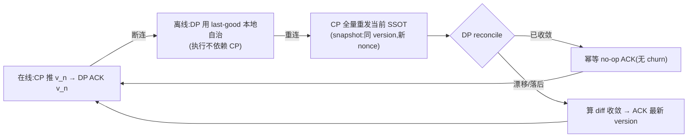

# 08 · 控制流 / 数据流分离:控制面 = SSOT · 声明式 reconcile · xDS 风格版本化分发

> 第三主轴的收口。[06](06-agent-core-design.md) 用"轮次边界"原语统一了核心引擎的运行时质量,[07](07-plugin-runtime-architecture.md) 把扩展点统一成能力注册 + 可插拔 Harness。本篇回答最后一个系统级问题:**当一份核心同时跑在云端(多租户、权威)与端/边(离线、自治)时,配置/策略(控制流)与负载/执行(数据流)如何分两条路走,才能既一致又高吞吐、既权威又可断连?**
>
> 方法论延续:**不集成** Istio/K8s,而是**学习其被超大规模验证过的控制面/数据面分离机制**。源码级调研(带 `owner/repo:path:line` 引用)沉淀于 [`../research/istio-k8s-control-data-plane.md`](../research/istio-k8s-control-data-plane.md)。本篇产出已由可运行 Rust Spike 证伪通过(见 [04 §1 #10](04-spike-evidence.md))。

---

## 1. 核心洞察:agi-stack 本身就是一个 CP/DP 分离系统

既有架构早有控制面/数据面的**线索**,但都是**单点机制**:[ADR-0006](../adr/0006-hot-plug-via-arcswap-and-proxy-wasm-abi.md) 借 Kong Hybrid Mode 做"工具配置 hash 推送"(单一机制);[06 §5](06-agent-core-design.md)/[ADR-0004](../adr/0004-plan-as-append-only-dag.md)/[ADR-0005](../adr/0005-round-boundary-checkpoint.md) 借 Argo `operate()` 做"reconcile 幂等"(单引擎)。Istio + Kubernetes 把"控制流/数据流分离"从单点机制**升格为一等架构轴**。

> **一句话洞察:云端 = 控制面(SSOT + 策略权威),端/边 = 数据面(执行 + 本地自治)。** 这把既有"重/轻 runner"([06 §6](06-agent-core-design.md))、"热插拔换表"([07 §5](07-plugin-runtime-architecture.md))、"local-first 离线"([01](01-portable-core.md))统一到一条轴上。

**两条流,两条路**:

| | 控制流(control flow) | 数据流(data flow) |
|---|---|---|
| 内容 | 配置/策略分发、工具 enable/disable、runtime 选择、plan/路由决策、生命周期、HITL 批准 | episode/memory 负载、LLM token 流、工具 I/O、向量检索结果 |
| 量级 | **低频**,需有序/一致 | **高频**,需吞吐 |
| 路径 | **CP 路径**:版本化、reconcile、最终一致、ACK/NACK | **DP 路径**:流式、本地、高吞吐 |
| 铁律 | 经控制面权威下发 | **LLM token 永不每 token 回 CP** |

下面七节分别展开控制面/数据面分离的七个机制,每节"机制来源 → Rust 落地",末尾给统一映射表与设计不变量。

---

## 2. 控制面 = 单一真相源(来源:K8s kube-apiserver + etcd)

Kubernetes 的中心规则:**etcd 只能经 kube-apiserver 访问** —— 没有任何组件直连存储,apiserver 是唯一守门人(`kubernetes/kubernetes:staging/src/k8s.io/apiserver/pkg/storage/interfaces.go`)。这带来一个决定性后果:**数据面是缓存 + 执行,可从 SSOT 重建**;控制面是唯一权威。

| K8s 机制 | 来源 · 引用 | agi-stack Rust 落地 |
|---|---|---|
| apiserver = etcd 唯一网关 | `apiserver/pkg/storage/interfaces.go` | 云端 **Config Store**(Postgres + REST)是 SSOT;端 agent 从不直连库,读写都过 Config API |
| `spec`(期望)/ `status`(观测)分离 + 分离授权域 | `kubernetes/community:.../api-conventions.md:L280-313` | `DesiredConfig`(spec,CP 写、DP 只读)vs `ObservedStatus`(status,DP 写、CP 读) |
| 数据面用本地缓存 → 控制面断连仍跑 | `kubernetes/kubernetes:pkg/kubelet/kubelet.go` | 端上 DP 持本地 registry,云不可达照常执行(local-first 基石,§7) |

**Spike 实证**(`crates/plugin-host/src/control_plane.rs`):`ControlPlane` 持 `desired: Vec<ToolDecl>` 作 SSOT,`publish()` 是改期望态的唯一入口且**单调 bump version**(镜像每次 K8s 写得新 `resourceVersion`)。控制面注释明确:"the desired set it holds — not any data plane's local view — is authoritative"。

> **Agent First 边界**:"**推哪些配置给哪个租户/会话**"是**语义**策略 → 归 agent / 控制面策略引擎决策;"version 单调 bump、nonce 生成、快照打包"是协议/算术事实 → 确定性留在 `control_plane.rs`。

---

## 3. 声明式 reconcile + level-triggered(来源:K8s controller)

控制面发**期望态**(spec),数据面**自算 diff 收敛**(而非控制面发命令式 add/remove)。K8s 的权威表述:*"the system's behavior is level-based rather than edge-based. This enables robust behavior in the presence of missed intermediate state changes."*(`api-conventions.md:L309-313`)。controller-runtime 把这点做到极致:`Reconcile` 的 `Request` **只含 key,不含事件类型/delta** —— 强制 reconcile 读当前态(`kubernetes-sigs/controller-runtime:pkg/reconcile/reconcile.go:L90-107`)。

为什么 level-triggered 是健壮性的根:

| 场景 | edge-triggered(错) | level-triggered(对) |
|---|---|---|
| DP 重启漏了 N 次推送 | 卡错态 | 重启读当前期望态 → 收敛 |
| 重复/乱序推送 | 双重 apply / 旧覆盖新 | 调和到当前态,已收敛即 no-op |
| 断线重连 | 漏 创建/删除 | 全量重同步(§7) |

**Spike 实证**(`crates/plugin-host/src/reconcile.rs`):`DataPlaneReconciler::reconcile(snapshot, factory)` 是**声明式 + level-triggered**:
- 观测本地 registry(name→version)→ 算 `desired − observed = added`、`observed − desired = removed`、同名变 version = `updated`;
- 同名同 version = 不变,**保持 pin**(不 churn);
- 应用只施加 diff,不执行命令式事件。

> **level-triggered 的两个体现**:① 陈旧版本(`version < applied_version`)被 NACK,但**前向跳跃允许**(无需看到每个中间版本,收敛到最新即可);② 同版本重放 = 空 diff = 幂等 no-op(Spike 用 `Arc::ptr_eq` 证明无实例 churn)。

---

## 4. informer/watch + 版本化(来源:K8s 乐观并发)

K8s 用 `ResourceVersion` 同时做两件事:**watch 续传**(从 `lastSyncResourceVersion` 重连,过期 410 则全量重 list)与**乐观并发**(`Preconditions.Check` 比对 RV,不符则冲突重试,`GuaranteedUpdate` 实现读-改-写环,**无分布式锁**)(`kubernetes/kubernetes:staging/src/k8s.io/client-go/tools/cache/reflector.go`、`apiserver/pkg/storage/interfaces.go`)。informer 的本地缓存"eventually consistent with the authoritative state",多消费者共享一个 reflector(`shared_informer.go:L60-70`)。

| K8s 机制 | agi-stack Rust 落地 |
|---|---|
| `ResourceVersion` 单调 + 乐观并发 | `ConfigSnapshot.version: u64` 单调;DP 拒绝陈旧版本(`reconcile.rs` staleness 检查) |
| informer 本地缓存 eventually consistent | DP 本地 `ArcSwap<ToolRegistry>` 作观测态缓存,经 reconcile 与 SSOT 最终一致 |
| Reflector list-then-watch + 410 重 list | DP 重连先取全量快照(`ControlPlane::snapshot()`),过期则全量重同步 |
| workqueue `dirty` 去重 | 同 key 快速变更坍缩(配置流去抖,落 Phase 2.5 传输层) |

> 注:Spike 聚焦 reconcile 协议本身(纯同步),informer 式的 watch 流/去抖属**传输层**,按平台实现(服务器 gRPC streaming / WS,端上 HTTP long-poll),**出核**(沿用 [ADR-0006](../adr/0006-hot-plug-via-arcswap-and-proxy-wasm-abi.md))。

---

## 5. xDS 风格 typed 配置分发(来源:Istio/Envoy xDS)

Istio 把配置分发做成 typed、版本化、带 ACK/NACK 的协议。这正是 agi-stack 控制流路径的形态。

### 5.1 协议要素(Envoy `DiscoveryResponse` → agi-stack `ConfigSnapshot`)

| xDS 机制 | 来源 · 引用 | agi-stack Rust 落地 |
|---|---|---|
| `DiscoveryResponse{version_info, nonce, type_url, resources}` | `envoyproxy/envoy:api/envoy/service/discovery/v3/discovery.proto:L133-165` | `ConfigSnapshot{type_url, version, nonce, resources}`(已落 `control_plane.rs`) |
| `type_url` 类型复用 | 同上 | `TOOL_REGISTRY_TYPE_URL`;DP 拒绝错类型快照(type-check) |
| **ADS** 单流有序(避免类型间竞态) | `envoyproxy/envoy:.../ads.proto`、`xds_protocol.rst:L818-832` | 每 DP 单一有序配置流 |
| **PushOrder**(CDS→EDS→LDS→RDS) | `istio/istio:pilot/pkg/xds/ads.go:L504-515` | 推序 `依赖→服务→策略→密钥`,避免悬挂引用 |
| **Delta/Incremental** vs SotW | `discovery.proto:L168-310`、`xds_protocol.rst:L120-155` | Spike 现用 SotW 全量(简单、小规模);Delta(`{added, removed}`)列为未来扩展 |
| `initial_resource_versions` 重连跳过未变 | `discovery.proto:L236-254` | 重连发 `{name→version}`,CP 跳过未变(Delta 阶段) |
| **SDS** 密钥不落盘(`InlineBytes`) | `istio/istio:security/pkg/nodeagent/sds/sdsservice.go:L234-248` | env_var/secret 经同流密封下发(衔接 HITL `response_data_encrypted`) |

### 5.2 ACK/NACK + last-good(健壮性的核心)

xDS 规范:NACK 时 client 的 `version_info` 填**上一个 good 版本**,*"The last valid configuration for an xDS API will continue to apply if a configuration update rejection occurs."*(`xds_protocol.rst:L84-87`、`L437-455`)。**坏配置不能 brick 数据面。**

最有价值的工业参照是 **ztunnel(Istio 的 Rust 数据面)**:`handle_stream_event` 在 handler 返回 `Err(Vec<RejectedConfig>)` 时发 NACK 且**不改 state**,只有后续成功 handle 才更新(`istio/ztunnel:src/xds/client.rs:L681-746`、`src/xds.rs:L66-93`)。这不是类比,是同语言实现 —— agi-stack 的 reconciler 与之同构。

**Spike 实证**(`crates/plugin-host/src/{control_plane,reconcile}.rs`):`ConfigAck::{Ack{version,nonce}, Nack{version,nonce,error}}`;reconciler **validate-build-all-before-mutate** —— 所有 add/update 在任何 registry 变更**之前**构建,任一失败即 NACK 且 `last_good` 原封不动(原子接受/拒绝,Envoy 语义)。

---

## 6. 数据面拓扑:sidecar vs ambient → 端上 embedded DP

Istio 给了数据面两种拓扑,直接映射 agi-stack 的"重/轻分叉"([06 §6](06-agent-core-design.md)):

| Istio 拓扑 | 来源 · 引用 | agi-stack 对应 |
|---|---|---|
| **sidecar**(每 workload 一 Envoy) | `istio/istio:pilot/pkg/bootstrap/sidecarinjector.go` | DP 与 workload 同置;**端上 embedded DP** = "sidecar 被推配置后本地自治" |
| **ztunnel**(L4 常开,**Rust**,per-node DaemonSet,Delta ADS) | `istio/ztunnel:ARCHITECTURE.md`、`src/xds.rs` | 端上轻量常开 DP:薄执行器 + `ArcSwap` 观测态,收版本化配置 |
| **waypoint**(L7 按需,Envoy) | ambient 设计 | 按需重型工具代理:复杂工具编排时才实例化(服务器侧) |
| `Arc<RwLock<ProxyState>>` 原子状态更新 | `istio/ztunnel:src/xds.rs:L104-112` | `ArcSwap<ToolRegistry>` 无锁等价(读路径零锁,§3) |
| 双 Tokio runtime 隔离(admin/xDS vs worker) | `istio/ztunnel:ARCHITECTURE.md:L1-8` | 配置处理与执行隔离,防 reconcile 影响数据面 P99(**仅服务器**;端上单线程协作执行器逻辑同构) |

> **ztunnel 验证了关键假设**:数据面可以是地道、轻量、可移植的 Rust,其 ACK/NACK 环、`RejectedConfig` 错误聚合、原子状态更新可直接移植。agi-stack 的 `ArcSwap<ToolRegistry>` 比 ztunnel 的 `RwLock` 更进一步(读路径完全无锁),且 reconciler **纯同步**,故端上(无 tokio)亦可跑 —— 沿用 [06](06-agent-core-design.md) 核心运行时无关不变量。

---

## 7. local-first = 数据面断连自治(来源:K8s 节点 + Envoy last-good)

控制流/数据流分离的终极价值是 **local-first**:数据面离线时,既不靠控制面执行(数据流本地),也不靠控制面保活配置(持 last-good)。

- **K8s**:节点用本地缓存调和,控制面短暂不可达时容器继续跑(`pkg/kubelet/kubelet.go`)。
- **Envoy**:istiod 不可达时保留 last-good config 继续转发;重连后全量重同步(`xds_protocol.rst` 最终一致 + TTL 安全阀)。

映射到 agi-stack:

| 断连场景 | DP 行为 | Spike 对应 |
|---|---|---|
| 云不可达,正常执行 | 用本地 registry 跑 ReAct 轮次,token 流全本地 | DP 持 `ArcSwap<ToolRegistry>`,reconcile 不参与执行路径 |
| 云不可达,收到坏配置缓存 | 不 apply,留 last-good | `Nack` 保留 `last_good` |
| 重连 | 控制面**全量重发** SSOT;DP reconcile,已收敛即幂等 no-op | `ControlPlane::snapshot()`(同 version 新 nonce)→ 空 diff `Ack` |

> **最终一致是特性不是缺陷**:无跨 DP 全局事务,各端独立收敛到最新 version。这正是 local-first 容忍断连所必需的,与 [ADR-0006](../adr/0006-hot-plug-via-arcswap-and-proxy-wasm-abi.md) 的"断线重连全量重传"一脉相承,现由 Istio/K8s 形式化。

> **数据面 payload 同步(已 Spike 验证)**:上表是*配置* CP/DP(控制面推、数据面 reconcile)。对称的*数据*侧 —— 两端离线各自变更**业务负载**(memory/episode)后的收敛 —— 由 `crates/core/src/sync.rs` 的纯核心 `reconcile` 落地:**version-vector delta**(只发对端缺的)+ **LWW-register 总序**消解冲突,`merge` 满足 CRDT 交换/结合/幂等律。离线分叉→重连→最终一致已测(core 6 + adapters-mem 2),core-only 零 tokio/std::time 同编 `wasm32`。详见 [04 证据 #21](04-spike-evidence.md)。

---

## 8. Istio/K8s → agi-stack 总映射

> 把零散机制收口为一张表(详分系统映射见 [research 笔记](../research/istio-k8s-control-data-plane.md) 两节末)。

| Istio/K8s 机制 | 来源 | agi-stack Rust 落地 |
|---|---|---|
| API server = SSOT + etcd | k8s | 云端控制面持权威多租户配置;存 Postgres |
| spec/status 声明式 | k8s | `DesiredConfig`(spec)vs 观测 registry(status);**DP 自算 diff** |
| controller reconcile loop | k8s | `DataPlaneReconciler::reconcile(snapshot)`:观测→期望收敛 |
| level-triggered | k8s | reconcile 到当前期望态(非逐事件)→ 漏推自愈、重复幂等 |
| informer/watch + `ResourceVersion` | k8s | 配置订阅流(传输层)+ `version: u64`(乐观并发,陈旧拒绝) |
| CRD + operator(扩展控制面) | k8s | 插件清单 + 能力注册扩展 CP 可识别配置类型(**衔接 [07](07-plugin-runtime-architecture.md)**) |
| xDS typed resources / `type_url` | istio | typed 配置流;`ConfigSnapshot.type_url`(type-check) |
| ADS(单流有序)+ PushOrder | istio | 每 DP 单一有序配置流;推序 依赖→服务→策略→密钥 |
| Delta/Incremental xDS | istio | 增量推送(未来);Spike 现 SotW 全量 |
| version + nonce + ACK/NACK + last-good | istio | `ConfigSnapshot{version,nonce}` + `ConfigAck::{Ack,Nack}`;**NACK 留 last-good** |
| eventual consistency | istio | DP 收敛到最新 version,无全局锁 |
| SDS(密钥分发) | istio | env_var/secret 密封推送(衔接 HITL `response_data_encrypted`) |
| sidecar(每 workload 代理) | istio | 端上 embedded DP = sidecar 被推配置后本地自治 |
| ambient/ztunnel(L4 Rust)+ waypoint(L7) | istio | 端上轻量常开 DP + 按需重型工具代理(重/轻分叉,[06 §6](06-agent-core-design.md)) |

---

## 9. 设计不变量(实现时必须守住)

1. **控制流与数据流分离**:配置/策略走 CP(版本化、reconcile、最终一致、ACK/NACK),负载走 DP(流式、本地、高吞吐);**LLM token 不每 token 回 CP**。
2. **声明式 + level-triggered**:CP 发期望态(非命令),DP 自算 diff 收敛;漏推自愈、重复幂等、乱序无关、前向跳跃允许。
3. **控制面 = 单一真相源**:DP 是缓存 + 执行,可从 SSOT 重建;权威只在 CP。
4. **版本化 + ACK/NACK + last-good**:坏配置 NACK 不致瘫(Envoy/ztunnel 语义),validate-build-all-before-mutate 保原子接受/拒绝;陈旧版本拒绝(单调/乐观并发)。
5. **最终一致容忍断连**(local-first):DP 离线用 last-good 自治,重连**全量重同步**,已收敛即幂等 no-op。
6. **配置热应用在轮次边界**(衔接 [ADR-0005](../adr/0005-round-boundary-checkpoint.md)):`ArcSwap` 换表只在轮次边界,不打断飞行轮次;持旧快照的在途轮次仍见旧版本。
7. **核心运行时无关**:reconciler 纯同步(无 tokio/`std::time`),传输出核;故服务器/桌面/移动/浏览器同实现一套 reconcile —— 协议与传输分离本身就是 CP/DP 分离应用于自身代码。
8. **语义判断归 agent,协议/集合归确定性**(Agent First 铁律):"推哪些配置给哪个租户"由 agent/控制面策略裁决;version bump、nonce、type-check、diff、ACK/NACK、集合收敛保持确定性。

---

## 关联文档

- 证据基(源码级引用):[`../research/istio-k8s-control-data-plane.md`](../research/istio-k8s-control-data-plane.md)(Kubernetes 声明式调和 / Istio xDS 分发两节)
- 决策记录:[ADR-0009 控制面/数据面分离](../adr/0009-control-data-plane-separation.md)、[ADR-0010 xDS 风格版本化配置分发](../adr/0010-xds-style-config-distribution.md)、[ADR-0006 ArcSwap 热插拔 + CP/DP 推送](../adr/0006-hot-plug-via-arcswap-and-proxy-wasm-abi.md)(被 0009/0010 形式化)、[ADR-0005 轮次边界 checkpoint](../adr/0005-round-boundary-checkpoint.md)
- 上游主轴:[01-portable-core](01-portable-core.md)(local-first)、[06-agent-core-design §2/§6](06-agent-core-design.md)(热插拔 + 重/轻分叉)、[07-plugin-runtime-architecture](07-plugin-runtime-architecture.md)(能力注册扩展控制面)、[02-extensibility](02-extensibility.md)(ToolHost 端口)
- Spike 实证:[04-spike-evidence §1 #10](04-spike-evidence.md)(CP→DP reconcile demo,`cargo run -p cp-dp-demo`);代码 `spikes/rust-portable-core/crates/plugin-host/src/{control_plane,reconcile}.rs`
