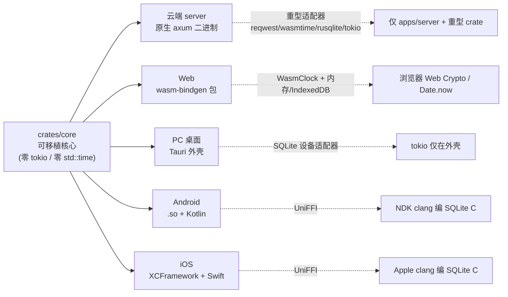

# 09 · 逐平台出厂矩阵(Shipping Matrix)

> 本矩阵只证明各平台产物可构建、可打包或可运行指定 smoke；它不证明 Desktop、
> WASM、移动绑定、Rust server 与 Python/Web 产品功能对等。当前功能所有权与修复计划
> 见根目录
> [CROSS_RUNTIME_REMEDIATION_PLAN.md](../../../docs/architecture/CROSS_RUNTIME_REMEDIATION_PLAN.md)。

> **一份可移植核心(`crates/core`,零 tokio / 零 std::time)→ 五类平台产物。** 本篇把每平台
> 的构建命令收敛为 [`Makefile`](../../Makefile) 一键 target,并标注产物、体积、证据。这是 Phase 5
> 「逐平台上线」的**可码部分**:真正的 Python 后端逐能力绞杀替换是多季度工程,按评分卡 A 方案
> 显式标注 future(见末节)。

相关:平台适配器矩阵见 [03-platform-adapters](03-platform-adapters.md);每项产物的实测证据见
[04-spike-evidence](04-spike-evidence.md);路线与 go/no-go 见 [05-roadmap](05-roadmap.md)。

## 1. 一核多端(core → 产物)

**铁律**:重型依赖(`tokio`/`wasmtime`/`reqwest`/`rusqlite`)只进 `apps/server` 与重型 adapter
crate,**绝不泄漏回核心或端口签名**;wasm 路径用 `WasmClock` + 内存/IndexedDB 适配器(不拉
`SystemClock`/`tokio`)。故同一份 `core` 在每个 target 上**零改动**编译(见 [04 §1](04-spike-evidence.md) 反复验证的 `core wasm32` 绿)。

## 2. 出厂矩阵

| 平台 | `make` target | 产物 | 体积(实测) | 关键依赖/工具链 | 证据 |
|---|---|---|---|---|---|
| **云端 server** | `make server` | `target/release/agistack-server`(原生 axum 二进制) | **5.46 MB**(opt=z+lto+strip) | tokio/axum/reqwest/wasmtime/rusqlite(仅此侧) | [04 #2/#11/#22](04-spike-evidence.md) |
| **Web 浏览器** | `make wasm-web` | `crates/bindings-wasm/pkg/*.wasm`(node smoke) + `crates/bindings-wasm/pkg-web/*.wasm`(browser ESM) + JS 胶水(core-as-guest) | **124.8 KB raw / 60 KB gzip** | wasm-pack/wasm-bindgen;`WasmClock`(`Date.now`) | [04 #4/#16](04-spike-evidence.md) |
| **PC 桌面** | `make desktop`; `make desktop-bundle`; `make desktop-bundle-smoke` | Tauri 外壳(`apps/desktop`,链核心 + SQLite 设备适配器) + CI bundle artifact | 全树编译链接通过;macOS CI 执行完整 Tauri bundle 并静态 smoke 检查 bundle/`.app` | tauri 2 + 系统 WebKit;tokio 仅在外壳 | [04 #17](04-spike-evidence.md) |
| **Android** | `make android` | `libagistack_mobile.so`(`aarch64-linux-android`)+ Kotlin 绑定 + CI artifact;`make bench` 记录 UniFFI ingest/search/semantic-search 延迟 | **1.5 MB**(stripped,含 NDK clang 编 SQLite C) | Android NDK r30;UniFFI 0.28 | [04 #12](04-spike-evidence.md) |
| **iOS** | `make ios` | `AgistackMobile.xcframework`(device+sim 两 arm64 切片)+ Swift 绑定 + CI artifact;`make bench` 记录 UniFFI ingest/search/semantic-search 延迟 | `.a` 各切片(链接后同量级);**iPhone 17 模拟器实跑 SMOKE_OK** | full Xcode 26.6;UniFFI 0.28 | [04 #13](04-spike-evidence.md) |

**辅助 target**:`make test`(执行当前整工作区全部测试,不硬编码易漂移数量)· `make wasm-core`(核心 wasm32 不变量门禁)·
`make ci`(= test + wasm-core,最小合并门禁)· `make bench`(go/no-go 评分卡,实读 server/wasm
产物体积)· `make all`(任意开发机皆可的产物:test + wasm-core + server + wasm-web + desktop + bench)·
`make clean`。完整列表:`make help`。

## 3. 分层验证策略(谁能在哪跑)

| 层 | 无需额外 SDK(任意开发机 + CI) | 需额外 SDK(显式调用) |
|---|---|---|
| target | `test` `wasm-core` `ci` `server` `wasm-web` `desktop` `bench` `all` | `android`(NDK)· `ios`(full Xcode) |
| 理由 | 纯 Rust + wasm-pack/node;Tauri 用系统 WebKit | NDK clang / Xcode SDK 交叉编译,CI 需预装 |

- **`make ci`** 是建议的最小合并门禁:`cargo test --workspace` + 核心 `wasm32` 构建 —— 守住
  「运行时无关核心」不变量,零额外 SDK,适合每次 PR。
- **`make all`** 在本地一次性产出全部免 SDK 产物 + 跑评分卡。
- **`make android` / `make ios`** 镜像已验证脚本(android 见 README「构建与运行」,iOS 见
  [`scripts/build-ios.sh`](../../scripts/build-ios.sh));NDK 路径可 `make android NDK=/path` 覆盖,且
  Linux/macOS NDK host tag 可自动选择或用 `NDK_HOST_TAG=` 覆盖。

## 4. 留为 future(A 方案,显式标注)

逐平台**构建**已收敛为一键 target,但**上线/分发**与生产化仍有多季度工程,刻意不在本轮 Spike 内:

- **iOS 真机签名分发**:本轮在模拟器实跑;真机需开发者证书 + provisioning + TestFlight/App Store。
- **CI 固化交叉编译**:Android `.so`/Kotlin 与 iOS XCFramework/Swift artifact jobs 已接入;UniFFI 绑定 microbenchmarks 已纳入 `make bench`;签名分发与 `cargo-component`(完整 Component Model guest)仍待补。
- **桌面发布补齐**:`make desktop-bundle`、`make desktop-bundle-smoke` 与 macOS CI bundle artifact 已接入;真实安装/启动 smoke、自动更新通道、平台 entitlements 与 Windows/Linux 分发仍待补。
- **Web 持久层**:IndexedDB snapshot host store 已接 `bindings-wasm`;deterministic smoke 已覆盖 reload-style restore、missing-store upgrade 与 offline/open failure;真实浏览器 reload/offline/upgrade e2e 与 wa-sqlite 评估仍待补。
- **生产重型适配器**:Postgres+pgvector、端上 llama.cpp/Candle 大模型(数百 MB)。
- **Python 后端逐能力绞杀替换**:按 [05 §1](05-roadmap.md) 绞杀者式增量迁移,新旧并行多季度。

→ 这些是**广度/生产化**而非根本性未知;make-or-break 风险已由 [04](04-spike-evidence.md) 全部退役、评分卡(#22)出 **GO**。

## 5. 设计不变量(出厂时守住)

- **一核多端**:同一 `crates/core` 在五个 target 上零改动编译;平台差异全部折叠进 adapter crate 与外壳。
- **依赖隔离**:重型运行时(tokio/wasmtime/reqwest/rusqlite)绝不进核心或端口签名;`make wasm-core` 每次门禁守住。
- **证据驱动**:矩阵每行都指向 [04](04-spike-evidence.md) 的可复现证据(命令 + 实测),非空想。
- **构建即文档**:`Makefile` target 与本矩阵一一对应,`make help` 自描述。
