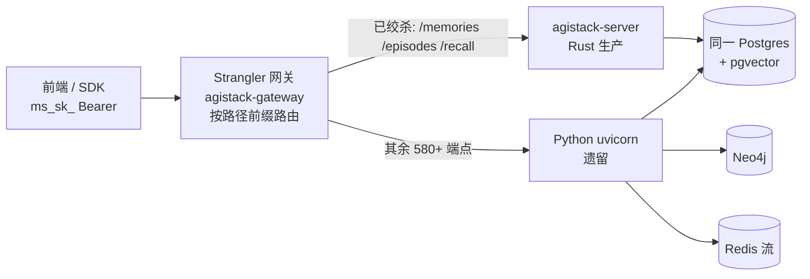
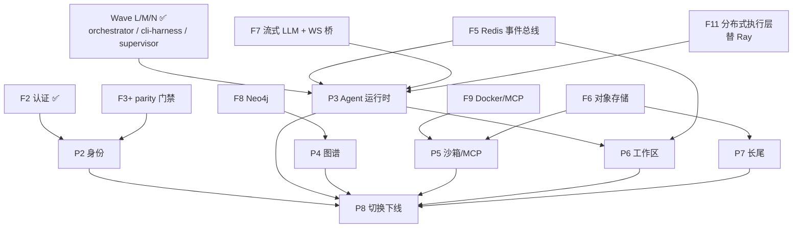

# 10 · 生产迁移:Python 后端绞杀替换为 Rust 新架构

> 用户需求:「完成现有 Python 后端替换为 Rust 新架构」。本篇是**权威的分波次生产迁移设计**——从已证伪的 Spike/Phase 1 基座,到逐能力替换 ~595 个 Python 端点的落地路径。核心策略:**共享数据库之上的绞杀者(strangler-fig on a shared DB)**,新旧后端并行、逐能力灰度切换、任何阶段都可上线、可回滚。**本波(P1 记忆/情节/召回)已端到端落地并验证**(见 [§4](#4-本波已落地p1--记忆情节召回)、[04 证据 #25](04-spike-evidence.md));**P2–P8 余下波次已展开为代码级可执行计划**(端点/表/适配器/parity 风险/子任务,见 §6),含依赖序(§7)与 4 项已定决策 + 工作量(§8)。

前置阅读:[00 选型](00-overview.md)、[01 可移植核心](01-portable-core.md)、[05 路线图](05-roadmap.md) §1 绞杀迁移、[08 控制流/数据流分离](08-control-data-plane-separation.md)(网关=数据面边缘)。

## 0. 现实:差距是数量级的

| | Python(现网) | Rust(`agi-stack/`) |
|---|---|---|
| 生产代码 | ~412K LOC(infra 321K + application 45K + domain 41K + config 4K) | ~27K LOC |
| API 面 | ~595 端点(56 顶层 router + 16 agent 子 router)+ 4 WebSocket + ~15 streaming | P1 子集(记忆/情节/召回)已生产化 |
| 六边形边界 | 94 端口 · 110 张表 · 99 Alembic 迁移 · 80 SQL 仓储 | 端口镜像 core;生产 Postgres 适配器落地 P1 |
| Agent 系统 | ~168K LOC(L1 工具 35+ / L2 Skill / L3 SubAgent / L4 ReAct) | 运行时无关核心 + 热插拔宿主(Wave A–N) |
| 外部集成 | LiteLLM(100+ provider)· Neo4j · Ray · Redis(6 总线)· MCP · Docker 沙箱 | HTTP LLM 已通;Neo4j 图适配器已通(F8);余下按波次 |

**结论**:全量对齐是多人·跨季度工程。**严禁大爆炸重写**(路线图 §1/§6)。唯一安全路径 = 绞杀者式增量迁移。

## 1. 绞杀拓扑

网关居前,把**已绞杀能力**路由到 Rust 生产服务器,其余仍走 Python。同 `/api/v1` 契约、同 `ms_sk_` Bearer 认证、同 JSON 形状 —— **前端零改动**。每能力切换 = 翻一条网关路由;回滚 = 翻回。

- **网关** [`apps/gateway`](../../apps/gateway)(axum + reqwest 反向代理):`is_strangled(path)` 纯前缀匹配(确定性,非语义判断——**Agent First** 只把主观判断交给 agent,路由是结构事实),命中前缀转发 Rust、否则转发 Python;method / 端到端 header(含 `Authorization`)/ body 逐字透传,不跟随上游 307(镜像 FastAPI 尾斜杠语义)。
- **Rust 服务器** [`apps/server`](../../apps/server):P1 生产端点挂在 `/api/v1`,前置 F2 认证中间件。
- **共享 Postgres**:Rust 与 Python **读写同一套 schema**,零数据迁移(见 §2)。

## 2. 使能器:共享数据库(两类表)

绞杀可灰度、可回滚的关键,是 Rust 服务器**读写 Python 同一套 Postgres**([ADR-0001](../adr/0001-rust-as-portable-core-language.md) 的运行时无关核心 + server-only 适配器使其干净成立):

1. **Python 拥有的表,逐字读写** —— `PgMemoryRepository` 对 `memories`、`PgApiKeyStore` 对 `api_keys`、`PgProjectStore` 对 `projects`/`user_projects`。列名/类型精确镜像 `src/infrastructure/adapters/secondary/persistence/models.py`。写入时把 core 不建模但 DB 必填的列以 **Python 默认值**补齐(`relationships='[]'`、`collaborators='[]'`、`is_public=false`、`processing_status='COMPLETED'`、`meta='{}'`)→ 行对仍在线的 Python 读者依然合法。
2. **Rust 拥有的*附加*表** —— `ensure_aux_schema` 仅发 `CREATE EXTENSION/TABLE IF NOT EXISTS` 建 `agistack_` 前缀对象(`agistack_memory_vectors` 承 pgvector,因 Python `memories` **无 embedding 列**——向量在 Neo4j/graphiti;`agistack_checkpoints` 承 agent 崩溃恢复)。**绝不 ALTER 任何 Python 表** → 两后端切换期安全共存。

> 认证 SHA256 与 Python 字节一致(`hashlib.sha256(key.encode()).hexdigest()`,无盐)→ Python 签发的 `ms_sk_` key 在 Rust 对同一 `api_keys.key_hash` 校验通过。这是共享库绞杀的第二个使能点。

## 3. 跨切面基础(Foundation)

| F | 内容 | 状态 |
|---|---|---|
| **F1 · 生产持久化** | [`crates/adapters-postgres`](../../crates/adapters-postgres)(sqlx + pgvector,**server-only**,tokio 隔离):`MemoryRepository`/`VectorIndexPort`/`CheckpointStore` + 只读 `ApiKey`/`Project` 查询,对 Python 同一 schema。真库集成测试经 `DATABASE_URL`(有 Docker Postgres 时)跑真库,离线编译测试恒绿 | ✅ P1 落地 |
| **F2 · 认证/多租户中间件** | [`apps/server/src/auth.rs`](../../apps/server/src/auth.rs)(tower 层,镜像 Python `auth_dependencies.py`):`Authorization: Bearer ms_sk_…` → SHA256 → 查 `api_keys.key_hash` → 校 `is_active`/`expires_at` → 注入 scoped `Identity`;401 路径对齐;**每查询按 `project_id` 收敛**。`PgAuthenticator`(生产)/`DevAuthenticator`(离线,任意 `ms_sk_` → dev 用户)双实现 | ✅ P1 落地 |
| **F3 · 契约 parity 硬门禁** | [`crates/parity`](../../crates/parity)(**可复用 harness**,仅依赖 `serde_json`、同编 `wasm32`):`compare(golden,actual)` 断言键集(顺序无关)+ 类型 + 标量**格式**(ISO-8601 `Z` vs `+00:00`、UUID 大小写、int vs float);matcher token(`<uuid>`/`<iso8601>`/`<ms_sk>`/`<int>`/`<string?>`…)覆盖动态字段;`is_error_envelope` 校 FastAPI `{"detail":…}`。**回溯应用到 P1/P2** 的真实 wire 形状([`apps/server/tests/golden`](../../apps/server/tests/golden) 6 契约派生 golden + 6 测),负控证门禁非空转 | ✅ 落地(自 P2 起硬门禁,[04 #30](04-spike-evidence.md)) |
| **F4 · 可观测/灰度** | 结构化日志 + trace + 按路由灰度比例 + 回滚 runbook | 🎯 future(逐波次) |
| **F5 · Redis Streams 事件总线** | [`crates/adapters-redis`](../../crates/adapters-redis)(`redis` crate,server-only):`RedisEventStream` 实 `EventStream` 端口,对 **Python 同一套 Redis Streams** 说 `XADD key MAXLEN <n> * data <payload>`(**精确 MAXLEN 无 `~`** → 确定性保留最后 N)/`XRANGE key <start> + COUNT`(空/`0`→`-`,否则 `(<id>` 独占分页);payload 为不透明序列化事件 JSON(core 与具体事件枚举解耦)。绞杀可把事件**生产**从 Python 翻到 Rust,现有 WS 桥继续消费同一 stream **零数据迁移** | ✅ **已落地**(`EventStream` 端口 + 内存/Redis 双适配器,对活 Docker Redis 跨层 parity 实测;[04 #33](04-spike-evidence.md))。消费组 `XREADGROUP`/`hitl:responses`/`agent:control` 留 P3 波次 |
| **F6 · 对象存储(S3 兼容)** | [`crates/adapters-s3`](../../crates/adapters-s3)(`aws-sdk-s3`,server-only):`S3ObjectStore` 实 `ObjectStore` 端口(`put`/`get`/`stat`/`delete`/`list`,值为不透明字节 + 可选 `content_type`),对 **Python 同一套 S3/MinIO 桶**(artifacts/attachments/instance_files)说 `PutObject`/`GetObject`/`HeadObject`/`ListObjectsV2`;`force_path_style(true)`(MinIO 必需)+ 缺桶自建;缺 key → `None`(镜像 Python 404 空对象),无类型归一到 S3 默认 `application/octet-stream`。绞杀可把 blob 读写从 Python 翻到 Rust、Python 侧继续读写同一桶 **零数据迁移** | ✅ **已落地**(`ObjectStore` 端口 + 内存/S3 双适配器,对活 Docker MinIO 跨层 parity 实测;[04 #34](04-spike-evidence.md))。分片/流式上传、`refresh-url` 预签名留 P5·P7 波次 |
| **F7 · 流式 LLM + WS 事件桥** | `adapters-http-llm` 扩流式 token(**决策 2:先 OpenAI/Anthropic 两家**,余下 future);WS ConnectionManager(1000+ 并发、广播、背压、重连、事件回放)。`axum::ws` + `tokio-tungstenite` | 🎯 部分(P3·P4·P6)——**非流式 chat + embedding + rerank 均已对活服务实测**(chat:GLM `glm-4.6`/MiniMax `MiniMax-M2` 经 OpenAI 兼容 `/chat/completions`,[04 #39](04-spike-evidence.md);embedding:Ollama `/v1/embeddings`,[04 #38](04-spike-evidence.md);rerank:`BAAI/bge-reranker-base`,[04 #40](04-spike-evidence.md));**仅流式 chat token(SSE `stream:true`)+ WS 事件桥留 future** |
| **F8 · Neo4j 图适配器** | 节点 Entity/Episodic/Community、边 MENTIONS;向量 + 全文索引;`project_id`/`tenant_id` 收敛。`neo4rs`(社区异步驱动) | ✅ **已落地**(`Neo4jGraphStore` 实 `GraphStore`,对活 Docker Neo4j 跨层 parity 实测;[04 #32](04-spike-evidence.md))。Episodic/Community/向量+全文索引留 future |
| **F9 · Docker/MCP 沙箱** | 容器生命周期(create/start/health/stop);MCP WebSocket JSON-RPC 2.0(:8765);desktop(KasmVNC)/terminal(ttyd)代理。`bollard` + `tokio-tungstenite` | 🚧 **两半均落地,余代理**:① **MCP WS 工具传输**——[`crates/adapters-mcp`](../../crates/adapters-mcp)(`tokio-tungstenite`,server-only)`WsMcpToolHost` 实**既有 `ToolHost` 端口**,对**运行中的 `sandbox-mcp-server` 实测**握手 + 52 工具 write→read 往返([04 #35](04-spike-evidence.md));② **容器生命周期**——新增 `ContainerRuntime` 端口 + [`crates/adapters-docker`](../../crates/adapters-docker)(`bollard 0.17`,server-only)`DockerContainerRuntime` create/start/status/stop/remove + 托管标签 `list`,**对运行中的 Docker daemon 用 `redis:7-alpine` 真起真停实测**状态序列 `[Created,Running,Exited]` 与内存状态机预言机一致([04 #36](04-spike-evidence.md))。**余** desktop/terminal/noVNC WS 代理 + 镜像 pull + 端口/隧道分配留 P5 |
| **F10 · SMTP/邮件(决策 3)** | [`crates/adapters-smtp`](../../crates/adapters-smtp)(`lettre 0.11`,server-only):`SmtpEmailSender` 实 `EmailSender` 端口(`send(&EmailMessage)`,信封 from/to/subject/text/html),`plaintext(host,port)`(本地中继/mailpit)/ `relay(host,user,pass)`(生产 TLS 提交)/ `with_default_from` 兜底;有 HTML → `alternative_plain_html` 多部分。绞杀可把 P2 邀请 + P7-G4 通知的邮件出口从 Python 翻到 Rust;因 P2 决定迁邮件邀请,从 P7 上提为多波共享基础 | ✅ **已落地**(`EmailSender` 端口 + 内存/lettre 双适配器,对活 mailpit 邮筒真发真收 + 内存预言机信封一致性实测;[04 #37](04-spike-evidence.md))。生产 TLS 提交路径 + 模板渲染 + Feishu/webhook 通道留 P7-G4 |
| **F11 · 分布式执行层(决策 1,替 Ray)** | tokio + gRPC(`tonic`)actor/执行层替 Ray Actors(会话级 actor + 监督重启 `max_restarts=5` 语义 + 跨节点分发 + 背压)。`tokio` + `tonic` + 可选 `kameo`。**全计划最高风险单点** | 🎯 future(P3·P6) |

> **F1–F4 已在 P1 落地(F4 为最小切片);F5–F11 为多波共享的 server-only 适配器**,随依赖波次落地(逐波用途见 §6、决策记录见 §8)。其中 **F10(SMTP)因决策 3、F11(分布式执行层替 Ray)因决策 1** 而新增。全部 F5–F11 严格 server-only:`core` 仍零 tokio/零 `std::time`、同编 `wasm32`;端上永远走轻量适配器(内存/SQLite/Wasmi/单线程执行器),不依赖 F5–F11。

## 4. 本波已落地:P1 — 记忆/情节/召回

P1 选记忆域先行:Rust `MemoryService` 已最成熟,且这是价值高、依赖少的垂直。已生产化的端点(**与 Python 契约字节兼容**):

| 方法 · 路径 | 处理 | 返回 |
|---|---|---|
| `POST /api/v1/memories/` | 直接创建(无 LLM) | 201 `MemoryResponse` |
| `GET /api/v1/memories/` | 列举 + 关键词搜索(分页) | 200 `MemoryListResponse` |
| `GET /api/v1/memories/{id}` | 取单条 | 200 / 404 |
| `DELETE /api/v1/memories/{id}` | 删除(按 project 收敛) | 204 |
| `POST /api/v1/episodes/` | 情节摄取(同步 extract→memory) | 202 `EpisodeResponse` |
| `POST /api/v1/recall/short` | 窗口内近期召回 | 200 `ShortTermRecallResponse` |

实现见 [`apps/server/src/prod_api.rs`](../../apps/server/src/prod_api.rs)。`MemoryResponse` 用 `#[serde(rename="metadata")]` 对齐 Python 的 `meta`→`metadata` 别名,core 不建模的字段以 Python 默认值发出,`created_at` 为 RFC3339 —— Rust 服务的响应与 Python 服务的**不可区分**。

**端到端验证**(见 [04 证据 #25](04-spike-evidence.md)):经**真 Rust 服务器 + 真网关 + mock Python 上游**,curl 全部 P1 端点通过——201 创建、200 列举(`total`/`page`)、404、204、202 情节、200 召回;无 auth → 401「Missing API key…」、坏格式 → 401「Invalid API key format…」(Python 逐字一致)。网关 e2e 测试断言绞杀前缀→Rust、其余→Python、Bearer 透传、方法/体保真、307 relay。F1 另经真实 `pgvector/pgvector:pg16` 容器验证共享 schema 读写 + pgvector 余弦 + SHA256 key 校验。

## 5. 全量波次计划(P1..P8)

> 每波 = 建所需生产适配器 + 移植 domain/application 逻辑 + 实现端点契约 + 翻网关路由 + parity 测试 + 监控。按「价值 × Rust 就绪度 × 依赖」排序。

| 波次 | 能力 | 主要端点(实测校准) | 新增/依赖适配器 | 难度 | 状态 |
|---|---|---|---|---|---|
| **P1** | 记忆与情节 | `/memories`·`/episodes`·`/recall`(~14) | **F1 Postgres+pgvector** | 低-中 | ✅ 本波落地 |
| **P2** | 身份/租户/项目 | auth·tenants·projects·invitations·trust·shares(~43–58) | F2 ✅ · F10 SMTP ✅ | 中 | 🚧 登录垂直已落地(`/auth/token` 绞杀 + tenants 读就绪;邀请邮件出口 F10 就绪;详见 §6.1、[04 #29](04-spike-evidence.md)) |
| **P3** | Agent 运行时与会话 | `/agent/*`(84 子)+ `/agent/ws`(1 WS,共 85) | F5 · F7 · **F11**(替 Ray)· Wave L/M/N ✅ | 极高 | 🎯 future(详见 §6.2;硬化地基 Wave L/M/N 已绿;事件类型/信封地基 `p3-event-model` ✅ [04 #41](04-spike-evidence.md)) |
| **P4** | 知识图谱 | graph(10)·enhanced_search(7)(~17) | F8 Neo4j / 端 SQLite+petgraph | 高 | 🚧 端上图 + 生产 Neo4j 层已落地(`GraphStore` + 排序数学 + **三适配器**内存/SQLite/Neo4j + 跨层 parity;详见 §6.3、[04 #31](04-spike-evidence.md)/[#32](04-spike-evidence.md);抽取/社区/端点 future) |
| **P5** | 沙箱与 MCP | project_sandbox·skills·channels·terminal(~89) | F9 Docker/MCP · F6 | 高 | 🎯 future(详见 §6.4;`plugin-host` 已就位) |
| **P6** | 工作区与多 agent | workspaces·tasks·plans·blackboard·topology(71) | 复用 P3 流/事件 · F5 | 高 | 🎯 future(详见 §6.5) |
| **P7** | 长尾 | genes·instances·llm_providers·observability·…(~220) | F6 · 各自 SDK | 中 | 🎯 future(详见 §6.6,6 组并行) |
| **P8** | 切换与下线 | 全量 | — | — | 🎯 future(详见 §6.7) |

> 端点总量校准(探针实测):**~540+ REST + 5 WS**,与 §0 的 ~595(含 voice/security WS、subagents、reflection 等)吻合。逐波**代码级详解见 §6、依赖序见 §7、已定决策与工作量见 §8**。

**诚实的「龙」**(A 方案逐波次落地,MVP 期可保留 Python 微服务承接,经网关并存):**Ray Actor 分布式**(无 Rust 直接对应,需 tokio/actor 或 gRPC 重建)、**LiteLLM 100+ provider 广度**、**Neo4j 抽取管线**、**MCP/Docker 沙箱**、**流式 WS 事件桥**。

## 6. 波次详解(P2–P8)

> 数据源:4 路并行 Python 代码级探针(实测端点、SQLAlchemy 表、外部依赖、Rust 现状、parity 风险)。每波模板:**端点 → Python 表 → 新增适配器 → Rust 现状(有/缺)→ parity 风险 → 子任务 → 龙/future**。除 Wave L/M/N 硬化地基已绿外,**P2–P8 均为 future 波次**(A 方案,逐波次落地),各带独立证据行。

### 6.1 P2 · 身份/租户/项目(依赖 F2 ✅ / F3 门禁 / F10 SMTP)

- **端点(~43–58)**:auth(12,含 device-code RFC 8628 ×3)· tenants(20)· projects(12,含级联删)· invitations(4)· trust(~6)· shares(4)。
- **Python 表**:`users`·`api_keys`·`tenants`·`projects`·`user_tenants`·`user_projects`·`invitations`·`memory_shares`·`trust_policies`·`decision_records`。
- **新增适配器**:扩 `adapters-postgres` 覆盖上述表;`adapters-auth-secrets`(bcrypt / `getrandom` token / `jsonwebtoken` JWT);device-code 经 F5 Redis(600s TTL);邮件邀请经 **F10 SMTP(`lettre`,✅ [04 #37](04-spike-evidence.md) 已就绪)**。
- **Rust 现状**:✅ F2 `ms_sk_` SHA256 中间件 + project 访问检查;✅ **本会话落地登录垂直**(见下)——bcrypt 密码校验、`/auth/token` 登录、`/auth/oauth/{provider}/callback`(501 parity)、tenants 只读(list/get,含 404-then-403);**缺** 租户/项目写 CRUD、RBAC、级联删、invitation/share token、device-code 全流程、真实 OAuth、SMTP。
- **Parity 风险**:①**级联删**——删项目连带 15+ 表,须事务 + FK 顺序与 Python 一致;②Pydantic→serde 字段别名(`user_id`←`id`,`populate_by_name`);③bcrypt 须与 passlib 输出逐字一致(固定测试向量);④OAuth 端点 Python 现为 501 stub → Rust 拥有端点但字节对齐仍返 501。
- **子任务**:`p2-auth-secrets` ✅ → `p2-tenant-repo` ✅ → `p2-project-repo`(级联删)→ `p2-endpoints`(登录垂直 ✅;余下 device-code + 写 CRUD + SMTP 邀请 future)→ `p2-rbac` → `p2-gateway-parity`(`/auth/token`·`/auth/oauth` 已翻 ✅;tenants 翻转 deferred)→ `p2-docs` ✅。
- **决策 3(全范围迁移)**:device-code + OAuth 端点(501 parity)+ SMTP 邮件邀请全随 P2 迁 Rust。**龙**:真实 OAuth 授权码/PKCE 流。

#### 6.1.1 本会话落地:P2 登录垂直(login vertical,已端到端验证)

按 P1 同一绞杀模式落地 P2 的**可验证证明切片**(登录 + 租户只读),而非 ~43–58 端点的字面 parity:

- **翻网关(flip)**:`POST /api/v1/auth/token`(登录)+ `POST /api/v1/auth/oauth/{provider}/callback`(501 stub)。二者在 Rust 完整覆盖,加入 `STRANGLED_PREFIXES`;`/auth/*` 其余兄弟端点(force-change-password、me…)与 `/tenants/*` 仍走 Python(粗前缀匹配,只列**整体已覆盖**的路径)。
- **实现 + parity 测试但不翻转**:`GET /tenants/` + `GET /tenants/{id}`。原因:(a) 网关粗段前缀会连带捕获仍在 Python 的 `/tenants/{id}/members|stats|analytics` 兄弟;(b) `TenantResponse` 时间戳依赖 pydantic 精确 ISO-8601 渲染,属 F3 golden 捕获范畴(同 P1 `rfc3339` 假设)。故标注「就绪+已测,翻转待 golden 捕获」。
- **登录流(逐字复刻 Python `auth.py:136-210`)**:`Form(username,password)` → `find_auth_by_email` → 缺用户或错密码统一 401「Incorrect username or password」(+`WWW-Authenticate: Bearer`,短路不 verify None)→ `!is_active` 则 401「User account is inactive」(无该头)→ `is_superuser` 加 `["admin"]` 权限 → 铸 `ms_sk_` **登录会话 API key**(非 JWT——与 Python `create_api_key` 一致)、id `uuid4`、name `Login Session {username}`、`expires_at = now + 24h` → 返回**扁平 `Token{access_token, token_type:"bearer", must_change_password}`**(无时间戳 → 精确可复现)。登录**未认证**(在 `router_public()`,无中间件)。
- **摘要 parity 铁证**:`insert_api_key` 内部以 `sha256_hex(plaintext)` 落 `key_hash`,与认证器 `find_by_raw_key` 同一摘要函数 → 铸出的 key 立即可认证(经**真 pgvector 容器**集成测试端到端验证)。
- **server-only 隔离**:bcrypt(`adapters-secrets`)、sqlx 读写(`adapters-postgres` 的 `user_store`/`tenant_repo`)严格隔离在适配器 crate,**绝不入 core 或端口签名**;core `wasm32` 仍绿。
- **证据**:[04 #29](04-spike-evidence.md);`cargo test --workspace` 由 112 升至 **128 绿**。

### 6.2 P3 · Agent 运行时与会话(依赖 Wave L/M/N ✅ + F5/F7/F11)—— 最难波,决策 1 全 Rust 化

> **决策 1**:不走混合 MVP,**一次性全 Rust 化** —— 含 Ray→tokio/gRPC 分布式执行层重建(F11)、全部 35+ 工具移植、完整 SessionProcessor 等价环。**全计划最高风险、最长工期单波,决定总工期。**

- **前置(§13 Wave L/M/N,✅ 已绿)**:`rt-orchestrator`(MiniOrchestrator 驱动 Plan DAG)· `rt-cli-harness`(第二 harness 家族 + `RuntimePlan` 富契约)· `rt-supervisor`(DoomLoop 触发 + Agent-First 裁决 + CostTracker)——补齐 [06](06-agent-core-design.md) 健壮/可编排/可插拔三轴,P3 运行时硬化地基(见 [04 #26/#27/#28](04-spike-evidence.md))。
- **已落地子切片 `p3-event-model`(✅)**:P3 事件管线的**类型/信封地基**已入核——把 Python `src/domain/events/{types,envelope}.py` 逐字移植为纯核心模块 [`crates/core/src/agent/events.rs`](../../crates/core/src/agent/events.rs)(`AgentEventType` **165 类型**——较早探针估 156,以代码枚举为准;`EventCategory`;`from_wire`/`category`/`is_delta`/`is_terminal`/`requires_human_response`/`is_internal` 谓词;`EventEnvelope` `wrap`/`child`/`with_*`/`to_json`/`from_json`;`derive_event_id`)。**wasm-clean·零新依赖**,`event_id`/`timestamp` 由调用方注入;与既有前端/`EventConverter` **线格式逐字节兼容**,7 单测覆盖;为 `p3-processor`/`p3-ws-bridge`/`p3-tools` 前置(见 [04 #41](04-spike-evidence.md))。
- **端点(85)**:agent/ 20 子 router 84 个 + `/agent/ws`(1 WS,10 handler)。
- **Python 表**:`conversations`·`messages`·`task_logs`·`hitl_requests`·`agent_session_snapshots`·`message_execution_status`·`message_bindings`·`agent_tasks`。
- **事件管线(156 事件类型)**:Tool → `_pending_events` → SessionProcessor(4610 LOC)→ EventConverter → Redis Stream(F5)→ WS 桥(F7)→ 前端 routeToHandler。
- **Rust 现状**:✅ `ReActEngine`(+ 轮次 checkpoint / 崩溃恢复 / 单 HITL)+ Wave L/M/N 三轴;**缺** SessionProcessor 全编排、156 事件系统、Redis 流、分布式执行层(F11 替 Ray)、WS 桥、35+ 工具、MCP、HITL 协调器、SubAgent 路由。
- **5 条龙(决策后处置)**:①Ray→**F11 一次性重建**(tokio+`tonic` gRPC + 可选 kameo,复刻监督 / `max_restarts=5` / 跨节点分发);②WS 事件桥(517 LOC ConnectionManager,1000+ 并发,F7);③全部 35+ 工具(2000+ LOC,含 OS 级依赖)全移植;④SessionProcessor 4610 LOC 核心环;⑤LiteLLM→**决策 2 先 OpenAI/Anthropic 两家**,余下 provider future。
- **子任务**:`p3-conv-repo` → **`p3-event-model` ✅** → `p3-ws-bridge`(F7)→ `p3-distributed`(F11)→ `p3-tools-full`(35+ 工具内部分批:先 terminal/web_search/memory/context/plan,再 sandbox/interactive/agent-control/workspace/skill/MCP/HITL)→ `p3-processor`(复用 rt-orchestrator + F11)→ `p3-hitl` → `p3-endpoints` → `p3-gateway-parity` → `p3-docs`。
- **执行策略**:无 Python 执行器并存;靠内部分层次序缓释(F11 + 事件/WS 骨架 → 逐批工具 → 全环 → 灰度)。**建议单列专项、其余波先行摊平风险。**

### 6.3 P4 · 知识图谱(依赖 F8 Neo4j + `adapters-http-llm`)

- **端点(~17)**:graph(10:communities/entities/relationships/subgraph/memory-graph/rebuild)· enhanced_search(7:advanced/graph-traversal/community/temporal/faceted/capabilities/memory-search)。
- **图存储**:Neo4j 节点 `Entity`(name/type/summary/uuid/project_id/tenant_id/name_embedding)·`Episodic`·`Community`;边 `MENTIONS`(fact/score);向量索引 + 全文索引。
- **抽取管线(LLM reflexion)**:LiteLLM(temp 0.0)抽 JSON → 去重(Phase1 SHA256 name+type;Phase2 向量 ≥0.92)→ EntityNode+embedding;reflexion 默认 2 轮补漏。
- **混合检索**:查询扩展 → 向量(RRF k=60)+ 关键词(全文)→ RRF 融合(`0.6×vec + 0.4×kw`)→ 时间衰减(半衰期 30d)→ MMR 重排(λ=0.7)。
- **Rust 现状**:✅ **可移植切片 + 生产 Neo4j 层均已落地**(决策 4)—— `GraphStore` 端口 + `GraphEntity`/`Relationship`/`Subgraph` 模型 + 纯 Rust 排序数学 [`crates/core/src/graph.rs`](../../crates/core/src/graph.rs)(RRF/时间衰减/MMR/Jaccard **逐字复刻 Python** 常量公式)+ **三套适配器** `InMemoryGraphStore`(`petgraph`,`wasm32`)/`SqliteGraphStore`(SQLite + `petgraph`,端上耐久)/**`Neo4jGraphStore`(`neo4rs` Bolt,生产服务器层,对 Python 同一套 Neo4j)**;跨层 parity 测证内存 vs SQLite([04 #31](04-spike-evidence.md))与**内存 vs 活 Neo4j**([04 #32](04-spike-evidence.md))结构一致;**缺** LLM reflexion 抽取、Louvain 社区、Episodic/Community 节点、REST 端点。`adapters-http-llm` 可复用做抽取/embedding。
- **Parity 风险**:Neo4j DateTime/graph 类型 ISO 序列化、向量 float 数组字节序、UUID/tenant 过滤;RRF 权重/衰减/MMR 须逐位复现(**排序数学已在 core 逐字复刻并测**);**端上图近似(petgraph/SQLite)与 Neo4j 的容差已显式定义**——排序层字节一致,子图/遍历为 local-first 近似(存储基底不同)。
- **子任务**:`p4-neo4j-adapter`(F8,✅ **已落地** `Neo4jGraphStore` 对活 Neo4j parity)→ `p4-extraction`(reflexion + 去重,🎯 future)→ `p4-hybrid-search`(RRF + 衰减 + MMR,✅ **已落地** core 排序数学)→ `p4-community`(Louvain,🎯 future)→ `p4-device-graph`(**决策 4**:SQLite 关系表 + `petgraph` 遍历,纯 Rust 同编 `wasm32`,✅ **已落地**)→ `p4-endpoints`(🎯 future)→ `p4-parity` → `p4-gateway` → `p4-docs`。
- **决策 4(纳入端上图)**:✅ 端上 KG 已以 SQLite + `petgraph` 近似 + core 排序数学落地,**生产 Neo4j 层亦已落地**(`Neo4jGraphStore`,对活库跨层 parity 实测,[04 #32](04-spike-evidence.md));风险 #5 可移植部分退役([05 §2](05-roadmap.md))。**龙/future**:Louvain 浮点精度、Episodic/Community 节点 + 向量/全文索引、LLM reflexion 抽取管线、**端上 LLM 推理(风险 #6,llama.cpp/Candle 数百 MB 模型)仍 future**。

### 6.4 P5 · 沙箱与 MCP(依赖 F9 Docker/MCP + F6 存储 + `plugin-host` ✅)

- **端点(~89)**:project_sandbox(~30:create/health/stats/execute/restart/desktop/terminal/http-services/proxy)· skills(~20:CRUD/versions/publish/import/clone)· channels(~27)· tenant_skill_configs(~8)· terminal(4 + WS);含多 WS 代理(mcp/desktop/terminal/http-service)。
- **Python 表**:`project_sandbox`(status/container_id)·`skill`(scope SYSTEM/WORKSPACE/PROJECT·spec·version)·`skill_version`·`tenant_skill_config`·`instance_channel_config`。
- **沙箱运行时**:MCPSandboxAdapter(Docker 容器 + WS MCP :8765,30+ 工具:file/code-intel/edit/test/git/desktop/terminal)vs LocalSandboxAdapter(主机 FS);MCP = JSON-RPC 2.0 over WS,OAuth-like token。
- **Rust 现状**:✅ `plugin-host`(Skill/Tool 抽象 + ArcSwap 热插拔)· `adapters-wasmtime`(WASM 沙箱)· **`adapters-mcp`(MCP WS `ToolHost` 客户端,对活 `sandbox-mcp-server` 实测,✅ 已落地)· `adapters-docker`(`ContainerRuntime` 容器生命周期,对活 Docker daemon 实测,✅ 已落地)**;**缺** desktop/terminal 代理(S3 文件 F6 ✅)。
- **Parity 风险**:`ProjectSandboxResponse.urls{mcp/desktop/terminal}` 须匹配容器端口路由;ExecuteToolResponse 形状;skill spec/scope 枚举。
- **子任务**:`p5-docker-adapter`(F9 容器生命周期,✅ **已落地** `DockerContainerRuntime` 对活 Docker daemon 状态机一致性)→ `p5-mcp-ws`(JSON-RPC 客户端 + 代理,✅ **客户端已落地** `WsMcpToolHost` 对活库 parity;代理留)→ `p5-skill-store`(skill 表 + 版本,经 plugin-host 触发)→ `p5-sandbox-endpoints` → `p5-proxy`(desktop/terminal/http WS)→ `p5-parity` → `p5-gateway` → `p5-docs`。
- **龙**:desktop(KasmVNC)/terminal(ttyd)代理状态机、多服务预览路由 + 会话 token、容器 IP/隧道分配。

### 6.5 P6 · 工作区与多 agent 协作(依赖 P3 事件/流 + F5)

- **端点(71)**:workspaces(13)· workspace_tasks(14)· workspace_plans(11)· blackboard(19:posts/files/replies + pin)· topology(10)· workspace_chat(3)· autonomy(1)。
- **Python 表**:`workspace`·`workspace_member`·`workspace_agent`·`workspace_task`·`workspace_task_session_attempt`·`workspace_plan_event`·`workspace_plan_outbox`·`blackboard_post`/`_reply`/`_file`·`topology_node`/`_edge` 等。
- **协作模型**:黑板模式(posts/files/replies)+ topology 图 + leader 选举(Redis 冷却 60s)+ Redis 统一事件总线(`workspace:{id}:{evt}`)+ **outbox 模式**(plan 状态转换可靠投递);mention 路由 = fire-and-forget 后台任务。
- **Rust 现状**:❌ 无;复用 P3 事件/流(F5)+ core `Plan` DAG + rt-orchestrator。
- **Parity 风险**:①**plan 状态机**(`transition_execution`/`transition_intent`,500+ LOC 计数器/元数据树/错误恢复)须精确移植;②**outbox worker**(事务 + 独立投递线程)连端点带 worker 一起移植;③mention 异步派发。
- **子任务**:`p6-workspace-repo` → `p6-plan-state`(状态机 + snapshot/恢复)→ `p6-outbox`(outbox 表 + worker)→ `p6-blackboard`(+ F6 文件)→ `p6-topology` → `p6-chat-mention`(经 P3 桥)→ `p6-endpoints` → `p6-parity` → `p6-gateway` → `p6-docs`。
- **龙**:与 P3 深度耦合,须 P3 事件桥/流稳定后再上;autonomy 迭代循环。

### 6.6 P7 · 长尾(~220,依赖 F6 + 少量外部 SDK,6 组并行)

| 组 | router(端点) | 主题 | 难度 | 外部依赖 |
|---|---|---|---|---|
| G1 | genes(29)·cyber_objectives(6)·cyber_genes(5)·instances(18)·instance_channels(5)·instance_files(6)·instance_templates(11) | 基因/实例(73) | 中 | F6 存储 |
| G2 | llm_providers(21)·deploy(8)·cron(8)·maintenance(11)·engines(1)·background_tasks(3) | LLM/部署/运维(52) | 高 | LLM API·cron·图级 SQL |
| G3 | observability(16)·audit(5)·events(2)·admin_dlq(9) | 观测/审计(32) | 中 | Redis·DLQ 重放 |
| G4 | notifications(5)·smtp_config(4)·webhooks(1)·tenant_webhooks(4) | 通知/webhook(14) | 中 | F10 SMTP·Feishu·HMAC |
| G5 | billing(3)·support(5)·data_export(3)·system(2) | 计费/支持/导出(13) | 低-中 | 计费 provider |
| G6 | schema(11)·artifacts(7)·attachments_upload(9)·ai_tools(2) | 系统/杂项(29) | 低-中 | F6·分片上传 |

- **新增能力**:cron 调度器(`tokio-schedule` + 后台 worker)· SMTP(F10 `lettre`)· webhook 签名(`hmac`+`sha2`)· 计费 provider(Stripe SDK 或轻 HTTP)· 分片上传状态机(F6)。
- **策略**:**高度并行**——G1/G6 简单 CRUD 先行(易得分),G2/G4 外部集成按 SDK 可用度排后;llm_providers 模型目录 + maintenance 图级去重为本组难点。
- **子任务**:6 个子 epic(`p7-g1-genes-instances`…`p7-g6-system`),各内含 repo→endpoints→parity→gateway;`p7-docs` 收口。

### 6.7 P8 · 切换与下线(依赖 P2–P7 全达零 Python 流量)

- 各能力灰度至 100% Rust、观测无回退后:撤对应 Python router、缩容 uvicorn、逐条移除网关分流(最终网关可退化为纯反代或移除)。
- 终验:全端点 parity 回归、性能对照、数据一致性审计(共享库无双写冲突);Python 代码库归档。
- **子任务**:`p8-traffic-audit`(逐能力零流量确认)→ `p8-decommission`(下线 Python + 撤分流)→ `p8-final-parity`(全量回归)→ `p8-docs`(迁移终章 + 复盘)。

## 7. 依赖图与波序

- **可即刻并行(无跨波依赖)**:P2(F2/F3)、P4(F8)、P5(F9/F6)、P7-G1/G6(F6)。
- **串行关键路径**:Wave L/M/N ✅ → P3 → P6 → P8。**P3 最长最难,决定总工期。**
- **建议波序**:先 F3+/F4+ 门禁 → **P2 + P7-易组并行**(快速扩大 Rust 覆盖、建信心)→ P4 + P5 并行(适配器独立)→ P3(最难,单列专项)→ P6 → P7-难组补齐 → P8。

## 8. 已定决策与工作量

**4 项已定决策(用户确认,已回填各波)**:

| # | 决策 | 影响波次 | future 边界 |
|---|---|---|---|
| 1 | **P3 一次性全 Rust 化** —— Ray→tokio/gRPC 分布式执行层(F11)+ 全 35+ 工具 + 完整 SessionProcessor,**无 Python 执行器并存** | P3(·P6) | 靠内部分层次序缓释,非跨语言分流 |
| 2 | **LLM 先行 OpenAI/Anthropic** —— `adapters-http-llm` 只覆盖两家 | F7·P3·P4 | 其余 100+ provider 标 future |
| 3 | **P2 全范围迁移** —— device-code(RFC 8628,F5)+ OAuth 端点(501 parity)+ SMTP 邮件邀请(F10)全迁 Rust | P2 | 真实 OAuth 授权码/PKCE 流 future |
| 4 | **纳入端上图** —— P4 加 `p4-device-graph`(SQLite/`petgraph` 近似,可移植) | P4 | 端上 LLM 推理(数百 MB 模型)仍 future |

**量级(A 方案 spike→生产,非最终承诺,决策后修订)**:P2 ~8–13 周 · **P3 ~24–52 周(↑↑,最不确定、决定总工期)** · P4 ~6–10 周 · P5 ~8–12 周 · P6 ~4–6 周 · P7 ~6–10 周;总计**多人·数季度**,与 §0 / [05 路线图](05-roadmap.md) §6 一致。

**每波完成判据(统一)**:端点经网关由 Rust 服务、与 Python 字节兼容(F3 golden 绿)、灰度 100% 无回退;`cargo test --workspace` 全绿、core `wasm32` 绿;新增 [04 证据](04-spike-evidence.md) 行 + 路线图更新;拆 `feat`/`docs` 提交(含 `Co-authored-by: Copilot` trailer);`gitnexus detect_changes`。各波实现另起会话/todo。

## 9. 不变量与回滚

- **核心运行时无关**:`core` 零 tokio / 零 `std::time`,`cargo build -p agistack-core --target wasm32-unknown-unknown` 恒绿;Postgres(sqlx/tokio)+ 网关(reqwest/tokio)**严格 server-only**,绝不泄漏回端口签名([ADR-0001](../adr/0001-rust-as-portable-core-language.md))。
- **多租户**:每查询按 `project_id`/`tenant_id` 收敛;F2 中间件解析作用域并在每端点显式 `can_access_project` 后再落库。
- **绞杀安全**:每次切换 = 网关开关 + 回滚;共享库零数据迁移;切换前过 parity 门禁(响应字节兼容)+ 灰度。附加表只增不改 Python 表。
- **Agent First**:网关路由/认证是结构性协议事实(前缀集合、hash 查表、算术过期),保持确定性;真正的语义判断(如 P3 的工具选择/路由)才归 agent 工具调用。

## 10. 证据指针

- [04 证据 #25](04-spike-evidence.md) —— P1 端到端(网关 + Rust 服务器 + mock Python)、F1 真 pgvector、F2 认证 parity。
- [04 证据 #29](04-spike-evidence.md) —— P2 登录垂直(bcrypt + `/auth/token` + tenants 只读)。
- [04 证据 #30](04-spike-evidence.md) —— F3 绞杀 parity 硬门禁(`agistack-parity` harness + 6 golden 应用 P1/P2 + 负控)。
- [05 路线图](05-roadmap.md) §1 Phase 5 —— 由 future 翻「🚧 进行中(P1 生产切片落地)」。
- 复现:`cargo test --workspace`(**148 绿**,含 gateway e2e + prod_api/identity parity + F3 parity harness 14 自测 + 6 golden + agent runtime 三轴 Wave L/M/N;pg 集成测试离线跳过);`cargo test -p agistack-parity`(F3 harness 14 绿);`DATABASE_URL=… cargo test -p agistack-adapters-postgres --test pg_integration`(真库 4 绿);手动 `cargo run -p agistack-server` + `cargo run -p agistack-gateway` 后 curl `/api/v1/memories/`。
