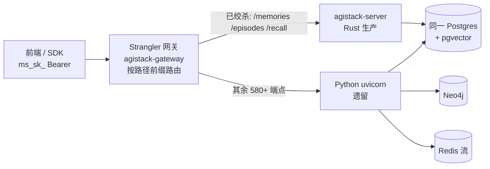

# 10 · 生产迁移:Python 后端绞杀替换为 Rust 新架构

> 用户需求:「完成现有 Python 后端替换为 Rust 新架构」。本篇是**权威的分波次生产迁移设计**——从已证伪的 Spike/Phase 1 基座,到逐能力替换 ~595 个 Python 端点的落地路径。核心策略:**共享数据库之上的绞杀者(strangler-fig on a shared DB)**,新旧后端并行、逐能力灰度切换、任何阶段都可上线、可回滚。**本波(P1 记忆/情节/召回)已端到端落地并验证**(见 [§4](#4-本波已落地p1--记忆情节召回)、[04 证据 #25](04-spike-evidence.md))。

前置阅读:[00 选型](00-overview.md)、[01 可移植核心](01-portable-core.md)、[05 路线图](05-roadmap.md) §1 绞杀迁移、[08 控制流/数据流分离](08-control-data-plane-separation.md)(网关=数据面边缘)。

## 0. 现实:差距是数量级的

| | Python(现网) | Rust(`agi-stack/`) |
|---|---|---|
| 生产代码 | ~412K LOC(infra 321K + application 45K + domain 41K + config 4K) | ~27K LOC |
| API 面 | ~595 端点(56 顶层 router + 16 agent 子 router)+ 4 WebSocket + ~15 streaming | P1 子集(记忆/情节/召回)已生产化 |
| 六边形边界 | 94 端口 · 110 张表 · 99 Alembic 迁移 · 80 SQL 仓储 | 端口镜像 core;生产 Postgres 适配器落地 P1 |
| Agent 系统 | ~168K LOC(L1 工具 35+ / L2 Skill / L3 SubAgent / L4 ReAct) | 运行时无关核心 + 热插拔宿主(Wave A–N) |
| 外部集成 | LiteLLM(100+ provider)· Neo4j · Ray · Redis(6 总线)· MCP · Docker 沙箱 | HTTP LLM 已通;余下按波次 |

**结论**:全量对齐是多人·跨季度工程。**严禁大爆炸重写**(路线图 §1/§6)。唯一安全路径 = 绞杀者式增量迁移。

## 1. 绞杀拓扑

网关居前,把**已绞杀能力**路由到 Rust 生产服务器,其余仍走 Python。同 `/api/v1` 契约、同 `ms_sk_` Bearer 认证、同 JSON 形状 —— **前端零改动**。每能力切换 = 翻一条网关路由;回滚 = 翻回。

- **网关** [`apps/gateway`](../../apps/gateway)(axum + reqwest 反向代理):`is_strangled(path)` 纯前缀匹配(确定性,非语义判断——**Agent First** 只把主观判断交给 agent,路由是结构事实),命中前缀转发 Rust、否则转发 Python;method / 端到端 header(含 `Authorization`)/ body 逐字透传,不跟随上游 307(镜像 FastAPI 尾斜杠语义)。
- **Rust 服务器** [`apps/server`](../../apps/server):P1 生产端点挂在 `/api/v1`,前置 F2 认证中间件。
- **共享 Postgres**:Rust 与 Python **读写同一套 schema**,零数据迁移(见 §2)。

## 2. 使能器:共享数据库(两类表)

绞杀可灰度、可回滚的关键,是 Rust 服务器**读写 Python 同一套 Postgres**([ADR-0001](../adr/0001-rust-as-portable-core-language.md) 的运行时无关核心 + server-only 适配器使其干净成立):

1. **Python 拥有的表,逐字读写** —— `PgMemoryRepository` 对 `memories`、`PgApiKeyStore` 对 `api_keys`、`PgProjectStore` 对 `projects`/`user_projects`。列名/类型精确镜像 `src/infrastructure/adapters/secondary/persistence/models.py`。写入时把 core 不建模但 DB 必填的列以 **Python 默认值**补齐(`relationships='[]'`、`collaborators='[]'`、`is_public=false`、`processing_status='COMPLETED'`、`meta='{}'`)→ 行对仍在线的 Python 读者依然合法。
2. **Rust 拥有的*附加*表** —— `ensure_aux_schema` 仅发 `CREATE EXTENSION/TABLE IF NOT EXISTS` 建 `agistack_` 前缀对象(`agistack_memory_vectors` 承 pgvector,因 Python `memories` **无 embedding 列**——向量在 Neo4j/graphiti;`agistack_checkpoints` 承 agent 崩溃恢复)。**绝不 ALTER 任何 Python 表** → 两后端切换期安全共存。

> 认证 SHA256 与 Python 字节一致(`hashlib.sha256(key.encode()).hexdigest()`,无盐)→ Python 签发的 `ms_sk_` key 在 Rust 对同一 `api_keys.key_hash` 校验通过。这是共享库绞杀的第二个使能点。

## 3. 跨切面基础(Foundation)

| F | 内容 | 状态 |
|---|---|---|
| **F1 · 生产持久化** | [`crates/adapters-postgres`](../../crates/adapters-postgres)(sqlx + pgvector,**server-only**,tokio 隔离):`MemoryRepository`/`VectorIndexPort`/`CheckpointStore` + 只读 `ApiKey`/`Project` 查询,对 Python 同一 schema。真库集成测试经 `DATABASE_URL`(有 Docker Postgres 时)跑真库,离线编译测试恒绿 | ✅ P1 落地 |
| **F2 · 认证/多租户中间件** | [`apps/server/src/auth.rs`](../../apps/server/src/auth.rs)(tower 层,镜像 Python `auth_dependencies.py`):`Authorization: Bearer ms_sk_…` → SHA256 → 查 `api_keys.key_hash` → 校 `is_active`/`expires_at` → 注入 scoped `Identity`;401 路径对齐;**每查询按 `project_id` 收敛**。`PgAuthenticator`(生产)/`DevAuthenticator`(离线,任意 `ms_sk_` → dev 用户)双实现 | ✅ P1 落地 |
| **F3 · 契约 parity 测试** | 断言 Rust 响应与 Python 字节兼容:`MemoryResponse` 默认字段、i18n 错误信封、尾斜杠(避 307 跨源丢 auth 头) | ✅ P1 覆盖(见 §4) |
| **F4 · 可观测/灰度** | 结构化日志 + trace + 按路由灰度比例 + 回滚 runbook | 🎯 future(逐波次) |

## 4. 本波已落地:P1 — 记忆/情节/召回

P1 选记忆域先行:Rust `MemoryService` 已最成熟,且这是价值高、依赖少的垂直。已生产化的端点(**与 Python 契约字节兼容**):

| 方法 · 路径 | 处理 | 返回 |
|---|---|---|
| `POST /api/v1/memories/` | 直接创建(无 LLM) | 201 `MemoryResponse` |
| `GET /api/v1/memories/` | 列举 + 关键词搜索(分页) | 200 `MemoryListResponse` |
| `GET /api/v1/memories/{id}` | 取单条 | 200 / 404 |
| `DELETE /api/v1/memories/{id}` | 删除(按 project 收敛) | 204 |
| `POST /api/v1/episodes/` | 情节摄取(同步 extract→memory) | 202 `EpisodeResponse` |
| `POST /api/v1/recall/short` | 窗口内近期召回 | 200 `ShortTermRecallResponse` |

实现见 [`apps/server/src/prod_api.rs`](../../apps/server/src/prod_api.rs)。`MemoryResponse` 用 `#[serde(rename="metadata")]` 对齐 Python 的 `meta`→`metadata` 别名,core 不建模的字段以 Python 默认值发出,`created_at` 为 RFC3339 —— Rust 服务的响应与 Python 服务的**不可区分**。

**端到端验证**(见 [04 证据 #25](04-spike-evidence.md)):经**真 Rust 服务器 + 真网关 + mock Python 上游**,curl 全部 P1 端点通过——201 创建、200 列举(`total`/`page`)、404、204、202 情节、200 召回;无 auth → 401「Missing API key…」、坏格式 → 401「Invalid API key format…」(Python 逐字一致)。网关 e2e 测试断言绞杀前缀→Rust、其余→Python、Bearer 透传、方法/体保真、307 relay。F1 另经真实 `pgvector/pgvector:pg16` 容器验证共享 schema 读写 + pgvector 余弦 + SHA256 key 校验。

## 5. 全量波次计划(P1..P8)

> 每波 = 建所需生产适配器 + 移植 domain/application 逻辑 + 实现端点契约 + 翻网关路由 + parity 测试 + 监控。按「价值 × Rust 就绪度 × 依赖」排序。

| 波次 | 能力 | 主要端点 | 新增/依赖适配器 | 难度 | 状态 |
|---|---|---|---|---|---|
| **P1** | 记忆与情节 | `/memories/*` · `/episodes/*` · `/recall` | **F1 Postgres+pgvector** | 低-中 | ✅ 本波落地 |
| **P2** | 身份/租户/项目 | `/auth/*` · `/tenants/*` · `/projects/*` | F2(部分已在) | 中 | 🎯 future |
| **P3** | Agent 运行时与会话 | WS `/agent/ws` · `/agent/*`(84 子)· HITL | Redis 流 · 流式 LLM · 真 ToolHost · Ray→actor | 极高 | 🎯 future(吞并 Wave L/M/N 运行时硬化) |
| **P4** | 知识图谱 | `/graph/*` · 实体抽取 · 混合检索 | Neo4j(server)/ SQLite+petgraph(端) | 高 | 🎯 future |
| **P5** | 沙箱与 MCP | `/project_sandbox/*` · `/skills` · `/channels` | Docker 沙箱 · MCP · 终端 WS | 高 | 🎯 future(`plugin-host` 已就位) |
| **P6** | 工作区与计划 | `/workspaces` · `/workspace_tasks` · blackboard · topology | 复用 P3 流/事件 | 高 | 🎯 future |
| **P7** | 长尾 | genes · instances · llm_providers · deploy · cron · observability · … | 各自 | 中 | 🎯 future(~250 端点,多为 CRUD) |
| **P8** | 切换与下线 | 全量 | — | — | 🎯 future(各能力零 Python 流量后下线) |

**诚实的「龙」**(A 方案逐波次落地,MVP 期可保留 Python 微服务承接,经网关并存):**Ray Actor 分布式**(无 Rust 直接对应,需 tokio/actor 或 gRPC 重建)、**LiteLLM 100+ provider 广度**、**Neo4j 抽取管线**、**MCP/Docker 沙箱**、**流式 WS 事件桥**。

## 6. 不变量与回滚

- **核心运行时无关**:`core` 零 tokio / 零 `std::time`,`cargo build -p agistack-core --target wasm32-unknown-unknown` 恒绿;Postgres(sqlx/tokio)+ 网关(reqwest/tokio)**严格 server-only**,绝不泄漏回端口签名([ADR-0001](../adr/0001-rust-as-portable-core-language.md))。
- **多租户**:每查询按 `project_id`/`tenant_id` 收敛;F2 中间件解析作用域并在每端点显式 `can_access_project` 后再落库。
- **绞杀安全**:每次切换 = 网关开关 + 回滚;共享库零数据迁移;切换前过 parity 门禁(响应字节兼容)+ 灰度。附加表只增不改 Python 表。
- **Agent First**:网关路由/认证是结构性协议事实(前缀集合、hash 查表、算术过期),保持确定性;真正的语义判断(如 P3 的工具选择/路由)才归 agent 工具调用。

## 7. 证据指针

- [04 证据 #25](04-spike-evidence.md) —— P1 端到端(网关 + Rust 服务器 + mock Python)、F1 真 pgvector、F2 认证 parity。
- [05 路线图](05-roadmap.md) §1 Phase 5 —— 由 future 翻「🚧 进行中(P1 生产切片落地)」。
- 复现:`cargo test --workspace`(87 绿,含 gateway e2e + prod_api parity;pg 集成测试离线跳过);`DATABASE_URL=… cargo test -p agistack-adapters-postgres --test pg_integration`(真库 4 绿);手动 `cargo run -p agistack-server` + `cargo run -p agistack-gateway` 后 curl `/api/v1/memories/`。
