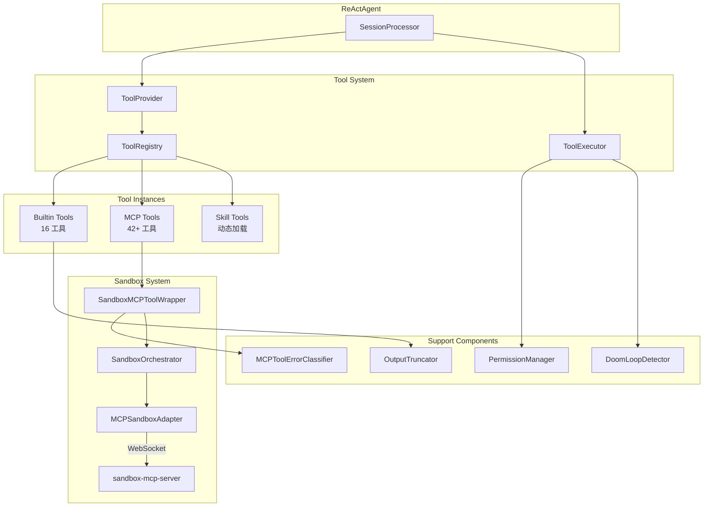
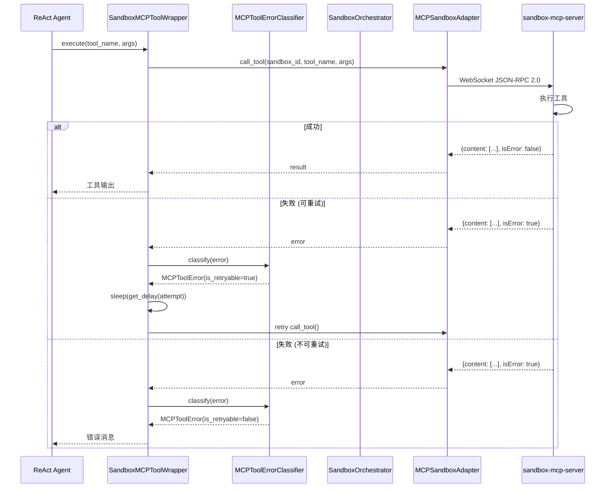

# MemStack Agent 工具体系 (Tool System)

本文档详细介绍 MemStack ReAct Agent 的工具体系架构、核心组件和使用指南。

---

## 目录

1. [概述 (Overview)](#1-概述-overview)
2. [工具分类与清单 (Tool Categories)](#2-工具分类与清单-tool-categories)
3. [沙箱工具体系 (Sandbox Tool System)](#3-沙箱工具体系-sandbox-tool-system)
4. [核心架构 (Core Architecture)](#4-核心架构-core-architecture)
5. [工具详解 (Tool Reference)](#5-工具详解-tool-reference)
6. [扩展指南 (Extension Guide)](#6-扩展指南-extension-guide)
7. [最佳实践 (Best Practices)](#7-最佳实践-best-practices)
8. [故障排除 (Troubleshooting)](#8-故障排除-troubleshooting)
9. [版本演进 (Version History)](#9-版本演进-version-history)
10. [附录 (Appendix)](#附录-appendix)

---

## 1. 概述 (Overview)

### 1.1 工具体系简介

MemStack Agent 工具体系是 ReAct Agent 的核心能力模块，提供了一套完整的工具管理、执行和扩展框架。工具是 Agent 与外部世界交互的桥梁，使 Agent 能够执行搜索、文件操作、代码执行、人机交互等各类任务。

```
┌─────────────────────────────────────────────────────────────────┐
│                     ReAct Agent Core                            │
│  ┌─────────────────────────────────────────────────────────┐   │
│  │                   Tool System                             │   │
│  │  ┌─────────┐  ┌─────────────┐  ┌────────────────────┐  │   │
│  │  │ Registry │→ │ Tool Provider │→ │   Tool Executor    │  │   │
│  │  └─────────┘  └─────────────┘  └────────────────────┘  │   │
│  │        ↓              ↓                    ↓             │   │
│  │  ┌─────────────────────────────────────────────────┐   │   │
│  │  │              AgentTool Instances                 │   │   │
│  │  │  ┌──────────┐ ┌──────────┐ ┌──────────────────┐ │   │   │
│  │  │  │ Builtin  │ │   MCP    │ │     Skills       │ │   │   │
│  │  │  │  Tools   │ │  Tools   │ │   (Dynamic)      │ │   │   │
│  │  │  └──────────┘ └──────────┘ └──────────────────┘ │   │   │
│  │  └─────────────────────────────────────────────────┘   │   │
│  └─────────────────────────────────────────────────────────┘   │
└─────────────────────────────────────────────────────────────────┘
```

### 1.2 设计理念

工具体系遵循以下核心设计原则：

| 原则 | 描述 |
|------|------|
| **统一接口** | 所有工具继承 `AgentTool` 基类，提供一致的执行和校验接口 |
| **热插拔** | 支持运行时动态加载和卸载工具，无需重启 Agent |
| **权限控制** | Allow/Deny/Ask 三级权限管理，支持危险操作确认 |
| **输出截断** | 防止大输出消耗过多 token (默认 50KB 限制) |
| **工具组合** | 支持工具链式调用和数据转换 (T109-T111) |
| **错误分类** | 自动分类错误类型，决定重试策略 |
| **可观测性** | 执行统计、耗时追踪、调用记录 |

### 1.3 四层架构概览 (L1-L4)

MemStack Agent 采用四层工具架构：

```
┌─────────────────────────────────────────────────────────────────┐
│ L4: Agent 层                                                     │
│     完整 ReAct Agent，协调所有层级                                │
├─────────────────────────────────────────────────────────────────┤
│ L3: SubAgent 层                                                  │
│     专业化代理 (Planner, Coder, Reviewer...)                     │
├─────────────────────────────────────────────────────────────────┤
│ L2: Skill 层                                                     │
│     声明式工具组合 (SKILL.md)                                    │
├─────────────────────────────────────────────────────────────────┤
│ L1: Tool 层                                                      │
│     原子能力单元 (web_search, bash, file_read...)                │
└─────────────────────────────────────────────────────────────────┘
```

---

## 2. 工具分类与清单 (Tool Categories)

### 2.1 信息获取类 (Information Retrieval)

用于从外部获取信息的工具。

| 工具名 | 类名 | 文件 | 功能描述 |
|--------|------|------|----------|
| `web_search` | `WebSearchTool` | `web_search.py` | 使用 Tavily API 进行网络搜索，支持 Redis 缓存 |
| `web_scrape` | `WebScrapeTool` | `web_scrape.py` | 使用 Playwright 抓取网页内容，支持 JS 渲染 |

### 2.2 交互协作类 (Interaction & Collaboration)

用于人机交互 (HITL - Human-in-the-Loop) 的工具。

| 工具名 | 类名 | 文件 | 功能描述 |
|--------|------|------|----------|
| `ask_clarification` | `ClarificationTool` | `clarification.py` | 向用户提问以澄清模糊需求 |
| `request_decision` | `DecisionTool` | `decision.py` | 在关键决策点请求用户决策 |
| `request_env_var` | `RequestEnvVarTool` | `env_var_tools.py` | 向用户请求环境变量值 |

### 2.3 规划管理类 (Planning & Management)

用于任务规划和进度管理的工具。

| 工具名 | 类名 | 文件 | 功能描述 |
|--------|------|------|----------|
| `plan_enter` | `PlanEnterTool` | `plan_enter.py` | 进入 Plan Mode，创建计划文档 |
| `plan_update` | `PlanUpdateTool` | `plan_update.py` | 更新计划文档内容 |
| `plan_exit` | `PlanExitTool` | `plan_exit.py` | 退出 Plan Mode，返回实现模式 |
| `todoread` | `TodoReadTool` | `todo_tools.py` | 读取会话级待办事项列表 |
| `todowrite` | `TodoWriteTool` | `todo_tools.py` | 写入/更新待办事项 |

### 2.4 环境管理类 (Environment Management)

用于管理 Sandbox 执行环境的工具。

| 工具名 | 类名 | 文件 | 功能描述 |
|--------|------|------|----------|
| `terminal` | `TerminalTool` | `terminal_tool.py` | 管理 Web Terminal 会话 (ttyd) |
| `desktop` | `DesktopTool` | `desktop_tool.py` | 管理远程桌面会话 (noVNC) |
| `get_env_var` | `GetEnvVarTool` | `env_var_tools.py` | 从数据库加载环境变量 |
| `check_env_vars` | `CheckEnvVarsTool` | `env_var_tools.py` | 检查所需环境变量是否已配置 |

### 2.5 扩展能力类 (Extension & Skills)

用于动态扩展 Agent 能力的工具。

| 工具名 | 类名 | 文件 | 功能描述 |
|--------|------|------|----------|
| `skill_loader` | `SkillLoaderTool` | `skill_loader.py` | 按需加载 Skill 指令 (Claude Skills 模式) |
| `skill_installer` | `SkillInstallerTool` | `skill_installer.py` | 从 skills.sh 安装 Skill |

---

## 3. 沙箱工具体系 (Sandbox Tool System)

MemStack 的沙箱体系通过 MCP (Model Context Protocol) 提供完整的代码执行环境，包含 **42+ 个工具**。

### 3.1 沙箱架构概览

```
┌─────────────────────────────────────────────────────────────────┐
│                      ReAct Agent                                │
├─────────────────────────────────────────────────────────────────┤
│  Tool Registry & Provider Layer                                 │
│  ├─ Built-in Tools                                              │
│  ├─ MCP Tool Provider (create_mcp_tool_provider)               │
│  └─ Tool Composition                                            │
└────────────┬────────────────────────────────────────────────────┘
             │
┌────────────▼────────────────────────────────────────────────────┐
│         SandboxMCPToolWrapper + Error Handling                  │
│  ├─ Tool Routing & Namespacing (sandbox_id → tool)             │
│  ├─ MCPToolErrorClassifier (错误分类)                           │
│  ├─ RetryConfig (指数退避重试)                                  │
│  └─ Permission System (classify_sandbox_tool_permission)       │
└────────────┬────────────────────────────────────────────────────┘
             │
┌────────────▼────────────────────────────────────────────────────┐
│          SandboxOrchestrator (统一沙箱服务)                     │
│  ├─ MCPSandboxAdapter (Docker 容器)                             │
│  ├─ LocalSandboxAdapter (本地沙箱)                              │
│  └─ Service Management (Terminal, Desktop)                      │
└────────────┬────────────────────────────────────────────────────┘
             │ WebSocket (JSON-RPC 2.0)
┌────────────▼────────────────────────────────────────────────────┐
│        MCPWebSocketServer (sandbox-mcp-server)                  │
│  ├─ ToolRegistry (42+ 工具)                                     │
│  ├─ DesktopManager (XFCE + VNC)                                │
│  ├─ WebTerminalManager (ttyd)                                   │
│  └─ Security Layer (路径隔离, 命令黑名单)                       │
└─────────────────────────────────────────────────────────────────┘
```

### 3.2 MCP 工具清单 (42+ Tools)

#### 3.2.1 文件工具 (File Tools)

| 工具名 | 功能描述 | 关键参数 |
|--------|----------|----------|
| `read` | 读取文件内容 (带行号) | `file_path`, `offset`, `limit` (默认 2000 行) |
| `write` | 写入/创建文件 | `file_path`, `content` |
| `edit` | 字符串替换编辑文件 | `file_path`, `old_str`, `new_str` |
| `glob` | 通配符搜索文件 | `pattern`, `path` |
| `grep` | 正则搜索文件内容 | `pattern`, `path`, `-i`, `-n`, `-C` |
| `list` | 列出目录内容 | `path`, `recursive` |
| `patch` | 应用 unified diff patch | `file_path`, `patch_content` |

**文件位置**: `sandbox-mcp-server/src/tools/file_tools.py`

#### 3.2.2 执行工具 (Execution Tools)

| 工具名 | 功能描述 | 关键参数 |
|--------|----------|----------|
| `bash` | 执行 Shell 命令 | `command`, `timeout` (默认 300s), `working_dir` |

**安全特性**:
- 命令黑名单: `rm -rf /`, `mkfs`, `dd if=/dev/zero`, Fork bomb
- 最大输出: 16MB
- 路径隔离: 强制在 workspace 内执行
- 非交互式: `DEBIAN_FRONTEND=noninteractive`

**文件位置**: `sandbox-mcp-server/src/tools/bash_tool.py`

#### 3.2.3 制品工具 (Artifact Tools)

| 工具名 | 功能描述 | 关键参数 |
|--------|----------|----------|
| `export_artifact` | 导出单个文件制品 | `file_path`, `artifact_name` |
| `list_artifacts` | 列出已导出制品 | - |
| `batch_export_artifacts` | 批量导出制品 | `file_paths[]` |

**文件位置**: `sandbox-mcp-server/src/tools/artifact_tools.py`

#### 3.2.4 终端工具 (Terminal Tools)

| 工具名 | 功能描述 | 关键参数 |
|--------|----------|----------|
| `start_terminal` | 启动 ttyd Web 终端 | `port` (默认 7681) |
| `stop_terminal` | 停止终端服务 | - |
| `get_terminal_status` | 获取终端状态 | - |
| `restart_terminal` | 重启终端 | - |

**文件位置**: `sandbox-mcp-server/src/tools/terminal_tools.py`

#### 3.2.5 桌面工具 (Desktop Tools)

| 工具名 | 功能描述 | 关键参数 |
|--------|----------|----------|
| `start_desktop` | 启动 XFCE + VNC 桌面 | `resolution`, `display`, `port` |
| `stop_desktop` | 停止桌面服务 | - |
| `get_desktop_status` | 获取桌面状态 | - |
| `restart_desktop` | 重启桌面 | - |

**桌面配置**:
```python
@dataclass
class DesktopConfig:
    resolution: str = "1280x720"
    display: str = ":1"
    port: int = 6080  # noVNC 端口
```

**文件位置**: `sandbox-mcp-server/src/tools/desktop_tools.py`

#### 3.2.6 AST 工具 (AST Tools)

| 工具名 | 功能描述 | 关键参数 |
|--------|----------|----------|
| `ast_parse` | 解析代码为 AST | `file_path`, `language` |
| `ast_find_symbols` | 查找符号定义 | `file_path`, `symbol_type` |
| `ast_extract_function` | 提取函数定义 | `file_path`, `function_name` |
| `ast_get_imports` | 获取导入语句 | `file_path` |

**文件位置**: `sandbox-mcp-server/src/tools/ast_tools.py`

#### 3.2.7 代码索引工具 (Index Tools)

| 工具名 | 功能描述 | 关键参数 |
|--------|----------|----------|
| `code_index_build` | 构建代码索引 | `path`, `languages[]` |
| `find_definition` | 查找符号定义 | `symbol` |
| `find_references` | 查找符号引用 | `symbol` |
| `call_graph` | 生成调用图 | `function_name` |
| `dependency_graph` | 生成依赖图 | `file_path` |

**文件位置**: `sandbox-mcp-server/src/tools/index_tools.py`

#### 3.2.8 高级编辑工具 (Edit Tools)

| 工具名 | 功能描述 | 关键参数 |
|--------|----------|----------|
| `edit_by_ast` | 基于 AST 的精确编辑 | `file_path`, `edits[]` |
| `batch_edit` | 批量文件编辑 | `edits[]` |
| `preview_edit` | 预览编辑结果 | `file_path`, `old_str`, `new_str` |

**文件位置**: `sandbox-mcp-server/src/tools/edit_tools.py`

#### 3.2.9 Git 工具 (Git Tools)

| 工具名 | 功能描述 | 关键参数 |
|--------|----------|----------|
| `git_diff` | 查看 Git diff | `path`, `staged` |
| `git_log` | 查看 Git 日志 | `limit`, `path` |
| `generate_commit` | 生成 commit 消息 | `staged_only` |

**文件位置**: `sandbox-mcp-server/src/tools/git_tools.py`

#### 3.2.10 测试工具 (Test Tools)

| 工具名 | 功能描述 | 关键参数 |
|--------|----------|----------|
| `generate_tests` | 生成测试代码 | `file_path`, `function_name` |
| `run_tests` | 运行测试 | `path`, `pattern` |
| `analyze_coverage` | 分析代码覆盖率 | `path` |

**文件位置**: `sandbox-mcp-server/src/tools/test_tools.py`

#### 3.2.11 导入工具 (Import Tools)

| 工具名 | 功能描述 | 关键参数 |
|--------|----------|----------|
| `import_file` | 从 MemStack 导入文件 | `source_url`, `dest_path` |
| `import_files_batch` | 批量导入文件 | `files[]` |

**文件位置**: `sandbox-mcp-server/src/tools/import_tools.py`

### 3.3 SandboxMCPToolWrapper

`SandboxMCPToolWrapper` 将 MCP 工具包装为 `AgentTool`，提供错误处理和重试逻辑。

**文件位置**: `src/infrastructure/agent/tools/sandbox_tool_wrapper.py`

```python
class SandboxMCPToolWrapper(AgentTool):
    """
    Wrapper for Sandbox MCP tools to be used by ReActAgent.
    
    Features:
    - Tool routing by sandbox_id
    - Automatic error classification and retry
    - Permission classification (read/write/bash/ask)
    """
    
    def __init__(
        self,
        sandbox_id: str,           # 沙箱实例 ID
        tool_name: str,            # MCP 工具原始名称
        tool_schema: Dict,         # MCP 工具 Schema
        sandbox_adapter: Any,      # MCPSandboxAdapter 实例
        retry_config: RetryConfig, # 重试配置
    ):
        ...
    
    async def execute(self, **kwargs) -> Any:
        """执行工具，自动重试可恢复错误。"""
        for attempt in range(self._retry_config.max_retries + 1):
            try:
                result = await self._adapter.call_tool(
                    self.sandbox_id, self.tool_name, kwargs
                )
                # 处理结果...
            except Exception as e:
                error = MCPToolErrorClassifier.classify(e, ...)
                if error.is_retryable and attempt < max_retries:
                    await asyncio.sleep(self._retry_config.get_delay(attempt))
                    continue
                raise
```

### 3.4 错误处理系统

#### 3.4.1 错误类型 (MCPToolErrorType)

**文件位置**: `src/infrastructure/agent/tools/mcp_errors.py`

| 错误类型 | 可重试 | 描述 |
|----------|--------|------|
| `CONNECTION_ERROR` | ✅ | WebSocket 连接失败 |
| `TIMEOUT_ERROR` | ✅ | 执行超时 |
| `PARAMETER_ERROR` | ❌ | 参数错误 (含文件不存在) |
| `VALIDATION_ERROR` | ❌ | 校验失败 |
| `PERMISSION_ERROR` | ❌ | 权限被拒绝 |
| `EXECUTION_ERROR` | ❌ | 执行失败 (资源限制等) |
| `SANDBOX_NOT_FOUND` | ❌ | 沙箱不存在 |
| `SANDBOX_TERMINATED` | ❌ | 沙箱已终止 |

#### 3.4.2 错误分类器 (MCPToolErrorClassifier)

```python
class MCPToolErrorClassifier:
    """基于错误消息模式分类错误类型。"""
    
    CONNECTION_PATTERNS = ["connection refused", "websocket", "cannot connect"]
    TIMEOUT_PATTERNS = ["timeout", "timed out", "deadline exceeded"]
    PARAMETER_PATTERNS = ["invalid parameter", "missing parameter"]
    PERMISSION_PATTERNS = ["permission denied", "unauthorized", "eperm"]
    FILE_NOT_FOUND_PATTERNS = ["file not found", "no such file", "enoent"]
    
    @classmethod
    def classify(cls, error, tool_name, sandbox_id, context) -> MCPToolError:
        """分类错误并确定重试策略。"""
        ...
```

#### 3.4.3 重试配置 (RetryConfig)

```python
class RetryConfig:
    max_retries: int = 3         # 最大重试次数
    base_delay: float = 1.0      # 基础延迟 (秒)
    max_delay: float = 30.0      # 最大延迟
    exponential_base: float = 2.0  # 指数退避基数
    jitter: bool = True          # ±25% 随机抖动
    
    def get_delay(self, attempt: int) -> float:
        """计算第 N 次重试的延迟。"""
        delay = min(self.base_delay * (2 ** attempt), self.max_delay)
        if self.jitter:
            delay *= random.uniform(0.75, 1.25)
        return delay
```

### 3.5 SandboxOrchestrator

统一的沙箱服务编排层，同时被 REST API 和 Agent Tools 使用。

**文件位置**: `src/application/services/sandbox_orchestrator.py`

```python
class SandboxOrchestrator:
    """
    统一沙箱服务层。
    
    支持:
    - Cloud sandboxes: Docker 容器 (MCPSandboxAdapter)
    - Local sandboxes: 本地机器 (LocalSandboxAdapter)
    """
    
    # Desktop 管理
    async def start_desktop(self, sandbox_id: str, config: DesktopConfig) -> DesktopStatus
    async def stop_desktop(self, sandbox_id: str) -> bool
    async def get_desktop_status(self, sandbox_id: str) -> DesktopStatus
    
    # Terminal 管理
    async def start_terminal(self, sandbox_id: str, config: TerminalConfig) -> TerminalStatus
    async def stop_terminal(self, sandbox_id: str) -> bool
    async def get_terminal_status(self, sandbox_id: str) -> TerminalStatus
    
    # 命令执行
    async def execute_command(self, sandbox_id: str, command: str, ...) -> CommandResult
```

**状态数据类**:

```python
@dataclass
class DesktopStatus:
    running: bool
    url: Optional[str]      # noVNC URL
    display: str            # X11 display (:1)
    resolution: str         # 1280x720
    port: int               # 6080
    pid: Optional[int]

@dataclass
class TerminalStatus:
    running: bool
    url: Optional[str]      # ttyd URL
    port: int               # 7681
    pid: Optional[int]
    session_id: Optional[str]

@dataclass
class CommandResult:
    exit_code: int
    stdout: str
    stderr: str
    execution_time_ms: int
```

### 3.6 权限分类

沙箱工具权限基于工具类型自动分类：

**文件位置**: `src/infrastructure/agent/permission/rules.py`

```python
def classify_sandbox_tool_permission(tool_name: str) -> str:
    """根据工具名称分类权限。"""
    
    READ_TOOLS = {"read", "file_read", "list", "glob", "grep", "find", "git_diff", "git_log"}
    WRITE_TOOLS = {"write", "file_write", "edit", "patch", "delete"}
    EXECUTE_TOOLS = {"bash", "execute", "run_command", "python", "node"}
    ASK_TOOLS = {"start_desktop", "start_terminal", "generate_commit"}
    
    if tool_name in READ_TOOLS:
        return "allow"
    elif tool_name in WRITE_TOOLS:
        return "allow"  # 在沙箱内，写入相对安全
    elif tool_name in EXECUTE_TOOLS:
        return "allow"  # 沙箱隔离
    elif tool_name in ASK_TOOLS:
        return "ask"    # 需要用户确认
    return "allow"
```

### 3.7 安全特性

| 特性 | 实现 |
|------|------|
| **命令黑名单** | `BLOCKED_COMMANDS` 阻止危险命令 |
| **路径隔离** | `_resolve_path()` 确保操作在 workspace 内 |
| **输出限制** | bash 最大 16MB，文件读取最大 2000 行 |
| **超时保护** | bash 最大 600s，可配置 |
| **非 root 运行** | Docker 容器使用 UID 1001 |
| **环境隔离** | 清理主机环境变量 (`HOST_PATH`, `PROJECT_PATH`) |

### 3.8 端口配置

| 服务 | 默认端口 | 说明 |
|------|----------|------|
| MCP WebSocket | 8765 (容器内) / 18765+ (主机映射) | JSON-RPC 2.0 |
| Web Terminal | 7681 (容器内) / 17681+ (主机映射) | ttyd |
| noVNC | 6080 (容器内) / 16080+ (主机映射) | Web 桌面 |
| VNC 直连 | 5901 | TigerVNC (可选) |

---

## 4. 核心架构 (Core Architecture)

### 3.1 AgentTool 基类设计

`AgentTool` 是所有工具的抽象基类，定义了工具的核心接口。

**文件位置**: `src/infrastructure/agent/tools/base.py`

```python
class AgentTool(ABC):
    """所有 Agent 工具的抽象基类。"""
    
    def __init__(
        self,
        name: str,              # 工具唯一名称
        description: str,       # 工具描述 (用于 LLM 理解)
        max_output_bytes: int = 50 * 1024,  # 输出大小限制
    ):
        ...
    
    @abstractmethod
    async def execute(self, **kwargs) -> str:
        """执行工具 (必须实现)"""
        pass
    
    def validate_args(self, **kwargs) -> bool:
        """参数校验 (可选重写)"""
        return True
    
    async def safe_execute(self, **kwargs) -> str:
        """带错误处理的安全执行"""
        ...
    
    def truncate_output(self, output: str) -> str:
        """截断过大输出"""
        ...
    
    def get_parameters_schema(self) -> Dict[str, Any]:
        """获取 LLM 函数调用参数 Schema"""
        ...
```

#### 核心方法说明

| 方法 | 是否必须 | 说明 |
|------|----------|------|
| `execute()` | ✅ | 异步执行工具的核心逻辑 |
| `validate_args()` | ❌ | 执行前参数校验，默认返回 True |
| `safe_execute()` | ❌ | 带异常捕获的执行，返回错误信息而非抛出 |
| `truncate_output()` | ❌ | 截断超出限制的输出 |
| `get_parameters_schema()` | ❌ | 返回 JSON Schema 供 LLM 函数调用 |

#### 工具组合支持 (T109-T111)

```python
# 获取输出格式 Schema
def get_output_schema(self) -> Dict[str, Any]:
    """返回工具输出的 JSON Schema"""
    ...

# 检查工具兼容性
def can_compose_with(self, other_tool: "AgentTool") -> bool:
    """检查此工具的输出是否可作为另一工具的输入"""
    ...

# 转换输出用于工具链
def compose_output(
    self, 
    output: str, 
    target_tool: "AgentTool",
    transformation: Optional[Dict[str, Any]] = None
) -> Dict[str, Any]:
    """转换输出格式以适配目标工具"""
    ...
```

**支持的转换操作**:

```python
{
    "extract_path": "results.0.id",      # 提取特定字段
    "field_mapping": {"src": "dest"},    # 字段映射
    "filter": {"key": "value"},          # 数组过滤
    "aggregate": "count|sum|first|last"  # 数组聚合
}
```

### 3.2 工具元数据 (ToolMetadata)

每个工具都有关联的元数据，描述其属性和权限要求。

**文件位置**: `src/infrastructure/agent/tools/tool_registry.py`

```python
@dataclass
class ToolMetadata:
    name: str                    # 工具唯一名称
    description: str             # 工具描述
    category: str                # 工具分类
    parameters: Dict[str, Any]   # 参数定义
    requires_permission: bool = True   # 是否需要权限检查
    dangerous: bool = False      # 是否为危险操作
    safe: bool = False           # 是否为安全操作 (无副作用)
    timeout_seconds: float = 30.0     # 执行超时时间
    scope: str = "tenant"        # 作用域: system/tenant/project
```

### 3.3 工具注册表 (ToolRegistry)

中央工具注册表，管理工具的注册、发现和生命周期。

**文件位置**: `src/infrastructure/agent/tools/tool_registry.py`

```python
class ToolRegistry:
    """中央工具注册表"""
    
    def register(self, tool: Tool, metadata: Optional[ToolMetadata] = None) -> None:
        """注册工具"""
        ...
    
    def unregister(self, name: str) -> None:
        """注销工具"""
        ...
    
    def get_tool(self, name: str) -> Optional[Tool]:
        """按名称获取工具"""
        ...
    
    def list_tools(
        self, 
        category: Optional[str] = None,
        status: Optional[ToolStatus] = None
    ) -> List[str]:
        """列出工具 (支持过滤)"""
        ...
    
    def enable_tool(self, name: str) -> None:
        """启用工具"""
        ...
    
    def disable_tool(self, name: str) -> None:
        """禁用工具"""
        ...

# 全局注册表访问
registry = get_tool_registry()
```

**工具状态 (ToolStatus)**:

```python
class ToolStatus(Enum):
    REGISTERED = "registered"  # 已注册
    ACTIVE = "active"          # 已激活
    DISABLED = "disabled"      # 已禁用
    ERROR = "error"            # 错误状态
```

### 3.4 工具提供者 (ToolProvider)

工具提供者工厂，支持热插拔和多源工具聚合。

**文件位置**: `src/infrastructure/agent/tools/tool_provider.py`

```python
# 缓存型提供者 (推荐)
def create_cached_tool_provider(
    project_id: str,
    fallback_tools: Optional[Dict[str, Any]] = None
) -> Callable[[], Dict[str, Any]]:
    """创建从缓存读取工具的提供者"""
    ...

# MCP 工具提供者
def create_mcp_tool_provider(
    tenant_id: str
) -> Callable[[], Dict[str, Any]]:
    """创建从 MCP 缓存读取工具的提供者"""
    ...

# 复合提供者 (聚合多个源)
def create_composite_tool_provider(
    providers: list[Callable[[], Dict[str, Any]]]
) -> Callable[[], Dict[str, Any]]:
    """创建聚合多个提供者的复合提供者"""
    ...

# 静态提供者 (测试用)
def create_static_tool_provider(
    tools: Dict[str, Any]
) -> Callable[[], Dict[str, Any]]:
    """创建返回固定工具集的提供者"""
    ...
```

### 3.5 工具执行器 (ToolExecutor)

核心工具执行组件，处理权限检查、Doom Loop 检测、错误处理。

**文件位置**: `src/infrastructure/agent/tools/executor.py`

```python
class ToolExecutor:
    """核心工具执行处理器"""
    
    def __init__(
        self,
        doom_loop_detector: DoomLoopDetectorProtocol,
        permission_manager: PermissionManagerProtocol,
        artifact_service: Optional[ArtifactServiceProtocol] = None,
        debug_logging: bool = False,
    ):
        ...
    
    async def execute(
        self,
        tool_name: str,
        tool_def: ToolDefinitionProtocol,
        arguments: Dict[str, Any],
        tool_part: ToolPartProtocol,
        context: ExecutionContext,
        call_id: str,
        ...
    ) -> AsyncIterator[AgentDomainEvent]:
        """执行工具，返回领域事件流"""
        ...
```

#### 执行流程

```
┌─────────────────────────────────────────────────────────────────┐
│  1. Doom Loop 检测                                               │
│     检查是否重复调用相同工具相同参数                                │
│     → 检测到循环则请求用户确认                                     │
└─────────────────────────────────────────────────────────────────┘
                            ↓
┌─────────────────────────────────────────────────────────────────┐
│  2. 权限检查                                                     │
│     评估工具权限规则 (ALLOW/DENY/ASK)                            │
│     → ASK 则暂停执行，等待用户批准                                │
└─────────────────────────────────────────────────────────────────┘
                            ↓
┌─────────────────────────────────────────────────────────────────┐
│  3. 参数校验                                                     │
│     处理截断参数、修复 JSON 格式                                  │
└─────────────────────────────────────────────────────────────────┘
                            ↓
┌─────────────────────────────────────────────────────────────────┐
│  4. 异步执行 (带超时)                                            │
│     asyncio.wait_for(tool.execute(), timeout)                   │
│     默认超时: 30秒                                               │
└─────────────────────────────────────────────────────────────────┘
                            ↓
┌─────────────────────────────────────────────────────────────────┐
│  5. 结果处理                                                     │
│     - 解析执行结果                                               │
│     - 提取并上传 Artifacts                                       │
│     - 更新工作计划步骤状态                                        │
│     - 发射领域事件 (AgentObserveEvent)                           │
└─────────────────────────────────────────────────────────────────┘
```

#### 执行上下文 (ExecutionContext)

```python
@dataclass
class ExecutionContext:
    session_id: str
    project_id: Optional[str] = None
    tenant_id: Optional[str] = None
    conversation_id: Optional[str] = None
    permission_timeout: float = 60.0
```

#### 执行结果 (ExecutionResult)

```python
@dataclass
class ExecutionResult:
    success: bool
    output: Optional[str] = None
    error: Optional[str] = None
    duration_ms: int = 0
    artifacts: List[Dict[str, Any]] = field(default_factory=list)
```

---

## 5. 工具详解 (Tool Reference)

### 4.1 WebSearchTool

**功能**: 使用 Tavily API 进行网络搜索，支持 Redis 缓存。

```python
# 参数 Schema
{
    "query": {
        "type": "string",
        "description": "搜索查询 (如 'latest AI developments 2024')"
    },
    "max_results": {
        "type": "integer",
        "default": 10,
        "description": "最大结果数 (1-50)"
    },
    "search_depth": {
        "type": "string",
        "enum": ["basic", "advanced"],
        "default": "basic"
    }
}

# 使用示例
result = await web_search.execute(
    query="React 19 new features",
    max_results=5,
    search_depth="basic"
)
```

**特性**:
- Redis 缓存 (可配置 TTL)
- 自动查询标准化和哈希
- 支持域名过滤 (include/exclude)

### 4.2 WebScrapeTool

**功能**: 使用 Playwright 抓取网页内容，支持 JavaScript 渲染。

```python
# 参数 Schema
{
    "url": {
        "type": "string",
        "description": "要抓取的完整 URL"
    },
    "selector": {
        "type": "string",
        "description": "可选 CSS 选择器，提取特定内容区域"
    }
}

# 使用示例
result = await web_scrape.execute(
    url="https://example.com/article",
    selector="article.content"
)
```

**特性**:
- Headless Chrome 渲染
- 自动移除广告/导航等干扰元素
- 内容截断 (可配置最大长度)
- 安全域名过滤 (阻止 localhost 等)

### 4.3 ClarificationTool

**功能**: 向用户提问以澄清模糊需求 (HITL)。

```python
# 参数 Schema
{
    "question": {
        "type": "string",
        "description": "要向用户提问的问题"
    },
    "clarification_type": {
        "type": "string",
        "enum": ["scope", "approach", "prerequisite", "priority", "custom"],
        "description": "澄清类型"
    },
    "options": {
        "type": "array",
        "items": {
            "type": "object",
            "properties": {
                "id": {"type": "string"},
                "label": {"type": "string"},
                "description": {"type": "string"},
                "recommended": {"type": "boolean"}
            }
        },
        "description": "供用户选择的选项"
    },
    "allow_custom": {
        "type": "boolean",
        "default": true,
        "description": "是否允许自定义回答"
    }
}

# 使用示例
answer = await clarification.execute(
    question="应该使用哪种缓存策略？",
    clarification_type="approach",
    options=[
        {"id": "redis", "label": "Redis 缓存", "recommended": True},
        {"id": "memory", "label": "内存缓存"},
        {"id": "none", "label": "不使用缓存"}
    ]
)
```

**澄清类型**:
- `scope` - 范围界定 (什么应该包含/排除)
- `approach` - 方法选择 (如何解决)
- `prerequisite` - 前置条件 (需要什么先决条件)
- `priority` - 优先级 (什么更重要)
- `custom` - 自定义

### 4.4 DecisionTool

**功能**: 在关键执行点请求用户决策 (HITL)。

```python
# 参数 Schema
{
    "question": {
        "type": "string",
        "description": "决策问题"
    },
    "decision_type": {
        "type": "string",
        "enum": ["branch", "method", "confirmation", "risk", "custom"],
        "description": "决策类型"
    },
    "options": {
        "type": "array",
        "items": {
            "type": "object",
            "properties": {
                "id": {"type": "string"},
                "label": {"type": "string"},
                "description": {"type": "string"},
                "recommended": {"type": "boolean"},
                "estimated_time": {"type": "string"},
                "estimated_cost": {"type": "string"},
                "risks": {"type": "array", "items": {"type": "string"}}
            }
        }
    },
    "allow_custom": {
        "type": "boolean",
        "default": false
    },
    "default_option": {
        "type": "string",
        "description": "超时时的默认选项"
    }
}

# 使用示例
decision = await decision_tool.execute(
    question="确认删除所有用户数据？",
    decision_type="confirmation",
    options=[
        {
            "id": "proceed", 
            "label": "继续删除",
            "risks": ["数据丢失不可恢复"]
        },
        {
            "id": "cancel", 
            "label": "取消操作",
            "recommended": True
        }
    ]
)
```

**决策类型**:
- `branch` - 选择执行路径
- `method` - 选择方法/方案
- `confirmation` - 确认/取消
- `risk` - 风险接受/规避
- `custom` - 自定义

### 4.5 Plan Tools (plan_enter, plan_update, plan_exit)

**功能**: 管理 Plan Mode，实现"先规划后实现"的工作流。

#### plan_enter

```python
# 参数 Schema
{
    "conversation_id": {"type": "string"},
    "title": {"type": "string", "minLength": 3, "maxLength": 200},
    "description": {"type": "string"}
}

# 使用示例
result = await plan_enter.execute(
    conversation_id="conv-123",
    title="implement-oauth2",
    description="为应用添加 OAuth2 认证"
)
```

#### plan_update

```python
# 参数 Schema
{
    "plan_id": {"type": "string"},
    "content": {"type": "string"},
    "mode": {"type": "string", "enum": ["replace", "append", "section"]},
    "section_name": {"type": "string"},
    "explored_files": {"type": "array", "items": {"type": "string"}},
    "critical_files": {
        "type": "array",
        "items": {
            "type": "object",
            "properties": {
                "path": {"type": "string"},
                "type": {"type": "string", "enum": ["create", "modify", "delete"]}
            }
        }
    }
}

# 使用示例
result = await plan_update.execute(
    plan_id="plan-456",
    content="## 实现步骤\n1. 安装依赖\n2. 配置 OAuth 客户端",
    mode="section",
    section_name="实现步骤"
)
```

#### plan_exit

```python
# 参数 Schema
{
    "conversation_id": {"type": "string"},
    "plan_id": {"type": "string"},
    "approve": {"type": "boolean", "default": true},
    "summary": {"type": "string"}
}

# 使用示例
result = await plan_exit.execute(
    conversation_id="conv-123",
    plan_id="plan-456",
    approve=True,
    summary="实现 OAuth2 + JWT 认证"
)
```

### 4.6 Todo Tools (todoread, todowrite)

**功能**: 管理会话级待办事项列表。

#### todoread

```python
# 参数 Schema
{
    "session_id": {"type": "string"},
    "status": {"type": "string", "enum": ["pending", "in_progress", "completed", "cancelled"]},
    "priority": {"type": "string", "enum": ["high", "medium", "low"]}
}

# 使用示例
todos = await todoread.execute(
    session_id="session-123",
    status="pending"
)
```

#### todowrite

```python
# 参数 Schema
{
    "session_id": {"type": "string"},
    "action": {"type": "string", "enum": ["replace", "add", "update"]},
    "todos": {
        "type": "array",
        "items": {
            "type": "object",
            "properties": {
                "id": {"type": "string"},
                "content": {"type": "string"},
                "status": {"type": "string"},
                "priority": {"type": "string"}
            }
        }
    },
    "todo_id": {"type": "string"}
}

# 使用示例
result = await todowrite.execute(
    session_id="session-123",
    action="add",
    todos=[
        {"content": "实现登录页面", "priority": "high"},
        {"content": "添加单元测试", "priority": "medium"}
    ]
)
```

### 4.7 Terminal & Desktop Tools

#### TerminalTool

**功能**: 管理 Web Terminal 会话 (ttyd)。

```python
# 参数 Schema
{
    "action": {"type": "string", "enum": ["start", "stop", "status"]},
    "port": {"type": "integer", "default": 7681}
}

# 使用示例
result = await terminal.execute(action="start", port=7681)
# 输出: "Terminal is running | URL: ws://... | Port: 7681"
```

#### DesktopTool

**功能**: 管理远程桌面会话 (noVNC)。

```python
# 参数 Schema
{
    "action": {"type": "string", "enum": ["start", "stop", "status"]},
    "resolution": {"type": "string", "default": "1280x720"},
    "display": {"type": "string", "default": ":1"},
    "port": {"type": "integer", "default": 6080}
}

# 使用示例
result = await desktop.execute(
    action="start",
    resolution="1920x1080"
)
# 输出: "Desktop is running | URL: http://... | Resolution: 1920x1080"
```

### 4.8 Skill Tools

#### SkillLoaderTool

**功能**: 按需加载 Skill 指令 (Claude Skills 渐进式加载模式)。

```python
# 参数 Schema
{
    "skill_name": {
        "type": "string",
        "enum": [...],  # 动态填充可用 skills
        "description": "要加载的 Skill 名称"
    }
}

# 使用示例
result = await skill_loader.execute(skill_name="react-best-practices")
# 返回:
# {
#     "title": "Loaded skill: react-best-practices",
#     "output": "## Skill: react-best-practices\n...",
#     "metadata": {
#         "name": "react-best-practices",
#         "tools": ["file_read", "file_write"],
#         "source": "project"
#     }
# }
```

**Skill 加载层级**:
- **Tier 1**: 工具描述包含 Skill 列表 (启动时注入)
- **Tier 2**: 基于触发词匹配 (由 SkillExecutor 处理)
- **Tier 3**: 此工具加载完整内容

#### SkillInstallerTool

**功能**: 从 skills.sh 生态系统安装 Skill。

```python
# 参数 Schema
{
    "skill_source": {
        "type": "string",
        "description": "Skill 源 (owner/repo 或完整 URL)"
    },
    "skill_name": {
        "type": "string",
        "description": "要安装的特定 Skill 名称"
    },
    "install_location": {
        "type": "string",
        "enum": ["project", "global"],
        "default": "project"
    },
    "branch": {
        "type": "string",
        "default": "main"
    }
}

# 使用示例
result = await skill_installer.execute(
    skill_source="vercel-labs/agent-skills",
    skill_name="react-best-practices",
    install_location="project"
)
```

**支持的格式**:
- `owner/repo` (如 `vercel-labs/agent-skills`)
- `https://github.com/owner/repo`
- `https://skills.sh/owner/repo/skill-name`

---

## 6. 扩展指南 (Extension Guide)

### 5.1 创建自定义工具

#### 步骤 1: 继承 AgentTool

```python
from src.infrastructure.agent.tools.base import AgentTool

class MyCustomTool(AgentTool):
    """我的自定义工具。"""
    
    def __init__(self):
        super().__init__(
            name="my_tool",
            description="描述工具功能，供 LLM 理解何时使用此工具。",
        )
    
    def get_parameters_schema(self) -> dict:
        """定义参数 Schema (供 LLM 函数调用)。"""
        return {
            "type": "object",
            "properties": {
                "input": {
                    "type": "string",
                    "description": "输入参数描述"
                },
                "optional_param": {
                    "type": "integer",
                    "description": "可选参数",
                    "default": 10
                }
            },
            "required": ["input"]
        }
    
    def validate_args(self, **kwargs) -> bool:
        """参数校验 (可选)。"""
        input_val = kwargs.get("input")
        return isinstance(input_val, str) and len(input_val) > 0
    
    async def execute(self, **kwargs) -> str:
        """执行工具核心逻辑。"""
        input_val = kwargs.get("input", "")
        optional_param = kwargs.get("optional_param", 10)
        
        # 实现业务逻辑
        result = f"处理 {input_val}，参数值 {optional_param}"
        
        # 使用 truncate_output 防止输出过大
        return self.truncate_output(result)
```

#### 步骤 2: 注册工具

```python
from src.infrastructure.agent.tools.tool_registry import get_tool_registry

# 获取全局注册表
registry = get_tool_registry()

# 注册工具
my_tool = MyCustomTool()
registry.register(my_tool)

# 启用工具
registry.enable_tool("my_tool")
```

#### 步骤 3: 添加权限规则 (可选)

```python
# 在 permission/rules.py 中添加
TOOL_PERMISSIONS = {
    "my_tool": "tool:execute",  # 或 "file:write" 等更严格的权限
}
```

### 5.2 工具组合 (Tool Composition)

工具组合允许一个工具的输出作为另一个工具的输入。

#### 定义输出 Schema

```python
class SearchTool(AgentTool):
    def get_output_schema(self) -> dict:
        return {
            "type": "object",
            "properties": {
                "results": {
                    "type": "array",
                    "items": {
                        "type": "object",
                        "properties": {
                            "id": {"type": "string"},
                            "title": {"type": "string"},
                            "url": {"type": "string"}
                        }
                    }
                },
                "count": {"type": "integer"}
            }
        }
```

#### 定义输入 Schema

```python
class ScrapeTool(AgentTool):
    def get_input_schema(self) -> dict:
        return {
            "type": "object",
            "properties": {
                "url": {"type": "string"}
            },
            "required": ["url"]
        }
```

#### 组合使用

```python
# 检查兼容性
if search_tool.can_compose_with(scrape_tool):
    # 执行搜索
    search_result = await search_tool.execute(query="AI news")
    
    # 转换输出
    transformed = search_tool.compose_output(
        output=search_result,
        target_tool=scrape_tool,
        transformation={
            "extract_path": "results.0.url"
        }
    )
    
    # 执行抓取
    scrape_result = await scrape_tool.execute(**transformed)
```

### 5.3 MCP 工具集成

通过 `SandboxMCPToolWrapper` 将 MCP 工具包装为 AgentTool。

```python
from src.infrastructure.agent.tools.sandbox_tool_wrapper import SandboxMCPToolWrapper
from src.infrastructure.agent.tools.mcp_errors import RetryConfig

# MCP 工具 Schema (从 MCP 服务器获取)
mcp_tool_schema = {
    "name": "bash",
    "description": "Execute a shell command",
    "input_schema": {
        "type": "object",
        "properties": {
            "command": {"type": "string", "description": "Shell command to execute"}
        },
        "required": ["command"]
    }
}

# 创建包装器
bash_tool = SandboxMCPToolWrapper(
    sandbox_id="sb-123",
    tool_name="bash",
    tool_schema=mcp_tool_schema,
    sandbox_adapter=mcp_adapter,
    retry_config=RetryConfig(max_retries=3)
)

# 使用
result = await bash_tool.execute(command="ls -la")
```

### 5.4 Skill 开发

Skill 是声明式的工具组合，存储为 `SKILL.md` 文件。

#### 目录结构

```
.memstack/skills/
└── my-skill/
    ├── SKILL.md           # 主指令文件
    ├── references/        # 参考资料 (可选)
    │   └── api-docs.md
    ├── scripts/           # 脚本 (可选)
    │   └── setup.sh
    └── rules/             # 规则文件 (可选)
        └── coding-style.md
```

#### SKILL.md 格式

```markdown
---
name: my-skill
description: 简短描述 Skill 功能
triggers:
  - "关键词1"
  - "关键词2"
tools:
  - file_read
  - file_write
  - bash
agent_modes:
  - default
  - plan
---

# My Skill

## 概述

详细描述此 Skill 的功能和使用场景。

## 使用指南

1. 第一步...
2. 第二步...

## 最佳实践

- 实践 1
- 实践 2

## 示例

```python
# 代码示例
```
```

---

## 7. 最佳实践 (Best Practices)

### 6.1 工具设计原则

| 原则 | 说明 |
|------|------|
| **单一职责** | 每个工具只做一件事，做好一件事 |
| **清晰描述** | 工具描述要让 LLM 明确知道何时使用 |
| **参数校验** | 在 `validate_args()` 中进行严格校验 |
| **错误友好** | 返回有意义的错误信息，而非技术栈跟踪 |
| **输出限制** | 始终使用 `truncate_output()` 防止大输出 |
| **异步优先** | 所有 I/O 操作必须是异步的 |
| **幂等安全** | 读取类工具应该是幂等且安全的 |

### 6.2 错误处理

#### 使用 safe_execute

```python
# 推荐: 使用 safe_execute 自动捕获异常
result = await tool.safe_execute(**kwargs)
# 失败时返回: "Error executing tool xxx: ..."

# 不推荐: 直接调用 execute (异常会传播)
try:
    result = await tool.execute(**kwargs)
except Exception as e:
    # 需要手动处理
```

#### 返回结构化错误

```python
async def execute(self, **kwargs) -> str:
    try:
        # 业务逻辑
        ...
    except ValidationError as e:
        return json.dumps({
            "success": False,
            "error": str(e),
            "error_code": "VALIDATION_ERROR"
        })
    except NotFoundError as e:
        return json.dumps({
            "success": False,
            "error": str(e),
            "error_code": "NOT_FOUND"
        })
```

### 6.3 性能优化

#### 使用缓存

```python
class CachedTool(AgentTool):
    def __init__(self, redis_client):
        self._redis = redis_client
        self._cache_ttl = 3600  # 1 hour
    
    async def execute(self, **kwargs) -> str:
        cache_key = self._generate_cache_key(**kwargs)
        
        # 检查缓存
        cached = await self._redis.get(cache_key)
        if cached:
            return cached
        
        # 执行并缓存
        result = await self._do_execute(**kwargs)
        await self._redis.setex(cache_key, self._cache_ttl, result)
        
        return result
```

#### 批量操作

```python
# 使用 ToolExecutor 的批量执行
executor = get_tool_executor()
results = await executor.execute_batch([
    {"tool_name": "web_search", "parameters": {"query": "AI"}},
    {"tool_name": "web_search", "parameters": {"query": "ML"}},
])
```

### 6.4 安全考虑

| 安全点 | 措施 |
|--------|------|
| **输入校验** | 在 `validate_args()` 中严格校验所有输入 |
| **域名过滤** | 网络类工具应阻止 localhost、内网 IP |
| **路径限制** | 文件类工具应限制在工作目录内 |
| **命令注入** | Shell 工具应使用参数化而非字符串拼接 |
| **敏感信息** | 不在日志中输出密码、API Key 等 |
| **超时控制** | 设置合理的执行超时 |
| **权限分级** | 危险操作使用 `ASK` 权限 |

---

## 8. 故障排除 (Troubleshooting)

### 7.1 常见问题

#### 工具未找到

**症状**: `Tool 'xxx' not found`

**排查**:
1. 检查工具是否已注册: `registry.get_tool("xxx")`
2. 检查工具状态: `registry._status.get("xxx")`
3. 检查工具名称拼写

**解决**:
```python
# 重新注册
registry.register(MyTool())
registry.enable_tool("my_tool")
```

#### 权限被拒绝

**症状**: `Permission denied: xxx`

**排查**:
1. 检查权限配置
2. 查看 PermissionManager 日志

**解决**:
```python
# 调整权限规则
permission_manager.set_rule("tool:xxx", PermissionAction.ALLOW)
```

#### 执行超时

**症状**: `Tool execution timed out after 30s`

**排查**:
1. 工具执行是否真的需要更长时间
2. 是否有死循环或阻塞操作

**解决**:
```python
# 增加超时时间
result = await executor.execute(
    tool_name="slow_tool",
    parameters={...},
    timeout_seconds=120
)
```

#### 输出被截断

**症状**: `(Output truncated at 50KB bytes)`

**排查**:
1. 工具输出是否确实过大
2. 是否需要更大的输出限制

**解决**:
```python
# 创建工具时指定更大限制
my_tool = MyTool(max_output_bytes=100 * 1024)  # 100KB
```

### 7.2 错误分类与处理

MCP 工具错误自动分类:

| 错误类型 | 是否重试 | 说明 |
|----------|----------|------|
| `CONNECTION_ERROR` | ✅ 是 | 连接失败，最多重试 3 次 |
| `TIMEOUT_ERROR` | ✅ 是 | 执行超时，最多重试 2 次 |
| `PARAMETER_ERROR` | ❌ 否 | 参数无效，需修正参数 |
| `VALIDATION_ERROR` | ❌ 否 | 校验失败，需修正输入 |
| `PERMISSION_ERROR` | ❌ 否 | 权限不足，需授权 |
| `SANDBOX_NOT_FOUND` | ❌ 否 | Sandbox 不存在 |
| `SANDBOX_TERMINATED` | ❌ 否 | Sandbox 已终止 |

### 7.3 调试技巧

#### 启用详细日志

```python
import logging
logging.getLogger("src.infrastructure.agent.tools").setLevel(logging.DEBUG)
```

#### 查看工具统计

```python
registry = get_tool_registry()
stats = registry.get_stats("my_tool")
# {
#     "calls": 42,
#     "errors": 2,
#     "total_duration_ms": 12345
# }
```

#### 使用 debug_logging

```python
executor = ToolExecutor(
    ...,
    debug_logging=True  # 启用详细调试日志
)
```

---

## 9. 版本演进 (Version History)

### v1.0 (2026-01)

- 初始工具体系
- AgentTool 基类
- 基础工具集 (web_search, web_scrape)
- ToolRegistry 和 ToolExecutor

### v1.1 (2026-01)

- HITL 工具 (clarification, decision)
- Plan Mode 工具 (plan_enter, plan_update, plan_exit)
- Todo 工具 (todoread, todowrite)

### v1.2 (2026-01)

- MCP 工具集成 (SandboxMCPToolWrapper)
- 错误分类与重试 (MCPToolErrorClassifier, RetryConfig)
- Terminal 和 Desktop 工具

### v1.3 (2026-02)

- Skill 系统 (SkillLoaderTool, SkillInstallerTool)
- 工具组合支持 (T109-T111)
- 输出截断增强 (OutputTruncator)
- 环境变量工具 (GetEnvVarTool, RequestEnvVarTool, CheckEnvVarsTool)

---

## 附录 (Appendix)

### A. 完整工具清单表

#### A.1 内置工具 (Built-in Tools)

| 工具名 | 类名 | 分类 | 权限 | 文件 |
|--------|------|------|------|------|
| `web_search` | `WebSearchTool` | 信息获取 | allow | `web_search.py` |
| `web_scrape` | `WebScrapeTool` | 信息获取 | allow | `web_scrape.py` |
| `ask_clarification` | `ClarificationTool` | 交互协作 | allow | `clarification.py` |
| `request_decision` | `DecisionTool` | 交互协作 | allow | `decision.py` |
| `request_env_var` | `RequestEnvVarTool` | 交互协作 | allow | `env_var_tools.py` |
| `plan_enter` | `PlanEnterTool` | 规划管理 | allow | `plan_enter.py` |
| `plan_update` | `PlanUpdateTool` | 规划管理 | allow | `plan_update.py` |
| `plan_exit` | `PlanExitTool` | 规划管理 | allow | `plan_exit.py` |
| `todoread` | `TodoReadTool` | 规划管理 | allow | `todo_tools.py` |
| `todowrite` | `TodoWriteTool` | 规划管理 | allow | `todo_tools.py` |
| `terminal` | `TerminalTool` | 环境管理 | ask | `terminal_tool.py` |
| `desktop` | `DesktopTool` | 环境管理 | ask | `desktop_tool.py` |
| `get_env_var` | `GetEnvVarTool` | 环境管理 | allow | `env_var_tools.py` |
| `check_env_vars` | `CheckEnvVarsTool` | 环境管理 | allow | `env_var_tools.py` |
| `skill_loader` | `SkillLoaderTool` | 扩展能力 | allow | `skill_loader.py` |
| `skill_installer` | `SkillInstallerTool` | 扩展能力 | ask | `skill_installer.py` |

#### A.2 沙箱 MCP 工具 (Sandbox MCP Tools - 42+ Tools)

| 工具名 | 分类 | 权限 | 文件位置 |
|--------|------|------|----------|
| `read` | 文件 | allow | `file_tools.py` |
| `write` | 文件 | allow | `file_tools.py` |
| `edit` | 文件 | allow | `file_tools.py` |
| `glob` | 文件 | allow | `file_tools.py` |
| `grep` | 文件 | allow | `file_tools.py` |
| `list` | 文件 | allow | `file_tools.py` |
| `patch` | 文件 | allow | `file_tools.py` |
| `bash` | 执行 | allow | `bash_tool.py` |
| `export_artifact` | 制品 | allow | `artifact_tools.py` |
| `list_artifacts` | 制品 | allow | `artifact_tools.py` |
| `batch_export_artifacts` | 制品 | allow | `artifact_tools.py` |
| `start_terminal` | 终端 | ask | `terminal_tools.py` |
| `stop_terminal` | 终端 | allow | `terminal_tools.py` |
| `get_terminal_status` | 终端 | allow | `terminal_tools.py` |
| `restart_terminal` | 终端 | ask | `terminal_tools.py` |
| `start_desktop` | 桌面 | ask | `desktop_tools.py` |
| `stop_desktop` | 桌面 | allow | `desktop_tools.py` |
| `get_desktop_status` | 桌面 | allow | `desktop_tools.py` |
| `restart_desktop` | 桌面 | ask | `desktop_tools.py` |
| `ast_parse` | AST | allow | `ast_tools.py` |
| `ast_find_symbols` | AST | allow | `ast_tools.py` |
| `ast_extract_function` | AST | allow | `ast_tools.py` |
| `ast_get_imports` | AST | allow | `ast_tools.py` |
| `code_index_build` | 索引 | allow | `index_tools.py` |
| `find_definition` | 索引 | allow | `index_tools.py` |
| `find_references` | 索引 | allow | `index_tools.py` |
| `call_graph` | 索引 | allow | `index_tools.py` |
| `dependency_graph` | 索引 | allow | `index_tools.py` |
| `edit_by_ast` | 编辑 | allow | `edit_tools.py` |
| `batch_edit` | 编辑 | allow | `edit_tools.py` |
| `preview_edit` | 编辑 | allow | `edit_tools.py` |
| `git_diff` | Git | allow | `git_tools.py` |
| `git_log` | Git | allow | `git_tools.py` |
| `generate_commit` | Git | ask | `git_tools.py` |
| `generate_tests` | 测试 | allow | `test_tools.py` |
| `run_tests` | 测试 | allow | `test_tools.py` |
| `analyze_coverage` | 测试 | allow | `test_tools.py` |
| `import_file` | 导入 | allow | `import_tools.py` |
| `import_files_batch` | 导入 | allow | `import_tools.py` |

### B. 架构图



#### 沙箱工具数据流



### C. 相关文档链接

- [CLAUDE.md](../CLAUDE.md) - 项目主文档
- [AGENTS.md](../AGENTS.md) - Agent 开发指南
- [ReAct Agent Core](../src/infrastructure/agent/core/README.md) - Agent 核心文档
- [Permission System](../src/infrastructure/agent/permission/README.md) - 权限系统文档
- [MCP Integration](../docs/mcp-integration-status.md) - MCP 集成状态
- [Skill System](../docs/skill-sandbox-integration.md) - Skill 系统文档
- [Sandbox MCP Server](../sandbox-mcp-server/README.md) - 沙箱 MCP 服务器文档
- [Sandbox Deployment](../sandbox-mcp-server/DEPLOYMENT.md) - 沙箱部署指南
- [Sandbox Troubleshooting](../sandbox-mcp-server/TROUBLESHOOTING.md) - 沙箱故障排除
