# Vanus 架构设计文档

> **版本**: 0.1.0
> **创建日期**: 2026-01-15
> **最后更新**: 2026-01-22
> **状态**: 探索版
> **作者**: tiejun.sun

---

## 版本历史

| 版本  | 日期       | 变更内容                                                                                                                                                                                                                                 | 作者       |
| ----- | ---------- | ---------------------------------------------------------------------------------------------------------------------------------------------------------------------------------------------------------------------------------------- | ---------- |
| 0.0.1 | 2026-01-15 | 初始版本，包含核心架构设计、领域模型、智能体系统、工具系统、技能系统、SSE 事件流等完整设计                                                                                                                                               | tiejun.sun |
| 0.0.2 | 2026-01-16 | 合并实施计划文档，扩展实施路线图章节（15.1-15.10），新增详细组件状态、缺失功能模块、分阶段实施计划（Phase 1-4）、依赖关系图、测试策略、风险与缓解、数据库 Schema 扩展、关键文件清单等内容                                                | tiejun.sun |
| 0.0.3 | 2026-01-17 | 新增第 11 章「知识图谱系统」，详细描述 Native Graph Adapter 自研知识图谱引擎架构，包括模块结构、Episode 处理流程、Neo4j 图模型、混合检索策略和配置选项；更新技术栈添加 Native Graph Adapter；更新项目结构添加 graph/ 目录                | tiejun.sun |
| 0.0.4 | 2026-01-17 | 新增 Temporal.io 企业级任务调度系统集成，Episode/Entity/Community 处理 Workflows 和 Activities                                                                                                                                           | tiejun.sun |
| 0.0.5 | 2026-01-18 | 新增第 10.2 章「MCP Temporal 集群化架构」，实现 LOCAL MCP 服务器与 API 服务分离，包括 MCPTemporalAdapter、MCPServerWorkflow、MCPSubprocessClient、MCPHttpClient 组件，支持水平扩展和故障恢复；新增 MCP Worker 入口点和 Temporal API 端点 | tiejun.sun |
| 0.0.6 | 2026-01-20 | 新增 Agent Temporal 工作流集成，包括 AgentExecutionWorkflow、Agent 执行活动、事件持久化和检查点恢复机制；修复 LiteLLMClient 导入路径和 datetime 缺失导入 | tiejun.sun |
| 0.0.7 | 2026-01-21 | 新增上下文窗口管理机制（ContextWindowManager），实现动态 Token 预算分配、查询时压缩、LLM 摘要生成；添加 context_compressed WebSocket 事件；支持模型元数据配置化 | tiejun.sun |
| 0.0.8 | 2026-01-22 | 新增 Skill 多租户隔离方案（系统/租户/项目三层架构），支持 Web UI 管理、系统 Skill 禁用/覆盖、租户级配置；扩展 skills 表结构，新增 tenant_skill_configs 表；添加租户 Skill 配置 API；新增附录 D「Agent Skills 开放标准」，整理 agentskills.io 规范、SKILL.md 格式、渐进式披露机制、最佳实践 | tiejun.sun |
| 0.0.9 | 2026-01-22 | 新增文件操作工具系统（FileEdit/FileWrite/FileMultiEdit/FileGlob/FileGrep），参考 vendor/opencode 实现，支持多种模糊匹配策略（Simple/EscapeNormalized/LineTrimmed/IndentationFlexible/WhitespaceNormalized/BlockAnchor），新增文件搜索和内容搜索能力，完善单元测试覆盖 | tiejun.sun |
| 0.1.0 | 2026-01-22 | 新增 MCP OAuth 认证支持，实现 RFC 7591 动态客户端注册、授权码流程、PKCE 支持；包含 MCPAuthStorage（Token 持久化）、MCPOAuthProvider（OAuth Provider 接口）、MCPOAuthCallbackServer（回调服务器），参考 vendor/opencode 实现，33 个单元测试全部通过 | tiejun.sun |
| 0.1.1 | 2026-01-22 | 新增上下文压缩模块（ContextCompaction），参考 vendor/opencode 实现 isOverflow/pruneToolOutputs/summarizeMessages，支持 Token 溢出检测、工具输出裁剪、LLM 摘要生成；新增 PRUNE_PROTECTED_TOOLS 保护机制、PRUNE_MINIMUM_TOKENS/PRUNE_PROTECT_TOKENS 阈值；41 个单元测试全部通过 | tiejun.sun |
| 0.1.2 | 2026-01-22 | 新增工具输出截断模块（Tool Output Truncation），参考 vendor/opencode 实现字节级截断；支持 MAX_OUTPUT_BYTES (50KB)、MAX_LINE_LENGTH (2000)、分页读取 (offset/limit)、UTF-8 多字节字符处理；集成到 AgentTool 基类；37 个单元测试全部通过 | tiejun.sun |

---

## 目录

1. [项目概述](#1-项目概述)
2. [整体架构](#2-整体架构)
3. [技术栈](#3-技术栈)
4. [领域模型](#4-领域模型)
5. [智能体系统](#5-智能体系统)
6. [多层思考机制](#6-多层思考机制)
7. [工具系统](#7-工具系统)
8. [技能系统](#8-技能系统)
9. [子智能体与编排](#9-子智能体与编排)
10. [MCP 集成](#10-mcp-集成)
11. [知识图谱系统](#11-知识图谱系统)
12. [SSE 事件流](#12-sse-事件流)
13. [数据库设计](#13-数据库设计)
14. [API 设计](#14-api-设计)
15. [前端架构](#15-前端架构)
16. [实施路线图](#16-实施路线图)

---

## 1. 项目概述

### 1.1 简介

Vanus 是一个**企业级智能体平台**，基于**渐进式智能体能力组合**和**交互经验沉淀**理念，通过 Tool（工具）→ Skill（技能）→ SubAgent（子智能体）→ Agent（智能体）的四层架构，让 AI 智能体成为企业团队的高效协作伙伴。平台采用**领域驱动设计 (DDD)** 和**六边形架构**模式，支持灵活组合与扩展。

**核心价值**：

- **人机协作**: 多轮对话、需求澄清、决策支持、循环检测
- **效率提升**: 交互经验沉淀、模式复用、持续优化
- **灵活组合**: 从原子工具到完整智能体的渐进式构建
- **知识增强**: 记忆图谱、时态感知、混合检索

### 1.2 核心架构：四层能力递进

Vanus 采用渐进式能力组合架构，每一层都建立在前一层之上：

| 层级             | 名称       | 描述                              | 特性                                                      |
| ---------------- | ---------- | --------------------------------- | --------------------------------------------------------- |
| **L1: Tool**     | 工具层     | 原子能力单元，执行单一明确任务    | 8+ 内置工具 (记忆搜索、图查询、网页搜索等)，支持 MCP 扩展 |
| **L2: Skill**    | 技能层     | 声明式知识文档，封装工具使用模式  | 基于触发条件自动激活，Markdown 格式，可版本管理           |
| **L3: SubAgent** | 子智能体层 | 专业化智能体，具备特定领域能力    | 可配置工具集/技能集，支持并行/顺序编排                    |
| **L4: Agent**    | 智能体层   | 完整 ReAct 智能体，多层思考与规划 | 交互经验沉淀、人机协作、自主决策                          |

#### 关键能力特性

| 能力             | 描述                                                          |
| ---------------- | ------------------------------------------------------------- |
| **渐进式组合**   | Tool 组合成 Skill，Skill 装备 SubAgent，SubAgent 编排为 Agent |
| **交互经验沉淀** | 记录人机多轮交互过程，提取优化行为模式，实现经验复用与进化    |
| **多层思考机制** | 工作级规划 + 任务级执行，支持复杂任务分解                     |
| **人类交互机制** | 规划澄清、执行决策、死循环检测与干预                          |
| **MCP 生态集成** | 无缝集成外部 MCP 服务器，扩展工具生态                         |
| **权限控制**     | 基于规则的权限系统，支持 allow/deny/ask 三级控制              |
| **动态知识整合** | 实时整合对话数据、结构化业务数据和外部信息                    |
| **时态感知**     | 双时间戳模型支持精确的历史时点查询                            |
| **高性能检索**   | 混合检索机制（语义 + 关键词 + 图遍历）                        |
| **多租户**       | 完整的租户隔离和权限控制                                      |

### 1.3 设计目标

#### 能力递进原则

1. **原子化工具** - 每个工具专注单一职责，可独立测试与复用
2. **可组合性** - Tool → Skill → SubAgent → Agent 逐层组合，灵活配置
3. **渐进式复杂度** - 从简单工具调用到复杂智能体编排，平滑过渡

#### 技术保障

4. **可扩展性** - 支持自定义工具、技能和智能体，开放 MCP 集成
5. **可观测性** - 完整的活动日志、链路追踪和性能监控
6. **多租户** - 租户隔离的配置和执行环境
7. **安全性** - 细粒度权限控制和沙箱执行

### 1.4 能力递进示意图

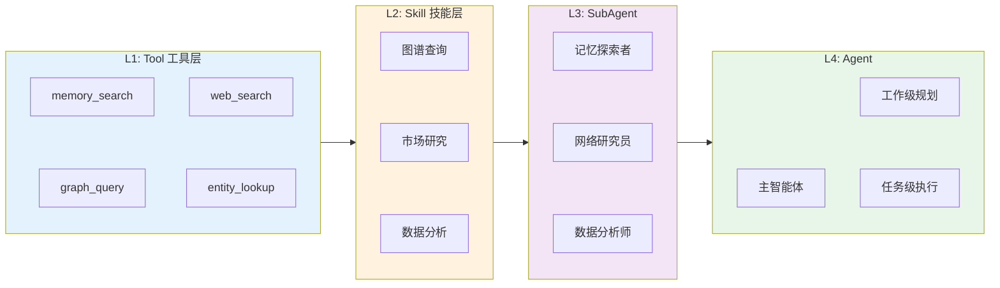
```mermaid
graph LR
    subgraph L1["L1: Tool 工具层"]
        direction TB
        T1[memory_search] ~~~ T2[graph_query]
        T3[web_search] ~~~ T4[entity_lookup]
    end

    subgraph L2["L2: Skill 技能层"]
        direction TB
        S1[图谱查询] ~~~ S2[市场研究] ~~~ S3[数据分析]
    end

    subgraph L3["L3: SubAgent"]
        direction TB
        SA1[记忆探索者] ~~~ SA2[网络研究员] ~~~ SA3[数据分析师]
    end

    subgraph L4["L4: Agent"]
        direction TB
        A1[主智能体]
        A1_Plan[工作级规划] ~~~ A1_Exec[任务级执行]
    end

    L1 --> L2 --> L3 --> L4

    style L1 fill:#e3f2fd
    style L2 fill:#fff3e0
    style L3 fill:#f3e5f5
    style L4 fill:#e8f5e9
```

**说明**:

- **L1 (Tool)**: 原子能力单元，执行具体操作
- **L2 (Skill)**: 知识封装，指导工具使用
- **L3 (SubAgent)**: 专业智能体，具备领域能力
- **L4 (Agent)**: 完整智能体，多层思考与规划

---

## 2. 整体架构

### 2.1 分层架构图

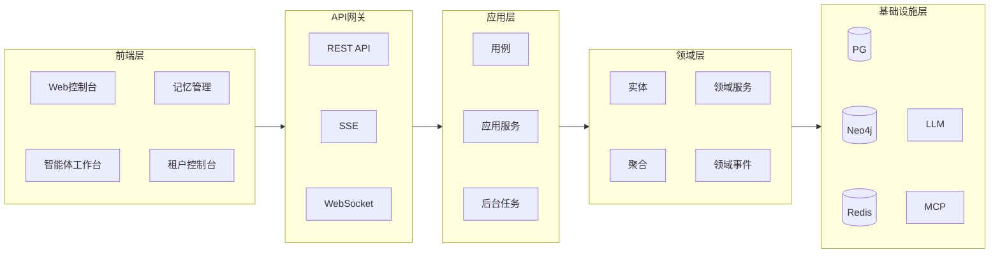
```mermaid
graph LR
    subgraph Frontend["前端层"]
        direction TB
        Web[Web控制台] ~~~ Agent[智能体工作台]
        Memory[记忆管理] ~~~ Tenant[租户控制台]
    end

    subgraph Gateway["API网关"]
        direction TB
        API[REST API] ~~~ SSE[SSE] ~~~ WS[WebSocket]
    end

    subgraph Application["应用层"]
        direction TB
        UC[用例] ~~~ AS[应用服务] ~~~ Tasks[后台任务]
    end

    subgraph Domain["领域层"]
        direction TB
        Entities[实体] ~~~ Aggregates[聚合]
        DomainServices[领域服务] ~~~ DomainEvents[领域事件]
    end

    subgraph Infrastructure["基础设施层"]
        direction TB
        PG[(PG)] ~~~ Neo[(Neo4j)] ~~~ Redis[(Redis)]
        LLM[LLM] ~~~ MCP[MCP]
    end

    Frontend --> Gateway --> Application --> Domain --> Infrastructure
```

### 2.2 项目结构

```
src/
├── domain/                      # 领域层 - 核心业务逻辑
│   ├── model/                   # 领域模型
│   │   ├── agent/              # 智能体相关实体
│   │   │   ├── conversation.py     # 对话
│   │   │   ├── message.py          # 消息
│   │   │   ├── agent_execution.py  # 执行记录
│   │   │   ├── work_plan.py        # 工作计划
│   │   │   ├── plan_step.py        # 计划步骤
│   │   │   ├── interaction_pattern.py # 交互模式
│   │   │   ├── tool_composition.py # 工具组合
│   │   │   └── tenant_agent_config.py # 租户配置
│   │   ├── memory/             # 记忆相关实体
│   │   ├── project/            # 项目相关实体
│   │   └── tenant/             # 租户相关实体
│   ├── ports/                   # 端口定义
│   │   ├── repositories/       # 仓储接口
│   │   └── services/           # 服务接口
│   └── events/                  # 领域事件
│
├── application/                 # 应用层 - 用例编排
│   ├── use_cases/              # 用例实现
│   │   └── agent/              # 智能体用例
│   │       ├── plan_work.py        # 工作规划
│   │       ├── execute_step.py     # 步骤执行
│   │       ├── compose_tools.py    # 工具组合
│   │       ├── find_similar_pattern.py # 模式查找
│   │       └── synthesize_results.py   # 结果综合
│   ├── services/               # 应用服务
│   └── schemas/                # 数据模式
│
├── infrastructure/              # 基础设施层 - 外部实现
│   ├── adapters/               # 适配器
│   │   ├── primary/            # 主适配器 (API)
│   │   │   └── web/routers/    # FastAPI 路由
│   │   └── secondary/          # 次适配器 (持久化/外部服务)
│   │       ├── persistence/    # 数据库实现
│   │       └── temporal/       # Temporal.io 工作流
│   │           ├── adapter.py          # Temporal 适配器
│   │           ├── client.py           # Temporal 客户端
│   │           ├── worker_state.py     # Worker 生命周期
│   │           ├── workflows/          # 工作流定义
│   │           │   ├── episode.py      # Episode 处理工作流
│   │           │   ├── entity.py       # Entity 提取工作流
│   │           │   ├── community.py    # Community 更新工作流
│   │           │   └── agent.py        # Agent 执行工作流
│   │           └── activities/         # Activity 实现
│   │               ├── episode.py      # Episode 相关活动
│   │               ├── entity.py       # Entity 提取活动
│   │               ├── community.py    # Community 检测活动
│   │               └── agent.py        # Agent 执行活动
│   ├── agent/                  # 智能体基础设施
│   │   ├── core/               # 自研 ReAct 核心
│   │   │   ├── react_agent.py      # ReAct Agent 主类
│   │   │   ├── processor.py        # SessionProcessor 核心循环
│   │   │   ├── llm_stream.py       # LLM 流式接口
│   │   │   ├── events.py           # SSE 事件定义
│   │   │   ├── skill_executor.py   # L2 技能执行
│   │   │   └── subagent_router.py  # L3 子智能体路由
│   │   ├── context/            # 上下文管理
│   │   │   └── window_manager.py   # 上下文窗口管理器
│   │   ├── permission/         # 权限管理
│   │   ├── doom_loop/          # Doom Loop 检测
│   │   ├── cost/               # 成本追踪
│   │   ├── retry/              # 智能重试
│   │   ├── tools/              # 工具实现
│   │   │   ├── memory_search.py
│   │   │   ├── memory_create.py
│   │   │   ├── graph_query.py
│   │   │   ├── entity_lookup.py
│   │   │   ├── episode_retrieval.py
│   │   │   ├── summary.py
│   │   │   ├── web_search.py
│   │   │   ├── web_scrape.py
│   │   │   ├── clarification.py
│   │   │   └── decision.py
│   │   └── output/             # 输出处理
│   ├── graph/                   # 知识图谱系统 (Native Graph Adapter)
│   │   ├── native_graph_adapter.py  # 主适配器
│   │   ├── neo4j_client.py          # Neo4j 驱动封装
│   │   ├── schemas.py               # 节点/边数据模型
│   │   ├── extraction/              # 实体/关系抽取
│   │   ├── embedding/               # 向量嵌入服务
│   │   ├── search/                  # 混合检索
│   │   └── community/               # 社区检测
│   ├── llm/                    # LLM 客户端
│   └── persistence/            # 持久化
│
├── configuration/               # 配置
│   ├── config.py               # 配置管理
│   └── container.py            # 依赖注入
│
└── worker.py                    # 后台任务工作进程

web/                             # 前端 (React)
├── src/
│   ├── pages/                  # 页面组件
│   │   ├── project/            # 项目页面
│   │   │   └── AgentChat.tsx   # 智能体聊天
│   │   └── tenant/             # 租户页面
│   ├── components/             # 通用组件
│   │   └── agent/              # 智能体组件
│   ├── stores/                 # Zustand 状态管理
│   └── services/               # API 服务
```

---

## 3. 技术栈

### 3.1 后端

| 技术                 | 版本   | 用途                          |
| -------------------- | ------ | ----------------------------- |
| Python               | 3.12+  | 主开发语言                    |
| FastAPI              | 0.110+ | Web 框架                      |
| Temporal.io          | -      | 企业级工作流编排引擎          |
| ReAct Core           | 自研   | 智能体推理引擎                |
| Native Graph Adapter | 自研   | 知识图谱引擎（替代 Graphiti） |
| LangChain            | 0.3+   | LLM 工具链（非智能体框架）    |
| LiteLLM              | 1.0+   | 多 LLM 提供商抽象             |
| PostgreSQL           | 16+    | 关系数据库                    |
| Neo4j                | 5.26+  | 图数据库                      |
| Redis                | 7+     | 缓存                          |

### 3.2 前端

| 技术       | 版本  | 用途      |
| ---------- | ----- | --------- |
| React      | 19.2+ | UI 框架   |
| TypeScript | 5.9+  | 类型安全  |
| Vite       | 6.3+  | 构建工具  |
| Ant Design | 6.1+  | UI 组件库 |
| Zustand    | 5.0+  | 状态管理  |

### 3.3 LLM 支持

| 提供商         | 模型                | 用途     |
| -------------- | ------------------- | -------- |
| 阿里云通义千问 | Qwen-Turbo/Plus/Max | 主力模型 |
| Google Gemini  | Gemini Pro          | 备选模型 |
| Deepseek       | Deepseek-Chat       | 成本优化 |

---

## 4. 领域模型

### 4.1 核心实体关系

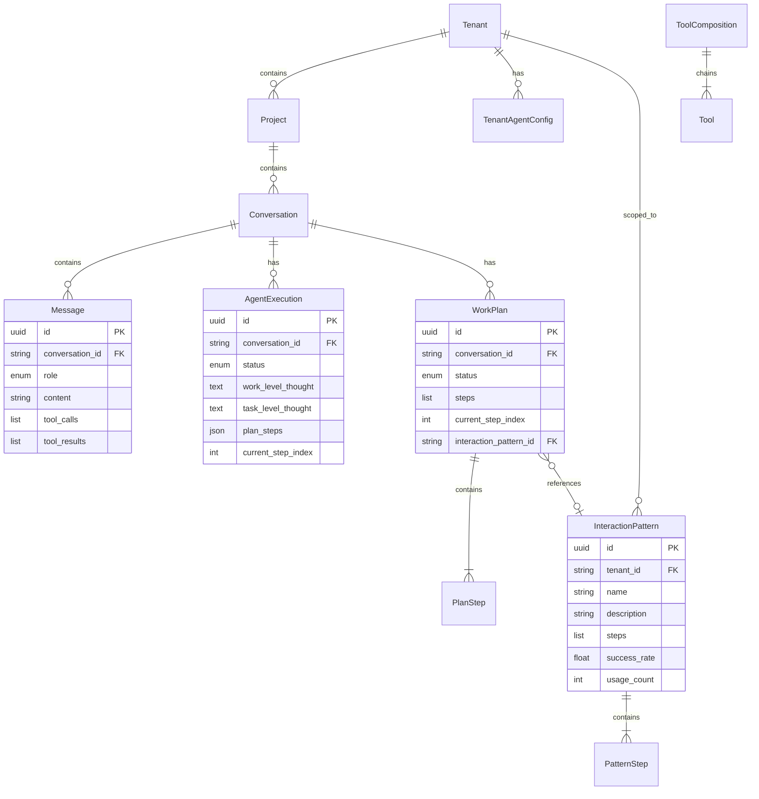
```mermaid
erDiagram
    Tenant ||--o{ Project : contains
    Tenant ||--o{ TenantAgentConfig : has

    Project ||--o{ Conversation : contains

    Conversation ||--o{ Message : contains
    Conversation ||--o{ AgentExecution : has
    Conversation ||--o{ WorkPlan : has

    WorkPlan ||--|{ PlanStep : contains
    WorkPlan }o--o| InteractionPattern : references

    InteractionPattern ||--|{ PatternStep : contains
    InteractionPattern }o--|| Tenant : scoped_to

    ToolComposition ||--|{ Tool : chains

    Message {
        uuid id PK
        string conversation_id FK
        enum role
        string content
        list tool_calls
        list tool_results
    }

    AgentExecution {
        uuid id PK
        string conversation_id FK
        enum status
        text work_level_thought
        text task_level_thought
        json plan_steps
        int current_step_index
    }

    WorkPlan {
        uuid id PK
        string conversation_id FK
        enum status
        list steps
        int current_step_index
        string interaction_pattern_id FK
    }

    InteractionPattern {
        uuid id PK
        string tenant_id FK
        string name
        string description
        list steps
        float success_rate
        int usage_count
    }
```

### 4.2 智能体领域模型

#### 4.2.1 WorkPlan (工作计划)

```python
@dataclass(kw_only=True)
class WorkPlan(Entity):
    """复杂查询的工作级计划"""
    conversation_id: str
    status: PlanStatus  # PLANNING | IN_PROGRESS | COMPLETED | FAILED | TIMEOUT | FALLBACK
    steps: list[PlanStep]
    current_step_index: int = 0
    interaction_pattern_id: str | None = None
    created_at: datetime
    updated_at: datetime | None = None
```

#### 4.2.2 PlanStep (计划步骤)

```python
@dataclass(frozen=True)
class PlanStep:
    """工作计划中的单个步骤（值对象）"""
    step_number: int
    description: str
    thought_prompt: str
    required_tools: list[str]
    expected_output: str
    dependencies: list[int] = field(default_factory=list)
    status: StepStatus = StepStatus.PENDING
    result: str | None = None
    execution_time_ms: int | None = None
```

#### 4.2.3 InteractionPattern (交互模式)

```python
@dataclass
class InteractionPattern:
    """从人机交互中沉淀的行为模式"""
    id: str
    tenant_id: str          # 租户范围隔离
    name: str
    description: str
    steps: List[PatternStep]
    success_rate: float     # 0-1
    usage_count: int
    created_at: datetime
    updated_at: datetime
    metadata: Optional[Dict[str, Any]] = None
```

---

## 5. 智能体系统

### 5.1 ReAct 智能体架构

Vanus 的智能体基于 **ReAct (Reasoning + Acting)** 模式，使用**自研核心**实现（替代 LangGraph）。

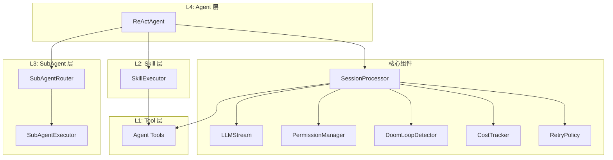
```mermaid
graph TB
    subgraph L4["L4: Agent 层"]
        ReAct[ReActAgent]
    end

    subgraph L3["L3: SubAgent 层"]
        Router[SubAgentRouter]
        Executor[SubAgentExecutor]
    end

    subgraph L2["L2: Skill 层"]
        SkillExec[SkillExecutor]
    end

    subgraph L1["L1: Tool 层"]
        Tools[Agent Tools]
    end

    subgraph Core["核心组件"]
        Processor[SessionProcessor]
        LLMStream[LLMStream]
        Permission[PermissionManager]
        DoomLoop[DoomLoopDetector]
        Cost[CostTracker]
        Retry[RetryPolicy]
    end

    ReAct --> Router
    ReAct --> SkillExec
    ReAct --> Processor

    Router --> Executor
    SkillExec --> Tools

    Processor --> LLMStream
    Processor --> Permission
    Processor --> DoomLoop
    Processor --> Cost
    Processor --> Retry
    Processor --> Tools
```

#### 核心组件说明

| 组件                  | 文件                      | 职责                                     |
| --------------------- | ------------------------- | ---------------------------------------- |
| **ReActAgent**        | `core/react_agent.py`     | 主入口，协调 L2/L3 层和 SessionProcessor |
| **SessionProcessor**  | `core/processor.py`       | ReAct 推理循环核心                       |
| **LLMStream**         | `core/llm_stream.py`      | LiteLLM 流式接口，支持多提供商           |
| **PermissionManager** | `permission/manager.py`   | Allow/Deny/Ask 三级权限控制              |
| **DoomLoopDetector**  | `doom_loop/detector.py`   | 检测重复工具调用模式                     |
| **CostTracker**       | `cost/tracker.py`         | 实时 Token 和成本计算                    |
| **RetryPolicy**       | `retry/policy.py`         | 指数退避重试策略                         |
| **SkillExecutor**     | `core/skill_executor.py`  | L2 技能匹配和执行                        |
| **SubAgentRouter**    | `core/subagent_router.py` | L3 子智能体路由                          |

### 5.2 上下文窗口管理

#### 5.2.1 概述

上下文窗口管理是 Agent 系统的关键组件，负责在有限的模型上下文长度内智能地管理对话历史。参考 OpenCode 的 Prune + Compaction 双层压缩策略，针对 Web 应用场景进行了优化。

**核心特性**：

| 特性 | 描述 |
|------|------|
| **动态上下文窗口** | 根据模型配置动态调整上下文大小 |
| **查询时压缩** | 不修改数据库，只在查询时动态压缩 |
| **双层压缩策略** | 支持 truncate（截断）和 summarize（摘要）两种策略 |
| **实时反馈** | 通过 WebSocket 发送 `context_compressed` 事件通知前端 |
| **Token 预算分配** | 系统提示、历史消息、近期消息、输出预留的精细化分配 |

#### 5.2.2 模块架构

```
src/infrastructure/agent/
├── context/                        # 上下文窗口管理
│   ├── __init__.py
│   └── window_manager.py            # 核心：ContextWindowManager
├── session/                        # 会话压缩模块
│   ├── __init__.py
│   └── compaction.py                # 核心：isOverflow/pruneToolOutputs
```

**相关文件**：

| 文件 | 职责 |
|------|------|
| `src/domain/llm_providers/models.py` | ModelMetadata、ProviderModelsConfig 模型定义 |
| `src/application/services/provider_service.py` | get_model_context_length()、get_model_max_output() 方法 |
| `src/infrastructure/agent/core/events.py` | CONTEXT_COMPRESSED 事件类型 |
| `src/infrastructure/agent/core/react_agent.py` | ContextWindowManager 集成 |

#### 5.2.3 Token 预算分配

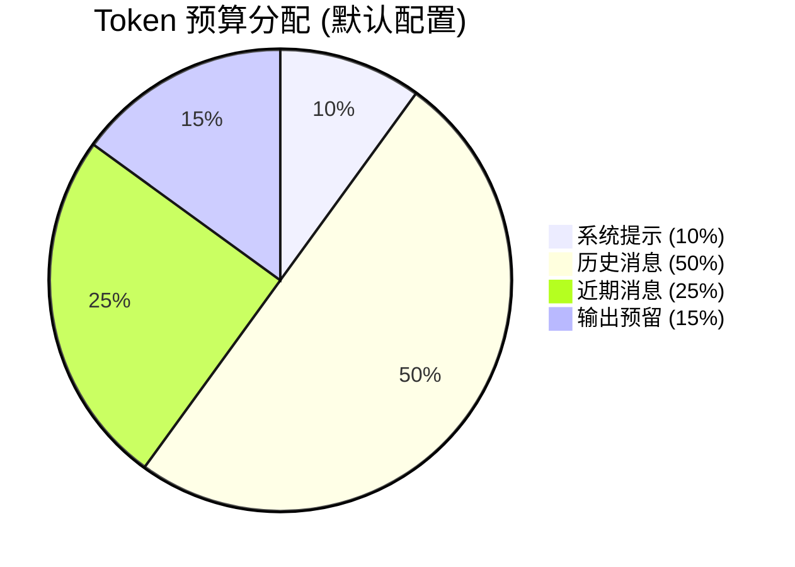
```mermaid
pie title Token 预算分配 (默认配置)
    "系统提示 (10%)" : 10
    "历史消息 (50%)" : 50
    "近期消息 (25%)" : 25
    "输出预留 (15%)" : 15
```

**配置参数**：

| 参数 | 默认值 | 描述 |
|------|--------|------|
| `max_context_tokens` | 128000 | 模型最大上下文长度 |
| `max_output_tokens` | 4096 | 模型最大输出长度 |
| `system_budget_pct` | 0.10 | 系统提示预算占比 |
| `history_budget_pct` | 0.50 | 历史消息预算占比 |
| `recent_budget_pct` | 0.25 | 近期消息预算占比 |
| `output_reserve_pct` | 0.15 | 输出预留占比 |
| `compression_trigger_pct` | 0.80 | 压缩触发阈值 |
| `summary_max_tokens` | 500 | 摘要最大 Token 数 |

#### 5.2.4 压缩流程

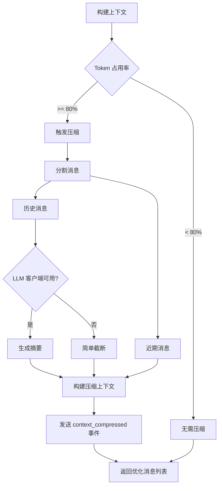
```mermaid
flowchart TD
    A[构建上下文] --> B{Token 占用率}
    B -->|< 80%| C[无需压缩]
    B -->|>= 80%| D[触发压缩]
    
    D --> E[分割消息]
    E --> F[历史消息]
    E --> G[近期消息]
    
    F --> H{LLM 客户端可用?}
    H -->|是| I[生成摘要]
    H -->|否| J[简单截断]
    
    I --> K[构建压缩上下文]
    J --> K
    G --> K
    
    K --> L[发送 context_compressed 事件]
    L --> M[返回优化消息列表]
    C --> M
```

#### 5.2.5 压缩策略

| 策略 | 触发条件 | 行为 |
|------|----------|------|
| **NONE** | 占用率 < 80% | 保留所有消息 |
| **TRUNCATE** | 占用率 >= 80%，无 LLM | 截断早期消息 |
| **SUMMARIZE** | 占用率 >= 80%，有 LLM | 对早期消息生成摘要 |

**摘要生成 Prompt**：

```
Please provide a concise summary of the following conversation history.
Focus on:
1. Key decisions and conclusions made
2. Important context and constraints mentioned
3. Current state of the task/discussion

Keep the summary under {summary_max_tokens} tokens.
```

#### 5.2.6 Token 估算

系统使用字符级别的 Token 估算（支持中英文混合）：

```python
# 语言检测
cjk_ratio = count_cjk_chars(text) / len(text)

if cjk_ratio > 0.3:      # 主要中文
    chars_per_token = 2.0
elif cjk_ratio > 0.1:    # 中英混合
    chars_per_token = 3.0
else:                    # 主要英文
    chars_per_token = 4.0

estimated_tokens = len(text) / chars_per_token
```

#### 5.2.7 模型元数据配置

模型上下文长度和输出限制通过配置化管理：

```python
# src/domain/llm_providers/models.py

class ModelMetadata(BaseModel):
    """模型能力元数据"""
    name: str                           # 模型标识符
    context_length: int = 128000        # 最大上下文长度
    max_output_tokens: int = 4096       # 最大输出 Token
    input_cost_per_1m: float | None     # 输入成本 (USD/1M tokens)
    output_cost_per_1m: float | None    # 输出成本 (USD/1M tokens)
    capabilities: List[ModelCapability] # 模型能力列表
    supports_streaming: bool = True     # 是否支持流式
    supports_json_mode: bool = False    # 是否支持 JSON 模式
```

**预置模型配置**：

| 模型 | 上下文长度 | 最大输出 |
|------|-----------|---------|
| gpt-4-turbo | 128,000 | 4,096 |
| gpt-4o | 128,000 | 16,384 |
| gemini-2.0-flash | 1,048,576 | 8,192 |
| gemini-1.5-pro | 2,097,152 | 8,192 |
| qwen-max | 32,000 | 8,192 |
| qwen-plus | 131,072 | 8,192 |
| deepseek-chat | 64,000 | 8,192 |
| claude-3-5-sonnet | 200,000 | 8,192 |

#### 5.2.8 WebSocket 事件

**事件类型**：`context_compressed`

**事件数据**：

```json
{
  "type": "context_compressed",
  "data": {
    "was_compressed": true,
    "compression_strategy": "summarize",
    "original_message_count": 50,
    "final_message_count": 12,
    "estimated_tokens": 45000,
    "token_budget": 108000,
    "budget_utilization_pct": 41.67,
    "summarized_message_count": 38
  },
  "timestamp": "2026-01-21T10:00:00Z",
  "conversation_id": "uuid"
}
```

**前端状态管理**：

```typescript
// web/src/stores/agent.ts
interface AgentState {
  contextCompressionInfo: {
    wasCompressed: boolean;
    compressionStrategy: "none" | "truncate" | "summarize";
    originalMessageCount: number;
    finalMessageCount: number;
    estimatedTokens: number;
    tokenBudget: number;
    budgetUtilizationPct: number;
    summarizedMessageCount: number;
  } | null;
}
```

#### 5.2.9 与 OpenCode 的对比

| 特性 | OpenCode | Vanus |
|------|----------|-------|
| 架构 | CLI 单用户 | Web 多租户 |
| 压缩时机 | 写入时持久化 | 查询时动态计算 |
| 数据修改 | 修改数据库 | 不修改原始数据 |
| 消息结构 | MessageV2 三层 | OpenAI 标准格式 |
| 上下文存储 | AsyncLocalStorage | 会话级别 |
| 通知机制 | 终端输出 | WebSocket 事件 |

#### 5.2.10 上下文压缩模块（ContextCompaction）

参考 vendor/opencode 实现，提供 Token 溢出检测和工具输出裁剪能力。

**核心功能**：

| 功能 | 描述 |
|------|------|
| **isOverflow** | 检测 Token 是否超过可用上下文窗口 |
| **pruneToolOutputs** | 裁剪旧工具输出以节省 Token（保护最近 2 轮对话） |
| **shouldCompact** | 基于阈值判断是否需要压缩 |
| **summarizeMessages** | LLM 驱动的消息摘要生成 |

**模块结构**：

```
src/infrastructure/agent/session/
├── __init__.py                    # 模块导出
└── compaction.py                  # 核心：isOverflow/pruneToolOutputs
```

**关键常量**（对齐 vendor/opencode）：

| 常量 | 值 | 描述 |
|------|-----|------|
| `PRUNE_MINIMUM_TOKENS` | 20,000 | 最小裁剪阈值（Token） |
| `PRUNE_PROTECT_TOKENS` | 40,000 | 保护阈值（最近 40K Token 的工具调用） |
| `PRUNE_PROTECTED_TOOLS` | `{"skill"}` | 永不裁剪的工具列表 |
| `OUTPUT_TOKEN_MAX` | 8,192 | 默认最大输出 Token |

**isOverflow 逻辑**：

```python
def is_overflow(
    tokens: TokenCount,
    model_limits: ModelLimits,
    auto_compaction_enabled: bool = True,
) -> bool:
    # 计算 Token 总数
    total = tokens.input + tokens.output + tokens.cache_read

    # 计算可用上下文（考虑输出预留）
    output_budget = min(model_limits.output, OUTPUT_TOKEN_MAX)
    usable = model_limits.input or (model_limits.context - output_budget)

    # 检测是否溢出
    return total >= usable
```

**pruneToolOutputs 策略**：

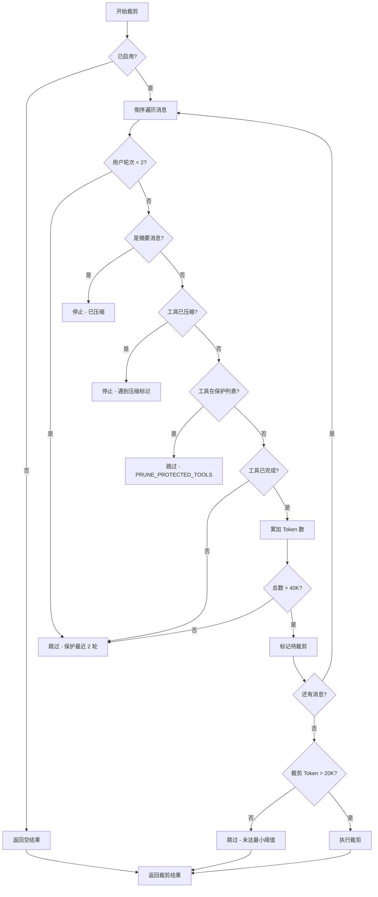
```mermaid
flowchart TD
    A[开始裁剪] --> B{已启用?}
    B -->|否| C[返回空结果]
    B -->|是| D[倒序遍历消息]

    D --> E{用户轮次 < 2?}
    E -->|是| F[跳过 - 保护最近 2 轮]
    E -->|否| G{是摘要消息?}
    G -->|是| H[停止 - 已压缩]
    G -->|否| I{工具已压缩?}
    I -->|是| J[停止 - 遇到压缩标记]
    I -->|否| K{工具在保护列表?}
    K -->|是| L[跳过 - PRUNE_PROTECTED_TOOLS]
    K -->|否| M{工具已完成?}
    M -->|否| F
    M -->|是| N[累加 Token 数]

    N --> O{总数 > 40K?}
    O -->|否| F
    O -->|是| P[标记待裁剪]

    P --> Q{还有消息?}
    Q -->|是| D
    Q -->|否| R{裁剪 Token > 20K?}
    R -->|否| S[跳过 - 未达最小阈值]
    R -->|是| T[执行裁剪]

    T --> U[返回裁剪结果]
    S --> U
    C --> U
```

**与 ContextWindowManager 集成**：

```python
# ContextWindowManager 新增方法
def is_overflow(messages, model_limits=None) -> bool:
    """检查上下文是否溢出"""
    limits = model_limits or ModelLimits(
        context=self.config.max_context_tokens,
        input=0,  # 从 context - output 推导
        output=self.config.max_output_tokens,
    )
    tokens = self.get_token_count(messages)
    return is_overflow(tokens, limits)

def should_compact(messages, threshold=0.8) -> bool:
    """检查是否需要压缩"""
    limits = ModelLimits(
        context=self.config.max_context_tokens,
        input=0,
        output=self.config.max_output_tokens,
    )
    tokens = self.get_token_count(messages)
    return should_compact(tokens, limits, threshold)
```

**单元测试覆盖**（41 个测试）：

- `test_compaction.py`: 41 个测试
  - `TestTokenCount`: Token 计数测试
  - `TestModelLimits`: 模型限制测试
  - `TestEstimateTokens`: Token 估算测试
  - `TestCalculateUsableContext`: 可用上下文计算测试
  - `TestIsOverflow`: 溢出检测测试
  - `TestShouldCompact`: 压缩触发测试
  - `TestPruneToolOutputs`: 工具输出裁剪测试
  - `TestCompactionResult`: 压缩结果测试
  - `TestConstants`: 常量测试

- `test_context_window_manager.py`: 32 个测试（新增 8 个集成测试）
  - `TestCompactionIntegration`: ContextWindowManager 与 Compaction 集成测试

### 5.3 核心状态定义

```python
# SessionProcessor 状态枚举
class ProcessorState(str, Enum):
    IDLE = "idle"                     # 空闲
    THINKING = "thinking"             # 思考中
    ACTING = "acting"                 # 执行工具
    OBSERVING = "observing"           # 观察结果
    WAITING_PERMISSION = "waiting_permission"  # 等待权限
    RETRYING = "retrying"             # 重试中
    COMPLETED = "completed"           # 完成
    ERROR = "error"                   # 错误


# SSE 事件类型
class SSEEventType(str, Enum):
    # 状态事件
    START = "start"
    COMPLETE = "complete"
    ERROR = "error"

    # 思考事件
    THOUGHT = "thought"
    THOUGHT_DELTA = "thought_delta"

    # 工作计划事件
    WORK_PLAN = "work_plan"
    STEP_START = "step_start"
    STEP_END = "step_end"

    # 工具事件
    ACT = "act"
    OBSERVE = "observe"

    # 权限事件
    PERMISSION_ASKED = "permission_asked"
    PERMISSION_REPLIED = "permission_replied"

    # Doom Loop 事件
    DOOM_LOOP_DETECTED = "doom_loop_detected"

    # 人机交互事件
    CLARIFICATION_ASKED = "clarification_asked"
    DECISION_ASKED = "decision_asked"

    # 成本事件
    COST_UPDATE = "cost_update"
    STEP_FINISH = "step_finish"
```

### 5.3 执行流程

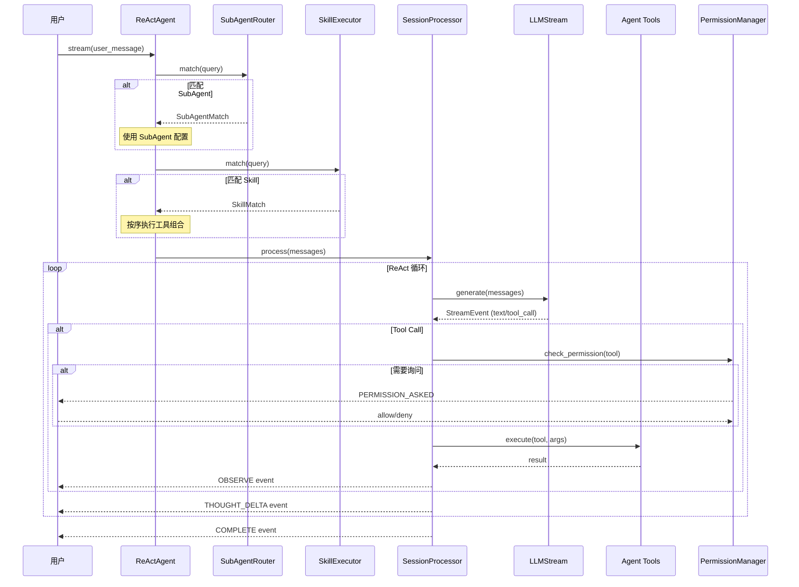
```mermaid
sequenceDiagram
    participant User as 用户
    participant Agent as ReActAgent
    participant Router as SubAgentRouter
    participant Skill as SkillExecutor
    participant Proc as SessionProcessor
    participant LLM as LLMStream
    participant Tools as Agent Tools
    participant Perm as PermissionManager

    User->>Agent: stream(user_message)

    Agent->>Router: match(query)
    alt 匹配 SubAgent
        Router-->>Agent: SubAgentMatch
        Note over Agent: 使用 SubAgent 配置
    end

    Agent->>Skill: match(query)
    alt 匹配 Skill
        Skill-->>Agent: SkillMatch
        Note over Agent: 按序执行工具组合
    end

    Agent->>Proc: process(messages)

    loop ReAct 循环
        Proc->>LLM: generate(messages)
        LLM-->>Proc: StreamEvent (text/tool_call)

        alt Tool Call
            Proc->>Perm: check_permission(tool)
            alt 需要询问
                Perm-->>User: PERMISSION_ASKED
                User-->>Perm: allow/deny
            end

            Proc->>Tools: execute(tool, args)
            Tools-->>Proc: result
            Proc-->>User: OBSERVE event
        end

        Proc-->>User: THOUGHT_DELTA event
    end

    Proc-->>User: COMPLETE event
```

---

## 6. 多层思考机制

### 6.1 概述

多层思考是 Vanus 智能体的核心创新，参考 JoyAgent-JDGenie 实现。

| 层级                    | 描述                   | 触发条件           |
| ----------------------- | ---------------------- | ------------------ |
| **工作级 (Work-Level)** | 高层计划，分解复杂任务 | 复杂查询 (6+ 步骤) |
| **任务级 (Task-Level)** | 详细推理，每步执行     | 每个计划步骤       |

### 6.2 查询复杂度分类

```python
class QueryComplexity(Enum):
    SIMPLE = "simple"       # 1-2 步骤，直接回答
    MODERATE = "moderate"   # 3-5 步骤，建议规划
    COMPLEX = "complex"     # 6+ 步骤，必须规划
```

**复杂度检测标准**:

1. 查询长度 > 100 字符
2. 包含多个明确请求 ("和"、"另外"、"还有")
3. 包含分析关键词 ("分析"、"比较"、"综合"、"报告")
4. 跨时间范围 ("Q3 和 Q4"、"过去 6 个月")
5. 跨领域 (引用多种实体类型)

### 6.3 执行流程

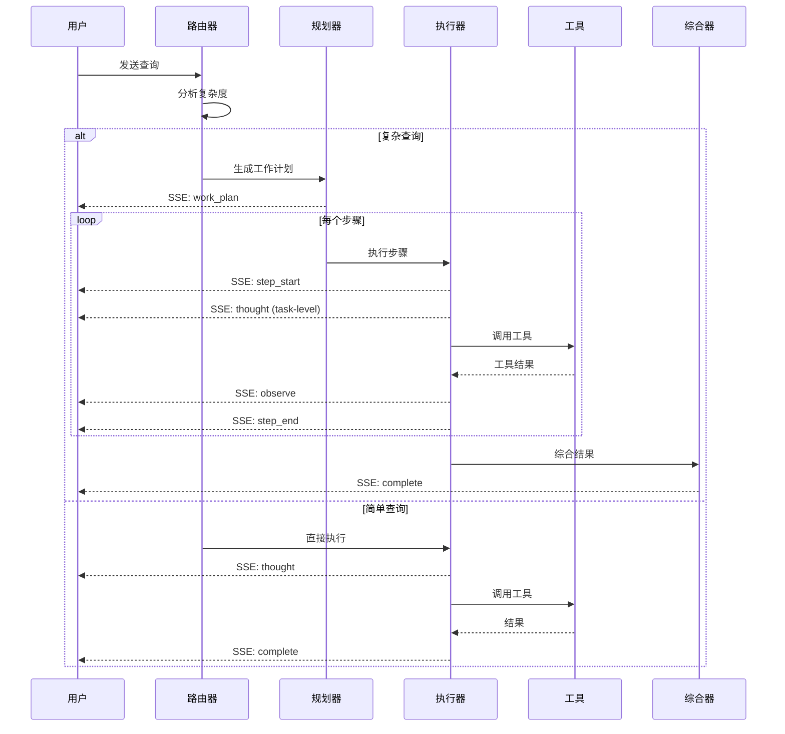
```mermaid
sequenceDiagram
    participant User as 用户
    participant Router as 路由器
    participant Planner as 规划器
    participant Executor as 执行器
    participant Tools as 工具
    participant Synthesizer as 综合器

    User->>Router: 发送查询
    Router->>Router: 分析复杂度

    alt 复杂查询
        Router->>Planner: 生成工作计划
        Planner-->>User: SSE: work_plan

        loop 每个步骤
            Planner->>Executor: 执行步骤
            Executor-->>User: SSE: step_start
            Executor-->>User: SSE: thought (task-level)
            Executor->>Tools: 调用工具
            Tools-->>Executor: 工具结果
            Executor-->>User: SSE: observe
            Executor-->>User: SSE: step_end
        end

        Executor->>Synthesizer: 综合结果
        Synthesizer-->>User: SSE: complete
    else 简单查询
        Router->>Executor: 直接执行
        Executor-->>User: SSE: thought
        Executor->>Tools: 调用工具
        Tools-->>Executor: 结果
        Executor-->>User: SSE: complete
    end
```

### 6.4 人类交互机制

#### 6.4.1 概述

Vanus 智能体支持多层次的人机协作模式，参考 OpenCode 的最佳实践：

| 交互类型     | 阶段       | 目的                   | 工具                |
| ------------ | ---------- | ---------------------- | ------------------- |
| **规划澄清** | 工作级规划 | 澄清需求、确认理解     | `ask_clarification` |
| **执行决策** | 任务级执行 | 关键决策点确认         | `ask_decision`      |
| **权限审批** | 工具调用前 | 安全性控制、防止误操作 | 权限系统            |
| **环循检测** | 执行过程中 | 智能体陷入死循环       | `doom_loop_check`   |

#### 6.4.2 规划阶段的人类澄清

**触发条件**：

- 生成的计划步骤 > 3 步
- 查询包含模糊关键词（"可能"、"大约"、"相关"）
- 智能体对用户意图不确定（置信度 < 80%）

**澄清类型**：

```python
@dataclass(kw_only=True)
class ClarificationQuestion:
    """规划澄清问题"""
    question_type: ClarificationType
    question: str
    options: list[ClarificationOption]
    required: bool = False  # 是否必须回答
    timeout_seconds: int = 60  # 等待超时时间


class ClarificationType(Enum):
    SCOPE = "scope"           # 范围确认："是否需要包含X？"
    APPROACH = "approach"       # 方法确认："使用方法A还是方法B？"
    PREREQUISITE = "prerequisite" # 前置条件："是否已有X？"
    PRIORITY = "priority"     # 优先级："哪个更重要？"


@dataclass(frozen=True)
class ClarificationOption:
    """澄清选项"""
    label: str              # 显示文本（1-5词，简洁）
    description: str       # 选项说明
    is_recommended: bool = False  # 是否为推荐选项
```

**执行流程**：

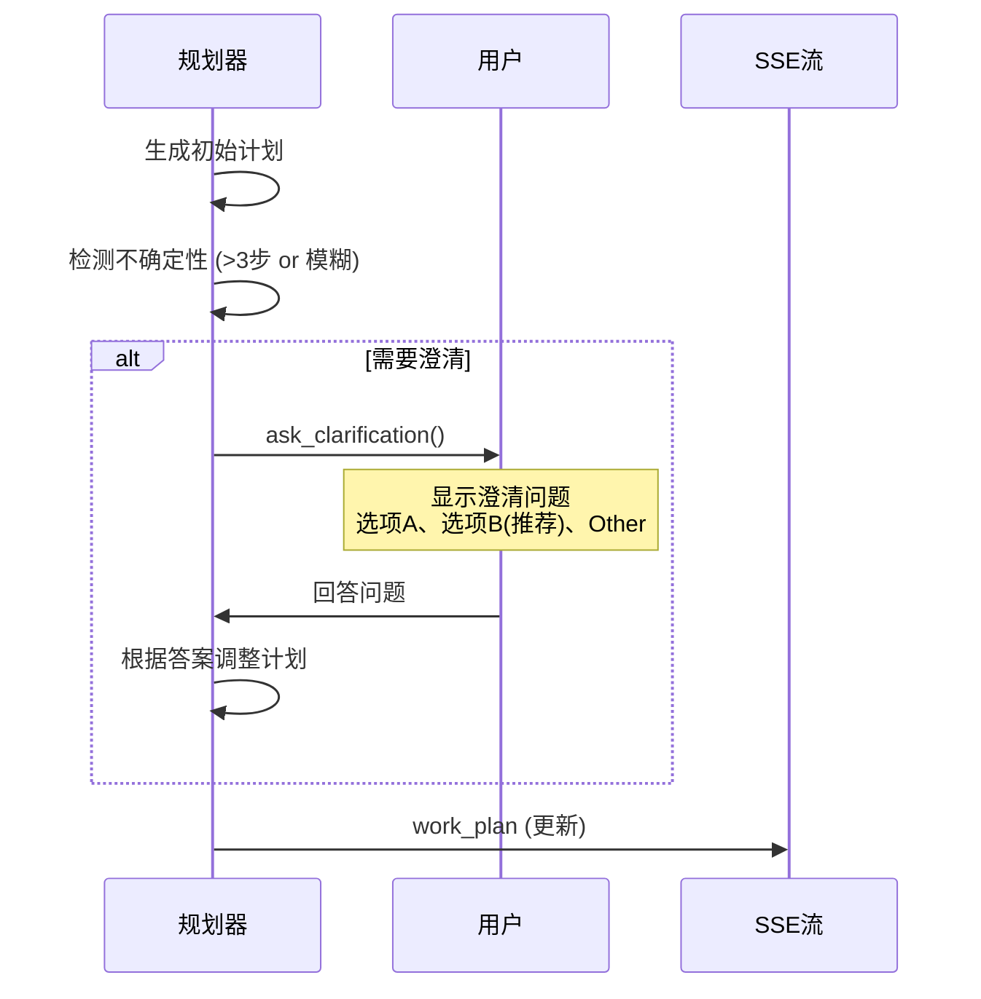
```mermaid
sequenceDiagram
    participant Planner as 规划器
    participant User as 用户
    participant SSE as SSE流

    Planner->>Planner: 生成初始计划
    Planner->>Planner: 检测不确定性 (>3步 or 模糊)

    alt 需要澄清
        Planner->>User: ask_clarification()
        Note over User: 显示澄清问题<br/>选项A、选项B(推荐)、Other
        User->>Planner: 回答问题
        Planner->>Planner: 根据答案调整计划
    end

    Planner->>SSE: work_plan (更新)
```

**SSE 事件**：

```json
{
  "type": "clarification_asked",
  "data": {
    "question_id": "uuid",
    "question": "查询范围是否包括Q3和Q4的数据？",
    "options": [
      {"label": "仅Q4", "description": "最近季度数据", "is_recommended": false},
      {"label": "Q3和Q4", "description": "季度对比分析", "is_recommended": true}
    ],
    "required": true,
    "timeout": 60
  },
  "timestamp": "2026-01-15T10:00:00Z",
  "conversation_id": "uuid"
}

{
  "type": "clarification_answered",
  "data": {
    "question_id": "uuid",
    "answer": "Q3和Q4"
  },
  "timestamp": "2026-01-15T10:00:05Z"
}
```

#### 6.4.3 执行阶段的人类决策

**触发条件**：

- 执行到关键决策点（分支选择、方法选择）
- 需要确认的操作（数据删除、重要配置修改）
- 检测到潜在风险（数据量过大、执行时间过长）
- 用户明确配置要求确认的步骤类型

**决策类型**：

```python
@dataclass(kw_only=True)
class DecisionPoint:
    """决策点"""
    decision_type: DecisionType
    context: str              # 决策上下文
    options: list[DecisionOption]
    allow_multiple: bool = False
    timeout_seconds: int = 300


class DecisionType(Enum):
    BRANCH = "branch"         # 分支选择
    METHOD = "method"         # 方法选择
    CONFIRMATION = "confirmation" # 确认操作
    RISK_ACCEPTANCE = "risk"   # 风险接受
    CUSTOM = "custom"         # 自定义输入


@dataclass(frozen=True)
class DecisionOption:
    """决策选项"""
    label: str
    description: str
    estimated_duration_ms: int | None = None  # 预估时间
    resource_usage: dict | None = None         # 资源使用预估
    is_recommended: bool = False
```

**执行流程**：

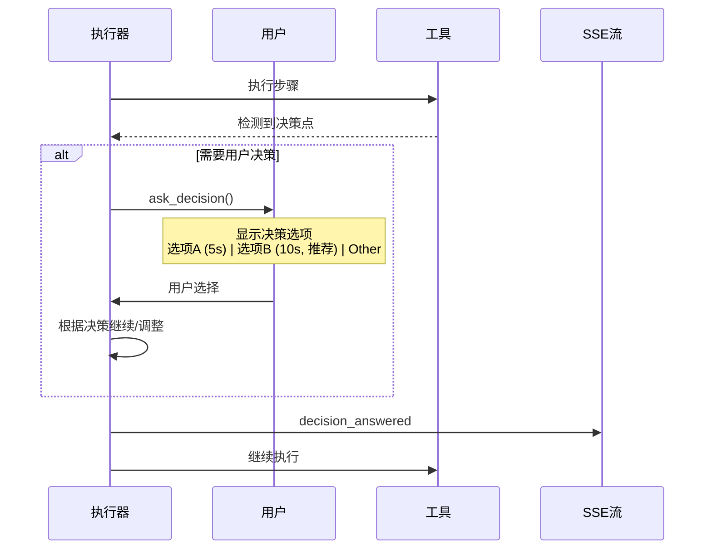
```mermaid
sequenceDiagram
    participant Executor as 执行器
    participant User as 用户
    participant Tool as 工具
    participant SSE as SSE流

    Executor->>Tool: 执行步骤
    Tool-->>Executor: 检测到决策点

    alt 需要用户决策
        Executor->>User: ask_decision()
        Note over User: 显示决策选项<br/>选项A (5s) | 选项B (10s, 推荐) | Other
        User->>Executor: 用户选择
        Executor->>Executor: 根据决策继续/调整
    end

    Executor->>SSE: decision_answered
    Executor->>Tool: 继续执行
```

**SSE 事件**：

```json
{
  "type": "decision_asked",
  "data": {
    "decision_id": "uuid",
    "step_number": 2,
    "context": "检测到数据量 > 1GB，是否继续？",
    "options": [
      {
        "label": "继续 (推荐)",
        "description": "继续执行，预计耗时15分钟",
        "estimated_duration_ms": 900000,
        "is_recommended": true
      },
      {
        "label": "添加过滤",
        "description": "缩小数据范围，预计耗时5分钟",
        "estimated_duration_ms": 300000,
        "is_recommended": false
      }
    ],
    "timeout": 300
  },
  "timestamp": "2026-01-15T10:10:00Z",
  "conversation_id": "uuid"
}
```

#### 6.4.4 环形循环检测与干预

**检测机制**：

```python
@dataclass(kw_only=True)
class DoomLoopDetector:
    """死循环检测器"""
    threshold: int = 3              # 相同调用次数阈值
    time_window_ms: int = 60000    # 60秒时间窗口
    detection_window: deque = field(default_factory=lambda: deque(maxlen=10))

    def should_intervene(self, tool_call: ToolCall) -> bool:
        """判断是否需要干预"""
        recent_calls = [
            c for c in self.detection_window
            if (c.tool_name == tool_call.tool_name and
                c.input == tool_call.input and
                (tool_call.timestamp - c.timestamp) < self.time_window_ms)
        ]

        if len(recent_calls) >= self.threshold:
            return True
        return False
```

**干预流程**：

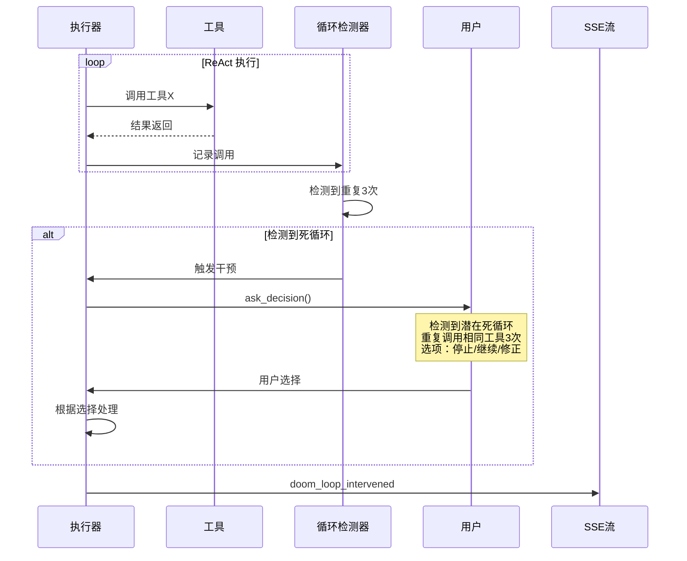
```mermaid
sequenceDiagram
    participant Executor as 执行器
    participant Tool as 工具
    participant Detector as 循环检测器
    participant User as 用户
    participant SSE as SSE流

    loop ReAct 执行
        Executor->>Tool: 调用工具X
        Tool-->>Executor: 结果返回
        Executor->>Detector: 记录调用
    end

    Detector->>Detector: 检测到重复3次

    alt 检测到死循环
        Detector->>Executor: 触发干预
        Executor->>User: ask_decision()
        Note over User: 检测到潜在死循环<br/>重复调用相同工具3次<br/>选项：停止/继续/修正
        User->>Executor: 用户选择
        Executor->>Executor: 根据选择处理
    end

    Executor->>SSE: doom_loop_intervened
```

**干预选项**：

```python
class DoomLoopIntervention(Enum):
    STOP = "stop"              # 停止执行
    CONTINUE = "continue"        # 继续执行
    CORRECT = "correct"        # 修正参数重试
    SKIP = "skip"              # 跳过当前步骤
```

#### 6.4.5 澄清和决策工具

**工具定义**：

```python
class ClarificationTool(AgentTool):
    """规划澄清工具"""

    name: str = "ask_clarification"
    description: str = "向用户提出澄清问题以确认规划理解"

    async def _arun(
        self,
        question_type: ClarificationType,
        question: str,
        options: list[ClarificationOption],
        required: bool = False,
        timeout_seconds: int = 60
    ) -> dict:
        """提出澄清问题"""
        # 通过 SSE 推送到前端
        # 等待用户响应
        # 返回用户答案
        pass


class DecisionTool(AgentTool):
    """执行决策工具"""

    name: str = "ask_decision"
    description: str = "在关键决策点请求用户确认或选择"

    async def _arun(
        self,
        decision_type: DecisionType,
        context: str,
        options: list[DecisionOption],
        allow_multiple: bool = False,
        timeout_seconds: int = 300
    ) -> dict:
        """请求用户决策"""
        # 通过 SSE 推送到前端
        # 等待用户响应
        # 返回用户选择
        pass
```

**使用示例**：

```python
# 在工作级规划中使用
async def generate_work_plan(user_query: str) -> WorkPlan:
    initial_plan = await llm_generate_plan(user_query)

    # 检测不确定性
    if len(initial_plan.steps) > 3 or has_ambiguity(user_query):
        answer = await ClarificationTool._arun(
            question_type=ClarificationType.SCOPE,
            question=f"计划包含 {len(initial_plan.steps)} 步，是否需要添加前置条件检查？",
            options=[
                ClarificationOption(label="按计划执行", description="直接执行生成的计划"),
                ClarificationOption(label="添加检查步骤", description="在主计划前增加验证步骤", is_recommended=True)
            ],
            required=True
        )

        if answer == "添加检查步骤":
            initial_plan = insert_prereq_check(initial_plan)

    return initial_plan


# 在任务级执行中使用
async def execute_step(step: PlanStep) -> StepResult:
    result = step.execute()

    # 检测决策点
    if result.requires_decision():
        choice = await DecisionTool._arun(
            decision_type=DecisionType.METHOD,
            context=f"步骤 {step.step_number}: {result.context}",
            options=[
                DecisionOption(
                    label="方法A",
                    description="快速但精度较低",
                    estimated_duration_ms=5000
                ),
                DecisionOption(
                    label="方法B",
                    description="精确但较慢",
                    estimated_duration_ms=15000,
                    is_recommended=True
                )
            ]
        )
        result = result.apply_decision(choice)

    return result
```

### 6.5 交互经验沉淀

#### 6.5.1 核心理念

**交互经验沉淀**是 Vanus 智能体系统的核心创新之一，其本质是：

> **从人机多轮协作交互中捕捉、提炼并复用人类经验，通过持续优化形成可复用的行为模式。**

**核心机制**：

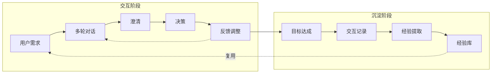
```mermaid
flowchart LR
    subgraph 交互阶段
        A[用户需求] --> B[多轮对话] --> C[澄清] --> D[决策]
        D --> E[反馈调整]
        E -.-> B
    end

    subgraph 沉淀阶段
        F[目标达成] --> G[交互记录] --> H[经验提取] --> I[经验库]
    end

    E --> F
    I -.复用.-> A
```

**三个关键阶段**：

| 阶段            | 描述                                                 | 输出           |
| --------------- | ---------------------------------------------------- | -------------- |
| **1. 交互记录** | 完整记录人机对话、工具调用、决策点、反馈调整的全过程 | 结构化交互轨迹 |
| **2. 经验提取** | 从成功交互中识别关键步骤、决策点、工具组合模式       | 初始行为模式   |
| **3. 模式优化** | 基于复用反馈，持续优化模式的成功率和执行效率         | 成熟行为模式   |

#### 6.5.2 交互轨迹记录

系统记录的完整信息包括：

```python
@dataclass
class InteractionTrace:
    """交互轨迹"""
    conversation_id: str
    user_goal: str                          # 用户目标
    clarifications: list[ClarificationQA]   # 澄清问答
    decisions: list[DecisionPoint]          # 决策点
    plan_steps: list[PlanStep]              # 执行步骤
    tool_calls: list[ToolCall]              # 工具调用序列
    corrections: list[Correction]           # 纠正记录
    final_result: str                       # 最终结果
    success: bool                           # 是否成功
    duration_ms: int                        # 总耗时
    human_intervention_count: int           # 人工干预次数
```

**关键要素**：

- **澄清问答**: 记录用户对需求的澄清和确认
- **决策点**: 记录关键决策及用户选择
- **纠正记录**: 记录智能体错误和人工纠正
- **工具调用序列**: 完整的工具链路

#### 6.5.3 经验提取算法

从成功的交互轨迹中提取行为模式：

```python
def extract_pattern(trace: InteractionTrace) -> InteractionPattern:
    """从交互轨迹中提取行为模式"""

    # 1. 识别任务签名 (任务类型 + 实体类型)
    signature = identify_task_signature(trace.user_goal)

    # 2. 提取关键步骤
    key_steps = []
    for step in trace.plan_steps:
        if step.is_critical():  # 必需步骤
            key_steps.append({
                "description": step.description,
                "tools": step.required_tools,
                "expected_output": step.expected_output,
                "decision_points": extract_decisions(step)
            })

    # 3. 识别工具组合模式
    tool_chains = identify_tool_chains(trace.tool_calls)

    # 4. 提取成功关键因素
    success_factors = {
        "clarifications_needed": len(trace.clarifications),
        "critical_decisions": [d for d in trace.decisions if d.impact == "high"],
        "common_corrections": extract_common_corrections(trace.corrections)
    }

    return InteractionPattern(
        signature=signature,
        name=generate_pattern_name(trace),
        steps=key_steps,
        tool_chains=tool_chains,
        success_factors=success_factors,
        initial_success_rate=1.0
    )
```

#### 6.5.4 经验检索算法

```python
def calculate_similarity(query: str, pattern: InteractionPattern) -> float:
    """计算查询与历史交互经验的相似度"""
    score = 0.0

    # 1. 模式签名匹配 (50%)
    if pattern_signature_match(query, pattern):
        score += 0.50

    # 2. 实体重叠 (20%)
    entity_overlap = calculate_entity_overlap(query, pattern)
    score += entity_overlap * 0.20

    # 3. 时间邻近性 (15%)
    if pattern.updated_at > (now - 7_days):
        score += 0.15

    # 4. 成功率 (15%)
    if pattern.success_rate > 0.8:
        score += 0.15

    return score
```

#### 6.5.5 经验复用流程

当用户提出新需求时，系统自动检索并复用历史经验：

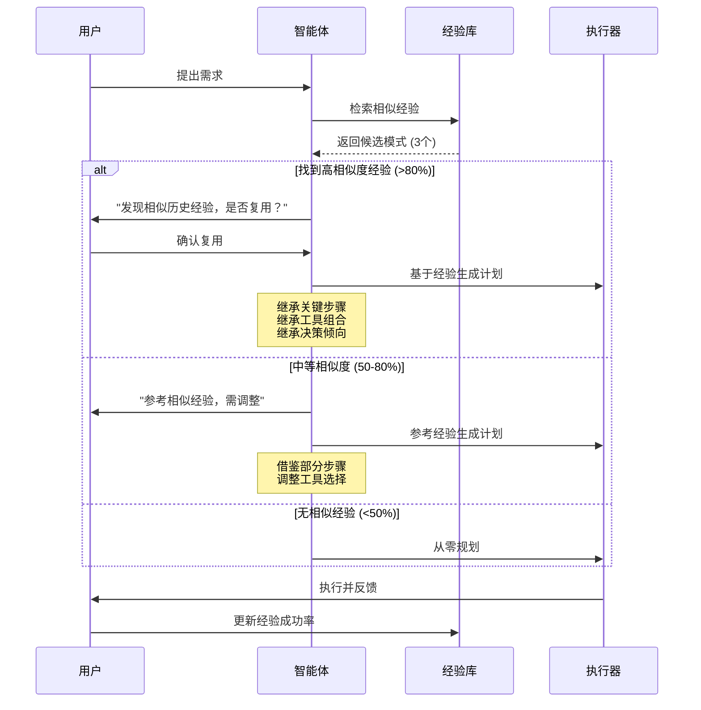
```mermaid
sequenceDiagram
    participant User as 用户
    participant Agent as 智能体
    participant PatternDB as 经验库
    participant Executor as 执行器

    User->>Agent: 提出需求
    Agent->>PatternDB: 检索相似经验
    PatternDB-->>Agent: 返回候选模式 (3个)

    alt 找到高相似度经验 (>80%)
        Agent->>User: "发现相似历史经验，是否复用？"
        User->>Agent: 确认复用
        Agent->>Executor: 基于经验生成计划
        Note over Agent: 继承关键步骤<br/>继承工具组合<br/>继承决策倾向
    else 中等相似度 (50-80%)
        Agent->>User: "参考相似经验，需调整"
        Agent->>Executor: 参考经验生成计划
        Note over Agent: 借鉴部分步骤<br/>调整工具选择
    else 无相似经验 (<50%)
        Agent->>Executor: 从零规划
    end

    Executor->>User: 执行并反馈
    User->>PatternDB: 更新经验成功率
```

#### 6.5.6 经验进化机制

行为模式通过持续反馈不断优化：

```python
class PatternEvolution:
    """经验进化管理器"""

    def update_pattern(
        self,
        pattern_id: str,
        trace: InteractionTrace
    ) -> InteractionPattern:
        """基于新交互更新模式"""
        pattern = self.get_pattern(pattern_id)

        # 1. 更新成功率
        pattern.usage_count += 1
        if trace.success:
            pattern.success_count += 1
            pattern.success_rate = pattern.success_count / pattern.usage_count
        else:
            pattern.failure_count += 1

        # 2. 优化步骤序列
        if trace.corrections:
            pattern.steps = self.optimize_steps(
                pattern.steps,
                trace.corrections
            )

        # 3. 更新决策倾向
        for decision in trace.decisions:
            if decision.user_choice != decision.recommended:
                # 用户选择与推荐不同，更新倾向
                self.update_decision_preference(pattern, decision)

        # 4. 优化工具链
        if trace.duration_ms < pattern.avg_execution_time_ms:
            # 发现更快的工具组合
            pattern.tool_chains = self.merge_tool_chains(
                pattern.tool_chains,
                trace.tool_calls
            )

        # 5. 衰减过时模式
        if pattern.updated_at < (now - 90_days):
            pattern.success_rate *= 0.8  # 新鲜度惩罚

        pattern.updated_at = now
        return pattern
```

**进化策略**：

| 反馈类型     | 优化动作                   | 权重       |
| ------------ | -------------------------- | ---------- |
| **成功执行** | 提升成功率，保留步骤序列   | +1         |
| **用户纠正** | 调整步骤描述，更新工具选择 | 立即应用   |
| **决策偏好** | 更新推荐选项，记录用户倾向 | 累积应用   |
| **执行时间** | 优化工具链，减少冗余步骤   | 逐步应用   |
| **长期未用** | 降低权重，标记为过时       | -20%/90 天 |

#### 6.5.7 经验质量保障

**准入机制**：

- 最少成功次数: 3 次
- 最低成功率: 60%
- 最少使用间隔: 7 天内至少被查询 1 次

**淘汰机制**：

- 连续失败 > 5 次: 标记为"不可信"
- 成功率 < 40%: 降级为"草稿"
- 180 天未使用: 归档
- 被用户明确标记为"无用": 立即删除

#### 6.5.8 隐私与安全

**租户隔离**：

- 每个租户的交互经验完全隔离
- 跨租户经验共享需明确授权

**敏感信息过滤**：

- 自动检测并脱敏 PII（个人身份信息）
- 过滤密钥、密码等敏感数据
- 仅保留业务逻辑和执行模式

**用户控制**：

- 租户级别开关: 是否启用经验沉淀
- 对话级别开关: 是否记录当前交互
- 用户可查看、编辑、删除自己创建的经验

---

## 7. 工具系统

### 7.1 内置工具

| 工具名               | 分类   | 描述                               |
| -------------------- | ------ | ---------------------------------- |
| `memory_search`      | 记忆   | 语义/关键词/混合搜索记忆           |
| `memory_create`      | 记忆   | 创建新记忆条目                     |
| `graph_query`        | 记忆   | Cypher 图查询                      |
| `entity_lookup`      | 记忆   | 实体详情查询                       |
| `episode_retrieval`  | 记忆   | Episode 检索                       |
| `summary`            | 分析   | 内容摘要生成                       |
| `web_search`         | 网络   | 网页搜索                           |
| `web_scrape`         | 网络   | 网页内容抓取                       |
| `file_edit`          | 文件   | 文件编辑（支持多种模糊匹配策略）   |
| `file_write`         | 文件   | 文件创建/覆盖                      |
| `file_multi_edit`    | 文件   | 多次顺序编辑同一文件               |
| `file_glob`          | 文件   | Glob 模式文件搜索                  |
| `file_grep`          | 文件   | 文件内容搜索（支持正则表达式）     |
| `code_executor`      | 执行   | 沙箱化代码执行（Docker 隔离）      |

### 7.2 文件操作工具详解

新增文件操作工具参考 vendor/opencode 实现，提供生产级文件编辑和搜索能力：

#### 7.2.1 FileEditTool - 文件编辑工具

- **功能**: 替换文件中的文本，支持多种模糊匹配策略
- **匹配策略** (按优先级):
  1. Simple - 精确匹配
  2. EscapeNormalized - 处理转义序列 (`\n`, `\t` 等)
  3. LineTrimmed - 忽略每行首尾空格
  4. IndentationFlexible - 忽略缩进级别
  5. WhitespaceNormalized - 标准化所有空白字符
  6. BlockAnchor - 使用首尾行锚点进行模糊匹配
- **特性**:
  - 统一 diff 输出
  - 增加行/删除行统计
  - 换行符保留 (LF/CRLF)
  - `replace_all` 支持替换所有匹配项

#### 7.2.2 FileWriteTool - 文件写入工具

- **功能**: 创建新文件或完全覆盖现有文件
- **特性**:
  - 自动创建父目录
  - 文件大小和行数统计
  - 与 file_edit 配合使用 (部分 vs 全部编辑)

#### 7.2.3 FileMultiEditTool - 多次编辑工具

- **功能**: 对同一文件应用多次顺序编辑
- **特性**:
  - 所有编辑在一个原子操作中完成
  - 任何编辑失败则不修改文件
  - 后续编辑基于前面编辑的结果

#### 7.2.4 FileGlobTool - 文件搜索工具

- **功能**: 使用 Glob 模式查找文件
- **支持模式**:
  - `*` - 任意字符
  - `?` - 单个字符
  - `**/` - 递归目录
  - `[seq]` / `[!seq]` - 字符集匹配
- **特性**:
  - 默认排除 `.git`, `node_modules`, `__pycache__`
  - 结果数量限制 (防止输出溢出)
  - 文件大小显示

#### 7.2.5 FileGrepTool - 内容搜索工具

- **功能**: 在文件中搜索文本模式
- **特性**:
  - 支持正则表达式
  - 文件类型过滤 (`file_pattern`)
  - 大小写不敏感搜索
  - 上下文行显示 (`context_lines`)
  - 自动跳过二进制文件

#### 7.2.6 工具输出截断 (Tool Output Truncation)

参考 vendor/opencode 实现，所有工具输出自动进行字节级截断，防止大文件输出消耗过多 Token：

**截断策略**:
- `MAX_OUTPUT_BYTES = 50 * 1024` (50KB) - 最大输出字节数
- `MAX_LINE_LENGTH = 2000` - 单行最大字符数
- `DEFAULT_READ_LIMIT = 2000` - 默认读取行数

**核心功能**:
1. **字节级截断** (`truncate_by_bytes`):
   - UTF-8 编码感知，正确处理多字节字符
   - 不完整 UTF-8 序列自动处理
   - 返回截断字节数统计

2. **行级截断** (`truncate_lines_by_bytes`):
   - 支持偏移量 (`offset`) 和限制 (`limit`) 分页读取
   - 超长行自动截断并添加 `...` 标记
   - 字节预算控制，超出限制停止处理
   - 输出格式：带行号的文件内容 + 截断提示

3. **AgentTool 集成**:
   - `AgentTool` 基类自动集成截断能力
   - `truncate_output()` 方法自动截断工具输出
   - 可配置 `max_output_bytes` 参数

**截断提示格式**:
```python
# 字节截断
"\n(Output truncated at 50000 bytes. Use 'offset' parameter to read beyond line 100)"

# 还有更多行
"\n(File has more lines. Use 'offset' parameter to read beyond line 100)"

# 文件结束
"\n(End of file - total 100 lines)"
```

**实现文件**:
- `src/infrastructure/agent/tools/truncation.py` - 截断模块
- `src/infrastructure/agent/tools/base.py` - AgentTool 基类集成
- `src/tests/unit/test_truncation.py` - 单元测试 (37 个测试全部通过)

### 7.3 工具定义示例

```python
# src/infrastructure/agent/tools/memory_search.py

class MemorySearchTool(AgentTool):
    """记忆搜索工具"""

    name: str = "memory_search"
    description: str = "使用语义、关键词或混合搜索来搜索记忆"

    args_schema: type[BaseModel] = MemorySearchInput

    class MemorySearchInput(BaseModel):
        query: str = Field(description="搜索查询")
        search_type: str = Field(
            default="hybrid",
            description="搜索类型: semantic | keyword | hybrid"
        )
        limit: int = Field(default=10, description="结果数量限制")

    async def _arun(self, query: str, search_type: str, limit: int) -> str:
        """执行搜索"""
        # 实现搜索逻辑
        ...
```

### 7.4 工具组合 (Tool Composition)

```python
@dataclass
class ToolComposition:
    """工具组合定义"""
    id: str
    name: str
    description: str
    tools: List[str]              # 有序工具列表
    execution_template: Dict      # 执行模板
    fallback_alternatives: Dict   # 备选工具
    success_count: int = 0
    failure_count: int = 0
```

#### 组合规则

1. **顺序组合**: 工具 N 的输出作为工具 N+1 的输入
2. **并行组合**: 多工具同时执行，结果聚合
3. **条件组合**: 基于前一工具结果决定下一步
4. **最大链长度**: 5 个工具

### 7.5 工具执行流水线

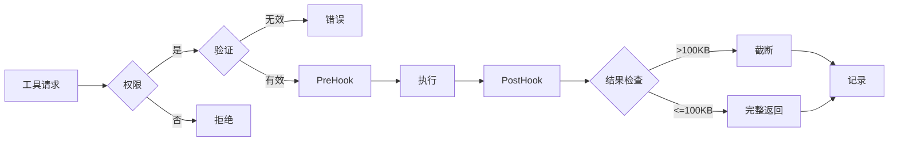
```mermaid
flowchart LR
    A[工具请求] --> B{权限} -->|是| D{验证}
    B -->|否| C[拒绝]
    D -->|无效| E[错误]
    D -->|有效| F[PreHook] --> G[执行] --> H[PostHook]
    H --> I{结果检查}
    I -->|>100KB| J[截断]
    I -->|<=100KB| K[完整返回]
    J --> L[记录]
    K --> L
```

---

## 8. 技能系统

### 8.1 技能定义

技能是声明式知识文档，基于触发条件自动激活。

```python
@dataclass(kw_only=True)
class Skill:
    """技能实体"""
    id: UUID
    tenant_id: UUID
    project_id: Optional[UUID]

    name: str              # e.g., "memory-graph-querying"
    display_name: str      # e.g., "记忆图谱查询"
    description: str       # 何时使用此技能

    trigger: SkillTrigger  # 触发条件

    summary: str           # 快速概览 (始终显示)
    content: str           # 完整内容 (SKILL.md 正文)

    resources: List[SkillResource] = field(default_factory=list)

    category: str = "general"
    tags: List[str] = field(default_factory=list)
    enabled: bool = True
```

### 8.2 SKILL.md 格式

````markdown
---
name: memory-graph-querying
description: |
  当用户询问"查询知识图谱"、"查找相关记忆"时使用此技能。
version: 1.0.0
triggers:
  - "查询知识图谱"
  - "查找相关记忆"
  - "cypher 查询"
---

# 记忆图谱查询

## 概述

此技能提供使用 Cypher 查询 Vanus 知识图谱的指导。

## 快速参考

### 基本查询

```cypher
MATCH (m:Memory {type: 'episode'})
WHERE m.content CONTAINS '关键词'
RETURN m LIMIT 10
```

## 最佳实践

1. 始终使用参数化查询
2. 限制结果数量
````

### 8.3 技能触发流程

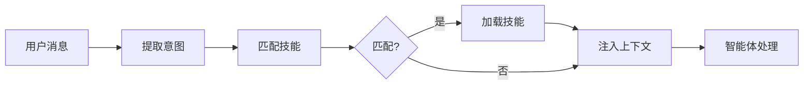
```mermaid
flowchart LR
    A[用户消息] --> B[提取意图] --> C[匹配技能]
    C --> D{匹配?}
    D -->|是| E[加载技能] --> G[注入上下文]
    D -->|否| G
    G --> H[智能体处理]
```

### 8.4 多租户隔离架构

#### 8.4.1 概述

Skill 系统支持三层隔离架构，允许租户在不影响其他租户的情况下管理和定制技能。

**核心特性**：

| 特性 | 描述 |
|------|------|
| **三层隔离** | 系统级 → 租户级 → 项目级，优先级递增 |
| **Web UI 管理** | 通过前端界面上传、编辑、删除 SKILL.md |
| **系统 Skill 保护** | 租户可选择禁用或覆盖任何系统 Skill |
| **租户配置** | 独立的禁用/覆盖配置，互不影响 |

#### 8.4.2 三层 Skill 来源

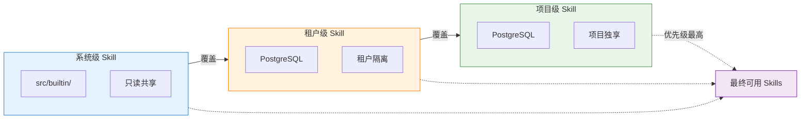
```mermaid
flowchart LR
    subgraph L1["系统级 Skill"]
        S1["src/builtin/"]
        S1_Desc["只读共享"]
    end
    
    subgraph L2["租户级 Skill"]
        T1["PostgreSQL"]
        T1_Desc["租户隔离"]
    end
    
    subgraph L3["项目级 Skill"]
        P1["PostgreSQL"]
        P1_Desc["项目独享"]
    end
    
    L1 -->|"覆盖"| L2
    L2 -->|"覆盖"| L3
    
    L3 -.->|"优先级最高"| Result["最终可用 Skills"]
    L2 -.-> Result
    L1 -.-> Result
    
    style L1 fill:#e3f2fd,stroke:#1976d2
    style L2 fill:#fff3e0,stroke:#f57c00
    style L3 fill:#e8f5e9,stroke:#388e3c
    style Result fill:#f3e5f5,stroke:#7b1fa2
```

**加载优先级**: 项目级 > 租户级 > 系统级（高优先级覆盖低优先级同名 Skill）

| 层级 | 存储位置 | 特点 |
|------|---------|------|
| 系统级 | `src/builtin/skills/` | 代码内置，版本控制，所有租户共享 |
| 租户级 | PostgreSQL `skills` 表 | `scope='tenant'`，租户隔离 |
| 项目级 | PostgreSQL `skills` 表 | `scope='project'`，项目独享 |

#### 8.4.3 Skill 域模型扩展

```python
# src/domain/model/agent/skill.py

class SkillScope(str, Enum):
    SYSTEM = "system"    # 系统级
    TENANT = "tenant"    # 租户级
    PROJECT = "project"  # 项目级

@dataclass(kw_only=True)
class Skill:
    # ... 现有字段 ...
    scope: SkillScope = SkillScope.TENANT
    is_system_skill: bool = False
```

#### 8.4.4 租户 Skill 配置

用于控制租户对系统 Skill 的禁用/覆盖：

```python
@dataclass(kw_only=True)
class TenantSkillConfig:
    """租户 Skill 配置"""
    id: str
    tenant_id: str
    system_skill_name: str
    action: str  # 'disable' | 'override'
    override_skill_id: str | None
    created_at: datetime
    updated_at: datetime
```

#### 8.4.5 三层加载逻辑

```python
async def list_available_skills(
    self,
    tenant_id: str,
    project_id: Optional[str] = None,
) -> List[Skill]:
    skills_map: Dict[str, Skill] = {}
    
    # Step 1: 加载系统级 Skill（从 builtin 目录）
    system_skills = await self._load_system_skills()
    
    # Step 2: 应用租户配置（禁用/覆盖）
    tenant_configs = await self._config_repo.list_by_tenant(tenant_id)
    for skill in system_skills:
        config = tenant_configs.get(skill.name)
        if config and config.action == 'disable':
            continue  # 跳过被禁用的系统 Skill
        if config and config.action == 'override':
            continue  # 稍后由租户级 Skill 覆盖
        skills_map[skill.name] = skill
    
    # Step 3: 加载租户级 Skill（覆盖系统级）
    tenant_skills = await self._skill_repo.list_by_tenant(
        tenant_id=tenant_id, scope=SkillScope.TENANT
    )
    for skill in tenant_skills:
        skills_map[skill.name] = skill  # 覆盖
    
    # Step 4: 加载项目级 Skill（覆盖租户级）
    if project_id:
        project_skills = await self._skill_repo.list_by_project(
            project_id=project_id, scope=SkillScope.PROJECT
        )
        for skill in project_skills:
            skills_map[skill.name] = skill  # 覆盖
    
    return list(skills_map.values())
```

#### 8.4.6 Skill 加载流程

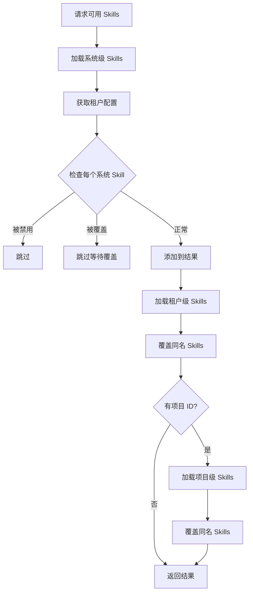
```mermaid
flowchart TD
    A[请求可用 Skills] --> B[加载系统级 Skills]
    B --> C[获取租户配置]
    C --> D{检查每个系统 Skill}
    D -->|被禁用| E[跳过]
    D -->|被覆盖| F[跳过等待覆盖]
    D -->|正常| G[添加到结果]
    
    G --> H[加载租户级 Skills]
    H --> I[覆盖同名 Skills]
    
    I --> J{有项目 ID?}
    J -->|是| K[加载项目级 Skills]
    J -->|否| L[返回结果]
    K --> M[覆盖同名 Skills]
    M --> L
```

#### 8.4.7 模块结构

```
src/
├── builtin/
│   └── skills/                    # 系统级 Skills（只读）
│       ├── code-review.md
│       ├── doc-coauthoring.md
│       └── memory-graph-querying.md
│
├── domain/model/agent/
│   ├── skill.py                   # 扩展 SkillScope 枚举
│   └── tenant_skill_config.py     # 新增租户配置实体
│
├── domain/ports/repositories/
│   ├── skill_repository.py        # 扩展 scope 参数
│   └── tenant_skill_config_repository.py  # 新增配置仓储
│
├── infrastructure/
│   ├── skill/
│   │   └── filesystem_scanner.py  # 添加 builtin 路径支持
│   └── adapters/secondary/persistence/
│       └── sql_tenant_skill_config_repository.py
│
└── application/services/
    └── skill_service.py           # 三层加载逻辑
```

---

## 9. 子智能体与编排

### 9.1 子智能体定义

```python
@dataclass(kw_only=True)
class SubAgent:
    """子智能体实体"""
    id: UUID
    tenant_id: UUID
    project_id: Optional[UUID]

    name: str              # e.g., "memory-analyzer"
    display_name: str

    trigger: AgentTrigger  # 触发配置

    system_prompt: str     # 系统提示
    model: AgentModel = AgentModel.INHERIT
    color: AgentColor = AgentColor.BLUE

    # 能力配置
    allowed_tools: List[str] = field(default_factory=list)
    allowed_skills: List[str] = field(default_factory=list)
    allowed_mcp_servers: List[str] = field(default_factory=list)

    # 运行配置
    max_tokens: int = 4096
    temperature: float = 0.7
    max_iterations: int = 10
```

### 9.2 子智能体类型

| 类型       | 目的         | 示例              |
| ---------- | ------------ | ----------------- |
| **探索者** | 分析理解数据 | `memory-explorer` |
| **研究者** | 信息搜集     | `web-researcher`  |
| **编码者** | 代码编写     | `coder-agent`     |
| **审查者** | 验证审查     | `code-reviewer`   |
| **运营者** | 系统操作     | `operator-agent`  |

### 9.3 路由编排

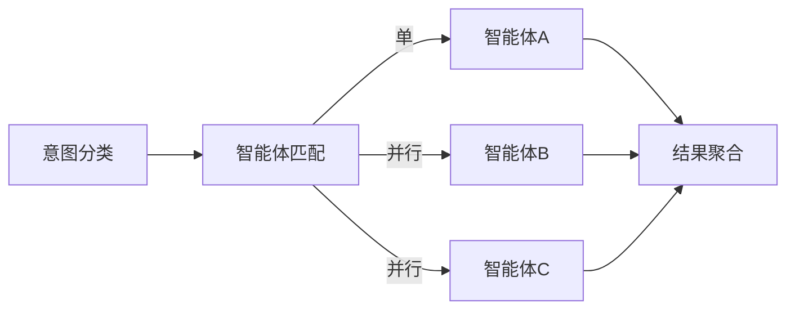
```mermaid
flowchart LR
    IC[意图分类] --> AM[智能体匹配]
    AM --> |单| AgentA[智能体A]
    AM --> |并行| AgentB[智能体B]
    AM --> |并行| AgentC[智能体C]
    AgentA & AgentB & AgentC --> RA[结果聚合]
```

#### 路由策略

| 策略         | 描述             | 使用场景   |
| ------------ | ---------------- | ---------- |
| **单智能体** | 路由到最佳匹配   | 简单任务   |
| **并行**     | 多智能体同时运行 | 独立分析   |
| **顺序**     | 链式执行         | 依赖工作流 |
| **层级**     | 父智能体委托     | 复杂任务   |

---

## 10. MCP 集成

### 10.1 MCP 服务器类型

| 类型          | 传输方式          | 使用场景   |
| ------------- | ----------------- | ---------- |
| **stdio**     | 进程 stdin/stdout | 本地工具   |
| **SSE**       | HTTP SSE          | 托管云服务 |
| **HTTP**      | REST API          | API 后端   |
| **WebSocket** | WS/WSS            | 实时通信   |

### 10.2 MCP Temporal 集群化架构

#### 10.2.1 架构概述

为解决 LOCAL MCP 服务器资源耗尽问题（每个连接消耗 ~40MB 内存），采用 **Temporal.io + MCP Worker Pool** 架构，将 MCP subprocess 管理从 API 服务分离到独立的 Worker 进程。

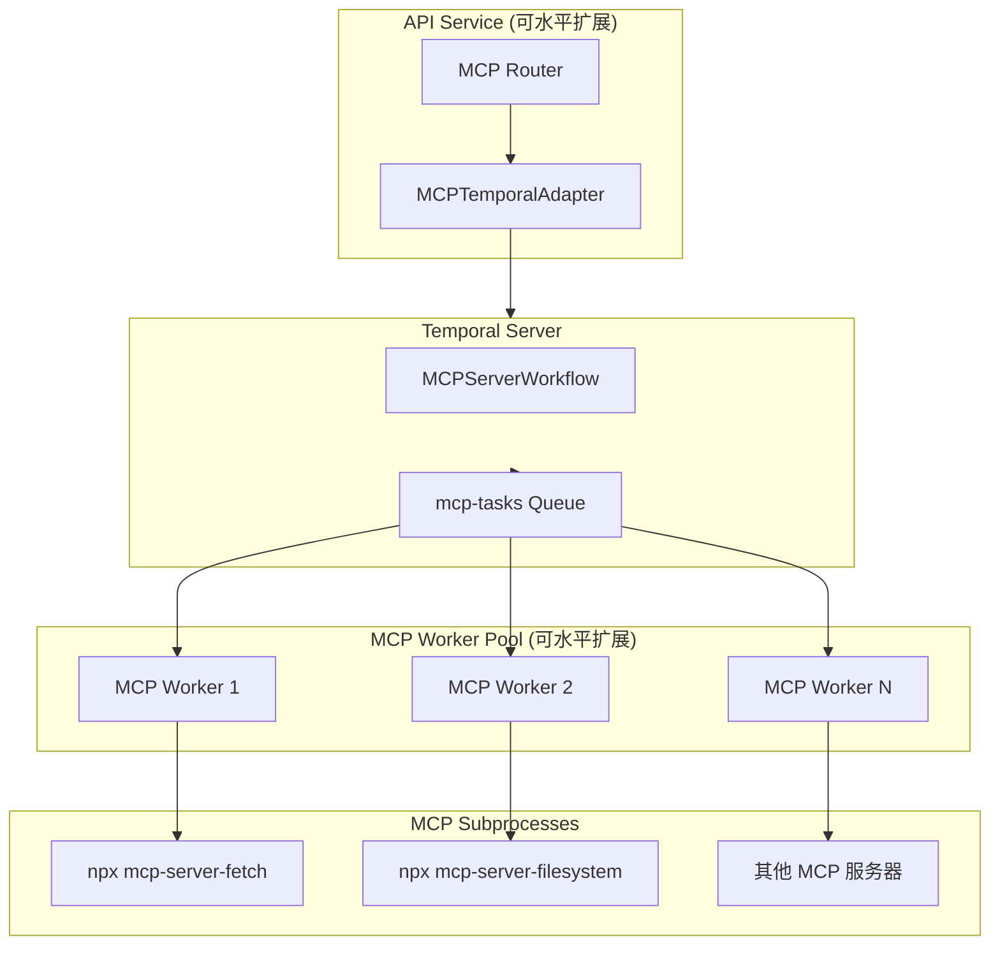
```mermaid
graph TB
    subgraph API["API Service (可水平扩展)"]
        Router[MCP Router]
        Adapter[MCPTemporalAdapter]
    end

    subgraph Temporal["Temporal Server"]
        Workflow[MCPServerWorkflow]
        Queue[mcp-tasks Queue]
    end

    subgraph Workers["MCP Worker Pool (可水平扩展)"]
        W1[MCP Worker 1]
        W2[MCP Worker 2]
        WN[MCP Worker N]
    end

    subgraph MCP["MCP Subprocesses"]
        P1[npx mcp-server-fetch]
        P2[npx mcp-server-filesystem]
        PN[其他 MCP 服务器]
    end

    Router --> Adapter
    Adapter --> Temporal
    Temporal --> Queue
    Queue --> W1
    Queue --> W2
    Queue --> WN
    W1 --> P1
    W2 --> P2
    WN --> PN
```

#### 10.2.2 核心组件

| 组件                    | 位置                                                       | 职责                                         |
| ----------------------- | ---------------------------------------------------------- | -------------------------------------------- |
| **MCPTemporalAdapter**  | `src/infrastructure/.../temporal/mcp/adapter.py`           | API 侧适配器，启动/管理 Workflow             |
| **MCPServerWorkflow**   | `src/infrastructure/.../temporal/mcp/workflows.py`         | 长运行 Workflow，管理单个 MCP 服务器生命周期 |
| **MCPSubprocessClient** | `src/infrastructure/.../temporal/mcp/subprocess_client.py` | LOCAL (stdio) 传输客户端                     |
| **MCPHttpClient**       | `src/infrastructure/.../temporal/mcp/http_client.py`       | Remote (HTTP/SSE) 传输客户端                 |
| **Activities**          | `src/infrastructure/.../temporal/mcp/activities.py`        | 启动/调用/停止 MCP 服务器操作                |
| **worker_mcp.py**       | `src/worker_mcp.py`                                        | MCP Worker 入口点                            |

#### 10.2.3 Workflow 生命周期

```mermaid
sequenceDiagram
    participant API as API Service
    participant TA as MCPTemporalAdapter
    participant TW as Temporal Worker
    participant WF as MCPServerWorkflow
    participant ACT as Activities
    participant MCP as MCP Server

    API->>TA: start_mcp_server()
    TA->>TW: Start Workflow
    TW->>WF: run(config)
    WF->>ACT: start_mcp_server_activity()
    ACT->>MCP: spawn subprocess
    MCP-->>ACT: initialize response
    ACT-->>WF: {status: connected, tools: [...]}
    WF-->>TA: Workflow started

    Note over WF: Long-running: 等待 stop 信号

    API->>TA: call_mcp_tool()
    TA->>WF: execute_update(call_tool)
    WF->>ACT: call_mcp_tool_activity()
    ACT->>MCP: JSON-RPC request
    MCP-->>ACT: tool result
    ACT-->>WF: result
    WF-->>TA: MCPToolCallResult

    API->>TA: stop_mcp_server()
    TA->>WF: signal(stop)
    WF->>ACT: stop_mcp_server_activity()
    ACT->>MCP: terminate
    WF-->>TA: Workflow completed
```

#### 10.2.4 Workflow ID 命名规范

```
tenant_{tenant_id}_mcp_{server_name}

示例:
- tenant_ee3a6fd8_d5c9_4355_b580_bc0631c6dcba_mcp_filesystem
- tenant_acme_corp_mcp_github_tools
```

#### 10.2.5 API 端点

| 方法   | 路径                                                    | 描述            |
| ------ | ------------------------------------------------------- | --------------- |
| POST   | `/api/v1/mcp/temporal/servers`                          | 启动 MCP 服务器 |
| DELETE | `/api/v1/mcp/temporal/servers/{server_name}`            | 停止 MCP 服务器 |
| GET    | `/api/v1/mcp/temporal/servers`                          | 列出所有服务器  |
| GET    | `/api/v1/mcp/temporal/servers/{server_name}/status`     | 获取服务器状态  |
| GET    | `/api/v1/mcp/temporal/servers/{server_name}/tools`      | 列出服务器工具  |
| POST   | `/api/v1/mcp/temporal/servers/{server_name}/tools/call` | 调用工具        |
| GET    | `/api/v1/mcp/temporal/tools`                            | 列出所有工具    |

#### 10.2.6 架构优势

| 特性         | 描述                                              |
| ------------ | ------------------------------------------------- |
| **资源隔离** | MCP subprocess 运行在独立 Worker 进程，不影响 API |
| **水平扩展** | Worker 可独立扩展（`replicas: N`）                |
| **故障恢复** | API 重启不影响 MCP 连接，Workflow 状态持久化      |
| **租户隔离** | Workflow ID 包含 tenant_id，确保租户间隔离        |
| **可观测性** | Temporal UI 可视化 Workflow 状态和历史            |

#### 10.2.7 部署配置

```yaml
# docker-compose.yml
mcp-worker:
  build:
    context: .
    dockerfile: Dockerfile
  command: uv run python src/worker_mcp.py
  environment:
    - TEMPORAL_HOST=temporal:7233
    - TEMPORAL_NAMESPACE=default
    - MCP_TASK_QUEUE=mcp-tasks
  depends_on:
    temporal:
      condition: service_healthy
  deploy:
    replicas: 2 # 水平扩展
```

### 10.3 MCP OAuth 认证

支持 OAuth 2.0 授权码流程（Authorization Code Flow）与 PKCE，用于连接需要认证的 MCP 服务器。

#### 10.3.1 架构组件

| 组件 | 文件 | 描述 |
|------|------|------|
| **MCPAuthStorage** | `src/infrastructure/agent/mcp/oauth.py` | Token 和凭证持久化 (`~/.memstack/mcp-auth.json`) |
| **MCPOAuthProvider** | `src/infrastructure/agent/mcp/oauth.py` | OAuth Provider 接口实现 (RFC 7591) |
| **MCPOAuthCallbackServer** | `src/infrastructure/agent/mcp/oauth_callback.py` | OAuth 回调 HTTP 服务器 (端口 19876) |

#### 10.3.2 OAuth 流程

```mermaid
sequenceDiagram
    participant Agent as Agent
    participant Provider as MCPOAuthProvider
    participant Callback as Callback Server
    participant Server as MCP Server

    Agent->>Provider: clientInformation()
    Provider->>Provider: Check pre-configured or stored client
    Provider-->>Agent: Return OAuthClientInfo or None

    alt No Client Info
        Provider->>Server: POST /register (RFC 7591)
        Server-->>Provider: Client Registration Response
        Provider->>Provider: save_client_information()
    end

    Provider->>Provider: generate_code_verifier() (PKCE)
    Agent->>Provider: save_oauth_state()
    Provider-->>Agent: Return code_challenge + state

    Agent->>Server: GET /authorize?code_challenge&state
    Server->>Server: User authenticates
    Server->>Callback: GET /callback?code&state

    Callback->>Callback: Validate state (CSRF)
    Callback-->>Agent: Resolve with authorization code

    Agent->>Server: POST /token?code&code_verifier
    Server-->>Agent: Access Token + Refresh Token
    Agent->>Provider: save_tokens()
```

#### 10.3.3 核心功能

**MCPAuthStorage**:
- Token 持久化到 `~/.memstack/mcp-auth.json`
- 文件权限 0o600 (仅所有者可读写)
- URL 验证 (凭证与服务器 URL 绑定)
- Token 过期检查

**MCPOAuthProvider**:
- 动态客户端注册 (RFC 7591)
- PKCE code verifier/challenge 生成
- State 参数管理 (CSRF 防护)
- Token 刷新支持

**MCPOAuthCallbackServer**:
- 监听 `http://127.0.0.1:19876/mcp/oauth/callback`
- State 参数验证
- 5 分钟超时
- 成功/失败 HTML 页面

#### 10.3.4 使用示例

```python
from src.infrastructure.agent.mcp import (
    MCPAuthStorage,
    MCPOAuthProvider,
    get_oauth_callback_server,
)

# Initialize
storage = MCPAuthStorage()
provider = MCPOAuthProvider(
    mcp_name="github-mcp",
    server_url="https://mcp.github.com",
    storage=storage,
    client_id="pre_registered_client",  # Optional
)

# Start callback server
await get_oauth_callback_server()

# OAuth flow
state = await provider.save_oauth_state()
challenge = await provider.generate_code_verifier()

# Redirect user to authorization URL
auth_url = f"https://mcp.github.com/authorize?code_challenge={challenge}&state={state}"
print(f"Please visit: {auth_url}")

# Wait for callback
auth_code = await provider.wait_for_callback(state)

# Exchange for tokens
await provider.save_tokens(access_token=..., refresh_token=..., expires_in=3600)
```

### 10.4 配置示例

```json
{
  "servers": {
    "neo4j-tools": {
      "type": "stdio",
      "command": "npx",
      "args": ["-y", "@Vanus/mcp-neo4j"],
      "env": {
        "NEO4J_URI": "${NEO4J_URI}",
        "NEO4J_PASSWORD": "${NEO4J_PASSWORD}"
      }
    },
    "github-api": {
      "type": "sse",
      "url": "https://mcp.github.com/sse",
      "oauth": {
        "authorization_endpoint": "https://github.com/login/oauth/authorize",
        "token_endpoint": "https://github.com/login/oauth/access_token",
        "client_id": "${GITHUB_CLIENT_ID}"
      }
    }
  }
}
```

### 10.5 工具命名规范

```
mcp__{租户}_{服务器名}__{工具名}

示例:
- mcp__acme_neo4j-tools__cypher_query
- mcp__acme_github-api__create_issue
```

---

## 11. 知识图谱系统

### 11.1 概述

**Native Graph Adapter** 是自研的知识图谱引擎，替代了之前的 Graphiti 依赖。该系统负责从 Episode 内容中抽取实体、关系，构建知识图谱，并支持混合检索。

#### 核心能力

| 能力         | 描述                                                        |
| ------------ | ----------------------------------------------------------- |
| **实体抽取** | 基于 LLM 的结构化 JSON 输出，自动识别人物、组织、概念等实体 |
| **关系发现** | 自动检测实体间的语义关系                                    |
| **反思迭代** | 可选的二次抽取，捕获遗漏实体                                |
| **实体去重** | 基于向量相似度的重复实体合并                                |
| **混合检索** | 向量 + 关键词 + RRF 融合的多路召回                          |
| **社区检测** | Louvain 算法自动聚类，生成社区摘要                          |

### 11.2 模块架构

```
src/infrastructure/graph/
├── native_graph_adapter.py        # 主适配器 (实现 GraphServicePort)
├── neo4j_client.py                # Neo4j 驱动封装
├── schemas.py                     # Pydantic 节点/边数据模型
├── extraction/
│   ├── entity_extractor.py        # LLM 驱动的实体抽取
│   ├── relationship_extractor.py  # LLM 驱动的关系发现
│   ├── reflexion.py               # 反思迭代（完整性检查）
│   └── prompts.py                 # Prompt 模板
├── embedding/
│   └── embedding_service.py       # 向量嵌入服务封装
├── search/
│   └── hybrid_search.py           # 混合检索 (向量 + 关键词 + RRF)
└── community/
    ├── louvain_detector.py        # Louvain 社区检测算法
    └── community_updater.py       # 社区摘要生成
```

### 11.3 Episode 处理流程

```mermaid
flowchart TD
    A[Episode 内容] --> B[EntityExtractor.extract]
    B --> C[LLM 结构化输出]
    C --> D[EntityExtractor.dedupe]
    D --> E[向量相似度去重]
    E --> F[保存 Entity 节点]
    F --> G[创建 MENTIONS 关系]
    G --> H[RelationshipExtractor.extract]
    H --> I[LLM 关系抽取]
    I --> J[保存 RELATES_TO 关系]
    J --> K[CommunityUpdater.update]
    K --> L[Louvain 聚类]
    L --> M[LLM 生成社区摘要]
    M --> N[更新 Episode 状态为 Synced]
```

### 11.4 Neo4j 图模型

#### 节点类型

| 标签        | 描述         | 关键属性                                        |
| ----------- | ------------ | ----------------------------------------------- |
| `Episodic`  | Episode 节点 | `id`, `content`, `source`, `created_at`         |
| `Entity`    | 实体节点     | `id`, `name`, `type`, `embedding`, `attributes` |
| `Community` | 社区节点     | `id`, `name`, `summary`, `member_count`         |

#### 关系类型

| 关系         | 方向               | 描述                     |
| ------------ | ------------------ | ------------------------ |
| `MENTIONS`   | Episode → Entity   | Episode 提及某实体       |
| `RELATES_TO` | Entity → Entity    | 实体间语义关系（带权重） |
| `BELONGS_TO` | Entity → Community | 实体所属社区             |

### 11.5 混合检索策略

```mermaid
flowchart LR
    Q[查询] --> V[向量检索]
    Q --> K[关键词检索]
    Q --> G[图遍历]
    V --> RRF[RRF 融合]
    K --> RRF
    G --> RRF
    RRF --> R[排序结果]
```

#### 检索参数

| 参数             | 默认值 | 描述           |
| ---------------- | ------ | -------------- |
| `top_k`          | 10     | 返回结果数量   |
| `vector_weight`  | 0.4    | 向量检索权重   |
| `keyword_weight` | 0.3    | 关键词检索权重 |
| `graph_weight`   | 0.3    | 图遍历权重     |
| `rrf_k`          | 60     | RRF 融合常数   |

### 11.6 配置选项

```python
# src/configuration/config.py

# 启用 Native Graph Adapter（默认 True）
USE_NATIVE_GRAPH_ADAPTER: bool = True

# 实体抽取配置
ENTITY_EXTRACTION_MODEL: str = "gemini/gemini-1.5-flash"
ENABLE_REFLEXION: bool = True  # 启用反思迭代

# 去重阈值
ENTITY_DEDUPE_THRESHOLD: float = 0.85  # 向量相似度阈值

# 社区检测配置
COMMUNITY_MIN_SIZE: int = 3  # 最小社区成员数
COMMUNITY_RESOLUTION: float = 1.0  # Louvain 分辨率参数
```

### 11.5 Agent Temporal 工作流

Agent 执行通过 Temporal.io 工作流编排，实现长时间运行、故障容错的智能体操作。

#### 架构

```
src/infrastructure/adapters/secondary/temporal/
├── workflows/
│   └── agent.py                 # Agent 执行工作流
└── activities/
    └── agent.py                 # Agent 执行活动
```

#### Agent ExecutionWorkflow

**职责**：管理完整的 ReAct 智能体生命周期

**输入数据**:
```python
@dataclass
class AgentInput:
    conversation_id: str
    message_id: str
    user_message: str
    project_id: str
    user_id: str
    tenant_id: str
    agent_config: Dict[str, Any]
    conversation_context: List[Dict[str, Any]]
    max_steps: int = 50
```

**执行状态**:
```python
@dataclass
class AgentState:
    current_step: int = 0
    thoughts: List[str] = []
    tool_calls: List[Dict[str, Any]] = []
    final_content: str = ""
    is_complete: bool = False
    error: Optional[str] = None
    checkpoints_created: List[str] = []
```

**流程**:
1. 信号通知工作流开始
2. 主 ReAct 循环（直到完成或 max_steps）:
   - 更新进度
   - 执行单个 ReAct 步骤（通过 Activity）
   - 处理步骤结果（complete/error/continue）
   - 处理用户输入（通过信号）
3. 标记完成
4. 返回最终结果

#### Agent Activities

| 活动名称 | 职责 | 返回值 |
|---------|------|--------|
| `execute_react_step_activity` | 执行单步 ReAct（LLM 调用 + 工具执行） | `{type, content, tool_results}` |
| `save_event_activity` | 持久化 SSE 事件到数据库 | `None` |
| `save_checkpoint_activity` | 保存执行状态快照 | `checkpoint_id` |

**execute_react_step_activity 工具支持**:
- `memory_search`: 语义记忆搜索
- `entity_lookup`: 实体查找
- `graph_query`: Cypher 图查询
- `memory_create`: 创建新记忆
- `web_search`: 网页搜索（占位）
- `web_scrape`: 网页抓取（占位）
- `summary`: 生成摘要

#### Agent Execution Models

**AgentExecutionEvent** - SSE 事件存储（19 种事件类型）:
- Basic: `MESSAGE`, `THOUGHT`, `ACT`, `OBSERVE`
- Streaming: `TEXT_START`, `TEXT_DELTA`, `TEXT_END`
- Work Plan: `WORK_PLAN`, `STEP_START`, `STEP_END`, `PATTERN_MATCH`
- Decision: `DECISION_ASKED`, `DECISION_ANSWERED`, `CLARIFICATION_ASKED`, `CLARIFICATION_ANSWERED`
- Skill (L2): `SKILL_MATCHED`, `SKILL_EXECUTION_START`, `SKILL_TOOL_START`, `SKILL_TOOL_RESULT`, `SKILL_EXECUTION_COMPLETE`, `SKILL_FALLBACK`
- Terminal: `COMPLETE`, `ERROR`
- Doom Loop: `DOOM_LOOP_DETECTED`

**ExecutionCheckpoint** - 执行状态快照（5 种类型）:
- `LLM_COMPLETE`: LLM 生成思考后
- `TOOL_START`: 工具执行前
- `TOOL_COMPLETE`: 工具执行后
- `STEP_COMPLETE`: ReAct 步骤完成后
- `WORK_PLAN_CREATED`: 工作计划生成后

**ToolExecutionRecord** - 工具执行记录:
- `call_id`: 工具调用 ID（索引）
- `tool_name`: 工具名称
- `tool_input`: 输入参数（JSON）
- `tool_output`: 输出结果
- `status`: `running`, `success`, `failed`
- `step_number`, `sequence_number`: 执行顺序
- `started_at`, `completed_at`, `duration_ms`: 时间信息

#### 数据库表

| 表名 | 用途 |
|-----|------|
| `agent_execution_events` | 所有 SSE 事件（带序列号） |
| `execution_checkpoints` | 状态快照（按类型） |
| `tool_execution_records` | 工具执行时间线 |

#### API 端点

| 端点 | 用途 |
|-----|------|
| `GET /api/v1/agent/conversations/{id}/events` | 事件回放 |
| `GET /api/v1/agent/conversations/{id}/execution-status` | 执行状态 |
| `POST /api/v1/agent/conversations/{id}/resume` | 从检查点恢复 |
| `GET /api/v1/agent/conversations/{id}/tool-executions` | 工具历史 |

---

## 12. SSE 事件流

### 12.1 事件类型

| 事件类型     | 描述           | 数据结构                              |
| ------------ | -------------- | ------------------------------------- |
| `work_plan`  | 工作级计划生成 | `{plan_id, steps[], total_steps}`     |
| `step_start` | 步骤开始执行   | `{step_number, description}`          |
| `step_end`   | 步骤执行完成   | `{step_number, success, duration_ms}` |
| `thought`    | 任务级思考     | `{thought, thought_level}`            |
| `act`        | 工具调用       | `{tool_name, tool_input}`             |
| `observe`    | 工具结果       | `{tool_name, result}`                 |
| `complete`   | 执行完成       | `{content, format}`                   |
| `error`      | 错误发生       | `{message, code}`                     |
| `warning`    | 警告信息       | `{message}`                           |

### 12.2 事件模式

```json
{
  "type": "work_plan",
  "data": {
    "plan_id": "uuid",
    "steps": [
      {
        "step_number": 0,
        "description": "收集数据",
        "expected_output": "数据集"
      }
    ],
    "total_steps": 3
  },
  "timestamp": "2026-01-15T10:00:00Z",
  "conversation_id": "uuid",
  "event_id": "uuid"
}
```

### 12.3 连接恢复

```mermaid
sequenceDiagram
    participant Client as 客户端
    participant Server as 服务器
    participant Buffer as 事件缓冲区

    Client->>Server: 建立 SSE 连接
    Server-->>Client: 推送事件 (event_id: 001)
    Server-->>Client: 推送事件 (event_id: 002)

    Note over Client: 连接断开

    Client->>Server: 重连 (Last-Event-ID: 002)
    Server->>Buffer: 查询缓冲区
    Buffer-->>Server: 返回 002 之后的事件
    Server-->>Client: 重放事件 (003, 004, ...)
    Server-->>Client: 继续实时事件
```

**缓冲区配置**:

- 最大容量: 100 个事件
- 保留时间: 5 分钟
- 超出后: 发送 `buffer_overflow` 事件

---

## 13. 数据库设计

### 13.1 PostgreSQL Schema

```sql
-- 交互模式表
CREATE TABLE interaction_patterns (
    id UUID PRIMARY KEY DEFAULT gen_random_uuid(),
    tenant_id UUID NOT NULL REFERENCES tenants(id),
    pattern_signature VARCHAR(64) NOT NULL,
    name VARCHAR(200) NOT NULL,
    description TEXT,
    steps JSONB NOT NULL,
    tool_compositions JSONB NOT NULL DEFAULT '[]',
    success_count INTEGER NOT NULL DEFAULT 0,
    failure_count INTEGER NOT NULL DEFAULT 0,
    avg_execution_time_ms INTEGER,
    usage_count INTEGER NOT NULL DEFAULT 0,
    created_at TIMESTAMP WITH TIME ZONE DEFAULT NOW(),
    updated_at TIMESTAMP WITH TIME ZONE
);

CREATE INDEX idx_interaction_patterns_signature ON interaction_patterns(pattern_signature);
CREATE INDEX idx_interaction_patterns_tenant ON interaction_patterns(tenant_id);

-- 工具组合表
CREATE TABLE tool_compositions (
    id UUID PRIMARY KEY DEFAULT gen_random_uuid(),
    name VARCHAR(200) NOT NULL UNIQUE,
    description TEXT,
    tools JSONB NOT NULL,
    execution_template JSONB NOT NULL,
    success_count INTEGER NOT NULL DEFAULT 0,
    failure_count INTEGER NOT NULL DEFAULT 0,
    usage_count INTEGER NOT NULL DEFAULT 0,
    created_at TIMESTAMP WITH TIME ZONE DEFAULT NOW(),
    updated_at TIMESTAMP WITH TIME ZONE
);

-- 智能体执行扩展
ALTER TABLE agent_executions
ADD COLUMN work_level_thought TEXT,
ADD COLUMN task_level_thought TEXT,
ADD COLUMN plan_steps JSONB,
ADD COLUMN current_step_index INTEGER,
ADD COLUMN workflow_pattern_id UUID REFERENCES interaction_patterns(id),
ADD COLUMN total_duration_ms INTEGER,
ADD COLUMN steps_completed INTEGER NOT NULL DEFAULT 0,
ADD COLUMN steps_failed INTEGER NOT NULL DEFAULT 0;

-- 对话扩展
ALTER TABLE conversations
ADD COLUMN agent_mode VARCHAR(20) NOT NULL DEFAULT 'react',
ADD COLUMN enable_workflow_learning BOOLEAN NOT NULL DEFAULT true,
ADD COLUMN max_concurrent_steps INTEGER NOT NULL DEFAULT 5,
ADD COLUMN planning_timeout_ms INTEGER NOT NULL DEFAULT 5000;

-- 子智能体表
CREATE TABLE subagents (
    id UUID PRIMARY KEY DEFAULT gen_random_uuid(),
    tenant_id UUID NOT NULL REFERENCES tenants(id),
    project_id UUID REFERENCES projects(id),
    name VARCHAR(50) NOT NULL,
    display_name VARCHAR(100) NOT NULL,
    description TEXT NOT NULL,
    system_prompt TEXT NOT NULL,
    model VARCHAR(50) DEFAULT 'inherit',
    color VARCHAR(20) DEFAULT 'blue',
    allowed_tools TEXT[] DEFAULT '{}',
    allowed_skills TEXT[] DEFAULT '{}',
    allowed_mcp_servers TEXT[] DEFAULT '{}',
    max_tokens INTEGER DEFAULT 4096,
    temperature DECIMAL(3,2) DEFAULT 0.7,
    max_iterations INTEGER DEFAULT 10,
    enabled BOOLEAN DEFAULT true,
    version VARCHAR(20) DEFAULT '1.0.0',
    total_invocations INTEGER DEFAULT 0,
    avg_execution_time_ms DECIMAL(10,2) DEFAULT 0,
    success_rate DECIMAL(5,4) DEFAULT 1.0,
    created_at TIMESTAMP WITH TIME ZONE DEFAULT NOW(),
    updated_at TIMESTAMP WITH TIME ZONE DEFAULT NOW(),
    CONSTRAINT unique_agent_name UNIQUE (tenant_id, project_id, name)
);

-- 技能表
CREATE TABLE skills (
    id UUID PRIMARY KEY DEFAULT gen_random_uuid(),
    tenant_id UUID NOT NULL REFERENCES tenants(id),
    project_id UUID REFERENCES projects(id),
    name VARCHAR(100) NOT NULL,
    display_name VARCHAR(200) NOT NULL,
    description TEXT NOT NULL,
    trigger_phrases TEXT[] NOT NULL,
    trigger_patterns TEXT[] DEFAULT '{}',
    summary TEXT NOT NULL,
    content TEXT NOT NULL,
    category VARCHAR(50) DEFAULT 'general',
    tags TEXT[] DEFAULT '{}',
    enabled BOOLEAN DEFAULT true,
    version VARCHAR(20) DEFAULT '1.0.0',
    -- 新增多租户隔离字段
    scope VARCHAR(20) DEFAULT 'tenant' NOT NULL,  -- 'system' | 'tenant' | 'project'
    is_system_skill BOOLEAN DEFAULT FALSE NOT NULL,
    created_at TIMESTAMP WITH TIME ZONE DEFAULT NOW(),
    updated_at TIMESTAMP WITH TIME ZONE DEFAULT NOW()
);

-- 技能索引
CREATE INDEX ix_skills_scope ON skills(scope);
CREATE INDEX ix_skills_tenant_scope ON skills(tenant_id, scope);

-- 租户 Skill 配置表（控制系统 Skill 的禁用/覆盖）
CREATE TABLE tenant_skill_configs (
    id UUID PRIMARY KEY DEFAULT gen_random_uuid(),
    tenant_id UUID NOT NULL REFERENCES tenants(id) ON DELETE CASCADE,
    system_skill_name VARCHAR(200) NOT NULL,
    action VARCHAR(20) NOT NULL,  -- 'disable' | 'override'
    override_skill_id UUID REFERENCES skills(id) ON DELETE SET NULL,
    created_at TIMESTAMP WITH TIME ZONE DEFAULT NOW(),
    updated_at TIMESTAMP WITH TIME ZONE DEFAULT NOW(),
    UNIQUE(tenant_id, system_skill_name)
);

CREATE INDEX ix_tenant_skill_configs_tenant ON tenant_skill_configs(tenant_id);

-- 智能体活动日志表
CREATE TABLE agent_activity_logs (
    id UUID PRIMARY KEY DEFAULT gen_random_uuid(),
    tenant_id UUID NOT NULL,
    project_id UUID NOT NULL,
    session_id UUID NOT NULL,
    agent_id UUID NOT NULL REFERENCES subagents(id),
    parent_activity_id UUID REFERENCES agent_activity_logs(id),
    type VARCHAR(50) NOT NULL,
    status VARCHAR(20) NOT NULL,
    name VARCHAR(200) NOT NULL,
    input_data JSONB DEFAULT '{}',
    output_data JSONB DEFAULT '{}',
    error_message TEXT,
    prompt_tokens INTEGER,
    completion_tokens INTEGER,
    total_tokens INTEGER,
    duration_ms INTEGER DEFAULT 0,
    started_at TIMESTAMP WITH TIME ZONE DEFAULT NOW(),
    completed_at TIMESTAMP WITH TIME ZONE,
    metadata JSONB DEFAULT '{}'
);

-- 索引
CREATE INDEX idx_activity_logs_session ON agent_activity_logs(session_id);
CREATE INDEX idx_activity_logs_agent ON agent_activity_logs(agent_id);
CREATE INDEX idx_activity_logs_started_at ON agent_activity_logs(started_at);
CREATE INDEX idx_skills_trigger_gin ON skills USING GIN (trigger_phrases);

-- Agent 执行事件表
CREATE TABLE agent_execution_events (
    id UUID PRIMARY KEY DEFAULT gen_random_uuid(),
    conversation_id UUID NOT NULL REFERENCES conversations(id),
    message_id UUID NOT NULL REFERENCES messages(id),
    event_type VARCHAR(50) NOT NULL,
    event_data JSONB NOT NULL,
    sequence_number INT NOT NULL,
    created_at TIMESTAMP WITH TIME ZONE DEFAULT NOW()
);

CREATE INDEX idx_agent_events_conv_seq ON agent_execution_events(conversation_id, sequence_number);
CREATE INDEX idx_agent_events_message ON agent_execution_events(message_id);
CREATE INDEX idx_agent_events_type ON agent_execution_events(event_type);

-- 执行检查点表
CREATE TABLE execution_checkpoints (
    id UUID PRIMARY KEY DEFAULT gen_random_uuid(),
    conversation_id UUID NOT NULL REFERENCES conversations(id),
    message_id UUID NOT NULL REFERENCES messages(id),
    checkpoint_type VARCHAR(50) NOT NULL,
    execution_state JSONB NOT NULL,
    step_number INT,
    created_at TIMESTAMP WITH TIME ZONE DEFAULT NOW()
);

CREATE INDEX idx_checkpoints_conv ON execution_checkpoints(conversation_id);
CREATE INDEX idx_checkpoints_message ON execution_checkpoints(message_id);
CREATE INDEX idx_checkpoints_type ON execution_checkpoints(checkpoint_type);

-- 工具执行记录表（已存在，确认索引）
CREATE INDEX idx_tool_exec_conv ON tool_execution_records(conversation_id);
CREATE INDEX idx_tool_exec_call ON tool_execution_records(call_id);
```

---

## 14. API 设计

### 14.1 智能体聊天 API

```yaml
POST /api/v1/agent/chat:
  summary: 智能体聊天 (SSE 流)
  requestBody:
    content:
      application/json:
        schema:
          type: object
          properties:
            message:
              type: string
              description: 用户消息
            project_id:
              type: string
              format: uuid
            conversation_id:
              type: string
              format: uuid
              description: 可选，继续已有对话
  responses:
    200:
      description: SSE 事件流
      content:
        text/event-stream:
          schema:
            type: object
            properties:
              type:
                type: string
                enum:
                  [
                    work_plan,
                    step_start,
                    step_end,
                    thought,
                    act,
                    observe,
                    complete,
                    error,
                  ]
              data:
                type: object
              timestamp:
                type: string
                format: date-time
              event_id:
                type: string
```

### 14.2 交互模式 API

```yaml
GET /api/v1/agent/patterns:
  summary: 列出交互模式
  parameters:
    - name: tenant_id
      in: query
      schema:
        type: string
        format: uuid
  responses:
    200:
      description: 模式列表

POST /api/v1/agent/patterns:
  summary: 创建交互模式 (仅管理员)

DELETE /api/v1/agent/patterns/{id}:
  summary: 删除交互模式 (仅管理员)

GET /api/v1/agent/conversations/{id}/execution:
  summary: 获取执行历史
```

### 14.3 子智能体 API

```yaml
GET /api/v1/agents:
  summary: 列出所有智能体

POST /api/v1/agents:
  summary: 创建新智能体

GET /api/v1/agents/{agent_id}:
  summary: 获取智能体详情

PUT /api/v1/agents/{agent_id}:
  summary: 更新智能体

DELETE /api/v1/agents/{agent_id}:
  summary: 删除智能体

POST /api/v1/agents/{agent_id}/invoke:
  summary: 调用智能体

GET /api/v1/agents/{agent_id}/activities:
  summary: 获取活动日志
```

### 14.4 技能 API

#### 14.4.1 Skill CRUD（扩展多租户支持）

```yaml
GET /api/v1/skills:
  summary: 列出所有技能（支持 scope 过滤）
  parameters:
    - name: scope
      in: query
      schema:
        type: string
        enum: [system, tenant, project, all]
        default: all
    - name: project_id
      in: query
      schema:
        type: string
        format: uuid
  responses:
    200:
      description: 技能列表
      content:
        application/json:
          schema:
            type: object
            properties:
              skills:
                type: array
                items:
                  type: object
                  properties:
                    id: 
                      type: string
                    name:
                      type: string
                    scope:
                      type: string
                      enum: [system, tenant, project]
                    is_system_skill:
                      type: boolean
                    is_disabled:
                      type: boolean
                    is_overridden:
                      type: boolean

GET /api/v1/skills/system:
  summary: 获取系统 Skill 列表（只读）
  responses:
    200:
      description: 系统技能列表

POST /api/v1/skills:
  summary: 创建租户/项目级技能
  requestBody:
    content:
      application/json:
        schema:
          type: object
          required: [name, description, scope]
          properties:
            name:
              type: string
            description:
              type: string
            scope:
              type: string
              enum: [tenant, project]
            project_id:
              type: string
              format: uuid
              description: 项目级 Skill 必填
            trigger_type:
              type: string
              enum: [keyword, semantic, hybrid]
            trigger_patterns:
              type: array
              items:
                type: object
            tools:
              type: array
              items:
                type: string
            content:
              type: string
              description: SKILL.md 内容

GET /api/v1/skills/{skill_id}:
  summary: 获取技能详情

PUT /api/v1/skills/{skill_id}:
  summary: 更新技能

DELETE /api/v1/skills/{skill_id}:
  summary: 删除技能

GET /api/v1/skills/{skill_id}/content:
  summary: 下载 SKILL.md 内容

PUT /api/v1/skills/{skill_id}/content:
  summary: 上传 SKILL.md 内容
```

#### 14.4.2 租户 Skill 配置 API

```yaml
GET /api/v1/tenant/skills/config:
  summary: 获取租户 Skill 配置
  responses:
    200:
      description: 租户配置列表
      content:
        application/json:
          schema:
            type: object
            properties:
              configs:
                type: array
                items:
                  type: object
                  properties:
                    system_skill_name:
                      type: string
                    action:
                      type: string
                      enum: [disable, override]
                    override_skill_id:
                      type: string
                      format: uuid

POST /api/v1/tenant/skills/disable:
  summary: 禁用系统 Skill
  requestBody:
    content:
      application/json:
        schema:
          type: object
          required: [skill_name]
          properties:
            skill_name:
              type: string
              description: 系统 Skill 名称
  responses:
    200:
      description: 禁用成功
    404:
      description: 系统 Skill 不存在

POST /api/v1/tenant/skills/enable:
  summary: 启用系统 Skill（移除禁用配置）
  requestBody:
    content:
      application/json:
        schema:
          type: object
          required: [skill_name]
          properties:
            skill_name:
              type: string

POST /api/v1/tenant/skills/override:
  summary: 覆盖系统 Skill
  requestBody:
    content:
      application/json:
        schema:
          type: object
          required: [skill_name, override_skill_id]
          properties:
            skill_name:
              type: string
              description: 要覆盖的系统 Skill 名称
            override_skill_id:
              type: string
              format: uuid
              description: 用于覆盖的租户级 Skill ID
  responses:
    200:
      description: 覆盖配置成功
    400:
      description: 覆盖 Skill 不存在或 scope 不正确
```

#### 14.4.3 请求/响应示例

**创建租户级 Skill**:

```json
POST /api/v1/skills
{
  "name": "custom-review",
  "description": "自定义代码审查",
  "scope": "tenant",
  "trigger_type": "keyword",
  "trigger_patterns": [{"pattern": "review code", "weight": 1.0}],
  "tools": ["memory_search", "graph_query"],
  "content": "---\nname: custom-review\n...\n---\n# 正文内容"
}
```

**获取技能列表响应**:

```json
GET /api/v1/skills?scope=all

{
  "skills": [
    {
      "id": "uuid-1",
      "name": "code-review",
      "scope": "system",
      "is_system_skill": true,
      "is_disabled": false,
      "is_overridden": false
    },
    {
      "id": "uuid-2",
      "name": "custom-review",
      "scope": "tenant",
      "is_system_skill": false,
      "is_disabled": false,
      "is_overridden": false
    }
  ]
}
```

### 14.5 Agent 事件回放 API

```yaml
GET /api/v1/agent/conversations/{conversation_id}/events:
  summary: 获取会话事件用于回放
  parameters:
    - name: conversation_id
      in: path
      required: true
      schema:
        type: string
        format: uuid
    - name: from_sequence
      in: query
      schema:
        type: integer
        default: 0
    - name: limit
      in: query
      schema:
        type: integer
        default: 1000
        maximum: 10000
  responses:
    200:
      description: 事件列表
      content:
        application/json:
          schema:
            type: object
            properties:
              events:
                type: array
                items:
                  type: object
                  properties:
                    id: string
                    event_type: string
                    event_data: object
                    sequence_number: integer
                    created_at: string
              has_more:
                type: boolean

GET /api/v1/agent/conversations/{conversation_id}/execution-status:
  summary: 获取当前执行状态
  responses:
    200:
      description: 执行状态
      content:
        application/json:
          schema:
            type: object
            properties:
              is_running:
                type: boolean
              last_sequence:
                type: integer
              current_message_id:
                type: string
                format: uuid

POST /api/v1/agent/conversations/{conversation_id}/resume:
  summary: 从检查点恢复执行
  responses:
    202:
      description: 恢复中
    404:
      description: 无可用检查点

GET /api/v1/agent/conversations/{conversation_id}/tool-executions:
  summary: 获取工具执行历史
  parameters:
    - name: message_id
      in: query
      schema:
        type: string
        format: uuid
    - name: limit
      in: query
      schema:
        type: integer
        default: 100
  responses:
    200:
      description: 工具执行记录列表
```

---

## 15. 前端架构

### 15.1 设计预览（概念设计，仅供 YY 参考，实际效果以产品原型为准）

> 以下是平台各模块的 UI 设计稿预览：

#### 租户控制台

**租户总览** - 租户级数据概览、项目列表、用量统计


**项目管理** - 项目 CRUD、配置管理


#### 项目工作台

**工作台概览** - 项目级仪表盘


**记忆图谱** - 知识图谱可视化


**智能体聊天** - 人机对话界面

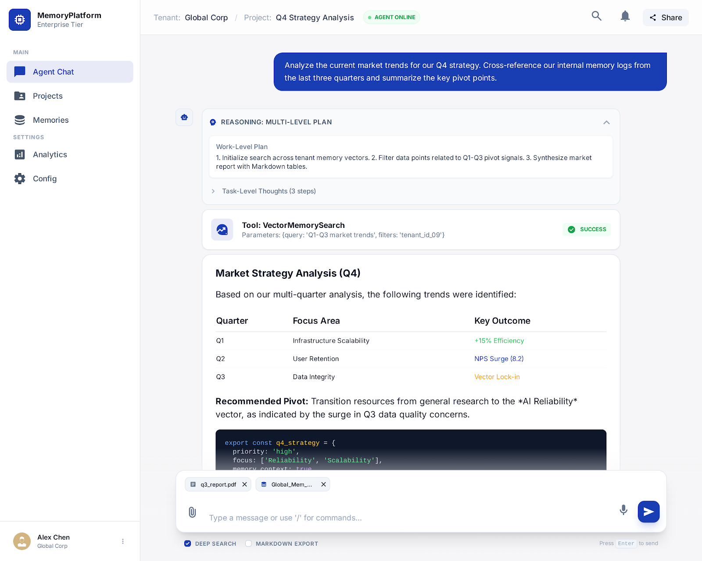

#### 智能体系统

**统一工作空间** - Agent 工作台主入口

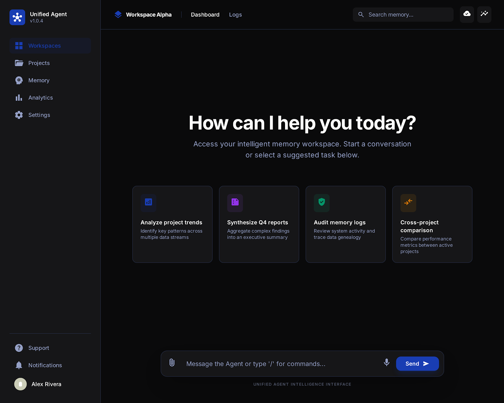

**活动日志可视化** - 执行日志、工具调用可视化

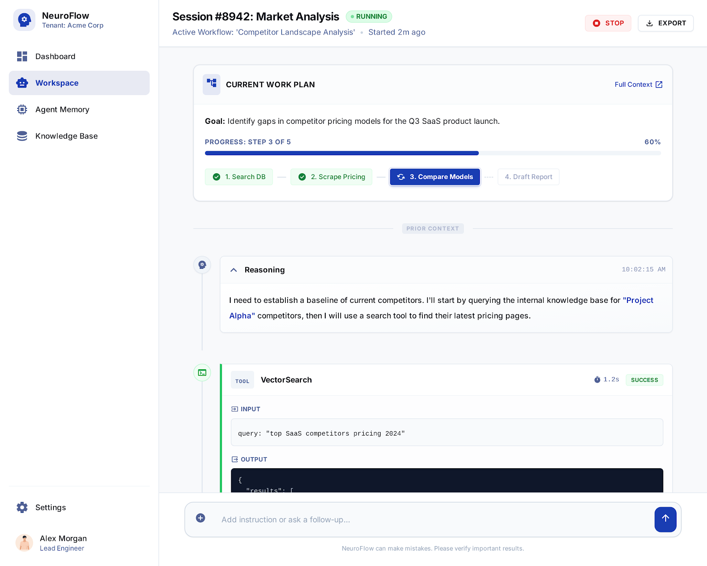

**子智能体管理** - SubAgent 配置与编排


**路由器仪表板** - 智能体路由流程图

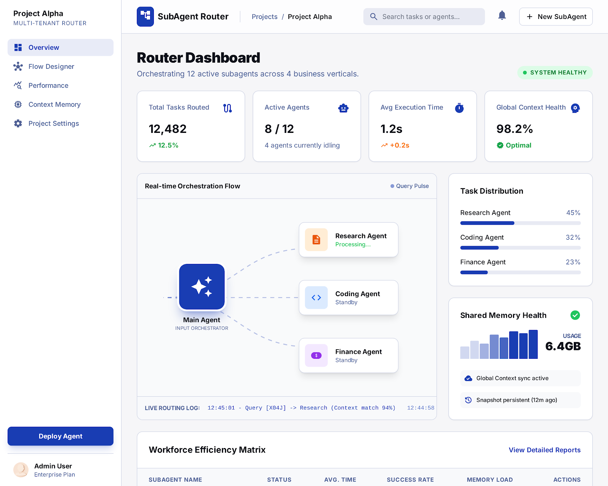

#### 技能与交互模式

**技能注册中心** - Skill 管理、触发条件配置

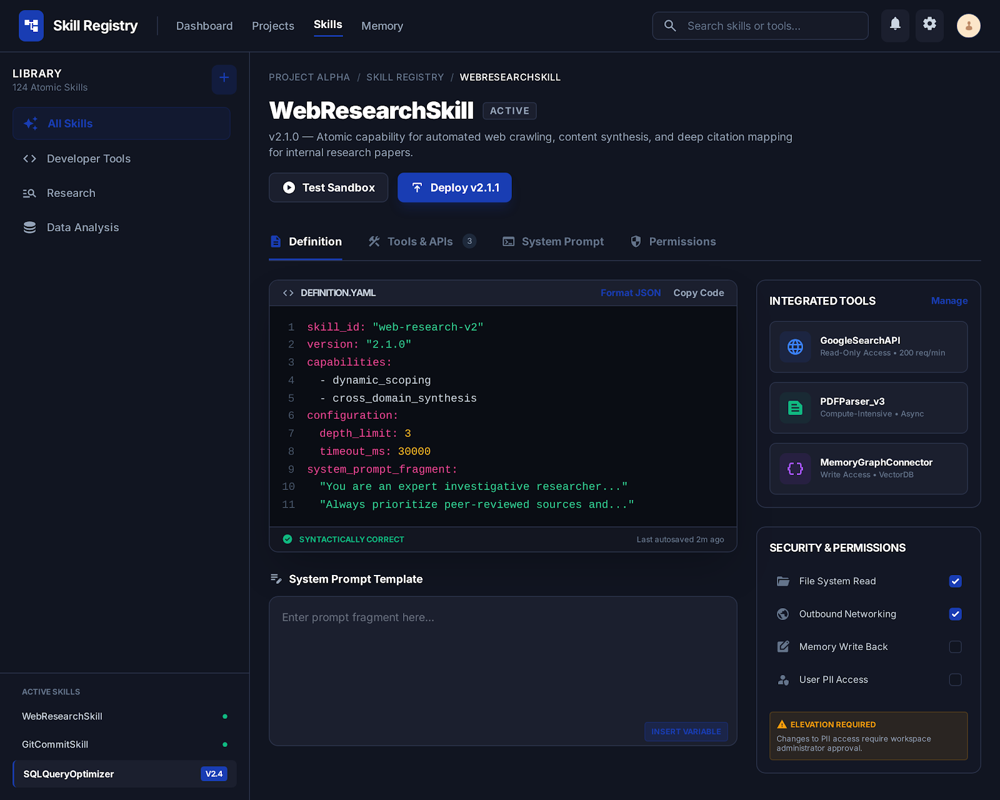

**交互模式实验室** - 经验沉淀、模式优化

/screen.png>)

### 15.2 页面结构

```
web/src/pages/
├── project/
│   ├── AgentChat.tsx           # 智能体聊天主页
│   ├── MemoryGraph.tsx         # 记忆图谱
│   └── MemorySearch.tsx        # 记忆搜索
├── tenant/
│   ├── SubAgentList.tsx        # 子智能体列表
│   ├── SubAgentDetail.tsx      # 子智能体详情
│   ├── SkillRegistry.tsx       # 技能注册中心
│   ├── SkillManagement.tsx     # 技能管理（多租户隔离）
│   ├── ToolManager.tsx         # 工具管理器
│   ├── RouterDashboard.tsx     # 路由器仪表板
│   └── InteractionPatterns.tsx  # 交互模式
```

### 15.3 核心组件

```
web/src/components/agent/
├── AgentChatContainer.tsx      # 聊天容器
├── MessageBubble.tsx           # 消息气泡
├── WorkPlanCard.tsx            # 工作计划卡片
├── ThoughtBubble.tsx           # 思考气泡
├── ToolCallCard.tsx            # 工具调用卡片
├── SubAgentCard.tsx            # 子智能体卡片
├── SubAgentConfigEditor.tsx    # 配置编辑器
├── SkillEditor.tsx             # 技能编辑器
├── ActivityTimeline.tsx        # 活动时间线
├── TokenUsageChart.tsx         # Token 使用图表
├── ToolCallVisualization.tsx   # 工具调用可视化
└── RouterFlowDiagram.tsx       # 路由流程图

web/src/components/skill/       # Skill 管理组件
├── SystemSkillList.tsx         # 系统 Skill 列表（只读 + 禁用/覆盖）
├── TenantSkillList.tsx         # 租户 Skill CRUD
├── ProjectSkillList.tsx        # 项目 Skill CRUD
├── SkillEditorModal.tsx        # Skill 创建/编辑对话框
└── SkillUploadModal.tsx        # SKILL.md 文件上传
```

### 15.4 状态管理 (Zustand)

```typescript
// stores/agentStore.ts
interface AgentState {
  conversations: Conversation[];
  currentConversation: Conversation | null;
  messages: Message[];
  workPlan: WorkPlan | null;
  isTyping: boolean;

  // Actions
  sendMessage: (message: string) => Promise<void>;
  setWorkPlan: (plan: WorkPlan) => void;
  addMessage: (message: Message) => void;
}

// stores/subAgentStore.ts
interface SubAgentState {
  agents: SubAgent[];
  selectedAgent: SubAgent | null;

  // Actions
  fetchAgents: () => Promise<void>;
  createAgent: (agent: CreateAgentRequest) => Promise<void>;
  updateAgent: (id: string, updates: Partial<SubAgent>) => Promise<void>;
  deleteAgent: (id: string) => Promise<void>;
}

// stores/skillStore.ts - Skill 多租户管理状态
interface SkillStore {
  // 三层 Skill 数据
  systemSkills: Skill[];
  tenantSkills: Skill[];
  projectSkills: Skill[];
  
  // 租户配置
  tenantConfigs: TenantSkillConfig[];
  
  // 加载状态
  loading: boolean;
  
  // Actions
  fetchSkills: (scope: 'system' | 'tenant' | 'project' | 'all') => Promise<void>;
  createSkill: (data: SkillCreate) => Promise<Skill>;
  updateSkill: (id: string, data: SkillUpdate) => Promise<Skill>;
  deleteSkill: (id: string) => Promise<void>;
  
  // 系统 Skill 配置操作
  disableSystemSkill: (skillName: string) => Promise<void>;
  enableSystemSkill: (skillName: string) => Promise<void>;
  overrideSystemSkill: (skillName: string, overrideId: string) => Promise<void>;
  
  // 配置获取
  fetchTenantConfigs: () => Promise<void>;
}

// 类型定义
interface TenantSkillConfig {
  id: string;
  systemSkillName: string;
  action: 'disable' | 'override';
  overrideSkillId?: string;
}

interface Skill {
  id: string;
  name: string;
  displayName: string;
  description: string;
  scope: 'system' | 'tenant' | 'project';
  isSystemSkill: boolean;
  isDisabled?: boolean;      // 仅系统 Skill
  isOverridden?: boolean;    // 仅系统 Skill
  content: string;
  enabled: boolean;
}
```

### 15.5 Skill 管理页面设计

#### 页面结构

```
Tenant Settings
└── Skills Management (SkillManagement.tsx)
    ├── System Skills Tab
    │   ├── [只读] code-review       [禁用] [覆盖]
    │   ├── [只读] doc-coauthoring   [已禁用] [启用]
    │   └── [只读] memory-querying   [已覆盖: custom-query]
    │
    ├── Tenant Skills Tab
    │   ├── [编辑] custom-review     [下载] [删除]
    │   ├── [编辑] data-analysis     [下载] [删除]
    │   └── [+ 创建新 Skill] 按钮
    │
    └── Project Skills Tab (可选，按项目筛选)
        └── [编辑] project-specific  [下载] [删除]
```

#### API 服务

```typescript
// services/skillService.ts
export const skillService = {
  // Skill CRUD
  list: (scope?: string, projectId?: string) => 
    api.get('/skills', { params: { scope, project_id: projectId } }),
  
  listSystem: () => 
    api.get('/skills/system'),
  
  create: (data: SkillCreate) => 
    api.post('/skills', data),
  
  update: (id: string, data: SkillUpdate) => 
    api.put(`/skills/${id}`, data),
  
  delete: (id: string) => 
    api.delete(`/skills/${id}`),
  
  getContent: (id: string) => 
    api.get(`/skills/${id}/content`),
  
  uploadContent: (id: string, content: string) => 
    api.put(`/skills/${id}/content`, { content }),
  
  // 租户配置
  getTenantConfig: () => 
    api.get('/tenant/skills/config'),
  
  disableSystemSkill: (skillName: string) => 
    api.post('/tenant/skills/disable', { skill_name: skillName }),
  
  enableSystemSkill: (skillName: string) => 
    api.post('/tenant/skills/enable', { skill_name: skillName }),
  
  overrideSystemSkill: (skillName: string, overrideSkillId: string) => 
    api.post('/tenant/skills/override', { 
      skill_name: skillName, 
      override_skill_id: overrideSkillId 
    }),
};
```

---

## 16. 实施路线图

### 16.1 当前实现状态

| 模块                    | 状态        | 完成度 |
| ----------------------- | ----------- | ------ |
| 领域模型 (Agent)        | ✅ 已实现   | 100%   |
| ReAct 智能体 (自研核心) | ✅ 已实现   | 100%   |
| 工作计划 & 步骤         | ✅ 已实现   | 100%   |
| 交互模式                | ✅ 已实现   | 90%    |
| 内置工具                | ✅ 已实现   | 80%    |
| SSE 事件流              | ✅ 已实现   | 85%    |
| 智能体聊天 UI           | ✅ 已实现   | 70%    |
| 子智能体管理            | 🔄 部分实现 | 30%    |
| 技能系统                | ❌ 未实现   | 0%     |
| MCP 集成                | ❌ 未实现   | 0%     |
| 活动日志可视化          | 🔄 部分实现 | 10%    |
| 路由器仪表板            | ❌ 未实现   | 0%     |
| Agent Temporal 工作流  | ✅ 已实现   | 85%    |

### 16.2 详细组件状态

| 组件                   | 完成度 | 关键文件                                                  |
| ---------------------- | ------ | --------------------------------------------------------- |
| **ReAct 核心引擎**     | 95%    | `react_agent.py`, `processor.py`, `llm_stream.py`         |
| **多层思考**           | 90%    | `plan_work.py`, `execute_step.py`, `work_plan.py`         |
| **SSE 流式传输**       | 95%    | `events.py`, `agent.py` (router)                          |
| **基础工具系统**       | 90%    | `tools/` 目录 (8 个工具)                                  |
| **工作流模式**         | 85%    | `workflow_pattern.py`, `learn_pattern.py`                 |
| **权限&成本&循环检测** | 95%    | `permission/`, `cost/`, `doom_loop/`                      |
| **前端聊天界面**       | 90%    | `AgentChat.tsx`, `MessageBubble.tsx`, `ChatInterface.tsx` |

### 16.3 缺失功能模块

| 功能模块                  | 优先级 | 依赖关系      |
| ------------------------- | ------ | ------------- |
| **SubAgent 系统**         | P0     | 独立          |
| **Skill 注册表**          | P0     | 独立          |
| **MCP 集成**              | P1     | 依赖 Skill    |
| **Tool Composition 执行** | P1     | 依赖基础工具  |
| **Context Compression**   | P2     | 依赖核心引擎  |
| **SubAgent 管理 UI**      | P1     | 依赖后端 API  |
| **Activity Log 可视化**   | P2     | 依赖 SSE 事件 |

### 16.4 分阶段实施计划

#### Phase 1: 核心能力扩展（P0 - 关键路径）

**目标**: 完成四层架构的 L2 (Skill) 和 L3 (SubAgent) 层

##### 任务 1.1: Skill System（技能系统）

**新增文件**:

- `src/domain/model/agent/skill.py` - Skill 实体
- `src/domain/ports/repositories/skill_repository.py` - Skill 仓储接口
- `src/infrastructure/agent/skill/registry.py` - Skill 注册表
- `src/infrastructure/agent/skill/parser.py` - SKILL.md 解析器
- `src/application/use_cases/agent/match_skills.py` - Skill 匹配用例

**API 端点** (`src/infrastructure/adapters/primary/web/routers/skill.py`):

| 方法   | 端点                        | 描述                  |
| ------ | --------------------------- | --------------------- |
| POST   | `/api/v1/skills`            | 创建 Skill            |
| GET    | `/api/v1/skills`            | 列出 Skills（租户级） |
| GET    | `/api/v1/skills/{skill_id}` | 获取 Skill 详情       |
| PUT    | `/api/v1/skills/{skill_id}` | 更新 Skill            |
| DELETE | `/api/v1/skills/{skill_id}` | 删除 Skill            |
| POST   | `/api/v1/skills/match`      | 匹配 Skill            |
| POST   | `/api/v1/skills/upload`     | 上传 SKILL.md 文件    |

##### 任务 1.2: SubAgent System（子智能体系统）

**新增文件**:

- `src/domain/model/agent/subagent.py` - SubAgent 实体
- `src/domain/ports/repositories/subagent_repository.py` - SubAgent 仓储接口
- `src/infrastructure/agent/subagent/registry.py` - SubAgent 注册表
- `src/infrastructure/agent/subagent/executor.py` - SubAgent 执行器
- `src/application/use_cases/agent/route_to_subagent.py` - SubAgent 路由用例

**API 端点** (`src/infrastructure/adapters/primary/web/routers/subagent.py`):

| 方法   | 端点                            | 描述               |
| ------ | ------------------------------- | ------------------ |
| POST   | `/api/v1/subagents`             | 创建 SubAgent      |
| GET    | `/api/v1/subagents`             | 列出 SubAgents     |
| GET    | `/api/v1/subagents/{id}`        | 获取 SubAgent 详情 |
| PUT    | `/api/v1/subagents/{id}`        | 更新 SubAgent      |
| DELETE | `/api/v1/subagents/{id}`        | 删除 SubAgent      |
| PATCH  | `/api/v1/subagents/{id}/enable` | 启用/禁用          |
| GET    | `/api/v1/subagents/{id}/stats`  | 获取统计信息       |
| POST   | `/api/v1/subagents/match`       | 匹配 SubAgent      |

##### 任务 1.3: 集成 Skill 和 SubAgent

**关键修改**:

1. 更新 `PlanStep` 实体，添加 `assigned_agent` 和 `required_skills` 字段
2. 增强 `SessionProcessor`，集成 SkillRegistry
3. 更新 SSE 事件，新增 `skill_activated`、`subagent_assigned` 等事件类型

---

#### Phase 2: 生态集成扩展（P1 - 重要特性）

##### 任务 2.1: MCP Integration（模型上下文协议集成）

**新增文件**:

- `src/infrastructure/agent/mcp/client.py` - MCP 客户端（支持 stdio, SSE, HTTP, WebSocket）
- `src/infrastructure/agent/mcp/registry.py` - MCP 服务器注册表
- `src/infrastructure/agent/mcp/adapter.py` - MCP 工具适配器

**API 端点**:

| 方法   | 端点                               | 描述            |
| ------ | ---------------------------------- | --------------- |
| GET    | `/api/v1/mcp/servers`              | 列出 MCP 服务器 |
| POST   | `/api/v1/mcp/servers`              | 注册 MCP 服务器 |
| GET    | `/api/v1/mcp/servers/{name}/tools` | 获取工具列表    |
| POST   | `/api/v1/mcp/servers/{name}/test`  | 测试连接        |
| DELETE | `/api/v1/mcp/servers/{name}`       | 删除服务器      |

##### 任务 2.2: Tool Composition Execution（工具组合执行）

**新增文件**:

- `src/infrastructure/agent/composition/executor.py` - 组合执行器
- `src/infrastructure/agent/composition/optimizer.py` - 组合优化器

**执行模式**:

- Sequential execution (顺序执行)
- Parallel execution (并行执行)
- Conditional execution (条件执行)

##### 任务 2.3: Context Compression（上下文压缩）

**新增文件**:

- `src/infrastructure/agent/compression/compressor.py` - 压缩器
- `src/infrastructure/agent/compression/strategy.py` - 压缩策略（SlidingWindow, Summarization, Hybrid）

---

#### Phase 3: 前端增强（P1-P2）

##### 任务 3.1: SubAgent Management UI

**新增组件**:

- `web/src/pages/tenant/SubAgentList.tsx` - SubAgent 列表页
- `web/src/pages/tenant/SubAgentDetail.tsx` - SubAgent 详情页
- `web/src/components/agent/SubAgentCard.tsx` - SubAgent 卡片组件
- `web/src/components/agent/SubAgentConfigEditor.tsx` - 配置编辑器
- `web/src/components/agent/RouterFlowDiagram.tsx` - 路由流程图
- `web/src/stores/subagent.ts` - 状态管理
- `web/src/services/subagentService.ts` - API 服务

##### 任务 3.2: Skill Registry UI

**新增组件**:

- `web/src/pages/tenant/SkillRegistry.tsx` - 技能注册表页
- `web/src/components/agent/SkillEditor.tsx` - 技能编辑器
- `web/src/components/agent/SkillCard.tsx` - 技能卡片
- `web/src/stores/skill.ts` - 状态管理
- `web/src/services/skillService.ts` - API 服务

##### 任务 3.3: Activity Log Visualization

**新增组件**:

- `web/src/components/agent/ActivityTimeline.tsx` - 活动时间线
- `web/src/components/agent/TokenUsageChart.tsx` - Token 使用图表
- `web/src/components/agent/ToolCallVisualization.tsx` - 工具调用图

---

#### Phase 4: 端点整合与优化（P2）

##### 任务 4.1: Endpoint Consolidation

**目标**: 合并 `/api/v1/agent/chat` 和 `/api/v1/agent/chat-v2`

**策略**:

1. 保留 `/chat-v2` 作为主端点
2. `/chat` 添加 `@deprecated` 标记
3. 添加版本协商机制
4. 更新前端调用
5. 保留 `/chat` 端点 3 个月（宽限期）

##### 任务 4.2: Performance Optimization

**优化项**:

1. 数据库查询优化
2. 缓存策略（SubAgent/Skill 配置缓存）
3. SSE 性能优化

### 16.5 依赖关系图

```
Phase 1 (P0):
  Skill System ─────┐
                    ├──► Skill + SubAgent Integration
  SubAgent System ──┘

Phase 2 (P1):
  MCP Integration ◄─── depends on ─── Skill System
  Tool Composition ◄── depends on ─── Basic Tools

Phase 3 (P1-P2):
  SubAgent UI ◄──── depends on ────── SubAgent API
  Skill UI ◄─────── depends on ────── Skill API
  Activity Log UI ◄─ depends on ────── SSE Events

Phase 4 (P2):
  Endpoint Consolidation
  Performance Optimization
```

**关键路径**: Skill System → SubAgent System → SubAgent UI

### 16.6 测试策略

#### 单元测试覆盖率目标

| 模块           | 目标覆盖率 |
| -------------- | ---------- |
| Domain Models  | 90%+       |
| Use Cases      | 80%+       |
| Infrastructure | 70%+       |
| API Endpoints  | 80%+       |

#### 集成测试关键场景

1. **SubAgent 路由测试**: 验证正确路由到对应 SubAgent
2. **Skill 匹配测试**: 验证关键词/语义/混合匹配
3. **MCP 集成测试**: 工具发现和执行
4. **Tool Composition 测试**: 顺序/并行/条件执行

#### 前端测试

- **单元测试** (Vitest): 组件测试
- **E2E 测试** (Playwright): 完整流程测试

### 16.7 风险与缓解

| 风险                | 影响 | 缓解措施           |
| ------------------- | ---- | ------------------ |
| MCP 生态不成熟      | 高   | MCP 作为可选扩展   |
| LLM 成本过高        | 中   | 实施缓存策略       |
| SubAgent 路由不准确 | 中   | 提供手动指定选项   |
| 数据库性能瓶颈      | 中   | 添加索引，实施缓存 |

### 16.8 数据库 Schema 扩展

#### 新增表

| 表名                | 描述               |
| ------------------- | ------------------ |
| `skills`            | 技能定义和配置     |
| `subagents`         | 子智能体定义和配置 |
| `tool_compositions` | 工具组合定义       |
| `mcp_servers`       | MCP 服务器配置     |

#### 表结构修改

```sql
-- 更新 plan_steps 表
ALTER TABLE plan_steps ADD COLUMN assigned_agent VARCHAR;
ALTER TABLE plan_steps ADD COLUMN required_skills JSON;
```

### 16.9 里程碑

| 里程碑       | 交付物                   |
| ------------ | ------------------------ |
| M1: 核心完善 | SSE 完善、活动日志可视化 |
| M2: 子智能体 | 子智能体管理、路由器     |
| M3: 技能系统 | 技能注册中心、匹配引擎   |
| M4: MCP 集成 | MCP 客户端、工具发现     |
| M5: 正式发布 | 80%+ 测试覆盖、文档完善  |

### 16.10 关键文件清单

#### 后端新增文件

```
src/domain/model/agent/
├── skill.py                    # Skill 实体（扩展 SkillScope 枚举）
├── subagent.py                 # SubAgent 实体
└── tenant_skill_config.py      # 租户 Skill 配置实体

src/domain/ports/repositories/
├── skill_repository.py         # Skill 仓储接口（扩展 scope 参数）
├── subagent_repository.py      # SubAgent 仓储接口
└── tenant_skill_config_repository.py  # 租户配置仓储接口

src/infrastructure/agent/
├── skill/
│   ├── registry.py             # Skill 注册表
│   └── parser.py               # SKILL.md 解析器
├── subagent/
│   ├── registry.py             # SubAgent 注册表
│   └── executor.py             # SubAgent 执行器
├── mcp/
│   ├── client.py               # MCP 客户端
│   ├── registry.py             # MCP 服务器注册表
│   └── adapter.py              # MCP 工具适配器
└── compression/
    ├── compressor.py           # 压缩器
    └── strategy.py             # 压缩策略

src/builtin/skills/             # 系统级 Skills（只读）
├── code-review.md
├── doc-coauthoring.md
└── memory-graph-querying.md

src/application/services/
├── skill_service.py            # 三层加载逻辑
└── filesystem_skill_loader.py  # 系统 Skill 加载

src/application/use_cases/agent/
├── match_skills.py             # Skill 匹配用例
└── route_to_subagent.py        # SubAgent 路由用例

src/infrastructure/adapters/primary/web/routers/
├── skill.py                    # Skill API（扩展 scope 支持）
├── tenant_skill_config.py      # 租户 Skill 配置 API
├── subagent.py                 # SubAgent API
└── mcp.py                      # MCP API

src/infrastructure/adapters/secondary/persistence/
└── sql_tenant_skill_config_repository.py  # 配置仓储实现
```

#### 前端新增文件

```
web/src/pages/tenant/
├── SubAgentList.tsx            # SubAgent 列表页
├── SubAgentDetail.tsx          # SubAgent 详情页
├── SkillRegistry.tsx           # 技能注册表页
└── SkillManagement.tsx         # 技能管理（多租户隔离）

web/src/components/agent/
├── SubAgentCard.tsx            # SubAgent 卡片
├── SubAgentConfigEditor.tsx    # SubAgent 配置编辑器
├── RouterFlowDiagram.tsx       # 路由流程图
├── SkillEditor.tsx             # 技能编辑器
├── SkillCard.tsx               # 技能卡片
├── ActivityTimeline.tsx        # 活动时间线
├── TokenUsageChart.tsx         # Token 使用图表
└── ToolCallVisualization.tsx   # 工具调用图

web/src/components/skill/       # Skill 管理组件
├── SystemSkillList.tsx         # 系统 Skill 列表
├── TenantSkillList.tsx         # 租户 Skill 列表
├── ProjectSkillList.tsx        # 项目 Skill 列表
├── SkillEditorModal.tsx        # Skill 编辑对话框
└── SkillUploadModal.tsx        # SKILL.md 上传

web/src/stores/
├── subagent.ts                 # SubAgent 状态管理
└── skill.ts                    # Skill 状态管理（含租户配置）

web/src/services/
├── subagentService.ts          # SubAgent API 服务
├── skillService.ts             # Skill API 服务（扩展租户配置）
└── mcpService.ts               # MCP API 服务
```

#### 数据库迁移文件

```
alembic/versions/
├── agent_005_add_skills_table.py
├── agent_006_add_subagents_table.py
├── agent_007_add_compositions_table.py
├── agent_008_add_mcp_servers_table.py
└── agent_009_add_skill_scope_and_tenant_configs.py  # Skill 多租户隔离
```

---

## 附录

### A. 性能要求

| 指标         | 要求       |
| ------------ | ---------- |
| 工作级规划   | < 5 秒     |
| 模式查找     | < 100ms    |
| SSE 事件发送 | < 500ms    |
| 并发执行     | 支持 10 个 |
| 内存限制     | < 512MB    |

### B. 安全要求

1. **多租户隔离**: 交互模式按租户隔离
2. **项目范围**: 对话按项目隔离
3. **SSE 认证**: 5 分钟重新认证
4. **经验沉淀**: 可通过租户设置关闭

### C. 参考资料

#### C.1 架构设计参考

- [JoyAgent-JDGenie](https://github.com/jd-opensource/joyagent-jdgenie) - 多层思考参考
- [Claude Code Plugin Architecture](vendor/claude-code/) - 插件架构参考
- [LangGraph Documentation](https://langchain-ai.github.io/langgraph/) - 状态机框架
- [Model Context Protocol](https://modelcontextprotocol.io/) - MCP 规范

#### C.2 OpenCode 实现参考

Vanus 的人类交互机制设计参考了 [OpenCode](vendor/opencode/) 的最佳实践，以下为关键参考点：

**C.2.1 Question 系统**

- **源码位置**: `vendor/opencode/packages/opencode/src/question/index.ts`
- **核心实现**:
  - `Question.ask()` - 异步等待用户回答
  - `Question.reply()` - 用户回答处理
  - `Question.reject()` - 用户拒绝处理
  - 基于 Promise 的事件驱动架构
  - 支持单选和多选
  - 可配置超时时间
- **SSE 事件**: `question.asked`, `question.replied`, `question.rejected`

**C.2.2 Permission 权限系统**

- **源码位置**:
  - `vendor/opencode/packages/opencode/src/permission/index.ts`
  - `vendor/opencode/packages/opencode/src/permission/next.ts`
  - `vendor/opencode/packages/opencode/src/permission/arity.ts`
- **核心实现**:
  - `PermissionNext.ask()` - 请求权限
  - `PermissionNext.reply()` - 处理用户响应
  - 三种响应: `once` (一次性), `always` (总是允许), `reject` (拒绝)
  - 支持通配符模式匹配
  - 规则引擎：允许、拒绝、询问三种操作
  - Doom loop 检测：相同工具重复调用阈值检测
- **工具集成**: Bash 工具自动提取目录访问和命令模式
- **权限模型**: 面向工具的权限，支持模式匹配

**C.2.3 工具执行流程**

- **源码位置**: `vendor/opencode/packages/opencode/src/tool/tool.ts`
- **关键特性**:
  - 统一工具接口 `Tool.define()`
  - 参数验证 (Zod schema)
  - 上下文传递 (sessionID, messageID, callID)
  - `ctx.ask()` - 工具内请求权限/提问
  - 结果格式化 (title, output, metadata)
  - 输出截断处理 (Truncate 模块)

**C.2.4 Plan 模式切换**

- **源码位置**: `vendor/opencode/packages/opencode/src/tool/plan.ts`
- **核心实现**:
  - `PlanEnterTool` - 进入规划模式确认
  - `PlanExitTool` - 退出规划模式确认
  - 使用 `Question.ask()` 获取用户确认
  - 切换 agent (plan ↔ build)
  - 合成用户消息触发模式转换

**C.2.5 Session 处理器**

- **源码位置**: `vendor/opencode/packages/opencode/src/session/processor.ts`
- **关键流程**:
  - LLM 流式处理
  - 工具调用生命周期管理 (pending → running → completed/error)
  - Doom loop 自动检测 (3 次重复调用)
  - 异常重试机制
  - 步骤开始/完成跟踪
  - 消息部分更新

**C.2.6 Agent 配置**

- **源码位置**: `vendor/opencode/packages/opencode/src/agent/agent.ts`
- **关键特性**:
  - 多 agent 类型 (build, plan, general, explore)
  - 权限规则集配置
  - 模型、温度、topP 可配置
  - Agent 隐藏标记
  - 步骤数限制
  - 用户自定义 agent 支持

**C.2.7 设计模式总结**

| 模式                 | 描述                | OpenCode 实现                 | Vanus 应用 |
| -------------------- | ------------------- | ----------------------------- | ---------- |
| **Promise-based**    | 异步等待用户输入    | `Question.ask()` 返回 Promise | 相同模式   |
| **Event-driven**     | 基于 Bus 事件流     | `Bus.publish()` 广播事件      | 相同模式   |
| **Permission Model** | 工具级权限控制      | `PermissionNext.ask()`        | 相同模式   |
| **Doom Loop**        | 重复调用检测        | 检测窗口 60s，阈值 3 次       | 相同模式   |
| **Agent Switch**     | 运行时 agent 切换   | Plan enter/exit 工具          | 相同模式   |
| **Tool Integration** | 工具内调用权限/问题 | `ctx.ask()` 上下文方法        | 相同模式   |
| **Timeout Handling** | 用户响应超时处理    | 可配置超时，自动拒绝          | 相同模式   |

**C.2.8 关键设计决策**

1. **澄清与决策分离**: 规划阶段用 `ClarificationType`，执行阶段用 `DecisionType`
2. **推荐选项标记**: 通过 `is_recommended` 标记建议选项
3. **自定义输入支持**: 用户始终可选择 "Other" 提供自定义答案
4. **权限持久化**: `always` 响应持久化权限规则到会话
5. **Doom loop 早期检测**: 在工具调用前检测，避免资源浪费
6. **可配置性**: 所有超时、阈值、规则都可配置
7. **错误处理**: `RejectedError`, `CorrectedError`, `DeniedError` 区分不同拒绝场景

### D. Agent Skills 开放标准

> **参考来源**: [agentskills.io](https://agentskills.io)、[Anthropic Skills GitHub](https://github.com/anthropics/skills)、[Claude Platform Docs](https://platform.claude.com/docs/en/agents-and-tools/agent-skills/best-practices)

#### D.1 概述

**Agent Skills** 是一种轻量级、开放的格式，用于扩展 AI 智能体的能力，为其提供专业知识和工作流程。

**官方定义**:
> "Agent Skills are folders of instructions, scripts, and resources that agents can discover and use to do things more accurately and efficiently."

**核心价值**:

| 特性 | 描述 |
|------|------|
| **程序性知识** | 为智能体提供领域特定的专业知识和操作指南 |
| **按需加载** | 基于任务动态加载领域能力，高效利用上下文窗口 |
| **可复用** | 跨平台、跨智能体共享，版本可控 |
| **开放标准** | 由 Anthropic 发起，支持多平台集成（VS Code、Claude.ai、API） |

#### D.2 Skill 目录结构

一个 Skill 是一个包含 `SKILL.md` 文件的目录：

```
my-skill/
├── SKILL.md              # 必需：元数据和指令（YAML frontmatter + Markdown）
├── scripts/              # 可选：可执行脚本
│   ├── parse_pdf.py
│   └── validate_data.sh
├── references/           # 可选：参考文档
│   ├── API_GUIDE.md
│   └── EXAMPLES.md
└── assets/               # 可选：资源文件
    ├── template.xlsx
    └── config.json
```

**目录命名规范**:
- 使用小写字母和连字符（kebab-case）
- 目录名必须与 `SKILL.md` 中的 `name` 字段一致

#### D.3 SKILL.md 格式规范

##### D.3.1 基本结构

```markdown
---
name: pdf-processing
description: |
  Process and analyze PDF documents, extract text, tables, and metadata.
  Use when user asks to "analyze PDF", "extract from PDF", or "parse document".
license: MIT
compatibility:
  - claude-3-opus
  - claude-3-sonnet
allowed-tools:
  - Bash
  - Read
  - Write
metadata:
  version: "1.0.0"
  author: "team@example.com"
---

# PDF Processing Skill

## Overview

This skill provides guidance for processing PDF documents...

## Workflows

### Extract Text from PDF

1. [ ] Verify PDF file exists
2. [ ] Use `pdftotext` or Python `PyPDF2` to extract
3. [ ] Clean and format extracted text
4. [ ] Return structured output

## Reference

See [API Guide](references/API_GUIDE.md) for detailed API documentation.
```

##### D.3.2 必需字段

| 字段 | 规范 | 说明 |
|------|------|------|
| `name` | 1-64 字符，小写，仅允许字母、数字、连字符 | 技能唯一标识符，必须与目录名一致 |
| `description` | 1-1024 字符，禁止 `<` 和 `>` | **主要触发机制**，包含关键词以提高可发现性 |

##### D.3.3 可选字段

| 字段 | 说明 |
|------|------|
| `license` | 许可证（如 MIT、Apache-2.0） |
| `compatibility` | 兼容的模型列表 |
| `allowed-tools` | 技能可使用的工具白名单 |
| `metadata` | 自定义元数据（版本、作者等） |

##### D.3.4 Markdown 正文规范

- **行数限制**: SKILL.md 应保持在 500 行以内
- **渐进式披露**: 复杂内容放入 `references/` 目录，按需加载
- **引用路径**: 使用相对路径，如 `[reference](references/REFERENCE.md)`
- **嵌套深度**: 避免深层嵌套，引用文件保持一级深度

#### D.4 触发机制：渐进式披露

Agent Skills 采用**渐进式披露（Progressive Disclosure）**机制，高效利用上下文窗口：

```mermaid
flowchart TD
    A[用户查询] --> B[加载所有 Skill 元数据]
    B --> C[仅加载 name + description]
    C --> D{匹配检测}
    D -->|description 关键词匹配| E[激活 Skill]
    D -->|无匹配| F[跳过]
    E --> G[加载完整 SKILL.md]
    G --> H[按需加载 references/]
    H --> I[执行任务]
```

**关键点**:
1. **初始阶段**: 仅加载 `name` 和 `description` 字段
2. **匹配阶段**: `description` 是主要触发机制，应包含关键触发词
3. **激活阶段**: 匹配成功后加载完整指令
4. **扩展阶段**: 复杂任务按需加载参考文档

#### D.5 集成方式

##### D.5.1 文件系统型集成

智能体通过 shell 命令读取技能：

```bash
# 读取技能元数据
cat /path/to/skills/my-skill/SKILL.md

# 执行技能脚本
bash /path/to/skills/my-skill/scripts/process.sh
```

##### D.5.2 工具型集成

通过自定义工具调用：

```python
# 技能发现
available_skills = skill_registry.list_skills()

# 技能激活
skill = skill_registry.activate("pdf-processing")

# 执行技能脚本
result = skill.execute_script("parse_pdf.py", args={"file": "doc.pdf"})
```

##### D.5.3 系统提示注入

将技能元数据以 XML 格式注入系统提示：

```xml
<available_skills>
  <skill name="pdf-processing">
    Process and analyze PDF documents, extract text, tables, and metadata.
  </skill>
  <skill name="data-analysis">
    Analyze datasets, generate visualizations, and produce statistical reports.
  </skill>
</available_skills>
```

#### D.6 编写最佳实践

##### D.6.1 核心原则

| 原则 | 说明 |
|------|------|
| **简洁性** | 保持 SKILL.md 精简，保留上下文窗口空间 |
| **可发现性** | description 包含关键触发词，使用第三人称 |
| **渐进式披露** | 复杂内容拆分到 references/，按需加载 |
| **工作流导向** | 使用检查列表组织复杂任务 |

##### D.6.2 命名规范

```yaml
# 好的命名（动名词形式）
name: processing-pdfs
name: analyzing-data
name: generating-reports

# 避免的命名
name: pdf_processor      # 下划线
name: DataAnalysis       # 大写字母
name: my-awesome-skill   # 无意义描述
```

##### D.6.3 Description 编写

```yaml
# 好的 description
description: |
  Process and analyze PDF documents. Extract text, tables, images, and metadata.
  Use when user asks to "parse PDF", "extract from document", "analyze PDF content",
  or needs to work with PDF files.

# 避免的 description
description: A skill for PDFs.  # 太简短，缺少触发词
```

##### D.6.4 工作流组织

```markdown
## Workflows

### Task Name

**Prerequisites:**
- Required tool: `pdftotext`
- Input: PDF file path

**Steps:**
1. [ ] Validate input file exists
2. [ ] Extract raw text using `pdftotext`
3. [ ] Parse extracted content
4. [ ] Format output as structured JSON
5. [ ] Verify output completeness

**Validation:**
- [ ] Output contains expected sections
- [ ] No extraction errors reported
```

##### D.6.5 脚本编写

```python
# scripts/parse_pdf.py
"""PDF parsing script with proper error handling."""

import sys
import json
from pathlib import Path

def parse_pdf(file_path: str) -> dict:
    """Parse PDF and return structured data.
    
    Args:
        file_path: Path to PDF file
        
    Returns:
        dict with extracted content
        
    Raises:
        FileNotFoundError: If PDF doesn't exist
        ValueError: If PDF is invalid
    """
    path = Path(file_path)
    if not path.exists():
        raise FileNotFoundError(f"PDF not found: {file_path}")
    
    # ... parsing logic ...
    
    return {"status": "success", "content": extracted_text}

if __name__ == "__main__":
    if len(sys.argv) < 2:
        print(json.dumps({"error": "Usage: parse_pdf.py <file_path>"}))
        sys.exit(1)
    
    try:
        result = parse_pdf(sys.argv[1])
        print(json.dumps(result))
    except Exception as e:
        print(json.dumps({"error": str(e)}))
        sys.exit(1)
```

##### D.6.6 安全考虑

| 安全措施 | 说明 |
|----------|------|
| **沙箱执行** | 脚本应在隔离环境中执行 |
| **输入验证** | 验证所有外部输入 |
| **危险操作确认** | 删除、修改等操作需用户确认 |
| **日志记录** | 记录所有脚本执行和结果 |
| **环境变量** | API 密钥等敏感信息使用环境变量 |

#### D.7 测试与验证

##### D.7.1 验证工具

```bash
# 使用官方验证工具
skills-ref validate ./my-skill

# 验证 SKILL.md 格式
skills-ref lint ./my-skill/SKILL.md
```

##### D.7.2 跨模型测试

| 模型 | 测试目的 |
|------|----------|
| Claude Haiku | 验证简单场景，快速迭代 |
| Claude Sonnet | 验证标准场景，平衡性能 |
| Claude Opus | 验证复杂场景，最高质量 |

##### D.7.3 评估方法

1. **观察导航**: 观察智能体如何发现和激活技能
2. **验证输出**: 检查技能执行结果是否符合预期
3. **迭代优化**: 基于实际使用反馈持续改进

#### D.8 Vanus 技能系统与 Agent Skills 标准对照

| Agent Skills 标准 | Vanus 实现 | 说明 |
|-------------------|------------|------|
| `SKILL.md` 文件 | `Skill` 实体 + `content` 字段 | 数据库存储，支持 Web 管理 |
| `name` 字段 | `Skill.name` | 唯一标识，kebab-case |
| `description` 字段 | `Skill.description` | 用于触发匹配 |
| 渐进式披露 | 三层加载（系统/租户/项目） | 扩展为多租户隔离 |
| `scripts/` 目录 | `allowed_tools` 配置 | 通过工具系统实现 |
| `references/` 目录 | `resources` 字段 | 支持关联资源 |
| 文件系统存储 | PostgreSQL + 系统级文件 | 混合存储架构 |
| 单一作用域 | 三层作用域（system/tenant/project） | 扩展支持多租户 |

#### D.9 参考资源

| 资源 | 链接 | 说明 |
|------|------|------|
| Agent Skills 官网 | https://agentskills.io | 规范首页 |
| 规范文档 | https://agentskills.io/specification | SKILL.md 格式定义 |
| Anthropic Skills 仓库 | https://github.com/anthropics/skills | 官方示例和模板 |
| Claude 最佳实践 | https://platform.claude.com/docs/en/agents-and-tools/agent-skills/best-practices | 编写指南 |
| VS Code 集成 | https://code.visualstudio.com/docs/copilot/customization/agent-skills | GitHub Copilot 集成 |

**文档状态**: 探索中
**最后更新**: 2026-01-22
**维护者**: tiejun.sun
