# MemStack (Vanus) 架构图集

> **版本**: 1.0.0  
> **创建日期**: 2026-01-20  
> **作者**: MemStack Platform Team  
> **适用版本**: MemStack v0.0.6+

本文档提供 MemStack 企业级 AI 智能体平台的完整架构图集，涵盖系统全景、能力模型、技术组件、数据流和部署架构等多个维度。

---

## 目录

1. [平台架构全景图](#1-平台架构全景图)
2. [四层能力递进模型](#2-四层能力递进模型)
3. [六边形架构详图](#3-六边形架构详图)
4. [智能体系统架构](#4-智能体系统架构)
5. [知识图谱系统](#5-知识图谱系统)
6. [数据流架构](#6-数据流架构)
7. [部署架构图](#7-部署架构图)
8. [技术栈全景](#8-技术栈全景)

---

## 1. 平台架构全景图

### 1.1 系统整体架构

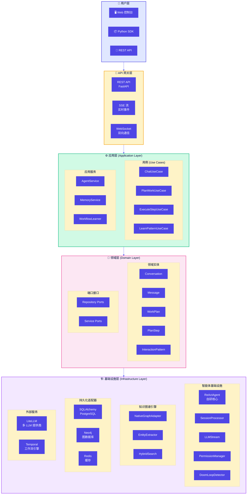
```mermaid
%%{init: {'theme': 'base', 'themeVariables': { 'primaryColor': '#4f46e5', 'primaryTextColor': '#fff', 'primaryBorderColor': '#4f46e5', 'lineColor': '#6366f1', 'secondaryColor': '#f0abfc', 'tertiaryColor': '#fef3c7'}}}%%
graph TB
    subgraph Users["👥 用户层"]
        direction LR
        WebUI["🖥️ Web 控制台"]
        SDK["📦 Python SDK"]
        API["🔌 REST API"]
    end

    subgraph Gateway["🚪 API 网关层"]
        direction LR
        REST["REST API<br/>FastAPI"]
        SSE["SSE 流<br/>实时事件"]
        WS["WebSocket<br/>双向通信"]
    end

    subgraph AppLayer["⚙️ 应用层 (Application Layer)"]
        direction TB
        subgraph UseCases["用例 (Use Cases)"]
            UC1["ChatUseCase"]
            UC2["PlanWorkUseCase"]
            UC3["ExecuteStepUseCase"]
            UC4["LearnPatternUseCase"]
        end
        subgraph AppServices["应用服务"]
            AS1["AgentService"]
            AS2["MemoryService"]
            AS3["WorkflowLearner"]
        end
    end

    subgraph DomainLayer["💎 领域层 (Domain Layer)"]
        direction TB
        subgraph Entities["领域实体"]
            E1["Conversation"]
            E2["Message"]
            E3["WorkPlan"]
            E4["PlanStep"]
            E5["InteractionPattern"]
        end
        subgraph Ports["端口接口"]
            P1["Repository Ports"]
            P2["Service Ports"]
        end
    end

    subgraph InfraLayer["🏗️ 基础设施层 (Infrastructure Layer)"]
        direction TB
        subgraph AgentInfra["智能体基础设施"]
            AI1["ReActAgent<br/>自研核心"]
            AI2["SessionProcessor"]
            AI3["LLMStream"]
            AI4["PermissionManager"]
            AI5["DoomLoopDetector"]
        end
        subgraph GraphInfra["知识图谱引擎"]
            GI1["NativeGraphAdapter"]
            GI2["EntityExtractor"]
            GI3["HybridSearch"]
        end
        subgraph Persistence["持久化适配器"]
            DB1["SQLAlchemy<br/>PostgreSQL"]
            DB2["Neo4j<br/>图数据库"]
            DB3["Redis<br/>缓存"]
        end
        subgraph External["外部服务"]
            EX1["LiteLLM<br/>多 LLM 提供商"]
            EX2["Temporal<br/>工作流引擎"]
        end
    end

    Users --> Gateway
    Gateway --> AppLayer
    AppLayer --> DomainLayer
    DomainLayer --> InfraLayer

    style Users fill:#e0e7ff,stroke:#4f46e5,stroke-width:2px
    style Gateway fill:#fef3c7,stroke:#f59e0b,stroke-width:2px
    style AppLayer fill:#d1fae5,stroke:#10b981,stroke-width:2px
    style DomainLayer fill:#fce7f3,stroke:#ec4899,stroke-width:2px
    style InfraLayer fill:#f3e8ff,stroke:#a855f7,stroke-width:2px
```

### 1.2 核心价值主张

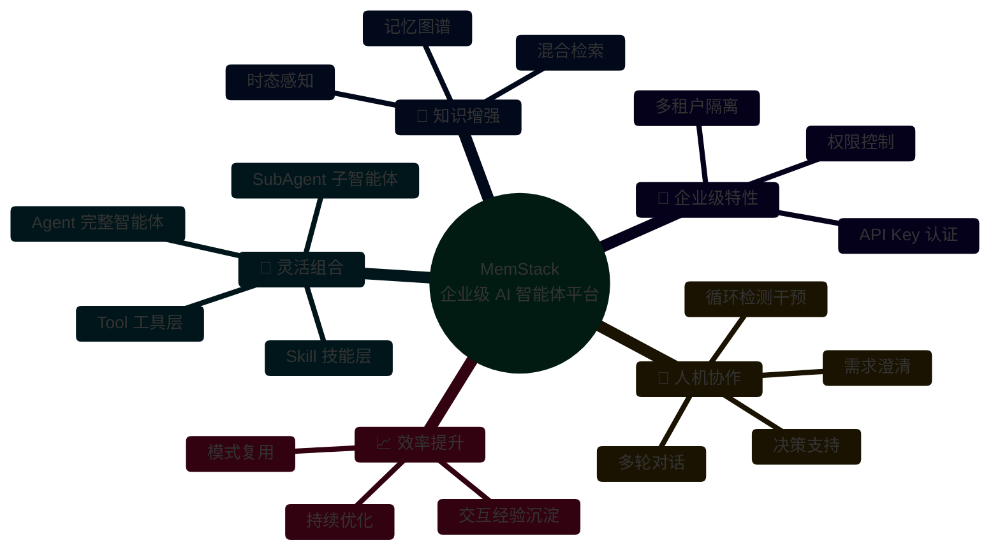
```mermaid
%%{init: {'theme': 'base', 'themeVariables': { 'primaryColor': '#059669'}}}%%
mindmap
  root((MemStack<br/>企业级 AI 智能体平台))
    🤝 人机协作
      多轮对话
      需求澄清
      决策支持
      循环检测干预
    📈 效率提升
      交互经验沉淀
      模式复用
      持续优化
    🔧 灵活组合
      Tool 工具层
      Skill 技能层
      SubAgent 子智能体
      Agent 完整智能体
    🧠 知识增强
      记忆图谱
      时态感知
      混合检索
    🏢 企业级特性
      多租户隔离
      API Key 认证
      权限控制
```

---

## 2. 四层能力递进模型

### 2.1 能力递进总览

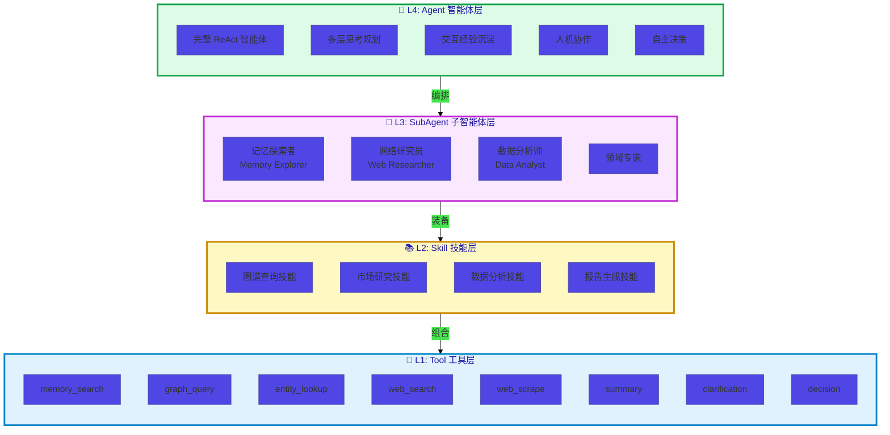
```mermaid
%%{init: {'theme': 'base', 'themeVariables': { 'primaryColor': '#4f46e5'}}}%%
graph TB
    subgraph L4["🤖 L4: Agent 智能体层"]
        direction TB
        A1["完整 ReAct 智能体"]
        A2["多层思考规划"]
        A3["交互经验沉淀"]
        A4["人机协作"]
        A5["自主决策"]
    end

    subgraph L3["👥 L3: SubAgent 子智能体层"]
        direction TB
        SA1["记忆探索者<br/>Memory Explorer"]
        SA2["网络研究员<br/>Web Researcher"]
        SA3["数据分析师<br/>Data Analyst"]
        SA4["领域专家"]
    end

    subgraph L2["📚 L2: Skill 技能层"]
        direction TB
        S1["图谱查询技能"]
        S2["市场研究技能"]
        S3["数据分析技能"]
        S4["报告生成技能"]
    end

    subgraph L1["🔧 L1: Tool 工具层"]
        direction TB
        T1["memory_search"]
        T2["graph_query"]
        T3["entity_lookup"]
        T4["web_search"]
        T5["web_scrape"]
        T6["summary"]
        T7["clarification"]
        T8["decision"]
    end

    L4 -->|"编排"| L3
    L3 -->|"装备"| L2
    L2 -->|"组合"| L1

    style L4 fill:#dcfce7,stroke:#16a34a,stroke-width:3px
    style L3 fill:#fae8ff,stroke:#c026d3,stroke-width:3px
    style L2 fill:#fef9c3,stroke:#ca8a04,stroke-width:3px
    style L1 fill:#e0f2fe,stroke:#0284c7,stroke-width:3px
```

### 2.2 层级详细说明

```mermaid
%%{init: {'theme': 'base'}}%%
flowchart LR
    subgraph Layer1["L1: Tool 工具层"]
        direction TB
        L1_DESC["原子能力单元<br/>执行单一明确任务"]
        L1_FEAT["✅ 8+ 内置工具<br/>✅ MCP 扩展支持<br/>✅ 权限控制<br/>✅ 成本追踪"]
    end

    subgraph Layer2["L2: Skill 技能层"]
        direction TB
        L2_DESC["声明式知识文档<br/>封装工具使用模式"]
        L2_FEAT["✅ 触发条件激活<br/>✅ Markdown 格式<br/>✅ 版本管理<br/>✅ 工具组合"]
    end

    subgraph Layer3["L3: SubAgent 层"]
        direction TB
        L3_DESC["专业化智能体<br/>具备特定领域能力"]
        L3_FEAT["✅ 工具集配置<br/>✅ 技能集配置<br/>✅ 并行/顺序编排<br/>✅ 独立 System Prompt"]
    end

    subgraph Layer4["L4: Agent 层"]
        direction TB
        L4_DESC["完整 ReAct 智能体<br/>多层思考与规划"]
        L4_FEAT["✅ 工作级规划<br/>✅ 任务级执行<br/>✅ 经验沉淀<br/>✅ 人机协作"]
    end

    Layer1 --> Layer2 --> Layer3 --> Layer4

    style Layer1 fill:#dbeafe,stroke:#2563eb,stroke-width:2px
    style Layer2 fill:#fef3c7,stroke:#d97706,stroke-width:2px
    style Layer3 fill:#f3e8ff,stroke:#9333ea,stroke-width:2px
    style Layer4 fill:#dcfce7,stroke:#16a34a,stroke-width:2px
```

### 2.3 工具系统详图

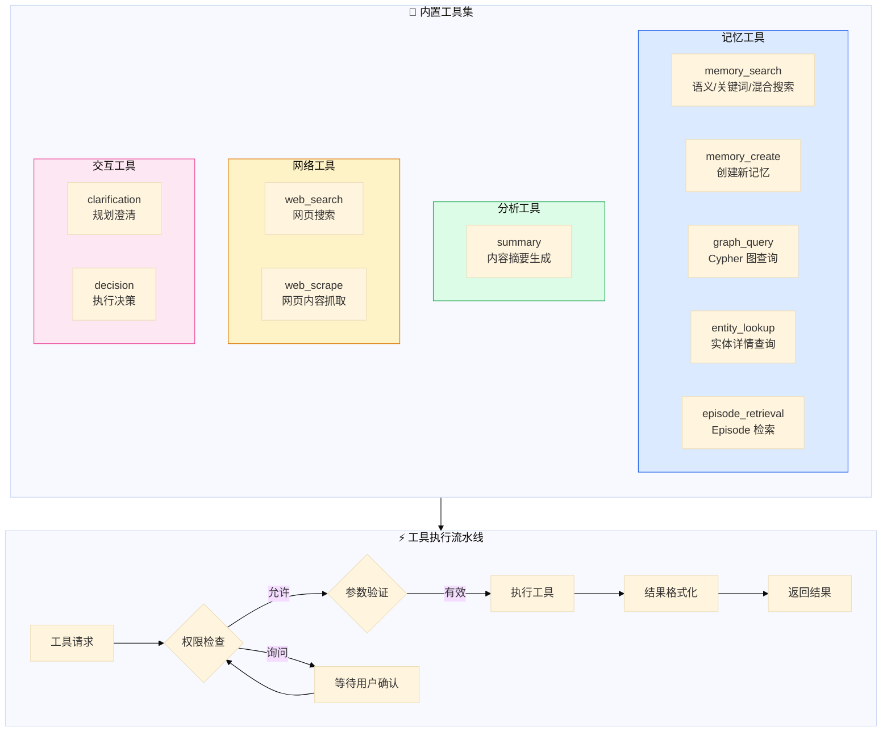
```mermaid
%%{init: {'theme': 'base'}}%%
flowchart TB
    subgraph Tools["🔧 内置工具集"]
        direction TB
        subgraph MemoryTools["记忆工具"]
            MT1["memory_search<br/>语义/关键词/混合搜索"]
            MT2["memory_create<br/>创建新记忆"]
            MT3["graph_query<br/>Cypher 图查询"]
            MT4["entity_lookup<br/>实体详情查询"]
            MT5["episode_retrieval<br/>Episode 检索"]
        end
        subgraph AnalysisTools["分析工具"]
            AT1["summary<br/>内容摘要生成"]
        end
        subgraph WebTools["网络工具"]
            WT1["web_search<br/>网页搜索"]
            WT2["web_scrape<br/>网页内容抓取"]
        end
        subgraph InteractionTools["交互工具"]
            IT1["clarification<br/>规划澄清"]
            IT2["decision<br/>执行决策"]
        end
    end

    subgraph Pipeline["⚡ 工具执行流水线"]
        P1["工具请求"] --> P2{"权限检查"}
        P2 -->|"允许"| P3{"参数验证"}
        P2 -->|"询问"| P4["等待用户确认"]
        P4 --> P2
        P3 -->|"有效"| P5["执行工具"]
        P5 --> P6["结果格式化"]
        P6 --> P7["返回结果"]
    end

    Tools --> Pipeline

    style MemoryTools fill:#dbeafe,stroke:#2563eb
    style AnalysisTools fill:#dcfce7,stroke:#16a34a
    style WebTools fill:#fef3c7,stroke:#d97706
    style InteractionTools fill:#fce7f3,stroke:#ec4899
```

---

## 3. 六边形架构详图

### 3.1 端口与适配器架构

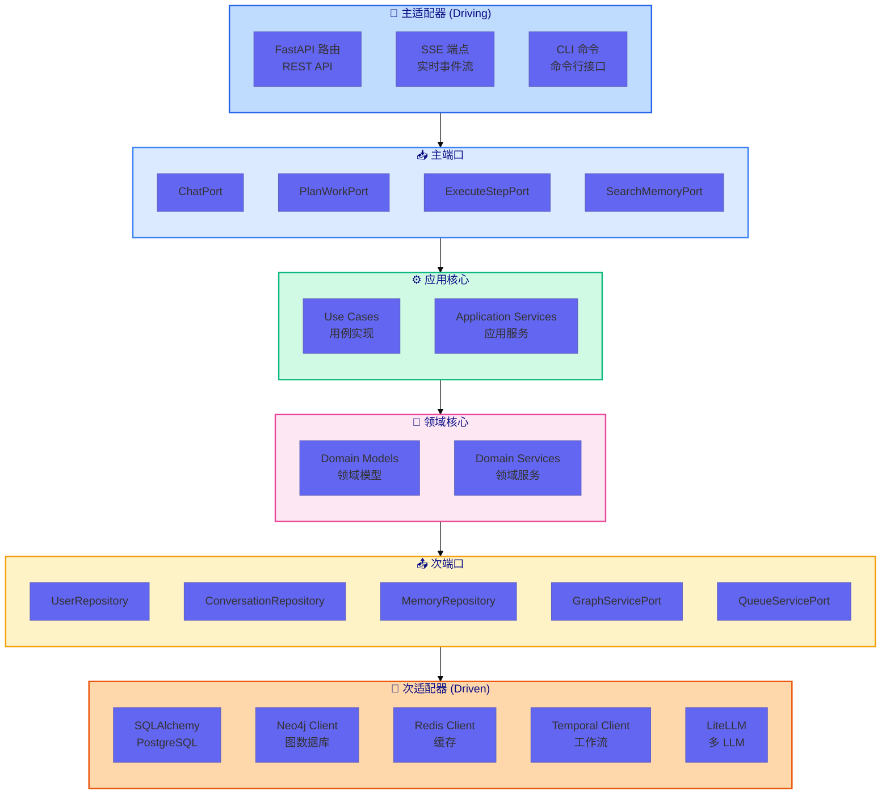
```mermaid
%%{init: {'theme': 'base', 'themeVariables': { 'primaryColor': '#6366f1'}}}%%
flowchart TB
    subgraph PrimaryAdapters["🔌 主适配器 (Driving)"]
        direction TB
        PA1["FastAPI 路由<br/>REST API"]
        PA2["SSE 端点<br/>实时事件流"]
        PA3["CLI 命令<br/>命令行接口"]
    end

    subgraph PrimaryPorts["📥 主端口"]
        direction TB
        PP1["ChatPort"]
        PP2["PlanWorkPort"]
        PP3["ExecuteStepPort"]
        PP4["SearchMemoryPort"]
    end

    subgraph Application["⚙️ 应用核心"]
        direction TB
        UC["Use Cases<br/>用例实现"]
        AS["Application Services<br/>应用服务"]
    end

    subgraph Domain["💎 领域核心"]
        direction TB
        DM["Domain Models<br/>领域模型"]
        DS["Domain Services<br/>领域服务"]
    end

    subgraph SecondaryPorts["📤 次端口"]
        direction TB
        SP1["UserRepository"]
        SP2["ConversationRepository"]
        SP3["MemoryRepository"]
        SP4["GraphServicePort"]
        SP5["QueueServicePort"]
    end

    subgraph SecondaryAdapters["🔌 次适配器 (Driven)"]
        direction TB
        SA1["SQLAlchemy<br/>PostgreSQL"]
        SA2["Neo4j Client<br/>图数据库"]
        SA3["Redis Client<br/>缓存"]
        SA4["Temporal Client<br/>工作流"]
        SA5["LiteLLM<br/>多 LLM"]
    end

    PrimaryAdapters --> PrimaryPorts
    PrimaryPorts --> Application
    Application --> Domain
    Domain --> SecondaryPorts
    SecondaryPorts --> SecondaryAdapters

    style PrimaryAdapters fill:#bfdbfe,stroke:#2563eb,stroke-width:2px
    style PrimaryPorts fill:#dbeafe,stroke:#3b82f6,stroke-width:2px
    style Application fill:#d1fae5,stroke:#10b981,stroke-width:2px
    style Domain fill:#fce7f3,stroke:#ec4899,stroke-width:2px
    style SecondaryPorts fill:#fef3c7,stroke:#f59e0b,stroke-width:2px
    style SecondaryAdapters fill:#fed7aa,stroke:#ea580c,stroke-width:2px
```

### 3.2 项目结构映射

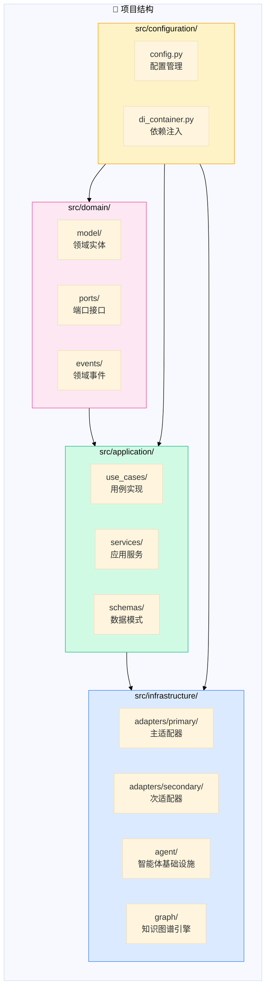
```mermaid
%%{init: {'theme': 'base'}}%%
flowchart TB
    subgraph Structure["📁 项目结构"]
        direction TB
        subgraph SrcDomain["src/domain/"]
            D1["model/<br/>领域实体"]
            D2["ports/<br/>端口接口"]
            D3["events/<br/>领域事件"]
        end

        subgraph SrcApp["src/application/"]
            A1["use_cases/<br/>用例实现"]
            A2["services/<br/>应用服务"]
            A3["schemas/<br/>数据模式"]
        end

        subgraph SrcInfra["src/infrastructure/"]
            I1["adapters/primary/<br/>主适配器"]
            I2["adapters/secondary/<br/>次适配器"]
            I3["agent/<br/>智能体基础设施"]
            I4["graph/<br/>知识图谱引擎"]
        end

        subgraph SrcConfig["src/configuration/"]
            C1["config.py<br/>配置管理"]
            C2["di_container.py<br/>依赖注入"]
        end
    end

    SrcDomain --> SrcApp
    SrcApp --> SrcInfra
    SrcConfig --> SrcDomain
    SrcConfig --> SrcApp
    SrcConfig --> SrcInfra

    style SrcDomain fill:#fce7f3,stroke:#ec4899
    style SrcApp fill:#d1fae5,stroke:#10b981
    style SrcInfra fill:#dbeafe,stroke:#3b82f6
    style SrcConfig fill:#fef3c7,stroke:#f59e0b
```

---

## 4. 智能体系统架构

### 4.1 ReAct 智能体核心架构

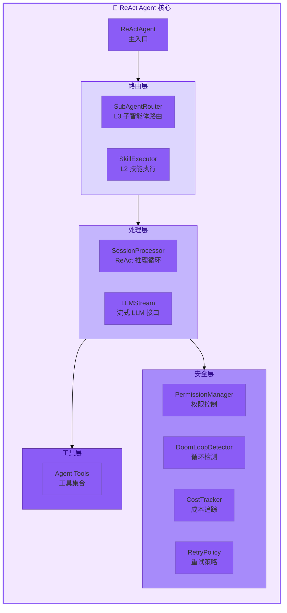
```mermaid
%%{init: {'theme': 'base', 'themeVariables': { 'primaryColor': '#8b5cf6'}}}%%
flowchart TB
    subgraph AgentCore["🤖 ReAct Agent 核心"]
        direction TB
        RA["ReActAgent<br/>主入口"]
        
        subgraph Routing["路由层"]
            SAR["SubAgentRouter<br/>L3 子智能体路由"]
            SE["SkillExecutor<br/>L2 技能执行"]
        end

        subgraph Processing["处理层"]
            SP["SessionProcessor<br/>ReAct 推理循环"]
            LLM["LLMStream<br/>流式 LLM 接口"]
        end

        subgraph Safety["安全层"]
            PM["PermissionManager<br/>权限控制"]
            DLD["DoomLoopDetector<br/>循环检测"]
            CT["CostTracker<br/>成本追踪"]
            RP["RetryPolicy<br/>重试策略"]
        end

        subgraph Tools["工具层"]
            TL["Agent Tools<br/>工具集合"]
        end
    end

    RA --> Routing
    Routing --> Processing
    Processing --> Safety
    Processing --> Tools

    style AgentCore fill:#f3e8ff,stroke:#8b5cf6,stroke-width:3px
    style Routing fill:#ddd6fe,stroke:#7c3aed
    style Processing fill:#c4b5fd,stroke:#6d28d9
    style Safety fill:#a78bfa,stroke:#5b21b6
    style Tools fill:#8b5cf6,stroke:#4c1d95
```

### 4.2 智能体执行流程

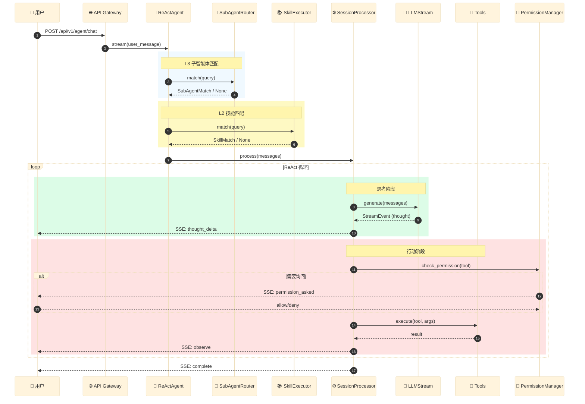
```mermaid
%%{init: {'theme': 'base'}}%%
sequenceDiagram
    autonumber
    participant U as 👤 用户
    participant API as 🌐 API Gateway
    participant RA as 🤖 ReActAgent
    participant SAR as 👥 SubAgentRouter
    participant SE as 📚 SkillExecutor
    participant SP as ⚙️ SessionProcessor
    participant LLM as 🧠 LLMStream
    participant T as 🔧 Tools
    participant PM as 🔐 PermissionManager

    U->>API: POST /api/v1/agent/chat
    API->>RA: stream(user_message)
    
    rect rgb(240, 249, 255)
        Note over RA,SAR: L3 子智能体匹配
        RA->>SAR: match(query)
        SAR-->>RA: SubAgentMatch / None
    end

    rect rgb(254, 249, 195)
        Note over RA,SE: L2 技能匹配
        RA->>SE: match(query)
        SE-->>RA: SkillMatch / None
    end

    RA->>SP: process(messages)
    
    loop ReAct 循环
        rect rgb(220, 252, 231)
            Note over SP,LLM: 思考阶段
            SP->>LLM: generate(messages)
            LLM-->>SP: StreamEvent (thought)
            SP-->>U: SSE: thought_delta
        end

        rect rgb(254, 226, 226)
            Note over SP,T: 行动阶段
            SP->>PM: check_permission(tool)
            alt 需要询问
                PM-->>U: SSE: permission_asked
                U-->>PM: allow/deny
            end
            SP->>T: execute(tool, args)
            T-->>SP: result
            SP-->>U: SSE: observe
        end
    end

    SP-->>U: SSE: complete
```

### 4.3 多层思考机制

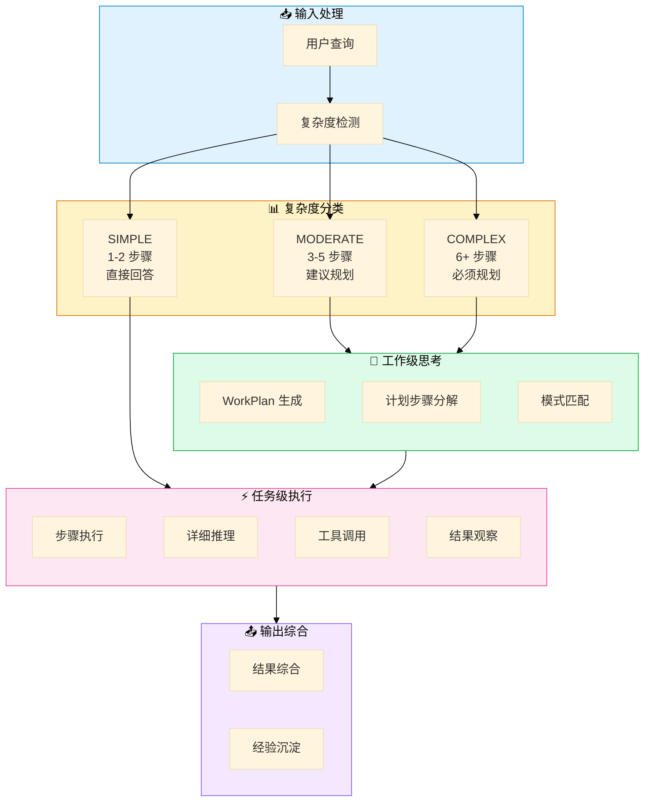
```mermaid
%%{init: {'theme': 'base'}}%%
flowchart TB
    subgraph Input["📥 输入处理"]
        Q["用户查询"]
        CD["复杂度检测"]
    end

    subgraph Complexity["📊 复杂度分类"]
        direction TB
        SIMPLE["SIMPLE<br/>1-2 步骤<br/>直接回答"]
        MODERATE["MODERATE<br/>3-5 步骤<br/>建议规划"]
        COMPLEX["COMPLEX<br/>6+ 步骤<br/>必须规划"]
    end

    subgraph WorkLevel["🎯 工作级思考"]
        direction TB
        WP["WorkPlan 生成"]
        STEPS["计划步骤分解"]
        PATTERN["模式匹配"]
    end

    subgraph TaskLevel["⚡ 任务级执行"]
        direction TB
        EXEC["步骤执行"]
        THOUGHT["详细推理"]
        TOOL["工具调用"]
        OBS["结果观察"]
    end

    subgraph Output["📤 输出综合"]
        SYN["结果综合"]
        LEARN["经验沉淀"]
    end

    Q --> CD
    CD --> SIMPLE
    CD --> MODERATE
    CD --> COMPLEX

    SIMPLE --> TaskLevel
    MODERATE --> WorkLevel
    COMPLEX --> WorkLevel

    WorkLevel --> TaskLevel
    TaskLevel --> Output

    style Input fill:#e0f2fe,stroke:#0284c7
    style Complexity fill:#fef3c7,stroke:#d97706
    style WorkLevel fill:#dcfce7,stroke:#16a34a
    style TaskLevel fill:#fce7f3,stroke:#ec4899
    style Output fill:#f3e8ff,stroke:#8b5cf6
```

### 4.4 人机协作机制

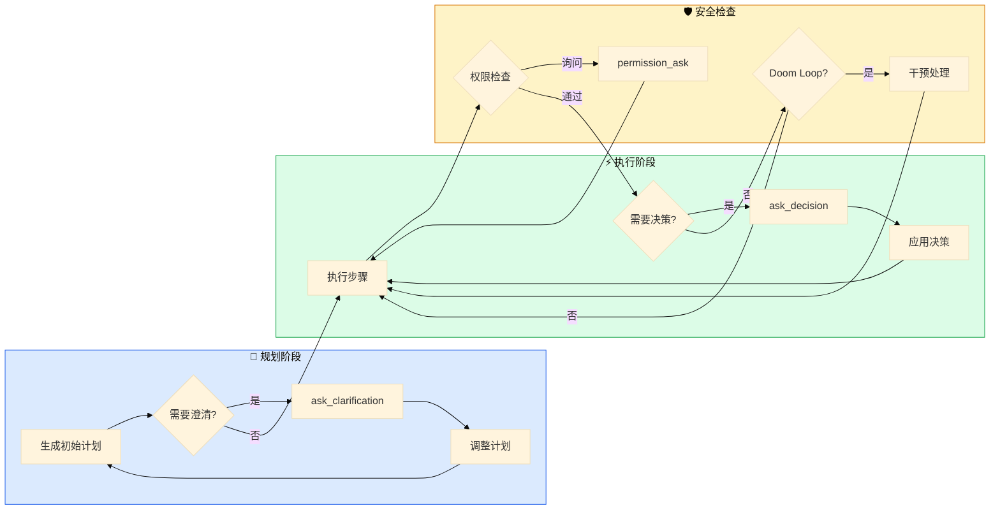
```mermaid
%%{init: {'theme': 'base'}}%%
flowchart LR
    subgraph Planning["🎯 规划阶段"]
        direction TB
        P1["生成初始计划"]
        P2{"需要澄清?"}
        P3["ask_clarification"]
        P4["调整计划"]
    end

    subgraph Execution["⚡ 执行阶段"]
        direction TB
        E1["执行步骤"]
        E2{"需要决策?"}
        E3["ask_decision"]
        E4["应用决策"]
    end

    subgraph Safety["🛡️ 安全检查"]
        direction TB
        S1{"权限检查"}
        S2["permission_ask"]
        S3{"Doom Loop?"}
        S4["干预处理"]
    end

    P1 --> P2
    P2 -->|是| P3
    P3 --> P4
    P4 --> P1
    P2 -->|否| E1

    E1 --> S1
    S1 -->|询问| S2
    S2 --> E1
    S1 -->|通过| E2
    E2 -->|是| E3
    E3 --> E4
    E4 --> E1
    E2 -->|否| S3
    S3 -->|是| S4
    S4 --> E1
    S3 -->|否| E1

    style Planning fill:#dbeafe,stroke:#2563eb
    style Execution fill:#dcfce7,stroke:#16a34a
    style Safety fill:#fef3c7,stroke:#d97706
```

---

## 5. 知识图谱系统

### 5.1 Native Graph Adapter 架构

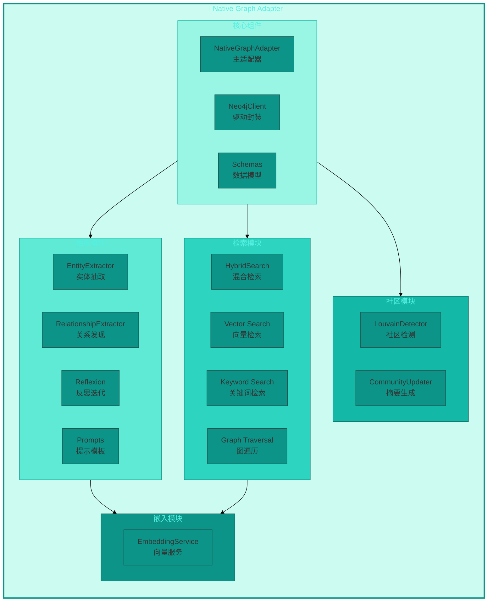
```mermaid
%%{init: {'theme': 'base', 'themeVariables': { 'primaryColor': '#0d9488'}}}%%
flowchart TB
    subgraph NGA["🧠 Native Graph Adapter"]
        direction TB
        
        subgraph Core["核心组件"]
            NGA_MAIN["NativeGraphAdapter<br/>主适配器"]
            NC["Neo4jClient<br/>驱动封装"]
            SCH["Schemas<br/>数据模型"]
        end

        subgraph Extraction["抽取模块"]
            EE["EntityExtractor<br/>实体抽取"]
            RE["RelationshipExtractor<br/>关系发现"]
            RF["Reflexion<br/>反思迭代"]
            PR["Prompts<br/>提示模板"]
        end

        subgraph Search["检索模块"]
            HS["HybridSearch<br/>混合检索"]
            VS["Vector Search<br/>向量检索"]
            KS["Keyword Search<br/>关键词检索"]
            GS["Graph Traversal<br/>图遍历"]
        end

        subgraph Community["社区模块"]
            LD["LouvainDetector<br/>社区检测"]
            CU["CommunityUpdater<br/>摘要生成"]
        end

        subgraph Embedding["嵌入模块"]
            ES["EmbeddingService<br/>向量服务"]
        end
    end

    Core --> Extraction
    Core --> Search
    Core --> Community
    Extraction --> Embedding
    Search --> Embedding

    style NGA fill:#ccfbf1,stroke:#0d9488,stroke-width:3px
    style Core fill:#99f6e4,stroke:#14b8a6
    style Extraction fill:#5eead4,stroke:#0d9488
    style Search fill:#2dd4bf,stroke:#0f766e
    style Community fill:#14b8a6,stroke:#115e59
    style Embedding fill:#0d9488,stroke:#134e4a
```

### 5.2 Episode 处理流程

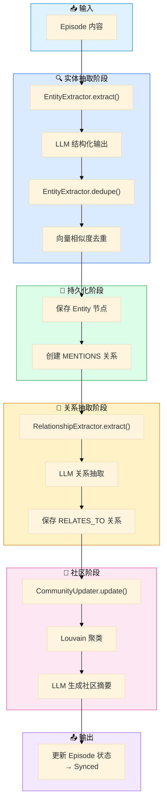
```mermaid
%%{init: {'theme': 'base'}}%%
flowchart TB
    subgraph Input["📥 输入"]
        EP["Episode 内容"]
    end

    subgraph EntityPhase["🔍 实体抽取阶段"]
        EE["EntityExtractor.extract()"]
        LLM1["LLM 结构化输出"]
        DD["EntityExtractor.dedupe()"]
        VS["向量相似度去重"]
    end

    subgraph PersistPhase["💾 持久化阶段"]
        SE["保存 Entity 节点"]
        SM["创建 MENTIONS 关系"]
    end

    subgraph RelPhase["🔗 关系抽取阶段"]
        RE["RelationshipExtractor.extract()"]
        LLM2["LLM 关系抽取"]
        SR["保存 RELATES_TO 关系"]
    end

    subgraph CommPhase["👥 社区阶段"]
        CU["CommunityUpdater.update()"]
        LV["Louvain 聚类"]
        LLM3["LLM 生成社区摘要"]
    end

    subgraph Output["📤 输出"]
        UP["更新 Episode 状态<br/>→ Synced"]
    end

    EP --> EE
    EE --> LLM1
    LLM1 --> DD
    DD --> VS
    VS --> SE
    SE --> SM
    SM --> RE
    RE --> LLM2
    LLM2 --> SR
    SR --> CU
    CU --> LV
    LV --> LLM3
    LLM3 --> UP

    style Input fill:#e0f2fe,stroke:#0284c7
    style EntityPhase fill:#dbeafe,stroke:#2563eb
    style PersistPhase fill:#dcfce7,stroke:#16a34a
    style RelPhase fill:#fef3c7,stroke:#d97706
    style CommPhase fill:#fce7f3,stroke:#ec4899
    style Output fill:#f3e8ff,stroke:#8b5cf6
```

### 5.3 Neo4j 图模型

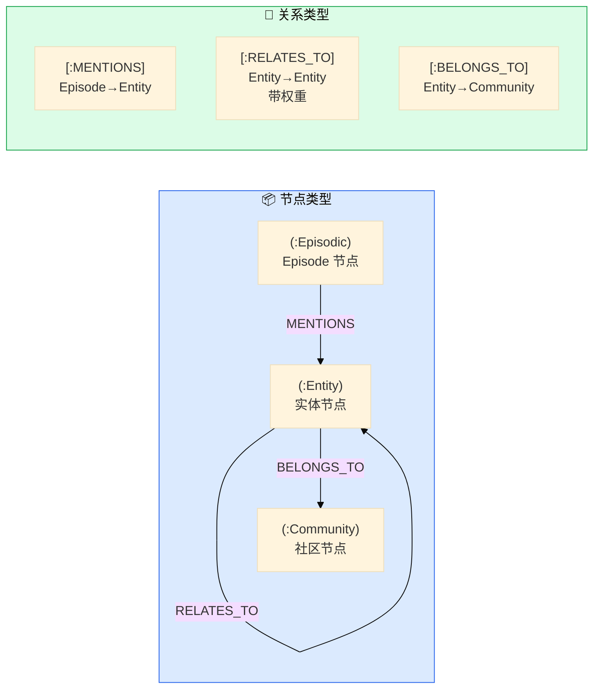
```mermaid
%%{init: {'theme': 'base'}}%%
graph LR
    subgraph Nodes["📦 节点类型"]
        direction TB
        EP["(:Episodic)<br/>Episode 节点"]
        EN["(:Entity)<br/>实体节点"]
        CM["(:Community)<br/>社区节点"]
    end

    subgraph Relationships["🔗 关系类型"]
        direction TB
        MENTIONS["[:MENTIONS]<br/>Episode→Entity"]
        RELATES["[:RELATES_TO]<br/>Entity→Entity<br/>带权重"]
        BELONGS["[:BELONGS_TO]<br/>Entity→Community"]
    end

    EP -->|"MENTIONS"| EN
    EN -->|"RELATES_TO"| EN
    EN -->|"BELONGS_TO"| CM

    style Nodes fill:#dbeafe,stroke:#2563eb
    style Relationships fill:#dcfce7,stroke:#16a34a
```

### 5.4 混合检索策略

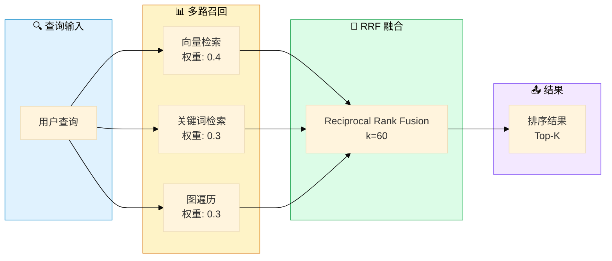
```mermaid
%%{init: {'theme': 'base'}}%%
flowchart LR
    subgraph Input["🔍 查询输入"]
        Q["用户查询"]
    end

    subgraph Retrieval["📊 多路召回"]
        VS["向量检索<br/>权重: 0.4"]
        KS["关键词检索<br/>权重: 0.3"]
        GS["图遍历<br/>权重: 0.3"]
    end

    subgraph Fusion["🔀 RRF 融合"]
        RRF["Reciprocal Rank Fusion<br/>k=60"]
    end

    subgraph Output["📤 结果"]
        RS["排序结果<br/>Top-K"]
    end

    Q --> VS
    Q --> KS
    Q --> GS
    VS --> RRF
    KS --> RRF
    GS --> RRF
    RRF --> RS

    style Input fill:#e0f2fe,stroke:#0284c7
    style Retrieval fill:#fef3c7,stroke:#d97706
    style Fusion fill:#dcfce7,stroke:#16a34a
    style Output fill:#f3e8ff,stroke:#8b5cf6
```

---

## 6. 数据流架构

### 6.1 用户请求数据流

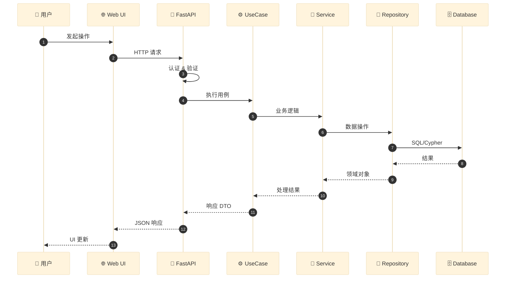
```mermaid
%%{init: {'theme': 'base'}}%%
sequenceDiagram
    autonumber
    participant U as 👤 用户
    participant W as 🌐 Web UI
    participant API as 📡 FastAPI
    participant UC as ⚙️ UseCase
    participant SVC as 🔧 Service
    participant REPO as 💾 Repository
    participant DB as 🗄️ Database

    U->>W: 发起操作
    W->>API: HTTP 请求
    API->>API: 认证 & 验证
    API->>UC: 执行用例
    UC->>SVC: 业务逻辑
    SVC->>REPO: 数据操作
    REPO->>DB: SQL/Cypher
    DB-->>REPO: 结果
    REPO-->>SVC: 领域对象
    SVC-->>UC: 处理结果
    UC-->>API: 响应 DTO
    API-->>W: JSON 响应
    W-->>U: UI 更新
```

### 6.2 智能体聊天数据流 (SSE)

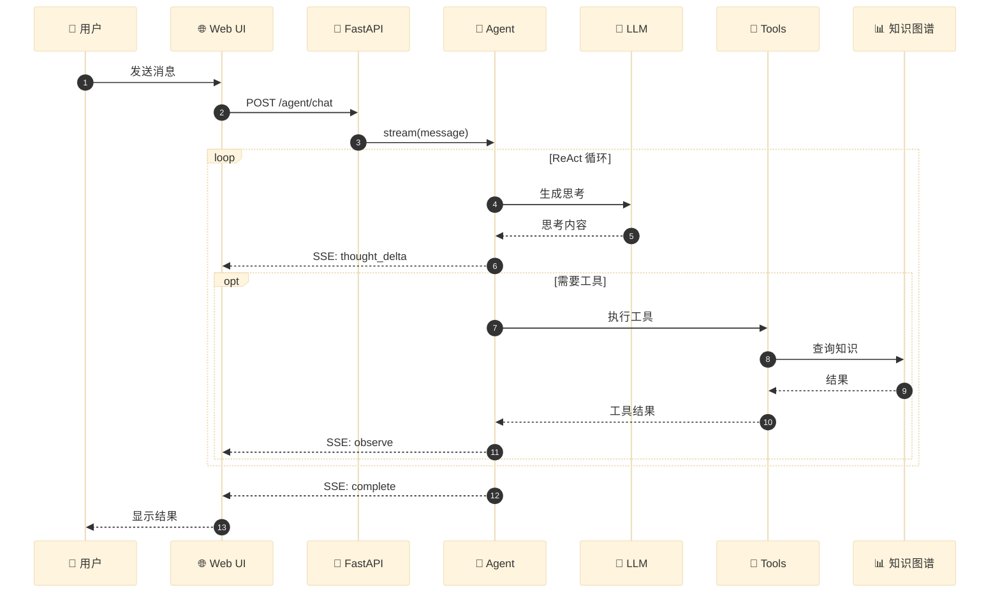
```mermaid
%%{init: {'theme': 'base'}}%%
sequenceDiagram
    autonumber
    participant U as 👤 用户
    participant W as 🌐 Web UI
    participant API as 📡 FastAPI
    participant Agent as 🤖 Agent
    participant LLM as 🧠 LLM
    participant Tools as 🔧 Tools
    participant KG as 📊 知识图谱

    U->>W: 发送消息
    W->>API: POST /agent/chat
    API->>Agent: stream(message)
    
    loop ReAct 循环
        Agent->>LLM: 生成思考
        LLM-->>Agent: 思考内容
        Agent-->>W: SSE: thought_delta
        
        opt 需要工具
            Agent->>Tools: 执行工具
            Tools->>KG: 查询知识
            KG-->>Tools: 结果
            Tools-->>Agent: 工具结果
            Agent-->>W: SSE: observe
        end
    end

    Agent-->>W: SSE: complete
    W-->>U: 显示结果
```

### 6.3 Episode 异步处理流

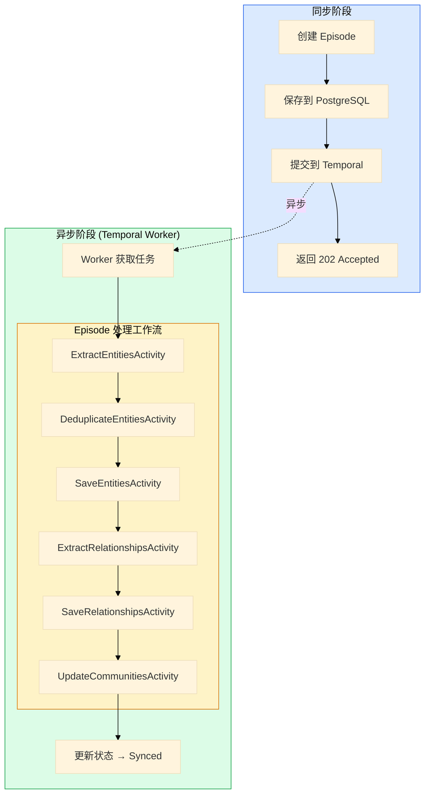
```mermaid
%%{init: {'theme': 'base'}}%%
flowchart TB
    subgraph Sync["同步阶段"]
        CREATE["创建 Episode"]
        SAVE["保存到 PostgreSQL"]
        QUEUE["提交到 Temporal"]
        RESP["返回 202 Accepted"]
    end

    subgraph Async["异步阶段 (Temporal Worker)"]
        PICKUP["Worker 获取任务"]
        
        subgraph Workflow["Episode 处理工作流"]
            W1["ExtractEntitiesActivity"]
            W2["DeduplicateEntitiesActivity"]
            W3["SaveEntitiesActivity"]
            W4["ExtractRelationshipsActivity"]
            W5["SaveRelationshipsActivity"]
            W6["UpdateCommunitiesActivity"]
        end
        
        UPDATE["更新状态 → Synced"]
    end

    CREATE --> SAVE --> QUEUE --> RESP
    QUEUE -.->|异步| PICKUP
    PICKUP --> W1 --> W2 --> W3 --> W4 --> W5 --> W6 --> UPDATE

    style Sync fill:#dbeafe,stroke:#2563eb
    style Async fill:#dcfce7,stroke:#16a34a
    style Workflow fill:#fef3c7,stroke:#d97706
```

---

## 7. 部署架构图

### 7.1 Docker Compose 部署

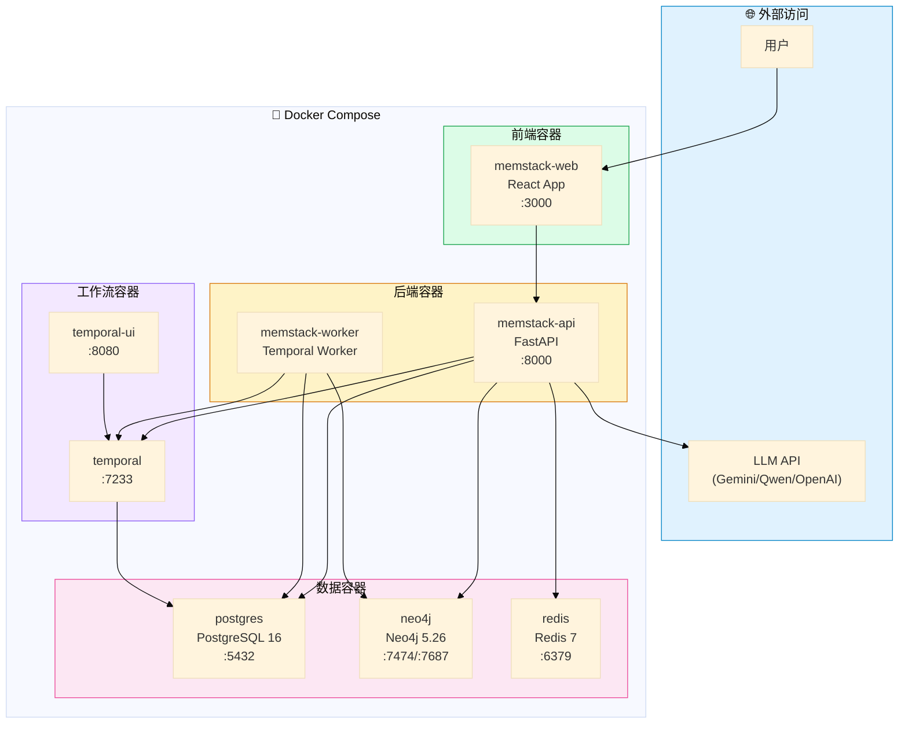
```mermaid
%%{init: {'theme': 'base'}}%%
flowchart TB
    subgraph External["🌐 外部访问"]
        USER["用户"]
        LLM_API["LLM API<br/>(Gemini/Qwen/OpenAI)"]
    end

    subgraph Docker["🐳 Docker Compose"]
        subgraph Frontend["前端容器"]
            WEB["memstack-web<br/>React App<br/>:3000"]
        end

        subgraph Backend["后端容器"]
            API["memstack-api<br/>FastAPI<br/>:8000"]
            WORKER["memstack-worker<br/>Temporal Worker"]
        end

        subgraph Workflow["工作流容器"]
            TEMPORAL["temporal<br/>:7233"]
            TEMPORAL_UI["temporal-ui<br/>:8080"]
        end

        subgraph Data["数据容器"]
            PG["postgres<br/>PostgreSQL 16<br/>:5432"]
            NEO["neo4j<br/>Neo4j 5.26<br/>:7474/:7687"]
            REDIS["redis<br/>Redis 7<br/>:6379"]
        end
    end

    USER --> WEB
    WEB --> API
    API --> TEMPORAL
    API --> PG
    API --> NEO
    API --> REDIS
    API --> LLM_API
    WORKER --> TEMPORAL
    WORKER --> PG
    WORKER --> NEO
    TEMPORAL --> PG
    TEMPORAL_UI --> TEMPORAL

    style External fill:#e0f2fe,stroke:#0284c7
    style Frontend fill:#dcfce7,stroke:#16a34a
    style Backend fill:#fef3c7,stroke:#d97706
    style Workflow fill:#f3e8ff,stroke:#8b5cf6
    style Data fill:#fce7f3,stroke:#ec4899
```

### 7.2 Kubernetes 生产部署

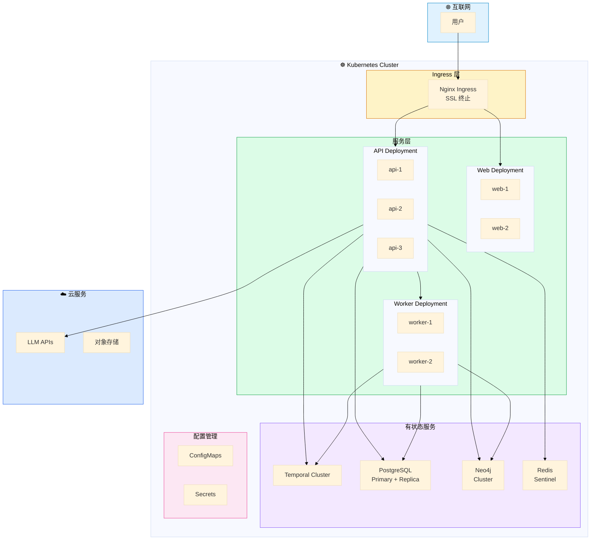
```mermaid
%%{init: {'theme': 'base'}}%%
flowchart TB
    subgraph Internet["🌐 互联网"]
        USER["用户"]
    end

    subgraph K8s["☸️ Kubernetes Cluster"]
        subgraph Ingress["Ingress 层"]
            IG["Nginx Ingress<br/>SSL 终止"]
        end

        subgraph Services["服务层"]
            subgraph Web["Web Deployment"]
                WEB1["web-1"]
                WEB2["web-2"]
            end
            subgraph API_["API Deployment"]
                API1["api-1"]
                API2["api-2"]
                API3["api-3"]
            end
            subgraph Worker_["Worker Deployment"]
                W1["worker-1"]
                W2["worker-2"]
            end
        end

        subgraph StatefulSets["有状态服务"]
            TEMPORAL["Temporal Cluster"]
            PG["PostgreSQL<br/>Primary + Replica"]
            NEO["Neo4j<br/>Cluster"]
            REDIS["Redis<br/>Sentinel"]
        end

        subgraph Config["配置管理"]
            CM["ConfigMaps"]
            SEC["Secrets"]
        end
    end

    subgraph Cloud["☁️ 云服务"]
        LLM["LLM APIs"]
        OSS["对象存储"]
    end

    USER --> IG
    IG --> Web
    IG --> API_
    API_ --> Worker_
    API_ --> TEMPORAL
    API_ --> PG
    API_ --> NEO
    API_ --> REDIS
    API_ --> LLM
    Worker_ --> TEMPORAL
    Worker_ --> PG
    Worker_ --> NEO

    style Internet fill:#e0f2fe,stroke:#0284c7
    style Ingress fill:#fef3c7,stroke:#d97706
    style Services fill:#dcfce7,stroke:#16a34a
    style StatefulSets fill:#f3e8ff,stroke:#8b5cf6
    style Config fill:#fce7f3,stroke:#ec4899
    style Cloud fill:#dbeafe,stroke:#2563eb
```

### 7.3 服务端口映射

```mermaid
%%{init: {'theme': 'base'}}%%
flowchart LR
    subgraph Ports["🔌 服务端口"]
        P1["3000 - Web UI"]
        P2["8000 - API Server"]
        P3["7233 - Temporal Server"]
        P4["8080 - Temporal UI"]
        P5["5432 - PostgreSQL"]
        P6["7474 - Neo4j HTTP"]
        P7["7687 - Neo4j Bolt"]
        P8["6379 - Redis"]
    end

    subgraph Services["🖥️ 服务"]
        S1["React App"]
        S2["FastAPI"]
        S3["Temporal"]
        S4["Temporal Web"]
        S5["PostgreSQL"]
        S6["Neo4j Browser"]
        S7["Neo4j Driver"]
        S8["Redis"]
    end

    P1 --> S1
    P2 --> S2
    P3 --> S3
    P4 --> S4
    P5 --> S5
    P6 --> S6
    P7 --> S7
    P8 --> S8

    style Ports fill:#dbeafe,stroke:#2563eb
    style Services fill:#dcfce7,stroke:#16a34a
```

---

## 8. 技术栈全景

### 8.1 完整技术栈

```mermaid
%%{init: {'theme': 'base'}}%%
mindmap
  root((MemStack<br/>技术栈))
    Backend
      Python 3.12+
      FastAPI 0.110+
      Pydantic 2.5+
      SQLAlchemy 2.0+
      Alembic 1.12+
    Agent Framework
      ReAct Core 自研
      LangChain 0.3+
      LiteLLM 1.0+
    Knowledge Graph
      Native Graph Adapter 自研
      Neo4j 5.26+
    Databases
      PostgreSQL 16+
      Redis 7+
    Workflow
      Temporal.io
    Frontend
      React 19.2+
      TypeScript 5.9+
      Vite 6.3+
      Ant Design 6.1+
      Zustand 5.0+
    Testing
      pytest 9.0+
      Vitest 4.0+
      Playwright 1.57+
    LLM Providers
      Google Gemini
      Alibaba Qwen
      Deepseek
      ZhipuAI
      OpenAI
```

### 8.2 后端技术详情

```mermaid
%%{init: {'theme': 'base'}}%%
flowchart TB
    subgraph Core["🐍 核心框架"]
        PY["Python 3.12+"]
        FA["FastAPI 0.110+"]
        PD["Pydantic 2.5+"]
    end

    subgraph Agent["🤖 智能体"]
        RC["ReAct Core<br/>(自研)"]
        LC["LangChain 0.3+<br/>(工具链)"]
        LL["LiteLLM 1.0+<br/>(多 LLM)"]
    end

    subgraph Graph["🧠 知识图谱"]
        NGA["Native Graph Adapter<br/>(自研)"]
        N4J["Neo4j 5.26+"]
    end

    subgraph DB["💾 数据存储"]
        SA["SQLAlchemy 2.0+"]
        ALM["Alembic 1.12+"]
        PG["PostgreSQL 16+"]
        RD["Redis 7+"]
    end

    subgraph WF["⚙️ 工作流"]
        TMP["Temporal.io"]
    end

    Core --> Agent
    Core --> Graph
    Core --> DB
    Core --> WF

    style Core fill:#3b82f6,stroke:#1d4ed8,color:#fff
    style Agent fill:#8b5cf6,stroke:#6d28d9,color:#fff
    style Graph fill:#0d9488,stroke:#0f766e,color:#fff
    style DB fill:#f59e0b,stroke:#d97706,color:#fff
    style WF fill:#ec4899,stroke:#be185d,color:#fff
```

### 8.3 前端技术详情

```mermaid
%%{init: {'theme': 'base'}}%%
flowchart TB
    subgraph Core["⚛️ 核心框架"]
        REACT["React 19.2+"]
        TS["TypeScript 5.9+"]
        VITE["Vite 6.3+"]
    end

    subgraph UI["🎨 UI 组件"]
        ANT["Ant Design 6.1+"]
        ICONS["Ant Design Icons"]
    end

    subgraph State["📦 状态管理"]
        ZS["Zustand 5.0+"]
    end

    subgraph Network["🌐 网络"]
        AXIOS["Axios"]
        SSE["EventSource"]
    end

    subgraph Testing["🧪 测试"]
        VT["Vitest 4.0+"]
        PW["Playwright 1.57+"]
        TL["Testing Library"]
    end

    Core --> UI
    Core --> State
    Core --> Network
    Core --> Testing

    style Core fill:#61dafb,stroke:#00b4d8,color:#000
    style UI fill:#1890ff,stroke:#096dd9,color:#fff
    style State fill:#764abc,stroke:#593d88,color:#fff
    style Network fill:#f7931a,stroke:#c77618,color:#fff
    style Testing fill:#c21325,stroke:#9b101f,color:#fff
```

---

## 附录

### A. 图例说明

| 颜色 | 含义 |
|------|------|
| 🟦 蓝色 | 前端/API 层 |
| 🟩 绿色 | 应用/业务层 |
| 🟪 紫色 | 智能体/领域层 |
| 🟨 黄色 | 基础设施层 |
| 🟫 橙色 | 外部服务 |
| 🩷 粉色 | 数据存储 |

### B. 相关文档

- [完整架构设计](./ARCHITECTURE.md)
- [开发指南](../../CLAUDE.md)
- [项目 README](../../README.md)
- [DDD + 六边形架构规则](../../domain_driven_design_hexagonal_arhictecture_python_rules.md)

### C. 更新日志

| 版本 | 日期 | 变更 |
|------|------|------|
| 1.0.0 | 2026-01-20 | 初始版本，包含完整架构图集 |

---

**文档状态**: ✅ 完成  
**最后更新**: 2026-01-20  
**维护者**: MemStack Platform Team
