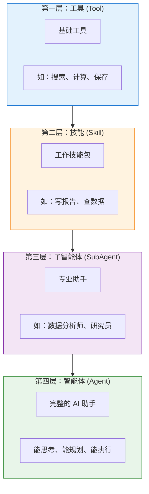
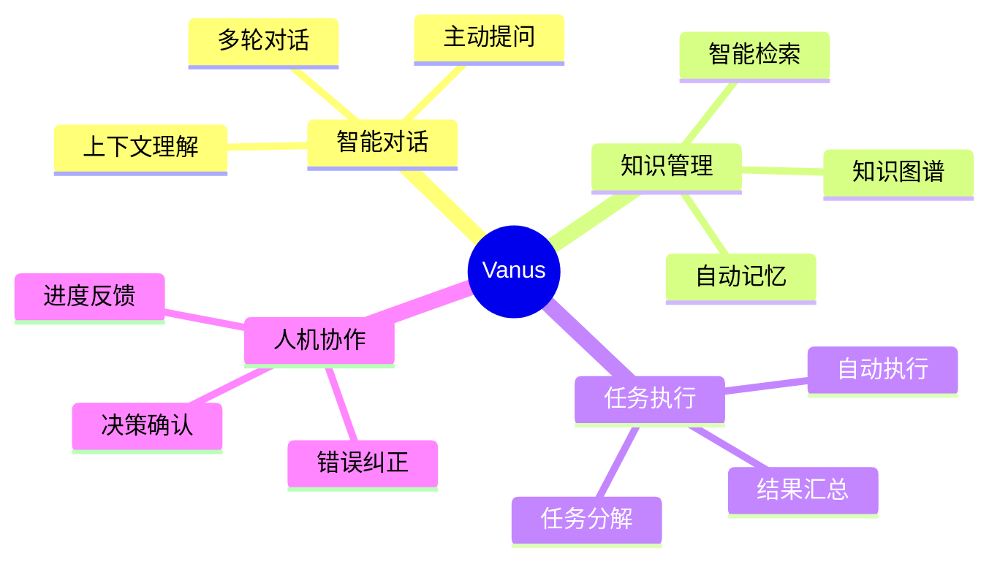
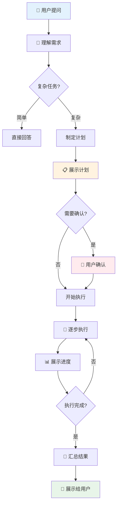
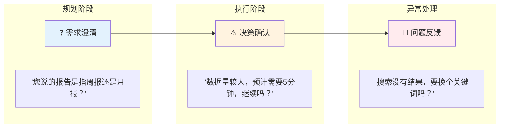
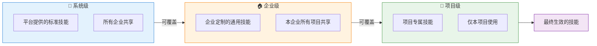
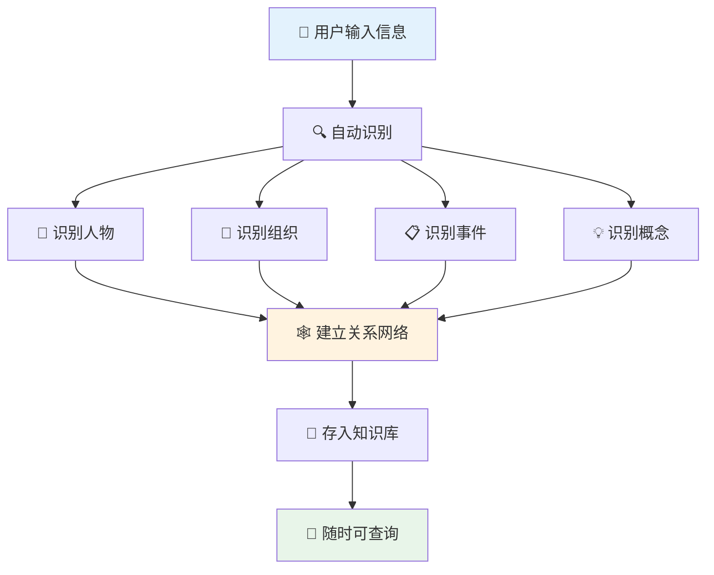
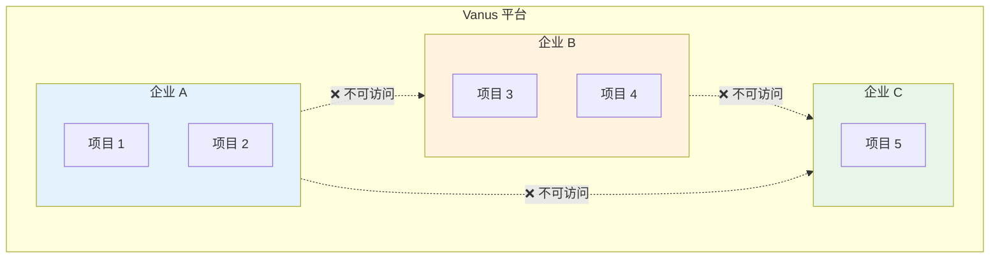
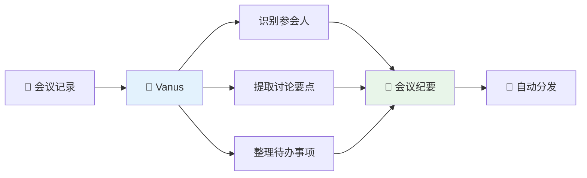
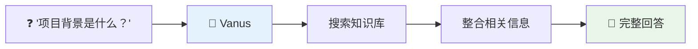
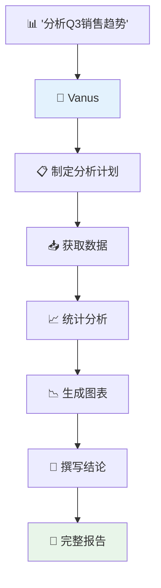

# Vanus 产品架构概览

> **版本**: 1.0.0
> **适用读者**: 产品经理、业务分析师、项目管理者、非技术背景人员
> **最后更新**: 2026-01-22

---

## 目录

1. [产品简介](#1-产品简介)
2. [核心能力](#2-核心能力)
3. [智能体工作原理](#3-智能体工作原理)
4. [技能系统](#4-技能系统)
5. [知识记忆系统](#5-知识记忆系统)
6. [多租户架构](#6-多租户架构)
7. [用户界面](#7-用户界面)
8. [典型应用场景](#8-典型应用场景)
9. [附录：术语表](#9-附录术语表)

---

## 1. 产品简介

### 1.1 什么是 Vanus？

**Vanus** 是一个**企业级 AI 智能助手平台**，可以帮助企业团队更高效地完成日常工作。

**通俗理解**：
> 想象一下，您有一位非常聪明的助手，他不仅能记住您告诉他的所有信息，还能：
> - 根据您的指令完成复杂任务
> - 记住之前的对话和决策
> - 学习您的工作习惯，变得越来越懂您
> - 在需要时主动询问，避免误解

这就是 Vanus 要做的事情。

### 1.2 核心价值

| 价值 | 说明 | 举例 |
|------|------|------|
| **人机协作** | AI 不是替代人，而是协助人 | 在关键决策时询问您的意见 |
| **知识积累** | 自动整理和记忆重要信息 | 记住项目讨论的结论和原因 |
| **效率提升** | 自动化重复性工作 | 自动生成会议纪要、分析报告 |
| **灵活定制** | 可根据业务需求配置 | 定制专属的工作技能包 |

### 1.3 能力递进模型

Vanus 采用**四层能力模型**，就像搭积木一样，从基础能力逐步构建高级能力：



**生活类比**：
- **工具**：像厨房里的刀、锅、铲子
- **技能**：像"炒菜"这个技能，需要组合使用多个工具
- **子智能体**：像专门做川菜的厨师，擅长特定领域
- **智能体**：像餐厅主厨，能协调所有厨师完成整桌宴席

---

## 2. 核心能力

### 2.1 能力总览



### 2.2 主要功能

#### 🧠 智能对话

| 功能 | 说明 | 用户体验 |
|------|------|----------|
| **多轮对话** | 记住之前说过的话 | 不用每次都重复背景信息 |
| **上下文理解** | 理解对话的完整含义 | 能理解"他"、"这个"指的是什么 |
| **主动提问** | 不确定时会询问 | 避免因误解而做错事 |
| **任务规划** | 复杂任务自动分步 | 显示清晰的执行计划 |

#### 📚 知识管理

| 功能 | 说明 | 用户体验 |
|------|------|----------|
| **自动记忆** | 自动记住重要信息 | 无需手动整理笔记 |
| **知识关联** | 发现信息之间的联系 | "张三认识李四" 自动建立关系 |
| **智能检索** | 用自然语言搜索 | 问"上次说的那个方案"就能找到 |
| **时间追溯** | 记录信息的时间 | 能查到"3月份时怎么说的" |

#### ⚡ 任务执行

| 功能 | 说明 | 用户体验 |
|------|------|----------|
| **任务分解** | 把大任务拆成小步骤 | 清晰看到执行计划 |
| **自动执行** | 按计划逐步完成 | 实时看到进度 |
| **结果汇总** | 整合所有结果 | 得到完整的答案或报告 |
| **错误处理** | 遇到问题自动处理或询问 | 不会默默卡住 |

---

## 3. 智能体工作原理

### 3.1 工作流程

当您向 Vanus 提出一个请求时，它会经历以下步骤：



### 3.2 思考过程可视化

Vanus 的思考过程对用户是**透明可见**的：

| 阶段 | 用户看到的内容 | 类比 |
|------|---------------|------|
| **理解阶段** | "我理解您想要..." | 确认需求 |
| **规划阶段** | "我计划分3步完成..." | 展示计划 |
| **执行阶段** | "正在执行第1步..." | 实时进度 |
| **工具使用** | "正在搜索相关信息..." | 显示动作 |
| **结果阶段** | "根据分析，结论是..." | 最终答案 |

### 3.3 人机协作模式

Vanus 不是"黑盒"，它会在关键时刻与您互动：



---

## 4. 技能系统

### 4.1 什么是技能？

**技能 (Skill)** 是预先定义好的"工作指南"，告诉 AI 如何完成特定类型的任务。

**通俗理解**：
> 就像新员工入职时收到的《工作手册》，里面写明了：
> - 这项工作是做什么的
> - 应该按什么步骤来做
> - 需要用到哪些工具
> - 有什么注意事项

### 4.2 技能示例

| 技能名称 | 触发场景 | 自动执行的步骤 |
|----------|----------|----------------|
| **数据分析** | "帮我分析这份销售数据" | 1. 读取数据 → 2. 统计汇总 → 3. 生成图表 → 4. 撰写结论 |
| **会议纪要** | "整理一下今天的会议记录" | 1. 识别参会人 → 2. 提取要点 → 3. 列出待办 → 4. 格式化输出 |
| **文档审查** | "检查这份合同有没有问题" | 1. 识别关键条款 → 2. 对比标准模板 → 3. 标注差异 → 4. 给出建议 |
| **市场研究** | "调研一下竞品情况" | 1. 搜索信息 → 2. 分类整理 → 3. 对比分析 → 4. 生成报告 |

### 4.3 技能的三个来源

企业可以从三个层面配置技能：



**举例说明**：
- **系统级**：平台提供的"写邮件"技能
- **企业级**：企业定制的"写邮件"技能（加入公司签名模板）
- **项目级**：某项目专用的"写邮件"技能（加入项目专属模板）

---

## 5. 知识记忆系统

### 5.1 工作原理

Vanus 的记忆系统就像一个**智能笔记本**：



### 5.2 记忆类型

| 记忆类型 | 说明 | 示例 |
|----------|------|------|
| **事件记忆** | 发生过的事情 | "3月15日的项目评审会" |
| **实体记忆** | 人、组织、概念 | "张三是产品经理" |
| **关系记忆** | 事物之间的联系 | "张三负责A项目" |
| **社区记忆** | 相关信息的聚合 | "A项目团队的所有信息" |

### 5.3 智能检索

用户可以用**自然语言**查询知识：

| 用户问法 | 系统理解 | 返回结果 |
|----------|----------|----------|
| "上次开会说的那个方案" | 最近会议中提到的方案 | 相关会议记录和方案内容 |
| "张三负责哪些项目" | 查找张三关联的项目 | 张三参与的所有项目列表 |
| "Q3的销售数据" | 第三季度销售相关 | Q3销售报告和数据 |
| "跟供应商有关的事" | 所有供应商相关信息 | 供应商联系人、合同、沟通记录 |

---

## 6. 多租户架构

### 6.1 什么是多租户？

**多租户** 意味着多个企业可以共享使用同一个 Vanus 平台，但彼此的数据**完全隔离**。

**通俗理解**：
> 就像一栋写字楼，每家公司租一层楼：
> - 大家共用同一栋楼（平台）
> - 但每家公司有自己独立的办公区（数据隔离）
> - 进入其他公司的楼层需要门禁卡（权限控制）

### 6.2 数据隔离



### 6.3 权限层级

| 层级 | 权限范围 | 典型角色 |
|------|----------|----------|
| **平台管理员** | 管理所有企业 | 平台运维人员 |
| **企业管理员** | 管理本企业所有项目 | 企业 IT 管理员 |
| **项目管理员** | 管理单个项目 | 项目经理 |
| **普通用户** | 使用分配的功能 | 团队成员 |

---

## 7. 用户界面

### 7.1 主要页面

#### 🏠 企业控制台

```
┌─────────────────────────────────────────────────┐
│  🏢 企业控制台                                   │
├─────────────────────────────────────────────────┤
│                                                 │
│  📊 数据概览        📁 项目列表        ⚙️ 设置  │
│  ┌───────────┐    ┌───────────────────┐        │
│  │ 本月对话   │    │ 项目A  ▶️ 进入    │        │
│  │   1,234   │    │ 项目B  ▶️ 进入    │        │
│  │ 知识条目   │    │ 项目C  ▶️ 进入    │        │
│  │   5,678   │    │ + 新建项目        │        │
│  └───────────┘    └───────────────────┘        │
│                                                 │
└─────────────────────────────────────────────────┘
```

#### 💬 智能对话界面

```
┌─────────────────────────────────────────────────┐
│  🤖 AI 助手 - 项目 A                             │
├─────────────────────────────────────────────────┤
│                                                 │
│  👤 帮我分析一下上个月的销售数据                  │
│                                                 │
│  🤖 好的，我来帮您分析。                         │
│                                                 │
│  📋 执行计划：                                   │
│  ✅ 1. 获取销售数据                              │
│  🔄 2. 统计分析中...                             │
│  ⏳ 3. 生成报告                                  │
│                                                 │
│  💡 正在使用工具：数据分析                        │
│                                                 │
├─────────────────────────────────────────────────┤
│  📝 输入消息...                        [发送]    │
└─────────────────────────────────────────────────┘
```

#### 🕸️ 知识图谱

```
┌─────────────────────────────────────────────────┐
│  🕸️ 知识图谱                                    │
├─────────────────────────────────────────────────┤
│                                                 │
│           [张三]                                │
│          ／    ＼                               │
│     负责人      参与                            │
│        ↓        ↓                              │
│    [项目A]    [项目B]                           │
│        ↓                                       │
│    [客户X]                                      │
│                                                 │
│  🔍 搜索：张三负责的项目                         │
│  📊 相关：3个项目，5次会议，12份文档              │
│                                                 │
└─────────────────────────────────────────────────┘
```

### 7.2 界面设计原型

> 以下是平台主要页面的设计预览：

**企业控制台**


**智能对话界面**


**知识图谱**


**技能管理**


---

## 8. 典型应用场景

### 8.1 场景一：智能会议助手

**场景描述**：每次会议后，自动整理会议纪要



**用户体验**：
1. 会后将录音或笔记发给 AI 助手
2. AI 自动识别谁说了什么
3. 整理成结构化的会议纪要
4. 自动发送给相关人员

### 8.2 场景二：知识问答助手

**场景描述**：新员工快速了解项目情况



**用户体验**：
1. 新员工提问"这个项目的背景是什么？"
2. AI 自动从历史记录中找到相关信息
3. 整理成易于理解的回答
4. 包括时间线、关键决策、相关人员等

### 8.3 场景三：数据分析助手

**场景描述**：快速获取业务数据洞察



**用户体验**：
1. 用自然语言描述分析需求
2. 查看 AI 的分析计划，可以调整
3. 实时观看分析进度
4. 获得包含图表的完整分析报告

### 8.4 场景四：合同审查助手

**场景描述**：快速审查合同风险点

| 步骤 | AI 动作 | 输出 |
|------|---------|------|
| 1 | 解析合同文本 | 识别条款结构 |
| 2 | 对比标准模板 | 发现差异条款 |
| 3 | 风险评估 | 标注风险等级 |
| 4 | 生成报告 | 审查意见书 |

---

## 9. 附录：术语表

| 术语 | 通俗解释 |
|------|----------|
| **智能体 (Agent)** | AI 助手，能理解需求、规划任务、执行操作的程序 |
| **技能 (Skill)** | 预定义的工作指南，告诉 AI 如何完成特定任务 |
| **工具 (Tool)** | AI 可以使用的基础能力，如搜索、计算、保存 |
| **子智能体 (SubAgent)** | 专门处理某类任务的 AI 助手，如数据分析师 |
| **知识图谱** | 用网络结构存储的知识库，记录事物之间的关系 |
| **多租户** | 多个企业共用平台但数据隔离的架构模式 |
| **对话上下文** | AI 记住的对话历史，用于理解后续问题 |
| **任务规划** | AI 把复杂任务分解成可执行步骤的能力 |
| **人机协作** | AI 在关键时刻与人互动确认的工作模式 |
| **实时反馈** | 执行过程中向用户展示进度和状态 |

---

**文档状态**: 正式版
**最后更新**: 2026-01-22
**维护者**: Vanus 产品团队
