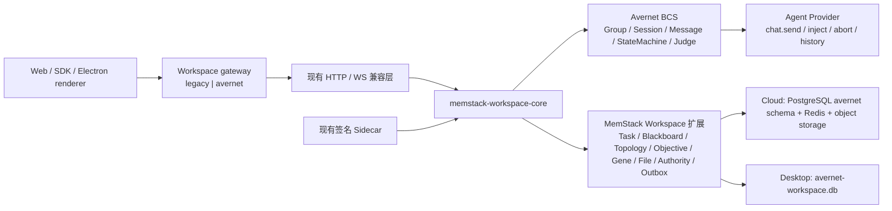

# Avernet Workspace Core 迁移契约

状态：Phase 1、Phase 2 数据底座与 Phase 3 gateway/Runtime 基座已落地；Cloud 默认权威已切换到 Avernet，生产发布门禁仍需逐项验收。

本文是实施契约，不表示 24–32 周迁移已经完成。当前交付建立了固定上游、隔离工具链、PostgreSQL/领域 schema、迁移 CLI、整组 gateway、Agent Provider、终态恢复、公开 API 能力握手和后续阶段的硬门禁。Cloud 默认配置选择 Avernet；缺少 Core 连接与独立服务凭据时启动失败，legacy 只能由隔离迁移或回滚进程显式选择。Rust Core 已声明并验证冻结清单中的 92/92 条公开兼容 handler，`implemented_contract_sha256` 与完整 OpenAPI 契约一致，route-key hash 也与冻结 manifest 一致，`complete=true`。固定导入完整性、全事件 parity、Live Agent/Core/Ray E2E 和 Desktop helper 本地进程链已经闭环，但生产规模迁移演练、正式签名/公证和真实更新频道回滚仍是硬门禁。

## 已落地基线

| 项目 | 当前值 |
| --- | --- |
| Vendored 路径 | `third_party/avernet-bcs/` |
| Avernet commit | `e470fb3d88979b9da8dc11c63f9d9c4b73343c9d` |
| `src/bcs` tree | `a5f7da1ab934cee9d2e8e2156605c2632e2c6b12` |
| 上游文件 | 1,126 个文件（包含上游根 `LICENSE`） |
| 下游差异 | 58 个已评审 patch，178 个已登记 addition |
| Cargo workspace | 87 packages / 87 members，edition 2024，MSRV 1.91 |
| 隔离工具链 | Rust 1.91.1，独立 `RUSTUP_HOME`、`CARGO_HOME` 和 target cache |
| Protobuf 工具 | `protoc` 25.3，按平台固定 SHA-256；当前 commit 的 Rust 构建不直接依赖它 |
| 更新策略 | 不自动同步上游；每次刷新单独评审 commit/tree、许可、SBOM、API 和迁移兼容性 |

`UPSTREAM_MANIFEST.sha256` 校验内容，`UPSTREAM_TREE.tsv` 校验精确路径集合和 executable mode。MemStack overlay 仅允许 `UPSTREAM.md`、两个 manifest、`rust-toolchain.toml` 和 `Makefile`。

### 基线测试的串行约束

Rust 1.91.1 下首次默认并行执行 `cargo test --workspace --locked` 时，
`bcs-api-http` 的日志捕获断言失败。失败测试单独执行通过，同一测试二进制以
`--test-threads=1` 执行 26/26 通过；并行复跑时失败会在两个日志捕获测试之间漂移。
根因是这些上游测试共享 tracing 日志状态，属于测试隔离竞争，而不是已证明的产品逻辑失败。

因此仓库基线门禁固定 `RUST_TEST_THREADS=1` 并保留首次并行失败记录。后续刷新上游时应先验证
是否已消除共享 tracing 状态；在此之前不得把默认并行 workspace test 表述为稳定通过。完整串行
workspace unit/integration/doc test 已在隔离工具链下以 exit 0 完成；需要外部 Moltis、MySQL 或其他
服务的测试仍按上游声明为 ignored，不能视为已覆盖。

## 目标运行边界



- Tenant、User、Project、认证、Agent Runtime、Memory/Neo4j、Sandbox/MCP 继续是外部平台能力。
- Gateway 只能以结构化 `legacy | avernet` 配置切换完整 Workspace 路由组；不允许按单条路由形成长期混合权威。
- 新核心不得复用旧 Workspace 表。Cloud 只写 PostgreSQL `avernet` schema；Desktop 只写 `avernet-workspace.db`。
- 生产二进制禁止自动 DDL；Cloud schema 只通过 Alembic 创建和升级。
- 终态必须先持久化为可重放消息和 outbox 历史，再完成 execution/pipeline 状态。

当前 gateway 使用独立、不可变的 `WorkspaceCoreSettings`，不扩张全局 `Settings`：

- `WORKSPACE_CORE_BACKEND=legacy|avernet` 只允许整组切换；默认 `avernet`，legacy 必须显式选择。
- `WORKSPACE_CORE_SHADOW_READ_ENABLED=true` 可在 legacy 仍为唯一写权威时启用
  `health/read_snapshot` 对比客户端。
- backend 为 `avernet` 或启用 shadow read 时，必须同时配置
  `WORKSPACE_CORE_BASE_URL` 与轮换的 `WORKSPACE_CORE_SERVICE_TOKEN`。
- Avernet 模式已经按同一份 FastAPI/OpenAPI 契约注册全部 92 条 proxy route，并只转发白名单 header、
  结构化 scope 与用户凭证；Core 不可达时统一返回 503，绝不回落 legacy。
- Cloud `task-sessions` 不属于冻结的 92 条公开路由；在 Core 提供等价的原子 command 前，Avernet
  模式稳定返回 503，禁止回落后写入旧 Workspace、Member、Policy 或 Message 表。
- Rust Core 除 snapshot、成员权限、Runtime correlation/terminal/recovery 等私有 handler 外，已实现
  冻结 manifest 中 Workspace、Task、Plan、Message、Blackboard/File、Topology、Collaboration、Objective、
  Gene、Autonomy、Policy 与 Context 全部 92 条公开 handler。
- Workspace create/update/delete、Member add/update/remove 和 Agent bind/update/unbind 已复用同一
  PostgreSQL/SQLite 原子命令内核。九个写接口的状态码、响应/错误 envelope、权限、CAS、幂等回放、
  事件和 BCS Group/Bot/Participant 原子性已通过整组 HTTP、SQLite、真实 PostgreSQL 与旧 Python
  Router 合同，并已加入 `IMPLEMENTED_PUBLIC_ROUTES`。
- Agent bind 在外部 Agent Registry 验证通过后才写 binding/Bot/Participant；Registry 缺失或不可用
  fail closed，viewer 在外部调用前被拒绝。existing POST 保留 binding ID 并写 `is_update=true`，unbind
  删除 roster 后仍可由 receipt 重放；Agent 与 Topology 坐标冲突、保留中心、半径和 32 字符主题色均有
  应用层与 PostgreSQL 约束合同。
- Member 列表只读取正式的 `avernet.workspace_principal_identities` 投影；邮箱缺失时 fail closed，
  不再把 BCS `external_user_name` 或 `user_name` 猜作邮箱。迁移 upsert 会在源值变化时刷新非键列，
  并以真实 PostgreSQL 合同覆盖用户邮箱增量更新。
- Agent Policy 的 Workspace GET/PATCH 与 legacy routing-policy GET/PUT 已完成 Provider registry、
  权限、CAS、幂等、JSONB 和 outbox 合同；不存在 policy 时使用 registry 返回的结构化 tenant default。
- Workspace Context GET/switch 只读取 Project membership 镜像与正式 active context projection；多候选
  通过结构化 JudgePort 裁决并持久化 user-scoped audit。Context CAS、请求 hash 幂等重放、冲突、
  durable outbox、dispatcher lease/retry/finalize 以及失败全事务回滚已通过 SQLite 和真实 PostgreSQL 合同。
- Workspace、Agent、Member 三个列表已对齐 FastAPI 的 `limit/offset/active_only` 接受范围和
  Pydantic 422 detail envelope，不依赖 Axum 默认 400 rejection。
- Core 通过受 service token 保护的 `/internal/v1/capabilities/workspace-public-api` 声明
  `implemented_routes`、route-key hash 和完整契约状态。Gateway 在启动 recovery worker 前强制校验
  92 条 route、完整 OpenAPI hash `a20b3f3a...a9623` 与 route-key hash；当前声明为 92/92，
  implemented route-key hash `e4fea050...3bb3f07`、`complete=true`，且
  `implemented_contract_sha256=a20b3f3a...a9623`。因此配置与 Core 可达时
  `WORKSPACE_CORE_BACKEND=avernet` 可通过公开能力启动握手；任一数量或 hash 漂移仍会在启动期明确失败，
  不会把能力缺失延迟成逐请求 404。

## HTTP 契约清单

下表是 Phase 1 必须被冻结为 golden contract 的路由族。所有状态码、错误 envelope、分页、权限和尾斜杠行为都必须保持。

| 路由族 | 当前数量 | Legacy 源 | Avernet/扩展落点 |
| --- | ---: | --- | --- |
| Tenant/Project Workspace CRUD、成员、Agent | 14 | `routers/workspaces.py` | Group、Bot、Participant + Workspace Profile/ACL |
| Workspace Task CRUD、分配、claim、状态、恢复 | 14 | `routers/workspace_tasks.py` | Workspace Task/Attempt 扩展 |
| Plan snapshot、iteration、delivery、replan/review | 11 | `routers/workspace_plans.py` | CollaborationDefinition + StateMachine Run/Node + Plan 扩展 |
| Workspace Message create/list/mentions | 3 | `routers/workspace_chat.py` | Session Message + correlation projection |
| Blackboard post/reply/file/diagnostics | 19 | `routers/blackboard.py` | Blackboard/File 扩展 + object/vault reference |
| Topology node/edge CRUD | 10 | `routers/topology.py` | Topology 扩展 |
| Collaboration authority/mutation | 3 | `routers/workspace_collaboration_mutations.py` | Authority revision + mutation receipt 扩展 |
| Autonomy | 1 | `routers/workspace_autonomy.py` | Agent-judged autonomy use case |
| Agent/routing policy（含 legacy alias） | 4 | `routers/workspace_agent_policy.py` | Workspace policy 扩展 |
| Workspace context/switch | 2 | `routers/workspace_context.py` | Identity mirror + active context projection |
| Objective CRUD / task materialization | 6 | `routers/cyber_objectives.py` | Workspace Objective 扩展 |
| Gene CRUD / workspace association | 5 | `routers/cyber_genes.py` | Workspace Gene 扩展 |

当前运行时共 92 个唯一 method/path，来自 12 个 endpoint module。完整 golden 位于
`docs/architecture/workspace-core-route-manifest.json`，包含 106 个传递引用 OpenAPI schema；
`scripts/workspace-core/generate-route-manifest.py --check` 在契约漂移时失败并输出 diff。
Workspace context、Objective、Gene，以及 `workspace_agent_policy` 的当前接口和
`/api/v1/llm-providers/routing-policy` legacy alias 都属于同一整组开关，禁止单独落回旧权威。
该 inventory 不替代字段级数据库映射和运行时行为 parity。

### 公开 API 分波交付

| 波次 | 路由族 | 数量 | 当前状态 | 完成定义 |
| --- | --- | ---: | --- | --- |
| A | Workspace/Profile/Member/Agent、Context、Authority、Agent Policy | 23 | 23/23；含 2 条 Collaboration Mutation | BCS Group/Bot/Participant 与扩展表同事务一致；身份镜像、分页、错误和 outbox parity 全过 |
| B | Task、Plan、Message | 28 | 28/28；HTTP、SQLite、PostgreSQL、生产 composition 与 workers 已验证 | Task/Attempt、StateMachine、Session Message 和 terminal history 形成唯一可重放权威 |
| C | Blackboard/File、Topology | 29 | 29/29；File、diagnostics、Post/Reply 与 Topology 合同已验证 | 对象/vault 引用校验、文件流式响应和全部旧事件顺序保持 |
| D | Objective、Gene、Autonomy | 12 | 12/12；Objective、Gene 与 Agent-judged Autonomy 已验证 | Objective/Gene 正式领域模型；Autonomy 的语义 verdict 只由结构化 Agent/Judge 给出 |

每条 route 只有在 method/path、成功响应、错误 envelope、权限、分页/尾斜杠及副作用事件 golden
全部通过后才能加入 Rust `IMPLEMENTED_PUBLIC_ROUTES`。部分实现只报告 route-key hash，禁止填写
完整 `implemented_contract_sha256`；只有 92/92 合同全绿时才能声明完整 manifest hash并让 Gateway 启动。

最后 17 条公开 API 的闭合证据如下：

1. File 7：Object Store Port 使用 `staging → checksum → metadata transaction → finalize → compensation`；文件二进制不进入 BCS 数据库。Multipart 请求 hash、大小限制、unexpected/重复 file part、暂存清理和 finalize compensation 均有合同覆盖。
2. Execution diagnostics 1：只读可重放的结构化执行投影，不依赖旧表或日志文本推断。
3. Objective 6 与 Autonomy 1：Objective 使用正式领域表；Autonomy 的语义 verdict 经结构化 Judge 并持久化审计。
4. Collaboration Mutation 2：按 surface 分派正式 use case；命令、receipt、revision 与 outbox 在 SQLite 和真实 PostgreSQL 中保持原子提交、重放与冲突回滚。

### M1 事务内核实施状态

- `memstack-workspace-service-api` 已冻结 Wave A 九种结构化 command envelope，包含 scope、actor、
  expected revision、idempotency key 和 canonical request hash。
- `memstack-workspace-store` 已实现现有 Workspace 的 PostgreSQL/SQLite 同构事务计划：访问校验、
  checked receipt reservation、revision lock/check、checked domain write、authority CAS、durable outbox、
  receipt finalize 和最终回读必须全部成功才提交。
- SQLite 合同已对 receipt、revision、domain、CAS、outbox、finalize 和最终回读逐点注入失败并验证
  全量回滚；PostgreSQL 原生 `$1...` statement 合同与可选真实数据库回滚合同已建立。
- Create Workspace 已使用独立的 PostgreSQL/SQLite 事务计划：Project membership 访问校验、BCS Group、
  Human Participant、Workspace Profile、owner ACL、初始 authority revision、receipt 和唯一的 owner
  `workspace_member_joined` outbox 在同一事务中提交。SQLite 已覆盖每个 checked write 边界的失败回滚、
  幂等回放/hash 冲突和重复 Workspace 冲突；真实 PostgreSQL 合同已加入 schema 门禁。
- `memstack-workspace-service` 已成为 Store 之上的应用层，负责规范 request hash、强类型 command/profile/
  owner、事件 payload 和结构化错误分类。受 service token、actor header 与显式幂等键保护的内部 Create
  HTTP 端点已通过 SQLite 与真实 PostgreSQL 首次提交/重放合同；Core 状态可显式选择 PostgreSQL 或
  SQLite，默认仍为 PostgreSQL。
- 公开 Workspace create/update/delete、Member add/update/remove、Agent bind/update/unbind 已完成 legacy
  请求/响应、状态码、错误、权限、CAS、幂等和 durable outbox 合同。SQLite golden、真实 PostgreSQL
  原子/故障回滚/几何合同及旧 Python Router 合同整组通过；Policy 与 Context 也已通过对应 HTTP、
  SQLite、真实 PostgreSQL 和旧 Python Router 合同。Task 14、Plan 11、Message 3、Blackboard/File/diagnostics 19、Topology 10、Objective 6、Gene 5、Autonomy 1 与 Collaboration Mutation 2 也已通过对应 HTTP、SQLite、真实 PostgreSQL 和生产 composition/worker 门禁，因此 capability 已推进到 92/92；
  `implemented_contract_sha256` 与冻结 manifest 一致且 `complete=true`。这授权 Gateway 通过能力握手，但不替代剩余发布门禁。

## 事件兼容清单

兼容桥必须维持以下现有事件名和 payload schema，写入路径固定为“同一事务落库 → outbox → Redis Streams → Web/Desktop”。

| 领域 | 现有事件 |
| --- | --- |
| Workspace/成员/Agent | `workspace_updated`、`workspace_deleted`、`workspace_member_joined`、`workspace_member_updated`、`workspace_member_left`、`workspace_agent_bound`、`workspace_agent_unbound` |
| Message | `workspace_message_created` |
| Task | `workspace_task_created`、`workspace_task_updated`、`workspace_task_deleted`、`workspace_task_status_changed`、`workspace_task_assigned`、`task_execution_session_updated`、`task_execution_incident_opened`、`task_recovery_action_started`、`task_recovery_action_completed` |
| Blackboard/File | `blackboard_post_created`、`blackboard_post_updated`、`blackboard_post_deleted`、`blackboard_reply_created`、`blackboard_reply_updated`、`blackboard_reply_deleted`、`blackboard_file_created`、`blackboard_file_updated`、`blackboard_file_deleted`、`blackboard_directory_deleted` |
| Topology | `topology_updated` |
| Plan/Goal | `workspace_plan_updated`、`workspace_goal_materialized`、`workspace_decomposition_complete`、`workspace_worker_dispatched`、`workspace_worker_report_submitted`、`workspace_adjudication_complete`、`workspace_goal_completed` |
| 通用 Agent UI 兼容 | `task_list_updated`、`task_updated`、`task_start`、`task_complete`、`artifact_created`、`artifact_ready`、`artifact_error`、`artifacts_batch` |

每个事件必须保留 `tenant_id/project_id/workspace_id/task_id/plan_node_id/conversation_id` 中适用的关联字段、原事件顺序和幂等键。重复回调只能推进一次副作用。

## 数据权威映射

| Legacy 表/能力 | 新权威 | 保留规则 |
| --- | --- | --- |
| `workspaces` | BCS Group + `avernet.workspace_profiles` | 原 `workspace_id` 不变 |
| `workspace_members` | Human Participant + `avernet.workspace_members` | `owner/editor/viewer` 精确保留 |
| `users`（Workspace 成员子集） | `avernet.workspace_principal_identities` | 邮箱、显示名、active 状态显式镜像；User 仍是外部权威 |
| `workspace_agents` | BCS Bot + Group Participant + binding profile | 原 WorkspaceAgent ID 和 agent definition ref 保留 |
| `workspace_agent_policies` | `avernet.workspace_agent_policies` | 不转成文本启发式策略 |
| `workspace_collaboration_authorities` | `avernet.workspace_authorities` | revision/CAS 是唯一写权威 |
| `workspace_collaboration_mutation_receipts` | `avernet.workspace_mutation_receipts` | 幂等 key、请求 hash、结果和 revision 保留 |
| `workspace_messages` | BCS Session Message + `avernet.workspace_message_correlations` | 原 message/conversation ID 与终态可重放性保留；Message store/conformance 与 delivery worker 已通过合同 |
| `workspace_tasks` | `avernet.workspace_tasks` | 正式可查询领域表 |
| `workspace_task_session_attempts`、`task_session_creation_receipts` | `avernet.workspace_task_attempts`、receipts | attempt、root goal、conversation、重启输入保留 |
| `blackboard_posts`、`blackboard_replies` | `avernet.workspace_blackboard_posts/replies` | pin、author、reply 关系保留 |
| `blackboard_files` | `avernet.workspace_files` | 只迁校验后的对象存储/vault 引用、checksum 和元数据 |
| `topology_nodes`、`topology_edges` | `avernet.workspace_topology_nodes/edges` | 节点/边 ID、坐标和引用完整保留 |
| `cyber_objectives` | `avernet.workspace_objectives` | scope、验收条件和状态正式建模 |
| `cyber_genes` 及 workspace 关联 | `avernet.workspace_genes` | Gene 内容、版本、来源关系保留；公共 Gene 市场仍是外部能力 |
| `workspace_plans` | BCS CollaborationDefinition + `avernet.workspace_plans` | 原 plan ID、版本和 source contract 保留 |
| `workspace_plan_nodes` | StateMachine Node + `avernet.workspace_plan_nodes` | 原 node ID、依赖、iteration 和 review 状态保留 |
| `workspace_plan_blackboard_entries`、`workspace_plan_events` | `avernet.workspace_plan_blackboard_entries/events` | 事件序列和规范化 payload hash 保留 |
| `workspace_plan_outbox`、`workspace_blackboard_outbox` | `avernet.workspace_outbox` | 事务写、lease、attempt、next retry 和终态保留 |
| `workspace_pipeline_contracts/runs/stage_runs` | `avernet.workspace_pipeline_*` | worktree/CI/CD contract 和 attempt correlation 保留 |
| `workspace_deployments`、`cicd_pipeline_*` | `avernet.workspace_deployments` + 外部 CI adapter | 新核心保存权威记录，不接管外部 runner |
| `agent_tasks`、`agent_plan_versions`、`agent_plan_runs` 的 Workspace 投影 | StateMachine correlation + `avernet.workspace_agent_runtime_correlations` | Agent Runtime 本身不迁移 |
| `agistack_desktop_workspace_contexts/events` | Cloud `avernet.workspace_contexts/events` + 待实现 Desktop `avernet-workspace.db` 同构 projection | 首次启动迁移后旧库只读保留至少 30 天 |

任何不能逐字段无损映射的列都必须先进入正式扩展 schema。禁止把 Task、权限、Authority、Objective、Gene、Topology、File、CI/CD 或 outbox 塞进通用 `extensions` JSON。

Alembic head `727ce1982b0f` 已创建 `project_principal_memberships`、`workspace_contexts`、
`workspace_context_events`、`workspace_context_outbox`、`workspace_message_correlations` 和
`workspace_message_delivery_outbox` 等正式关系表。权威 `user_projects +
projects` 已通过冻结列契约、Project/Workspace scope 过滤和规范化 hash 投影到
`project_principal_memberships`，并进入真实 PostgreSQL 迁移演练。Context event 请求 hash、Judge audit
用户归属、独立 outbox、Message delivery durable snapshot、File object/compensation、Objective projection
与 Autonomy tick/audit 已进入 schema 与真实门禁。Gene 表的 `updated_at` 也已对齐 legacy 可空契约；
全部公开领域已具备正式迁移映射、store 与 PostgreSQL/SQLite conformance，不允许回读旧 Workspace 表
或用通用 JSON 代替。

## PostgreSQL 实现状态与门禁

PostgreSQL 数据底座已经本地源码实现：

1. `bcs-db-api` 已提供方言感知 `DbStatementBuilder`、typed bind、验证后的 identifier、
   `DbSqlFlavor::Postgres` 与结构化 constraint error。Builder 按方言生成 PostgreSQL `$1...`
   或 SQLite/MySQL `?`，不扫描和替换 raw SQL。
2. BCS 生产 store 已迁入方言分支；Group DM conflict target 与 Relation outcome 不再依赖
   MySQL affected-row 猜测。SQLite、MySQL、PostgreSQL repository conformance 均已建立。
3. `bcs-db-postgres` 固定 `search_path=avernet,public`，覆盖 BOOLEAN、JSONB、时间、typed NULL、
   transaction/CAS/locking/RETURNING，并通过真实 PostgreSQL 插件与 store 合同。
4. Alembic head `727ce1982b0f` 创建/升级 `avernet` schema；当前合同为 73 张表、61 个触发器。Workspace Profile 使用正式 tombstone 字段关闭 BCS Group 并隐藏活动读，确保删除后 mutation receipt 与 durable outbox 仍可重放；Context 使用独立 outbox、请求 hash 和 user-scoped Judge audit；Message delivery 使用正式 outbox 表和不可变快照 trigger 保存目标、租约、重试和终态。
   生产二进制不会自动执行 DDL。
5. Python 迁移 CLI 已具备 dry-run、execute、validate、reverse-export 与账本模型；真实 PostgreSQL
   门禁覆盖关联字段 round-trip、stale claim、排他租约、Judge 审计、terminal 清租约、未 ACK 重领、
   callback ACK、Project membership 内容/hash、内部 Create HTTP 首次提交/重放、事务回滚以及完整 downgrade。

本地开发 PostgreSQL 快照已完成三轮真实 `dry-run -> execute -> validate -> reverse-export`
和三次全新数据库恢复：174 条复制的 legacy 依赖记录形成 134 条映射记录，每轮反向导出
114 条，快照 SHA-256 固定为
`962cd2bc2253e9a3c62d3f4376c011e49799df95f06101b51c9daa94d3d1eec7`，孤儿为 0；迁移加校验
为 0.347-0.394 秒，恢复为 0.927-0.987 秒。证据明确标注 `productionEvidence: false`，因此不能
替代生产规模三次演练。

剩余阻断项是生产规模三次迁移演练和 Desktop 外部发布门禁，
而不是 PostgreSQL driver、公开路由覆盖、全事件 parity、Workspace 基础写权威、Policy 或 Context
的双库事务本身。

## 供应链与构建溯源门禁

固定的 `cargo-audit 0.22.2 --deny warnings` 已对当前 Cargo.lock 通过 RustSec 门禁。旧锁文件中的
`rkyv 0.7.46`、`rsa 0.9.10`、`proc-macro-error2 2.0.1` 和 `lru 0.12.5` 坐标已不再存在；不使用
advisory allow-list 绕过失败。Cargo/npm CycloneDX 1.6 SBOM 可重复生成门禁、license-policy
检查、npm lockfile inventory 和 MIT notice 已落地并通过。

两个上游 `build.rs` 已改为分别嵌入 `MEMSTACK_HOST_GIT_REVISION` 与固定的
`AVERNET_UPSTREAM_GIT_REVISION=e470fb3d...3c9d`，并以 `SOURCE_DATE_EPOCH` 生成可复现日期；
不再读取 vendored 目录的 Git 状态或 wall clock。

共享树中原有的 414 个未登记上游漂移已逐项分类：404 个纯 `rustfmt` 漂移恢复为
`e470fb3d` 上游原字节，10 个必要语义差异保留并以精确路径、上游哈希、本地哈希和理由登记为
downstream patch。没有修改上游 manifest/tree，也没有通过重算上游基线合法化漂移。当前
`verify-import` 对 1,126 个上游文件、58 个 patch 和 178 个 addition 通过；
`verify-import-test` 与 Cargo metadata 同时通过。

## Agent Provider 与 Agent First

- Provider 必须支持 `chat.send`、`chat.inject`、`chat.abort`、`chat.history`。
- `/bot/events` 终态回调必须先写入 Session Message/history 和 outbox，再完成 run 状态。
- Runtime correlation 持久化 user/group/provider 关联；终态 callback 成功后 ACK Core。进程崩溃、
  callback 丢失或 terminal-but-unacked 时，由排他 lease Worker 重放；终态已存在时禁止重跑 Agent。
- 无终态的 stale run 只能由强制结构化 `decide_runtime_recovery` 工具调用给出
  `continue | fail | escalate`。Judge 不可用时只等待租约过期，禁止启发式语义 fallback。
- Stop 同时取消 Ray actor 与 detached local worker，不能在取消其中一个后提前返回。
- 计划评审、Supervisor、验证结论和路由歧义必须由 `JudgePort` 或 Agent 结构化工具调用裁决，并审计 `agent_id/tool/input/output/rationale/latency_ms`。
- CAS、权限集合、计数、FIFO、幂等、超时扫描和 schema 校验保持确定性；阈值只能触发判断，不能代替语义 verdict。

真实 Live gate 已在独立 PostgreSQL Core、专用 Avernet API 和运行中的 Ray worker 上完成：
92/92 capability、Workspace/active Agent/Group/Session 投影预检通过，两次 `chat.send`、一次
`chat.inject`、50 条 durable history、重复投递稳定性、三份 terminal/outbox proof 和活动
`chat.abort` 全部成立；取消实际命中 detached local worker。脱敏证据为
`docs/architecture/workspace-live-agent-e2e-evidence-2026-08-11.json`。Gate 固定要求
`memstack-workspace-agent-runtime` Provider identity，避免把 LLM provider UUID 误传给 BCS。

## Desktop helper 门禁

新核心由现有签名 Sidecar 监管，Electron 不直接启动或访问 helper。

1. Sidecar 完成现有 Tauri 数据迁移。
2. 在 `DesktopSessionStore::open` 获取 SQLite EXCLUSIVE/WAL 权威锁之前，生成旧 `agistack-desktop-sessions.db` 的只读快照或完成迁移。
3. Helper 写入临时 `avernet-workspace.db`，校验记录数、ID、规范化 hash 和孤儿关系后原子 rename。
4. Helper 通过私有 stdio JSONL + nonce/HMAC 握手；`env_clear()` 后只恢复必要系统变量，禁止接收 vault 路径、Provider key 或用户 token。
5. Renderer 继续只访问 Sidecar API；Sidecar 校验 launch capability、session 和 active scope 后代理整组 Workspace 路由。
6. 第一条 Avernet 写入前允许本版本回退 legacy；出现新写入后禁止自动回退，必须走反向 outbox export。

`data_migration::migrate_legacy_data` 的 GitNexus upstream impact 为 HIGH（4 个直接依赖、3 个模块），后续不得直接扩写；使用新增 `workspace_core_migration` 模块。当前 release CI 也没有真实 updater apply/失败回滚测试，这在 Desktop 同波次发布前是硬阻断项。

当前本地 helper 合同、Supervisor、真实 Sidecar 到 Core、退出清理和 updater 事务原语均已通过；
`make -C agi-stack run-desktop` 已确认 Electron 只启动 Sidecar，再由 Sidecar 监管统一缓存路径中的
`memstack-workspace-core`，正常退出后没有 orphan。以上仅证明本地进程、打包合同和失败回滚原语，
不能代替 Apple Developer ID、公证、Windows Authenticode 或正式更新频道中的真实 apply/rollback。

完整 `make -C agi-stack desktop-bundle` 已构建 Electron renderer、release Sidecar、release Core、
ZIP、DMG 和 blockmap；随后 `desktop-bundle-smoke` 返回 `DESKTOP_BUNDLE_SMOKE_OK`，32/32 个聚焦
helper/signing/artifact/updater 合同通过。ZIP/DMG 解包后的 Core 与 Sidecar 分别匹配 SHA-256
`9d82a53d...190df7` 和 `99f248f6...6b3c1`，并均为 macOS arm64。真实系统门禁仍明确失败：App/Core
只有 adhoc 签名且没有 `TeamIdentifier`，`spctl` 拒绝 App，`stapler validate` 报告 DMG 没有公证
ticket；本地 updater 事务测试也没有连接正式更新频道。因此 Desktop 本地构建完成，但发布保持
No-Go。

## 阶段门禁

| 阶段 | 必须交付 | 当前状态 |
| --- | --- | --- |
| 1 基线 PoC | 固定导入、许可/来源、隔离工具链、metadata、全 workspace check/test、合同和状态机测试 | `verify-import` 已恢复并验证 1,126 upstream / 58 patch / 178 addition；RustSec、license/SBOM、build provenance 与 metadata 通过 |
| 2 PostgreSQL/领域扩展 | Builder、12 store 迁移、PG plugin、Alembic `avernet` schema、迁移账本/CLI、三方 conformance | 73 表/61 触发器及全部 Workspace 领域权威合同已落地；本地 PostgreSQL 快照三轮迁移和全新库恢复通过，仍待生产规模快照三轮演练 |
| 3 API/事件/Runtime | 92 路由 golden、WS 事件桥、Provider、可重放终态、整组 gateway flag | 92/92 公开 capability、166 条 Python 事件全量 parity 与真实 Live Agent/Core/Ray E2E 均通过；50 条 history、三份终态 proof、重复幂等与活动取消有脱敏证据 |
| 4 Desktop | helper 监管、迁移、签名/打包、崩溃恢复、真实 updater apply/rollback | 本地 Electron→Sidecar→Core、完整 macOS bundle/smoke、helper 合同、崩溃/退出清理及 updater 事务原语通过；当前 adhoc App 被 `spctl` 拒绝且 DMG 无公证 ticket，正式签名/公证、Windows Authenticode 和正式频道 rollback 为外部门禁 |
| 5 演练/发布 | 三次生产规模演练、70 分钟迁移、15 分钟恢复、全矩阵回归 | 本地 134 条映射记录三轮实测通过；生产规模快照身份、记录数、SHA-256 和独立恢复环境缺失，保持 No-Go |

## 本地验证

```bash
make -C third_party/avernet-bcs verify-import
make -C third_party/avernet-bcs metadata
make -C third_party/avernet-bcs baseline
make -C third_party/avernet-bcs test
make -C third_party/avernet-bcs audit
make -C third_party/avernet-bcs supply-chain
uv run python scripts/workspace-core/generate-route-manifest.py --check
uv run python scripts/workspace-core/generate-implementation-ledger.py --check
uv run python scripts/workspace-core/verify-event-parity.py
uv run pytest src/tests/unit/infrastructure/adapters/primary/web/test_workspace_core_route_manifest.py -q
uv run python scripts/avernet-bcs/verify-postgres-schema.py
uv run python scripts/avernet-bcs/verify-workspace-migration.py
uv run pytest src/tests/unit/infrastructure/workspace_core/test_workspace_core_compatibility.py -q
make -C agi-stack desktop-bundle-smoke
```

`audit` 要求 CI 固定的 `cargo-audit 0.22.2`。`supply-chain` 依次执行 license policy、可重复 Cargo/npm SBOM 和 RustSec `--deny warnings`；`verify-import` 仍是独立的内容与路径完整性否决项，当前结果为 1,126/58/178 通过。
