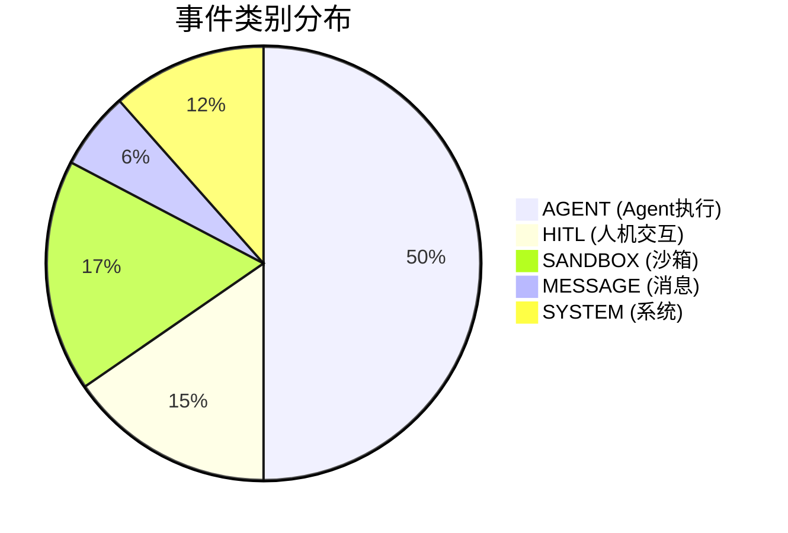
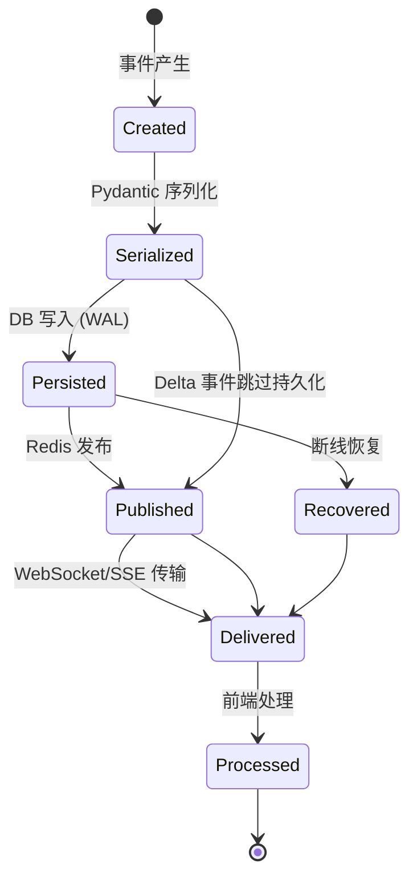
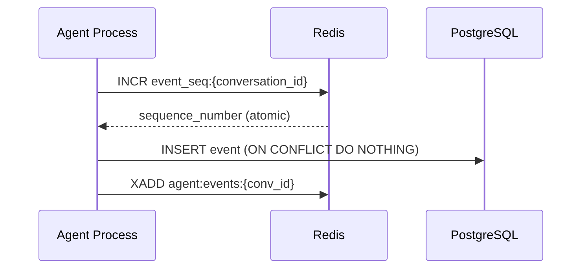
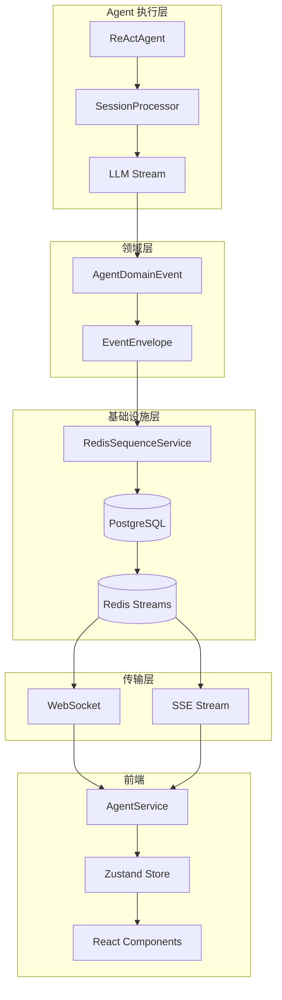
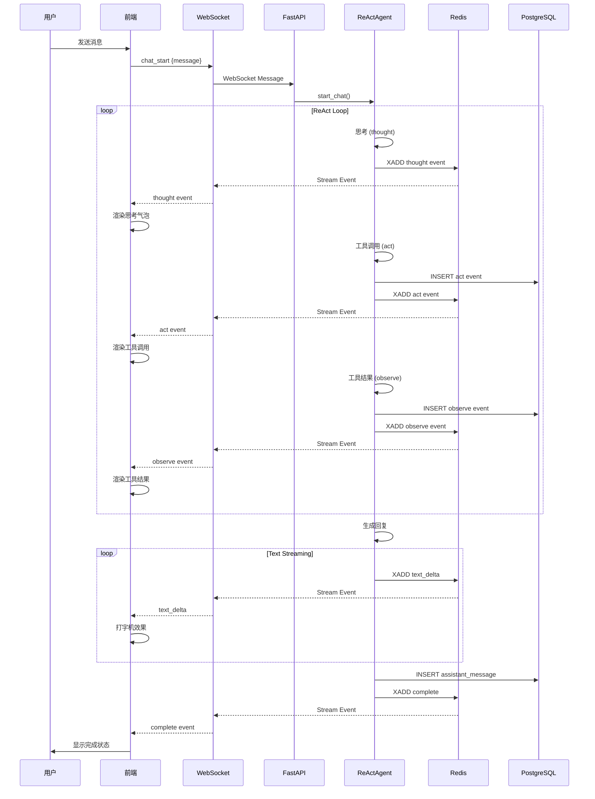
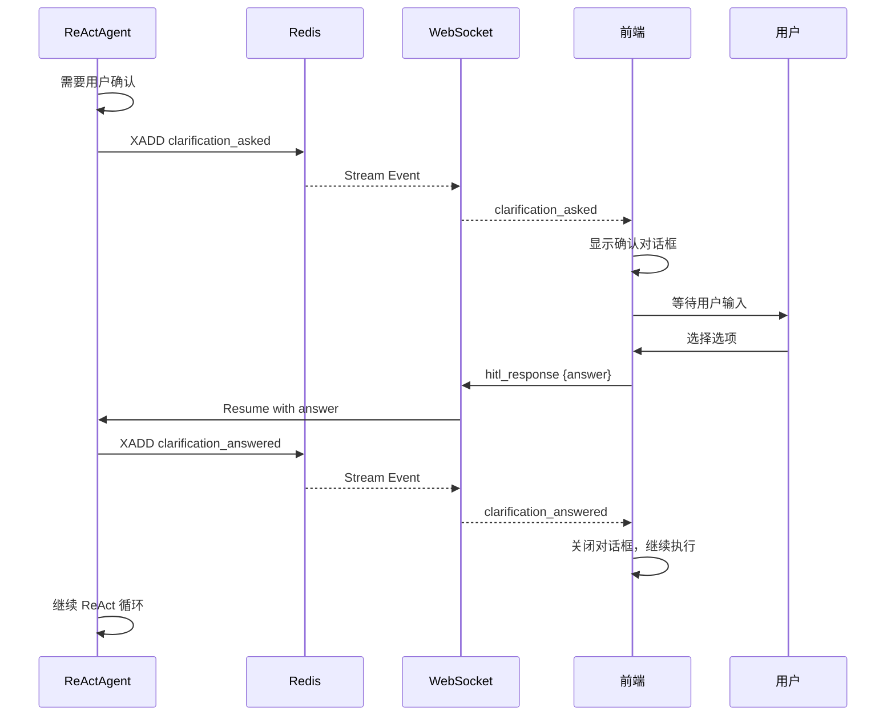
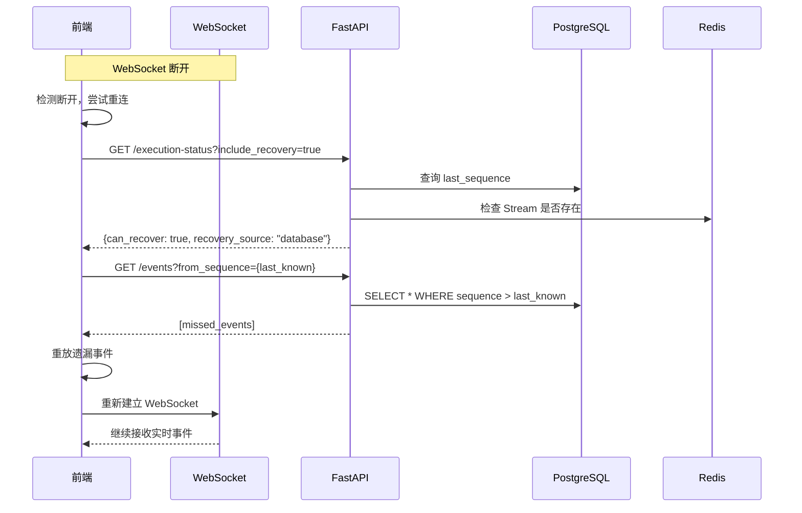

# MemStack 事件体系时序完整指南

> **版本**: 1.0  
> **最后更新**: 2026-02-04  
> **状态**: 完整文档

本文档全面梳理 MemStack 平台的事件体系，包括事件类型分类、生命周期、时序机制、数据流向、前后端映射关系等核心内容。

---

## 目录

1. [概述](#1-概述)
2. [事件类型完整分类](#2-事件类型完整分类)
3. [事件生命周期](#3-事件生命周期)
4. [时序机制详解](#4-时序机制详解)
5. [数据流架构图](#5-数据流架构图)
6. [前后端映射关系](#6-前后端映射关系)
7. [故障恢复机制](#7-故障恢复机制)
8. [最佳实践](#8-最佳实践)
9. [相关文件索引](#9-相关文件索引)

---

## 1. 概述

### 1.1 事件系统定位

MemStack 的事件系统是整个 Agent 执行引擎的核心通信机制，负责：

- **实时流式传输**: Agent 思考、工具调用、文本生成等实时状态
- **持久化存储**: 支持会话重放、断线恢复、历史查询
- **前后端解耦**: 统一的事件协议，支持 WebSocket 和 SSE 两种传输方式
- **多域支持**: Agent、HITL（人机交互）、Sandbox（沙箱）、System 四大领域

### 1.2 核心指标

| 指标 | 数值 | 说明 |
|------|------|------|
| 事件类型总数 | **52 种** | AgentEventType 枚举 |
| 事件类别 | **5 个** | AGENT, HITL, SANDBOX, SYSTEM, MESSAGE |
| 前端已处理 | **33 种** (63%) | 直接影响 UI 渲染 |
| 内部事件 | **2 种** | COMPACT_NEEDED, RETRY (不暴露给前端) |
| Delta 事件 (不持久化) | **4 种** | 流式片段，仅实时传输 |
| Terminal 事件 | **3 种** | COMPLETE, ERROR, CANCELLED |
| HITL 交互事件 | **4 种** | 需要用户响应 |

### 1.3 架构原则

```
┌─────────────────────────────────────────────────────────────────────┐
│                     EVENT SYSTEM PRINCIPLES                          │
│                                                                      │
│  1. Single Source of Truth: AgentEventType 枚举是唯一事件类型定义     │
│  2. Event Sourcing: 所有状态变化都通过事件表达                        │
│  3. WAL Pattern: 先写 DB，后发 Redis（可靠性优先）                    │
│  4. Idempotency: (conversation_id, sequence_number) 唯一约束          │
│  5. Delta Compression: 流式片段不持久化，完整事件才存储               │
└─────────────────────────────────────────────────────────────────────┘
```

---

## 2. 事件类型完整分类

### 2.1 事件类别总览



### 2.2 完整事件分类表

#### 2.2.1 状态事件 (Status Events) - 4 种

| 枚举值 | 事件值 | 持久化 | 前端处理 | 说明 |
|--------|--------|--------|---------|------|
| `STATUS` | `status` | ✅ | ❌ | 内部状态跟踪 |
| `START` | `start` | ✅ | ❌ | Agent 执行开始 |
| `COMPLETE` | `complete` | ✅ | ✅ | Agent 执行完成 (Terminal) |
| `ERROR` | `error` | ✅ | ✅ | 执行错误 (Terminal) |

#### 2.2.2 思考事件 (Thinking Events) - 2 种

| 枚举值 | 事件值 | 持久化 | 前端处理 | 说明 |
|--------|--------|--------|---------|------|
| `THOUGHT` | `thought` | ✅* | ✅ | 完整思考内容 |
| `THOUGHT_DELTA` | `thought_delta` | ❌ | ✅ | 思考内容增量流 (Delta) |

> *`THOUGHT` 持久化可通过 `AGENT_PERSIST_THOUGHTS` 配置控制

#### 2.2.3 工作计划事件 (Work Plan Events) - 4 种

| 枚举值 | 事件值 | 持久化 | 前端处理 | 说明 |
|--------|--------|--------|---------|------|
| `WORK_PLAN` | `work_plan` | ✅ | ✅ | 工作计划创建/更新 |
| `STEP_START` | `step_start` | ✅* | ✅ | 步骤开始执行 |
| `STEP_END` | `step_end` | ✅* | ✅ | 步骤执行结束 |
| `STEP_FINISH` | `step_finish` | ✅* | ❌ | 步骤完成（含 token/cost） |

> *`STEP_*` 事件持久化可通过 `AGENT_PERSIST_DETAIL_EVENTS` 配置控制

#### 2.2.4 工具事件 (Tool Events) - 2 种

| 枚举值 | 事件值 | 持久化 | 前端处理 | 配对关系 |
|--------|--------|--------|---------|----------|
| `ACT` | `act` | ✅* | ✅ | 发起方 (`tool_execution_id`) |
| `OBSERVE` | `observe` | ✅* | ✅ | 响应方 (`tool_execution_id`) |

> ACT 和 OBSERVE 通过 `tool_execution_id` 字段配对

#### 2.2.5 文本流事件 (Text Streaming Events) - 3 种

| 枚举值 | 事件值 | 持久化 | 前端处理 | 说明 |
|--------|--------|--------|---------|------|
| `TEXT_START` | `text_start` | ❌ | ✅ | 文本流开始标记 (Delta) |
| `TEXT_DELTA` | `text_delta` | ❌ | ✅ | 文本增量内容 (Delta) |
| `TEXT_END` | `text_end` | ❌ | ✅ | 文本流结束标记 (Delta) |

> 完整文本内容在 `ASSISTANT_MESSAGE` 事件中持久化

#### 2.2.6 消息事件 (Message Events) - 3 种

| 枚举值 | 事件值 | 持久化 | 前端处理 | 说明 |
|--------|--------|--------|---------|------|
| `MESSAGE` | `message` | ✅ | ✅ | 通用消息 |
| `USER_MESSAGE` | `user_message` | ✅ | ✅ | 用户消息 |
| `ASSISTANT_MESSAGE` | `assistant_message` | ✅ | ✅ | 助手消息 |

#### 2.2.7 权限事件 (Permission Events) - 2 种

| 枚举值 | 事件值 | 持久化 | 前端处理 | 说明 |
|--------|--------|--------|---------|------|
| `PERMISSION_ASKED` | `permission_asked` | ✅ | ❌ | 请求权限 (HITL) |
| `PERMISSION_REPLIED` | `permission_replied` | ✅ | ❌ | 权限回复 |

#### 2.2.8 Doom Loop 事件 - 2 种

| 枚举值 | 事件值 | 持久化 | 前端处理 | 说明 |
|--------|--------|--------|---------|------|
| `DOOM_LOOP_DETECTED` | `doom_loop_detected` | ✅ | ❌ | 检测到死循环 |
| `DOOM_LOOP_INTERVENED` | `doom_loop_intervened` | ✅ | ❌ | 死循环干预 |

#### 2.2.9 人机交互事件 (HITL Events) - 4 种

| 枚举值 | 事件值 | 持久化 | 前端处理 | 需要响应 |
|--------|--------|--------|---------|----------|
| `CLARIFICATION_ASKED` | `clarification_asked` | ✅ | ✅ | ✅ |
| `CLARIFICATION_ANSWERED` | `clarification_answered` | ✅ | ✅ | - |
| `DECISION_ASKED` | `decision_asked` | ✅ | ✅ | ✅ |
| `DECISION_ANSWERED` | `decision_answered` | ✅ | ✅ | - |

#### 2.2.10 环境变量事件 - 2 种

| 枚举值 | 事件值 | 持久化 | 前端处理 | 说明 |
|--------|--------|--------|---------|------|
| `ENV_VAR_REQUESTED` | `env_var_requested` | ✅ | ✅ | 请求环境变量 (HITL) |
| `ENV_VAR_PROVIDED` | `env_var_provided` | ✅ | ✅ | 环境变量已提供 |

#### 2.2.11 成本追踪事件 - 1 种

| 枚举值 | 事件值 | 持久化 | 前端处理 | 说明 |
|--------|--------|--------|---------|------|
| `COST_UPDATE` | `cost_update` | ✅* | ❌ | 成本更新 |

#### 2.2.12 重试事件 - 1 种

| 枚举值 | 事件值 | 持久化 | 前端处理 | 说明 |
|--------|--------|--------|---------|------|
| `RETRY` | `retry` | ❌ | ❌ | 重试操作 (Internal) |

#### 2.2.13 上下文事件 - 2 种

| 枚举值 | 事件值 | 持久化 | 前端处理 | 说明 |
|--------|--------|--------|---------|------|
| `COMPACT_NEEDED` | `compact_needed` | ❌ | ❌ | 需要压缩 (Internal) |
| `CONTEXT_COMPRESSED` | `context_compressed` | ✅ | ✅ | 上下文已压缩 |

#### 2.2.14 模式匹配事件 - 1 种

| 枚举值 | 事件值 | 持久化 | 前端处理 | 说明 |
|--------|--------|--------|---------|------|
| `PATTERN_MATCH` | `pattern_match` | ✅* | ✅ | 工作流模式匹配成功 |

#### 2.2.15 技能执行事件 (Skill Events) - 4 种

| 枚举值 | 事件值 | 持久化 | 前端处理 | 说明 |
|--------|--------|--------|---------|------|
| `SKILL_MATCHED` | `skill_matched` | ✅ | ✅ | 技能匹配成功 |
| `SKILL_EXECUTION_START` | `skill_execution_start` | ✅ | ✅ | 技能执行开始 |
| `SKILL_EXECUTION_COMPLETE` | `skill_execution_complete` | ✅ | ✅ | 技能执行完成 |
| `SKILL_FALLBACK` | `skill_fallback` | ✅ | ✅ | 技能降级回退到 LLM |

#### 2.2.16 Plan Mode 事件 - 14 种

| 枚举值 | 事件值 | 持久化 | 前端处理 | 说明 |
|--------|--------|--------|---------|------|
| `PLAN_MODE_ENTER` | `plan_mode_enter` | ✅ | ✅ | 进入计划模式 |
| `PLAN_MODE_EXIT` | `plan_mode_exit` | ✅ | ✅ | 退出计划模式 |
| `PLAN_CREATED` | `plan_created` | ✅ | ✅ | 计划创建 |
| `PLAN_UPDATED` | `plan_updated` | ✅ | ✅ | 计划更新 |
| `PLAN_STATUS_CHANGED` | `plan_status_changed` | ✅ | ❌ | 计划状态变更 |
| `PLAN_EXECUTION_START` | `plan_execution_start` | ✅ | ✅ | 计划执行开始 |
| `PLAN_EXECUTION_COMPLETE` | `plan_execution_complete` | ✅ | ✅ | 计划执行完成 |
| `PLAN_STEP_READY` | `plan_step_ready` | ✅ | ❌ | 计划步骤就绪 |
| `PLAN_STEP_COMPLETE` | `plan_step_complete` | ✅ | ❌ | 计划步骤完成 |
| `PLAN_STEP_SKIPPED` | `plan_step_skipped` | ✅ | ❌ | 计划步骤跳过 |
| `PLAN_SNAPSHOT_CREATED` | `plan_snapshot_created` | ✅ | ❌ | 计划快照创建 |
| `PLAN_ROLLBACK` | `plan_rollback` | ✅ | ❌ | 计划回滚 |
| `REFLECTION_COMPLETE` | `reflection_complete` | ✅ | ✅ | 反思完成 |
| `ADJUSTMENT_APPLIED` | `adjustment_applied` | ✅ | ❌ | 调整已应用 |

#### 2.2.17 标题生成事件 - 1 种

| 枚举值 | 事件值 | 持久化 | 前端处理 | 说明 |
|--------|--------|--------|---------|------|
| `TITLE_GENERATED` | `title_generated` | ✅ | ✅ | 会话标题生成完成 |

#### 2.2.18 沙箱事件 (Sandbox Events) - 9 种

| 枚举值 | 事件值 | 持久化 | 前端处理 | 类别 |
|--------|--------|--------|---------|------|
| `SANDBOX_CREATED` | `sandbox_created` | ✅ | ❌ | Container |
| `SANDBOX_TERMINATED` | `sandbox_terminated` | ✅ | ❌ | Container |
| `SANDBOX_STATUS` | `sandbox_status` | ✅ | ❌ | Container |
| `DESKTOP_STARTED` | `desktop_started` | ✅ | ❌ | Desktop |
| `DESKTOP_STOPPED` | `desktop_stopped` | ✅ | ❌ | Desktop |
| `DESKTOP_STATUS` | `desktop_status` | ✅ | ❌ | Desktop |
| `TERMINAL_STARTED` | `terminal_started` | ✅ | ❌ | Terminal |
| `TERMINAL_STOPPED` | `terminal_stopped` | ✅ | ❌ | Terminal |
| `TERMINAL_STATUS` | `terminal_status` | ✅ | ❌ | Terminal |

#### 2.2.19 Artifact 事件 - 4 种

| 枚举值 | 事件值 | 持久化 | 前端处理 | 说明 |
|--------|--------|--------|---------|------|
| `ARTIFACT_CREATED` | `artifact_created` | ✅ | ✅ | Artifact 创建开始 |
| `ARTIFACT_READY` | `artifact_ready` | ✅ | ✅ | Artifact 上传完成 |
| `ARTIFACT_ERROR` | `artifact_error` | ✅ | ✅ | Artifact 处理失败 |
| `ARTIFACTS_BATCH` | `artifacts_batch` | ✅ | ✅ | 批量 Artifact |

#### 2.2.20 控制事件 - 1 种

| 枚举值 | 事件值 | 持久化 | 前端处理 | 说明 |
|--------|--------|--------|---------|------|
| `CANCELLED` | `cancelled` | ✅ | ✅ | 执行已取消 (Terminal) |

### 2.3 事件分类集合

```python
# 不持久化到数据库的事件 (流式片段)
DELTA_EVENT_TYPES = {
    "thought_delta",
    "text_delta",
    "text_start",
    "text_end",
}

# 不暴露给前端的内部事件
INTERNAL_EVENT_TYPES = {
    "compact_needed",
    "retry",
}

# 流结束标记事件
TERMINAL_EVENT_TYPES = {
    "complete",
    "error",
    "cancelled",
}

# 需要用户响应的 HITL 事件
HITL_EVENT_TYPES = {
    "clarification_asked",
    "decision_asked",
    "env_var_requested",
    "permission_asked",
}
```

---

## 3. 事件生命周期

### 3.1 事件状态机



### 3.2 事件创建流程

```
┌─────────────────────────────────────────────────────────────────────┐
│                    EVENT CREATION FLOW                               │
│                                                                      │
│  1. ReActAgent/Processor 产生领域事件                                 │
│     │                                                                │
│     ▼                                                                │
│  2. AgentDomainEvent (Pydantic Model)                                │
│     - event_type: AgentEventType                                     │
│     - timestamp: float                                               │
│     - [event-specific fields]                                        │
│     │                                                                │
│     ▼                                                                │
│  3. EventEnvelope 包装 (可选)                                         │
│     - schema_version: "1.0"                                          │
│     - event_id: "evt_xxx"                                            │
│     - correlation_id: request 追踪                                   │
│     - causation_id: 父事件 ID                                        │
│     │                                                                │
│     ▼                                                                │
│  4. 序列号分配 (RedisSequenceService.get_next_sequence)               │
│     │                                                                │
│     ▼                                                                │
│  5. 持久化 + 发布 (persist_and_publish_event)                         │
│                                                                      │
└─────────────────────────────────────────────────────────────────────┘
```

### 3.3 事件数据结构

#### 3.3.1 领域事件 (AgentDomainEvent)

```python
class AgentDomainEvent(BaseModel):
    """所有 Agent 领域事件的基类"""
    
    event_type: AgentEventType  # 事件类型枚举
    timestamp: float = Field(default_factory=time.time)  # Unix 时间戳
    
    class Config:
        frozen = True  # 不可变对象
```

#### 3.3.2 事件信封 (EventEnvelope)

```python
@dataclass(frozen=True)
class EventEnvelope:
    """事件的标准化包装器"""
    
    event_type: str                      # 事件类型字符串
    payload: Dict[str, Any]              # 事件负载数据
    schema_version: str = "1.0"          # Schema 版本
    event_id: str                        # 唯一事件 ID (evt_xxx)
    timestamp: str                       # ISO 8601 时间戳
    source: str = "memstack"             # 事件来源
    correlation_id: Optional[str]        # 请求关联 ID
    causation_id: Optional[str]          # 因果关系 ID
    metadata: Dict[str, Any]             # 额外元数据
```

#### 3.3.3 持久化实体 (AgentExecutionEvent)

```python
@dataclass(kw_only=True)
class AgentExecutionEvent(Entity):
    """数据库持久化的事件实体"""
    
    conversation_id: str           # 所属会话 ID
    message_id: str               # 关联消息 ID
    event_type: AgentEventType    # 事件类型
    event_data: Dict[str, Any]    # 事件数据 (JSON)
    sequence_number: int          # 排序序列号 (唯一)
    created_at: datetime          # 创建时间
```

---

## 4. 时序机制详解

### 4.1 序列号生成机制

MemStack 使用 **Redis INCR** 实现原子序列号生成，保证并发安全：



#### 4.1.1 RedisSequenceService 关键方法

```python
class RedisSequenceService:
    SEQUENCE_KEY_PREFIX = "event_seq:"
    SEQUENCE_TTL = 86400 * 7  # 7 天
    
    async def get_next_sequence(self, conversation_id: str) -> int:
        """原子获取下一个序列号"""
        key = f"{self.SEQUENCE_KEY_PREFIX}{conversation_id}"
        seq = await self._redis.incr(key)  # 原子操作
        if seq == 1:
            await self._redis.expire(key, self.SEQUENCE_TTL)
        return seq
    
    async def get_batch_sequences(self, conversation_id: str, count: int) -> list[int]:
        """批量预留序列号"""
        key = f"{self.SEQUENCE_KEY_PREFIX}{conversation_id}"
        end_seq = await self._redis.incrby(key, count)  # 原子批量
        return list(range(end_seq - count + 1, end_seq + 1))
```

### 4.2 WAL (Write-Ahead Log) 模式

MemStack 采用 **WAL 模式** 确保事件可靠性：

```
┌─────────────────────────────────────────────────────────────────────┐
│                    WRITE-AHEAD LOG PATTERN                           │
│                                                                      │
│  Step 1: Get Atomic Sequence                                         │
│          └── Redis INCR (lock-free)                                  │
│                                                                      │
│  Step 2: Write to PostgreSQL (Source of Truth)                       │
│          └── INSERT ... ON CONFLICT DO NOTHING                       │
│          └── 如果失败，事件丢失但可重试                              │
│                                                                      │
│  Step 3: Publish to Redis Stream (Notification Layer)                │
│          └── XADD agent:events:{conversation_id}                     │
│          └── 如果失败，事件仍在 DB 可恢复                             │
│                                                                      │
│  保证: DB 是权威数据源，Redis 是通知层                               │
└─────────────────────────────────────────────────────────────────────┘
```

#### 4.2.1 persist_and_publish_event 实现

```python
async def persist_and_publish_event(
    conversation_id: str,
    message_id: str,
    event: Dict[str, Any],
    correlation_id: Optional[str] = None,
) -> int:
    """WAL 模式: 先 DB 后 Redis"""
    
    # 1. 获取原子序列号
    seq = await sequence_service.get_next_sequence(conversation_id)
    
    # 2. 写入 DB (必须成功)
    async with async_session_factory() as session:
        stmt = insert(AgentExecutionEvent).values(
            id=str(uuid.uuid4()),
            conversation_id=conversation_id,
            message_id=message_id,
            event_type=event.get("type"),
            event_data=event.get("data", {}),
            sequence_number=seq,
            created_at=datetime.now(timezone.utc),
        ).on_conflict_do_nothing(
            index_elements=["conversation_id", "sequence_number"]
        )
        await session.execute(stmt)
    
    # 3. 发布到 Redis (可以失败)
    try:
        stream_key = f"agent:events:{conversation_id}"
        await redis_client.xadd(stream_key, {...}, maxlen=1000)
    except Exception as e:
        logger.warning(f"Failed to publish to Redis: {e}")
        # 不抛异常 - Redis 是通知层
    
    return seq
```

### 4.3 幂等性保证

#### 4.3.1 唯一约束

```sql
-- PostgreSQL 表定义
CREATE TABLE agent_execution_events (
    id UUID PRIMARY KEY,
    conversation_id VARCHAR NOT NULL,
    message_id VARCHAR NOT NULL,
    event_type VARCHAR NOT NULL,
    event_data JSONB,
    sequence_number INTEGER NOT NULL,
    created_at TIMESTAMP WITH TIME ZONE,
    
    -- 幂等性唯一约束
    CONSTRAINT uq_agent_events_conv_seq 
        UNIQUE (conversation_id, sequence_number)
);
```

#### 4.3.2 Workflow 重试处理

当 Workflow Activity 重试时，可能导致相同事件被多次写入。MemStack 通过以下机制处理：

```python
async def sync_sequence_number_from_db(
    conversation_id: str,
    state_sequence_number: int,
) -> int:
    """从 DB 同步序列号，处理 Workflow 重试场景"""
    
    # 查询 DB 中的最大序列号
    result = await session.execute(
        select(func.max(AgentExecutionEvent.sequence_number))
        .where(AgentExecutionEvent.conversation_id == conversation_id)
    )
    db_last_seq = result.scalar() or 0
    
    # 如果 DB 序列号更大，说明发生了重试
    if db_last_seq > state_sequence_number:
        logger.warning(
            f"Workflow retry detected. Syncing sequence_number "
            f"from {state_sequence_number} to {db_last_seq}"
        )
        return db_last_seq
    
    return state_sequence_number
```

### 4.4 Delta 事件采样策略

对于高频的 `text_delta` 事件，MemStack 使用 **采样策略** 平衡实时性和存储：

```python
class TextDeltaSampler:
    """文本增量采样器"""
    
    SAMPLE_INTERVAL = 10     # 每 10 个 delta 保存一次
    MAX_BUFFER_SIZE = 100    # 缓冲区满时强制保存
    
    def add_delta(self, delta: str) -> Optional[str]:
        """添加 delta，返回是否需要保存"""
        self._buffer.append(delta)
        self._count += 1
        
        # 保存条件: 首个 / 每 N 个 / 缓冲区满
        should_save = (
            self._count == 1 or
            self._count % self.SAMPLE_INTERVAL == 0 or
            len(self._buffer) >= self.MAX_BUFFER_SIZE
        )
        
        if should_save:
            return self._flush()  # 返回累积内容
        return None
```

---

## 5. 数据流架构图

### 5.1 事件流总览



### 5.2 Redis Stream 结构

```
┌─────────────────────────────────────────────────────────────────────┐
│                    REDIS STREAM STRUCTURE                            │
│                                                                      │
│  Stream Key Pattern: events:{namespace}:{entity_id}:{sub_id}         │
│                                                                      │
│  Examples:                                                           │
│    ├── events:agent:conv-123:msg-456   (Agent 事件)                  │
│    ├── events:hitl:req-789             (HITL 请求)                   │
│    ├── events:sandbox:sbx-abc          (Sandbox 事件)                │
│    └── events:system:health            (系统事件)                    │
│                                                                      │
│  Stream Entry Fields:                                                │
│    {                                                                 │
│      "event_id": "evt_abc123",                                       │
│      "event_type": "thought",                                        │
│      "schema_version": "1.0",                                        │
│      "data": "{\"content\": \"...\"}",  // JSON string               │
│      "timestamp": "2026-01-01T00:00:00Z",                            │
│      "routing_key": "agent.conv-123.msg-456",                        │
│      "correlation_id": "req-xyz"  // optional                        │
│    }                                                                 │
│                                                                      │
│  Stream Limits:                                                      │
│    - MAXLEN ~10000 (approximate trim)                                │
│    - TTL: 300 seconds after completion                               │
│                                                                      │
└─────────────────────────────────────────────────────────────────────┘
```

### 5.3 前后端通信时序图



### 5.4 HITL 交互时序图



---

## 6. 前后端映射关系

### 6.1 事件处理覆盖矩阵

| 事件类型 | 后端产生 | 前端处理 | UI 组件 | 说明 |
|----------|---------|---------|---------|------|
| `thought` | ✅ | ✅ | ThoughtBubble | 展开/折叠思考内容 |
| `thought_delta` | ✅ | ✅ | ThoughtBubble | 流式更新思考内容 |
| `act` | ✅ | ✅ | ToolCard | 显示工具名称和输入 |
| `observe` | ✅ | ✅ | ToolCard | 显示工具执行结果 |
| `text_delta` | ✅ | ✅ | MessageBubble | 打字机效果 |
| `complete` | ✅ | ✅ | - | 结束流式状态 |
| `error` | ✅ | ✅ | ErrorAlert | 显示错误信息 |
| `clarification_asked` | ✅ | ✅ | HITLDialog | 显示确认对话框 |
| `decision_asked` | ✅ | ✅ | HITLDialog | 显示决策对话框 |
| `env_var_requested` | ✅ | ✅ | EnvVarModal | 请求环境变量 |
| `plan_created` | ✅ | ✅ | PlanView | 显示计划内容 |
| `title_generated` | ✅ | ✅ | ConversationList | 更新会话标题 |
| `artifact_created` | ✅ | ✅ | ArtifactCard | 显示文件预览 |
| `sandbox_*` | ✅ | ❌ | - | 未来功能 |
| `permission_*` | ✅ | ❌ | - | 计划中 |
| `doom_loop_*` | ✅ | ❌ | - | 计划中 |

### 6.2 前端事件路由 (routeToHandler)

```typescript
// web/src/services/agentService.ts

private routeToHandler(
    eventType: AgentEventType,
    data: unknown,
    handler: AgentStreamHandler
): void {
    switch (eventType) {
        // 消息事件
        case "message":
            handler.onMessage?.({ type: eventType, data });
            break;
            
        // 思考事件
        case "thought":
            handler.onThought?.({ type: eventType, data });
            break;
        case "thought_delta":
            handler.onThoughtDelta?.({ type: eventType, data });
            break;
            
        // 工具事件
        case "act":
            handler.onAct?.({ type: eventType, data });
            break;
        case "observe":
            handler.onObserve?.({ type: eventType, data });
            break;
            
        // 文本流事件
        case "text_delta":
            handler.onTextDelta?.({ type: eventType, data });
            break;
        case "text_end":
            handler.onTextEnd?.({ type: eventType, data });
            break;
            
        // HITL 事件
        case "clarification_asked":
            handler.onClarificationAsked?.({ type: eventType, data });
            break;
        case "decision_asked":
            handler.onDecisionAsked?.({ type: eventType, data });
            break;
            
        // 终止事件
        case "complete":
            handler.onComplete?.({ type: eventType, data });
            break;
        case "error":
            handler.onError?.({ type: eventType, data });
            break;
            
        // ... 更多事件处理
    }
}
```

### 6.3 Timeline 事件类型 (持久化渲染)

前端定义了专门的 `TimelineEventType` 用于历史记录渲染：

```typescript
// web/src/types/agent.ts

export type TimelineEventType =
    | "user_message"
    | "assistant_message"
    | "thought"
    | "act"
    | "observe"
    | "work_plan"
    | "step_start"
    | "step_end"
    | "text_delta"
    | "text_start"
    | "text_end"
    // HITL events
    | "clarification_asked"
    | "clarification_answered"
    | "decision_asked"
    | "decision_answered"
    | "env_var_requested"
    | "env_var_provided"
    // Sandbox events
    | "sandbox_created"
    | "sandbox_terminated"
    // ... more
    ;
```

---

## 7. 故障恢复机制

### 7.1 断线重连流程



### 7.2 恢复信息结构

```python
@dataclass
class RecoveryInfo:
    """断线恢复信息"""
    
    can_recover: bool                    # 是否可以恢复
    stream_exists: bool = False          # Redis Stream 是否存在
    recovery_source: str = "none"        # "stream", "database", "none"
    missed_events_count: int = 0         # 遗漏事件数量
```

### 7.3 事件重放 API

```python
@router.get("/conversations/{conversation_id}/events")
async def get_conversation_events(
    conversation_id: str,
    from_sequence: int = Query(0, ge=0),
    limit: int = Query(1000, ge=1, le=10000),
) -> EventReplayResponse:
    """获取事件用于重放"""
    
    events = await event_repo.get_events(
        conversation_id=conversation_id,
        from_sequence=from_sequence,
        limit=limit,
    )
    
    return EventReplayResponse(
        events=[event.to_sse_format() for event in events],
        has_more=len(events) == limit,
    )
```

### 7.4 序列号同步恢复

```python
async def sync_from_db(self, conversation_id: str, db_last_seq: int) -> bool:
    """从数据库同步序列号到 Redis (故障恢复)"""
    
    key = f"event_seq:{conversation_id}"
    current = await self.get_current_sequence(conversation_id)
    
    if db_last_seq > current:
        # 使用 WATCH/MULTI/EXEC 保证原子性
        async with self._redis.pipeline(transaction=True) as pipe:
            await pipe.watch(key)
            pipe.multi()
            pipe.set(key, db_last_seq)
            pipe.expire(key, self.SEQUENCE_TTL)
            await pipe.execute()
            return True
    
    return False
```

---

## 8. 最佳实践

### 8.1 事件设计原则

1. **单一职责**: 每个事件只描述一件事
2. **不可变性**: 事件一旦产生不可修改
3. **自描述性**: 事件包含足够的上下文信息
4. **时序保证**: 通过 sequence_number 保证顺序
5. **幂等处理**: 使用唯一约束防止重复

### 8.2 事件命名规范

```
# 格式: {主体}_{动作}_{状态}

# 好的命名
plan_execution_start       # 计划执行开始
clarification_asked        # 请求澄清
artifact_ready            # Artifact 就绪

# 避免的命名
plan_start                # 不够明确
ask_clarification         # 动词在前
artifact_is_ready         # 包含冗余词
```

### 8.3 Delta 事件处理

```typescript
// 前端: 正确处理 delta 事件
function handleTextDelta(event: TextDeltaEvent) {
    // 1. 追加到缓冲区
    textBuffer.current += event.data.delta;
    
    // 2. 使用 requestAnimationFrame 批量更新 UI
    if (!rafPending.current) {
        rafPending.current = true;
        requestAnimationFrame(() => {
            setDisplayText(textBuffer.current);
            rafPending.current = false;
        });
    }
}
```

### 8.4 HITL 事件超时处理

```python
# 后端: HITL 超时配置
HITL_TIMEOUT_SECONDS = 300  # 5 分钟

# 前端: 超时提示
useEffect(() => {
    if (pendingHITL) {
        const timer = setTimeout(() => {
            showTimeoutWarning();
        }, HITL_TIMEOUT_SECONDS * 1000);
        return () => clearTimeout(timer);
    }
}, [pendingHITL]);
```

### 8.5 错误事件处理

```typescript
// 前端: 错误分类处理
function handleError(event: ErrorEvent) {
    const { code, message } = event.data;
    
    switch (code) {
        case "RATE_LIMIT":
            showRetryDialog(message);
            break;
        case "CONTEXT_OVERFLOW":
            showCompactDialog();
            break;
        case "TOOL_ERROR":
            showToolErrorCard(message);
            break;
        default:
            showGenericError(message);
    }
}
```

---

## 9. 相关文件索引

### 9.1 后端核心文件

| 文件 | 说明 |
|------|------|
| `src/domain/events/types.py` | **事件类型枚举 (Single Source of Truth)** |
| `src/domain/events/agent_events.py` | 领域事件类定义 |
| `src/domain/events/envelope.py` | EventEnvelope 包装器 |
| `src/domain/events/serialization.py` | 事件序列化/反序列化 |
| `src/domain/model/agent/agent_execution_event.py` | 持久化实体 |
| `src/infrastructure/adapters/secondary/messaging/redis_sequence_service.py` | Redis 序列号服务 |
| `src/infrastructure/adapters/secondary/messaging/redis_unified_event_bus.py` | Redis 统一事件总线 |
| `src/infrastructure/adapters/secondary/persistence/sql_agent_execution_event_repository.py` | 事件仓储实现 |
| `src/infrastructure/adapters/secondary/workflow/activities/_shared/event_persistence.py` | WAL 持久化工具 |
| `src/infrastructure/adapters/primary/web/routers/agent/events.py` | 事件 API 端点 |

### 9.2 前端核心文件

| 文件 | 说明 |
|------|------|
| `web/src/types/agent.ts` | TypeScript 事件类型定义 |
| `web/src/services/agentService.ts` | WebSocket 通信和事件路由 |
| `web/src/stores/agentV3.ts` | Zustand 状态管理 |
| `web/src/components/agent/ChatInterface.tsx` | 聊天界面组件 |

### 9.3 配置文件

| 文件 | 说明 |
|------|------|
| `src/configuration/config.py` | 事件相关配置项 |
| `.env.example` | 环境变量模板 |

### 9.4 相关文档

| 文档 | 说明 |
|------|------|
| `docs/agent-event-types.md` | 事件类型快速参考 |
| `CLAUDE.md` | 开发指南 |
| `AGENTS.md` | 项目概览 |

---

## 附录 A: 配置项参考

```bash
# 事件持久化配置
AGENT_PERSIST_THOUGHTS=true          # 是否持久化 thought 事件
AGENT_PERSIST_DETAIL_EVENTS=true     # 是否持久化 step_start/step_end/act/observe

# Redis 配置
REDIS_URL=redis://localhost:6379
REDIS_EVENT_STREAM_MAXLEN=10000      # Stream 最大长度

# 序列号配置
EVENT_SEQUENCE_TTL=604800            # 7 天 (秒)
```

---

## 附录 B: 故障排查指南

### B.1 事件丢失排查

1. 检查 Redis 连接状态
2. 查询 PostgreSQL 中的事件记录
3. 对比 sequence_number 是否连续
4. 检查 WAL 模式是否正常工作

### B.2 序列号不连续

1. 检查是否有 Workflow Activity 重试
2. 验证 Redis INCR 是否正常
3. 检查数据库唯一约束是否生效

### B.3 前端事件不渲染

1. 确认事件类型在 `routeToHandler` 中有处理
2. 检查 WebSocket 连接状态
3. 验证事件数据格式是否正确

---

*文档结束*
