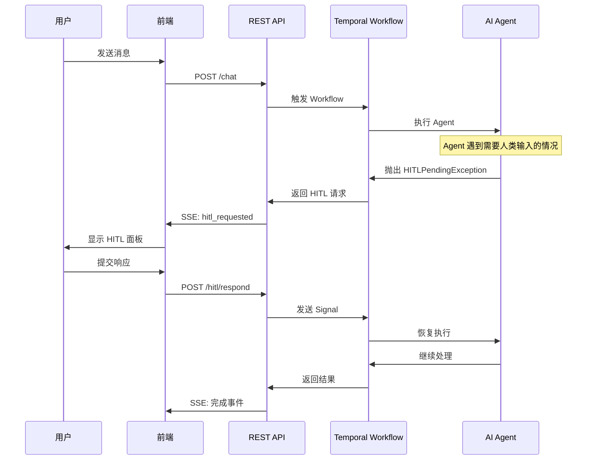

# HITL (Human-in-the-Loop) 系统

> AI Agent 与人类协作的交互框架

## 概述

HITL (Human-in-the-Loop) 系统允许 AI Agent 在执行关键操作前暂停，请求人类确认或输入。这是 MemStack 实现安全、可控 AI 代理的核心机制。

### 为什么需要 HITL？

- **安全性**: 敏感操作（如删除文件、执行命令）需要人类授权
- **准确性**: 当 Agent 不确定用户意图时，可以请求澄清
- **灵活性**: 在关键决策点让人类选择执行路径
- **合规性**: 收集 API Key 等凭证时需要用户主动提供

## 请求类型

| 类型 | 用途 | 典型场景 |
|------|------|----------|
| **Clarification** | 澄清用户意图 | "您是要删除文件还是移动文件？" |
| **Decision** | 关键决策点 | "选择部署环境：staging / production" |
| **EnvVar** | 收集环境变量 | "请提供 OPENAI_API_KEY" |
| **Permission** | 授权敏感操作 | "允许执行 rm -rf ?" |

## 核心流程



## 状态机

```
                    ┌─────────────┐
                    │   PENDING   │
                    └──────┬──────┘
                           │
           ┌───────────────┼───────────────┐
           │               │               │
           ▼               ▼               ▼
    ┌──────────┐    ┌──────────┐    ┌──────────┐
    │ ANSWERED │    │ TIMEOUT  │    │CANCELLED │
    └────┬─────┘    └──────────┘    └──────────┘
         │
         ▼
    ┌──────────┐
    │PROCESSING│
    └────┬─────┘
         │
         ▼
    ┌──────────┐
    │COMPLETED │
    └──────────┘
```

## 快速开始

### 后端：触发 HITL 请求

```python
from src.infrastructure.agent.hitl.temporal_hitl_handler import TemporalHITLHandler

# 在 Agent 工具中请求决策
handler = TemporalHITLHandler(...)

decision = await handler.request_decision(
    question="选择部署环境",
    options=[
        {"id": "staging", "label": "Staging 环境", "recommended": True},
        {"id": "production", "label": "Production 环境", "risk_level": "high"},
    ],
    decision_type="branch",
    timeout_seconds=300,
)

print(f"用户选择: {decision}")
```

### 前端：响应 HITL 请求

```typescript
import { useHITLStore } from '@/stores/hitlStore.unified';

const { submitResponse } = useHITLStore();

// 用户选择后提交响应
await submitResponse(requestId, {
  decision: 'staging',
});
```

## 文档目录

| 文档 | 说明 |
|------|------|
| [架构设计](./architecture.md) | 系统架构、组件职责、数据流 |
| [请求类型](./request-types.md) | 4 种请求类型的详细参数说明 |
| [Temporal 集成](./temporal-integration.md) | 工作流信号机制、状态恢复 |
| [前端指南](./frontend-guide.md) | 组件使用、状态管理、事件订阅 |
| [API 参考](./api-reference.md) | REST API 端点、请求/响应格式 |
| [故障排除](./troubleshooting.md) | 常见问题、调试技巧 |

## 核心组件

### 后端

| 组件 | 文件 | 职责 |
|------|------|------|
| HITLType | `hitl_types.py` | 类型定义 (Single Source of Truth) |
| HITLRequest | `hitl_request.py` | 请求实体 |
| TemporalHITLHandler | `temporal_hitl_handler.py` | 统一处理 4 种 HITL 请求 |
| HITLStateStore | `state_store.py` | Redis 状态存储 |
| ProjectAgentWorkflow | `project_agent_workflow.py` | Temporal 工作流 |

### 前端

| 组件 | 文件 | 职责 |
|------|------|------|
| UnifiedHITLPanel | `UnifiedHITLPanel.tsx` | 统一 HITL 弹窗 |
| InlineHITLCard | `InlineHITLCard.tsx` | Timeline 内嵌卡片 |
| hitlStore | `hitlStore.unified.ts` | Zustand 状态管理 |
| hitlService | `hitlService.unified.ts` | API 调用服务 |

## 设计原则

1. **统一入口**: 所有 HITL 请求通过 `TemporalHITLHandler` 处理
2. **类型安全**: 使用 TypeScript/Python dataclass 确保类型一致
3. **状态持久化**: 请求存储在数据库，支持页面刷新后恢复
4. **超时处理**: 支持配置超时时间，超时后可使用默认值
5. **多租户隔离**: 所有请求按 tenant_id/project_id 隔离

## 相关资源

- [Agent 事件类型](../agent-event-types.md)
- [事件系统架构](../architecture/event-system-timeline.md)
- [ReAct Agent 设计](../react-agent/plan.md)
