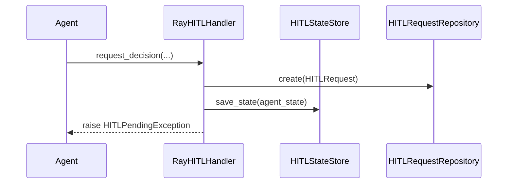
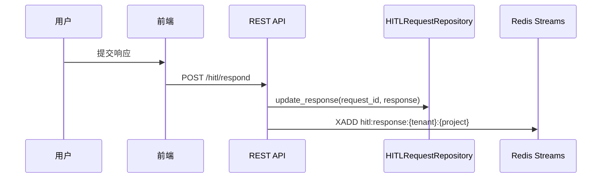

# HITL 系统架构

## 系统架构图

```
Presentation Layer
  - UnifiedHITLPanel / InlineHITLCard
  - hitlStore.unified.ts (Zustand)
  - hitlService.unified.ts (HTTP)

Infrastructure Layer
  - REST API (hitl.py)
  - RayHITLHandler
  - HITLStreamRouterActor
  - ProjectAgentActor
  - HITLStateStore (Redis)
  - SqlHITLRequestRepository (Postgres)
  - AgentSessionSnapshots (Postgres)

Domain Layer
  - HITLType, HITLStatus, HITLRequest
```

## 组件职责

### Domain Layer

| 组件 | 文件 | 职责 |
|------|------|------|
| HITLType | `hitl_types.py` | 类型枚举与数据结构 |
| HITLStatus | `hitl_types.py` | 请求状态生命周期 |
| HITLRequest | `hitl_request.py` | HITL 请求实体 |
| HITLRequestRepository | `hitl_request_repository.py` | 仓储接口 |

### Infrastructure Layer

| 组件 | 文件 | 职责 |
|------|------|------|
| RayHITLHandler | `ray_hitl_handler.py` | 创建请求并抛出 HITLPendingException |
| HITLStateStore | `state_store.py` | Redis 状态存储与恢复 |
| HITLStreamRouterActor | `hitl_router_actor.py` | 消费响应并恢复 Actor |
| ProjectAgentActor | `project_agent_actor.py` | Agent 执行 |
| SqlHITLRequestRepository | `sql_hitl_request_repository.py` | Postgres 持久化 |

## 数据流

### 1) Agent 请求 HITL



### 2) 用户提交响应



### 3) Actor 恢复执行

```mermaid
sequenceDiagram
    participant Router as HITLStreamRouterActor
    participant Actor as ProjectAgentActor
    participant Store as HITLStateStore
    participant DB as Snapshots

    Router->>Actor: continue_chat(request_id, response)
    Actor->>Store: load_state
    Store-->>Actor: HITL state
    Actor->>DB: Redis 缺失时读取快照
    Actor->>Actor: 恢复执行
```

## 状态存储

- Redis key: `hitl:agent_state:request:{request_id}`
- Postgres 表: `agent_session_snapshots`

## 多租户隔离

- DB 记录包含 tenant_id / project_id
- Redis stream 按 tenant / project 分区
- Actor ID 包含 tenant_id / project_id / agent_mode
