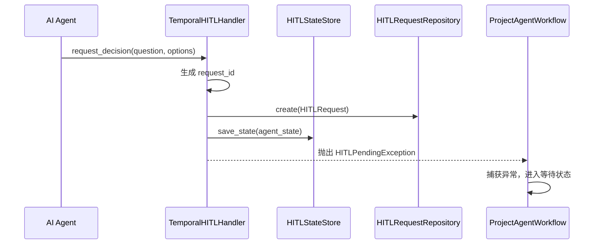
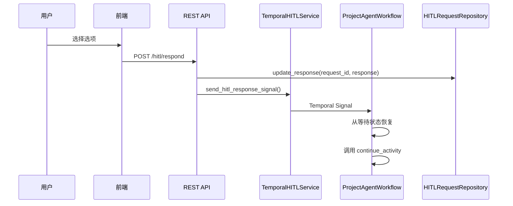
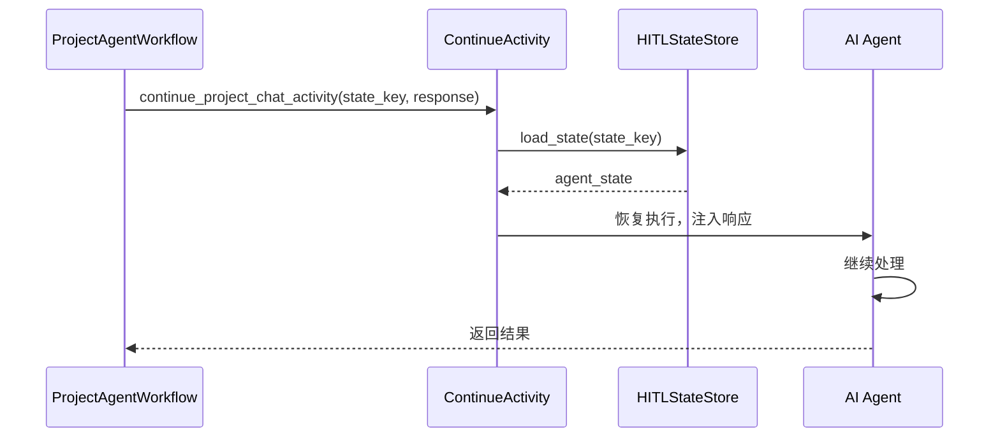

# HITL 系统架构

## 系统架构图

```
┌─────────────────────────────────────────────────────────────────────────────┐
│                              Presentation Layer                              │
├─────────────────────────────────────────────────────────────────────────────┤
│  ┌─────────────────────┐    ┌─────────────────────┐    ┌─────────────────┐  │
│  │   UnifiedHITLPanel  │    │   InlineHITLCard    │    │  TimelineEvent  │  │
│  │    (Modal View)     │    │  (Inline View)      │    │   Renderer      │  │
│  └──────────┬──────────┘    └──────────┬──────────┘    └────────┬────────┘  │
│             │                          │                        │           │
│             └──────────────┬───────────┴────────────────────────┘           │
│                            ▼                                                │
│  ┌─────────────────────────────────────────────────────────────────────┐    │
│  │                     hitlStore.unified.ts (Zustand)                  │    │
│  │  - pendingRequests, activeRequest, submitResponse()                 │    │
│  └──────────────────────────────────┬──────────────────────────────────┘    │
│                                     │                                       │
│  ┌──────────────────────────────────▼──────────────────────────────────┐    │
│  │                    hitlService.unified.ts                           │    │
│  │  - getPending(), respond(), cancel()                                │    │
│  └──────────────────────────────────┬──────────────────────────────────┘    │
└─────────────────────────────────────┼───────────────────────────────────────┘
                                      │ HTTP/SSE
┌─────────────────────────────────────┼───────────────────────────────────────┐
│                              Infrastructure Layer                            │
├─────────────────────────────────────┼───────────────────────────────────────┤
│  ┌──────────────────────────────────▼──────────────────────────────────┐    │
│  │                     REST API (hitl.py)                              │    │
│  │  GET  /hitl/conversations/{id}/pending                              │    │
│  │  POST /hitl/respond                                                 │    │
│  │  POST /hitl/cancel                                                  │    │
│  └──────────────────────────────────┬──────────────────────────────────┘    │
│                                     │                                       │
│  ┌──────────────────────────────────▼──────────────────────────────────┐    │
│  │                  TemporalHITLService                                │    │
│  │  - send_hitl_response_signal()                                      │    │
│  └──────────────────────────────────┬──────────────────────────────────┘    │
│                                     │ Temporal Signal                       │
│  ┌──────────────────────────────────▼──────────────────────────────────┐    │
│  │                  ProjectAgentWorkflow                               │    │
│  │  - _wait_for_hitl_response()                                        │    │
│  │  - handle_hitl_response (signal handler)                            │    │
│  └──────────────────────────────────┬──────────────────────────────────┘    │
│                                     │                                       │
│  ┌──────────────────────────────────▼──────────────────────────────────┐    │
│  │                  TemporalHITLHandler                                │    │
│  │  - request_clarification()                                          │    │
│  │  - request_decision()                                               │    │
│  │  - request_env_var()                                                │    │
│  │  - request_permission()                                             │    │
│  └──────────────────────────────────┬──────────────────────────────────┘    │
│                                     │                                       │
│  ┌──────────────────────────────────▼──────────────────────────────────┐    │
│  │                  HITLStateStore (Redis)                             │    │
│  │  - save_state(), load_state(), delete_state()                       │    │
│  └─────────────────────────────────────────────────────────────────────┘    │
│                                                                             │
│  ┌─────────────────────────────────────────────────────────────────────┐    │
│  │                  SqlHITLRequestRepository (PostgreSQL)              │    │
│  │  - create(), get_by_id(), update_response()                         │    │
│  └─────────────────────────────────────────────────────────────────────┘    │
└─────────────────────────────────────────────────────────────────────────────┘
                                      │
┌─────────────────────────────────────┼───────────────────────────────────────┐
│                                Domain Layer                                  │
├─────────────────────────────────────┼───────────────────────────────────────┤
│  ┌──────────────────────────────────▼──────────────────────────────────┐    │
│  │                     hitl_types.py                                   │    │
│  │  - HITLType (clarification, decision, env_var, permission)          │    │
│  │  - HITLStatus (pending, answered, completed, timeout, cancelled)    │    │
│  │  - ClarificationRequestData, DecisionRequestData                    │    │
│  │  - EnvVarRequestData, PermissionRequestData                         │    │
│  └─────────────────────────────────────────────────────────────────────┘    │
│                                                                             │
│  ┌─────────────────────────────────────────────────────────────────────┐    │
│  │                     hitl_request.py                                 │    │
│  │  - HITLRequest (Entity)                                             │    │
│  │  - HITLRequestStatus, HITLRequestType                               │    │
│  └─────────────────────────────────────────────────────────────────────┘    │
└─────────────────────────────────────────────────────────────────────────────┘
```

## 组件职责

### Domain Layer

| 组件 | 文件 | 职责 |
|------|------|------|
| **HITLType** | `hitl_types.py` | 定义 4 种 HITL 类型的枚举和数据结构 |
| **HITLStatus** | `hitl_types.py` | 定义请求状态生命周期 |
| **HITLRequest** | `hitl_request.py` | HITL 请求实体，包含持久化字段 |
| **HITLRequestRepository** | `hitl_request_repository.py` | 仓储接口定义 |

### Infrastructure Layer

| 组件 | 文件 | 职责 |
|------|------|------|
| **TemporalHITLHandler** | `temporal_hitl_handler.py` | 统一处理 4 种 HITL 请求，使用策略模式 |
| **HITLStateStore** | `state_store.py` | Redis 状态存储，支持 Agent 状态保存/恢复 |
| **ProjectAgentWorkflow** | `project_agent_workflow.py` | Temporal 工作流，处理 HITL 信号 |
| **SqlHITLRequestRepository** | `sql_hitl_request_repository.py` | PostgreSQL 实现 |
| **REST API** | `hitl.py` | HTTP 端点，接收前端响应 |

### Presentation Layer

| 组件 | 文件 | 职责 |
|------|------|------|
| **UnifiedHITLPanel** | `UnifiedHITLPanel.tsx` | 统一 Modal 弹窗，支持 4 种类型 |
| **InlineHITLCard** | `InlineHITLCard.tsx` | Timeline 内嵌卡片 |
| **hitlStore** | `hitlStore.unified.ts` | Zustand 状态管理 |
| **hitlService** | `hitlService.unified.ts` | API 调用封装 |

## 数据流

### 1. Agent 请求 HITL



### 2. 用户提交响应



### 3. Agent 恢复执行



## 状态管理

### HITL 请求状态

```python
class HITLRequestStatus(str, Enum):
    PENDING = "pending"      # 等待用户响应
    ANSWERED = "answered"    # 用户已响应，等待处理
    PROCESSING = "processing"  # Agent 正在处理
    COMPLETED = "completed"  # 处理完成
    TIMEOUT = "timeout"      # 请求超时
    CANCELLED = "cancelled"  # 请求取消
```

### 状态转换规则

| 当前状态 | 触发事件 | 目标状态 |
|---------|---------|---------|
| PENDING | 用户提交响应 | ANSWERED |
| PENDING | 超时 | TIMEOUT |
| PENDING | 用户取消 | CANCELLED |
| ANSWERED | Agent 开始处理 | PROCESSING |
| PROCESSING | Agent 处理完成 | COMPLETED |

### Redis 状态存储

```python
# 存储格式
key: "hitl:agent_state:{conversation_id}:{message_id}"
value: {
    "request_id": "deci_12345678",
    "conversation_id": "conv-uuid",
    "message_id": "msg-uuid",
    "agent_state": {...},  # 序列化的 Agent 状态
    "created_at": "2026-02-04T08:00:00Z"
}
ttl: 360 秒 (与 HITL 超时对齐)
```

## 多租户隔离

所有 HITL 请求都包含租户上下文：

```python
@dataclass
class HITLRequest:
    request_id: str
    conversation_id: str
    tenant_id: str      # 租户隔离
    project_id: str     # 项目隔离
    user_id: str        # 用户标识
    ...
```

### 隔离策略

1. **数据库查询**: 所有查询都带 `tenant_id` 和 `project_id` 条件
2. **Redis Key**: 使用 `{tenant_id}:{project_id}:{conversation_id}` 作为前缀
3. **Temporal Workflow**: Workflow ID 包含租户和项目信息

## 错误处理

### 超时处理

```python
# 默认超时: 300 秒
timeout_seconds: float = 300.0

# 超时后的处理
if request.is_expired:
    if request.default_value:
        return request.default_value
    else:
        raise HITLTimeoutException(request_id)
```

### Worker 重启恢复

```python
# RecoveryService 在 Worker 启动时扫描
async def recover_pending_requests():
    pending = await repo.get_unprocessed_answered_requests()
    for request in pending:
        await resume_agent_execution(request)
```

## 性能考虑

1. **状态压缩**: Agent 状态使用 msgpack 序列化
2. **TTL 管理**: Redis 状态自动过期，避免内存泄漏
3. **索引优化**: 数据库索引覆盖常用查询
   - `(conversation_id, status)`
   - `(tenant_id, project_id, status)`
   - `(expires_at)`

## 安全考虑

1. **输入验证**: 所有用户输入经过 Pydantic 验证
2. **权限检查**: API 端点验证用户对 conversation 的访问权限
3. **敏感数据**: EnvVar 类型的值存储时加密
4. **审计日志**: 所有 HITL 交互记录到审计日志
