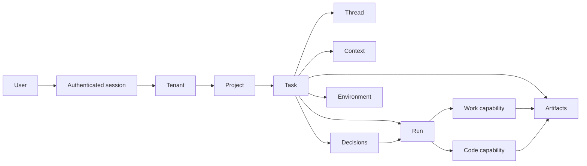
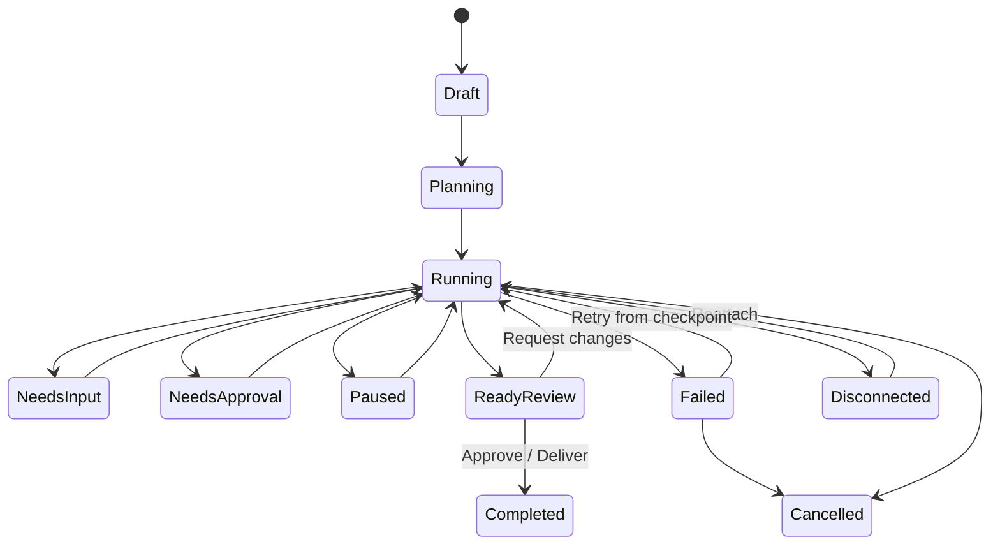

# MemStack 桌面 Agent 客户端产品 PRD

版本：v1.1 Draft
日期：2026-07-10
状态：产品结构与视觉方向已锁定（My Work Mission Control）
目标平台：macOS、Windows；Linux 进入 P1 评估

## 1. 产品摘要

MemStack Desktop 是面向企业知识工作与软件工程的 Agent 指挥中心。用户在同一项目内创建任务，选择或切换 Work / Code 能力模式，监督 Agent 的计划、执行、验证和交付，并在上下文中完成授权、审批、接管和恢复。Workspace 管理员还能在同一治理工作台中配置 Models、Skills、Plugins 和 Agents，明确它们的版本、作用域、依赖、权限和使用关系。

产品的最小可用承诺不是“能聊天”，而是：

1. 用户始终知道 Agent 正在做什么、在哪里做、是否仍在运行。
2. 通用工作和编程工作共享上下文、记忆、权限、状态和产物。
3. 任何需要人类判断的动作都在相关证据旁边完成。
4. 最终成果以可检查、可版本化、可继续编辑的 Artifact 交付。
5. 应用重启、网络中断或窗口切换后，任务状态可恢复且不会重复执行。

## 2. 背景与问题

当前 Agent 产品常把复杂工作压进聊天滚动流。用户必须在消息、日志、终端、Diff、浏览器、文件和 PR 之间反复切换，难以回答：

- 哪些工作正在运行？
- 哪些任务正在等我？
- Agent 使用了哪些来源和权限？
- 变更发生在本地、Worktree 还是云端？
- 我批准的具体是什么，影响范围多大？
- 应用重启后是否仍是同一个执行？

MemStack 现有桌面应用已经拥有多数底层表面，但入口和对象层级较多，通用用户与开发者缺少统一的产品模型。

## 3. 目标与非目标

### 3.1 产品目标

- 建立一套支持 Work / Code 的统一桌面信息架构。
- 将任务状态、环境、产物、审批和恢复做成一等能力。
- 支持用户并行监督多个长任务，而不丢失上下文。
- 在不替代完整 IDE 的前提下完成核心开发闭环。
- 用企业记忆和结构化决策链形成可审计差异化。
- 将模型、技能、插件与智能体从分散设置提升为可搜索、可版本化、可审计的 Workspace 资源。

### 3.2 非目标

- 不实现完整源代码编辑器、Git GUI 或通用浏览器替代品。
- 不在 MVP 中覆盖所有第三方 SaaS；先建立连接器和权限框架。
- 不展示或持久化模型隐藏推理；只展示可审计计划、动作、证据和结果。
- 不以“更多面板/更多指标”为成功标准。
- 不允许 Work / Code 各自形成独立的项目、通知或历史系统。

## 4. 目标用户

### Persona A：知识工作者 / 产品负责人

- 需要研究、分析、文档、表格、网页和内部系统协作。
- 不理解 Worktree、Commit 等概念，也不应被迫理解。
- 关心来源、交付物、隐私边界、审批和可分享结果。

### Persona B：软件工程师

- 需要仓库上下文、计划、终端、Diff、测试、分支和 PR。
- 关心 Agent 在哪个环境、哪些命令被执行、验证是否可信。
- 需要在并行任务之间快速切换并安全合并结果。

### Persona C：技术负责人 / Reviewer

- 同时监督多个 Agent 和项目。
- 关心 Needs approval、Ready to review、风险、测试、CI 和变更范围。
- 需要快速决定：批准、要求修改、暂停、转交或合并。

### Persona D：企业管理员

- 配置模型、连接器、权限、网络、数据保留、审计与预算。
- 关心本地/云端数据边界和外部写操作。

## 5. 核心 Jobs To Be Done

1. 当我有一个模糊问题时，我可以先快速讨论，不创建正式执行环境。
2. 当任务需要持续工作时，我可以把它放进项目并选择 Work / Code。
3. 当 Agent 在后台运行时，我可以确认状态、进度、来源、成本和下一决策。
4. 当 Agent 需要授权时，我可以看到动作、目标、数据、风险和可逆性后再批准。
5. 当通用任务产生代码需求时，我可以切换到 Code 而不复制上下文。
6. 当代码任务需要研究、文档或业务系统时，我可以使用 Work 能力而不离开任务。
7. 当工作完成时，我可以审阅 Artifact、Diff 或 PR，并要求修改或交付。
8. 当客户端中断时，我可以恢复同一个执行而不是重复运行。

## 6. 产品对象模型

定义：

- Authenticated session：用户身份、登录方式、受信任设备偏好和最后使用的上下文；不包含明文凭据。
- Tenant：企业、团队或个人沙盒的安全与治理边界，拥有成员、策略、资源和多个 Project。
- Project：Tenant 内的长期上下文容器，包含指令、成员、来源、记忆、仓库和策略。
- Task：用户要完成的结果，是导航、状态和通知的核心对象。
- Thread：围绕任务的对话与协作历史，不等同于执行状态。
- Run：一次可恢复的 Agent 执行，拥有唯一 ID、revision、状态、预算和心跳。
- Context：文件、连接器、网页、Issue、记忆、仓库和用户提供的信息。
- Artifact：文档、表格、图像、网页、文件、Diff、终端会话、PR 等可检查输出。
- Decision：批准、拒绝、要求修改、选择方案、授予权限等结构化人类判断。
- Environment：Work 的数据作用域或 Code 的 Local / Worktree / Cloud 执行位置。
- Provider：LLM 连接与信任边界，包含 Auth method、Credential reference、Base URL、API mode、健康状态和可发现模型。
- Model：Provider 下可启用的推理资源，以 `provider/model-id` 唯一标识，包含上下文、能力、价格和可用状态；不直接持有 Provider Credential。
- Routing policy：工作区级模型分工，包含 Default、Fast、Coding、Vision、Embedding 与有序 Fallback chain。
- Skill：可复用的 Agent 能力契约，包含 Instructions、输入输出、允许工具、验证与版本。
- Plugin：连接外部系统的能力包，包含权限、工具、安装版本、连接状态和审计事件。
- Agent：可执行任务的角色配置，由 Model、Skills、Plugins、Memory scope、Autonomy 和 Permission policy 组装。

## 7. 信息架构

### 7.1 全局导航

- Home：今日摘要、最近项目、恢复任务、建议动作。
- My Work：跨项目语义队列。
- Settings：独立弹出式窗口，承载账户、Tenant → Project 上下文切换、个人偏好、外观、通知、组织治理，以及 Models、Skills、Plugins、Agents 的统一资源目录；打开设置不替换当前任务工作区。
- Automations：定时、事件触发和手动工作流。
- Search：跨 Project / Task / Thread / Memory / Artifact 搜索。
- Projects：项目树和项目内任务。
- Notifications：只承载需要注意的状态变化，不复制 My Work。

### 7.2 My Work 分组

默认只显示：

1. Needs your input
2. Needs approval
3. Running
4. Ready to review
5. Scheduled / Recent（折叠）

禁止仅用“最近活动时间”作为默认排序。每个条目至少显示 Task、Project、Mode、真实状态、最后更新和需要的动作。

### 7.3 任务工作区

- Header：Task、Project、Mode、Environment、Branch/Scope、Run state、Elapsed、Usage、Pause/Stop。
- Timeline：用户意图、计划、关键动作、验证、决策；工具细节默认折叠。
- Canvas：当前工作表面，根据 Mode 和 Artifact 自适应。
- Decision rail：当前唯一需要用户处理的决策；无决策时折叠。
- Command deck：Steer、补充上下文、切换 Mode、模型、自主程度。

### 7.4 Settings 内的统一资源工作台

Settings 使用“设置分区 → 资源目录 → 详情/配置”的稳定三栏结构。Models、Skills、Plugins、Agents 作为 AI resources 分区内的四个入口，共享搜索、状态、作用域、Owner、版本和审计语言；全局任务导航不再出现独立 Manage 入口。

- Resource rail：Models、Skills、Plugins、Agents 及数量、说明、当前类型。
- Catalog：Skills、Plugins、Agents 显示资源；Models 入口显示 Provider Catalog。目录支持搜索、Connected/Attention 筛选、状态、简述和选中态。
- Detail：身份摘要、作用域、Owner/Provider、状态、专用 Tab 与主动作。
- Relationship graph：展示“哪些 Agent 使用此 Model/Skill/Plugin”以及 Agent 的模型、技能、插件依赖。
- Governance：所有编辑生成版本和审计记录；安装 Plugin 不自动扩张任何 Agent 权限。
- Creation：新建 Skill/Agent 先生成 governed draft，完成依赖、权限和验证后才能 Publish/Enable。
- Provider setup：Add Provider 使用 Choose → Authenticate & Verify → Enable Models 三步向导；认证方式由后端 capability descriptor 驱动，不可用方式保留可见但禁用并说明原因；连接成功不自动改变 Routing 或 Agent 配置。

### 7.5 Project 内的 Workspace → Conversation 树

- Settings 负责 Tenant → Project 上下文；Global rail 在当前 Project 内展示 Workspace → Conversation 树，禁止把 Project 列表继续伪装成 Workspace。
- Workspace 根节点显示名称、会话数与在线/需关注状态；展开后按需要关注、运行中、最近、已归档组织 Conversation。
- Conversation 行显示标题、摘要/最近状态、Work/Code 或协作模式、消息/参与者与运行状态；SubAgent Conversation 可作为第三级子节点。
- 点击 Workspace 打开工作空间概况；点击 Conversation 打开同一 Conversation 的内容详情，不复制线程或执行。
- 会话详情使用“Session Header + Narrative Thread + Work Canvas”。Thread 承载意图、解释、关键事件、分组工具活动、HITL 与 Steering；Canvas 承载 Plan、Changes/Artifact、Terminal/Sources 与 Checks/Verification。
- Task、Run、权限、模型、耗时和用量进入 Header 或 Canvas Overview，不使用常驻静态第三栏。用户可显式进入 Task Canvas，但不得丢失 Conversation 状态。
- Diff 行、文件、来源、产物章节和验证证据均支持一次点击加入 Steering 上下文；引用必须以结构化对象传递，不能依赖解析自然语言。
- 工作空间概况覆盖 Root goal、Plan、Tasks、HITL、Agents、Members、Execution health、Delivery、Project knowledge 与 Recent activity。

### 7.6 Artifact 权威生命周期

- Run 完成与 Artifact 交付是两个独立状态：批准 Run 只确认本次执行可以结束，不得隐式把任何 Artifact 标记为 Delivered。
- Artifact 使用稳定 `artifact_id`；每次导出创建新的不可变 `artifact_version_id` 和递增 `version`。新版本不得覆盖旧文件；旧的 Draft / Ready / Approved 版本进入 Superseded，历史、审查反馈与回执仍可查询。
- Artifact Version 使用独立 `revision` 保护并发审查。Approve、Request changes、Deliver 都必须提交当前 Revision；冲突返回最新状态，客户端不得乐观伪造成功。
- 生命周期为 Draft → Ready → Approved → Delivered，或 Draft / Ready / Approved → Superseded。只有 Approved 版本可以 Deliver；只有显式导出并进入权威版本表的内容可以被批准。
- Ready 版本必须显示 Filename、Version、Status、Revision、Location、MIME、Bytes、Sources 与 Checks。Sources / Checks 缺失时显示“未提供”，不得从文件名、扩展名或聊天文本推断质量结论。
- Request changes 必须绑定 Artifact Version、反馈和关联 Run Revision；当关联 Run 仍为 Ready review 时，反馈恢复同一个 Run 并把当前版本标记为 Superseded，Agent 再导出新版本。
- Delivery 前必须验证物理文件仍存在。成功后生成包含 Artifact Version、Destination、Path、Bytes、Actor、Delivered at 与 Idempotency key 的回执；失败不得写入 Delivered 状态。
- 启发式文件/事件聚合只可作为 Activity 中的“未版本化证据”，不可出现在 Artifact 审批主流程中。

## 8. 双模式定义

### 8.1 Work（通用 Agent）

默认 Canvas：Sources、Browser、Document、Data、Artifact。

核心能力：

- 深度研究与可追溯来源。
- 文档、表格、演示、图像和结构化报告。
- 浏览器与桌面应用协作。
- 企业连接器读写（受权限控制）。
- 项目记忆、组织知识与历史决策检索。
- 自动化与长期任务。

### 8.2 Code（编程 Agent）

默认 Canvas：Plan、Browser、Changes、Terminal、Artifact。

核心能力：

- 仓库理解、Issue/PR 上下文。
- Local / Worktree / Cloud 环境。
- 文件变更、Diff、行级反馈。
- 集成终端、测试与本地预览。
- Stage、Revert、Commit、Push、Create PR、Handoff。
- 多 Agent 并行与隔离。

### 8.3 切换原则

- Mode 是任务能力集，不是新的产品或新的历史列表。
- 切换前展示将新增的工具与权限，不重建 Task。
- Code → Work 保留 Environment 和仓库上下文；Work → Code 必须选择仓库与执行环境。
- 切换不会自动授予更高权限。

## 9. 核心用户流程

### 9.1 Quick chat → 正式任务

1. 用户从 Home 创建 Quick chat。
2. 系统仅进行讨论和只读上下文检索。
3. 当出现持续执行需求，系统建议“Create task”。
4. 用户选择 Project、Work / Code、Scope/Environment、Autonomy。
5. 新 Task 继承必要的聊天摘要和显式选择的上下文。

### 9.2 通用工作任务

1. 用户在 Project 内创建 Work Task，填写 Goal 并选择 Sources、文件或连接器。
2. 系统进入 **Plan-only** 状态；Agent 可以理解目标和读取获准上下文，但不能运行工具或产生外部副作用。
3. Agent 通过结构化 Plan tool-call 生成步骤、每步产物、预计耗时、上下文范围与审批边界。
4. 用户在 Plan Review 中编辑、禁用、增补步骤，或要求 Agent 重新规划。
5. 用户点击 Approve & start 后，系统记录计划版本与授权快照并创建 Run；未批准不得进入 Running。
6. Timeline 显示阶段进度，Canvas 显示真实工作产物；外部写操作仍触发上下文审批。
7. 完成后进入 Ready to review，主 CTA 为 Review artifact；用户可批准、要求修改、导出或分享。

### 9.3 编程任务

1. 用户填写代码目标，选择仓库和 Local / Worktree / Cloud。
2. Agent 在只读阶段生成可编辑 Plan，包含影响分析、回归测试、实现、验证与 Review packet。
3. Plan Review 固定展示预计耗时、Usage、Environment、上下文与“Ask before external side effects”等边界。
4. 用户批准后才创建 Worktree/Checkout；批准事务把 `environment_id`、Kind、工作目录、Repository root、Branch 与创建时间写入 Run 的授权快照。Plan-only 阶段不得提前创建隔离目录。
5. Header 固定显示 Environment、Checkout/Worktree、Branch。Agent 工具、Terminal、测试与 Preview 必须以该 Run 的权威工作目录为根，不能回退到全局仓库目录后继续执行。
6. Agent 按批准计划编辑、运行测试、启动 Preview；Changes 与 Browser/Terminal 在同一 Canvas 中切换或分屏。Terminal 启动回执显示 Run ID、Environment 与实际 CWD。
7. 高风险变更在 Diff 旁触发审批；用户 Stage / Commit / Push / Create PR，或 Handoff 到 Local。
8. CI/Review 结果回流同一 Task，完成后归档。

### 9.4 任务恢复

1. 应用启动后从服务端/本地权威存储读取 Run revision。
2. UI 显示 Reconnecting，而不是假定 Failed。
3. 若原 Environment 仍可验证，提供 Reattach：继续同一 Run ID、Revision 链与工作目录，不重新创建 Worktree，也不重复执行已完成步骤。
4. 若原 Environment 丢失或用户需要隔离恢复，提供 Fork recovery：保留来源 Run 为 Disconnected/Interrupted，创建新 Run 与新 Worktree，并在授权快照中记录 `source_run_id`。
5. Fork recovery 以来源仓库最后可验证的 Git `HEAD` 为起点；它不承诺复制未提交或未跟踪文件。需要保留原工作目录状态时，用户应选择 Reattach。
6. Reattach 与 Fork 使用不同主动作、确认文案与审计事件；Retry 不得冒充任何一种恢复语义。
7. 任何重复发送都进行 idempotency 检查；同一来源 Run + Revision + Idempotency key 只产生一个恢复 Run。

### 9.5 Workspace 资源管理

1. 用户进入 Settings，在 AI resources 分区按 Models / Skills / Plugins / Agents 切换资源类型，并在目录中搜索或筛选状态。
2. Models 先显示 Provider Catalog。用户选择 Provider 后查看连接健康、认证类型、Endpoint、已启用模型和工作区路由。
3. Add Provider 依次完成 Provider 选择、Auth / Endpoint 验证、模型发现与启用；若 `/models` 不可用，允许手动添加精确 Model ID。
   OAuth 只有在后端声明完整 start/callback 能力时才可用；Environment secret 只提交并持久化后端实际检测或允许的变量名，标准变量只能解析并发送到对应供应商的官方 HTTPS Origin，变量值不得进入响应、日志或普通配置 JSON；自定义 Endpoint 使用显式加密凭据。Provider 不支持网络探测时，后端只返回 `configuration_valid + probed=false`，不得伪装连接成功。客户端不得提供自由 Provider JSON、自由 Headers 或明文辅助凭据输入；只有后端公开安全 schema 中的结构化字段可以回显和提交，未知字段默认丢弃。
4. Routing 独立配置 Default / Fast / Coding / Vision 和有序 Fallback；Provider 连接成功不得自动修改 Routing 或 Agent 配置。
5. 编辑 Provider、Skill 或 Agent 时进入显式 Edit 状态；Save 提交当前 revision，冲突返回 409 并要求重载。Provider Endpoint 采用三态更新：省略保留、显式 `null` 清除、合法字符串替换；清除必须落库为 SQL `NULL`。默认 Provider 的创建、切换与旧默认清理在同一事务内完成。
6. 安装 Plugin 前预览权限；连接成功后仍需在 Agent 的 Capability 配置中显式授予，禁止自动继承。
7. 新建 Skill/Agent 先创建 Draft；通过验证并完成权限检查后才能 Publish/Enable。
8. 暂停 Agent 只阻止新 Run；运行中任务继续遵循各自的 Run policy，并在 UI 中明确提示。

### 9.6 登录与 Tenant → Project 上下文切换

1. 未认证用户先进入独立登录页，可选择 Workspace SSO 或邮箱登录；表单错误在提交区域就地说明。
2. 成功登录后恢复最后一次 Tenant / Project 上下文；受信任设备只保存会话引用和上下文 ID，不保存明文凭据。
3. 用户从个人菜单或 Global rail 打开独立 Settings 窗口；底层任务工作区保持可见并被遮罩，关闭后回到原位置。
4. 在 Settings → Workspace 先选择 Tenant，再从该 Tenant 的项目中选择 Project；切换前不立即改变全局上下文。
5. 点击 Switch workspace 后原子更新 Tenant 与 Project，关闭 Settings，并进入所选 Project；所有后续任务、记忆、资源和权限请求都绑定新上下文。
6. 用户可从个人菜单退出登录；退出清除本地会话引用并返回登录页，不删除服务端任务或配置。

## 10. 状态模型

状态要求：

- 状态必须来自权威 Run，不可仅由本地动画推断。
- 每次更新包含 revision、timestamp、source、execution_id。
- Thinking 只能作为 Running 的子阶段，不得作为顶层状态。
- Stop 与 Pause 分离；Stop 需要说明是否可恢复。
- Disconnected 表示 UI 与执行失联，不等同于 Failed。

## 11. 权限与审批

### 11.1 审批卡必备字段

- Action：即将执行的动作。
- Target：目标系统、文件、分支、账号或人员。
- Data：将读取、发送或修改的数据。
- Reason：为什么当前任务需要此动作。
- Risk：Low / Medium / High，包含结构化理由。
- Reversibility：可逆、部分可逆、不可逆。
- Scope：仅本次、此 Task、此 Project、组织策略。
- Evidence：Diff、Preview、来源或验证结果。

### 11.2 典型需要审批的动作

- 向外部系统发送消息、评论、表单或文件。
- 修改云端数据、权限、账号和自动化。
- 推送代码、创建/合并 PR、删除或重写历史。
- 提升终端/网络/文件系统权限。
- 跨 Project 使用敏感记忆或客户数据。

### 11.3 设计约束

- 审批必须位于相关 Canvas 旁边。
- 主按钮使用具体动词，例如 “Approve 6 file changes”，不用 “Continue”。
- 拒绝后允许补充原因并自动转为 Request changes。
- 不用颜色作为唯一风险信号。

## 12. 功能需求

### 12.1 MVP（P0）

- FR-001：统一 Project / Task / Thread / Run / Artifact 模型。
- FR-002：Home、My Work、Projects、Search、Settings 基础导航；资源管理不占用独立一级入口。
- FR-003：Work / Code 任务创建与任务内切换。
- FR-004：权威运行状态、心跳、Revision 和恢复。
- FR-005：Work Canvas：Sources、Browser、Document/Artifact。
- FR-006：Code Canvas：Plan、Changes、Terminal、Browser/Preview、Artifact。
- FR-007：Local / Worktree / Cloud 环境选择；MVP 可先交付 Local + Worktree。
- FR-008：上下文审批与结构化 Decision 记录。
- FR-009：Artifact 版本、审阅、要求修改与导出。
- FR-010：通知只针对 Needs input、Needs approval、Ready review、Failed、Disconnected。
- FR-011：Command deck 支持附件、@ Context、/ Commands、Mode、Model、Autonomy。
- FR-012：键盘导航、命令面板和全局搜索。
- FR-013：Settings 内统一资源目录，覆盖 Models、Skills、Plugins、Agents 的搜索、状态、详情与作用域。
- FR-018：支持 English 与简体中文即时切换；语言偏好按设备持久化，导航 ID、资源 ID 与状态机不依赖翻译文本。
- FR-014：Model 路由、Fallback、预算、健康和使用关系管理。
- FR-015：Skill 指令、工具边界、验证、版本和 Agent 使用关系管理。
- FR-016：Plugin 安装/更新/禁用、权限预览、工具清单和活动审计。
- FR-017：Agent 的 Model / Skills / Plugins / Memory / Autonomy 装配、启停和评估。
- FR-019：支持 Workspace SSO 与邮箱登录、受信任设备会话恢复和显式退出。
- FR-020：Settings 以独立弹出式窗口打开，关闭后恢复原任务位置与状态。
- FR-021：Settings → Workspace 支持先 Tenant、后 Project 的两级上下文选择，并在确认后原子切换。
- FR-022：当前 Project 的 Global rail 支持 Workspace → Conversation 树、按需展开和状态分组。
- FR-023：Workspace 概况展示真实目标、执行、团队、交付、项目知识库与活动状态，并可跳转到最近 Conversation。
- FR-024：Conversation 详情支持 Narrative Thread 与 mode-aware Work Canvas 并排协作，提供工具分组、HITL、Canvas Tab、Diff/证据引用、Steering、Task handoff 和验证状态。
- FR-025：Artifact 使用稳定身份、不可变版本、独立 Revision、显式 Sources/Checks、审查状态与幂等 Delivery receipt；Run approval 不得代替 Artifact delivery。

### 12.2 P1

- FR-101：Automations，支持 Manual / Schedule / Event triggers。
- FR-102：企业连接器与最小权限工具选择。
- FR-103：PR 生命周期、CI、Review comment 修复和 Merge policy。
- FR-104：多 Agent 并行、Subagent 可视化和资源预算。
- FR-105：跨 Project Memory search 与来源追溯。
- FR-106：Remote devbox / SSH 与云环境。
- FR-107：团队共享模板、Skills、Plugins 与 Agent 配置的发布审批。
- FR-108：离线只读与跨设备恢复。

### 12.3 P2

- FR-201：自定义 Canvas 扩展。
- FR-202：跨设备 Remote control。
- FR-203：组织级 My Work 与 Reviewer 队列。
- FR-204：成本、质量、自动化和治理分析。
- FR-205：Agent / Workflow Marketplace。

## 13. 非功能需求

- NFR-001：冷启动到可操作 Shell，p95 ≤ 3 秒（不包含首次模型/连接器认证）。
- NFR-002：Task 切换后 300ms 内显示 Skeleton，p95 1 秒内显示可读历史。
- NFR-003：断线重连后 p95 3 秒内恢复权威状态或明确显示 Disconnected。
- NFR-004：Crash-free desktop sessions ≥ 99.5%。
- NFR-005：任务执行与 UI 状态更新支持幂等和单调 Revision。
- NFR-006：1440×1024 为主设计基准；1280×800 完整可用；侧栏可折叠。
- NFR-007：WCAG 2.2 AA；键盘完成所有主流程；状态不只依赖颜色。
- NFR-008：中英文 UI；日期、数字、快捷键和术语本地化。
- NFR-009：默认遵循 `.gitignore` 与企业排除规则；索引范围可见。
- NFR-010：审计日志记录 Agent、工具、输入、输出、理由、延迟、权限和结果。
- NFR-011：认证令牌、Provider 凭据和环境密钥不得以明文写入日志、客户端持久化或 Provider 公共 API 响应；Environment secret 只允许持久化受支持且绑定官方 Origin 的变量名，公共 `config` 必须使用独立的安全字段投影，未知字段默认不公开。
- NFR-012：Tenant / Project 切换在 UI 中必须是原子状态更新；失败时保持原上下文并提供可重试错误。
- NFR-013：Provider 创建、默认切换、Credential / Endpoint 绑定和 revision CAS 必须保持事务原子性；并发写入后每个 Operation type 最多一个默认 Provider，stale 请求不得产生部分副作用。

## 14. 成功指标

### 北极星指标

每周“可验证完成任务数”：任务具有明确目标、权威完成状态、至少一个可检查 Artifact/变更以及完整 Decision/验证记录。

### 体验指标

- 首次创建任务成功率。
- 从进入应用到找到“需要我处理”的任务用时。
- Needs approval 到 Decision 的中位时间。
- Ready to review 到交付/合并的中位时间。
- 任务状态误判报告率。
- 中断后 Reattach 成功率与重复执行率。
- Artifact 首次审阅通过率、平均修改轮次。
- Work → Code / Code → Work 切换后上下文保留率。
- 每个完成任务的跨应用切换次数。

### 工程指标

- Crash-free sessions、ANR、内存峰值。
- Event revision gap、重复事件、状态回滚次数。
- Worktree 创建/清理/Hand-off 成功率。
- Terminal/Browser/Preview 启动成功率。
- Diff / Artifact 渲染 p95。

## 15. 埋点事件

- task_created、task_mode_changed、run_started、run_state_changed。
- approval_requested、approval_decided、approval_expired。
- artifact_created、artifact_opened、artifact_reviewed、artifact_exported。
- environment_selected、worktree_created、handoff_started、handoff_completed。
- reconnect_started、reattach_succeeded、recovery_forked、duplicate_run_blocked。
- canvas_tab_opened、task_switched、my_work_filter_changed。
- permission_prompt_shown、permission_denied、permission_scope_saved。
- managed_resource_created、managed_resource_updated、managed_resource_published。
- model_route_changed、model_budget_alerted、skill_validation_completed。
- plugin_installed、plugin_permission_changed、plugin_disabled、agent_enabled、agent_paused。
- sign_in_started、sign_in_succeeded、sign_in_failed、sign_out_completed。
- settings_opened、settings_section_changed、workspace_switch_started、workspace_switch_completed、workspace_switch_failed。

所有主观分类（风险、任务状态原因、下一动作建议）必须记录 Agent 结构化 Tool-call 结果和 rationale，不能由文本关键词规则直接决定。

## 16. 发布阶段

### Alpha

- 现有桌面应用用户，Local + Worktree。
- Work：Research → Document Artifact。
- Code：Plan → Changes → Terminal → Review。
- 验证状态与恢复正确性优先于功能数量。

### Beta

- My Work、Automations、连接器、PR 生命周期、多 Agent。
- 企业管理员策略和审计导出。
- Windows/macOS 同步体验。

### GA

- Cloud / Remote environments、组织级治理、SLA、跨设备恢复。

## 17. 风险与缓解

- 模式混淆：用任务目标自动建议，Mode 可见但不强迫理解内部工具。
- 信息过载：默认只显示当前阶段、下一决策和最终产物；日志按需展开。
- Worktree 误操作：环境永久可见、动作预览、不可用原因解释、Handoff 有步骤。
- 状态漂移：服务端权威 Revision、断线状态独立、恢复幂等。
- 隐私和外部副作用：最小权限、数据目的地可见、审批与审计。
- 性能：索引预算、虚拟列表、任务状态增量加载、Canvas 延迟挂载。
- 当前前端单体复杂度：先拆分 Shell/Task/Canvas/Decision，再扩展新 UX。

## 18. 验收标准

1. 同一 Project 内可创建 Work 与 Code Task，并在 My Work 中统一呈现。
2. 任一任务 Header 可回答：模式、环境、分支/作用域、状态、最后更新、执行 ID。
3. Running、Needs input、Needs approval、Paused、Ready review、Failed、Disconnected 可区分。
4. 通用任务可从来源生成可审阅 Artifact，外部写操作必须审批。
5. 编程任务可在 Worktree 中修改、测试、Preview、审阅 Diff，并安全 Handoff/PR。
6. 审批卡显示动作、目标、数据、风险、可逆性、范围和证据。
7. 重启客户端后可 Reattach 活跃 Run，不重复执行。
8. 所有主流程可用键盘完成，1280×800 不遮挡关键 CTA。
9. 中英文切换后布局无截断，术语一致。
10. 埋点和审计能重建一次任务从意图到交付的完整时间线。
11. Models、Skills、Plugins、Agents 在 Settings 的 AI resources 分区中可搜索、筛选、查看详情和使用关系。
12. 用户可在 Settings → General 切换 English / 简体中文；刷新后保持选择，切换不重置当前资源或任务状态。
13. 用户可编辑并保存 Model/Skill/Agent 配置、安装或禁用 Plugin、暂停或启用 Agent，且每个动作产生可见状态反馈。
14. 1100×800 紧凑桌面窗口仍保留资源目录、详情、状态和主动作，无横向溢出。
15. 未登录时不能进入任务工作区；SSO/邮箱登录、表单错误、受信任设备恢复和退出均有可见反馈。
16. Settings 作为独立弹出窗口打开和关闭，不改变底层任务、滚动或当前选择。
17. 用户只能在所选 Tenant 的 Project 列表中选择；确认切换后 Global rail 和 Projects 页面同时显示新上下文。
18. Global rail 中 Project、Workspace、Conversation 的层级和名称不混淆；点击 Workspace 与 Conversation 分别进入概况和会话工作区。
19. Workspace 概况中的 Memory/Graph/Storage 明确标注为 Project 级共享统计；会话与执行状态来自权威后端字段。
20. 点击任一 Conversation 后主区域同时展示 Narrative Thread 与 Work Canvas；用户可展开工具活动、处理输入请求、切换工作对象、引用 Diff/证据继续 Steering，并显式进入关联 Task。
21. Code 会话至少提供 Plan、Changes、Terminal、Checks；Work 会话至少提供 Plan、Artifact、Sources、Verification，二者共享 Header、Thread、HITL 和状态模型。
22. 同一 `artifact_id` 连续导出两次时生成两个不同 `artifact_version_id` 与物理路径，旧内容仍可读取。
23. Ready Artifact 必须先 Approve 才可 Deliver；Request changes 必须填写反馈并绑定 Artifact 与 Run Revision。
24. Approve Run 后 Artifact 状态不自动变为 Delivered；Artifact 交付使用独立主动作。
25. Delivery 文件不存在时返回失败且 Artifact 继续保持 Approved；成功后写入可见且可重放的幂等回执。
26. Artifact Sources / Checks 缺失时 UI 明确显示缺失，不从扩展名、事件文本或数量阈值推断风险与质量。
27. Artifact 版本、审查反馈、交付回执和对应 Conversation/Run 可在重启后恢复并重建审计时间线。
28. Code Task 的 Worktree 只在 Plan 获批后创建；Run 持久化 Environment identity、工作目录、仓库根与 Branch，Agent 工具和 Terminal 均在该工作目录运行。
29. Reattach 继续同一 Run ID 与 Environment；Fork recovery 创建新 Run 与新 Worktree、保留来源 Run，并通过 `source_run_id` 可审计追溯。
30. Fork recovery 明确说明其从最后 Git `HEAD` 创建，不误导用户认为未提交或未跟踪内容已被复制。

## 19. 与现有仓库的实现映射

可复用表面：

- `features/chat/ChatPanel.tsx` → Timeline / Command deck。
- `features/workspace/WorkspaceDock.tsx` → Adaptive Canvas 容器。
- `features/board/BoardPanel.tsx` → My Work / Runs 任务视图的部分能力。
- `features/sandbox/SandboxPanel.tsx` → Terminal / Preview 环境能力。
- `features/runtime/RuntimeConfigPanel.tsx` → Environment 与连接设置。
- 已有 task、artifact、plan、event 类型 → Run Timeline 与 Artifact 生命周期。

实施前置：

- 将 `App.tsx` 中 Shell、Navigation、Task selection、Run state、Workspace Canvas、Approval state 拆成独立模块。
- 建立单一 `TaskViewModel` 和权威 `RunState` 适配层，避免每个面板分别推断状态。
- 明确 Workspace / Conversation / Task / Run 的迁移和兼容策略。
