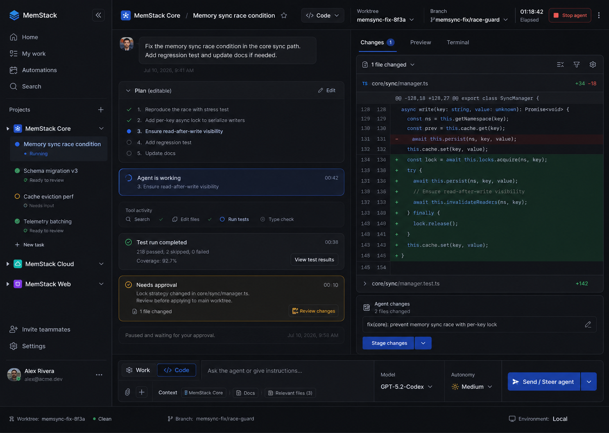
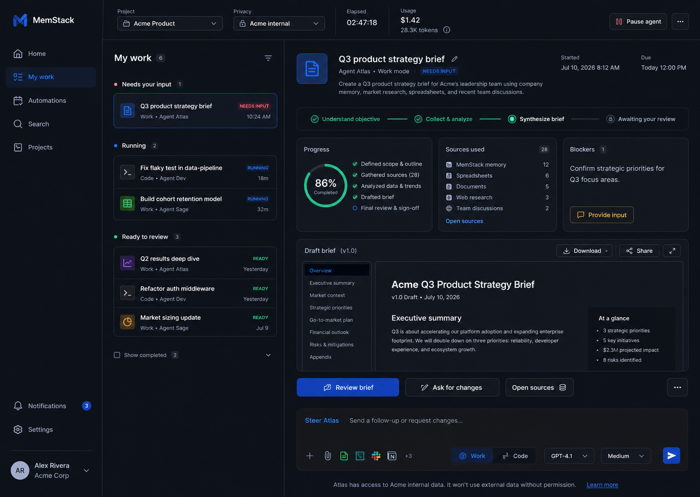
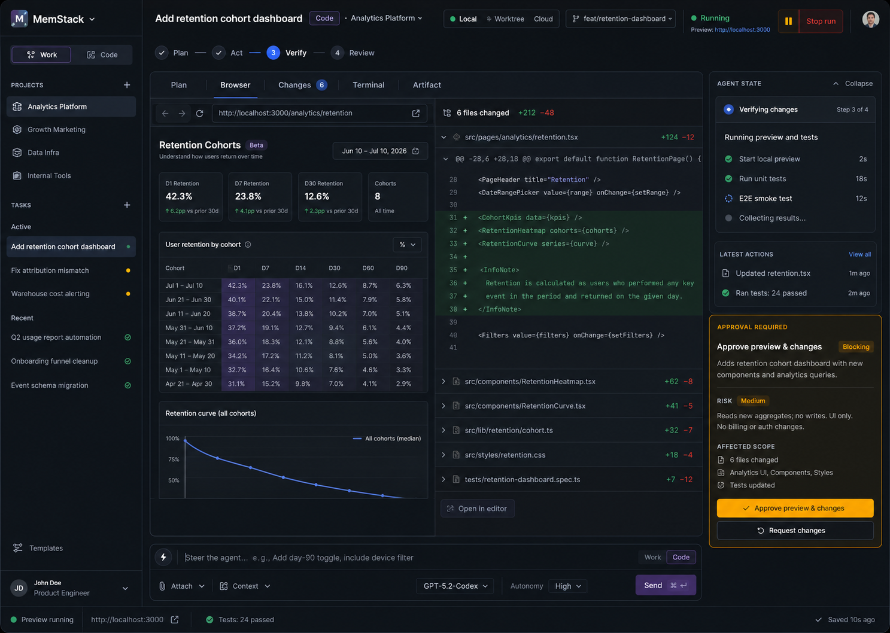

# MemStack Desktop UI/UX 设计规范

版本：v1.1
基准画布：1440×1024
最低支持：1280×800
主题：Dark first，Light theme 进入 P1

## 1. 设计原则

### 1.1 先回答状态，再展示过程

用户进入任何任务后，应在 3 秒内回答：它是否在运行、是否需要我、在哪里执行、上次更新是什么时候。Timeline 不能用动画代替权威状态。

### 1.2 工作表面优先于聊天

聊天用于表达意图、解释和调整。Document、Data、Browser、Changes、Terminal、Preview 和 Artifact 才是主要协作表面。

### 1.3 一个任务，一个当前决策

同一时刻只突出一个当前必须处理的 Decision。其他审批进入队列，避免页面同时出现多个同权重 CTA。

### 1.4 环境永不隐身

Code Task 的 Local / Worktree / Cloud、Branch、Checkout 和 Preview 地址永久可见。Work Task 的 Project、Privacy scope 和外部数据范围永久可见。

### 1.5 高级能力渐进呈现

非开发者默认只看到目标、来源、进度、产物和审批；开发者可以展开终端、工具事件、Execution ID 和资源数据。

## 2. 视觉基础

### 2.1 色彩 Token

- `--desktop-bg`: `#080C12`
- `--desktop-panel`: `#0F141D`
- `--desktop-panel-2`: `#151A24`
- `--desktop-border`: `#242B36`
- `--desktop-border-soft`: `#1B222E`
- `--desktop-text`: `#E7EDF6`
- `--desktop-muted`: `#9AA5B5`
- `--desktop-faint`: `#687386`
- `--desktop-cyan`: `#38D6FF`
- `--desktop-green`: `#35D399`
- `--desktop-amber`: `#F0B35A`
- `--desktop-red`: `#FF6978`
- `--mode-work`: `#7C6CF2`（仅用于模式识别，禁止渐变）

### 2.2 排版

- UI：Inter、SF Pro、Segoe UI 或系统 Sans。
- Code/Terminal：SFMono-Regular、Menlo、Consolas。
- Body：14px / 20px。
- Secondary：12px / 16px。
- Page title：18px / 24px，600。
- Section title：14px / 20px，600。
- 不使用全大写长标题；状态可使用短 Label。

### 2.3 间距与圆角

- 基础间距：4 / 8 / 12 / 16 / 24 / 32。
- 控件高度：Compact 28，Default 32，Primary 36。
- Composer 最小高度：84；展开上限：220。
- Panel radius：8px；Pill 仅用于 Status / Mode / Filter。
- Shadow 仅用于浮层、菜单、Modal，不用于普通面板。

### 2.4 图标

- 使用一致的 Outline 图标库。
- 16px 为常规、14px 为密集列表、20px 为一级导航。
- 禁止 Emoji、手绘 SVG 和仅靠颜色表达状态。

## 3. 桌面 Shell

### 3.1 左侧 Global Rail

宽度：220–232px；折叠 48px。

结构：

1. Window / Product area
2. Home
3. My Work
4. Automations
5. Search
6. Projects / Tasks
7. Notifications
8. Settings / Account / AI resources

规则：

- 不把 Memory、Artifacts、Runtime 同时作为一级全局导航；它们分别属于 Search、My Work/Task 和 Settings/Environment。
- Models、Skills、Plugins、Agents 归入 Settings 的 AI resources 分区，在设置侧栏内部切换，避免管理入口稀释任务主导航。
- Settings 始终作为独立弹出式窗口覆盖当前工作区，不使用全页路由替换任务；个人菜单提供 Account settings、Switch workspace 和 Sign out 快捷入口。
- Project 展开后显示 Task，不直接复制所有 Canvas Tab。
- Tenant / Project 上下文位于 Settings；Global rail 的内容树使用 Workspace → Conversation。Workspace 根节点可折叠，Conversation 行显示模式与运行状态。
- Running、Needs input、Ready review 使用图标 + 文本/Tooltip，不能只显示彩色点。

### 3.1.1 Workspace → Conversation 树

- Global rail 在主桌面宽度下扩展至约 220px，保证两级标题与状态可读；紧凑窗口约 200px。
- Workspace 行：Chevron、Workspace 图标、名称、Conversation 数量、在线或需关注状态。
- Conversation 行：树连接线、Work/Code/协作图标、标题、状态摘要，以及 Running / Needs input / Ready 的文本或语义图标。
- 点击 Chevron 只展开/折叠；点击 Workspace 名称打开概况；点击 Conversation 打开会话。三种命中区域不得混用。
- 新 Workspace 默认展开；大量 Workspace 时只加载可见/展开节点，保留滚动位置。

### 3.1.2 Conversation Detail

- 页面分为 Session Header、Narrative Thread 与 Work Canvas。桌面宽度下 Thread 约占 40%，Canvas 约占 60%；不增加常驻第三栏。
- Header 展示标题、状态、Understand → Implement → Verify → Review 阶段、环境、权限、模型、耗时、用量和主动作；紧凑宽度按优先级隐藏次要元数据。
- Thread 按真实发生顺序展示用户意图、Agent 决策摘要、关键系统事件、分组工具活动、HITL、当前进度与 Steering 消息。工具组默认收起，摘要必须包含目标、调用数、耗时和结果。
- Composer 固定在 Thread 底部，支持附件、上下文与 Cmd/Ctrl + Enter。Diff 行、文件、来源、产物章节或验证项被点击后生成结构化引用 Chip，随下一条 Steering 消息发送。
- Canvas 使用稳定 Tab。Code：Overview、Plan、Changes、Terminal、Checks；Work：Overview、Plan、Artifact、Sources、Verify。Tab 切换不改变 Conversation 或 Run。
- Changes 使用熟悉的文件 Tab 与红/绿 Diff；支持 `Expand all / Collapse all`，点击任一行加入 `file#lines` 引用。Terminal 支持重新运行验证并显示可追溯结果。
- Artifact 与 Sources 支持章节/来源引用；Verify/Checks 展示完成前必须满足的证据，不以聊天结论替代结构化状态。
- HITL 使用位于 Header 下方的 amber 横幅，说明暂停原因、授权范围和主动作；历史中的原始请求仍保留审计记录。
- 1100×800 下 Global rail 保持 200px、Thread 固定约 355px、Canvas 自适应，Composer、Canvas Tabs 与主动作均可见且无页面级横向溢出。

### 3.2 Task Header

高度：48–56px。

左侧：Task title、Project。
中部：Mode、Environment/Privacy、Branch/Scope。
右侧：State、Elapsed、Usage、Pause/Stop、More。

环境信息可压缩但不可消失。1280 宽度下，Elapsed 与 Usage 进入 More，Mode/Environment 保留。

### 3.3 Command Deck

位于任务底部，默认单行 + 工具行。

第一优先级：输入与 Send/Steer。
第二优先级：Work/Code、Context、Attach。
第三优先级：Model、Autonomy、Tools。

快捷方式：

- `Cmd/Ctrl + K`：命令面板。
- `Cmd/Ctrl + P`：文件/Artifact 快速打开。
- `Cmd/Ctrl + Shift + M`：Work / Code 切换。
- `Cmd/Ctrl + Shift + B`：Browser。
- `Ctrl + Backtick`：Terminal。
- `/`：命令；`@`：上下文；`#`：Issue/对象引用。

## 4. 自适应 Canvas

### 4.1 Work 模式 Tab

- Sources：来源列表、覆盖度、引用状态。
- Browser：研究与网页交互。
- Document：文档/演示/表格编辑或预览。
- Data：表格、图表、Notebook/SQL 结果。
- Artifact：最终产物、版本、导出和分享。

### 4.2 Code 模式 Tab

- Plan：可编辑计划和验收条件。
- Browser：本地 Preview、网页 QA。
- Changes：文件列表、Diff、Comment、Stage/Revert。
- Terminal：任务作用域终端与验证结果。
- Artifact：构建物、测试报告、PR packet、文档。

### 4.3 分屏

- 仅在任务需要同时比较两个表面时出现，例如 Preview + Changes。
- 默认 50/50，可拖拽到 35/65。
- 同一屏不超过两个主 Canvas；第三表面使用 Tab。
- Decision rail 宽度 280–320px，可折叠。

## 5. Timeline

展示：

- User intent
- Editable plan
- Current phase
- Key actions
- Validation results
- Decisions
- Final summary

默认隐藏：

- 完整工具参数
- 重复进度消息
- 原始事件 JSON
- 模型内部推理

Tool activity 以“Search → Edit files → Run tests → Type check”紧凑呈现；点击后在 Drawer 展开日志。

## 6. 关键组件

### 6.1 Task row

字段：Status icon、Task title、Mode、Project/Agent、Last update、Action hint。

优先排序：Needs approval > Needs input > Failed > Ready review > Running > Scheduled > Completed。

### 6.2 Run status

- Running：绿色 + 动词阶段，例如 “Running tests”。
- Paused：Amber + “Paused by Alex”。
- Needs input：Amber + 问题摘要。
- Needs approval：Amber border + 具体动作。
- Ready to review：绿色 + Artifact/Changes 数量。
- Failed：红色 + 最近成功 Checkpoint。
- Disconnected：灰色/红色 + Last heartbeat + Reconnect。

### 6.3 Decision card

结构：Title → What will happen → Risk/Scope → Evidence → Primary/Secondary action。

高风险动作必须在按钮中体现对象，例如：

- “Push 2 commits”
- “Send report to Slack #leadership”
- “Approve 6 file changes”

### 6.4 Artifact viewer

- 左侧只列权威 Artifact 的当前版本；未版本化文件/事件保留在 Activity，并标注不可审批。
- 主区域显示稳定 Artifact identity、不可变 Version、审查 Revision、Location、MIME、大小和创建时间；版本选择器可回看 Superseded/Delivered 历史。
- 顶部使用 Ready → Approved → Delivered 三段状态轨迹；Superseded 单独标注，不把 Run Completed 映射为 Delivered。
- Sources 与 Checks 来自结构化后端字段；为空时直接显示缺失，不以聊天摘要或文件扩展名补全。
- 底部按状态显示具体动作：Ready 显示 Request changes / Approve version；Approved 显示 Request changes / Deliver approved version；Delivered 与 Superseded 只读。
- Request changes 展开内联反馈框并绑定 Artifact Version + Run Revision；提交后当前版本显示反馈记录，关联 Run 回到 Running。
- Deliver 成功后在同一详情面显示 Delivery receipt（Destination、Path、Bytes、Actor、Time）；物理文件缺失或 Revision 冲突时保留 Approved 并显示错误。
- Artifact 支持 Draft、Ready、Approved、Delivered、Superseded，且所有动作均以 `artifact_version_id + revision` 为身份边界。

### 6.5 Environment switcher

选项：Local、Worktree、Cloud。

每项描述结果而非技术名词：

- Local：直接使用当前目录，可能影响你的工作副本。
- Worktree：为此任务创建隔离副本。
- Cloud：在远程隔离环境运行，本机可关闭。

交互规则：

- Code 新任务默认推荐 Worktree；Work 任务使用 Local，且不显示无法兑现的 Worktree 选择。
- 选择发生在 Plan Review 前，但 Worktree 仅在 Approve & start 成功后物化；Review 面板明确说明此时尚未创建目录。
- Local 必须提示“直接使用当前工作副本”；Worktree 必须提示“创建隔离 Branch 与目录”。Cloud 未接入时显示不可用原因，不能提交假配置。
- Run 创建后 Header 和 Terminal Canvas 固定显示 Environment label、Branch、实际工作目录与 Run ID；这些字段来自权威 Run，不从标题或路径文本推断。
- 切换前预览未提交变更、Branch、依赖设置和 Handoff 步骤。已运行的 Run 不允许原地切换 Environment，必须新建 Run 或使用显式恢复动作。

### 6.6 Settings rail 与 AI resources

- 位于独立 Settings 窗口左侧，桌面宽度 180–210px；窗口标题栏固定显示当前 Tenant / Project、搜索和关闭按钮。
- Settings rail 先显示 Account、Workspace，再显示 General、Appearance、Notifications，最后显示 AI resources：Models、Skills、Plugins、Agents；资源项显示 Icon、名称、用途摘要和数量。
- 选中态使用 2px Cyan 左标记、深色填充和文字高亮；不只依赖颜色，必须保留名称与语义图标。
- 底部固定 Governance note，提示配置版本化与可审计。

### 6.10 Login 与 Workspace context

- Login 使用独立双栏布局：左侧说明产品信任与恢复承诺，右侧提供 Workspace SSO 与邮箱登录；不在主 Shell 内嵌登录表单。
- 邮箱、密码、显示/隐藏密码、受信任设备和错误消息都有明确 Label；提交期间主按钮显示进行中状态并禁止重复提交。
- Settings → Workspace 使用“1 选择 Tenant → 2 选择 Project”的显式顺序。选择 Tenant 后只展示其项目，不允许跨 Tenant 组合。
- 当前与待应用上下文同时可见；切换只在底部固定的 Switch workspace CTA 后生效。
- 退出登录位于个人菜单和 Settings → Account，属于危险但可逆动作，使用文字说明而非仅红色图标。

### 6.7 Resource catalog

- 宽度 244–282px；结构为标题/Add、Search、All/Active/Attention、排序、资源列表。
- 每行显示统一字段：Icon、Name、Description、Version/meta、Status；Models 入口的 Catalog 行改为 Provider、Connection type、Enabled model count 和 Connection status。状态使用 Dot + Label。
- 列表支持搜索、状态过滤、选中态和空结果；不可把不同资源的专用字段强塞入同一列。

### 6.8 Resource detail

- 顶部 48px：Breadcrumb、Scope、Copy link、当前主动作。
- Identity：类型、名称、描述、Status、Tags、Owner/Provider。
- Skills、Plugins、Agents 使用 Overview + 3 个专用 Tab；Models 使用 Provider 专用的 Overview、Connection、Models、Routing、Usage 五个 Tab，避免把凭据、模型目录和工作区策略塞入同一表单。
- Overview 先显示 3–4 个关键指标，再显示依赖/路由/权限关系。
- Edit 状态必须显式进入，Save 后返回只读并显示成功反馈；配置变更提示“创建新的审计版本”。

### 6.9 类型专用内容

- Models：一级对象为 Provider。Overview 汇总连接健康、已启用模型和工作区路由；Connection 管理 Auth method、Credential reference、Base URL、API mode、Headers、Timeout 与 Test connection；Models 管理发现、搜索、启停和手动 Model ID；Routing 管理 Default / Fast / Coding / Vision 与 Fallback chain；Usage 显示 Success、Latency、Spend 和连接事件。
- Skills：Overview、Instructions、Validation、Versions；突出 Skill contract、Allowed tools、Validation pass 和版本。
- Plugins：Overview、Permissions、Tools、Activity；突出 Publisher、Install/Update/Disable、数据权限和工具清单。
- Agents：Overview、Behavior、Capabilities、Evaluations；突出 Model routing、Memory boundary、Autonomy、Skills 与 Plugin dependencies。

## 7. 屏幕清单

### S01 Home / Today

- 今日需要处理、正在运行、可恢复任务。
- 最近 Projects 和推荐自动化。
- 主 CTA：New task。

### S02 My Work

- Needs input、Needs approval、Running、Ready review。
- Work/Code 混合队列。
- 过滤 Project、Mode、Owner、Status。

### S03 New Task

- **S03A Describe task**：Goal、Project、Work/Code、Context、Environment/Privacy；明确提示“Agent 尚未执行”。
- **S03B Agent planning**：展示 Agent 正在理解目标、读取获准上下文、选择执行路径和准备 Review packet；Authority 固定为 Plan only。
- **S03C Human plan review**：逐步展示步骤、每步产物和时间；支持编辑、禁用、增补、Ask agent to revise。
- 右侧 Run Preview 固定显示预计耗时、Usage、上下文、执行边界和授权摘要。
- 主 CTA 为 Approve & start task；批准前不创建 Run、不运行工具、不修改文件。
- 高级设置默认折叠。

### S04 Quick Chat

- 无正式 Run/环境。
- CTA：Create task from this chat。

### S05 Work Task - Running

- Sources + Timeline + Draft Artifact。
- 显示来源覆盖与当前阶段。

### S06 Work Task - Needs Approval

- Browser/Document 旁显示外部写操作审批。

### S07 Work Task - Ready Review

- Artifact 为主，Review / Ask changes / Export。

### S08 Code Task - Planning

- Plan、验收标准、Environment/Branch。
- CTA：Approve plan and run。

### S09 Code Task - Running

- Timeline + Changes/Terminal/Preview。
- Pause/Stop 永久可见。

### S10 Code Task - Needs Approval

- Diff/Preview + Risk + Affected scope。

### S11 Code Task - Ready Review

- Files changed、Tests、Findings、Commit/PR actions。

### S12 Recover / Reconnect

- Banner 显示 Last heartbeat、来源 Run ID、Revision、Environment、Branch 与最近成功 Checkpoint。
- `Reattach` 为首选恢复动作：继续同一 Run 与同一工作目录；按钮旁说明不会重复已完成步骤。
- `Fork recovery` 为次要动作：新建隔离 Run/Worktree，并明确“从最后 Git HEAD 创建；未提交与未跟踪内容不会自动复制”。
- 原工作目录不可验证时禁用 Reattach，并就地显示原因；Fork 成功后 Session Header 切换到新 Run，来源 Run 保持只读可追溯。
- Inspect status 展开结构化诊断与可复制错误，不与 Reattach/Fork 共享含糊的 Retry 文案。

### S13 Automations

- Name、Project、Trigger、Environment、Last run、Next run、Permission profile。

### S14 Search / Memory

- 跨 Task、Thread、Artifact、Source、Entity。
- 显示来源、Project、时间和可用范围。

### S15 Settings / General / Governance

- Language、Region、Appearance、Notifications、Browser、Terminal、组织 Permissions、Memory、Retention、Usage；资源管理位于同一 Settings rail 的 AI resources 分区。

### S16 Settings / Models

- Provider Catalog 显示 Connection type、Enabled model count、Connected / Needs model filter / Offline。
- Overview 显示 Provider health、Auth method、Endpoint、Last verified、Enabled models 与当前 Workspace routing。
- Connection 支持 OAuth、API Key、Environment secret、No authentication；默认隐藏 API mode、Headers、Timeout 等高级字段；保存前必须 Test connection。
- Models 优先调用 `/models` 自动发现，支持搜索与 Enable / Disable；发现不可用或目录过大时支持手动 Model ID。
- Routing 独立配置 Default、Fast、Coding、Vision 和有序 Fallback；Provider 保存成功不自动改写 Routing。
- 主动作：Add provider；三步向导为 Choose provider → Authenticate & verify → Enable models。

### S17 Settings / Skills

- 目录显示 Published / Draft / Test failed、版本和工具数量。
- Detail 显示 Skill contract、Instructions、Allowed tools、Validation 与 Versions。
- 主动作：Run validation；Create skill 先进入 Draft。

### S18 Settings / Plugins

- 目录显示 Connected / Update available / Not installed。
- Detail 显示 Permissions、Tools、Activity、Publisher 和 Agents using。
- 主动作根据状态为 Install plugin / Update plugin / Disable plugin。

### S19 Settings / Agents

- 目录显示 Active / Paused、默认 Model 和 Skill 数量。
- Detail 显示 Model routing、Memory boundary、Autonomy、Skills、Plugin dependencies 和 Evaluations。
- 主动作：Pause agent / Enable agent；Create agent 先创建 governed draft。

### S20 Login

- Workspace SSO 为首选动作，邮箱登录为替代路径。
- 支持密码显隐、受信任设备、错误提示、提交中和登录成功状态。
- 不展示真实凭据示例；密码管理与 SSO 支持作为次级链接。

### S21 Settings / Account & Workspace

- Account 显示用户身份、登录方式、当前组织、受信任会话和 Sign out。
- Workspace 显示当前 Tenant / Project，并按顺序选择 Tenant 与 Project。
- 主动作：Switch workspace；未改变选择时禁用或弱化，切换后关闭设置并进入所选 Project。

### S22 Workspace Overview

- Header：Tenant / Project、Workspace 名称、在线/归档状态、描述、Configure 与 New task。
- Root goal：目标、协作模式、证据边界、更新时间。
- 状态摘要：Active sessions、Needs attention、Members、Active agents。
- 系统摘要：Project knowledge、Workspace Agent roster、Execution environment；Project knowledge 必须说明为项目级共享。
- Recent sessions：按状态展示并可直接打开；Recent activity 显示 Task、Agent、Memory、Artifact 与 Verification 事件。
- 空状态使用真实缺省文案，如“尚未创建目标/会话”，不得伪造运行数字。

## 8. 空、错、慢状态

### 空状态

- 不展示功能清单；只解释当前页面的任务与一个主动作。
- My Work 空：说明“没有等待你的任务”，可查看 Running 或 New task。
- Project 空：New task、Add sources、Connect repository 三选一，按 Project 类型推荐。

### 加载状态

- Shell 先出现，Task Header 与权威状态优先加载。
- Canvas 可延迟；显示具体 “Loading diff / Reconnecting terminal”。
- 不用无限旋转动画掩盖失联。

### 失败状态

- 显示发生位置、最近成功 Checkpoint、是否有副作用、推荐恢复动作。
- Retry 与 Fork recovery 分离。
- Error detail 可复制但默认折叠。

## 9. 响应式与窗口尺寸

### ≥ 1440px

Global rail + Timeline/Queue + Canvas + 可选 Decision rail。

Settings 作为居中独立窗口，最大宽度约 1180px、最大高度约 820px；Settings rail 约 200px，偏好页使用单内容区，AI resources 使用 Catalog 282px + Detail 自适应。

### 1280–1439px

Global rail 可折叠；Timeline 和 Canvas 二选一主宽，Decision 使用 Drawer。

### 1024–1279px（非主支持）

单主 Canvas；Timeline 变为可切换 Tab；Command deck 简化 Model/Autonomy 到菜单。

不得在小窗口中把关键状态、Environment、Pause/Stop 或审批 CTA 隐藏到无法发现的位置。

Settings 在 1100px 宽度下保留 14px 外边距并压缩 Settings rail；AI resources 的 Catalog 为 244px，Detail 的 Owner/Provider 侧栏隐藏，关系卡改为单列；Workspace 的两步选择允许纵向滚动，底部 Switch workspace CTA 固定可见。Breadcrumb、状态与主动作继续可见。

### 9.1 国际化

- 首期支持 `en` 与 `zh-CN`，入口位于 Settings → General → Language。
- 语言切换即时生效并按设备持久化，同时更新根文档 `lang`。
- 内部导航、Category、Tab、Resource 与 Run 状态使用稳定 ID；禁止以翻译后的可见文案作为状态判断或路由键。
- 用户生成内容、模型名称、文件名、代码与第三方品牌不强制翻译；Shell、设置、资源管理动作、状态与辅助文案必须翻译。
- 中文界面保持原有高密度桌面节奏，组件允许自然换行但不得压缩核心 CTA 或状态标签。

## 10. 可访问性

- WCAG 2.2 AA 对比度。
- 所有交互可用键盘完成，Focus ring 不被移除。
- Status icon 有可读 Label；颜色不是唯一通道。
- Canvas Tab、Task row、Decision 使用正确语义角色和 `aria-live` 策略。
- 流式更新不持续抢占屏幕阅读器；只播报阶段和需要用户行动的状态。
- 动画支持 Reduce Motion。
- Diff 支持新增/删除符号与文本，不只用红绿底色。
- 表格、文档和图表提供替代文本或数据表。

## 11. 文案规范

- 用结果动词：Review brief、Approve changes、Reconnect task。
- 避免含糊词：Continue、Proceed、Working、Thinking。
- 状态包含主体：Paused by you、Waiting for Agent、Needs your input。
- 环境术语首次出现附解释；后续保留短 Label。
- 风险说明写影响，不写恐吓文案。
- 中文界面保留必要技术词：Worktree、Branch、Commit、PR，但提供 Tooltip。

## 12. 三套视觉方向

### 方向 1：Adaptive Task Canvas

特点：Task 为核心；Timeline 与 Changes 并列；最适合高频交互和当前客户端渐进迁移。

### 方向 2：My Work Mission Control

**评审结论：已选为桌面客户端主方向。**

特点：队列和 Artifact 为核心；最适合跨项目监督、知识工作和 Reviewer。

### 方向 3：Shared Workspace Deck

特点：Canvas 为核心；Preview、Changes、Terminal 和 Artifact 协同最强，适合产品工程混合任务。

## 13. 视觉方向评审标准

- 通用用户是否能在 10 秒内找到下一步。
- 开发者是否能确认 Environment、Branch 和变更范围。
- 是否能区分 Task、Thread 和 Run。
- 是否优先展示 Artifact / Changes，而不是日志。
- 审批是否与证据同屏。
- 1280×800 是否仍保留核心 CTA。
- 是否可以复用现有组件并渐进迁移。

已依据主方向完成可交互高保真原型，覆盖 Work / Code 的 Running、Needs input、Ready review、审批、来源、代码变更、终端和 Steer，以及 Settings 内 S16–S21 的 Account、Workspace、Models、Skills、Plugins、Agents 工作台与 S22 Workspace Overview。原型新增 Workspace SSO/邮箱登录、受信任会话、独立 Settings 弹窗、Tenant → Project 两级切换、Workspace → Conversation 树，以及 English / 简体中文即时切换与本地持久化；后续生产实现继续补齐真实认证、权限校验、服务端上下文切换与离线恢复。
